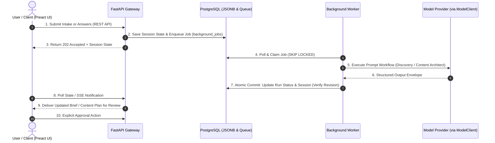

<div align="center">

# OryxenAI

### Intelligent Multi-Stage Portfolio Planning Engine

*Transform raw user intent into an approved Discovery brief and an architectural Content blueprint.*

[](https://www.python.org/)
[](https://fastapi.tiangolo.com/)
[](https://www.postgresql.org/)
[](https://preactjs.com/)
[](https://vitejs.dev/)

[](https://astral.sh/ruff)
[](https://mypy-lang.org/)
[](https://www.docker.com/)
[](file:///c:/Users/Yash%20Srivastava/Desktop/01_Projects/OryxenAI/AGENTS.md)

<br/>

[Quickstart](#quickstart) • [Architecture](#system-architecture) • [API Routes](#api-reference) • [Verification](#quality-gate--testing) • [AI Agent Context](file:///c:/Users/Yash%20Srivastava/Desktop/01_Projects/OryxenAI/AGENTS.md)

</div>

---

> [!NOTE]
> **Canonical AI Context:** AI coding assistants (Claude Code, OpenAI Codex, Google Antigravity, Cursor) must read [`AGENTS.md`](file:///c:/Users/Yash%20Srivastava/Desktop/01_Projects/OryxenAI/AGENTS.md) first. For historical decisions, see [`DECISIONS.md`](file:///c:/Users/Yash%20Srivastava/Desktop/01_Projects/OryxenAI/DECISIONS.md); for append-only change logs, see [`CHANGES.md`](file:///c:/Users/Yash%20Srivastava/Desktop/01_Projects/OryxenAI/CHANGES.md).

---

## Overview

**OryxenAI** is an authenticated, asynchronous portfolio-planning engine with two explicit, reviewable stages:

```
┌─────────────────────────────────┐       ┌─────────────────────────────────┐
│       Stage 1: Discovery        │  ──►  │    Stage 2: Content Architect   │  ──►  Workflow
│ Intake ➔ Adaptive Q&A ➔ Approval│       │ Plan ➔ Write ➔ Integrate ➔ Plan │       Complete
└─────────────────────────────────┘       └─────────────────────────────────┘
```

1. **Stage 1 (Discovery):** Captures user intent, resumes, or project materials, conducts targeted adaptive questions, and produces a structured markdown brief requiring explicit approval.
2. **Stage 2 (Content Architect):** Consumes the approved Discovery dossier and produces a multi-page content architecture, site map, and content plan requiring final user sign-off.
3. **Workflow Boundary:** The active product and API flow strictly ends after content approval. OryxenAI does not serve or generate a live portfolio website.

---

## Core Capabilities

| Capability | Technical Design |
| :--- | :--- |
| **Durable PostgreSQL Queue** | Zero Redis or Celery dependencies. Background jobs run via PostgreSQL `SELECT ... FOR UPDATE SKIP LOCKED` with automatic lease reclamation and exponential backoff retry. |
| **Optimistic Concurrency** | Aggregate session state in `portfolio_sessions.current_state` (JSONB) uses monotonically increasing `revision` counters to prevent stale worker results from overwriting newer user changes. |
| **Provider-Neutral Model Engine** | Model execution is routed through an abstracted `ModelClient` configured via [`config/models.toml`](file:///c:/Users/Yash%20Srivastava/Desktop/01_Projects/OryxenAI/config/models.toml) supporting Anthropic Claude, OpenAI, and deterministic offline mock fixtures. |
| **Owner-Scoped Security** | Strict authorization boundaries guarantee tenants only access their own portfolio sessions, while administrative identities retain auditing and archival cleanup capabilities. |
| **Immutable Run Ledgers** | Every agent operation records complete input envelopes, `state_before`, model execution metrics, `state_after`, and error states in the append-only `agent_runs` table. |

---

## System Architecture



---

## Repository Structure

```text
src/oryxenai/
├── api/routes/          # REST endpoints (health, identity, sessions, discovery, content)
├── agents/
│   ├── shared/          # ModelClient boundary, agent registry, executor contracts
│   ├── discovery/       # Stage 1: Intake parsing, adaptive questions, brief generation
│   └── content_architect/ # Stage 2: Planning, page drafting, and content integration
├── auth/                # Supabase / Argon2 identity, tenant entitlements, worker fencing
├── core/                # Application configuration (TOML), logging, lifespans
├── db/                  # SQLAlchemy 2.0 Async engine, models, and repositories
├── jobs/                # Durable queue worker, heartbeat recovery, handler registry
├── web/                 # FastAPI product web shell and static asset delivery
└── storage/             # Archival cleanup and retention interfaces
frontend/                # Authenticated Preact + TypeScript + Vite product client
config/                  # Committed non-secret TOML settings (app.toml, models.toml)
migrations/              # Alembic database schema migrations
scripts/                 # Cross-platform development and deployment automation
tests/                   # Unit, API, integration, and worker test suites
```

---

## Quickstart

### Prerequisites
* **Python 3.13+** and [`uv`](https://docs.astral.sh/uv/) installed
* **PostgreSQL 16+** (Native or Docker)
* **Node.js 20+** & npm (only required when building the frontend client)
* **Docker Desktop** (optional, for Compose mode)

### 1. Configuration & Secrets

Secrets reside strictly in the git-ignored root `.env` file. Non-secret application configuration lives under [`config/`](file:///c:/Users/Yash%20Srivastava/Desktop/01_Projects/OryxenAI/config/).

```powershell
# Copy template placeholders
Copy-Item .env.example .env

# Edit .env to set your database password (and optional provider API keys)
```

> [!TIP]
> Standard test suites and local development use the deterministic mock model client. No paid API keys are required to build or test the platform.

---

### 2. Running Locally

#### Option A: Windows PowerShell (Native)

```powershell
# 1. Install dependencies & initialize virtualenv
.\scripts\bootstrap.ps1

# 2. Align local database and apply migrations
.\scripts\run-native.ps1 align-db
.\scripts\run-native.ps1 migrate

# 3. Start API and background worker concurrently
.\scripts\run-native.ps1 dev
```

*The product workspace is served at **http://127.0.0.1:8000/app**.*

#### Option B: Linux / macOS (Native)

```bash
# 1. Install dependencies
uv python install 3.13
uv sync --frozen

# 2. Make scripts executable and launch
chmod +x scripts/*.sh
./scripts/run-native.sh align-db
./scripts/run-native.sh migrate
./scripts/run-native.sh dev
```

#### Option C: Docker Compose

```bash
# Spin up PostgreSQL, run one-shot migrations, and start API + Worker
docker compose up --build -d

# Inspect running services
docker compose ps
```

*API runs on host port `8000`. PostgreSQL is mapped to host port `5544` (container `5432`).*

---

## API Reference

The interactive OpenAPI schema is served at `/docs` in development mode.

| Method | Path | Scope | Purpose |
| :---: | :--- | :---: | :--- |
| `GET` | `/health/live` | Public | Process liveness probe |
| `GET` | `/health/ready` | Public | Database and dependency readiness check |
| `GET` | `/api/v1/me` | Authenticated | Resolve authenticated identity and tenant roles |
| `PUT` | `/api/v1/me/username` | Authenticated | Claim or update onboarding username |
| `GET` | `/api/v1/agents` | Authenticated | List registered agent capabilities |
| `POST` | `/api/v1/sessions` | Authenticated | Initialize an owner-scoped portfolio session |
| `GET` | `/api/v1/sessions` | Authenticated | List owned portfolio sessions |
| `GET` | `/api/v1/sessions/{id}` | Authenticated | Retrieve current session state and revision |
| `GET` | `/api/v1/sessions/{id}/runs` | Authenticated | List execution history and runs for session |
| `POST` | `/api/v1/sessions/{id}/runs/mock` | Admin | Execute deterministic mock run for development |
| `GET` | `/api/v1/sessions/{id}/discovery` | Authenticated | Fetch active Discovery state and brief |
| `POST` | `/api/v1/sessions/{id}/discovery/start` | Authenticated | Ingest intake materials and enqueue Discovery |
| `PUT` | `/api/v1/sessions/{id}/discovery/answers` | Authenticated | Submit answers to adaptive interview questions |
| `POST` | `/api/v1/sessions/{id}/discovery/revise` | Authenticated | Request targeted revisions to the Discovery brief |
| `POST` | `/api/v1/sessions/{id}/discovery/approve` | Authenticated | Explicitly approve Discovery brief (locks stage) |
| `GET` | `/api/v1/sessions/{id}/content-architect` | Authenticated | Fetch active Content Architect plan |
| `POST` | `/api/v1/sessions/{id}/content-architect/start` | Authenticated | Start Content Architect from approved Discovery |
| `POST` | `/api/v1/sessions/{id}/content-architect/revise` | Authenticated | Request revision on content plan |
| `POST` | `/api/v1/sessions/{id}/content-architect/approve` | Authenticated | Explicitly approve content plan (end of workflow) |

---

## Quality Gate & Testing

OryxenAI enforces strict linting, type-checking, and test isolation.

### One-Command Sanity Suite
```powershell
.\scripts\check.ps1    # Runs ruff check, ruff format check, and mypy
.\scripts\test.ps1     # Runs all pytest suites against test DB
.\scripts\doctor.ps1   # Validates database connectivity and configuration
```

### Granular Commands
```bash
# Code Quality & Typing
uv run ruff check .               # Linting
uv run ruff format .              # Code formatting
uv run mypy src                   # Static typing

# Test Suites
uv run pytest tests/unit          # Pure unit tests (no DB required, < 2s)
uv run pytest tests/api           # HTTP endpoint contract tests
uv run pytest tests/integration   # PostgreSQL repository tests (uses oryxenai_test)
uv run pytest tests/worker        # Queue claim, retry, and worker lifecycle tests

# Database Migrations
uv run alembic upgrade head       # Apply pending migrations
uv run alembic current            # Inspect current database revision
```

---

## Technical In-Depth & Operations

<details>
<summary><strong>Optimistic Session Revision & Concurrency Details</strong></summary>

<br/>

OryxenAI stores the current aggregate product state inside `portfolio_sessions.current_state` (PostgreSQL `JSONB`). To prevent race conditions between asynchronous worker completions and real-time user edits:

1. Every write operation checks the session's integer `revision` column.
2. Background workers capture `revision` when a job is claimed.
3. Upon task completion, the worker writes the result only if `revision == expected_revision`.
4. If a user updated state while the agent was running, the worker's result is flagged as stale and archived into `agent_runs` without overwriting newer user work.
</details>

<details>
<summary><strong>Extending with Future Agents</strong></summary>

<br/>

To register a new agent in the system:
1. Define the agent enum in `src/oryxenai/agents/shared/contracts.py` (`AgentKey`).
2. Create package `src/oryxenai/agents/<agent_name>/` containing:
   - `agent.py`: Conforming to `Agent` protocol (`async def run(context) -> AgentResult`).
   - `schemas.py`: Input/output Pydantic schemas.
   - `prompts/`: Versioned Markdown prompt templates.
   - `samples/`: Deterministic mock `input.json` and `output.json`.
3. Register the agent inside `default_registry()` in `src/oryxenai/agents/shared/registry.py`.
4. All automated tests for the agent must reside under `tests/` (never inside the agent source directory).
</details>

<details>
<summary><strong>Troubleshooting Guide</strong></summary>

<br/>

### Database Connection Refused
* Verify PostgreSQL is active: `docker compose ps` or local service status.
* Check host port: Docker maps host `5544` &rarr; container `5432` to avoid local PostgreSQL port collisions. Ensure `config/app.toml` matches your target host port.

### Port `5432` or `8000` Collision
* In native development mode, if local PostgreSQL is already bound to `5432`, set overrides in `.env` without modifying committed TOML:
  ```ini
  DB_HOST_OVERRIDE=127.0.0.1
  DB_PORT_OVERRIDE=5545
  ```

### Missing Model Credentials
* The application and worker start cleanly without real provider API keys. Standard mock runs and unit/integration tests operate fully offline.
* For live model executions, populate the environment variable specified in [`config/models.toml`](file:///c:/Users/Yash%20Srivastava/Desktop/01_Projects/OryxenAI/config/models.toml) (e.g., `ANTHROPIC_API_KEY` or `OPENAI_API_KEY`).
</details>

---

## Ecosystem & Documentation Index

* [`AGENTS.md`](file:///c:/Users/Yash%20Srivastava/Desktop/01_Projects/OryxenAI/AGENTS.md) — Canonical instructions for Claude Code, OpenAI Codex CLI, and Antigravity.
* [`DECISIONS.md`](file:///c:/Users/Yash%20Srivastava/Desktop/01_Projects/OryxenAI/DECISIONS.md) — Architecture decision records and rejected alternatives.
* [`CHANGES.md`](file:///c:/Users/Yash%20Srivastava/Desktop/01_Projects/OryxenAI/CHANGES.md) — Append-only chronological release and change history.
* [`docs/architecture.md`](file:///c:/Users/Yash%20Srivastava/Desktop/01_Projects/OryxenAI/docs/architecture.md) — Architectural rationale and design principles.
* [`docs/run/run.md`](file:///c:/Users/Yash%20Srivastava/Desktop/01_Projects/OryxenAI/docs/run/run.md) — Operational runbook for production and local environments.
* [`docs/deployment/`](file:///c:/Users/Yash%20Srivastava/Desktop/01_Projects/OryxenAI/docs/deployment/) — Infrastructure, Docker Compose, and Azure VM operations.

---

<div align="center">
  <sub>Built with Python 3.13, FastAPI, PostgreSQL, and Modern Agentic Design Principles.</sub>
</div>
