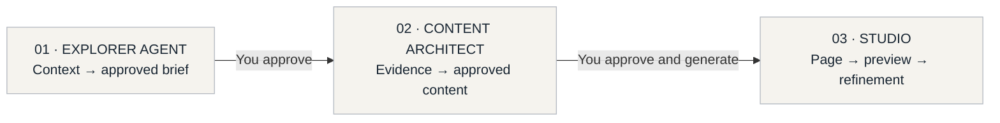
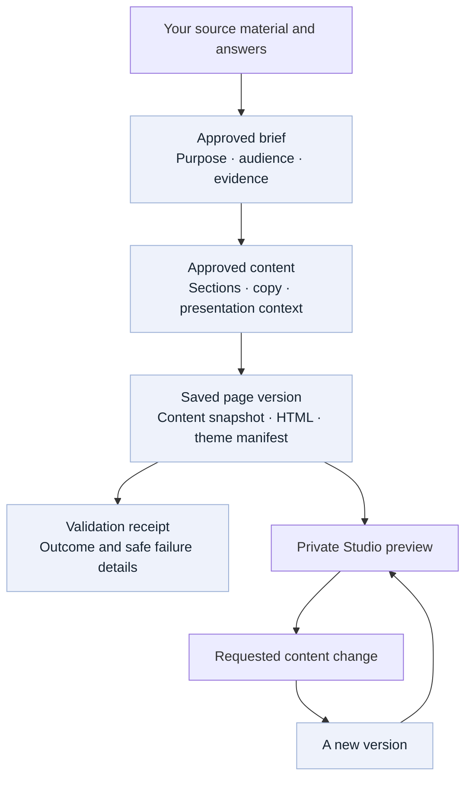

# Your story, made tangible.

**An AI-assisted portfolio workspace with a memory, a review process, and a private Studio.**

[Open OryxenAI ↗](https://app.oryxenai.me) &nbsp; · &nbsp; [The experience](#one-story-three-deliberate-stages) &nbsp; · &nbsp; [The artifacts](#the-work-leaves-artifacts) &nbsp; · &nbsp; [The engineering](#built-as-an-application)

 

## A résumé is a starting point. A portfolio needs a point of view.

Your background arrives in fragments: roles, project notes, achievements, unfinished ideas, and an audience you want to reach. Making a portfolio means deciding which details matter, connecting them into a coherent story, and finding a presentation that feels like you.

**OryxenAI brings that work into one authenticated workspace.** The Explorer Agent helps you explore your background and purpose. Content Architect turns approved material into a portfolio narrative. Studio brings the narrative into a generated page, with a private preview and a conversation for content changes.

The interesting part is what happens between those steps. Conversations become persistent artifacts. Approval becomes a real workflow boundary. A page becomes a saved version you can inspect and restore. The application keeps the thread while you make the decisions.

### Start with context, not a perfect prompt

> **Illustrative starting prompt**
>
> “I’m a backend engineer moving toward AI product work. Here are my résumé and project notes. Help me explain the problems I solved and who benefited. Ask about missing evidence, keep the claims supported by my material, and shape a portfolio for a hiring manager. I want a calm editorial style, with the most relevant work first.”

You can bring rough notes instead. The conversation clarifies useful gaps before producing a brief. This example illustrates an input; it does not imply a sample achievement or a guaranteed output.

 

## One story. Three deliberate stages.

| Stage | What you experience | What carries forward |
| :--- | :--- | :--- |
| **Explorer Agent** | Share source material, answer focused questions, review your positioning, and revise the brief. | An approved brief and structured context grounded in your background. |
| **Content Architect** | Review the introduction, work, experience, and other sections suited to your story. | Approved page content and a coherent plan for the selected presentation. |
| **Studio** | See the generated portfolio beside a chat, request content changes, and revisit saved versions. | A private page preview with a version history. |

**Progress is explicit.** Each stage gives you a review point. Approving the content and starting generation can happen through one deliberate button action; the API does not autonomously move a session through the stages.

### A Studio for refinement

Choose a visual direction, see your approved content in that design, and refine the wording without starting over. A request such as “make the introduction more direct” works within the content editing experience. Unsupported layout or styling changes are explained rather than silently applied.

Earlier successful versions remain available for restoration, subject to privacy restrictions. A failed attempt does not replace the working page. That distinction lets you experiment while keeping a useful result close at hand.

 

## The work leaves artifacts

OryxenAI treats useful intermediate work as part of the product. The brief is reviewable. The content plan is approvable. The generated page has a saved content snapshot and a record of its validation. These are real application artifacts backed by the application's database.

| Artifact | Why it matters |
| :--- | :--- |
| **Brief and source context** | Preserve the intent and facts that the portfolio should represent. |
| **Content plan and page content** | Make the narrative reviewable before it becomes a page. |
| **Page bundle and manifest** | Connect generated HTML to the pinned theme assets that define its presentation. |
| **Version snapshots** | Keep successful results available for restoration. |
| **Receipts and failure records** | Separate a successful result from an unsuccessful attempt and provide safe diagnostic context. |

PostgreSQL stores session state, structured content, generated HTML, version metadata, and execution records. Immutable theme packages supply the reviewed styles, fonts, and permitted scripts. Together, they connect the conversational work to a reproducible page version.

 

## Built as an application

A production application has to handle more than a successful model response. It needs to remember sessions, isolate owners, survive background execution, reject stale updates, and present failures without losing good work. Those concerns shape this repository.

| Layer | Technology | Responsibility |
| :--- | :--- | :--- |
| **Product frontend** | Preact · TypeScript · Vite | The authenticated journey, review surfaces, progress states, and Studio conversation beside the preview. |
| **Application backend** | Python · FastAPI · Pydantic | Owner-scoped operations, structured validation, workflow boundaries, and preview serving. |
| **Persistence** | PostgreSQL · JSONB · async SQLAlchemy · Alembic | Session state, durable jobs, content snapshots, versions, and schema evolution. |
| **AI orchestration** | Configured model profiles and a provider-neutral client | Distinct planning and generation responsibilities with structured outputs. |
| **Quality tooling** | Pytest · Vitest · Playwright · Ruff · mypy | Deterministic tests, interface checks, browser coverage, and code quality gates. |
| **Delivery** | Docker · GitHub Actions · Render configuration | Reproducible runtime packaging, CI checks, readiness checks, and an explicitly controlled deployment branch. |

### Sessions with continuity

Session management connects intake, answers, approvals, runs, and page versions to their owner. Persistent state lets a user return to the workspace. Revision checks prevent a late background result from overwriting newer changes. Authentication and ownership checks protect the boundary between one person's portfolio and another's.

### Background work with accountability

Long-running operations run through a durable PostgreSQL job queue. Workers claim work, maintain leases, and fence stale execution. The product can show progress and retain run history while the work happens outside the request that started it. A failed portfolio build is reported for an explicit user retry; infrastructure job recovery is a separate concern.

### Generation with a defined contract

The generated page must fit the selected theme's contract and the approved content. The host controls the document shell and pinned assets. Validation checks the result before it becomes the active version. Studio edits use typed, permitted content operations instead of unrestricted changes to the application.

Real-browser verification is available through a configurable policy: disabled, best effort, or required. The lightweight Render Free configuration disables it. Static validation remains part of the build path. Browser tests and runtime browser verification serve different purposes.

 

## A private preview, with a clear boundary

The Studio displays the generated page in a **sandboxed iframe**. The application serves the page through a signed, expiring preview grant tied to its session and version. Reviewed theme scripts receive only the sandbox permissions they require; the preview does not receive same-origin permission.

The iframe loads the portfolio preview from the application. Model requests happen on the server through configured providers, not inside the iframe. Portfolio links may lead to the owner's approved external destinations, but that is separate from generation.

Preview responses use security headers and restrictive content policies. Generated assets are checked against their pinned package and manifest. Short-lived preview links support private review; they do not constitute public portfolio publishing.

 

## Where the engineering disciplines meet

| Perspective | The question this project addresses |
| :--- | :--- |
| **AI engineering** | How can planning and generation stay grounded in approved context and produce structured, checkable results? |
| **Content development** | How can a person's evidence become a coherent narrative without inventing achievements? |
| **Frontend engineering** | How can users understand progress, review decisions, and refine a page beside a conversation? |
| **Backend engineering** | How can long-running work remain explicit, owner-scoped, and safe under concurrent updates? |
| **Database engineering** | How can session state, jobs, snapshots, and history support continuity and restoration? |
| **DevOps** | How can the application be packaged, tested, configured, and promoted through a controlled delivery path? |

These concerns meet at a concrete handoff: **approved context becomes approved content, then a validated page version**. Each handoff has something a user can review and something the application can check.

## Deployment strategy and present boundaries

The repository includes Docker packaging and a Render configuration for the application and background worker, with managed PostgreSQL and authentication integration. Non-secret policies live in configuration; credentials stay outside version control. Readiness checks and CI provide operational gates.

`staging` supports development, `main` presents the current project, and `deployment` controls production delivery. Updating the first two branches does not itself promote the application to production. Deployment requires a separate explicit action.

**Available today:** an authenticated portfolio workflow, approved briefs and content, generated pages, private Studio previews, content edits, and saved version restoration.

**Current boundary:** generated portfolios are private previews. Public portfolio publishing and product export are not implemented. Resource-sensitive capabilities, including runtime browser verification, depend on the selected configuration.

For implementation and operational detail, see the [architecture guide](docs/architecture.md), [project status](docs/project-status.md), and [deployment documentation](docs/deployment/). Those guides carry the deeper contracts and runbooks.

---

### Bring your background. Build a clearer first impression.

[**Explore your story with OryxenAI ↗**](https://app.oryxenai.me)

Explore your story · Shape your content · Refine your portfolio

