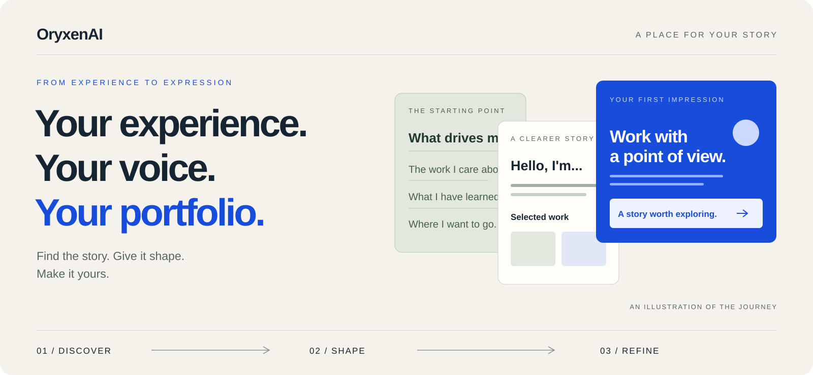
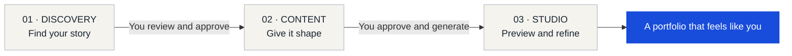

# A portfolio that feels like you.

Your experience deserves a clear story and a thoughtful first impression.
OryxenAI helps you bring both together.

**[Open OryxenAI ↗](https://app.oryxenai.me)** &nbsp; · &nbsp; [The journey](#from-a-starting-point-to-a-personal-portfolio) &nbsp; · &nbsp; [What you can do](#make-it-your-own)

 

## You bring the experience. We help you tell the story.

A résumé, a few projects, a career change, or an idea you are still finding words for. There is often more to your work than a list of titles can show.

**OryxenAI is an AI-assisted portfolio workspace** that helps you discover what matters, organize your content, and turn it into a personal portfolio you can preview and refine. Start with what you have. Answer focused questions. Review the story before it becomes a page.

For students finding their direction, professionals taking their next step, and independent creators bringing their work together.

 

## From a starting point to a personal portfolio

### 01 / Discover your story

Share your background, goals, and work. Bring a résumé or notes, or describe yourself in your own words. A guided conversation helps clarify your audience, strengths, and the direction you want to take. Review and approve your brief when it feels right.

### 02 / Give your content shape

Turn that direction into a coherent portfolio story. Review the introduction, work, experience, and other sections that suit your background. Refine the wording and approve the content before generating your portfolio.

### 03 / See it come together

Open your portfolio in the Studio, with a live preview beside a conversation for content changes. Refine the wording, review the result, and return to an earlier saved version when you need to.

**You decide when to move forward.** Each step gives you a chance to review your work.

 

## Make it your own

| What matters | What OryxenAI helps you do |
| :--- | :--- |
| **A useful starting point** | Work from your background, résumé, project notes, and goals. |
| **A clearer story** | Find the thread connecting your experience and the opportunities you want. |
| **A visual direction** | Choose a style that suits how you want to present yourself. |
| **Words you can stand behind** | Review and revise your content before the portfolio takes shape. |
| **Room to refine** | Request content changes in the Studio and see them in the preview. |
| **A way back** | Restore a previous saved version as your story evolves. |

 

## Thoughtful design, with your voice at the center

Choose from visual directions ranging from warm editorial layouts to crisp blue compositions and dark, expressive presentations. Your chosen style carries through to the Studio, where your own content gives the portfolio its identity.

The aim is simple: help someone understand who you are, what you do, and why your work matters.

> **Your workspace is private.** Sign in to create and review your portfolio. Generated portfolios are currently available as private Studio previews; public portfolio publishing and export are not available.

 

---

### Start with your story.

Bring what you have. Build a clearer picture of where you want to go.

**[Create your portfolio with OryxenAI ↗](https://app.oryxenai.me)**

Discover your story · Shape your content · Make it your own

