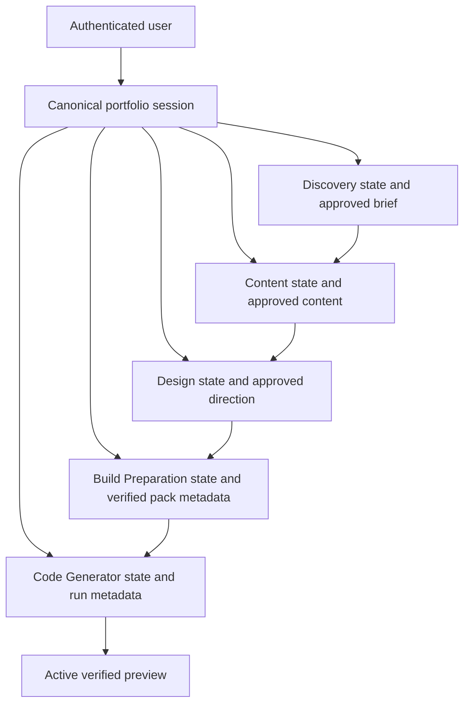

# Product experience and information architecture

## 1. Experience objective

The frontend has one primary job: help a person turn their intent into one
trustworthy portfolio without making them understand the internal agent system.

The person should always be able to answer four questions:

1. What am I working on?
2. What is happening now?
3. Does the system need me?
4. What is the next safe action?

The agent sequence is visible because it explains progress and ownership. Internal
operations, providers, attempts, object storage, worker details, and private model
reasoning are not visible because they do not help the user make a decision.

### Primary audience

The primary user is a nontechnical person creating their own portfolio. They may be
comfortable editing copy and evaluating design direction, but they should not need
to interpret source files, build graphs, JSON, model receipts, or infrastructure
terminology.

Administrators and developers retain separate diagnostic interfaces. Their density
must not determine the normal product interface.

## 2. Product object model

### Repository evidence

The normal-user experience has one durable portfolio session. Stage state and
approved outputs live beneath that session; durable jobs execute work for it; one
eligible generation can promote one active preview.



The UI must not invent separate “project,” “chat,” “workspace,” and “generation”
objects for normal users. “Portfolio” is the user object. “Stage” is a part of its
journey. “Run” appears only in developer details or support references.

## 3. Route model

### Existing server routes retained

| Route | Product responsibility | Navigation rule |
| --- | --- | --- |
| `/` | Resolve the current authentication state | Replace to sign-in, onboarding, app, or a safe account state |
| `/sign-in` | Explain the product briefly and start Google authentication | A single “Continue with Google” action |
| `/auth/callback` | Resolve the PKCE callback | Never become a resting screen; show bounded resolution feedback |
| `/onboarding` | Choose the one-time username | Continue to `/app` after server confirmation |
| `/access-not-approved` | Explain that this identity is not admitted | Offer account switch/sign-out, not a retry loop |
| `/account-unavailable` | Explain suspension, deletion, or unavailable account state | Offer sign-out and support-oriented guidance |
| `/app` | Authenticated home, resume point, and portfolio studio | Server state selects the default view |
| `/admin` | Administrator lifecycle tools | Visible only when `admin_available` is true |

Authentication redirects accept only reviewed same-origin destinations. Successful
normal-user authentication returns to `/app`; the callback must not restore an
arbitrary query string or foreign URL.

### Proposed lightweight view URLs

No client router is required. The `/app` shell may use validated query parameters so
refresh and browser navigation preserve an intentional view:

| URL form | Meaning |
| --- | --- |
| `/app` | Open the server-authoritative default: start, resume, attention, or completed preview |
| `/app?stage=discovery` | Open Discovery or its approved artifact |
| `/app?stage=content` | Open Content or its approved artifact |
| `/app?stage=design` | Open Design or its approved artifact |
| `/app?stage=prepare` | Open Build Preparation summary/progress |
| `/app?stage=generate` | Open Code Generator summary/progress |
| `/app?view=preview` | Open the active verified Preview |
| `/app?view=preview&route=<path>&viewport=<mode>` | Restore a validated promoted route and viewport |

Rules:

- `stage` and `view` are mutually exclusive; `view=preview` wins if both appear.
- Stage values are allowlisted. An invalid or unavailable value is removed with
  `history.replaceState`, then the default view is shown.
- A completed stage is reviewable. The current stage is interactive. A locked future
  stage returns to the current stage with a concise explanation.
- `route` is accepted only when it exactly matches a promoted `route_path`.
- `viewport` is accepted only as `mobile`, `tablet`, `desktop`, or `fit`.
- Changing views by an explicit user action uses `pushState`; normalization and
  server-driven status changes use `replaceState`.
- Browser back/forward changes the visible view but never mutates portfolio state.
- The preview’s “Open in new tab” action uses the separate active preview URL, not an
  `/app` URL.

## 4. End-to-end journey

```mermaid
flowchart LR
    Visit[Visit] --> Resolve{Session?}
    Resolve -->|No| SignIn[Sign in]
    Resolve -->|Yes| Me[Resolve /me]
    SignIn --> Callback[OAuth callback]
    Callback --> Me
    Me -->|Username required| Onboard[Choose username]
    Me -->|Denied or unavailable| Account[Safe account state]
    Me -->|Ready| App[/app]
    Onboard --> App
    App --> Discover[Discover]
    Discover -->|Explicit approval and continue| Content[Content]
    Content -->|Explicit approval and continue| Design[Design]
    Design -->|Explicit approval and continue| Prepare[Prepare]
    Prepare -->|Eligible pack and explicit start| Generate[Generate]
    Generate -->|Verified promotion| Preview[Preview]
```

No arrow between product stages means “start automatically.” The transition card
always names the completed artifact, what the next stage will do, and the action
that starts it.

## 5. Global application shell

### Structure

The shell has three persistent regions:

1. **Top bar** — brand, portfolio status, account menu, and admin link when
   authorized.
2. **Journey rail** — the ordered portfolio milestones and their durable states.
3. **Work surface** — the one surface that matters for the selected stage.

Desktop wireframe:

```text
+-----------------------------------------------------------------------+
| ORYXENAI                   Saved            Account menu               |
+-----------------------------------------------------------------------+
| 01 Discover -- 02 Content -- 03 Design -- 04 Prepare -- 05 Generate  |
|                                                               Preview |
+-----------------------------------------------------------------------+
|                                                                       |
|                         selected work surface                          |
|                                                                       |
|                                      [optional artifact/details sheet] |
+-----------------------------------------------------------------------+
```

The top bar must use the real product name exactly: **OryxenAI**. The journey rail
uses numbers because order matters. Preview is visually the destination rather than
a sixth agent.

### Journey behavior

- Completed milestones use a check and remain selectable.
- The current milestone has the living draft line and a plain state label.
- A review milestone uses “Review,” not “Running.”
- A stage needing attention interrupts the normal sequence with a clear repair
  action.
- Locked milestones are visible but quiet; they do not look like disabled form
  fields.
- On narrow screens, show `Stage 2 of 5 · Content` with a disclosure for the full
  journey.
- Preview appears as “Ready” only when an active preview exists.

### Saved-state language

The shell may show:

- “Saving…” while a supported write is in flight;
- “Saved” after the server accepts and the refreshed state contains the change;
- “Working in the background” for durable jobs; or
- “Reconnect to confirm changes” when state freshness is unknown.

It must not claim “Saved” from an optimistic local update alone.

## 6. Surface specifications

### 6.1 Authentication resolution

Primary job: establish whether the person can safely enter the application.

- Keep the brand mark, one-line value proposition, and living-draft loader visible.
- After two seconds without a response, change the status copy from “Checking your
  session” to “The service is taking a little longer to wake up.” This acknowledges
  free-host cold starts without inventing a percentage.
- Do not show the application shell until `/me` succeeds.
- Do not fetch protected portfolio data while signed out.
- Never flash private portfolio content beneath a sign-in overlay.

### 6.2 Sign-in

Primary job: begin or resume securely.

- One product sentence: “Turn your experience into a portfolio you can review before
  it goes anywhere.”
- One primary control: “Continue with Google.” It covers both account creation and
  sign-in.
- A short trust note explains that nothing is published automatically.
- No email/password form, social-provider grid, testimonials, metric cards, or fake
  portfolio gallery.
- Authentication errors remain on the page with a retry and account-switch path.

### 6.3 OAuth callback

Primary job: communicate safe resolution, not collect input.

- Show the compact draft-line indicator and “Finishing sign-in.”
- Remove OAuth artifacts from the visible URL promptly.
- On cancellation, return to sign-in with an understandable message.
- On an exchange or network failure, offer “Try sign-in again”; do not loop.

### 6.4 Username onboarding

Primary job: choose the public/local username required by the existing account
contract.

- Explain permanence before submission.
- Validate format locally for immediate feedback, but treat the server as authority.
- Keep the submitted value if the name is taken and focus the inline error.
- On success, replace the location with `/app`.
- Account capacity or status changes during onboarding go to the corresponding safe
  account state.

### 6.5 Authenticated start/home

Primary job: start or resume the one portfolio.

First-time state:

- A concise headline: “Let’s find the story your portfolio should tell.”
- Explain the five working stages in one sentence, not five cards.
- One primary action: “Start my portfolio.”
- Intake options must match the Discovery API’s supported inputs; do not advertise
  uploads or URLs unless the live contract accepts them.

Returning state:

- Name the current milestone and the last durable outcome.
- If the system is working, open its progress surface automatically.
- If the user must review or answer something, open that action automatically.
- If nothing needs attention, offer one primary “Continue” action.
- Do not show recents, templates, or create-new controls to normal users.

Completed/read-only state:

- Open Preview by default.
- State that the portfolio is complete and read-only.
- Keep approved artifacts available for review.
- Do not show controls that will predictably fail the entitlement boundary.

### 6.6 Discovery

Primary job: gather enough intent to prepare an approvable brief.

- Conversation occupies the central readable column.
- Ask and focus one question at a time.
- Keep answered questions in a compact transcript above; collapse long prior answers.
- Show the active composer only when the state expects user input.
- During question or brief generation, keep the transcript visible and place the
  semantic work status where the next response will appear.
- Brief review switches from chat to a document surface with Edit, Request revision,
  and Approve actions.
- Approval is visually serious: explain that it locks the brief used by Content.
- After approval, show a handoff panel and explicit “Continue to Content.”

Do not render the brief as a tiny chat bubble. It is a durable artifact.

### 6.7 Content

Primary job: review the proposed site structure and portfolio content.

- Default to an artifact layout with route/section navigation and readable content.
- Present unresolved or excluded material only when the public API safely identifies
  it; do not infer warnings from prose.
- Revision is a compact request composer adjacent to the artifact, not an always-open
  chatbot.
- While rebuilding, keep the previous artifact visible with a “Revising” banner.
- Approval explains that Design will receive the approved content projection.
- After approval, show explicit “Continue to Design.”

### 6.8 Design

Primary job: review the visual direction before resources are prepared or code is
generated.

- Show the direction as a structured design brief: overall language, page direction,
  typography/color/resource intentions, and notable interactions when present.
- Never pretend this stage has a rendered site preview.
- Small token swatches or type specimens are permitted only when derived
  deterministically from structured approved values. Prose must stay prose.
- Revision and approval follow the same interaction grammar as Content.
- After approval, explain that Prepare will validate and package the approved plan;
  offer explicit “Prepare build.”

### 6.9 Build Preparation

Primary job: make the approved Content and Design handoff eligible for generation.

- Use one calm progress surface, not the diagnostic fixture’s stage numbers, provider
  panels, JSON, or object-storage vocabulary.
- User-facing milestones:
  1. Checking approved content and design.
  2. Resolving required portfolio materials.
  3. Packaging build instructions.
  4. Verifying the handoff.
- Show the latest completed milestone and the current milestone. Earlier details live
  in a disclosure, not a continuously growing feed.
- On `needs_attention`, show the safe explanation, what remains approved, and the
  exact available action: retry, regenerate after staleness, or return upstream.
- “Download preparation pack” is developer/admin secondary functionality unless the
  product explicitly decides normal users need it.
- When eligible, show “Ready for generation” and an explicit “Generate portfolio.”

### 6.10 Code Generator

Primary job: show trustworthy progress toward a verified portfolio.

- The normal surface is not the existing three-column development control room.
- Use the durable semantic sequence documented by the Code Generator architecture:
  queued, planning, acquiring resources, generating, integrating/building,
  verifying, and promoting Preview.
- Do not show token streams, individual source files, plan JSON, candidate frames,
  raw checks, or internal attempt controls.
- The current safe activity text may identify a page/route batch only when supplied by
  durable state.
- If a prior active preview exists, keep it available while another authorized run is
  in progress. Label it “Current preview” and never render the candidate.
- `preview_pending` means the verified build is being finalized for Preview. It is not
  a failure and must not claim that the Preview is ready.
- `needs_attention` preserves the last preview, if any, and presents only a supported
  retry action.
- Normal users do not see Regenerate when the entitlement says they cannot regenerate.

### 6.11 Preview

Primary job: let the user inspect the promoted portfolio safely.

Desktop sketch:

```text
+-----------------------------------------------------------------------+
| Preview     [Route v]       [Mobile][Tablet][Desktop][Fit] [↻] [↗]    |
+-----------------------------------------------------------------------+
|                                                                       |
|                 isolated cross-origin preview frame                  |
|                                                                       |
+-----------------------------------------------------------------------+
| Verified <time>                         Journey / artifacts disclosure |
+-----------------------------------------------------------------------+
```

Rules:

- Build the route selector from `active_preview.route_ids` and
  `active_preview.route_paths`; never probe or invent routes.
- Device controls change the frame dimensions only. They do not claim new verification
  evidence.
- Refresh reloads the selected route on the same active host.
- Open in new tab uses `noopener,noreferrer` and the exact active preview origin/path.
- Give the iframe a portfolio-specific title without injecting untrusted HTML.
- The host validates all preview messages against the exact origin and versioned
  schema. Do not accept `*` origins.
- Keep a frame-level error state outside the iframe. A gateway load failure does not
  erase the active-preview receipt or imply generation failed.
- Do not expose screenshot capture, visual selection, inline editing, source code,
  version switching, publishing, or custom domains.

### 6.12 Administrator and developer surfaces

- `/admin` may adopt shared typography, focus, button, error, and token styles, but its
  information architecture stays task-specific.
- Build Preparation fixture and Code Generator development pages remain clearly marked
  development tools and are never linked for normal users.
- Developer-only controls must not be hidden in the normal DOM and merely disabled;
  protected routes and role checks remain authoritative.

## 7. Artifacts and activity

### Artifact model

The approved brief, content plan, design direction, preparation summary, and Preview
are artifacts. Give them stable presentation rather than treating them as messages.

- Current artifact: central work surface.
- Earlier artifact: selectable from the completed journey stage.
- Metadata: approval/promotion time and a plain freshness state.
- Raw payload: developer-only.

### Activity model

Activity is secondary evidence, not the product’s primary narrative.

- Show the current operation and a bounded list of completed semantic milestones.
- Keep at most the latest meaningful items in the active DOM.
- Group retry attempts under their milestone.
- Never announce every item to assistive technology.
- Offer a support reference such as a trace identifier only when the API marks it safe.

## 8. Responsive behavior

### Wide desktop: 1200 px and above

- Full top bar and horizontal journey.
- Work surface may use a 70/30 content/details split when the artifact benefits from it.
- Preview uses the maximum available area.
- Avoid three permanent columns.

### Laptop and tablet landscape: 768–1199 px

- Compact journey labels.
- Artifacts/details use an overlay sheet opened by a visible button.
- Preview toolbar may wrap once but must not cover the iframe.
- Content remains at a readable measure rather than stretching edge to edge.

### Mobile and narrow tablet: below 768 px

- One surface at a time.
- Sticky compact stage header: `Stage n of 5 · Name`.
- Composer stays above the virtual keyboard and never obscures the current question.
- Artifact navigation becomes a native select or accessible disclosure.
- Preview defaults to fit. Device simulation is secondary; “Open in new tab” is
  prominent because the embedded frame is constrained.
- Mobile supports starting, answering, reviewing, approving, monitoring, and inspecting
  Preview. It does not reproduce developer tools.

## 9. Copy system

Use the user’s nouns and active verbs:

| Avoid | Use |
| --- | --- |
| Execute agent | Start Content / Prepare build / Generate portfolio |
| Artifact hydrated | Content is ready to review |
| Pipeline succeeded | Your preview is ready |
| Model is thinking | Preparing your content |
| R2 upload failed | The preparation package could not be stored |
| Terminal failure | Generation needs attention |
| Publish | Preview, unless a publishing feature actually exists |

Every error contains:

1. what could not be completed;
2. what remains safe or saved;
3. the supported next action; and
4. optional technical details behind a disclosure.

## 10. Explicitly excluded product patterns

Do not add these until a backend/product decision exists:

- multi-project home or chat list;
- templates marketplace;
- universal chatbot on every stage;
- source-code editor or file tree;
- visual element selection or click-to-edit;
- cancel, pause, steer, or queue-follow-up controls;
- checkpoints, version history, rollback, or alternate preview selection;
- public sharing, publishing, staging, custom domains, or analytics;
- model/provider controls for normal users; or
- generated-app authentication inside Preview.
