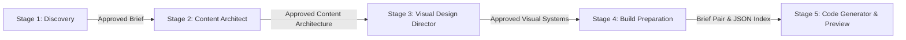

# Agent Pipeline and Data Contracts

> **Target Audience:** AI Coding Agents, LLM Architects, and Backend/Frontend Integrators.
> **Purpose:** Exhaustive, authoritative technical specification of all five specialized agent pipeline stages in OryxenAI (Discovery, Content Architect, Visual Design Director, Build Preparation, and Code Generator). Covers state machine definitions, exact Pydantic domain schemas, persistence payloads, HTTP endpoint contracts, request/response bodies, and downstream gating rules.

---

## 1. Global Pipeline Architecture & Invariants

OryxenAI coordinates five autonomous, specialized agent stages. Each stage is executed as a separate, durable background job on PostgreSQL (`background_jobs` table) claimed via `FOR UPDATE SKIP LOCKED`.



### 1.1 Non-Negotiable Pipeline Invariants

1. **No Automatic Chaining:** Approving stage $N$ never automatically starts stage $N+1$. Every stage start requires an explicit, user-authorized HTTP `POST`.
2. **One-Way Upstream Gating:** Stage $N$ requires stage $N-1$ to be in its terminal `approved` (or `ready`) state before it can be started:
   - Content Architect requires `discovery.status == "approved"`.
   - Visual Design Director requires `content_architect.status == "approved"`.
   - Build Preparation requires both `content_architect.status == "approved"` and `visual_design_director.status == "approved"`.
   - Code Generator requires `build_preparation.status == "ready"`.
3. **No Revise-After-Approve:** Once a stage reaches `approved`, that stage's state machine is permanently locked for that session revision. Revisions occur **only** during the review phase.
4. **State Persistence in JSONB:** All agent inputs, intermediate states, memory updates, errors, and finalized outputs are persisted directly under `portfolio_sessions.current_state[stage_key]`.
5. **Optimistic Concurrency Control:** Every session modification requires matching `session_revision`. Conflicts return `409 CONFLICT`.

---

## 2. Stage 1: Discovery Agent (`discovery`)

### 2.1 Mission & Lifecycle

The Discovery Agent transforms raw, unstructured user experience (resumes, LinkedIn profiles, career notes, portfolio goals) into a structured, validated **Portfolio Brief**.

```
[not_started]
      │  (POST /start with intake notes)
      ▼
[questions_queued] ──► [questions_running]
      │
      ▼
[questions_ready] ◄──► [answers_in_progress] (User answers 1-at-a-time)
      │  (PUT /answers with complete=true or "Generate brief now")
      ▼
[brief_running]
      │
      ▼
[brief_review] ◄──► (POST /revise with natural-language edits)
      │  (POST /approve)
      ▼
[approved] (Terminal state)
      │
      └─► [needs_attention] (Reachable from any active state on failure)
```

### 2.2 Data Schemas (`src/oryxenai/agents/discovery/schemas.py`)

#### Status Enum:
```python
class DiscoveryStatus(StrEnum):
    NOT_STARTED = "not_started"
    QUESTIONS_QUEUED = "questions_queued"
    QUESTIONS_RUNNING = "questions_running"
    QUESTIONS_READY = "questions_ready"
    ANSWERS_IN_PROGRESS = "answers_in_progress"
    BRIEF_RUNNING = "brief_running"
    BRIEF_REVIEW = "brief_review"
    APPROVED = "approved"
    NEEDS_ATTENTION = "needs_attention"
```

#### Question & Option Schemas:
```python
class QuestionKind(StrEnum):
    TEXT = "text"
    SINGLE_SELECT = "single_select"
    MULTI_SELECT = "multi_select"
    BOOLEAN = "boolean"

class QuestionOption(BaseModel):
    id: str
    label: str

class DiscoveryQuestion(BaseModel):
    id: str
    text: str
    help_text: str | None = None
    kind: QuestionKind = QuestionKind.TEXT
    options: list[QuestionOption] = Field(default_factory=list)
    reason: str | None = None
    allow_skip: bool = True
    allow_auto: bool = False
```

#### Structured Profile Schema:
```python
class ProfileLink(BaseModel):
    label: str
    url: str

class ExperienceEntry(BaseModel):
    organization: str
    role: str
    dates: str
    highlights: list[str] = Field(default_factory=list)

class EducationEntry(BaseModel):
    institution: str
    credential: str
    dates: str

class ProjectEntry(BaseModel):
    name: str
    summary: str
    contribution: str
    tech: list[str] = Field(default_factory=list)
    link: str = ""

class StructuredProfile(BaseModel):
    name: str = ""
    current_title: str = ""
    location: str = ""
    links: list[ProfileLink] = Field(default_factory=list)
    experience: list[ExperienceEntry] = Field(default_factory=list)
    education: list[EducationEntry] = Field(default_factory=list)
    projects: list[ProjectEntry] = Field(default_factory=list)
    skills: list[str] = Field(default_factory=list)
    spoken_languages: list[str] = Field(default_factory=list)
    private_omitted: list[str] = Field(default_factory=list)
```

#### Brief Output Schema:
```python
class BriefOutput(BaseModel):
    mode: str = "BRIEF_READY"
    assistant_message: str
    brief_title: str
    brief_markdown: str
    user_summary: str
    profile: StructuredProfile
    open_items: list[str] = Field(default_factory=list)
    memory_update: dict[str, Any] = Field(default_factory=dict)
```

### 2.3 API Route Contracts (`src/oryxenai/api/routes/discovery.py`)

| Method | Path | Request Body | Response (Status Code) | Purpose |
|---|---|---|---|---|
| `GET` | `/api/v1/sessions/{id}/discovery` | *None* | `DiscoveryStateResponse` (200) | Polls current Discovery state |
| `POST` | `/api/v1/sessions/{id}/discovery/start` | `{ message, document_text, goal, model_profile? }` | `DiscoveryStateResponse` (202) | Submits intake & triggers question generation |
| `PUT` | `/api/v1/sessions/{id}/discovery/answers` | `{ complete: bool, answers: [{ question_id, mode, value }] }` | `DiscoveryStateResponse` (200) | Saves an answer; if `complete=true`, triggers brief synthesis |
| `POST` | `/api/v1/sessions/{id}/discovery/revise` | `{ revision_request: string }` | `DiscoveryStateResponse` (202) | Submits natural-language brief revision request |
| `POST` | `/api/v1/sessions/{id}/discovery/approve` | `{}` | `DiscoveryStateResponse` (200) | Formally locks brief with SHA-256 hash |
| `POST` | `/api/v1/sessions/{id}/discovery/stop` | `{}` | `DiscoveryStateResponse` (200) | Cancels in-flight job safely |

---

## 3. Stage 2: Content Architect Agent (`content_architect`)

### 3.1 Mission & Lifecycle

The Content Architect consumes **only** the compact approved Discovery snapshot (the structured `profile` facts and `user_summary`). It executes an adaptive bounded workflow of 1 to 3 sequential model calls (`plan_content`, optionally `write_pages`, optionally `integrate_content`) to produce page routes, machine-addressable sections, and full copy.

```
[not_started]  <-- Locked until discovery.status == "approved"
      │  (POST /content-architect/start)
      ▼
[build_running] (Durable job: content_architect.build)
      │
      ▼
[content_review] ◄──► (POST /revise with revision_request)
      │  (POST /approve)
      ▼
[approved] (Terminal state)
      │
      └─► [needs_attention] (On unrecoverable model or validation error)
```

### 3.2 Data Schemas (`src/oryxenai/agents/content_architect/schemas.py`)

#### Status Enum:
```python
class ContentArchitectStatus(StrEnum):
    NOT_STARTED = "not_started"
    BUILD_RUNNING = "build_running"
    CONTENT_REVIEW = "content_review"
    APPROVED = "approved"
    NEEDS_ATTENTION = "needs_attention"
```

#### Route Plan & Section Schemas:
```python
class PublicationStatus(StrEnum):
    APPROVED = "approved"
    PENDING = "pending"
    BLOCKED = "blocked"

class RoutePlanEntry(BaseModel):
    route_id: str                      # e.g. "home", "work", "about"
    path: str                          # e.g. "/", "/work", "/about"
    title: str
    purpose: str
    audience_takeaway: str
    priority: str                      # "primary" | "secondary"
    content_density: str               # "compact" | "moderate" | "dense"
    section_sequence: list[str]        # Ordered section IDs, e.g. ["home:hero", "home:positioning"]
    mobile_notes: str = ""
    source_refs: list[str] = Field(default_factory=list)
    publication_status: PublicationStatus = PublicationStatus.APPROVED

class ContentSection(BaseModel):
    section_id: str                    # Unique namespaced ID, e.g. "home:hero"
    purpose: str
    content: dict[str, Any]            # Flexible dict: headline, subheadline, body, items, etc.
    claim_ids: list[str] = Field(default_factory=list)
    priority: str = "standard"
    optional: bool = False
    mobile_condensation: str = ""
    link_targets: list[dict[str, Any]] = Field(default_factory=list)

class PageContentPack(BaseModel):
    route_id: str
    sections: list[ContentSection]
    internal_notes: dict[str, Any] = Field(default_factory=dict)
```

#### Claim Grounding & Decisions:
```python
class EvidenceStatus(StrEnum):
    VERIFIED = "verified"
    UNVERIFIED = "unverified"
    UNRESOLVED = "unresolved"

class Ownership(StrEnum):
    INDIVIDUAL = "individual"
    TEAM = "team"
    UNCLEAR = "unclear"

class ClaimGrounding(BaseModel):
    claim_id: str
    statement: str
    source_reference: str
    source_entity_id: str
    evidence_status: EvidenceStatus
    ownership: Ownership
    publication_status: PublicationStatus
    confidence_or_warning: str = ""

class DecisionRecord(BaseModel):
    decision: str                      # e.g. "presentation_mode", "primary_audience"
    value: str                         # e.g. "single_page", "Engineering Directors"
    basis: str                         # "user_confirmed" | "source_derived" | "safe_default"
    confidence: str = ""
    rationale: str = ""
```

#### Persisted State (`ContentArchitectState`):
```python
class ContentArchitectState(BaseModel):
    status: ContentArchitectStatus = ContentArchitectStatus.NOT_STARTED
    user_summary: str = ""
    site_story_strategy: dict[str, Any] = Field(default_factory=dict)
    decision_basis: list[DecisionRecord] = Field(default_factory=list)
    route_plan: list[RoutePlanEntry] = Field(default_factory=list)
    page_content_packs: list[PageContentPack] = Field(default_factory=list)
    public_content_manifest: dict[str, Any] = Field(default_factory=dict)
    claim_grounding: list[ClaimGrounding] = Field(default_factory=list)
    omissions: list[str] = Field(default_factory=list)
    unresolved_issues: list[str] = Field(default_factory=list)
    privacy_and_confidentiality: list[str] = Field(default_factory=list)
    media_status: dict[str, Any] = Field(default_factory=dict)
    visual_director_handoff: dict[str, Any] = Field(default_factory=dict)
    warnings: list[str] = Field(default_factory=list)
    stages_run: list[str] = Field(default_factory=list)
    approved: dict[str, Any] | None = None
```

### 3.3 API Route Contracts (`src/oryxenai/api/routes/content_architect.py`)

| Method | Path | Request Body | Response | Purpose |
|---|---|---|---|---|
| `GET` | `/api/v1/sessions/{id}/content-architect` | *None* | `ContentArchitectStateResponse` | Returns active content state |
| `POST` | `/api/v1/sessions/{id}/content-architect/start` | `{ preferences?, model_profile? }` | `ContentArchitectStateResponse` (202) | Enqueues `content_architect.build` |
| `POST` | `/api/v1/sessions/{id}/content-architect/revise` | `{ revision_request: string }` | `ContentArchitectStateResponse` (202) | Re-runs synthesis with user feedback |
| `POST` | `/api/v1/sessions/{id}/content-architect/approve` | `{}` | `ContentArchitectStateResponse` (200) | Stamps `content_hash` and finalizes stage |
| `POST` | `/api/v1/sessions/{id}/content-architect/stop` | `{}` | `ContentArchitectStateResponse` (200) | Terminates active job |

---

## 4. Stage 3: Visual Design Director Agent (`visual_design_director`)

### 4.1 Mission & Lifecycle

The Visual Design Director consumes the approved Content Architect output. It directs the aesthetic thesis, typography hierarchy, color intent, layout choreography, motion systems, and scene-by-scene compositions. It also consults a local deterministic component catalogue (`resources/catalogue.json`) via tag overlap without external tool-calling loops.

```
[not_started]  <-- Locked until content_architect.status == "approved"
      │  (POST /visual-design-director/start)
      ▼
[build_running] (Durable job: visual_design_director.build)
      │
      ▼
[design_review] ◄──► (POST /revise with revision_request)
      │  (POST /approve)
      ▼
[approved] (Terminal state)
      │
      └─► [needs_attention] (On unrecoverable error)
```

### 4.2 Data Schemas (`src/oryxenai/agents/visual_design_director/schemas.py`)

#### Status Enum:
```python
class VisualDesignDirectorStatus(StrEnum):
    NOT_STARTED = "not_started"
    BUILD_RUNNING = "build_running"
    DESIGN_REVIEW = "design_review"
    APPROVED = "approved"
    NEEDS_ATTENTION = "needs_attention"
```

#### Scene & Visual Direction Schemas:
```python
class SceneDirection(BaseModel):
    scene_id: str                      # Unique ID, e.g. "home-introduction"
    route_id: str                      # Matching Content Architect route_id
    narrative_goal: str
    viewport_role: str                 # e.g. "Opening orientation scene"
    content_refs: list[str]            # Bound ContentSection IDs, e.g. ["home:hero"]
    layout_intent: str                 # Asymmetry, grid structure, whitespace
    alignment_relationships: str
    relative_proportions: str          # e.g. "2/3 text, 1/3 visual cue"
    layer_stack: str                   # Z-index ordering and depth planes
    background_intent: str
    asset_requirements: list[str] = Field(default_factory=list)
    resource_candidates: list[str] = Field(default_factory=list) # Catalogue IDs
    motion_intent: dict[str, Any] = Field(default_factory=dict)
    interaction_states: dict[str, Any] = Field(default_factory=dict)
    transition_in: str = ""
    transition_out: str = ""
    responsive_behavior: str = ""
    accessibility_intent: str = ""
    reduced_motion_behavior: str = ""
    performance_risk: str = ""
    failure_safe_static_state: str = ""
    acceptance_criteria: list[str] = Field(default_factory=list)

class PageVisualDirection(BaseModel):
    route_id: str
    publication_status: str = "approved"
    compilable: bool = True
    path: str
    purpose: str
    visitor_takeaway: str
    first_impression: str = ""
    storyboard: str = ""
    section_rhythm: str = ""
    scenes: list[SceneDirection] = Field(default_factory=list)

class ResourceCandidate(BaseModel):
    resource_id: str                   # Checked-in catalogue ID
    category: str
    why_it_matches: str
    where_it_may_help: str
    priority: str
    adaptation_notes: str
    fallback: str
```

#### Persisted State (`VisualDesignDirectorState`):
```python
class VisualDesignDirectorState(BaseModel):
    status: VisualDesignDirectorStatus = VisualDesignDirectorStatus.NOT_STARTED
    user_summary: str = ""
    visual_language: dict[str, Any] = Field(default_factory=dict)
    # visual_language contains: creative_thesis, design_keywords, color_intent,
    # typography_intent, motion_intent, layout_principles, palette_tokens
    shared_visual_systems: dict[str, Any] = Field(default_factory=dict)
    navigation_direction: dict[str, Any] = Field(default_factory=dict)
    motion_system: dict[str, Any] = Field(default_factory=dict)
    interaction_system: dict[str, Any] = Field(default_factory=dict)
    pages: list[PageVisualDirection] = Field(default_factory=list)
    resource_candidates: list[ResourceCandidate] = Field(default_factory=list)
    asset_briefs: list[dict[str, Any]] = Field(default_factory=list)
    compiler_handoff: dict[str, Any] = Field(default_factory=dict)
    warnings: list[str] = Field(default_factory=list)
    approved: dict[str, Any] | None = None
```

### 4.3 API Route Contracts (`src/oryxenai/api/routes/visual_design_director.py`)

| Method | Path | Request Body | Response | Purpose |
|---|---|---|---|---|
| `GET` | `/api/v1/sessions/{id}/visual-design-director` | *None* | `VisualDesignDirectorStateResponse` | Returns active visual state |
| `POST` | `/api/v1/sessions/{id}/visual-design-director/start` | `{ preferences?, model_profile? }` | `VisualDesignDirectorStateResponse` (202) | Enqueues `visual_design_director.build` |
| `POST` | `/api/v1/sessions/{id}/visual-design-director/revise` | `{ revision_request: string }` | `VisualDesignDirectorStateResponse` (202) | Re-evaluates visual direction |
| `POST` | `/api/v1/sessions/{id}/visual-design-director/approve` | `{}` | `VisualDesignDirectorStateResponse` (200) | Stamps `direction_hash` and finalizes |
| `POST` | `/api/v1/sessions/{id}/visual-design-director/stop` | `{}` | `VisualDesignDirectorStateResponse` (200) | Terminates active job |

---

## 5. Stage 4: Build Preparation Agent (`build_preparation`)

### 5.1 Mission & Lifecycle

Build Preparation is a **hidden compiler stage**. It requires both Content Architect and Visual Design Director to be approved. It compiles the public scope deterministically, queries providers for candidate imagery/components without downloading bytes, makes a single model call to compose visual prose, and synthesizes two immutable Markdown briefs:
1. `content-and-narrative-brief.md`: Contains approved copy with a fenced JSON content index.
2. `visual-and-build-brief.md`: Contains visual direction, typography scales, color palettes, and researched resource links with a fenced JSON visual index.

```
[not_started]  <-- Locked until Content & Design are both approved
      │  (POST /build-preparation/start)
      ▼
[running] (Durable job: build_preparation.prepare)
      ├─► Stage 0: Pure deterministic scope compilation
      ├─► Resource Research: External provider candidate discovery
      └─► Compose Visual Brief: Model synthesis of brief pair
      ▼
[ready] (Artifacts assembled and hashes stamped)
      │
      └─► [needs_attention] (On upstream staleness or failure)
```

### 5.2 Data Schemas (`src/oryxenai/agents/build_preparation/schemas.py`)

#### Status Enum:
```python
class BuildPreparationStatus(StrEnum):
    NOT_STARTED = "not_started"
    RUNNING = "running"
    READY = "ready"
    NEEDS_ATTENTION = "needs_attention"
```

#### Compiled Scope & Index Schemas:
```python
class RouteScope(BaseModel):
    route_id: str
    path: str
    title: str
    purpose: str
    publication_status: str
    section_ids: list[str]
    scene_ids: list[str]
    asset_ids: list[str]
    resource_ids: list[str]

class ResourceBriefEntry(BaseModel):
    need_id: str
    role_id: str
    category: str
    route_ids: list[str]
    purpose: str
    status: str                        # "candidates_found" | "no_material_found"
    candidates: list[dict[str, Any]]   # Provider links, preview URLs, licenses
    primary_candidate_index: int | None
    guidance: str = ""

class ComponentBriefEntry(BaseModel):
    need_id: str
    role_id: str
    route_ids: list[str]
    purpose: str
    suggestions: list[dict[str, Any]]
    primary_suggestion_index: int | None
    guidance: str = ""
```

#### Persisted State (`BuildPreparationState`):
```python
class BuildPreparationState(BaseModel):
    status: BuildPreparationStatus = BuildPreparationStatus.NOT_STARTED
    scope_hash: str = ""
    routes: list[RouteScope] = Field(default_factory=list)
    resource_needs: list[dict[str, Any]] = Field(default_factory=list)
    resource_index: list[ResourceBriefEntry] = Field(default_factory=list)
    component_index: list[ComponentBriefEntry] = Field(default_factory=list)
    content_brief_markdown: str = ""
    visual_brief_markdown: str = ""
    content_brief_hash: str = ""
    visual_brief_hash: str = ""
    target_contract: str = "react-vite-v1"
    recommended_dependencies: list[str] = Field(default_factory=list)
    warnings: list[str] = Field(default_factory=list)
    events: list[dict[str, Any]] = Field(default_factory=list)
    stale: bool = False
    stale_reasons: list[str] = Field(default_factory=list)
```

### 5.3 API Route Contracts (`src/oryxenai/api/routes/build_preparation.py`)

| Method | Path | Request Body | Response | Purpose |
|---|---|---|---|---|
| `GET` | `/api/v1/sessions/{id}/build-preparation` | *None* | `BuildPreparationStateResponse` | Returns prepared build handoff |
| `POST` | `/api/v1/sessions/{id}/build-preparation/start` | `{ model_profile? }` | `BuildPreparationStateResponse` (202) | Enqueues `build_preparation.prepare` |
| `POST` | `/api/v1/sessions/{id}/build-preparation/regenerate` | `{ model_profile? }` | `BuildPreparationStateResponse` (202) | Re-compiles briefs if upstream changed |
| `GET` | `/api/v1/sessions/{id}/build-preparation/download?doc=content\|visual` | *None* | File Download (200) | Downloads the raw Markdown brief |

---

## 6. Stage 5: Code Generator & Live Preview (`code_generator`)

### 6.1 Mission & Lifecycle

Code Generator transforms the immutable Build Preparation Markdown brief pair into a production-grade, multi-viewport verified React/Vite web application. It handles asset acquisition, progressive generation, multi-viewport DOM geometry verification, self-repair loops, and atomic promotion to an interactive sandbox preview.

```
[not_started]  <-- Locked until build_preparation.status == "ready"
      │  (POST /code-generator/start)
      ▼
[queued] ──► [planning] ──► [acquiring] ──► [generating] ──► [verifying]
                                                                  │
      ┌───────────────────────────────────────────────────────────┴──────┐
      ▼                                                                  ▼
[preview_pending] ──► [ready]                                  [needs_attention]
(Promotes verified active_preview)             (Candidate preview or terminal defect)
```

### 6.2 Data Schemas (`src/oryxenai/agents/code_generator/session_schemas.py`)

#### Status Enum:
```python
class CodeGeneratorSessionStatus(StrEnum):
    NOT_STARTED = "not_started"
    QUEUED = "queued"
    PLANNING = "planning"
    ACQUIRING = "acquiring"
    GENERATING = "generating"
    VERIFYING = "verifying"
    READY = "ready"
    PREVIEW_PENDING = "preview_pending"
    NEEDS_ATTENTION = "needs_attention"
```

#### Active Preview Schema:
```python
class ActivePreview(BaseModel):
    run_id: str
    host: str                          # Preview gateway host
    url: str                           # Sandbox URL, e.g. "https://preview.oryxenai.local/p/abcd-1234/"
    candidate_id: str
    candidate_identity_hash: str
    build_hash: str
    route_ids: list[str]               # ["home", "work", "about"]
    route_paths: list[str]             # ["/", "/work", "/about"]
    promoted_at: str
```

#### Persisted Session State (`CodeGeneratorSessionState`):
```python
class CodeGeneratorSessionState(BaseModel):
    status: CodeGeneratorSessionStatus = CodeGeneratorSessionStatus.NOT_STARTED
    current_run_id: str = ""
    active_preview: ActivePreview | None = None
    candidate_preview: ActivePreview | None = None # Unverified preview on failure
    stale: bool = False
    stale_reasons: list[str] = Field(default_factory=list)
    started_at: str | None = None
    completed_at: str | None = None
    pipeline_contract_version: str = "code-generator-v4"
    latest_error: dict[str, Any] | None = None
    advisories: list[dict[str, Any]] = Field(default_factory=list)
```

### 6.3 API Route Contracts (`src/oryxenai/api/routes/code_generator.py`)

| Method | Path | Request Body | Response | Purpose |
|---|---|---|---|---|
| `GET` | `/api/v1/sessions/{id}/code-generator` | *None* | `CodeGeneratorStateResponse` | Returns generator status & active preview |
| `POST` | `/api/v1/sessions/{id}/code-generator/start` | `{}` | `CodeGeneratorStateResponse` (202) | Starts durable generation run |
| `POST` | `/api/v1/sessions/{id}/code-generator/regenerate` | `{}` | `CodeGeneratorStateResponse` (202) | Starts fresh variant run |
| `POST` | `/api/v1/sessions/{id}/code-generator/retry` | `{}` | `CodeGeneratorStateResponse` (202) | Resumes an interrupted run |

### 6.4 Preview Sandbox Bridge (`postMessage` Protocol)

The embedded iframe preview communicates with the studio shell via a versioned protocol:

```typescript
// Shell sends handshake to iframe:
iframe.contentWindow.postMessage({
  type: "preview:init",
  version: "preview-bridge-v1"
}, targetOrigin);

// Iframe announces ready status:
window.parent.postMessage({
  type: "preview:ready",
  version: "preview-bridge-v1"
}, studioOrigin);
```
