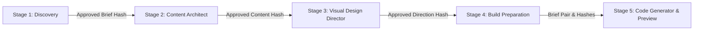

# Agent Pipeline and Data Contracts

> **Target Audience:** AI Coding Agents, LLM Architects, and Backend/Frontend Integrators.
> **Purpose:** Exhaustive, authoritative technical specification of all five specialized agent pipeline stages in OryxenAI (Discovery, Content Architect, Visual Design Director, Build Preparation, and Code Generator & Live Preview). Covers state machine definitions, exact Pydantic domain schemas, persistence payloads, emitted event streams, HTTP endpoint contracts, request/response bodies, and downstream gating rules.

---

## 1. Global Pipeline Architecture & Invariants

OryxenAI coordinates five autonomous, specialized agent stages. Each stage is executed as a separate, durable background job on PostgreSQL (`background_jobs` table) claimed via `SELECT ... FOR UPDATE SKIP LOCKED`.



### 1.1 Non-Negotiable Pipeline Invariants

1. **No Automatic Chaining:** Approving stage $N$ never automatically starts stage $N+1$. Every stage start requires an explicit, user-authorized HTTP `POST`.
2. **One-Way Upstream Gating:** Stage $N$ requires stage $N-1$ to be in its terminal `approved` (or `ready`) state before it can be started:
   - Content Architect requires `discovery.status == "approved"`.
   - Visual Design Director requires `content_architect.status == "approved"`.
   - Build Preparation requires both `content_architect.status == "approved"` and `visual_design_director.status == "approved"`.
   - Code Generator requires `build_preparation.status == "ready"`.
3. **No Revise-After-Approve:** Once a stage reaches `approved`, that stage's state machine is permanently locked for that session revision. Revisions occur **only** during the review phase.
4. **State Persistence in JSONB:** All agent inputs, intermediate states, memory updates, errors, and finalized outputs are persisted directly under `portfolio_sessions.current_state[stage_key]`.
5. **Optimistic Concurrency Control:** Every session modification requires matching `session_revision`. Conflicts return `409 CONFLICT`.
6. **Provider-Neutral Model Execution:** All model operations call logical profiles defined in `config/models.toml` via the `ModelClient` boundary. Agent code never references provider names, endpoints, or raw secrets.

---

## 2. Stage 1: Discovery Agent (`discovery`)

### 2.1 Mission & Lifecycle

The Discovery Agent transforms raw, unstructured user experience (resumes, LinkedIn profiles, career notes, portfolio goals) into a structured, validated **Portfolio Brief**.

```
[not_started]
      │  (POST /start with intake notes)
      ▼
[questions_queued] ──► [questions_running]
      │
      ▼
[questions_ready] ◄──► [answers_in_progress] (User answers 1-at-a-time)
      │  (PUT /answers with complete=true or "Generate brief now")
      ▼
[brief_running]
      │
      ▼
[brief_review] ◄──► (POST /revise with natural-language edits)
      │  (POST /approve)
      ▼
[approved] (Terminal state — brief_hash stamped)
      │
      └─► [needs_attention] (Reachable from any active state on failure)
```

### 2.2 Data Schemas (`src/oryxenai/agents/discovery/schemas.py`)

#### Status & Mode Enums:
```python
class DiscoveryStatus(StrEnum):
    NOT_STARTED = "not_started"
    QUESTIONS_QUEUED = "questions_queued"
    QUESTIONS_RUNNING = "questions_running"
    QUESTIONS_READY = "questions_ready"
    ANSWERS_IN_PROGRESS = "answers_in_progress"
    BRIEF_RUNNING = "brief_running"
    BRIEF_REVIEW = "brief_review"
    APPROVED = "approved"
    NEEDS_ATTENTION = "needs_attention"

class QuestionKind(StrEnum):
    TEXT = "text"
    SINGLE_SELECT = "single_select"
    MULTI_SELECT = "multi_select"
    BOOLEAN = "boolean"

class AnswerMode(StrEnum):
    ANSWERED = "answered"
    SKIPPED = "skipped"

class OperationMode(StrEnum):
    NEEDS_DETAILS = "NEEDS_DETAILS"
    ASK_QUESTIONS = "ASK_QUESTIONS"
    READY_FOR_BRIEF = "READY_FOR_BRIEF"
    BRIEF_READY = "BRIEF_READY"
```

#### Intake & Question Schemas:
```python
class DiscoveryIntake(BaseModel):
    model_config = ConfigDict(extra="allow")
    message: str = ""
    document_text: str = ""
    goal: str = ""

class QuestionOption(BaseModel):
    model_config = ConfigDict(extra="forbid")
    id: str = ""
    label: str = ""

class DiscoveryQuestion(BaseModel):
    model_config = ConfigDict(extra="forbid")
    id: str = ""
    text: str = ""
    help_text: str | None = None
    kind: QuestionKind = QuestionKind.TEXT
    options: list[QuestionOption] = Field(default_factory=list)
    reason: str | None = None
    allow_skip: bool = True
    allow_auto: bool = False

class QuestionSetOutput(BaseModel):
    model_config = ConfigDict(extra="forbid")
    mode: OperationMode
    assistant_message: str
    questions: list[DiscoveryQuestion] = Field(default_factory=list)
    memory_update: dict[str, Any] = Field(default_factory=dict)
```

#### Structured Profile & Brief Output:
```python
class ProfileLink(BaseModel):
    model_config = ConfigDict(extra="forbid")
    label: str = ""
    url: str = ""

class ExperienceEntry(BaseModel):
    model_config = ConfigDict(extra="forbid")
    organization: str = ""
    role: str = ""
    dates: str = ""
    highlights: list[str] = Field(default_factory=list)

class EducationEntry(BaseModel):
    model_config = ConfigDict(extra="forbid")
    institution: str = ""
    credential: str = ""
    dates: str = ""

class ProjectEntry(BaseModel):
    model_config = ConfigDict(extra="forbid")
    name: str = ""
    summary: str = ""
    contribution: str = ""
    tech: list[str] = Field(default_factory=list)
    link: str = ""

class StructuredProfile(BaseModel):
    model_config = ConfigDict(extra="forbid")
    name: str = ""
    current_title: str = ""
    location: str = ""
    links: list[ProfileLink] = Field(default_factory=list)
    experience: list[ExperienceEntry] = Field(default_factory=list)
    education: list[EducationEntry] = Field(default_factory=list)
    projects: list[ProjectEntry] = Field(default_factory=list)
    skills: list[str] = Field(default_factory=list)
    spoken_languages: list[str] = Field(default_factory=list)
    private_omitted: list[str] = Field(default_factory=list)

class BriefOutput(BaseModel):
    model_config = ConfigDict(extra="forbid")
    mode: OperationMode
    assistant_message: str
    brief_title: str
    brief_markdown: str
    user_summary: str = ""
    profile: StructuredProfile = Field(default_factory=StructuredProfile)
    open_items: list[str] = Field(default_factory=list)
    memory_update: dict[str, Any] = Field(default_factory=dict)
```

#### Persisted State (`DiscoveryState`):
```python
class OperationAState(BaseModel):
    version: str = ""
    run_id: str = ""
    job_id: str = ""
    mode: OperationMode | None = None
    assistant_message: str = ""
    items: list[DiscoveryQuestion] = Field(default_factory=list)
    memory_update: dict[str, Any] = Field(default_factory=dict)

class AnswersState(BaseModel):
    revision: int = 0
    items: dict[str, DiscoveryAnswer] = Field(default_factory=dict)

class BriefState(BaseModel):
    version: str = ""
    run_id: str = ""
    job_id: str = ""
    title: str = ""
    markdown: str = ""
    user_summary: str = ""
    profile: StructuredProfile = Field(default_factory=StructuredProfile)
    open_items: list[str] = Field(default_factory=list)
    memory_update: dict[str, Any] = Field(default_factory=dict)
    revision_request: str = ""
    approved: DiscoveryApproval | None = None

class DiscoveryState(BaseModel):
    status: DiscoveryStatus = DiscoveryStatus.NOT_STARTED
    model_profile: str = ""
    routing_policy_version: str = ""
    routing_policy_fingerprint: str = ""
    intake: DiscoveryIntake = Field(default_factory=DiscoveryIntake)
    operation_a: OperationAState = Field(default_factory=OperationAState)
    answers: AnswersState = Field(default_factory=AnswersState)
    brief: BriefState = Field(default_factory=BriefState)
    memory: dict[str, Any] = Field(default_factory=dict)
    latest_error: dict[str, Any] | None = None
    attempt: int = 0
    max_attempts: int = 3
    started_at: str | None = None
```

### 2.3 Emitted Events & API Route Contracts

Discovery emits two distinct background operations:
- `discovery.understand_and_question`: Generates 1-4 targeted questions based on user intake.
- `discovery.build_or_revise_brief`: Generates or refines the Markdown brief and structured profile.

| Method | Path | Request Body | Response (Status Code) | Purpose |
|---|---|---|---|---|
| `GET` | `/api/v1/sessions/{id}/discovery` | *None* | `DiscoveryStateResponse` (200) | Polls current Discovery state |
| `POST` | `/api/v1/sessions/{id}/discovery/start` | `{ message, document_text, goal, model_profile? }` | `DiscoveryStateResponse` (202) | Submits intake & triggers question generation |
| `PUT` | `/api/v1/sessions/{id}/discovery/answers` | `{ complete: bool, answers: [{ question_id, mode, value }] }` | `DiscoveryStateResponse` (200) | Saves an answer; triggers brief synthesis if complete |
| `POST` | `/api/v1/sessions/{id}/discovery/revise` | `{ revision_request: string }` | `DiscoveryStateResponse` (202) | Submits natural-language brief revision |
| `POST` | `/api/v1/sessions/{id}/discovery/approve` | `{}` | `DiscoveryStateResponse` (200) | Stamps `brief_hash` (SHA-256) and locks stage |
| `POST` | `/api/v1/sessions/{id}/discovery/stop` | `{}` | `DiscoveryStateResponse` (200) | Cancels in-flight job safely |

---

## 3. Stage 2: Content Architect Agent (`content_architect`)

### 3.1 Mission & Lifecycle

The Content Architect consumes **only** the compact approved Discovery snapshot (the structured `profile` facts and `user_summary`). It executes an adaptive bounded workflow of 1 to 3 sequential model calls (`plan_content`, optionally `write_pages`, optionally `integrate_content`) to produce page routes, machine-addressable sections, and full copy.

```
[not_started]  <-- Locked until discovery.status == "approved"
      │  (POST /content-architect/start)
      ▼
[build_running] (Durable job: content_architect.build)
      │  (1-3 sequential model calls)
      ▼
[content_review] ◄──► (POST /revise with revision_request)
      │  (POST /approve)
      ▼
[approved] (Terminal state — content_hash stamped)
      │
      └─► [needs_attention] (On unrecoverable model or validation error)
```

### 3.2 Data Schemas (`src/oryxenai/agents/content_architect/schemas.py`)

#### Status & Mode Enums:
```python
class ContentArchitectStatus(StrEnum):
    NOT_STARTED = "not_started"
    BUILD_RUNNING = "build_running"
    CONTENT_REVIEW = "content_review"
    APPROVED = "approved"
    NEEDS_ATTENTION = "needs_attention"

class ContentPlanMode(StrEnum):
    STRATEGY_ONLY = "STRATEGY_ONLY"
    STRATEGY_AND_CONTENT = "STRATEGY_AND_CONTENT"
    PAGES_READY = "PAGES_READY"
    INTEGRATED = "INTEGRATED"

class PresentationMode(StrEnum):
    SINGLE_PAGE = "single_page"
    HYBRID = "hybrid"
    MULTI_PAGE = "multi_page"

class EvidenceStatus(StrEnum):
    VERIFIED = "verified"
    UNVERIFIED = "unverified"
    UNRESOLVED = "unresolved"

class Ownership(StrEnum):
    INDIVIDUAL = "individual"
    TEAM = "team"
    UNCLEAR = "unclear"

class PublicationStatus(StrEnum):
    APPROVED = "approved"
    PENDING = "pending"
    BLOCKED = "blocked"

class DecisionBasis(StrEnum):
    USER_CONFIRMED = "user_confirmed"
    SOURCE_DERIVED = "source_derived"
    SAFE_DEFAULT = "safe_default"
```

#### Route Plan, Sections & Evidence Schemas:
```python
class RoutePlanEntry(BaseModel):
    model_config = ConfigDict(extra="forbid")
    route_id: str = ""
    path: str = ""
    title: str = ""
    purpose: str = ""
    audience_takeaway: str = ""
    priority: str = ""
    content_density: str = ""
    section_sequence: list[str] = Field(default_factory=list)
    mobile_notes: str = ""
    source_refs: list[str] = Field(default_factory=list)
    publication_status: PublicationStatus = PublicationStatus.APPROVED

class ClaimGrounding(BaseModel):
    model_config = ConfigDict(extra="forbid")
    claim_id: str = ""
    statement: str = ""
    source_reference: str = ""
    source_entity_id: str = ""
    evidence_status: EvidenceStatus = EvidenceStatus.UNRESOLVED
    ownership: Ownership = Ownership.UNCLEAR
    publication_status: PublicationStatus = PublicationStatus.PENDING
    confidence_or_warning: str = ""

class ContentSection(BaseModel):
    model_config = ConfigDict(extra="forbid")
    section_id: str = ""
    purpose: str = ""
    content: dict[str, Any] = Field(default_factory=dict)
    claim_ids: list[str] = Field(default_factory=list)
    priority: str = ""
    optional: bool = False
    mobile_condensation: str = ""
    link_targets: list[dict[str, Any]] = Field(default_factory=list)

class PageContentPack(BaseModel):
    model_config = ConfigDict(extra="forbid")
    route_id: str = ""
    sections: list[ContentSection] = Field(default_factory=list)
    internal_notes: dict[str, Any] = Field(default_factory=dict)

class DecisionRecord(BaseModel):
    model_config = ConfigDict(extra="forbid")
    decision: str = ""
    value: str = ""
    basis: DecisionBasis = DecisionBasis.SAFE_DEFAULT
    confidence: str = ""
    rationale: str = ""
```

#### Persisted State (`ContentArchitectState`):
```python
class ContentArchitectState(BaseModel):
    model_config = ConfigDict(extra="forbid")
    status: ContentArchitectStatus = ContentArchitectStatus.NOT_STARTED
    model_profile: str = ""
    routing_policy_version: str = ""
    routing_policy_fingerprint: str = ""
    source_ref: ContentArchitectSourceRef = Field(default_factory=ContentArchitectSourceRef)
    intake: ContentArchitectIntake = Field(default_factory=ContentArchitectIntake)
    preferences: ContentArchitectPreferences = Field(default_factory=ContentArchitectPreferences)
    version: str = ""
    run_id: str = ""
    job_id: str = ""
    user_summary: str = ""
    site_story_strategy: dict[str, Any] = Field(default_factory=dict)
    decision_basis: list[DecisionRecord] = Field(default_factory=list)
    route_plan: list[RoutePlanEntry] = Field(default_factory=list)
    page_content_packs: list[PageContentPack] = Field(default_factory=list)
    public_content_manifest: dict[str, Any] = Field(default_factory=dict)
    claim_grounding: list[ClaimGrounding] = Field(default_factory=list)
    omissions: list[str] = Field(default_factory=list)
    unresolved_issues: list[str] = Field(default_factory=list)
    privacy_and_confidentiality: list[str] = Field(default_factory=list)
    media_status: dict[str, Any] = Field(default_factory=dict)
    visual_director_handoff: dict[str, Any] = Field(default_factory=dict)
    warnings: list[str] = Field(default_factory=list)
    stages_run: list[str] = Field(default_factory=list)
    memory: dict[str, Any] = Field(default_factory=dict)
    revision_request: str = ""
    approved: ContentArchitectApproval | None = None
    latest_error: dict[str, Any] | None = None
```

### 3.3 Emitted Payload & API Route Contracts

| Method | Path | Request Body | Response | Purpose |
|---|---|---|---|---|
| `GET` | `/api/v1/sessions/{id}/content-architect` | *None* | `ContentArchitectStateResponse` | Returns active content state |
| `POST` | `/api/v1/sessions/{id}/content-architect/start` | `{ preferences?, model_profile? }` | `ContentArchitectStateResponse` (202) | Enqueues `content_architect.build` |
| `POST` | `/api/v1/sessions/{id}/content-architect/revise` | `{ revision_request: string }` | `ContentArchitectStateResponse` (202) | Re-runs synthesis with user feedback |
| `POST` | `/api/v1/sessions/{id}/content-architect/approve` | `{}` | `ContentArchitectStateResponse` (200) | Stamps `content_hash` and finalizes |
| `POST` | `/api/v1/sessions/{id}/content-architect/stop` | `{}` | `ContentArchitectStateResponse` (200) | Terminates active job |

---

## 4. Stage 3: Visual Design Director Agent (`visual_design_director`)

### 4.1 Mission & Lifecycle

The Visual Design Director consumes the approved Content Architect output. It directs the aesthetic thesis, typography hierarchy, color intent, layout choreography, motion systems, and scene-by-scene compositions. It also consults a local deterministic component catalogue (`resources/catalogue.json`) via plain Python tag-overlap lookup without external tool-calling loops.

```
[not_started]  <-- Locked until content_architect.status == "approved"
      │  (POST /visual-design-director/start)
      ▼
[build_running] (Durable job: visual_design_director.build)
      │  (1-3 sequential model calls)
      ▼
[design_review] ◄──► (POST /revise with revision_request)
      │  (POST /approve)
      ▼
[approved] (Terminal state — visual_direction_hash stamped)
      │
      └─► [needs_attention] (On unrecoverable error)
```

### 4.2 Data Schemas (`src/oryxenai/agents/visual_design_director/schemas.py`)

#### Status & Mode Enums:
```python
class VisualDesignDirectorStatus(StrEnum):
    NOT_STARTED = "not_started"
    BUILD_RUNNING = "build_running"
    DESIGN_REVIEW = "design_review"
    APPROVED = "approved"
    NEEDS_ATTENTION = "needs_attention"

class VisualPlanMode(StrEnum):
    VISUAL_LANGUAGE_ONLY = "VISUAL_LANGUAGE_ONLY"
    VISUAL_LANGUAGE_AND_PAGES = "VISUAL_LANGUAGE_AND_PAGES"
    PAGES_READY = "PAGES_READY"
    INTEGRATED = "INTEGRATED"

class AssetImportance(StrEnum):
    CRITICAL = "critical"
    IMPORTANT = "important"
    OPTIONAL = "optional"

class AssetSourceStatus(StrEnum):
    APPROVED_EXISTING = "approved_existing"
    LOCAL_LIBRARY_CANDIDATE = "local_library_candidate"
    NEEDS_ACQUISITION = "needs_acquisition"
    OPTIONAL = "optional"
    UNAVAILABLE = "unavailable"

class AssetSourcePolicy(StrEnum):
    APPROVED_USER_MEDIA = "approved_user_media"
    CURATED_LOCAL = "curated_local"
    GENERATED_LOCAL_VISUAL = "generated_local_visual"
    OPTIONAL_EXTERNAL_ACQUISITION = "optional_external_acquisition"
```

#### Scene Direction, Asset Briefs & Resource Candidates:
```python
class SceneDirection(BaseModel):
    model_config = ConfigDict(extra="forbid")
    scene_id: str = ""
    route_id: str = ""
    narrative_goal: str = ""
    viewport_role: str = ""
    content_refs: list[str] = Field(default_factory=list)
    layout_intent: str = ""
    alignment_relationships: str = ""
    relative_proportions: str = ""
    layer_stack: str = ""
    background_intent: str = ""
    asset_requirements: list[str] = Field(default_factory=list)
    resource_candidates: list[str] = Field(default_factory=list)
    motion_intent: dict[str, Any] = Field(default_factory=dict)
    interaction_states: dict[str, Any] = Field(default_factory=dict)
    transition_in: str = ""
    transition_out: str = ""
    responsive_behavior: str = ""
    accessibility_intent: str = ""
    reduced_motion_behavior: str = ""
    performance_risk: str = ""
    failure_safe_static_state: str = ""
    acceptance_criteria: list[str] = Field(default_factory=list)

class AssetBrief(BaseModel):
    model_config = ConfigDict(extra="forbid")
    asset_id: str = ""
    purpose: str = ""
    content_ref: str = ""
    asset_type: str = ""
    source_status: AssetSourceStatus = AssetSourceStatus.UNAVAILABLE
    source_policy: AssetSourcePolicy = AssetSourcePolicy.CURATED_LOCAL
    importance: AssetImportance = AssetImportance.OPTIONAL
    orientation: str = ""
    focal_point: str = ""
    safe_crop_region: str = ""
    text_safe_region: str = ""
    composition_role: str = ""
    desktop_treatment: str = ""
    mobile_treatment: str = ""
    fit_intent: str = ""
    cropping_tolerance: str = ""
    visual_treatment: str = ""
    quality_requirement: str = ""
    fallback_strategy: str = ""
    decorative_vs_informative: str = ""
    alt_text_intent: str = ""
    attribution_requirement: str = ""
    expected_exports: list[str] = Field(default_factory=list)
    subject: str = ""
    mood: str = ""
    aspect_ratio_need: str = ""
    color_relationship: str = ""
    negative_concepts: list[str] = Field(default_factory=list)

class ResourceCandidate(BaseModel):
    model_config = ConfigDict(extra="forbid")
    resource_id: str = ""
    category: str = ""
    why_it_matches: str = ""
    where_it_may_help: str = ""
    priority: str = ""
    possible_use: str = ""
    adaptation_notes: str = ""
    fallback: str = ""
    confidence: str = ""
    resource_library_version: str = ""
    lookup_status: str = ""
```

#### Persisted State (`VisualDesignDirectorState`):
```python
class VisualDesignDirectorState(BaseModel):
    model_config = ConfigDict(extra="forbid")
    status: VisualDesignDirectorStatus = VisualDesignDirectorStatus.NOT_STARTED
    model_profile: str = ""
    routing_policy_version: str = ""
    routing_policy_fingerprint: str = ""
    source_ref: VisualDesignDirectorSourceRef = Field(default_factory=VisualDesignDirectorSourceRef)
    intake: VisualDesignDirectorIntake = Field(default_factory=VisualDesignDirectorIntake)
    preferences: VisualDesignDirectorPreferences = Field(default_factory=VisualDesignDirectorPreferences)
    version: str = ""
    run_id: str = ""
    job_id: str = ""
    user_summary: str = ""
    meta: dict[str, Any] = Field(default_factory=dict)
    source_refs: dict[str, Any] = Field(default_factory=dict)
    visual_language: dict[str, Any] = Field(default_factory=dict)
    shared_visual_systems: dict[str, Any] = Field(default_factory=dict)
    navigation_direction: dict[str, Any] = Field(default_factory=dict)
    motion_system: dict[str, Any] = Field(default_factory=dict)
    interaction_system: dict[str, Any] = Field(default_factory=dict)
    pages: list[PageVisualDirection] = Field(default_factory=list)
    asset_briefs: list[AssetBrief] = Field(default_factory=list)
    resource_candidates: list[ResourceCandidate] = Field(default_factory=list)
    accessibility_and_performance: dict[str, Any] = Field(default_factory=dict)
    must_preserve: list[str] = Field(default_factory=list)
    must_not_fabricate: list[str] = Field(default_factory=list)
    conflicts: list[str] = Field(default_factory=list)
    warnings: list[str] = Field(default_factory=list)
    compiler_handoff: dict[str, Any] = Field(default_factory=dict)
    resource_policy: dict[str, Any] = Field(default_factory=dict)
    stages_run: list[str] = Field(default_factory=list)
    memory: dict[str, Any] = Field(default_factory=dict)
    revision_request: str = ""
    approved: VisualDesignDirectorApproval | None = None
    latest_error: dict[str, Any] | None = None
```

### 4.3 API Route Contracts

| Method | Path | Request Body | Response | Purpose |
|---|---|---|---|---|
| `GET` | `/api/v1/sessions/{id}/visual-design-director` | *None* | `VisualDesignDirectorStateResponse` | Returns active visual state |
| `POST` | `/api/v1/sessions/{id}/visual-design-director/start` | `{ preferences?, model_profile? }` | `VisualDesignDirectorStateResponse` (202) | Enqueues `visual_design_director.build` |
| `POST` | `/api/v1/sessions/{id}/visual-design-director/revise` | `{ revision_request: string }` | `VisualDesignDirectorStateResponse` (202) | Re-evaluates visual direction |
| `POST` | `/api/v1/sessions/{id}/visual-design-director/approve` | `{}` | `VisualDesignDirectorStateResponse` (200) | Stamps `visual_direction_hash` and finalizes |
| `POST` | `/api/v1/sessions/{id}/visual-design-director/stop` | `{}` | `VisualDesignDirectorStateResponse` (200) | Terminates active job |

---

## 5. Stage 4: Build Preparation Agent (`build_preparation`)

### 5.1 Mission & Lifecycle

Build Preparation is a **hidden compiler stage**. It requires both Content Architect and Visual Design Director to be approved. It compiles the public scope deterministically, queries providers for candidate imagery/components without downloading bytes, makes a single model call to compose visual prose, and synthesizes two immutable Markdown briefs:
1. `content-and-narrative-brief.md`: Contains approved copy with a fenced JSON content index.
2. `visual-and-build-brief.md`: Contains visual direction, typography scales, color palettes, and researched resource links with a fenced JSON visual index.

```
[not_started]  <-- Locked until Content & Design are both approved
      │  (POST /build-preparation/start)
      ▼
[running] (Durable job: build_preparation.prepare)
      ├─► Stage 0: Pure deterministic scope compilation
      │     └─► Emits: "scope_compiled" event
      ├─► Resource Research: External provider candidate discovery
      │     └─► Emits: "resource_research:..." event
      └─► Compose Visual Brief: Single bounded model call
            └─► Emits: "compose_visual_brief:..." event
      ▼
[ready] (Artifacts assembled and hashes stamped)
      │
      └─► [needs_attention] (On upstream staleness or failure)
```

### 5.2 Data Schemas (`src/oryxenai/agents/build_preparation/schemas.py`)

#### Status & Event Schemas:
```python
class BuildPreparationStatus(StrEnum):
    NOT_STARTED = "not_started"
    RUNNING = "running"
    READY = "ready"
    NEEDS_ATTENTION = "needs_attention"

class StageEvent(BaseModel):
    model_config = ConfigDict(extra="forbid")
    event_id: str
    stage: str
    level: Literal["info", "warning", "error"] = "info"
    message: str
    details: dict[str, Any] = Field(default_factory=dict)
    timestamp: str

class RouteScope(BaseModel):
    model_config = ConfigDict(extra="forbid")
    route_id: str
    path: str = ""
    title: str = ""
    purpose: str = ""
    publication_status: str = "approved"
    section_ids: list[str] = Field(default_factory=list)
    scene_ids: list[str] = Field(default_factory=list)
    asset_ids: list[str] = Field(default_factory=list)
    resource_ids: list[str] = Field(default_factory=list)
```

#### Resource Needs, Indexes & Guidance:
```python
class ResourceNeed(BaseModel):
    model_config = ConfigDict(extra="forbid")
    need_id: str
    kind: Literal["asset", "resource"]
    source_id: str
    category: str = ""
    purpose: str = ""
    route_ids: list[str] = Field(default_factory=list)
    scene_ids: list[str] = Field(default_factory=list)
    section_ids: list[str] = Field(default_factory=list)
    source_status: str = ""
    source_policy: str = ""
    importance: str = ""
    required_for_handoff: bool = False
    query_terms: list[str] = Field(default_factory=list)
    fallback: str = ""
    details: dict[str, Any] = Field(default_factory=dict)

class ResourceCandidateLink(BaseModel):
    model_config = ConfigDict(extra="forbid")
    provider: str
    provider_asset_id: str = ""
    url: str = ""
    preview_url: str = ""
    license: str = ""
    license_reference: str = ""
    title: str = ""
    width: int = 0
    height: int = 0
    attribution: str = ""
    additional_urls: dict[str, str] = Field(default_factory=dict)

class ComponentSuggestion(BaseModel):
    model_config = ConfigDict(extra="forbid")
    provider: str
    name: str = ""
    title: str = ""
    description: str = ""
    item_url: str = ""

class ResourceBriefEntry(BaseModel):
    model_config = ConfigDict(extra="forbid")
    need_id: str
    role_id: str
    category: str
    route_ids: list[str] = Field(default_factory=list)
    purpose: str = ""
    status: Literal["candidates_found", "no_material_found"] = "no_material_found"
    candidates: list[ResourceCandidateLink] = Field(default_factory=list)
    primary_candidate_index: int | None = None
    guidance: str = ""

class ComponentBriefEntry(BaseModel):
    model_config = ConfigDict(extra="forbid")
    need_id: str
    role_id: str
    route_ids: list[str] = Field(default_factory=list)
    purpose: str = ""
    suggestions: list[ComponentSuggestion] = Field(default_factory=list)
    primary_suggestion_index: int | None = None
    guidance: str = ""

class VisualBriefOutput(BaseModel):
    model_config = ConfigDict(extra="forbid")
    stage: Literal["compose_visual_brief"] = "compose_visual_brief"
    status: Literal["ready"] = "ready"
    visual_brief_prose: str
    resource_guidance: list[ResourceGuidance] = Field(default_factory=list)
    component_guidance: list[ComponentGuidance] = Field(default_factory=list)
    seo_suggestions: dict[str, str] = Field(default_factory=dict)
    warnings: list[str] = Field(default_factory=list)
    assistant_summary: str = ""
```

#### Persisted State (`BuildPreparationState`):
```python
class BuildPreparationState(BaseModel):
    model_config = ConfigDict(extra="forbid")
    status: BuildPreparationStatus = BuildPreparationStatus.NOT_STARTED
    model_profile: str = ""
    routing_policy_version: str = ""
    routing_policy_fingerprint: str = ""
    source_ref: BuildPreparationSourceRef = Field(default_factory=BuildPreparationSourceRef)
    version: str = "build-preparation-brief-v1"
    current_stage: str = "not_started"
    run_id: str = ""
    job_id: str = ""
    scope_hash: str = ""
    routes: list[RouteScope] = Field(default_factory=list)
    resource_needs: list[ResourceNeed] = Field(default_factory=list)
    resource_index: list[ResourceBriefEntry] = Field(default_factory=list)
    component_index: list[ComponentBriefEntry] = Field(default_factory=list)
    content_brief_markdown: str = ""
    visual_brief_markdown: str = ""
    content_brief_hash: str = ""
    visual_brief_hash: str = ""
    target_contract: str = "react-vite-v1"
    recommended_dependencies: list[str] = Field(default_factory=list)
    debug_mirror_path: str = ""
    model_calls: int = 0
    provider_calls: int = 0
    warnings: list[str] = Field(default_factory=list)
    events: list[StageEvent] = Field(default_factory=list)
    latest_error: dict[str, Any] | None = None
    attempt: int = 0
    max_attempts: int = 3
    started_at: str | None = None
    completed_at: str | None = None
```

### 5.3 Emitted Events & API Route Contracts

Build Preparation records each compilation event into `state.events`:
1. `scope_compiled`: Detail breakdown of routes, assumptions, target image count, and resource needs.
2. `resource_research:<hash>`: Provider call count and discovered candidate counts.
3. `compose_visual_brief:<hash>`: Visual model call execution and prose composition.

| Method | Path | Request Body | Response | Purpose |
|---|---|---|---|---|
| `GET` | `/api/v1/sessions/{id}/build-preparation` | *None* | `BuildPreparationStateResponse` | Returns prepared build handoff |
| `POST` | `/api/v1/sessions/{id}/build-preparation/start` | `{ model_profile? }` | `BuildPreparationStateResponse` (202) | Enqueues `build_preparation.prepare` |
| `POST` | `/api/v1/sessions/{id}/build-preparation/regenerate` | `{ model_profile? }` | `BuildPreparationStateResponse` (202) | Re-compiles briefs if upstream changed |
| `GET` | `/api/v1/sessions/{id}/build-preparation/download?doc=content\|visual` | *None* | Raw File (200) | Downloads the raw Markdown brief |

---

## 6. Stage 5: Code Generator & Live Preview (`code_generator`)

### 6.1 Mission & Lifecycle

Code Generator transforms the immutable Build Preparation Markdown brief pair into a production-grade, multi-viewport verified React/Vite web application. It handles asset acquisition, progressive generation, multi-viewport DOM geometry verification, self-repair loops, and atomic promotion to an interactive sandbox preview.

```
[not_started]  <-- Locked until build_preparation.status == "ready"
      │  (POST /code-generator/start)
      ▼
[queued] ──► [planning] ──► [acquiring] ──► [generating] ──► [verifying]
                                                                   │
      ┌───────────────────────────────────────────────────────────┴──────┐
      ▼                                                                  ▼
[preview_pending] ──► [ready]                                  [needs_attention]
(Promotes verified active_preview)             (Candidate preview or terminal defect)
```

### 6.2 Data Schemas (`src/oryxenai/agents/code_generator/session_schemas.py`)

#### Status Enum:
```python
class CodeGeneratorSessionStatus(StrEnum):
    NOT_STARTED = "not_started"
    QUEUED = "queued"
    PLANNING = "planning"
    ACQUIRING = "acquiring"
    GENERATING = "generating"
    VERIFYING = "verifying"
    READY = "ready"
    PREVIEW_PENDING = "preview_pending"
    NEEDS_ATTENTION = "needs_attention"
```

#### Active Preview & Source Reference:
```python
class CodeGeneratorSourceRef(BaseModel):
    model_config = ConfigDict(extra="forbid")
    build_preparation_run_id: str
    build_preparation_scope_hash: str
    build_preparation_source_ref: dict[str, Any]
    content_brief_sha256: str
    visual_brief_sha256: str
    brief_contract_hash: str
    bound_session_revision: int

class ActivePreview(BaseModel):
    run_id: str
    host: str                          # Preview gateway host
    url: str                           # Sandbox URL, e.g. "https://preview.oryxenai.local/p/abcd-1234/"
    candidate_id: str
    candidate_identity_hash: str
    build_hash: str
    route_ids: list[str]               # ["home", "work", "about"]
    route_paths: list[str]             # ["/", "/work", "/about"]
    promoted_at: str
```

#### Persisted Session State (`CodeGeneratorSessionState`):
```python
class CodeGeneratorSessionState(BaseModel):
    model_config = ConfigDict(extra="forbid")
    status: CodeGeneratorSessionStatus = CodeGeneratorSessionStatus.NOT_STARTED
    current_run_id: str = ""
    model_profile: str = ""
    source_ref: CodeGeneratorSourceRef | None = None
    active_preview: dict[str, Any] | None = None
    candidate_preview: dict[str, Any] | None = None
    latest_error: dict[str, Any] | None = None
    stale: bool = False
    stale_reasons: list[str] = Field(default_factory=list)
    started_at: str | None = None
    completed_at: str | None = None
    pipeline_contract_version: str = "code-generator-v4"
    trace_id: str = ""
    current_stage_attempt: dict[str, Any] | None = None
    retry_status: str = ""
    stage_durations_ms: dict[str, float] = Field(default_factory=dict)
    worker_storage_readiness: dict[str, str | bool] = Field(default_factory=dict)
    advisories: list[dict[str, Any]] = Field(default_factory=list)
    warnings: list[dict[str, Any]] = Field(default_factory=list)
```

### 6.3 Multi-Viewport Verification & Repair Engine

Code Generator performs rigorous headless browser verification across three viewports before any preview promotion:
- **Desktop:** 1440 × 900
- **Tablet:** 768 × 1024
- **Mobile:** 375 × 812

#### Verification Checks:
1. **Clean Build Audit:** Runs `npm run build` in the sandbox; captures compiler diagnostics.
2. **DOM Geometry Audit:** Detects layout shift, overlapping text nodes, horizontal overflow, and clipped buttons.
3. **Asset Verification:** Confirms all image references resolve locally without broken links or CORS failures.
4. **Touch & Click Targets:** Validates touch target minimums (44px) on mobile and visible focus indicators.
5. **Self-Repair Loop:** If defects are flagged, the agent enters bounded repair passes (`final_repair.py`) targeting the specific code files without discarding verified work.

### 6.4 API Route Contracts & Sandbox Bridge

| Method | Path | Request Body | Response | Purpose |
|---|---|---|---|---|
| `GET` | `/api/v1/sessions/{id}/code-generator` | *None* | `CodeGeneratorStateResponse` | Returns generator status & active preview |
| `POST` | `/api/v1/sessions/{id}/code-generator/start` | `{}` | `CodeGeneratorStateResponse` (202) | Starts durable generation run |
| `POST` | `/api/v1/sessions/{id}/code-generator/regenerate` | `{}` | `CodeGeneratorStateResponse` (202) | Starts fresh variant run |
| `POST` | `/api/v1/sessions/{id}/code-generator/retry` | `{}` | `CodeGeneratorStateResponse` (202) | Resumes an interrupted run |

#### Preview Sandbox Bridge (`postMessage` Protocol):
```typescript
// Studio shell sends handshake to preview iframe:
iframe.contentWindow.postMessage({
  type: "preview:init",
  version: "preview-bridge-v1"
}, previewOrigin);

// Iframe announces ready status to studio:
window.parent.postMessage({
  type: "preview:ready",
  version: "preview-bridge-v1",
  route: window.location.pathname
}, studioOrigin);
```
