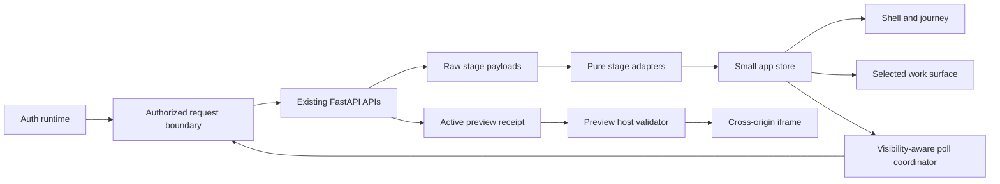

# Visual system, frontend architecture, and research evidence

## 1. Design premise

### Editorial Swiss - The Living Draft

OryxenAI turns raw experience into a structured, designed, verified portfolio. The
interface should feel like a draft becoming deliberate and finished, not like a
general-purpose AI chat product.

The visual premise uses materials associated with editorial and design work:

- warm paper-like canvas rather than a generic dark SaaS background;
- crisp rules and numbered stages rather than a field of cards;
- expressive display type used only at transitions and artifact headings;
- restrained technical labels for durable state; and
- one cobalt line that visually hands work from stage to stage.

The memorable moment is the **living draft line**. When the server confirms a stage
transition, a short stroke travels from the completed milestone to the next one.
Nothing else competes with it. During steady state the line is static.

This premise was selected over a neon “AI control room” because OryxenAI’s primary
material is the user’s story and resulting portfolio, not system telemetry. It was
selected over a neutral enterprise dashboard because ordered transformation is the
product’s defining interaction.

Editorial is the primary identity; Swiss design supplies the grid, typographic
hierarchy, and ordered information; minimalism limits weight and distraction; and a
restrained futuristic influence appears only in state-linked motion and the Preview
frame. The complete candidate-style evaluation, including rejected and ambiguous
directions, lives in
[the research evidence document](04-research-evidence-and-pattern-analysis.md).

## 2. Foundation tokens

### Color

Six foundation colors define the light-first product:

| Token | Value | Role |
| --- | --- | --- |
| `--canvas` | `#F3F0E8` | Warm application background |
| `--paper` | `#FCFBF7` | Reading and artifact surface |
| `--ink` | `#171A19` | Primary text and strong controls |
| `--graphite` | `#626660` | Secondary text and technical labels |
| `--rule` | `#D3CFC4` | Dividers, inactive journey, field boundaries |
| `--signal` | `#3157E7` | Current stage, focus, links, primary action |

Semantic state colors are reserved for state, not decoration:

| Token | Value | Use |
| --- | --- | --- |
| `--positive` | `#287356` | Confirmed approval, verification, completion |
| `--attention` | `#A9601E` | User action or recoverable warning |
| `--critical` | `#B33F3A` | Terminal/destructive error |
| `--preview-frame` | `#202422` | Neutral theater around generated portfolios |

Rules:

- Signal blue is the only decorative accent.
- State colors always appear with an icon and text; color is never the sole signal.
- Do not place low-opacity text on tinted backgrounds.
- Generated portfolio colors remain confined to the isolated Preview; they never
  overwrite product tokens.
- Dark mode is deferred. A half-complete dark theme would add CSS and testing cost
  without improving the primary workflow.

### Typography

Use one self-hosted variable display font and platform-native utility fonts:

| Role | Family | Use |
| --- | --- | --- |
| Display | `Newsreader`, serif | Auth thesis, stage transition title, artifact title |
| Body/UI | `system-ui`, `-apple-system`, `BlinkMacSystemFont`, `"Segoe UI"`, sans-serif | Navigation, controls, body copy |
| Utility | `ui-monospace`, `SFMono-Regular`, `Consolas`, monospace | Safe trace IDs, durations, route paths |

Only the Latin subset and used display weights should be shipped as WOFF2 with
`font-display: swap`. Body text does not wait for a webfont.
The family is available from [Google Fonts](https://fonts.google.com/specimen/Newsreader);
the implementation must check in the selected licensed files rather than request
them from a third-party origin at runtime.

Type scale:

| Token | Size/line height | Weight/use |
| --- | --- | --- |
| `--type-display` | `clamp(2.4rem, 6vw, 5.5rem) / 0.94` | Auth/start thesis only |
| `--type-h1` | `clamp(2rem, 4vw, 3.4rem) / 1.02` | Stage/artifact title |
| `--type-h2` | `1.5rem / 1.15` | Section heading |
| `--type-body-lg` | `1.125rem / 1.55` | Introductory copy |
| `--type-body` | `1rem / 1.55` | Main content |
| `--type-small` | `0.875rem / 1.4` | Metadata and secondary controls |
| `--type-label` | `0.75rem / 1.2` | Uppercase journey/technical label, `0.08em` tracking |

Long artifacts use a readable measure of 68–74 characters. UI labels do not use the
display face. Uppercase appears only in short labels, never paragraphs.

### Spacing, shape, and elevation

- Base spacing unit: 4 px.
- Common sequence: 4, 8, 12, 16, 24, 32, 48, 64, 96.
- Reading surfaces use 24–48 px padding depending on viewport.
- Default control height: 44 px; compact secondary control: 36 px.
- Radius scale: 4 px fields, 8 px controls, 12 px sheets, 18 px only for the main
  artifact/preview boundary.
- Pills are reserved for short statuses or filters.
- Prefer rules and whitespace to card shadows.
- A sheet may use one soft shadow; ordinary panels do not.
- Borders are 1 px. The focused control uses a 2 px signal outline plus offset.

### Layout grid

- Maximum shell width: 1600 px.
- Main content gutter: `clamp(16px, 3vw, 48px)`.
- Readable artifact width: 820 px.
- Optional details sheet: 320–380 px.
- The desktop shell may use a 12-column grid, but components consume named regions,
  not hardcoded column numbers.
- `min-width: 0`, containment, and overflow boundaries are required for every grid or
  flex child holding artifacts or Preview.

## 3. Component language

### Core components

| Component | Responsibility |
| --- | --- |
| `AppShell` | Authenticated chrome, state freshness, account menu |
| `JourneyRail` | Ordered milestones, current/completed/attention navigation |
| `StartSurface` | First portfolio entry |
| `ConversationSurface` | Discovery transcript, current question, composer |
| `ArtifactSurface` | Approved/review content with navigation and metadata |
| `RevisionComposer` | Natural-language revision request where supported |
| `HandoffPanel` | Explains completed artifact and explicitly starts next stage |
| `ProgressSurface` | Semantic Build Preparation or Code Generator checkpoints |
| `AttentionPanel` | Safe error, preserved work, supported recovery |
| `PreviewSurface` | Toolbar and isolated iframe |
| `DetailsSheet` | Secondary activity, artifact summary, technical reference |
| `ConnectionBanner` | Offline, checking, or stale state without toast spam |
| `StatusAnnouncer` | One polite assistive-technology status region |

Each component has one product role. Do not create generic `Card`, `GlassPanel`, or
`AIMessage` components and build the product out of them.

### Controls

- Primary action: ink or signal fill, text names the outcome.
- Secondary action: paper background with ink border.
- Quiet action: text/icon, minimum hit target retained.
- Destructive action: critical styling and confirmation only for genuinely
  destructive administrator behavior.
- Loading action: preserve width, replace leading icon with a small progress stroke,
  and keep the specific verb visible.
- Disabled controls explain the gate only when the user could reasonably expect the
  action; locked future-stage controls are not rendered as disabled buttons.

### Iconography

Use a small checked-in set of outline SVG symbols with consistent 1.75 px strokes.
Required symbols are limited to journey completion/current state, warning, account,
menu, close, disclosure, refresh, new tab, and the four viewport modes. Do not add a
general icon package for this inventory.

### Illustration and loading mark

Create one decorative inline SVG under 4 KB:

- a horizontal rule enters as an unformed line;
- it passes through five small construction points;
- it resolves into a simple browser-frame rectangle;
- one short segment animates with `stroke-dashoffset` while a wait is active;
- the SVG is `aria-hidden`; adjacent text carries the state; and
- reduced motion displays the completed static geometry.

No raster illustration, Lottie runtime, video, canvas, WebGL, or particle system is
needed.

## 4. Motion system

Motion explains continuity or response:

| Event | Motion | Duration |
| --- | --- | --- |
| Button/field response | Color/opacity/2 px translate | 120 ms |
| Sheet/menu open | Opacity plus 8 px translate | 180 ms |
| User-selected surface change | Crossfade with slight directional translate | 260 ms |
| Confirmed stage handoff | Single draft-line stroke sweep | 420 ms |
| Active wait mark | Slow stroke loop only while genuinely waiting | 1200 ms cycle |

Use standard CSS transitions and the progressive
[View Transition API](https://developer.mozilla.org/en-US/docs/Web/API/View_Transition_API).
A browser without that API receives the final state immediately. No motion library
is justified.

Prohibited motion:

- continuously floating backgrounds;
- infinite glows or gradients;
- animated counters that imply progress;
- typing effects for already-complete model text;
- simultaneous animation of every milestone; and
- layout animation inside the Preview iframe from the host application.

`prefers-reduced-motion: reduce` removes spatial transition, stroke loops, and smooth
scrolling. It does not delay the state change.

## 5. Loading system

Loading is part of the information architecture, not one global spinner.

### Auth loader

Show the product thesis and compact draft-line mark while the controller resolves.
After two seconds, change only the copy to acknowledge a possible cold service. After
a network failure, stop the loop and show Retry.

### Shell skeleton

Render the stable top bar, journey geometry, and one work-surface rectangle. Skeleton
blocks must match final dimensions and use a low-contrast static tint; shimmer is not
needed.

### Durable work

Keep the prior question transcript or artifact visible. The progress component shows
the latest confirmed milestone and current semantic operation. It does not replace
the whole application with a loading screen.

### Preview load

Keep the Preview toolbar and frame size stable. Overlay “Opening verified Preview”
inside the frame boundary until the cross-origin load event or an explicit timeout.
On failure, replace the overlay with reconnect/refresh actions without discarding the
active receipt.

## 6. Frontend stack decision

### Options considered

| Option | Strength | Cost/risk | Decision |
| --- | --- | --- | --- |
| Continue one vanilla-JS application file | No new build step; smallest conceptual dependency | The product script is already a large monolith; complex lifecycle surfaces and concurrency would remain difficult to isolate and test | Do not extend the monolith |
| Modular vanilla JS with Web Components | Native platform, no framework runtime | More custom lifecycle/form/state plumbing; shadow styling and accessibility patterns add implementation burden without a product benefit | Rejected |
| Preact + TypeScript + Vite | Small runtime, React-like component model, static optimized output, gradual mount into the existing shell | Adds a Node build step and a small client toolchain | **Recommended** |
| Full React ecosystem with router, data cache, component kit, and motion library | Large ecosystem and familiar patterns | More runtime, duplicated abstractions, generic visuals, and capabilities this single-route product does not need | Rejected |
| Next.js or another frontend server | Integrated routing/rendering | Creates a second application server and deployment boundary beside FastAPI | Rejected |

Preact is not selected because “small” alone is a design strategy. It is selected
because the `/app` experience needs isolated, testable stateful surfaces while auth
and delivery can remain server-owned. Preact’s official site describes a roughly 3
kB core, and Vite produces a static production build without adding a frontend
server at runtime:

- <https://preactjs.com/>
- <https://preactjs.com/guide/v10/getting-started/>
- <https://vite.dev/guide/why.html>

### Runtime dependencies

Keep the product runtime list deliberately short:

- `preact`;
- no client router;
- no state library;
- no data-fetching/cache library;
- no component library;
- no animation library;
- no CSS-in-JS runtime;
- no Markdown framework: port the existing bounded DOM-node renderer to tested
  TypeScript, keep its length cap and safe link allowlist, and never render model
  Markdown through unsanitized `innerHTML`; and
- no embedded editor.

TypeScript and Vite are build-time dependencies. Test tooling is development-only
and does not affect the browser bundle.

### Source and build layout

Recommended later implementation layout:

```text
frontend/
  package.json
  package-lock.json
  tsconfig.json
  vite.config.ts
  src/
    app/
    auth-shared/
    components/
    stages/
    preview/
    data/
    styles/
    test/

src/oryxenai/web/static/product/   # generated Vite output, never hand-edited
```

The FastAPI/Jinja shell continues to supply the CSP-compatible asset entry and
runtime configuration. Authentication pages remain small existing ES modules and
consume the shared compiled token stylesheet rather than loading Preact.

The build output must be produced in CI/container packaging and included with the
application image. Development may use Vite for source iteration, but production
serves immutable compiled assets through the existing web/static boundary. This is a
future frontend integration task; this research package does not alter packaging.

## 7. Application architecture

### Data flow



### State ownership

- Server: identity, entitlement, session, approved artifacts, job state, revisions,
  error classification, active preview.
- URL: selected stage/view, validated Preview route and viewport.
- In-memory client state: normalized projections, active requests, open sheet/menu,
  ephemeral UI notices.
- `sessionStorage`: opaque session hint, unresolved idempotency key, and unsent
  revision draft only.
- Never persist bearer tokens, full stage payloads, approved artifacts, raw logs, or
  preview messages in application-owned web storage.

### App store

Use a small reducer and context; do not add a signals or state-management package.
Store slices:

- auth/me projection;
- canonical session identity/revision;
- raw responses per stage;
- normalized journey view models;
- connection state;
- active request registry; and
- selected URL view.

Avoid a universal mutable store and avoid component-level duplicate polling.

### API adapters

One pure adapter per stage:

```text
discovery response         -> DiscoveryViewModel
content response           -> ContentViewModel
visual design response     -> DesignViewModel
build preparation response -> PreparationViewModel
code generator response    -> GenerationViewModel + PreviewViewModel
```

The volatile preparation and generation adapters are the only normal-product modules
allowed to know internal stage codes or nested progress shapes. Unknown fields are
ignored; unknown required status values fail into an honest unsupported-state panel
and safe refetch, not a guessed success state.

### Poll coordinator

The poll coordinator owns cadence, visibility, backoff, abort signals, and resource
deduplication. Components request a resource subscription; they do not call
`setTimeout` independently. This prevents five stage loops from continuing after the
user has moved on or signed out.

### Error boundary

Have two levels:

- surface boundary: a broken artifact/preview component can recover without removing
  navigation and account controls;
- shell boundary: a fatal client render error shows a static reload action and a safe
  reference while clearing private rendered content that cannot be trusted.

Do not send client errors to a third-party telemetry service until privacy and
deployment policy explicitly admit it.

## 8. Preview architecture in the frontend

### Trust boundary

The Preview is generated, cross-origin content. The product host provides chrome and
controls; the generated site owns only its iframe document.

- The iframe URL comes exclusively from the validated active preview projection.
- Host controls never execute inside the generated document.
- The frame receives no application token or account identity.
- The host accepts only the existing versioned, exact-origin message schema.
- Preview navigation updates validated `/app` query state but cannot navigate the
  product shell.
- A new promotion replaces the iframe source only after the active pointer refreshes.
- The previous iframe may remain visible until the new verified source is ready, then
  be removed; the product never renders both as selectable versions.

### No preview technology replacement

Do not introduce Sandpack, WebContainers, `vite preview`, a per-portfolio container,
or a client-side source compiler. The repository already defines an object-backed,
verified preview gateway with local/hosted parity. Replacing it would increase client
weight and weaken the meaning of Preview.

## 9. Performance budget

The budgets are release gates for the future product frontend, measured on production
assets rather than source files.

| Metric | Budget |
| --- | --- |
| Auth critical JS | ≤35 kB gzip |
| Initial `/app` JS | ≤90 kB gzip |
| Any lazy product JS chunk | ≤60 kB gzip |
| Initial product CSS | ≤30 kB gzip |
| Initial self-hosted font transfer | ≤50 kB WOFF2 |
| LCP | ≤2.5 s at p75 |
| INP | ≤200 ms at p75 |
| CLS | ≤0.1 at p75 |
| Long task | No application-created task over 50 ms during normal interaction |

The Core Web Vitals targets follow the current
[web.dev thresholds](https://web.dev/articles/vitals); detailed INP guidance is at
<https://web.dev/articles/optimize-inp>.

### Techniques

- Lazy-load Preview and large artifact rendering.
- Do not preload the Preview origin before an active receipt exists.
- Use `content-visibility: auto` for long, collapsed artifacts/activity where browser
  support is acceptable.
- Bound activity DOM rather than adding a virtualization library prematurely.
- Use native `dialog` for confirmations and modal sheets, wrapped by one tested focus
  and dismissal primitive. Use ordinary positioned disclosure panels for non-modal
  details; do not add a popover library.
- Avoid layout reads inside animation loops.
- Animate only transform, opacity, and SVG strokes.
- Use width/height or aspect-ratio for every media/frame placeholder.
- Cache immutable product assets with content hashes; keep authenticated HTML and
  durable state responses non-cacheable according to the existing policy.
- Suspend polling and waiting animation in hidden documents.
- Import stage-specific code on first entry, not during auth.

### Measurement

- Add a production bundle-size report and fail CI when a budget is exceeded.
- Use Lighthouse or equivalent as a diagnostic, not the only acceptance signal.
- Exercise auth cold start, active polling, a long artifact, and Preview on a throttled
  mid-tier mobile profile.
- Inspect memory after a long multi-stage session and repeated Preview route changes.
- Record field Web Vitals only after a privacy/telemetry decision; do not add third-
  party analytics implicitly.

## 10. Accessibility architecture

- Prefer native buttons, links, forms, headings, selects, dialog, and details/summary
  where their semantics match.
- Use one polite status region. WAI-ARIA’s status guidance recommends polite updates
  that do not move focus: <https://www.w3.org/WAI/WCAG21/Techniques/aria/ARIA25>.
- Journey navigation is an ordered list with the current step identified in text and
  semantics.
- A progress checklist is not a tablist unless selecting a milestone actually changes
  the visible panel with tab behavior.
- A visually resizable Preview frame does not require an inaccessible drag handle;
  fixed viewport buttons are sufficient.
- Respect system zoom, forced colors, reduced motion, and contrast preferences.
- Test dynamic updates with a screen reader so poll cadence does not become announcement
  cadence.

## 11. External product research

External products are comparison evidence, not templates. Their features are useful
only when OryxenAI has the same user need and backend capability.

| Product/pattern | Verified observation from official material | OryxenAI conclusion |
| --- | --- | --- |
| v0 Projects | One project may contain multiple chats and share deployment/settings | Do not copy the project/chat hierarchy; OryxenAI normal users have one canonical portfolio |
| v0 quickstart | Preview, design controls, and code are adjacent | Keep Preview close after generation, but do not expose unsupported code/design editing |
| Replit Agent | Agent work, Preview, checkpoints, and publishing are distinct concepts | Preserve the distinction between work and Preview; omit checkpoints/publish without contracts |
| Lovable | Chat/agent modes, visual edits, history, and publishing are product features | Use artifact review and clear publish separation; do not imitate visual editing/history |
| Bolt | Chat and Preview are default; code is an optional technical surface | The result can dominate late in the flow, but normal users do not need code view |
| Figma Make | Planning and annotations sit beside functional Preview and publishing | Review before build is valuable; element annotation/publishing is not available here |
| Google Stitch | Agent activity can stream visibly into a spatial design canvas | Visible continuity is useful; an unverified streaming canvas conflicts with promoted-only Preview |
| Rocket | Preview exposes route, device, refresh, screenshot/edit, staging, and production concepts | Adopt only route, supported viewport, refresh, and new-tab controls |
| Emergent | Long-running generation uses questions, status, tests, and temporary Preview | Separate user attention from work; do not imply resumability beyond durable state |
| Cursor background agents | Users can follow, steer, and take over background work | Do not display steer/take-over controls because OryxenAI cannot honor them |
| GitHub Copilot coding agent | Sessions centralize status, logs, and steering | A central current-work surface is useful; raw logs and steering are not normal-product needs |

### Official sources checked 2026-09-02

- v0 Projects: <https://api2.v0.dev/docs/projects>
- v0 Quickstart: <https://api2.v0.dev/docs/quickstart>
- v0 Deployments: <https://api2.v0.dev/docs/deployments>
- Replit Agent: <https://docs.replit.com/learn/build-with-agent>
- Replit first app: <https://docs.replit.com/build/your-first-app>
- Lovable getting started: <https://docs.lovable.dev/introduction/getting-started>
- Lovable visibility: <https://docs.lovable.dev/features/project-visibility>
- Lovable publishing: <https://docs.lovable.dev/features/publish>
- Bolt code view: <https://support.bolt.new/building/using-bolt/code-view>
- Bolt history/restore: <https://support.bolt.new/building/using-bolt/rollback-backup>
- Figma Make creation: <https://help.figma.com/hc/en-us/articles/31304485164695-Create-a-Figma-Make-file>
- Figma Make publishing: <https://help.figma.com/hc/en-us/articles/31304586129559-Publish-update-or-unpublish-a-functional-prototype-or-web-app>
- Google Stitch update: <https://blog.google/innovation-and-ai/models-and-research/google-labs/stitch-updates/>
- Rocket mobile Preview: <https://docs.rocket.new/command-center/preview/mobile>
- Rocket launch: <https://docs.rocket.new/build/launch-web/launch-your-site>
- Emergent tutorial: <https://emergent.sh/tutorials/how-to-build-an-app-from-chatgpt-using-emergent-mcp>
- Cursor background agents: <https://docs.cursor.com/background-agent>
- GitHub Copilot agent management: <https://docs.github.com/en/copilot/concepts/agents/cloud-agent/agent-management>

Pages and products change rapidly. Re-check these sources when implementation begins;
the repository contracts remain authoritative for what OryxenAI can safely expose.

## 12. Repository observations

### Source evidence

- `src/oryxenai/web/templates/index.html` and
  `src/oryxenai/web/static/app.js` form the main temporary product/development shell.
- `src/oryxenai/web/templates/code_generator_development.html` and its dedicated
  scripts form a separate Code Generator development control room.
- Build Preparation fixture templates expose diagnostic inputs, internal events, and
  materialization details intended for development.
- The main product script uses independent polling loops and contains enough behavior
  that extending the same monolith would increase coupling.
- The auth shell and product/development surfaces use visibly different palettes and
  typography, so a shared token and component language is needed.

Verify exact files with `src/oryxenai/web/routes.py` and `rg --files
src/oryxenai/web`. Do not freeze a line count, test count, or model name in this
document.

### Direct visual observation

The local app was inspected in its available development configuration:

- the main pipeline is a dark, card-oriented four-stage workspace;
- Build Preparation uses a light diagnostic fixture with internal stages and JSON;
- Code Generator uses a dense three-column control room with run spine, Preview, and
  inspectors; and
- auth has a separate light beige/green visual shell.

These interfaces contain valuable behavior, but their visual inconsistency and
developer density should not be preserved as the normal-user product architecture.

## 13. Unsupported or unresolved contracts

These are documented so the future frontend does not invent behavior:

| Capability | State | Frontend treatment |
| --- | --- | --- |
| Cancel/pause/steer a running agent | Not exposed as a normal product contract | No control |
| Queue a follow-up during generation | Not exposed | No composer |
| View or roll back versions | No user-visible version contract | No history UI |
| Preview unverified work | Forbidden by preview architecture | Never render it |
| Publish/share/custom domain | Outside the preview contract | Label only as future product work |
| Select a Preview element for AI editing | No host/preview protocol | No selector or edit mode |
| User-visible Build Preparation internal stage stability | Evolving | Translate through one adapter and support unknown fallback |
| Exact retry availability | Entitlement and error dependent | Render only from server-authoritative eligibility |
| Global active-job center | Normal users have one portfolio | Keep activity local to the current portfolio |
| Mobile source editing | No normal source editor | Not applicable |

If a future requirement needs one of these, design the backend and security contract
first. Do not reserve dead UI for hypothetical features.

## 14. Later implementation sequence

This is the recommended order after the research direction is approved:

1. Establish the Vite/Preact build, tokens, auth-shared CSS, request boundary, and
   normalized adapters without changing product behavior.
2. Rebuild auth resolution, sign-in, callback, account states, and onboarding with the
   shared visual language; retain existing auth tests and route rules.
3. Build the `/app` shell, URL codec, journey rail, start/resume logic, connection
   handling, and multi-tab invalidation.
4. Port Discovery to conversation/artifact surfaces and preserve its approval flow.
5. Port Content and Design to artifact/revision/approval surfaces.
6. Integrate Build Preparation through its adapter using user-facing milestones.
7. Integrate the production Code Generator session endpoints, leaving the development
   control room untouched.
8. Add the isolated Preview surface and validate exact-origin behavior.
9. Complete responsive, accessibility, performance, and long-session testing.
10. Remove only the superseded normal-product assets after parity is proven; retain
    explicitly configured developer harnesses.

Every step should remain deployable and should not auto-chain stages or weaken the
verified-preview boundary.

## 15. Definition of done for the future frontend

- The whole normal-user journey is navigable without developer vocabulary.
- Authentication never flashes private content or loops on failure.
- First-time and returning users land on the correct `/app` posture.
- Every durable state maps to one honest, tested presentation.
- User attention is visually distinct from background work.
- No stage claims unsupported progress or capabilities.
- Build Preparation and Code Generator backend evolution is isolated to adapters.
- The prior active Preview survives an unsuccessful later run.
- Preview remains exact-origin isolated and displays only promoted content.
- Mobile can start, answer, approve, monitor, and inspect without reproducing the
  desktop control room.
- Keyboard, screen-reader, reduced-motion, zoom, contrast, and focus behavior pass the
  acceptance matrix.
- Production assets satisfy the size and Core Web Vitals budgets.
- The interface looks recognizably OryxenAI through typography, editorial surfaces,
  and the living draft line without relying on heavy animation or imagery.
