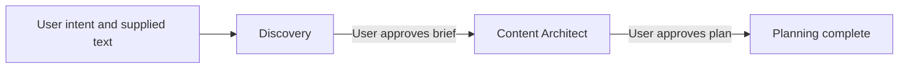
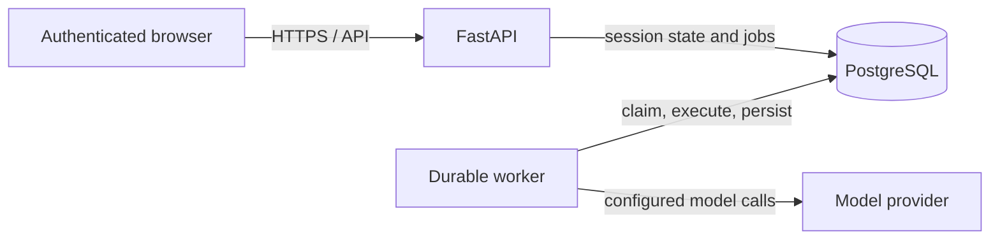

# OryxenAI Architecture Manual — System Foundations, Runtime & Security

> Current architecture summary. Source code and configuration define runtime
> behavior; historical reports are not current capability descriptions.

## 1. System overview and core invariants

OryxenAI currently supports portfolio planning through two explicit stages:
Discovery and Content Architect. Discovery gathers intent and produces an
approved brief. Content Architect consumes that approved snapshot and produces
an approved content plan. The active product ends at that approval boundary.

Core invariants:

1. Stage starts and approvals are separate, explicit actions.
2. Content Architect receives only an approved Discovery projection.
3. Models run behind the provider-neutral ModelClient interface.
4. Sessions use revision checks when workers write state.
5. Durable work is stored in PostgreSQL; there is no external queue.
6. Historical records are preserved but projected separately from active state.
7. Secrets stay server-side and outside committed configuration.

## 2. Runtime lifecycle and process boundaries

The API serves the product bundle and authenticated routes. The worker is a
separate process. API and worker communicate through committed PostgreSQL
transactions and durable job rows, not in-process calls or an external broker.

The native launch scripts start API and worker processes. Compose starts
PostgreSQL, a one-shot migration service, API, and worker. Shutdown stops job
claiming, allows in-flight work to settle within the configured grace period,
and closes database/model resources.

## 3. Persistence model

PostgreSQL is the source of truth for identity, ownership, sessions, runs, jobs,
model usage, and administration. Session aggregates store stage state as JSONB
with a revision counter. Each agent run stores its input, before/after state,
output, status, timing, and safe error envelope.

Current API projections validate state against the active schemas. Historical
state and output are retained for audit and authorized cleanup; they are not
returned as active product state. Schema migrations preserve historical rows
unless a separate, explicit data-lifecycle operation removes them.

## 4. Durable jobs and workers

The API enqueues jobs in the same transaction as the state transition. Workers
claim due jobs with row locking and skip locked rows, renew their lease while
running, and persist safe results or errors. Retries use configured backoff and
attempt limits. Expired leases are recovered without allowing two workers to
own the same valid lease at once.

The handler registry determines which job kinds a worker can claim. Old
unregistered job rows remain stored and are not executed by current handlers.

## 5. Authentication, identity, and session security

Supabase restores the browser session. The server verifies signed identity
tokens, admits verified users according to configured policy, and returns a
safe local identity projection. Username onboarding precedes the product
workspace when required.

Every portfolio session is owner-scoped. Administrator access is explicit and
audited. The product boot boundary does not expose provider credentials or
session data before identity verification. See docs/Auth/ for the detailed
authorization and lifecycle contracts.

## 6. Entitlements and worker fencing

Normal-user portfolio mutations require an active entitlement bound to the
owned session. Durable work stores trusted owner and actor snapshots. Workers
recheck ownership, account state, and entitlement revision before applying
portfolio mutations. These checks remain independent of model output and
client-supplied identity.

## 7. Administration and cleanup

Administrator operations are audited and resumable. Account or portfolio
cleanup removes related sessions, jobs, audit-linked records, and stored
artifacts using the archive boundary. Historical cleanup is distinct from
normal product access; current routes do not serve stored legacy output.

## 8. Model client and provider routing

Model-backed calls use ModelClient. Per-operation routing, profile selection,
provider endpoint, model identifier, and credential environment-variable names
are configured in config/models.toml. API keys are read from the process
environment by the provider adapter and must never be returned in responses,
logs, or generated browser assets.

Normal tests use deterministic fixtures. Live provider access occurs only
through an explicitly requested live operation or a separately configured
diagnostic.
