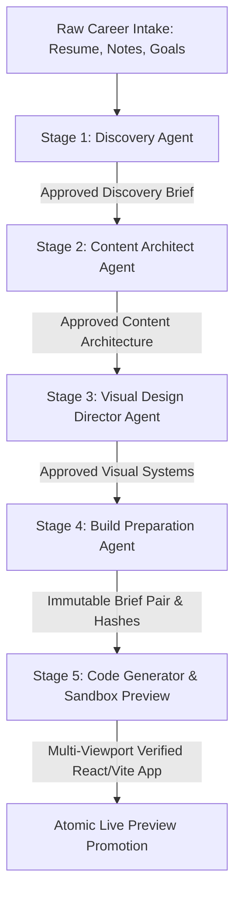
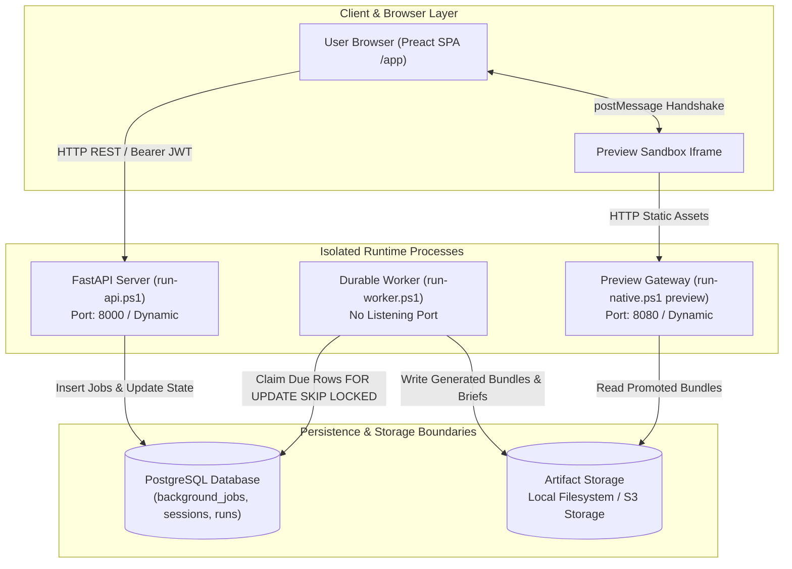
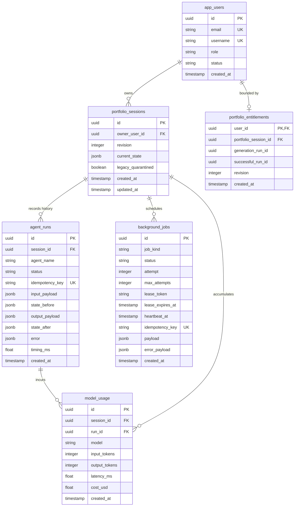
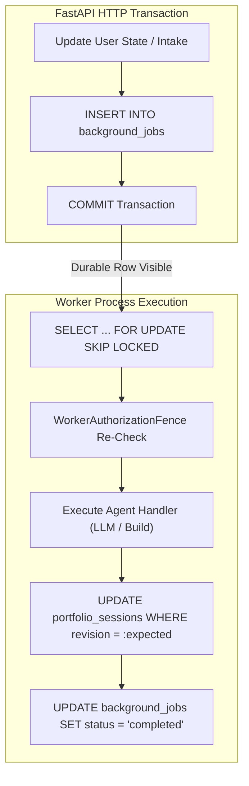
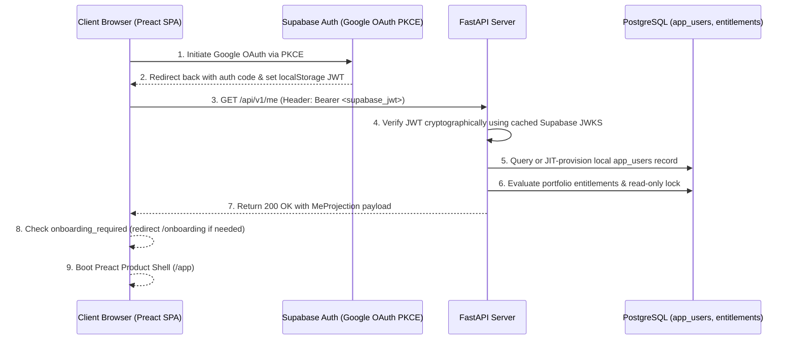
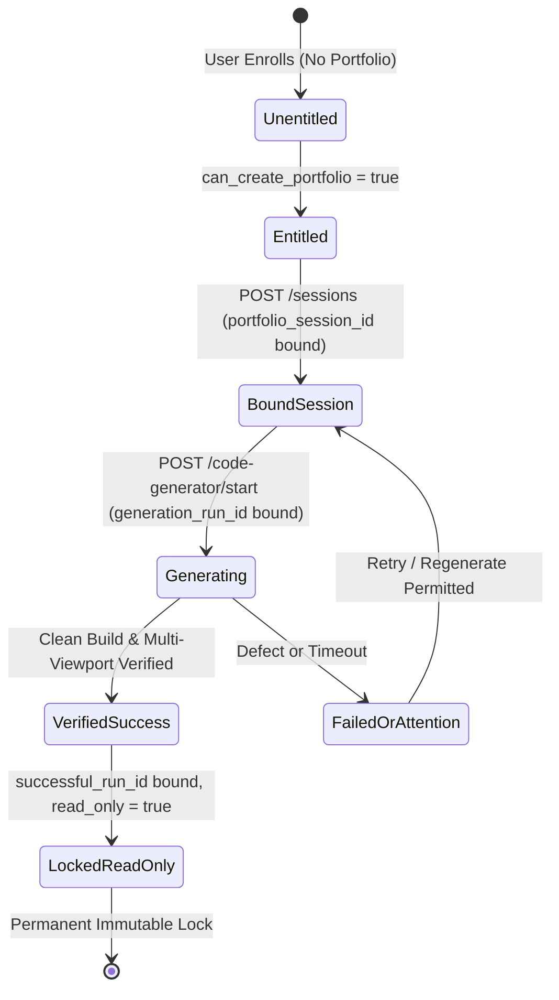
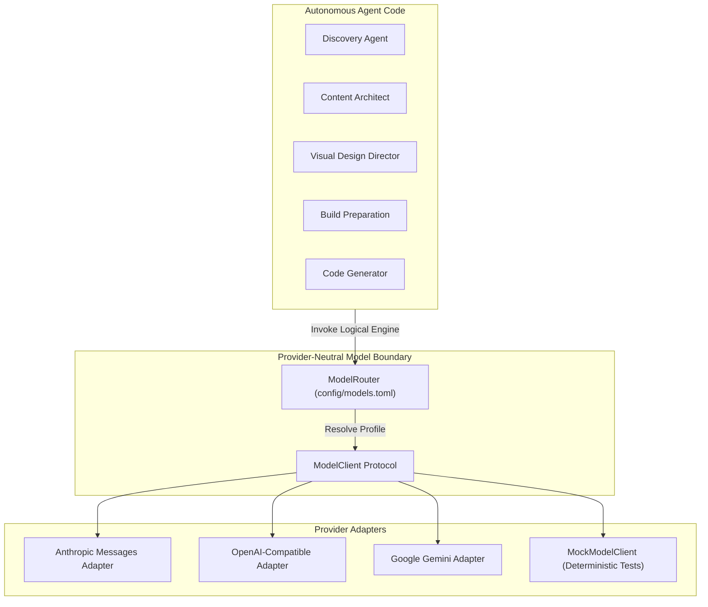

# OryxenAI Architecture Manual — Part 1: System Foundations, Runtime & Security

> **Target Audience:** Systems Architects, SREs, Security Engineers, and Core Platform Developers.
> **Scope:** Canonical architectural manual covering system thesis, process boundaries, PostgreSQL persistence, durable queue engine, authentication, entitlements, worker fencing, admin lifecycles, and provider-neutral model routing.

---

# Table of Contents
1. [System Overview & Core Invariants](#1-system-overview--core-invariants)
2. [Runtime Lifecycle & Process Boundaries](#2-runtime-lifecycle--process-boundaries)
3. [Database Schema & Persistence Model](#3-database-schema--persistence-model)
4. [Durable Job Queue & Worker Engine](#4-durable-job-queue--worker-engine)
5. [Authentication, Identity & Session Security](#5-authentication-identity--session-security)
6. [Entitlements, Quotas & Worker Fencing](#6-entitlements-quotas--worker-fencing)
7. [Admin Lifecycle, Audit & Maintenance](#7-admin-lifecycle-audit--maintenance)
8. [Model Client & Provider Routing](#8-model-client--provider-routing)

---

## 1. System Overview & Core Invariants

OryxenAI is an autonomous, multi-agent portfolio generation platform designed to transform raw, unstructured human career experience (resumes, LinkedIn profiles, career notes, code samples, personal portfolio goals) into a fully synthesized, aesthetically exquisite, and multi-viewport verified web portfolio.

Rather than relying on generic website templates, superficial AI rephrasings, or fragile monolithic code generation prompts, OryxenAI breaks down portfolio creation into five specialized, sequential transformation phases. Each phase is executed by a dedicated domain agent with strict inputs, validated output contracts, and explicit human approval gates.



### 1.1 The Five Pipeline Stages Overview
1. **Stage 1: Discovery Agent (`discovery`):** Intakes raw career material, identifies gaps, clarifies intent via adaptive one-at-a-time questions, and synthesizes a structured profile and executive brief stamped with `brief_hash` (SHA-256).
2. **Stage 2: Content Architect Agent (`content_architect`):** Consumes approved Discovery facts (never raw resumes). Determines narrative thesis, route plans, machine-addressable sections, and visitor copy while auditing claim evidence and omissions. Stamped with `content_hash`.
3. **Stage 3: Visual Design Director Agent (`visual_design_director`):** Consumes approved Content Architecture. Establishes design tokens, typography scales, color intent, motion systems, scene-by-scene layout choreography, and consults a deterministic component catalogue. Stamped with `visual_direction_hash`.
4. **Stage 4: Build Preparation Agent (`build_preparation`):** A hidden compiler stage. Compiles approved public scope deterministically, discovers real external candidate imagery/components without downloading bytes, makes a single bounded model call for visual prose, and outputs two Markdown briefs with fenced JSON indexes.
5. **Stage 5: Code Generator & Sandbox Preview (`code_generator`):** Consumes immutable brief pair. Executes progressive React/Vite generation, acquires pinned assets, verifies clean build compilation, executes multi-viewport headless browser geometry audits, runs bounded self-repair, and atomically promotes the artifact to the preview gateway.

### 1.2 Non-Negotiable Core Invariants
1. **No Automatic Chaining:** Approving stage $N$ never automatically triggers stage $N+1$. Every stage start requires an explicit, user-authorized HTTP `POST`.
2. **One-Way Upstream Gating:** Stage $N$ requires stage $N-1$ to be in its terminal approved or ready state before it can start.
3. **No Revise-After-Approve:** Once a stage reaches `approved`, that stage's state machine is permanently locked for that session revision. Natural-language revisions occur only prior to approval.
4. **No Framework Proliferation (Explicit Python Agents):** The platform avoids heavy agent frameworks (LangChain, CrewAI, AutoGen). Each agent is implemented as an explicit, inspectable Python protocol with small Pydantic schemas, isolated prompt files, and deterministic validators.
5. **Provider-Neutral Model Boundary:** Agents interact with LLMs via a provider-neutral `ModelClient` protocol. Logical engine profiles (`[profiles.<stage>]`) in `config/models.toml` route to specific providers. Secrets are resolved indirectly via `api_key_env` names.
6. **Two-Level Persistence Model (JSONB):** Aggregate current state lives under `portfolio_sessions.current_state` (JSONB) with optimistic locking `revision`. Run history lives in `agent_runs` as an immutable append-only ledger.
7. **Single-Portfolio User Entitlement:** Normal users (`role == "user"`) are entitled to exactly one portfolio lifecycle. Once verified, `me.read_only` becomes `true`, locking all mutation endpoints on the server.
8. **Asynchronous Durable Queue:** Agent executions are durable background jobs stored in PostgreSQL `background_jobs` and claimed using `SELECT ... FOR UPDATE SKIP LOCKED`.

### 1.3 Config-Driven Policy
- **Secrets:** Live exclusively in `.env` (git-ignored). Never committed, never logged, never returned in APIs.
- **App & Worker Settings:** Defined in `config/app.toml`, overlaid by `config/app.docker.toml` or `config/app.test.toml`.
- **Model Profiles:** Defined in `config/models.toml`. Changing provider/model/keys never requires an agent code change.
- **Migration URL:** Resolved dynamically from settings, not hardcoded in `alembic.ini`.

---

## 2. Runtime Lifecycle & Process Boundaries

OryxenAI enforces strict process isolation between synchronous user HTTP interactions, asynchronous heavy computational workloads, and isolated preview hosting.



### 2.1 Process Isolation Invariants
1. **Independent Containers / Execution Units:** The API server and background worker share the codebase and virtual environment, but **never execute within the same process or container**.
2. **One-Way Command Initiation:** The API server enqueues job rows in PostgreSQL within the user's database transaction. It never invokes agent workflows in-process.
3. **No Direct Network IPC:** Communication between API and Worker occurs exclusively through the PostgreSQL database (`background_jobs` and `portfolio_sessions`). There is no Redis, Celery, gRPC, or socket connection between them.
4. **Isolated Preview Gateway Origin:** Generated portfolios are hosted on a dedicated Preview Gateway with separate host headers and strict Content Security Policies (CSP).

### 2.2 Process Startup & Graceful Shutdown
- **Startup Sequence:** Verifies `.env` secrets -> validates PostgreSQL async connection -> confirms Alembic migration head alignment -> checks artifact store writability -> registers signal handlers (`SIGINT`, `SIGTERM`).
- **Graceful Draining:** Upon receiving `SIGTERM` or `SIGINT`, the worker immediately halts its poll loop, grants in-flight jobs a 30-second grace period while maintaining heartbeats, surrenders unfinished leases back to `status = 'queued'`, disposes database engine pools, and exits with code 0.

---

## 3. Database Schema & Persistence Model

PostgreSQL serves as the single source of truth. OryxenAI combines relational integrity for lifecycle tracking with JSONB flexibility for evolving agent data.



### 3.1 The Two-Level State Model
- **Level 1: Current Aggregate State (`portfolio_sessions.current_state`):** A single JSONB column containing the latest merged state across all stages (`discovery`, `content_architect`, `visual_design_director`, `build_preparation`, `code_generator`). Protected by an incrementing integer `revision` for optimistic concurrency control.
- **Level 2: Immutable Execution Run History (`agent_runs`):** An append-only relational ledger recording every execution: `state_before`, `input_payload`, `output_payload`, `state_after`, `timing_ms`, `error`, and `idempotency_key`. Provides complete forensic accountability without risking live session state.

### 3.2 Relational Tables Overview
- `portfolio_sessions`: Manages session identity, owner UUID, revision counter, and aggregate JSONB state.
- `background_jobs`: Persisted durable queue with lease tokens, heartbeats, and retry metadata.
- `agent_runs`: Audit history of all agent invocations.
- `app_users`: Local identity projections from Supabase Auth (`id`, `email`, `username`, `role`, `status`).
- `portfolio_entitlements`: Enforces Phase 3 single-portfolio, single-generation, and post-success read-only constraints.
- `model_call_cache` & `model_usage`: Tracks token usage, latency, estimated costs, and enables deterministic offline replay.
- `admin_audit_logs`: Records all administrative interventions.

---

## 4. Durable Job Queue & Worker Engine

OryxenAI coordinates heavy agent tasks via a PostgreSQL-native queue, avoiding external brokers.



### 4.1 Claim Mechanics: `FOR UPDATE SKIP LOCKED`
Workers claim due rows without lock contention:
```sql
WITH due_job AS (
    SELECT id
    FROM background_jobs
    WHERE status = 'queued'
      AND scheduled_at <= NOW()
    ORDER BY scheduled_at ASC
    LIMIT 1
    FOR UPDATE SKIP LOCKED
)
UPDATE background_jobs
SET status = 'running',
    attempt = attempt + 1,
    lease_token = :worker_lease_token,
    lease_expires_at = NOW() + :lease_duration_interval,
    heartbeat_at = NOW()
FROM due_job
WHERE background_jobs.id = due_job.id
RETURNING background_jobs.*;
```

### 4.2 Lease Heartbeating & Stale Recovery
- Claimed jobs hold a `lease_token` and `lease_expires_at` (60–120s).
- Workers update `heartbeat_at` and extend `lease_expires_at` every 15s.
- If a worker crashes, a background recovery query resets expired running jobs to `status = 'queued'` (or `'failed'` if `attempt >= max_attempts`).

### 4.3 Optimistic Concurrency Control (CAS Updates)
Workers write back state using Compare-and-Swap:
```sql
UPDATE portfolio_sessions
SET current_state = jsonb_set(current_state, '{content_architect}', :new_state),
    revision = revision + 1,
    updated_at = NOW()
WHERE id = :session_id
  AND revision = :expected_revision;
```
If zero rows are updated, a concurrent modification occurred; the worker raises `RevisionConflictError` and rolls back.

---

## 5. Authentication, Identity & Session Security

OryxenAI implements a zero-trust identity layer delegating credential management to Supabase Auth while maintaining local relational authority.



### 5.1 Asymmetric JWT Verification (`oryxenai.auth.jwt`)
- Fetches and caches public keys from `{SUPABASE_URL}/auth/v1/.well-known/jwks.json` with a 1-hour TTL.
- Verifies RS256/ES256 signatures, `iss`, `aud`, expiration, and subject UUID.
- Requires `Authorization: Bearer <token>` on all API calls; eliminates CSRF vulnerabilities.

### 5.2 JIT Provisioning & Capacity Gate
- On first login, resolves or inserts the user into `app_users`.
- Bootstrap administrator emails in `auth.bootstrap_admin_emails` are automatically assigned `role = 'admin'`.
- Normal users (`role = 'user'`) are bounded by `auth.max_normal_users` (default: 15). Excess signups receive `403 CAPACITY_EXCEEDED`.

### 5.3 One-Time Username Onboarding (`/onboarding`)
- Unclaimed users have `username = NULL` and `onboarding_required = true`.
- Enforces 3–30 lowercase alphanumeric characters (`^[a-z0-9](?:[a-z0-9_-]{1,28})[a-z0-9]$`), blocks email formats, and rejects reserved system names (`admin`, `api`, `app`, `auth`, `health`, etc.).

---

## 6. Entitlements, Quotas & Worker Fencing



### 6.1 Server-Side Mutation Guards (`require_mutable_portfolio`)
- Normal users receive exactly **one** portfolio lifecycle (`can_create_portfolio = false` once created).
- Once a portfolio achieves a verified live preview, `successful_run_id` is bound and `me.read_only = true`.
- All mutating endpoints (`POST`, `PUT`) reject subsequent calls with `403 PORTFOLIO_READ_ONLY`.

### 6.2 The Worker Authorization Fence (`WorkerAuthorizationFence`)
Workers re-authorize jobs immediately before execution to prevent executing work for suspended or tampered accounts:
1. Re-queries `PortfolioSession`: confirms owner matches and status is active.
2. Re-queries `AppUser`: asserts `status == 'active'`. If actor != owner, asserts actor is an admin.
3. Re-queries `PortfolioEntitlements`: asserts `successful_run_id` is null (unless admin).
4. Rejections raise `AuthorizationFenceError` and fail-closed without calling LLM APIs.

---

## 7. Admin Lifecycle, Audit & Maintenance

OryxenAI isolates platform administration in `src/oryxenai/auth/admin/`.

### 7.1 Key Operations
- **Cross-Tenant Session Browsing:** `GET /api/v1/admin/sessions` allows administrators to inspect any user's session, tokens, and verification status.
- **Entitlement Reset:** `POST /api/v1/admin/users/{id}/reset-entitlement` unbinds `successful_run_id`, unsets read-only locks, and allows beta users an additional generation attempt.
- **Resumable Cascading Deletion:** Deletes sessions, database runs, background jobs, and physical preview files cleanly. Interrupted deletions remain marked `deletion_pending` until fully pruned.
- **Forensic Audit Logging:** Every mutating action is stored in `admin_audit_logs` with actor ID, target entity, timestamp, IP address, and payload diffs.
- **Admin Console:** Zero-build Jinja2 + vanilla JS control plane served at `/admin`.

---

## 8. Model Client & Provider Routing

Agent code never imports proprietary LLM SDKs, relying on the provider-neutral `ModelClient` protocol.



### 8.1 Model Profiles (`config/models.toml`)
Profiles define parameters per stage:
```toml
[profiles.discovery]
provider = "anthropic"
model = "claude-3-7-sonnet-20250219"
api_key_env = "ANTHROPIC_API_KEY"
max_tokens = 4096
temperature = 0.3
```
- **Secret Indirection:** The API key is resolved from `os.environ[profile.api_key_env]` only when an actual model call is dispatched.
- **Deterministic Testing:** Normal unit tests inject `MockModelClient`, avoiding network sockets and API billing. Live calls are strictly opt-in via `@pytest.mark.live_model`.
- **Usage Accounting:** Captures token counts, latencies, and costs into the `model_usage` table.
