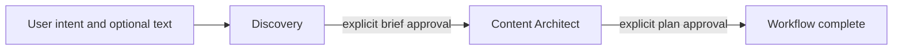

# OryxenAI Architecture Manual — Active Agent Workflow

> This document describes the active workflow in the repository. The registry,
> API router, and stage implementations are the source of truth.

## 1. Workflow boundary

The supported workflow contains Discovery and Content Architect. It starts
with supplied user intent, produces a reviewed brief, then produces a reviewed
content plan. The plan approval is the terminal product state.

Approval never auto-starts another stage. A caller explicitly starts Content
Architect only after Discovery is approved.

## 2. Shared agent contract

Agents implement the shared Python Agent protocol and receive structured
AgentContext data. They do not receive a database session or HTTP request.
The executor owns run records, job enqueueing, and state persistence. Agent
keys are defined by AgentKey and registered by the shared agent registry.

Each model call uses ModelClient. Operation routing and provider settings live
in config/models.toml. The provider adapter receives trusted prompt content
separately from untrusted user input. Model output is validated against the
agent's transport schema before persistence.

## 3. Discovery

Discovery turns user intent, optional plain-text document content, and the
user's goal into a brief. It asks a bounded set of questions when useful,
accepts answers, and produces an editable Markdown brief with a short user
summary and structured profile.

The five HTTP operations are:

| Method | Route suffix | Purpose |
|---|---|---|
| GET | /discovery | Read current state |
| POST | /discovery/start | Store intake and enqueue questions |
| PUT | /discovery/answers | Save answers and continue |
| POST | /discovery/revise | Revise the brief while under review |
| POST | /discovery/approve | Store an approved brief snapshot |

The durable jobs are Discovery question generation and brief generation.
State is held in portfolio_sessions JSONB. The nine-status state machine
tracks question work, answer collection, brief review, approval, and attention
required. Optimistic session revision checks prevent late results from
overwriting newer user edits.

Only the transport envelope is schema-validated; brief Markdown remains free
text. Intake and attached document text are treated as untrusted input and
are not fetched or analyzed as external resources.

## 4. Content Architect

Content Architect requires an approved Discovery snapshot. It receives the
brief title, short summary, structured facts, open items, source hash, and
optional user preferences; it does not receive the raw source document or full
Discovery prose.

One durable content_architect.build job performs an adaptive workflow:

1. plan_content selects the narrative and route plan and may produce the full
   content in the same response.
2. write_pages runs only if the plan deferred content.
3. integrate_content runs only when cross-route reconciliation is needed.

The result contains claim grounding, publication status, a route plan, page
content packs, a public manifest, user summary, and decision provenance.
Approval requires at least one publishable route and a complete, safe public
projection. The five statuses are not_started, build_running, content_review,
approved, and needs_attention. Revisions are allowed only before approval.

The four HTTP operations are:

| Method | Route suffix | Purpose |
|---|---|---|
| GET | /content-architect | Read current state |
| POST | /content-architect/start | Start from approved Discovery |
| POST | /content-architect/revise | Revise content under review |
| POST | /content-architect/approve | Approve the reviewed plan |

## 5. Persistence and job execution

A stage start creates an agent run and a durable PostgreSQL job. The worker
claims only registered job kinds with SELECT FOR UPDATE SKIP LOCKED. Handler
sessions are independent of the API transaction. Successful output is
applied through optimistic session revision checks; stale results remain in
run history without replacing newer state.

Retryable provider and output-contract failures use the configured retry
policy. Terminal errors are stored as safe envelopes and reflected in the
stage state. The UI polls current state and job progress; it does not depend on
a model token stream.

## 6. Product and privacy boundary

The authenticated product exposes Discovery and Content Architect state
through current schema projections. It does not expose arbitrary JSONB keys
from historical state. Content Architect receives only the approved Discovery
snapshot, and its internal review notes are excluded from public content
projections.

Run src/oryxenai/agents/discovery/README.md and
src/oryxenai/agents/content_architect/README.md for the current detailed route,
prompt, state, and validation contracts.
