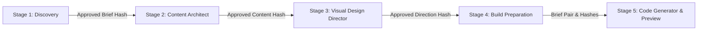
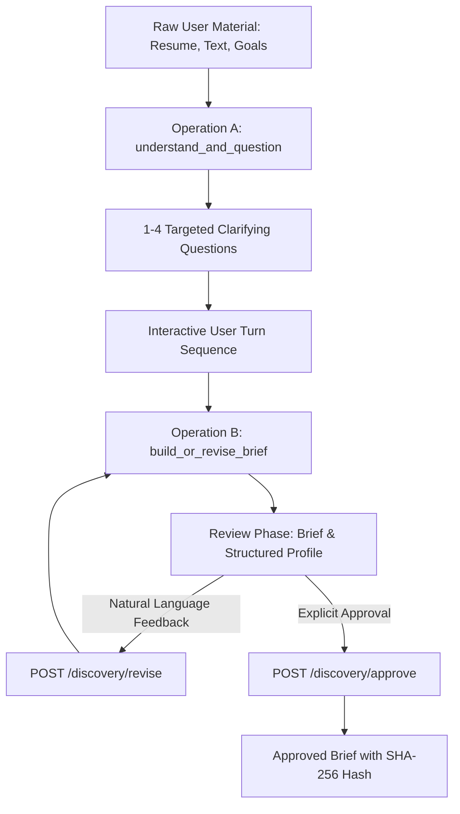
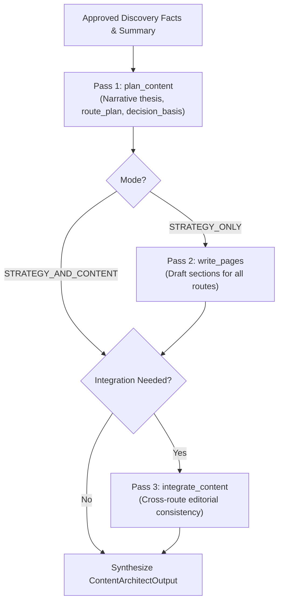
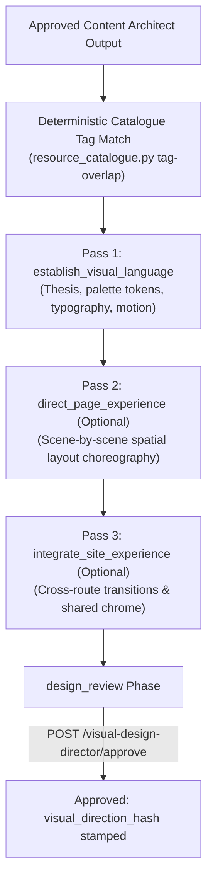
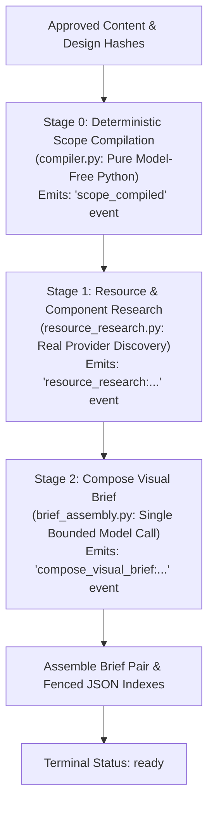
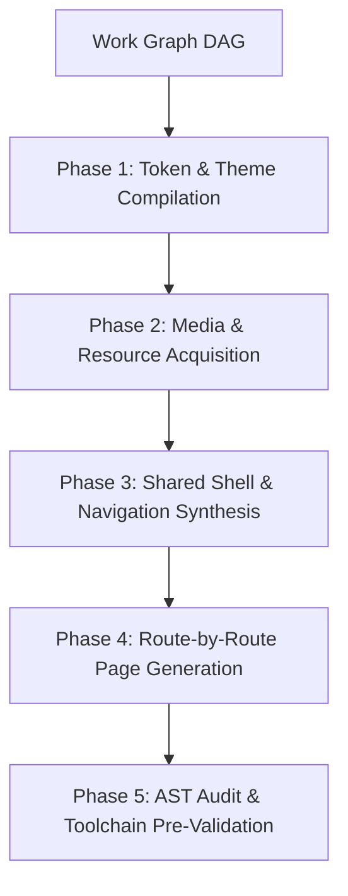
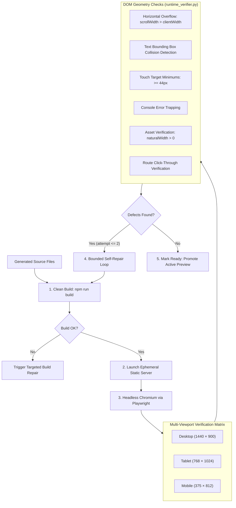

# OryxenAI Architecture Manual — Part 2: The Five-Agent Pipeline & Code Generation Engine

> **Target Audience:** Prompt Engineers, Compiler Specialists, Frontend Architects, and Agent Developers.
> **Scope:** Canonical architectural manual covering end-to-end implementation of all five agents: Discovery, Content Architect, Visual Design Director, Build Preparation, and Code Generator (Planning, Progressive Orchestration, Headless Verification, and Self-Repair).

---

# Table of Contents
1. [Global Pipeline Architecture & Invariants](#1-global-pipeline-architecture--invariants)
2. [Stage 1: Discovery Agent Deep Dive](#2-stage-1-discovery-agent-deep-dive)
3. [Stage 2: Content Architect Agent Deep Dive](#3-stage-2-content-architect-agent-deep-dive)
4. [Stage 3: Visual Design Director Agent Deep Dive](#4-stage-3-visual-design-director-agent-deep-dive)
5. [Stage 4: Build Preparation Agent (Pre-Code Compiler)](#5-stage-4-build-preparation-agent-pre-code-compiler)
6. [Stage 5A: Code Generator Planning & Cryptographic Admission](#6-stage-5a-code-generator-planning--cryptographic-admission)
7. [Stage 5B: Code Generator Progressive Generation Orchestration](#7-stage-5b-code-generator-progressive-generation-orchestration)
8. [Stage 5C: Code Generator Headless Verification & Self-Repair](#8-stage-5c-code-generator-headless-verification--self-repair)

---

## 1. Global Pipeline Architecture & Invariants

OryxenAI transforms raw human experience into a verified web application through five sequential, specialized agent stages. Each stage is executed as a durable background job in PostgreSQL (`background_jobs`).

### 1.1 Non-Negotiable Pipeline Invariants
1. **No Automatic Chaining:** Approving stage $N$ never automatically starts stage $N+1$. Every stage start requires an explicit, user-authorized HTTP `POST`.
2. **One-Way Upstream Gating:**
   - Content Architect requires `discovery.status == "approved"`.
   - Visual Design Director requires `content_architect.status == "approved"`.
   - Build Preparation requires both Content and Design `approved`.
   - Code Generator requires `build_preparation.status == "ready"`.
3. **No Revise-After-Approve:** Once a stage reaches `approved`, that stage's state machine is permanently locked for that session revision.
4. **State Persistence in JSONB:** Inputs, states, memory, errors, and finalized outputs are persisted under `portfolio_sessions.current_state[stage_key]`.
5. **Optimistic Concurrency Control:** Every mutation enforces matching `session_revision`. Conflicts return `409 CONFLICT`.

---

## 2. Stage 1: Discovery Agent Deep Dive

### 2.1 Mission & Operational Workflow
The Discovery Agent transforms unstructured resumes, LinkedIn profiles, and career goals into a validated **Portfolio Brief** and a grounded **Structured Profile**.

### 2.2 Operation A: `understand_and_question`
- **Prompts:** Trusted `prompts/system.md` + `prompts/understand_and_question.md`.
- **Output (`QuestionSetOutput`):**
  - `mode`: `ASK_QUESTIONS` or `READY_FOR_BRIEF`.
  - `assistant_message`: Contextual explanation for why questions are asked.
  - `questions`: Array of `DiscoveryQuestion` (with `id`, `text`, `kind`, `options`, `allow_skip`).
  - `memory_update`: Captures `persona`, `confirmed_details`, `open_items`, `privacy_notes`.

### 2.3 Operation B: `build_or_revise_brief`
- **Prompts:** `prompts/build_or_revise_brief.md`.
- **Output (`BriefOutput`):**
  - `brief_title`, `brief_markdown`, and `user_summary`.
  - **`StructuredProfile`:** Categorized facts (links, experience, education, projects, skills, spoken languages, private omitted). Downstream stages read **only** this structured profile, shielding them from raw resume text.

### 2.4 Discovery State Machine & Approval Hashing
- **States (9):** `not_started`, `questions_queued`, `questions_running`, `questions_ready`, `answers_in_progress`, `brief_running`, `brief_review`, `approved`, `needs_attention`.
- **Approval:** `POST /api/v1/sessions/{id}/discovery/approve` calculates:
  $$\text{brief\_hash} = \text{SHA-256}(\text{canonical\_brief\_payload})$$
  Stamped in `state.brief.approved.brief_hash`.

---

## 3. Stage 2: Content Architect Agent Deep Dive

### 3.1 Mission & Bounded Adaptive Workflow
The Content Architect consumes only approved Discovery facts and executes an adaptive workflow of 1 to 3 sequential model calls:

### 3.2 Key Schemas (`src/oryxenai/agents/content_architect/schemas.py`)
- **`RoutePlanEntry`:** `route_id`, `path`, `title`, `purpose`, `audience_takeaway`, `priority`, `content_density`, `section_sequence`, `publication_status`.
- **`ContentSection`:** `section_id` (e.g. `"home:hero"`), `purpose`, `content` (flexible dict: headline, body, items), `claim_ids`, `priority`, `optional`, `mobile_condensation`.
- **`ClaimGrounding`:** Provenance ledger with `claim_id`, `statement`, `source_reference`, `evidence_status` (`verified`, `unverified`, `unresolved`), `ownership` (`individual`, `team`, `unclear`), `publication_status` (`approved`, `pending`, `blocked`).
- **`DecisionRecord`:** Provenance for major decisions (`decision`, `value`, `basis`, `confidence`, `rationale`).

### 3.3 State Machine & Content Hash Stamping
- **States (5):** `not_started`, `build_running`, `content_review`, `approved`, `needs_attention`.
- **Approval:** `POST /content-architect/approve` stamps `content_hash = SHA-256(canonical_content_packs)`.

---

## 4. Stage 3: Visual Design Director Agent Deep Dive

### 4.1 Mission & Deterministic Component Catalogue
The Visual Design Director translates content architecture into visual language, design tokens, spatial scenes, and motion choreography.

### 4.2 Deterministic Catalogue Lookup (`resource_catalogue.py`)
- Plain Python tag-overlap lookup over checked-in `resources/catalogue.json`.
- Runs once before model calls; model can **only** reference catalogue IDs present in the supplied shortlist, hard-enforced by `validators.py`.

### 4.3 Key Schemas (`src/oryxenai/agents/visual_design_director/schemas.py`)
- **`visual_language`:** `creative_thesis`, `design_keywords`, `color_intent`, `typography_intent`, `motion_intent`, `palette_tokens` (`--canvas`, `--paper`, `--ink`, `--signal`).
- **`SceneDirection`:** `scene_id`, `route_id`, `narrative_goal`, `viewport_role`, `content_refs`, `layout_intent`, `alignment_relationships`, `relative_proportions`, `layer_stack`, `background_intent`, `resource_candidates`, `motion_intent`, `interaction_states`, `responsive_behavior`.
- **`AssetBrief`:** Visual intent for required media (`asset_id`, `purpose`, `content_ref`, `source_status`, `source_policy`, `importance`, `subject`, `mood`, `aspect_ratio_need`).
- **Approval:** `POST /visual-design-director/approve` stamps `visual_direction_hash`.

---

## 5. Stage 4: Build Preparation Agent (Pre-Code Compiler)

### 5.1 Three-Stage Compiler Pipeline
Build Preparation is a hidden compiler stage bridging design/content into code generation briefs:

### 5.2 Compilation Steps
1. **Stage 0: Deterministic Scope Compilation (`compiler.py`):** Model-free reconciliation of routes, sections, scenes, and resource needs. Emits `scope_compiled` event and `scope_hash`.
2. **Stage 1: Resource Research (`resource_research.py`):** Queries Unsplash, Pexels, Wikimedia, and npm for real candidate links without downloading bytes (`ResourceCandidateLink`, `ComponentSuggestion`). Emits `resource_research:<hash>` event.
3. **Stage 2: Compose Visual Brief (`brief_assembly.py`):** Single bounded model call authoring visual prose, SEO hints, and candidate index picks (`ResourceGuidance`). Emits `compose_visual_brief:<hash>` event.
4. **Brief Assembly:** Writes `content-and-narrative-brief.md` (fenced `# content_index`) and `visual-and-build-brief.md` (fenced `# visual_index`). Computes `content_brief_hash` and `visual_brief_hash`.

---

## 6. Stage 5A: Code Generator Planning & Cryptographic Admission

### 6.1 Admission & Contract Verification (`brief_ingestion.py`)
Code Generator executes exclusively against Build Preparation's verified brief pair:
1. **Hash Assertion:** Asserts SHA-256 of brief files match stored `content_brief_sha256` and `visual_brief_sha256`.
2. **Contract Versioning:** Asserts `pipeline_contract_version == 'code-generator-v4'`.
3. **Provider Preflight Probe:** Executes zero-context probe (`provider_preflight.py`) to confirm model provider responsiveness before allocating resources.

### 6.2 Creative Direction & The Work-Graph Compiler
- **`DesignFingerprintV1`:** Analyzes typography pairing, asymmetry score, density, and color relationships.
- **`DesignVariantReceiptV1`:** Stamped with incrementing variant ordinal (Variant 1, 2, 3) and prior fingerprint hashes for distinct creative paths on regeneration.
- **Work Graph DAG (`work_graph_compiler.py`):** Decomposes briefs into dependency-ordered atomic generation tasks (tokens, shell, assets, individual routes, root assembly).
- **Workspace Sandbox (`workspace.py`):** Allocates isolated sandbox under `.workspace/runs/<run_id>/` and preflights Node.js/npm.

---

## 7. Stage 5B: Code Generator Progressive Generation Orchestration

The orchestration engine (`generation_orchestrator.py`) executes multi-phase progressive synthesis:

### 7.1 Key Orchestration Phases
1. **Token Compilation (`token_compiler.py`):** Compiles visual brief design tokens into semantic CSS custom properties (`src/styles/tokens.css`).
2. **Asset Acquisition (`resource_adapters.py`):** Downloads candidate images from Unsplash/Pexels, validates MIME types, dimensions, and aspect ratios, and saves them locally (`src/assets/images/`). Zero runtime third-party hotlinks.
3. **Dependency Whitelist (`dependency_manager.py`):** Permits audited packages (`framer-motion`, `lucide-react`); hard-rejects unauthorized imports (`fs`, `child_process`, arbitrary CDNs).
4. **TypeScript AST Audit (`typescript_ast_audit.py`):** Statically audits JSX tag pairing, import resolution, and hook rules across all generated files prior to running compilation.
5. **Checkpoint Store (`checkpoint_store.py`):** Persists immutable checkpoints after each phase, enabling crash resumption without repeating completed work.

---

## 8. Stage 5C: Code Generator Headless Verification & Self-Repair

OryxenAI enforces a multi-viewport runtime verification gauntlet in headless Chromium before preview promotion:

### 8.1 Verification Gauntlet
- **Clean Build (`build_runner.py`):** Runs `npm run build`; captures compiler diagnostics.
- **DOM Geometry (`runtime_verifier.py`):** Detects horizontal scrollbar overflow on mobile, bounding box text collisions, clipped buttons, broken image links (`naturalWidth == 0`), and uncaught exceptions.
- **Route Navigation:** Programmatically clicks route links (`/`, `/work`, `/about`) to ensure clean transitions.
- **Bounded Self-Repair (`final_repair.py`):** Budgeted to a maximum of **2 repair passes**. Generates targeted patches targeting only the specific broken files without re-generating verified code.
- **Promotion:** Verified runs achieve `status = 'ready'` and promote an `active_preview`. Unresolved minor warnings promote a `candidate_preview` under `needs_attention`.
