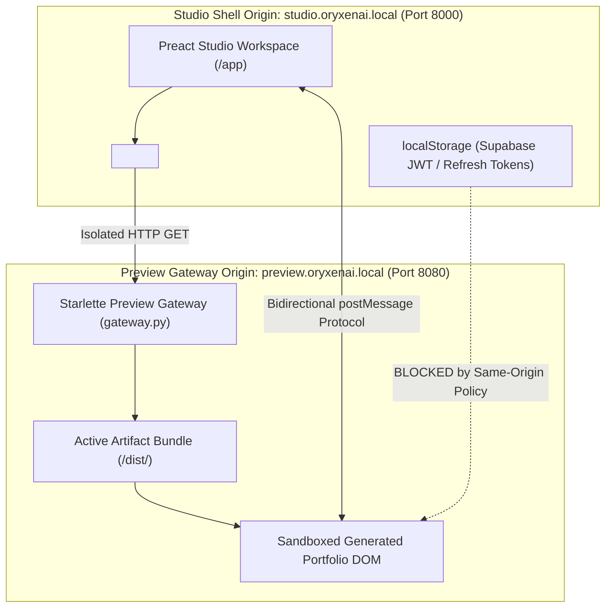
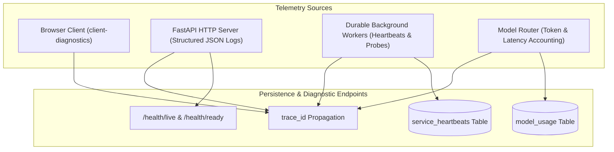
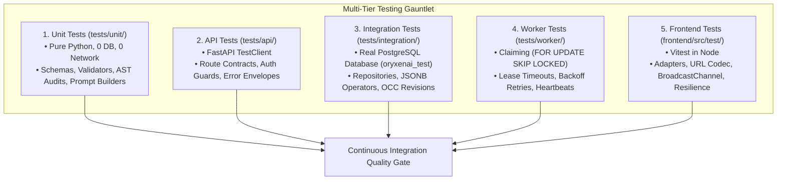

# OryxenAI Architecture Manual — Part 3: Preview System, API, Frontend SPA & Operations

> **Target Audience:** Frontend Engineers, Security Engineers, SREs, and Platform Integrators.
> **Scope:** Canonical architectural manual covering live preview sandboxes, REST API surface, Preact/TypeScript product studio, observability, telemetry, and continuous integration verification.

---

# Table of Contents
1. [Live Preview Sandbox & Gateway Architecture](#1-live-preview-sandbox--gateway-architecture)
2. [REST API Surface & Contract Specifications](#2-rest-api-surface--contract-specifications)
3. [Frontend Product Studio SPA & State Orchestration](#3-frontend-product-studio-spa--state-orchestration)
4. [Observability, Telemetry & Diagnostics](#4-observability-telemetry--diagnostics)
5. [Testing Strategy, CI & Verification](#5-testing-strategy-ci--verification)

---

## 1. Live Preview Sandbox & Gateway Architecture

The preview system serves user-generated React/Vite web applications within a live, interactive, but strictly quarantined environment.



### 1.1 Non-Negotiable Preview Security Invariants
1. **Origin Isolation:** The Preview Gateway runs on an isolated subdomain or port. Browser same-origin policies prevent generated code from accessing the studio's cookies, local storage, or API tokens.
2. **Atomic Promotion Mechanics (`promotion.py`):** Verified builds are promoted atomically via directory symlink swaps or atomic pointer updates (`/previews/{id}/active -> runs/{run_id}/`), eliminating partial builds or broken asset streams.
3. **CSP & Sandboxing:** Serves `Content-Security-Policy: frame-ancestors <studio_origin>`. The iframe enforces `sandbox="allow-scripts allow-same-origin allow-forms"`.
4. **No Direct DOM Access:** Communication between the studio shell and the preview iframe occurs **exclusively** through a versioned `postMessage` protocol.

### 1.2 Capability Routing (`gateway.py`)
- URL Format: `https://preview.oryxenai.local/p/{session_id}-{run_id}/{path}`
- Root requests serve `index.html`.
- Static assets (`.js`, `.css`, `.webp`, `.woff2`) are served with immutable cache headers.
- Unmapped routes fall back to `index.html` for client-side SPA routing.

### 1.3 Bidirectional `postMessage` Protocol (`preview-bridge-v1`)
```typescript
// 1. Studio sends handshake to preview iframe:
iframe.contentWindow.postMessage({
  type: "preview:init",
  version: "preview-bridge-v1",
  theme: { colorScheme: "light" }
}, previewOrigin);

// 2. Iframe announces ready status and active route to Studio:
window.parent.postMessage({
  type: "preview:ready",
  version: "preview-bridge-v1",
  route: window.location.pathname,
  title: document.title
}, studioOrigin);

// 3. Iframe notifies Studio on user navigation:
window.parent.postMessage({
  type: "preview:route-change",
  version: "preview-bridge-v1",
  route: newRoute
}, studioOrigin);

// 4. Studio commands iframe to switch routes from toolbar:
iframe.contentWindow.postMessage({
  type: "preview:navigate",
  version: "preview-bridge-v1",
  targetRoute: "/work"
}, previewOrigin);
```

#### Safe Cross-Origin Reload Recipe:
Calling `iframe.contentWindow.location.reload()` throws a cross-origin `SecurityError`. The studio reloads safely by setting `iframe.src`:
```typescript
function reloadPreview(iframe: HTMLIFrameElement) {
  const url = new URL(iframe.src);
  url.searchParams.set("_ts", Date.now().toString());
  iframe.src = url.toString();
}
```

---

## 2. REST API Surface & Contract Specifications

All product endpoints are exposed under `/api/v1/`.

### 2.1 Master Route Table

| Method | Route | Status | Description |
|---|---|---|---|
| `GET` | `/api/v1/me` | 200 | Authenticated user projection & entitlements |
| `POST` | `/api/v1/sessions` | 201 | Create a new portfolio session |
| `GET` | `/api/v1/sessions/{id}` | 200 | Get session summary & revision |
| `GET` | `/api/v1/sessions/{id}/discovery` | 200 | Get Discovery state |
| `POST` | `/api/v1/sessions/{id}/discovery/start` | 202 | Submit intake & enqueue question generation |
| `PUT` | `/api/v1/sessions/{id}/discovery/answers` | 200 | Save answers; triggers brief if complete |
| `POST` | `/api/v1/sessions/{id}/discovery/revise` | 202 | Natural-language brief revision |
| `POST` | `/api/v1/sessions/{id}/discovery/approve` | 200 | Lock brief with SHA-256 hash |
| `POST` | `/api/v1/sessions/{id}/discovery/stop` | 200 | Terminate in-flight job |
| `GET` | `/api/v1/sessions/{id}/content-architect` | 200 | Get Content Architect state |
| `POST` | `/api/v1/sessions/{id}/content-architect/start` | 202 | Enqueue content architecture build |
| `POST` | `/api/v1/sessions/{id}/content-architect/revise` | 202 | Natural-language content revision |
| `POST` | `/api/v1/sessions/{id}/content-architect/approve` | 200 | Lock content with SHA-256 hash |
| `POST` | `/api/v1/sessions/{id}/content-architect/stop` | 200 | Terminate in-flight job |
| `GET` | `/api/v1/sessions/{id}/visual-design-director` | 200 | Get Visual Design Director state |
| `POST` | `/api/v1/sessions/{id}/visual-design-director/start` | 202 | Enqueue visual design build |
| `POST` | `/api/v1/sessions/{id}/visual-design-director/revise` | 202 | Natural-language design revision |
| `POST` | `/api/v1/sessions/{id}/visual-design-director/approve` | 200 | Lock direction with SHA-256 hash |
| `POST` | `/api/v1/sessions/{id}/visual-design-director/stop` | 200 | Terminate in-flight job |
| `GET` | `/api/v1/sessions/{id}/build-preparation` | 200 | Get prepared briefs & compiler index |
| `POST` | `/api/v1/sessions/{id}/build-preparation/start` | 202 | Enqueue pre-code brief compilation |
| `POST` | `/api/v1/sessions/{id}/build-preparation/regenerate` | 202 | Re-compile briefs if upstream changed |
| `GET` | `/api/v1/sessions/{id}/build-preparation/download` | 200 | Download raw Markdown brief file |
| `GET` | `/api/v1/sessions/{id}/code-generator` | 200 | Get generation status & active preview |
| `POST` | `/api/v1/sessions/{id}/code-generator/start` | 202 | Start code generation & verification |
| `POST` | `/api/v1/sessions/{id}/code-generator/regenerate` | 202 | Start creative variant regeneration |
| `POST` | `/api/v1/sessions/{id}/code-generator/retry` | 202 | Resume an interrupted run |
| `GET` | `/api/v1/sessions/{id}/model-usage` | 200 | Get token consumption & cost ledger |
| `POST` | `/api/v1/client-diagnostics` | 200 | Submit client diagnostic logs |
| `GET` | `/health/live` | 200 | Process liveness probe |
| `GET` | `/health/ready` | 200 | Database & storage readiness probe |

### 2.2 Standardized Error Envelope (`oryxenai.api.errors`)
All error responses return a uniform envelope:
```json
{
  "error": {
    "code": "PORTFOLIO_READ_ONLY",
    "message": "This portfolio has completed generation and verified preview promotion. Editing is locked.",
    "status_code": 403,
    "details": {
      "portfolio_session_id": "7b8e1a2c-9d3f-4a1e-8e7c-5a6b7c8d9e0f",
      "read_only": true
    },
    "request_id": "req-9876543210"
  }
}
```

---

## 3. Frontend Product Studio SPA & State Orchestration

The OryxenAI product studio is an authenticated single-page application served at `/app`.

```
frontend/
├── package.json          # Preact 10.29.8, Vite 8.2.2, TypeScript 7.0.2
├── tsconfig.json          # Target ES2022, strict mode, jsxImportSource: preact
├── vite.config.ts         # Compiles bundle to ../src/oryxenai/web/static/product/
└── src/
    ├── main.tsx           # Entry module exporting { boot, stop, restart }
    ├── app/               # AppShell, store, url-state, custom hooks
    ├── components/        # Reusable presentation surfaces & panels
    ├── data/              # API client, adapters, polling, errors, storage
    ├── stages/            # 5 stage studio components
    └── styles/            # shell.css design tokens & rules
```

### 3.1 The Production Build & Dynamic Manifest Integration
1. `npm run build` runs `tsc --noEmit && vite build`.
2. Vite writes a manifest to `src/oryxenai/web/static/product/.vite/manifest.json`.
3. FastAPI dynamically inspects the manifest in `src/oryxenai/web/routes.py` and injects hashed script and stylesheet tags into `product_shell.html`.

### 3.2 Authenticated Boot Boundary (`app-auth-bootstrap.mjs`)
Zero-trust client boot:
1. Verifies PKCE tokens in `localStorage`. Redirects to `/sign-in` if absent.
2. Calls `GET /api/v1/me` with Bearer token.
3. If `onboarding_required: true`, redirects to `/onboarding`.
4. Reads `meta[name="oryxenai-product-entry"]`, dynamically imports the Vite module, and invokes `mod.boot(options)`.

### 3.3 URL State & Gating Navigation (`url-state.ts`)
Uses search parameters: `/app?stage={discover|content|design|prepare|generate}&view={work|artifact|progress}`.
- **Upstream Gating Fallback:** Attempting to navigate directly to a locked stage evaluates completion and replaces the URL via `replaceState` to the earliest incomplete stage.

### 3.4 Decomposed Hook Architecture
- **`useUrlNavigation`:** Manages URL query codec and listens to browser `popstate`.
- **`useSessionState`:** Manages session ID, revision, `me` projection, and parallel refetching.
- **`useStagePolling`:** Coordinates `PollCoordinator` (1,500ms active poll interval) with `document.visibilitychange` (pausing when hidden; immediate catch-up fetch when visible).
- **`useStageMutations`:** Wraps API mutations with automatic `Idempotency-Key` headers.
- **`BroadcastChannel` Invalidation:** Multi-tab synchronization via `new BroadcastChannel("oryxenai.state-invalidated")`. When Tab A mutates state, Tab B catches the event and invokes `refetchSession()`.

---

## 4. Observability, Telemetry & Diagnostics

OryxenAI establishes comprehensive telemetry across all execution layers:



### 4.1 Telemetry Components
- **`trace_id` Propagation:** Every user request, enqueued background job, LLM call, and client log carries an identical correlation `trace_id`.
- **Worker Heartbeats (`service_heartbeats`):** Workers update their heartbeat timestamp every 15 seconds. The diagnostic probe `system.worker_probe` allows testing the claim engine without model costs.
- **Model Usage Ledger (`model_usage`):** Captures session ID, run ID, model, input/output tokens, latency in ms, and estimated cost in USD.
- **Client Diagnostics (`/api/v1/client-diagnostics`):** Ingests client errors and iframe handshake timeouts.
- **Health Probes:** `/health/live` (process responsiveness) and `/health/ready` (PostgreSQL query and storage writability).

---

## 5. Testing Strategy, CI & Verification

OryxenAI enforces a deterministic, multi-tier testing taxonomy:



### 5.1 Non-Negotiable Testing Invariants
1. **Zero Live Model Calls by Default:** CI runs and developer test suites use checked-in fixtures and `MockModelClient`. Live LLM calls are strictly opt-in via `@pytest.mark.live_model`.
2. **Dedicated Test Database:** Relational tests run against `oryxenai_test` and never mutate the local development database `oryxenai`.
3. **Strict PostgreSQL Testing:** SQLite substitution is forbidden to ensure JSONB operators and row-locking behaviors are tested against production database semantics.

### 5.2 Canonical Verification Commands
```powershell
# Linting & Code Style
uv run ruff check .

# Format Verification
uv run ruff format --check .

# Static Type Analysis
uv run mypy src

# Automated Test Suite (Python)
uv run pytest

# Frontend Quality Gate (TypeScript & Vitest)
cd frontend
npm run typecheck
npm test
npm run build
```
