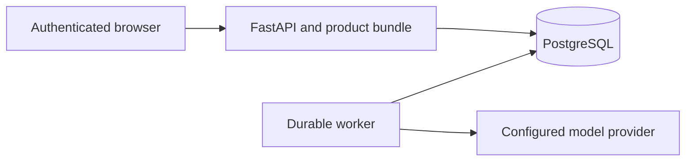

# OryxenAI Architecture Manual — API, Frontend & Operations

> Current API and product summary. This document describes the supported
> planning workflow; it does not define a generated-site serving surface.

## 1. Service topology

The browser uses the authenticated FastAPI application. FastAPI serves the
compiled Preact product and owner-scoped API. A separate worker executes
PostgreSQL-backed jobs. A one-shot migration process updates the database
before the app and worker start in Compose.

The app and worker use the same release but run as separate processes. The
worker does not listen on a public port. The API enqueues work transactionally
and serves safe state projections.

## 2. Active HTTP surface

The full OpenAPI schema is available from the development server. The active
stage routes are:

| Method | Route | Purpose |
|---|---|---|
| GET | /api/v1/sessions/{id}/discovery | Read Discovery state |
| POST | /api/v1/sessions/{id}/discovery/start | Store intake and enqueue questions |
| PUT | /api/v1/sessions/{id}/discovery/answers | Save answers |
| POST | /api/v1/sessions/{id}/discovery/revise | Revise the brief |
| POST | /api/v1/sessions/{id}/discovery/approve | Approve the brief |
| GET | /api/v1/sessions/{id}/content-architect | Read Content Architect state |
| POST | /api/v1/sessions/{id}/content-architect/start | Start from approved Discovery |
| POST | /api/v1/sessions/{id}/content-architect/revise | Revise the content plan |
| POST | /api/v1/sessions/{id}/content-architect/approve | Approve the plan |

Other active API groups cover authentication, identity, owner-scoped sessions
and runs, health, model-profile projection, usage diagnostics, and audited
administration. Use their route modules for authorization and response
contracts.

Errors use a safe envelope with a stable code, readable message, and request
ID. Internal stack traces and secrets are not returned to clients.

## 3. Product shell

The product shell restores the Supabase session, obtains one authorized
identity projection, then loads the authenticated workspace. The workspace
shows Discovery intake and brief review followed by Content Architect
planning and review. Approval is explicit; a successful approval does not
start work automatically.

The client polls stage state and durable-job transitions. It stores only
browser-local interaction needed to recover navigation and does not treat
client state as an authorization boundary. Server-side owner checks protect
all session reads and mutations.

## 4. Diagnostics and privacy

Model profiles exposed to the browser are safe labels and identifiers only.
Provider credentials, server endpoints, raw stack traces, and other account
data stay server-side. Session and run endpoints project data through the
active schemas. Historical output is retained for audit and authorized cleanup
but is not included in current product state.

## 5. Operations and verification

Canonical startup and troubleshooting instructions are in docs/run/run.md.
Migrations run explicitly in native mode and in a dedicated one-shot Compose
service. The API and worker are separate processes. Database-backed
integration checks use the dedicated test database.

Canonical local checks:

    uv run ruff check .
    uv run ruff format --check .
    uv run mypy src
    uv run pytest

A successful liveness response proves only that the API process is alive.
Readiness checks PostgreSQL connectivity. Neither proves that a live model
operation succeeded.
