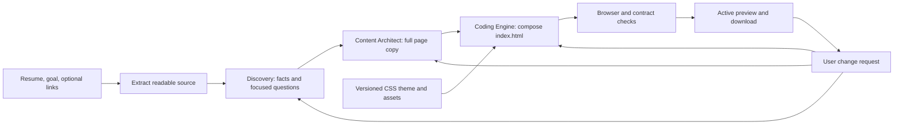
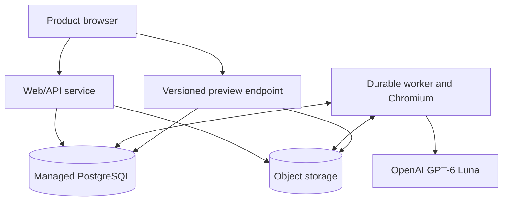

# Proposed resume-to-portfolio architecture: product and system

> **Status:** implementation proposal, 2026-09-27. This describes the target product, not the active repository or a deployed service. The current system is documented in `01-...` through `03-...` in this directory. No deployment or application change is implied by this document.
>
> **Start with:** [Architecture README](README.md). **Read next:** [Agent and artifact contracts](11-agent-and-artifact-contracts.md) and [Generation, preview, revisions, and operations](12-generation-preview-revisions-and-operations.md).

## 1. Decision in one paragraph

A user uploads or pastes a resume and states a goal. A non-agent intake service extracts text. Discovery builds a detailed, source-linked dossier and asks only questions that materially improve the portfolio. Content Architect selects a single-page story and writes all person-specific public copy into one structured content package. Coding Engine uses that package and a versioned component/theme catalogue to produce one `index.html`; `styles.css` and static assets come from a prebuilt theme. Browser checks gate a version before it becomes the active preview. User changes update the appropriate upstream artifact and produce a new immutable portfolio version. The requested model for every model-backed operation is OpenAI `gpt-6-luna`, selected through configuration, never a name embedded in agent business logic.

## 2. Scope and honest limits

| Now, in the target first release | Later, without replacing the content pipeline |
| --- | --- |
| One HTML page per portfolio, `index.html` | Multiple HTML pages if a new document contract is explicitly introduced |
| One selected, prebuilt `styles.css` per version; more themes may be added | User-directed stylesheet generation or editing as a separate visual operation |
| HTML and CSS only, with local fonts/images where needed | Optional JavaScript behavior under a versioned capability contract |
| Optional sections and layout variants supported by the theme | New components added to the shared theme library |
| User review happens on a generated preview; questions interrupt only when useful | More granular direct manipulation in the editor |
| User-supplied photo can be modeled as an optional asset; upload UI may follow | Crop controls, multiple photos, and other media |

The result can look excellent within a designed visual family. One or two fixed stylesheets cannot make every portfolio a bespoke visual identity. “No errors” means a version cannot be labelled **ready** while an observable required check fails; it cannot mean that a model or browser will never encounter a novel defect.

The old full Code Generator is a source of lessons and archived code, not a subsystem to revive. This proposal does not add Visual Design Director, Build Preparation, independent per-route source generation, package installation, or a React/Vite build to each user portfolio.

## 3. User journey

### Screen sequence

1. **Portfolio start page:** resume upload or paste; short goal prompt; optional links and theme choice. A user can start with only a readable resume. The page reports extraction progress and any document-read problem.
2. **Discovery conversation:** a small number of targeted questions appear in the left panel. The user may answer or skip. A clear “continue with what I gave you” action always exists. The agent never forces a generic questionnaire.
3. **Generation progress:** the UI presents understandable stages (“Understanding your work,” “Writing your portfolio,” “Building and checking your page”). Stage state comes from the server, survives refresh, and shows an actionable error when needed.
4. **Preview workspace:** the left side accepts change requests and shows a compact history; the right side displays the exact generated artifact at desktop/mobile widths. The current successful version remains visible while another is built.
5. **Delivery:** the active version can be downloaded as an HTML/CSS/assets bundle. Publishing to a public portfolio URL is a separate product decision; the preview itself must work without publication.

There are no mandatory intermediate approval screens. Saved dossier/content versions provide an audit and edit base; the user judges the generated portfolio in the preview. If a question is genuinely necessary to avoid a wrong central claim, the pipeline enters `waiting_for_answer` and resumes when answered or skipped.

The frontend must distinguish **no current page**, **last verified page with a new revision running**, and **new revision failed while the last verified page remains**. It shows a short progress or action message for each state. When the user skips all questions, the system proceeds with source-supported content; a sparse resume produces a smaller truthful page. A user can choose a theme at intake or later. In the first release the default is deterministic because only the completed theme may be available; theme selection is fixed before Content Architect sees the component vocabulary.

## 4. Stage ownership

| Owner | Receives | Produces | Decision boundary |
| --- | --- | --- | --- |
| Intake service | Upload/paste, goal, optional links | Extracted text with source spans and asset records | Parses documents; does not write biographical claims |
| Discovery | Extracted source, goal, answers, prior dossier on revision | `DiscoveryDossier/v1` | Facts, personal contribution, user intent, open points; no final public copy |
| Content Architect | Complete dossier, semantic component catalogue, current package on revision | `PortfolioContent/v1` | Positioning, section selection/order, complete person-specific publishable copy; no HTML/CSS |
| Coding Engine | Complete content package, theme manifest, asset manifest, previous version when revising | `RenderPlan/v1`, `index.html`, artifact manifest, checks | Composition inside supported patterns; no factual rewriting and no per-user CSS |
| Application orchestrator | Stage artifacts, jobs, edit requests | Version pointers, progress, preview admission | Runs handoffs, retries, supersession, and promotion; not an AI agent |

All model operations use the configured `gpt-6-luna` profile. Parsing, storage, render assembly, validation, and browser measurements are deterministic host work. OpenAI documents the model ID and image-input capability [here](https://developers.openai.com/api/docs/models/gpt-6-luna); supported output shape still does not prove factual or visual quality, as the [Structured Outputs guide](https://developers.openai.com/api/docs/guides/structured-outputs) makes clear.

## 5. Logical system and data movement

- **PostgreSQL** owns portfolio identity, current version pointer, revision requests, job state, structured dossiers/content packages, theme/version references, and the immutable run ledger. Each handoff is committed before the next job is enqueued in the same database transaction.
- **Object storage** owns original resumes, extracted-text snapshots when large, optional uploaded photos, generated HTML, theme CSS copies, fonts/images, screenshots, and downloadable bundles. Each object has an immutable versioned key and content hash; a database pointer chooses the active version.
- **The worker** claims durable jobs, makes model calls, renders/validates candidates, and writes artifacts. At-least-once delivery is expected; idempotency keys, leases, and compare-and-swap promotion prevent duplicate or stale results from replacing the current page.
- **The preview endpoint** serves a specific manifest version's exact bytes. The iframe and downloaded bundle refer to the same `index.html`, `styles.css`, and relative asset tree. A version pointer is changed only after readback and verification.
- **No vector database is needed for a single resume.** Source IDs, structured records, and selective context assembly are sufficient. If the user later supplies many external documents, retrieval can be added behind the same dossier boundary.

### Context loading

The full extracted resume is supplied to Discovery for its initial fact extraction when it fits the configured context allowance. A longer readable source is split by document sections into source-linked chunks and merged before the dossier is finalized; an unreadable source gets a visible correction path. Discovery follow-ups load the dossier plus only relevant source spans and prior answers. Content Architect loads the dossier, goal, explicit preferences, and component vocabulary. Coding Engine loads the content package, theme/component manifest, and assets; it does not need the full resume. Revisions load the selected old version and the requested change. Every model call records its input artifact IDs, schema version, prompt version, model profile, output ID, and result status. Conversation history is retained as events but is not replayed wholesale into every call.

### Minimum execution path and ownership

The happy path is intentionally short: extract → one Discovery understanding/question operation → one dossier finalization → one Content Architect write → one Coding Engine composition → deterministic render → browser check. If Discovery finds no material question, it can finalize from the first operation's structured result and avoid a second model call, provided the dossier passes the same validation. Rich content may need a bounded targeted continuation; this is an exception recorded with a reason, not a permanent extra stage. The application orchestrator decides when to enqueue each operation from persisted state. Agents do not call one another or own database transactions.

The most important handoff gate is `PortfolioContent/v1`: it must contain the **finished public page**, including the sections that will actually be rendered. A beautiful theme cannot recover missing project context or fabricated claims. The most important render gate is theme compatibility: a valid content package may still be unrenderable if the theme has no template for its chosen block or its text exceeds every supported layout. Such a mismatch is returned to the owning theme/content stage with a precise section and field, rather than retried as generic HTML generation.

## 6. Design system and the supplied stylesheet

The supplied stylesheet is the visual seed for theme `editorial-forest/v1` (working identifier). Source on this machine: `C:\Users\Yash Srivastava\Desktop\01_Projects\trash\test\NOT-TOUCH-AI\styles.css`; SHA-256 `3A643EEEE0D2A8254F811A44D98E241E8E82B521429E4B53B312C169584925CE`. The companion `index.html` shows the intended level of art direction. These source files were read only; they were not copied or modified by this proposal. At implementation, copy the reviewed CSS into a versioned theme package in this repository so the build is reproducible on another machine.

**What it already provides:** navigation, strong hero with visual, marquee, four-card pillars, collapsible capability groups, organization context, contact list, footer, motion, responsive breakpoints, and reduced-motion handling.

**What must be done once to make it reusable:**

1. Add designed `project_story`, `experience_timeline` or `experience_narrative`, `education_credentials`, and generic narrative/list components. The example currently lacks detailed case studies.
2. Make nav labels/section count, pillar count, skill count, and content lengths variable. The sample HTML assumes four nav links, four pillars, and a very large fixed skills inventory. Test long names, short labels, empty optional fields, and mobile widths.
3. Provide a first-party image-free hero variant and local visual fallback. The sample uses a remote Unsplash image; that must not be required for a complete page.
4. Bundle the font assets referenced by `@font-face` or remove those references and use intentional fallbacks. The two supplied files do not include the referenced font files.
5. Keep substantial project and experience copy visible in normal page flow. Reserve `
` for secondary inventories; the portfolio's main story must be visible without opening controls.
6. Define the theme's supported component IDs, HTML structure/class names, optional slots, variants, and responsive constraints in one versioned manifest. Build every theme against this same semantic vocabulary, or declare a compatibility matrix and select theme before Content Architect runs.

The example's decorative marquee repeats capability terms and the reading-progress bar uses CSS scroll-timeline support. Both are optional presentation pieces. They must be omitted or replaced when there is no suitable evidence or browser support; neither may carry essential resume content. The first release does not need page JavaScript for navigation, `
`, or the preview. The CSS has a `20rem` minimum body width, so the theme's responsive acceptance range begins at that supported width; narrower embedding containers must be handled by the product preview frame rather than by assuming the page can shrink indefinitely.

A portfolio version pins the CSS/theme hash and ships a copy of that CSS in its downloadable bundle. Reusing a stylesheet does not mean serving a mutable “latest.css” path to old versions.

## 7. Deployment boundary, deferred until the system works

The code requires a responsive web/API process, a continuously running durable worker with Chromium, PostgreSQL, and durable artifact storage shared by web and worker. The earlier recommendation of Render web/worker/PostgreSQL plus S3-compatible object storage remains a viable target, but it is **not** a prerequisite for developing the contracts, theme, renderer, edit loop, and browser checks locally. A Vercel frontend can later call the same API; short-lived request functions are not the proposed worker for multi-stage generation ([Render workers](https://render.com/docs/background-workers), [Vercel function limits](https://vercel.com/docs/functions/limitations)). Capacity is measured from actual queue, model, and browser behavior rather than fixed here. The current Azure deployment remains separate from this proposal.

## 8. Proposed transition from today's repository

| Existing area | Target change |
| --- | --- |
| `src/oryxenai/agents/discovery/` | Replace the 16-section Markdown-brief-as-primary handoff with a versioned, source-linked dossier and adaptive interview. A readable summary may be derived from it. |
| `src/oryxenai/agents/content_architect/` | Remove multi-route planning from the first release. Produce one complete single-page content package with typed component sections and finished copy. |
| `src/oryxenai/agents/shared/` and `config/models.toml` | Reuse the provider-neutral boundary; configure all model-backed operations to the requested target model and pin operation/prompt versions. Do not hardcode the model in agent code. |
| `src/oryxenai/jobs/`, `src/oryxenai/db/` | Reuse durable jobs, leases, and revision checks; add immutable dossier/content/site version records and transactional handoffs. |
| `src/oryxenai/storage/` | Move artifact sharing from VM-local assumptions to an object-store adapter. |
| `frontend/` and `src/oryxenai/api/routes/` | Replace stage-by-stage approval UI with intake, focused questions, progress, generated preview, version history, and a change composer. |
| Old downstream generator | Do not resurrect its React/source-repair/route-batch pipeline. Build a small theme-bound HTML composer and browser verifier. |
| Azure deployment files | Leave them as current/historical operational material until a separately authorized deployment migration. A new target deploy path is an implementation phase. |

The planned design conflicts with D-113's **currently implemented** endpoint boundary; D-113 remains the truth about the active application until the new API, worker, and UI are deployed together. Existing approved user records require a deliberate migration/read compatibility plan; the new product must not infer a new dossier from a lossy old summary without user review.

### Implementation order and gates

1. **Theme foundation:** import the supplied CSS; build the component manifest and missing project/experience components; capture visual reference screenshots and responsive acceptance cases.
2. **Contracts and persistence:** implement extractor, dossier/content/render schemas, immutable version references, and migration paths. Prove stale jobs cannot promote.
3. **Discovery and Content Architect:** replace prompts and outputs; exercise sparse, detailed, ambiguous, and career-switching resumes. A complete package must be renderable without biography writing by Coding Engine.
4. **Coding Engine and preview:** render from supported components, bundle theme assets, verify real browser output, and expose the exact bundle in the frontend.
5. **Revision loop:** factual, editorial, structural, and theme changes; last-good preview and undo/version history.
6. **Operational release:** run the same release on web and worker, object-store readback, Postgres migration/backups, production smoke generation, and measured capacity checks. Move deployment only in its own authorized release.
7. **Future capabilities:** optional photo upload, new theme versions, style editing, then JavaScript after a separately defined behavior contract.

See the next two documents for the exact artifacts, revision semantics, gates, and failure handling.
