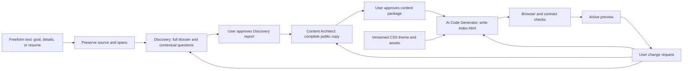
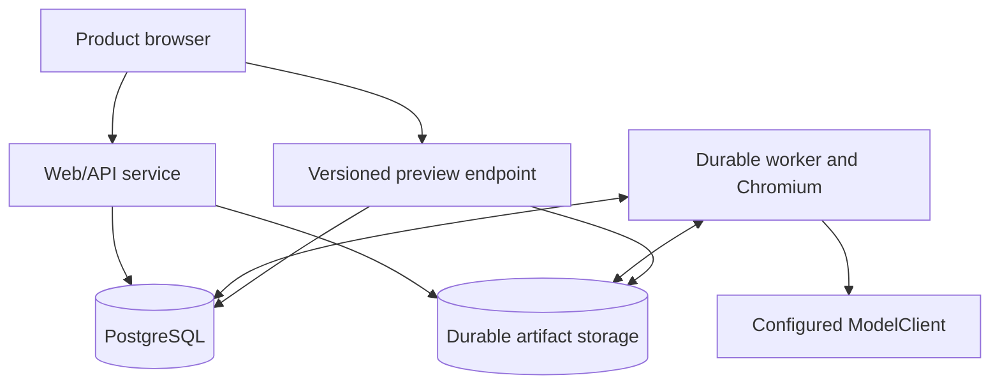

# Proposed resume-to-portfolio architecture: product and system

> **Status:** research proposal, revised 2026-09-29; awaiting user review before implementation. This describes the target product. The current system is documented in `01-...` through `03-...` in this directory. No deployment or application change is implied by this document.
>
> **Start with:** [Architecture README](README.md). **Read next:** [Agent and artifact contracts](11-agent-and-artifact-contracts.md) and [Generation, preview, revisions, and operations](12-generation-preview-revisions-and-operations.md).

## 1. Decision in one paragraph

A user writes a goal, notes, or a full resume into one freeform text box. Intake preserves the exact text. Discovery accounts for every supplied detail, asks one to three contextual questions together when useful, and produces a complete dossier and report for explicit approval. Content Architect consumes that approved dossier, plans a single-page story, and writes every personalized public field for a second explicit approval. The AI Code Generator then writes `index.html` from the approved content and a pinned theme contract. The coordinator attaches unchanged prebuilt `styles.css` and assets, verifies the exact bundle, and serves its preview. PDF and DOCX attachment adapters are later work. Every model call uses `ModelClient` and `config/models.toml`; provider selection is independent of these responsibilities. The [agent operating specification](14-discovery-and-content-authoring-spec.md) defines the complete two-agent handoff.

## 2. Scope and honest limits

| Now, in the target first release | Later, without replacing the content pipeline |
| --- | --- |
| One HTML page per portfolio, `index.html` | Multiple HTML pages if a new document contract is explicitly introduced |
| One shared, prebuilt `styles.css`, pinned per version | Additional themes and per-portfolio style artifacts; never overwrite global CSS |
| HTML and CSS only, with local fonts/images where needed | Optional JavaScript behavior under a versioned capability contract |
| Optional sections and layout variants supported by the theme | New components added to the shared theme library |
| Explicit Discovery and Content Architect approvals, then generated preview review | More granular direct manipulation in the editor |
| Freeform typed or pasted text in one input box | PDF/DOCX attachment and extraction, OCR, photo upload/cropping, other media, export, and public publishing |

The result can look excellent within a designed visual family. A fixed stylesheet cannot provide unlimited bespoke designs. “No errors” means a version cannot be labelled **ready** while a required check fails. Source references cannot prove that every statement was interpreted correctly; layout checks cannot prove beauty. Preserve originals, make omissions explicit, calibrate checks against representative examples, and let the user correct the finished portfolio.

The old full Code Generator is a source of lessons and archived code, not a subsystem to revive. This proposal does not add Visual Design Director, Build Preparation, independent per-route source generation, package installation, or a React/Vite build to each user portfolio.

## 3. User journey

### Screen sequence

1. **Portfolio start page:** one text box accepts any ordering of goal, work details, notes, and pasted resume text. The first slice has no attachment control; PDF and DOCX are later source adapters.
2. **Discovery conversation and review:** when a material gap exists, show one to three tailored questions together, with free text, Skip, and “continue with what I gave you.” When context is sufficient, acknowledge it and show the complete dossier report without questions. The user reviews or revises it, then explicitly approves its exact version.
3. **Content Architect review:** show the complete section order and finished public copy, plus inspectable coverage and open items. The user revises or edits, then explicitly approves the content package.
4. **Generation progress:** after both approvals, the UI shows HTML generation and verification progress from persisted server state. A failed run gives a stage-specific action without pretending a preview is ready.
5. **Preview workspace:** the left side accepts change requests and shows a compact history; the right side displays the exact generated artifact at desktop/mobile widths. The current successful version remains visible while another is built.
6. **Preview review:** the user opens that same version standalone, interacts with native links/disclosures, and requests changes. Public publishing and downloadable export are separate future capabilities.

The pipeline waits at both approval gates. Questions pause Discovery only when they are useful; a skip remains recorded and never becomes an invented fact. Preview revisions return to the earliest stage that owns the requested change, and a changed upstream artifact requires renewed downstream approval.

The frontend distinguishes **no current page**, **last verified page with a new revision running**, and **new revision failed while the last verified page remains**. After a skip, proceed with available evidence. If that cannot support a meaningful page, return `needs_input` with one concrete request. Pin the shared theme before Content Architect receives its semantic capabilities. New themes and arbitrary styling are future capabilities.

Stage summaries are small projections of validated artifacts: received sources, understood direction, planned sections, and build/check status. Expandable details expose the full dossier/content package to the owner without inserting internal notes into the public page. Desktop preview uses an actual 1280 CSS-pixel frame scaled to fit the pane; mobile mode changes the frame viewport, not the generated files.

## 4. Stage ownership

| Owner | Receives | Produces | Decision boundary |
| --- | --- | --- | --- |
| Intake service | Freeform text; future file adapters | Exact source text and stable spans | Records input without writing biographical claims |
| Discovery | Complete source, goal, answers, prior dossier on revision | `DiscoveryDossier/v1` and readable report | Preserves every detail, contribution, intent, conflict, skip, and gap; user approves |
| Content Architect | Exact approved dossier and semantic theme capabilities | `PortfolioContent/v1` | Selects and writes complete public copy with a disposition for every dossier item; user approves |
| AI Code Generator | Exact approved content, theme markup/class contract, available assets | `GeneratedHtml/v1` containing `index.html` and a private field map | Writes HTML without new facts or copy changes; never edits shared CSS |
| Coordinator and verifier | Approved artifacts, generated HTML, pinned CSS/assets | Sealed bundle, verification receipt, preview pointer | Runs handoffs, checks copy/theme/browser behavior, and promotes only passing bytes |

Storage, approval and revision checks, structural validation, and browser measurements are host work. Semantic audits belong to the agent that owns the artifact and may use a configured model. A valid schema alone does not establish factual support or visual quality. See the [agent operation playbook](13-agent-operation-playbook.md) for detailed responsibilities and acceptance criteria.

## 5. Logical system and data movement

- **PostgreSQL** owns portfolio identity, current version pointer, revision requests, job state, structured dossiers/content packages, approvals, theme/version references, and the immutable run ledger. At each review gate the artifact is saved and the pipeline waits; an exact-hash approval and next-job enqueue occur in one transaction. Other automatic handoffs commit artifact and next job together.
- **The storage abstraction** owns original text, future uploaded sources/extracted text, generated HTML, theme CSS, fonts/images, and diagnostic screenshots. Durable shared files or object storage may implement it; ephemeral worker files cannot be the only copy. Each artifact has an immutable key/hash. Source material remains outside the public bundle.
- **The worker** claims durable jobs, makes model calls, stores generated HTML, validates candidates, and writes artifacts. At-least-once delivery is expected; idempotency keys, leases, and compare-and-swap promotion prevent duplicate or stale results from replacing the current page.
- **The preview endpoint** serves a specific manifest version's exact bytes on an isolated origin. Owner-issued, expiring access covers HTML and relative assets. The iframe and standalone page load the same bundle. A version pointer changes only after readback, verification, and revision/worker fencing.
- **No vector database is needed for a single resume.** Source IDs, structured records, and selective context assembly are sufficient. If the user later supplies many external documents, retrieval can be added behind the same dossier boundary.

### Context loading

The full pasted text is supplied to Discovery when it fits the configured context allowance. A longer source is split by its headings/paragraphs into source-linked chunks and merged before the dossier is finalized; future PDF/DOCX adapters must produce the same contract. Discovery follow-ups load the dossier plus relevant spans and prior answers. Content Architect loads the **approved complete** dossier, explicit preferences, and component vocabulary. Code Generator loads the **approved complete** content package, theme markup/class contract, and assets; it does not need the original text or Discovery dossier. Revisions load the selected old version and requested change. Every model call records its input artifact IDs, schema version, prompt version, model profile, output ID, and result status. Conversation history is retained as events but is not replayed wholesale into every call.

### Minimum execution path and ownership

The logical path is intake → Discovery understanding/clarification → dossier validation and user approval → content planning/writing/audit and user approval → AI HTML generation → verification. Small inputs may combine planning and writing. Large dossiers use bounded named-section batches, each with its own facts. No call-count optimization may truncate the factual inventory or final package. The application controls handoffs from persisted state; agents do not call each other or own database transactions. Persist an approved completed artifact and enqueue the next job in one transaction.

The most important handoff gate is the **approved** `PortfolioContent/v1`: it contains the finished public page, including every word and section to render. A beautiful theme cannot recover missing project context or fabricated claims. The HTML gate checks theme compatibility and that generated markup preserves the approved copy. A mismatch returns to the owning content, Code Generator, or theme stage with a precise section and field; it is never fixed by silently dropping copy.

## 6. Design system and the supplied stylesheet

The supplied stylesheet is the visual seed for theme `editorial-forest/v1` (working identifier). Source on this machine: `C:\Users\Yash Srivastava\Desktop\01_Projects\trash\test\NOT-TOUCH-AI\styles.css`; SHA-256 `3A643EEEE0D2A8254F811A44D98E241E8E82B521429E4B53B312C169584925CE`. The companion `index.html` shows the intended level of art direction. These source files were read only; they were not copied or modified by this proposal. At implementation, copy the reviewed CSS into a versioned theme package in this repository so the build is reproducible on another machine.

**What it already provides:** navigation, strong hero with visual, marquee, four-card pillars, collapsible capability groups, organization context, contact list, footer, motion, responsive breakpoints, and reduced-motion handling.

**What must be done once to make it reusable:**

1. Add designed `project_story`, `experience_timeline` or `experience_narrative`, `education_credentials`, and generic narrative/list components. The example currently lacks detailed case studies.
2. Make nav labels/section count, pillar count, skill count, and content lengths variable. The sample HTML assumes four nav links, four pillars, and a very large fixed skills inventory. Test long names, short labels, empty optional fields, and mobile widths.
3. Provide a first-party image-free hero variant and local visual fallback. The sample uses a remote Unsplash image; that must not be required for a complete page.
4. Bundle the font assets referenced by `@font-face` or remove those references and use intentional fallbacks. The two supplied files do not include the referenced font files.
5. Keep substantial project and experience copy visible in normal page flow. Reserve `
` for secondary inventories; the portfolio's main story must be visible without opening controls.
6. Define the theme's supported component IDs, HTML structure/class names, optional slots, variants, and responsive constraints in one versioned manifest. Build every theme against this same semantic vocabulary, or declare a compatibility matrix and select theme before Content Architect runs.

The example's decorative marquee repeats capability terms and the reading-progress bar uses CSS scroll-timeline support. Both are optional presentation pieces. They must be omitted or replaced when there is no suitable evidence or browser support; neither may carry essential resume content. The first release does not need page JavaScript for navigation, `
`, or the preview. The CSS has a `20rem` minimum body width, so the theme's responsive acceptance range begins at that supported width; narrower embedding containers must be handled by the product preview frame rather than by assuming the page can shrink indefinitely.

A portfolio version pins the CSS/theme hash and resolves the exact CSS through its bundle manifest. Reusing a stylesheet does not mean serving a mutable “latest.css” path to old versions.

## 7. Deployment boundary, deferred until the system works

The target requires a responsive API, a durable worker with a pinned browser environment, PostgreSQL, and durable artifact storage available to the serving and worker processes. Reuse the repository's existing boundaries. This research selects no hosting migration. Capacity and concurrency limits should be measured during future implementation; deployment changes require their own authorized task and operational review.

## 8. Proposed transition from today's repository

| Existing area | Target change |
| --- | --- |
| `src/oryxenai/agents/discovery/` | Replace the 16-section Markdown-brief-as-primary handoff with a versioned, source-linked dossier and adaptive interview. A readable summary may be derived from it. |
| `src/oryxenai/agents/content_architect/` | Remove multi-route planning from the first release. Produce one complete single-page content package with typed component sections and finished copy. |
| `src/oryxenai/agents/shared/` and `config/models.toml` | Reuse the provider-neutral boundary and configured profiles; pin operation/prompt/schema versions. Check required transport capabilities without assuming a provider migration. |
| `src/oryxenai/jobs/`, `src/oryxenai/db/` | Reuse durable jobs, leases, and revision checks; add immutable dossier/content/site version records and transactional handoffs. |
| `src/oryxenai/storage/` | Extend the storage abstraction for immutable sources, bundles, manifests, and readback; retain compatible configured backends. |
| `frontend/` and `src/oryxenai/api/routes/` | Evolve the stage approval UI into freeform intake, adaptive questions, complete report/copy review, generated preview, version history, and a change composer. |
| Old downstream generator | Do not resurrect its React/source-repair/route-batch pipeline. Build a theme-bound AI HTML writer with exact-content and browser verification. |
| Deployment files | Keep operational work separate; the target architecture does not depend on moving providers. |

The planned design conflicts with D-113's **currently implemented** endpoint boundary; D-113 remains the truth about the active application until the new API, worker, and UI are deployed together. Existing approved user records require a deliberate migration/read compatibility plan; the new product must not infer a new dossier from a lossy old summary without user review.

### Implementation order and gates

1. **Theme foundation:** import the supplied CSS; build the component manifest and missing project/experience components; capture visual reference screenshots and responsive acceptance cases.
2. **Contracts and persistence:** implement text source, dossier/content/generated-HTML schemas, approvals, immutable version references, and migration paths. Prove stale jobs cannot promote.
3. **Discovery and Content Architect:** replace prompts and outputs; exercise sparse, detailed, ambiguous, and career-switching resumes. A complete package must be renderable without biography writing by Coding Engine.
4. **Code Generator and preview:** write `index.html` from approved content and supported theme components, bundle unchanged CSS/assets, verify real browser output and copy coverage, and expose the exact bundle in the frontend.
5. **Revision and repair loop:** factual, editorial, structural, and supported variant changes; ordered intent, bounded retries, cancellation, restore, and last-working-version behavior.
6. **Operational release:** compatible API/worker versions, storage readback, database migrations/backups, and measured capacity checks. Release only in a separately authorized task.
7. **Future capabilities:** PDF/DOCX attachment adapters, optional photo upload, new theme versions, style editing, then JavaScript after a separately defined behavior contract.

See the next two documents for the exact artifacts, revision semantics, gates, and failure handling.
