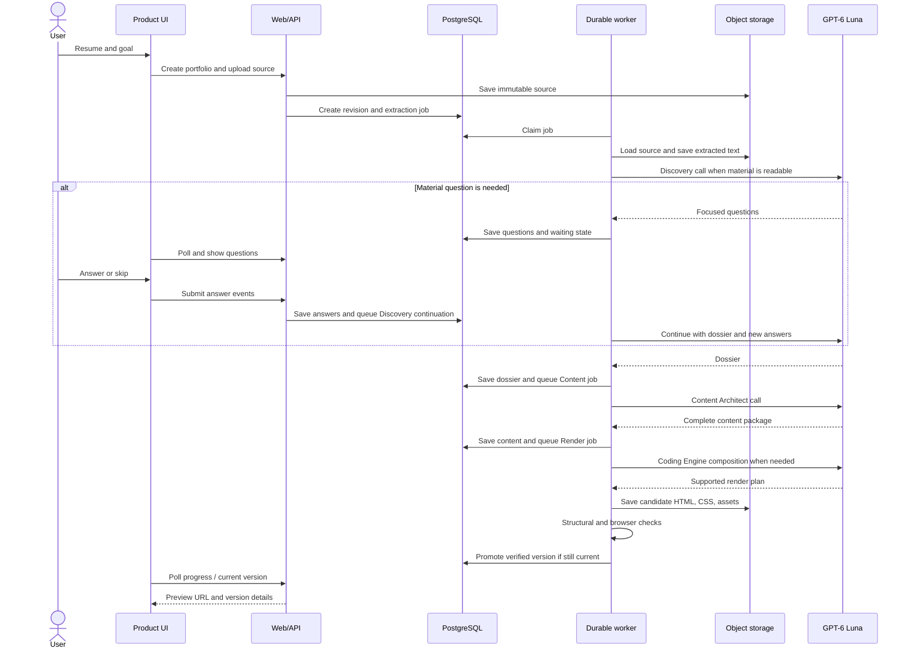

# Proposed generation, preview, revision, and operations design

> **Status:** target behavior for implementation. [Start here](README.md) · [System overview](10-proposed-resume-portfolio-system.md) · [Agent contracts](11-agent-and-artifact-contracts.md). The active repository still ends at Content Architect approval.

## 1. One complete generation run



The initial request returns quickly with a portfolio/revision ID. Model calls and Chromium checks never run inside the user's upload HTTP request. The browser polls server state or uses a progress stream backed by that same persisted state; a reconnect does not restart generation.

### Stage transitions

`intake_received -> extracting -> discovery_running -> waiting_for_answer (optional) -> dossier_ready -> content_running -> content_ready -> composing -> verifying -> ready`.

Any working state can enter `needs_attention` with a stage-specific, actionable error. `ready` refers to the currently promoted version, not the status of every attempted candidate. A failed regeneration preserves the last ready version and shows the failure beside it. `superseded` records a job whose inputs became stale. The user may retry only the failed stage when its upstream inputs still match.

### Handoff and idempotency

The orchestrator commits a completed artifact and the next `background_jobs` row in one database transaction. The payload contains only artifact IDs, hashes, revision number, and operation ID, not a large resume or HTML body. A worker claim has a lease/heartbeat. All writes use an idempotency key derived from `(portfolio ID, revision ID, operation, input hashes, schema/prompt/theme versions)`. A redelivered job may reuse an already validated result but cannot double-promote or append the same revision twice. Before promotion, compare the candidate's requested revision with the portfolio's current desired revision. Superseded work remains diagnostic history; it cannot become the active preview. Store an operation's terminal artifact ID before acknowledging the job; a retry first looks up that operation ID and checks its hash rather than calling the model again. If a provider call completed but its result was never persisted, retrying may cost another call, but it still cannot create a second active version.

## 2. Persistence and object layout

### PostgreSQL records

| Record | Main fields and invariant |
| --- | --- |
| `portfolios` | Owner, title, `desired_revision_id`, `active_site_version_id`, chosen theme ID, created/updated times |
| `portfolio_revisions` | Base revision, user request event, requested change type, status, current stage, input hashes, supersession pointer |
| `edit_events` | Ordered accepted user instructions, selected structured target if any, visible base version, base desired revision, route and application status; replay is the authority for concurrent edits |
| `source_documents` | Upload metadata, object key/hash, extraction status, extracted text key/hash, source spans/index |
| `question_events` and `answer_events` | Question/answer IDs, linked gap, answer/skip, revision and order; append oriented |
| `discovery_dossiers` | Immutable typed JSONB, hash, source IDs, contract version |
| `content_packages` | Immutable typed JSONB, hash, dossier ID, contract version |
| `render_plans` | Immutable typed JSONB, hash, content ID and theme manifest ID |
| `site_versions` | Immutable manifest key/hash, content/theme/asset IDs, verification receipt, status (`candidate`, `verified`, `failed`, `superseded`) |
| `background_jobs` / `agent_runs` | Durable queue, attempts, operation/version metadata and diagnostics; reuse current primitives where suitable |
| `theme_versions` | Component contract ID, stylesheet and asset hashes, supported block variants, status |
| `media_assets` | Optional photo or uploaded media ID, original and derivative object keys/hashes, dimensions, crop preference |

A simple first implementation can keep dossier/content bodies in JSONB and normalize only the frequently joined identifiers. The resume binary, HTML, CSS, screenshots, and images belong in object storage, not large database rows. Existing `portfolio_sessions.current_state` may remain as a compatibility projection, but immutable artifact records and explicit foreign keys must own the new chain. All writes are migrations; do not re-label old content as a new dossier without actual provenance.

### Object storage bundle

Each candidate lives under an immutable version prefix such as `portfolios/<portfolio-id>/versions/<version-id>/`. Its manifest names `index.html`, `styles.css`, `assets/...`, the source theme hash, and the verification receipt. The current profile photo, when supplied, is a versioned local asset in that bundle or a content-addressed immutable asset URL. The HTML uses relative paths so the same bundle works in the preview and a downloaded ZIP. It cannot reference a mutable latest theme or a worker-local file. The manifest is written **last**, after every listed file has been stored and read back; a manifest is never a promise that unfinished files will appear later.

Write candidate objects first, read them back, verify hashes and MIME types, run browser checks against the assembled candidate, then atomically update the database active pointer. The candidate is addressable by exact version ID for the worker's browser check before it is offered as a ready preview. A failed DB promotion leaves harmless orphan candidate objects for later cleanup; it never changes the previous active version. Cloudflare notes that cache can continue serving overwritten objects, so immutable versioned keys are preferred over overwriting a path ([R2 consistency](https://developers.cloudflare.com/r2/reference/consistency/)).

### Fetching rules

The core pipeline loads only user-provided sources and versioned theme/assets from storage. It does not require open-web search for biography. Supplied GitHub/LinkedIn/project URLs are kept as links and checked for syntactic validity; a live third-party response is not treated as proof that a claim is true. If a later feature imports content from a supplied URL, it creates a separate `SourceDocument` with extraction/source spans and reruns Discovery. No agent quietly reads arbitrary links during rendering. Curated theme art is versioned locally; a transient stock-image URL is not a required runtime dependency.

## 3. Controlled HTML composition

The Coding Engine's model output is `RenderPlan/v1`, a mapping from approved section IDs to allowed component variants. The renderer is a trusted HTML serializer that creates the head, metadata, semantic landmarks, navigation, anchors, sections, footer, stylesheet path, and asset URLs. It escapes all content fields and generates IDs from stable section IDs. Content Architect's package owns visible words; the host owns HTML syntax. This removes duplicate navigation generation and raw multi-file repair as ordinary work.

### Exact build recipe: how fixed CSS and changing HTML meet

1. **Freeze inputs.** Select a `PortfolioContent` hash, `RenderPlan` hash, theme manifest ID/hash, renderer/template version, and asset manifest. A worker never reads a mutable “current content” value halfway through rendering.
2. **Check compatibility before serialization.** Match each content section's `block_type` and present fields to the selected theme variant. A section with no compatible variant fails with its section ID. A new portfolio requires a validated composition plan; a simple later edit can reuse the previous plan. The theme's declared fallback variant may normalize a rejected variant choice only when it preserves all fields. Do not improvise markup or silently drop content.
3. **Render the complete document from typed fields.** The host selects a theme template per section, fills text/attributes with context-appropriate HTML escaping, builds the nav from the actual ordered sections, generates stable unique DOM IDs from section IDs, and emits `lang`, title, description, viewport, one `<main>`, accessible headings, and a stylesheet link. It adds no free-form model HTML. An internal render map records `section_id + field_path -> expected DOM target(s)` for later binding checks.
4. **Copy the theme bytes.** Put the exact pinned CSS bytes at `styles.css` in the new version directory. Copy every referenced local font, image, icon, and any selected user media under `assets/` with the paths expected by the CSS and HTML. HTML uses `./styles.css` and `./assets/...`; CSS `url("./assets/...")` resolves relative to the CSS file in that same root. Emit a preload only when the corresponding file exists. External contact links may remain external; a required image/font may not depend on a third-party URL.
5. **Read back and seal.** Read every written object, verify hash/MIME/size, write the manifest last, and serve the candidate through its version-specific preview URL. Run structural and browser checks against that URL. Only then may a transaction promote the version pointer. Construct a ZIP from the sealed manifest's same bytes and relative tree, not a second regeneration.

The supplied `index.html` is a **fixture**, not a template to search-and-replace. Its four nav links, four pillars, large skills inventory, remote hero image, and hard-coded identity cannot simply be retained for another resume. The theme may keep its visual classes, but the component templates must support 0/1/many eligible sections and an image-free hero. Decorative marquee items must be derived from evidenced capabilities or omitted; essential project content remains in visible page flow. The reference's font URLs must be backed by packaged files. Its CSS-only scroll progress can be optional because browser support varies.

**When files change:** each accepted content, composition, theme, or asset revision re-renders the entire `index.html` into a **new** version; it does not overwrite the old file. A content-only revision may reuse the same render plan and copies byte-identical CSS. A theme switch copies a different pinned CSS/template/asset set and creates a new HTML version. A photo swap changes the asset binding and HTML path; CSS remains byte-identical when the theme is unchanged. First-release user requests never mutate the shared CSS. Old versions keep their original CSS bytes.

**Allowed output now:** `index.html`, selected prebuilt `styles.css`, and assets. The release contract explicitly excludes model-authored CSS/JS, npm installs, network dependency resolution, and additional HTML routes. A theme revision can add more variants without changing the content schema. A future `site-capabilities/v2` may authorize generated CSS and JavaScript as separate owned artifacts with independent validation and browser behavior checks; Discovery and Content Architect continue to produce semantic content.

### Component fallback

If a requested block lacks a themed component, the renderer tries one declared generic narrative/list variant that preserves all public copy. If no compatible variant exists, the candidate fails `THEME_COMPONENT_UNSUPPORTED` with the section ID and theme ID. It does not silently omit the section, make up a class name, or ask the model to improvise CSS. Theme switching is allowed only when the target theme supports every required block or an explicit rewrite is accepted.

## 4. Verification and promotion

### Required deterministic gates

1. **Artifact identity:** content package, render plan, theme, CSS, and asset hashes match the run; every required object exists and reads back.
2. **Content binding:** the renderer's field-to-DOM map matches expected placement counts. A fact-bearing body field appears in its intended component; deliberate repetition such as a name in both hero and wordmark, a section title in nav and heading, or duplicated decorative marquee terms is declared in the template contract. No review notes, placeholders, or stale previous-version identity appear. Comparing raw substring counts in HTML is insufficient because escaping and intentional repetition change those counts.
3. **HTML structure:** a document-conformance check and DOM invariant check pass; one main landmark; logical heading order; unique IDs; internal links resolve; generated navigation matches present sections; external links use valid supported schemes; no `<script>` in the current output contract. Browsers repair malformed HTML, so “the parser opened it” alone is not a sufficient gate. Unique IDs are required by the [HTML Standard](https://html.spec.whatwg.org/dev/dom.html).
4. **Theme contract:** all component IDs/variants/classes and expected child structures are supported by the pinned manifest. No user-specific stylesheet or unknown asset path is present.
5. **Assets:** stylesheet and fonts load, images decode, image dimensions are plausible, fallback hero works without a photo, and any required displayed media actually appears in the rendered DOM.
6. **Browser runtime:** render the exact candidate preview URL in pinned Chromium at representative narrow, medium, and desktop widths; assert response success and expected content type; record failed CSS/font/image requests, `document.fonts.ready`, image decode state, and page errors; check no horizontal page overflow, no text clipping in major blocks, visible primary CTA, and working navigation. Exercise any native `<details>` disclosure that remains. Use bounded waits for fonts/images and auto-retrying browser assertions rather than treating the iframe `load` event as proof ([Playwright assertions](https://playwright.dev/docs/test-assertions)).
7. **Accessibility as functional quality:** keyboard reaches links/controls, focus is visible, image text alternatives fit their role, and reduced-motion mode leaves the page usable.

Browser screenshots are stored as evidence. A Luna screenshot review can identify aesthetic concerns such as awkward balance or inconsistent hierarchy; its subjective report is advisory until a repeatable rule or human-reviewed design regression makes it a reliable blocker. Pixel-exact screenshot comparison across changing resumes would reject legitimate variation; use theme fixture baselines for component regressions and functional measurements for generated pages. Playwright supports screenshots and browser assertions, while warning that visual snapshots depend on a consistent environment ([screenshots](https://playwright.dev/docs/screenshots), [visual comparisons](https://playwright.dev/docs/test-snapshots), [assertions](https://playwright.dev/docs/test-assertions)).

The verifier stores a typed receipt with each gate's result, affected section/asset IDs, browser version, viewport widths, screenshot hashes/keys, and sealed bundle hash. A failure code identifies the owner (`EXTRACTION`, `DISCOVERY_FACT`, `CONTENT`, `THEME`, `RENDER`, `ASSET`, `PREVIEW_DELIVERY`, or `BROWSER`). The user sees a short actionable message; a developer can open the receipt and exact candidate. A stylesheet defect is fixed once in the theme and rerendered, not “repaired” by making the Coding Engine write arbitrary CSS for one user.

**Illustrative verification receipt excerpt:**

```json
{
  "contract_version": "VerificationReceipt/v1",
  "site_version_id": "site-7",
  "bundle_sha256": "<computed-manifest-hash>",
  "candidate_url": "/p/portfolio-1/site-7/index.html",
  "status": "passed",
  "gates": [
    {"name": "content_binding", "status": "passed", "affected_ids": []},
    {"name": "asset_readback", "status": "passed", "affected_ids": []},
    {"name": "browser_runtime", "status": "passed", "affected_ids": []}
  ],
  "browser": {"engine": "chromium", "version": "<pinned-build-version>"},
  "viewports_checked": ["narrow", "medium", "desktop"],
  "screenshots": ["<versioned-screenshot-key>"],
  "failure_code": null
}
```

The host fills hashes, browser version, and evidence keys; the model does not author or approve a verification receipt. A failed receipt retains the actual failed gate and affected IDs and cannot be changed to `passed` without rerunning that gate against the same sealed candidate bytes.

### Repair policy

- Correct mechanical mistakes in the host without another model call: duplicate slug suffix, missing optional image fallback, relative-path normalization, a declared fallback variant that preserves all content fields, and generated nav from the actual section array. Never change factual copy in a mechanical repair.
- If a supported composition is poor or a component choice is incompatible, make one targeted Luna composition repair from specific diagnostics and the same immutable content package. Re-render and recheck. A different component/theme defect is returned to theme development, not repeated in a model loop.
- If content is missing or unsupported, return to Content Architect with the exact section/content ID. If the underlying fact is uncertain, return to Discovery with the exact gap.
- Stop after a configured finite attempt budget. Save the failing candidate and receipt for diagnosis. The last verified version stays active. Do not mark an unverified candidate `ready` because its HTML file happens to exist.

### Preview delivery

Serve `/p/<portfolio-id>/<version-id>/index.html` and its relative assets from one version manifest on a dedicated preview hostname or equivalent isolated origin. The verifier opens this exact candidate URL while the version is still unpromoted, so asset routing, headers, and relative paths are tested through the same delivery path the user will see. The product embeds the URL only after verification and provides “open preview” and downloadable ZIP actions. The browser UI never reconstructs HTML from a JSON package. The preview URL is version-specific; a refresh of an old version shows that old version. The active pointer selects the default version but does not rewrite version URLs. Future JavaScript is admitted only after the preview capability contract and browser tests support it.

If the preview origin requires access credentials, both the verifier and owner browser must receive a version-scoped preview session that covers **the HTML and every relative CSS/font/image request**. Use the same file-serving handler and path for both; the verifier should not bypass the delivery route with a worker-local `file://` page. The product can establish the owner preview session before loading the iframe or opening a standalone tab. Configure the preview response's frame policy to permit embedding by the product origin, and verify that the iframe, its stylesheet, and its assets load after a fresh sign-in and after refresh. A 200 response for `index.html` with denied CSS or blocked framing is a preview failure, not a ready page.

The preview frame can resize its **container** for desktop/mobile modes without modifying the generated site. An isolated frame does not give the product access to its DOM for “click this paragraph to edit” in the first HTML/CSS-only release. The left-side editor instead offers a section list derived from `PortfolioContent` and accepts a free-text instruction; it sends a selected section/field ID when the user chooses one. Exact visual click targeting would require a separately designed bridge or mapping capability later. Native anchor navigation remains inside the preview document, and the standalone preview link shows the same site without the product frame. Configure iframe sandbox and link-opening behavior deliberately, then check both embedded and standalone views; [MDN documents iframe sandbox behavior](https://developer.mozilla.org/en-US/docs/Web/HTML/Reference/Elements/iframe).

The iframe's `load` event alone does not prove the site loaded successfully; browser checks and the server-side verification receipt are authoritative. MDN documents that iframe load can fire even on a failed resource, and explains sandbox behavior ([MDN iframe reference](https://developer.mozilla.org/en-US/docs/Web/HTML/Reference/Elements/iframe)).

### Product API surface (conceptual, not frozen route names)

| Operation | Input and response contract |
| --- | --- |
| Create intake | Resume upload or pasted text, goal, optional links/theme and an idempotency key; return portfolio ID, revision ID, extraction state, and progress URL immediately |
| Read progress | Portfolio/revision ID; return current stage, pending question IDs, classified error when present, and last ready version ID |
| Submit answers | Question IDs with answer or skip, exact base revision, and idempotency key; persist events and resume Discovery once |
| Request change | Visible base site-version ID, latest desired-revision ID, user instruction, optional selected section/field, and idempotency key; return new revision ID and immediate classification only if unambiguous |
| List/select versions | Return immutable version IDs, stage/verification status, theme ID, created time, and preview/download references; restoring a verified version records a new edit-base event and atomically selects that version with a revision check |
| Fetch preview/bundle | Serve one manifest's exact HTML/CSS/assets or ZIP; a missing or unverified version is not reported as ready |
| Add/replace photo (future) | Upload asset and crop preference, return immutable media ID, then request a render revision against a base version |

The existing authentication and owner-scoped session checks apply to these operations. The UI may poll or use server events, but the database projection is authoritative. A repeated browser submission with the same idempotency key returns the original revision rather than starting another run. An edit with an obsolete base version receives a version conflict and enough current-version context for the UI to retry deliberately.

## 5. User change pipeline

Every change request stores exact user text, a selected structured section/field when chosen in the editor, visible base site-version ID, base desired-revision ID, and an idempotency key. A small structured classifier (Luna only when the UI cannot identify an exact field) routes the request. The user may request multiple changes in one message; apply them as one revision and record sub-actions. Ambiguous instructions get one concise clarification instead of guessed edits. First-release targeting is through the app's section list or text input, not by reading clicks from the cross-origin preview iframe.

| Change request | Owning update | Regeneration path |
| --- | --- | --- |
| Name, date, employer, role, metric, project contribution | Discovery fact record | New dossier -> targeted Content revision -> render/verify |
| Replace or add a resume | New immutable source document; decide whether it supersedes or supplements the previous primary source | Re-extract changed source -> Discovery reconciliation -> Content -> render/verify |
| Goal, audience, work to feature, supplied link or contact route | Intake intent and/or Discovery choice; update canonical link record | New dossier/intent projection when meaning changes -> targeted Content revision -> render/verify |
| Project wording, emphasis, tone, section order, add/remove supported section | Content Architect package | New content package -> render/verify |
| Broken anchor, clipping, wrong component variant, spacing within current theme | Coding Engine or theme maintainer | Same content -> new render plan or shared theme version -> verify |
| Switch among prebuilt themes | Theme selection | Same content -> compatible render plan -> verify |
| Replace/add photo (future upload UI) | Asset manifest and crop preference | Same content unless caption/alt changes -> render/verify |
| Custom color, new animation, arbitrary CSS change | Future visual-editing capability | Current release offers a supported theme/variant or explains that custom styling is not yet supported |
| Change that mixes facts and styling | Split one recorded revision into dependent fact/content/render operations | Promote only the final checked version |

**Example:** “My name is Akash, not Ajay.” The server records a fact correction against the current dossier, produces a new dossier version, updates affected copy/metadata through a mapped patch or targeted Content Architect rewrite, then re-renders. Passing only the previous `index.html` to Coding Engine would make the next full regeneration capable of restoring “Ajay”; the prior render plan preserves composition, while the dossier/content records remain the name's authority.

A precise typo in an editable structured field may use a deterministic field update, but affected free prose is still checked or revised by Content Architect. A purely visual/layout edit does not re-run Discovery or rewrite content. A “regenerate another design” action uses the same content package with a new theme/variant seed; it is distinguishable from “fix this version.” The user can compare versions and restore a prior verified one. A restore creates a new edit base from the chosen version; it does not delete later versions.

### Apply a change without losing an earlier one

1. Validate the visible base site version and expected desired revision. If another tab already accepted a newer instruction, return a conflict plus current intent summary; do not automatically merge a stale instruction whose meaning may have changed.
2. Classify the instruction into factual, editorial, layout/theme, asset, or mixed sub-actions. The application can route exact typed selections without a model; only ambiguous prose needs a Luna classification call. Persist the raw instruction and its ordered sub-actions before starting work. Unsupported custom styling gets a clear capability response rather than a fake HTML-only fix.
3. Append the accepted event under a portfolio-level revision compare-and-swap. Permit **one active build chain per portfolio** in the first release. If a chain is running, mark its candidate superseded for promotion and queue the latest desired revision. Reconstruct that revision from the last stable structured snapshot plus **all unapplied accepted edit events in order**; do not assume an in-flight intermediate dossier/content artifact exists. Coalesce work into one candidate when several edits arrive rapidly, while preserving each event and its order.
4. Run the earliest owning stage once for the combined events, then downstream stages. For a name correction, update the dossier fact, replace mapped identity fields/metadata in the content package, and check every known identity-bearing field. If all occurrences are typed and mapped, a deterministic content patch is enough; if free prose or grammatical context remains, Content Architect performs a targeted rewrite. Either way the whole HTML is reserialized and verified.
5. Before promotion, require the candidate's desired revision and ordered edit-event watermark to equal the portfolio's latest accepted values. If they differ, keep the last ready site and begin the latest queued build. Never promote a partially applied mixture of requests.

**Concurrency example:** the user sends “change Ajay to Akash” and, before that build finishes, “make the introduction less formal.” The accepted ledger has two events. The second candidate starts from the last stable dossier/content and applies both the name and tone changes. A name-only candidate that finishes late is stored as superseded and cannot become the active page. A worker restart replays the same two events from their IDs; it does not ask the user to repeat them.

Restoring an older verified version is also an explicit revision event if the user will continue editing it. It sets the chosen site's dossier/content/plan as the new structured base and records that choice; otherwise a later edit could unexpectedly inherit newer content from the version the user meant to leave behind. A simple “view older version” action changes no active pointer or edit base.

## 6. Photo and asset path, now and later

The first release's theme already has a hero visual slot with three allowed bindings: curated built-in visual, CSS/monogram fallback, or user portrait once upload is offered. The current supplied CSS expects `.hero__visual img` and references an external image; the reusable theme must support an image-free fallback. A missing photo is normal, not a failed portfolio.

When photo upload is enabled, intake validates a decodable supported image, records dimensions/orientation, stores the original, creates a display derivative and thumbnail, and records an immutable media ID. The user may choose crop/focal point or replace/remove the photo. The renderer binds that ID to the hero slot using the theme's documented aspect ratio/object-fit treatment. If derivative generation fails, keep the previous portrait or fallback visual and present the upload error. CSS is unchanged per user; the asset binding and HTML `src` change. The asset manifest handles future media without changing Discovery/Content Architect's core contracts. Caption/alt wording, when visible or required, is part of the content package or a stable renderer rule based on asset role.

## 7. Failure matrix and truthful outcomes

| Failure | Detection | Outcome / repair owner |
| --- | --- | --- |
| PDF/DOCX text empty, garbled, or wrong column order | Extraction status and sample/readability checks | Ask for pasted text or run OCR; do not send empty source to Luna |
| Resume is very sparse | Dossier completeness review | Focused questions, then a shorter truthful portfolio |
| Source has only a name or no substantive evidence and the user skips follow-up | Content acceptance and `limited_content` flag | Generate a minimal identity/goal/contact page only if a real destination remains; otherwise return `needs_material` and request one concrete work example or contact route, with no invented work |
| Resume has many roles/projects | Dossier source indexing and content budget | Content Architect selects leading evidence and uses concise secondary treatment; no silent source truncation |
| Contradictory dates, titles, or metrics | Fact conflict records | Ask once or omit precise assertion; no confident guess |
| Role ownership unclear | Question/open-item record | Use team attribution or neutral wording; no invented personal credit |
| User supplies two resumes or a job posting | Source-type label | Ask which resume is primary; target posting informs goal, not biography |
| Model emits schema-valid but empty/generic prose | Section substance checks and human-calibrated evals | Targeted Content revision; do not pass a hollow package to rendering |
| Model output malformed, incomplete, or provider timeout | Parse/error classification | Bounded operation retry; persist attempt and stage; last good stays available |
| Package cites missing fact/link/asset ID | Referential validation | Return exact ID to owning stage; no fuzzy matching |
| Unsupported component or theme | Manifest compatibility check | Use declared generic variant or fail with actionable capability gap |
| Optional photo missing or broken | Asset manifest and browser decode check | Built-in/monogram fallback; photo upload can be retried separately |
| Font/CSS/image request fails | Readback plus browser network/DOM check | Repair theme packaging or asset binding; candidate stays unverified |
| Long name or paragraph clips on mobile | Browser geometry and screenshot inspection | Alternate supported variant or theme fix; retain full facts |
| Nav section removed or duplicate ID created | Renderer invariant and DOM checks | Derive nav from sections; deterministic slug correction |
| User changes content while a run is active | Revision compare-and-swap | Old candidate marked superseded; latest revision wins |
| Browser service crashes or reaches resource limit | Verification job health/timeout | Retry verification only when candidate bytes are intact; scale worker if repeated |
| DB commit fails after object upload | Promotion transaction | Orphan candidate cleanup; old active pointer remains |
| Object write/readback fails | Hash/readback | Retry storage operation; never publish incomplete bundle |
| Preview iframe shows blank despite a good DB state | Exact URL fetch and browser receipt | Treat as delivery failure, show last verified version or actionable error |
| Preview HTML loads but frame policy or asset access blocks the page | Embedded browser check plus CSS/font/image response records | Fix preview-session scope or frame headers; do not regenerate content |
| Theme is updated after a portfolio is ready | Versioned theme hash | Old portfolio retains pinned CSS; new versions opt into the updated theme |
| User requests arbitrary new CSS now | Capability check | Offer existing theme/variant and record request for future visual editor; do not pretend HTML alone can change the design |

These are major known failure classes, not a claim to enumerate every possible browser or model defect. A newly observed repeatable failure should become a fixture and a narrow check; repair budgets should not be raised to hide validator or theme bugs.

## 8. Engineering and release operations

### Capacity and process separation

Run web/API and worker as separate services from the same immutable release. The worker container includes the exact Chromium/Playwright version and browser dependencies; it controls browser concurrency independently of model-call concurrency. The web process stays responsive during generation. PostgreSQL and object storage are shared across instances; no correctness depends on a machine's ephemeral filesystem. Render documents continuous background workers and ephemeral default filesystems ([workers](https://render.com/docs/background-workers), [deploys](https://render.com/docs/deploys)).

For initial capacity measurement, a single browser-verification worker with about 2 vCPU and 4 GiB RAM, and an API service with about 1 vCPU and 2 GiB RAM, are starting estimates rather than requirements. Begin with one concurrent Chromium run per worker, measure peak memory and queue wait, and adjust before raising browser concurrency. This sizing does not drive the architecture or require a hosting migration to implement the pipeline.

### Observability

Every revision has one traceable chain: source -> dossier -> content -> render plan -> candidate -> verification -> active version. Record operation name, model profile/prompt/schema/theme versions, input/output hashes, attempt number, duration, classified error, relevant section/asset IDs, and browser receipt location. Dashboard measures extraction failure rate, question count, dossier-to-content rejection, rendering defects by component/theme, retry rate, time to first preview, queue wait, and verified promotion rate. Diagnostic artifacts keep enough bounded evidence to reproduce a failure without replaying unrelated prompts.

### Development verification to build during implementation

- Parser fixtures for plain, PDF, DOCX, scanned/partial, two-column, duplicated, and job-description-versus-resume inputs.
- Stage-specific contract/eval cases: sparse student, experienced individual contributor, manager/team attribution, researcher, career switcher, many projects, no project, conflicting dates/metrics, and long international names.
- Component fixtures across text lengths, 0/1/many items, optional visual states, mobile/tablet/desktop widths, and reduced motion.
- End-to-end integration for versioned object readback, stale job fencing, retries, failed candidate recovery, and last-good preview.
- Real-browser checks against the exact assembled artifact and frontend preview path, including an export readback. Visual comparisons use stable fixture pages and a pinned browser environment; generated pages use geometric/function checks plus human review.
- A small anonymized, human-reviewed portfolio quality set. Evaluate factual fidelity, useful depth, fit to goal, variety within the theme, and visual readability. OpenAI recommends task-specific evals and human calibration ([evaluation best practices](https://developers.openai.com/api/docs/guides/evaluation-best-practices)).

### Deployment and recovery

Develop locally with the same web/worker/DB/object-store interfaces. CI checks schema compatibility, renderer/theme fixtures, frontend bundle, browser verification, and migrations before deployment. Deploy migrations once, then compatible web and worker releases. Keep old artifact schemas readable across a rollout; do not point a new worker at an unsupported old theme version. Keep database backups and object-store lifecycle/restore procedures. A failed release rolls back application code while immutable site versions remain readable. Separate staging and production data. Migration off Azure is a later operational action, not part of this architecture-writing task.

### Future extension rules

1. **More themes:** register a new version with the common semantic component set and a complete asset manifest. Re-render existing content only when the user opts in; old versions remain pinned.
2. **Generated CSS:** add a `VisualPlan`/stylesheet artifact after Content Architect, with its own owner, validator, and preview gate. The Coding Engine's site manifest can already reference a generated CSS hash; no dossier or content rewrite is needed.
3. **JavaScript:** add explicit behavior/component capabilities and a versioned script artifact. A page remains valid HTML/CSS when no script is present. Browser QA then tests actual interactions and failure fallback.
4. **Multiple pages:** requires a new content document schema, navigation contract, render/preview/export rules, and explicit product decision. Do not infer multiple pages merely because a resume is long.
5. **Public publishing:** promote an already verified immutable bundle to a public URL through a separate publish operation. Preview and download work before that feature exists.

## 9. Realistic release criterion

A feature-complete implementation is not complete merely because an agent returned JSON or a browser displayed something once. The first release should show repeatable **verified** previews across representative resume shapes, retain correct facts through edits, keep old ready versions during failures, and serve a downloadable bundle matching the preview. A candidate may be inspectable for diagnosis while unverified, but the UI must label it that way. Visual quality is judged against human-reviewed examples; functional correctness is gated by deterministic and real-browser evidence. That is the practical route to a dependable product with a small pipeline.
