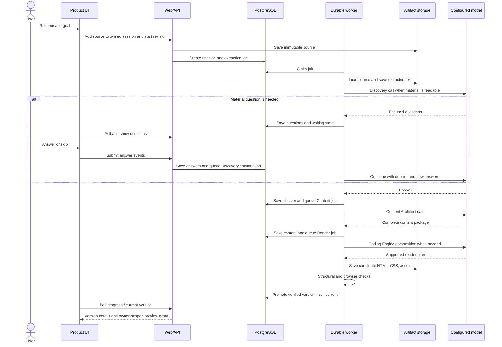

# Proposed generation, preview, revision, and operations design

> **Status:** research proposal awaiting review; no runtime, schema, or deployment changes are authorized by this document. [Start here](README.md) · [System overview](10-proposed-resume-portfolio-system.md) · [Agent contracts](11-agent-and-artifact-contracts.md) · [Agent playbook](13-agent-operation-playbook.md).

## 1. One complete generation run



The initial request returns quickly with a portfolio/revision ID. Model calls and Chromium checks never run inside the user's upload HTTP request. The browser polls server state or uses a progress stream backed by that same persisted state; a reconnect does not restart generation.

### Stage transitions

`intake_received -> extracting -> discovery_running -> waiting_for_answer (optional) -> dossier_ready -> content_running -> content_ready -> composing -> verifying -> ready`.

Store workflow/candidate state separately from the active verified version. UI states include `needs_input`, `configuration_error`, `repair_exhausted`, `cancelled`, and `superseded`, each with a safe stage-specific reason. `ready` describes an activated site version, never an unfinished artifact. Failed or cancelled regeneration preserves the active page. Retry only the failed operation when its parent hashes still match; otherwise construct a fresh revision with the accepted intent.

### Handoff and idempotency

The orchestrator commits a completed artifact and the next `background_jobs` row in one database transaction. The payload contains only artifact IDs, hashes, revision number, and operation ID, not a large resume or HTML body. A worker claim has a lease/heartbeat. All writes use an idempotency key derived from `(portfolio ID, revision ID, operation, input hashes, schema/prompt/theme versions)`. A redelivered job may reuse an already validated result but cannot double-promote or append the same revision twice. Before promotion, compare the candidate's requested revision with the portfolio's current desired revision. Superseded work remains diagnostic history; it cannot become the active preview. Store an operation's terminal artifact ID before acknowledging the job; a retry first looks up that operation ID and checks its hash rather than calling the model again. If a provider call completed but its result was never persisted, retrying may cost another call, but it still cannot create a second active version.

Every state mutation also checks the current worker claim/epoch, cancellation, account authorization, and revision fence. A recovered lease invalidates the old attempt even if its HTTP/model call later returns. Persist retry counters and accepted edit watermarks; process restarts cannot reset them. Stage completion and next-job insertion must occur in the same repository transaction. Agents receive serializable packets, never database sessions or request objects.

## 2. Persistence and artifact layout

### PostgreSQL records

| Record | Main fields and invariant |
| --- | --- |
| Existing `portfolio_sessions` plus workflow projection | Reuse owner/session identity; add pipeline version, desired revision, active site ID, and pinned theme; do not create a competing authorization root |
| `portfolio_revisions` | Base revision, user request event, requested change type, status, current stage, input hashes, supersession pointer |
| `edit_events` | Ordered accepted user instructions, selected structured target if any, visible base version, base desired revision, route and application status; replay is the authority for concurrent edits |
| Publication restriction projection | Current explicit privacy restrictions/revocations derived from source/edit events; serving and restoration enforce them independently of an older bundle's receipt |
| `source_documents` | Upload metadata, object key/hash, extraction status, extracted text key/hash, source spans/index |
| `question_events` and `answer_events` | Question/answer IDs, linked gap, answer/skip, revision and order; append oriented |
| `discovery_dossiers` | Immutable typed JSONB, hash, source IDs, contract version |
| `content_packages` | Immutable typed JSONB, hash, dossier ID, contract version |
| `render_plans` | Immutable typed JSONB, hash, content ID and theme manifest ID |
| `site_versions` and build-status projection | Immutable manifest/parent references; mutable candidate lifecycle is separate from sealed artifact bytes |
| `verification_receipts` | Immutable check outcomes, exact bundle hash, theme/renderer/browser/check-suite versions, evidence references; no preview secret |
| `background_jobs` / `agent_runs` | Durable queue, attempts, operation/version metadata and diagnostics; reuse current primitives where suitable |
| `theme_versions` | Component contract ID, stylesheet and asset hashes, supported block variants, status |
| `media_assets` | Optional photo or uploaded media ID, original and derivative object keys/hashes, dimensions, crop preference |

A proposed first implementation keeps structured bodies in JSONB and frequently joined IDs in relational columns. Binaries/site files use the storage abstraction. Names in this table describe logical records, not a prescribed migration. Immutable artifact lineage owns the new pipeline; existing session state may remain a UI projection. Record a pipeline version and retain old schema meanings. Never relabel an old approved summary as a source-linked dossier.

### Immutable storage bundle

Each candidate uses an immutable prefix such as `portfolios/<portfolio-id>/versions/<version-id>/`. Its bundle manifest lists `index.html`, exact shared `styles.css`, assets, file hashes, and theme/template versions. Sources, internal dossiers, and diagnostics are outside the served tree. HTML and CSS use relative asset paths. Seal the manifest **after** all files are written and read back. The later verification receipt references the manifest hash; the sealed manifest does not include the receipt, avoiding a circular hash dependency. The database links both to the site version.

Write files, read back hashes/MIME/size, seal the manifest, verify through the actual serving path, persist the receipt, then atomically activate only when current revision, accepted-event watermark, worker attempt, authorization, and parent hashes still match. A failed database transaction leaves an inactive candidate for retry/cleanup. Garbage collection must honor references and in-flight work; it cannot delete a retained active/restorable version. Access policy remains enforceable even for immutable files; do not publicly cache private capability responses.

### Fetching rules

The core pipeline loads only user-provided sources and versioned theme/assets from storage. It does not require open-web search for biography. Supplied GitHub/LinkedIn/project URLs are kept as links and checked for syntactic validity; a live third-party response is not treated as proof that a claim is true. If a later feature imports content from a supplied URL, it creates a separate `SourceDocument` with extraction/source spans and reruns Discovery. No agent quietly reads arbitrary links during rendering. Curated theme art is versioned locally; a transient stock-image URL is not a required runtime dependency.

## 3. Controlled HTML composition

The Coding Engine's model output is `RenderPlan/v1`, a mapping from approved section IDs to allowed component variants. The renderer is a trusted HTML serializer that creates the head, metadata, semantic landmarks, navigation, anchors, sections, footer, stylesheet path, and asset URLs. It escapes all content fields and generates IDs from stable section IDs. Content Architect's package owns visible words; the host owns HTML syntax. This removes duplicate navigation generation and raw multi-file repair as ordinary work.

### Exact build recipe: how fixed CSS and changing HTML meet

1. **Freeze inputs.** Select a `PortfolioContent` hash, `RenderPlan` hash, theme manifest ID/hash, renderer/template version, and asset manifest. A worker never reads a mutable “current content” value halfway through rendering.
2. **Check compatibility before serialization.** Match each content section's `block_type` and present fields to the selected theme variant. A section with no compatible variant fails with its section ID. A new portfolio requires a validated composition plan; a simple later edit can reuse the previous plan. The theme's declared fallback variant may normalize a rejected variant choice only when it preserves all fields. Do not improvise markup or silently drop content.
3. **Render the complete document from typed fields.** The host selects a theme template per section, fills text/attributes with context-appropriate HTML escaping, builds the nav from the actual ordered sections, generates stable unique DOM IDs from section IDs, and emits `lang`, title, description, viewport, one `<main>`, accessible headings, and a stylesheet link. It adds no free-form model HTML. An internal render map records `section_id + field_path -> expected DOM target(s)` for later binding checks.
4. **Copy the theme bytes.** Put the exact pinned CSS bytes at `styles.css` in the new version directory. Copy every referenced local font, image, icon, and any selected user media under `assets/` with the paths expected by the CSS and HTML. HTML uses `./styles.css` and `./assets/...`; CSS `url("./assets/...")` resolves relative to the CSS file in that same root. Emit a preload only when the corresponding file exists. External contact links may remain external; a required image/font may not depend on a third-party URL.
5. **Read back and seal.** Verify every file, write the manifest last, and serve the candidate through its version-specific preview path. Run required checks and create an immutable receipt. Only then may a fenced transaction promote the version. If export is added later, copy the sealed bytes without regeneration.

The supplied `index.html` is a **fixture**, not a template to search-and-replace. Its four nav links, four pillars, large skills inventory, remote hero image, and hard-coded identity cannot simply be retained for another resume. The theme may keep its visual classes, but the component templates must support 0/1/many eligible sections and an image-free hero. Decorative marquee items must be derived from evidenced capabilities or omitted; essential project content remains in visible page flow. The reference's font URLs must be backed by packaged files. Its CSS-only scroll progress can be optional because browser support varies.

**When files change:** each accepted content/composition revision re-renders complete `index.html` into a new immutable version. A content edit may reuse the render plan and always uses byte-identical pinned CSS. Future theme switches or photo changes would create new theme/asset bindings and HTML while retaining historical versions. First-release user changes never modify shared CSS.

**Allowed output now:** `index.html`, selected prebuilt `styles.css`, and assets. The release contract explicitly excludes model-authored CSS/JS, npm installs, network dependency resolution, and additional HTML routes. A theme revision can add more variants without changing the content schema. A future `site-capabilities/v2` may authorize generated CSS and JavaScript as separate owned artifacts with independent validation and browser behavior checks; Discovery and Content Architect continue to produce semantic content.

### Component fallback

After one bounded composition correction, use the theme's tested default mapping for all supported blocks. A generic narrative/list fallback is valid only if it preserves every public field. If no compatible mapping exists, fail `THEME_COMPONENT_UNSUPPORTED` with section/theme IDs. Never omit content, invent classes, or improvise CSS. Theme switching is a future capability subject to full compatibility checks.

## 4. Verification and promotion

### Required deterministic gates

1. **Artifact identity:** content package, render plan, theme, CSS, and asset hashes match the run; every required object exists and reads back.
2. **Content binding:** the renderer's field-to-DOM map matches expected placement counts. A fact-bearing body field appears in its intended component; deliberate repetition such as a name in both hero and wordmark, a section title in nav and heading, or duplicated decorative marquee terms is declared in the template contract. No review notes, placeholders, or stale previous-version identity appear. Comparing raw substring counts in HTML is insufficient because escaping and intentional repetition change those counts.
3. **HTML structure:** a document-conformance check and DOM invariant check pass; one main landmark; logical heading order; unique IDs; internal links resolve; generated navigation matches present sections; external links use valid supported schemes; no `<script>` in the current output contract. Browsers repair malformed HTML, so “the parser opened it” alone is not a sufficient gate. Unique IDs are required by the [HTML Standard](https://html.spec.whatwg.org/dev/dom.html).
4. **Theme contract:** all component IDs/variants/classes and expected child structures are supported by the pinned manifest. No user-specific stylesheet or unknown asset path is present.
5. **Assets:** stylesheet and fonts load, images decode, image dimensions are plausible, fallback hero works without a photo, and any required displayed media actually appears in the rendered DOM.
6. **Browser runtime:** open the actual serving path in pinned Chromium at small mobile, larger mobile, tablet, and desktop widths (proposed fixtures: 320, 390, 768, and 1280 CSS pixels). Assert response/MIME, loaded expected stylesheet rules, required font faces, image decoding, and bounded resource completion. `document.fonts.ready` alone does not prove every intended font loaded. Check unexpected horizontal overflow/clipping, visible CTA, anchors, and native disclosures. Use bounded auto-retrying assertions ([Playwright assertions](https://playwright.dev/docs/test-assertions)).
7. **Accessibility as functional quality:** keyboard reaches native controls, focus remains visible, heading/landmark structure is coherent, alt text fits the image role, text zoom remains readable, and reduced motion is respected. A configured 200% text-zoom fixture supplements responsive widths.

Store screenshots as evidence. Compare stable theme fixtures in a pinned environment; personalized content varies too much for one universal pixel baseline ([Playwright visual comparisons](https://playwright.dev/docs/test-snapshots)). Optional model aesthetic review is advisory. Human visual/accessibility acceptance of the theme remains necessary: automated checks cover only part of accessibility ([Playwright accessibility testing](https://playwright.dev/docs/accessibility-testing)). These checks detect defined defects, not every possible layout problem.

The verifier stores a typed receipt with each gate's result, affected section/asset IDs, browser version, viewport widths, screenshot hashes/keys, and sealed bundle hash. A failure code identifies the owner (`EXTRACTION`, `DISCOVERY_FACT`, `CONTENT`, `THEME`, `RENDER`, `ASSET`, `PREVIEW_DELIVERY`, or `BROWSER`). The user sees a short actionable message; a developer can open the receipt and exact candidate. A stylesheet defect is fixed once in the theme and rerendered, not “repaired” by making the Coding Engine write arbitrary CSS for one user.

**Illustrative verification receipt excerpt:**

```json
{
  "contract_version": "VerificationReceipt/v1",
  "site_version_id": "site-7",
  "bundle_sha256": "<computed-manifest-hash>",
  "candidate_path": "/p/portfolio-1/site-7/index.html",
  "status": "passed",
  "gates": [
    {"name": "content_binding", "status": "passed", "affected_ids": []},
    {"name": "asset_readback", "status": "passed", "affected_ids": []},
    {"name": "browser_runtime", "status": "passed", "affected_ids": []}
  ],
  "browser": {"engine": "chromium", "version": "<pinned-build-version>"},
  "viewports_checked": ["small-mobile", "large-mobile", "tablet", "desktop"],
  "screenshots": ["<versioned-screenshot-key>"],
  "failure_code": null
}
```

The host fills hashes, browser version, and evidence keys; the model does not author or approve a verification receipt. A failed receipt retains the actual failed gate and affected IDs and cannot be changed to `passed` without rerunning that gate against the same sealed candidate bytes.

### Repair policy

Use scoped recovery owned by the failing stage; do not add a general repair agent. Proposed configuration defaults:

| Budget | Default and accounting |
| --- | --- |
| Operation attempts | Three total, including the initial attempt; persisted across worker restarts |
| Semantic repairs | At most two passes per revision across Discovery, Content, and composition; a composition correction consumes this budget |
| Composition correction | At most one targeted correction, then a tested deterministic mapping when compatible |
| Browser process retry | One retry after a process/infrastructure failure against unchanged bytes |
| No-progress stop | Stop early when the same failure fingerprint recurs without relevant artifact change |
| Overall revision | Configured deadline and resource budget; a changed operation fingerprint never resets the revision budget |

Provider adapter and worker share an attempt ledger. Do not multiply SDK retries by job retries. Use capped exponential backoff with jitter for transient timeouts, rate limits, and outages; honor bounded provider retry hints ([AWS backoff guidance](https://aws.amazon.com/blogs/architecture/exponential-backoff-and-jitter/)). Invalid credentials or unsupported configuration stop immediately.

Every repair input is a structured issue: `stage`, `failure_code`, artifact/version/hash, affected section/field, expected constraint, observed problem, evidence refs, allowed repair scope, prior failure fingerprint, and remaining operation/revision budgets. Never feed an unbounded log transcript to a model.

| Defect | Permitted recovery | Recheck scope |
| --- | --- | --- |
| Missing source text | Ask for paste/replacement; preserve original | Extraction and affected downstream artifacts |
| Wrong/conflicting fact | Discovery reconciles evidence or asks a focused question | Dossier, content, composition compatibility, rendering, verification |
| Unsupported claim, missing copy, invalid coverage | Content Architect receives exact facts, fields, and failed constraints | Full content gate and all affected downstream gates |
| Truncated structured output | Persist completed validated section batches; resume named missing sections within admission/budget | Completeness and integration before downstream use |
| Unsupported variant or density | Scoped composition correction or declared fallback preserving content | Plan, rendering, browser checks |
| Renderer/theme defect | Stop candidate promotion and report engineering defect; fix shared package under a new version | All affected theme fixtures and candidate checks after a separate fix |
| Storage interruption | Retry the same immutable bytes and readback | Storage/manifest and serving-path verification |
| Browser infrastructure crash | Reuse sealed candidate; retry verifier once | Browser receipt for unchanged bytes |
| Expired access/delivery policy | Refresh owner grant or repair serving configuration | Delivery checks; no content regeneration |
| Superseded/cancelled/unauthorized attempt | Stop writes/promotion | No semantic repair; current authorized intent owns the next work |

Renderer normalization can derive unique anchors, resolve declared paths, and select optional image fallbacks before sealing. Any post-seal byte change creates a new candidate/hash and invalidates its old receipt. Do not delete facts, reduce required coverage, weaken checks, or modify per-user CSS to obtain a pass. Exhaustion returns `needs_input`, `configuration_error`, or `repair_exhausted` with accepted intent retained and the last verified version available.

### Preview delivery

Serve a version manifest's exact files on a dedicated preview origin, never in the application's DOM or `srcdoc`. The verifier opens the candidate through the real file-serving handler before activation using a candidate-scoped internal grant. User grants authorize owned verified versions only. The iframe and standalone action reference the same version; an old version URL does not silently become the latest page.

The owner-authorized API issues short-lived, version-scoped access covering **HTML and every CSS/font/image request**. A proposed cookie-independent delivery shape is `/access/<capability>/p/<session>/<version>/index.html`; relative assets retain the grant prefix. Validate expiry, version, owner authorization/revocation policy, and normalized manifest path on every request. Redact the capability at proxy/application/analytics layers, use `Referrer-Policy: no-referrer`, and keep private responses out of public caches. The canonical manifest/receipt stores the grant-free path; bearer URLs never enter agent packets. Return a safe access-expired response and refresh through the owner API. A different grant mechanism is acceptable only if it works embedded and standalone without relying on third-party cookies.

**Desktop sizing:** set the iframe viewport to 1280 CSS pixels and scale the whole frame to fit the right pane; do not merely shrink the iframe to pane width. `Fit` computes scale from available width; `100%` permits workspace scrolling. Mobile uses a real configured viewport such as 390 CSS pixels. Keep the left chat resizable/collapsible; use chat/preview tabs on narrow screens. An isolated frame cannot support parent DOM inspection for click-to-edit in this release. The app's section selector supplies stable content targets instead.

**No-JavaScript policy:** allow native anchors and disclosures. Disable scripts, forms, downloads, nested frames, and top navigation. A proposed iframe sandbox permits only `allow-same-origin allow-popups allow-popups-to-escape-sandbox` on the dedicated preview origin; this does not grant the application origin. External links use `target="_blank"` and `rel="noopener noreferrer"`. The preview response also carries a CSP sandbox with equivalent restrictions, `script-src 'none'`, `form-action 'none'`, `object-src 'none'`, `base-uri 'none'`, self-only required asset sources, and `frame-ancestors` restricted to the product origin. Allow no generated inline CSS, event handlers, or executable URL schemes. Test the policy embedded and standalone. A CSP sandbox is a response-header control; an iframe attribute alone does not constrain standalone pages ([MDN iframe](https://developer.mozilla.org/en-US/docs/Web/HTML/Reference/Elements/iframe), [CSP sandbox](https://developer.mozilla.org/en-US/docs/Web/HTTP/Reference/Headers/Content-Security-Policy/sandbox)).

Keep application authentication cookies host-scoped; do not share application credentials with preview subdomains. Configure the complete CSP from the closed resource manifest, including `frame-src 'none'` and no network connections from generated content. Only trusted templates may emit markup; uploaded HTML/SVG or active document content is never copied through as executable page content.

Keep the previous frame visible during generation and errors; switch only after verified promotion. Provide reload, refreshed access, and standalone-open recovery for local delivery failures. Avoid promising flicker-free swaps across all browsers. Backend verification establishes the version's check result; it cannot guarantee every client network will deliver it successfully.

An explicit new privacy restriction is an exception to retaining an older preview. If the active or historical bundle contains the now-private field, revoke its serving grants, clear it from the product frame, and show a waiting state until a compliant version is ready. Grant issuance and every file request check current publication restrictions; an old passing receipt is not permission to reveal newly restricted information. Already delivered bytes cannot be recalled from a browser. An ordinary editorial hide request takes effect with the new verified version unless the user also makes it a privacy restriction.

```text
┌────────────────────────┬─────────────────────────────────────────┐
│ Chat / changes         │ Desktop  Mobile  Fit  100%  Open        │
│                        ├─────────────────────────────────────────┤
│ Compact stage summaries│                                         │
│ Useful questions       │ Exact immutable portfolio iframe        │
│ Section selector       │                                         │
│ Version history        │ Native navigation and disclosures       │
│                        │                                         │
│ Change request         │ Last permitted verified version         │
└────────────────────────┴─────────────────────────────────────────┘
```

The left panel is resizable/collapsible. On narrow screens, chat and preview are tabs. Expandable artifact details open in the product UI and never get appended to the public portfolio.

The iframe's `load` event alone does not prove the site loaded successfully; browser checks and the server-side verification receipt are authoritative. MDN documents that iframe load can fire even on a failed resource, and explains sandbox behavior ([MDN iframe reference](https://developer.mozilla.org/en-US/docs/Web/HTML/Reference/Elements/iframe)).

### Product API surface (conceptual, not frozen route names)

| Operation | Input and response contract |
| --- | --- |
| Add source | Owned session, file/pasted text, source role, idempotency key; return source ID and extraction state |
| Start portfolio | Source IDs/versions, goal, expected revision; return durable workflow/revision ID and progress reference |
| Read progress | Portfolio/revision ID; return current stage, pending question IDs, classified error when present, and last ready version ID |
| Submit answers | Question IDs with answer or skip, exact base revision, and idempotency key; persist events and resume Discovery once |
| Request change | Visible base site-version ID, latest desired-revision ID, user instruction, optional selected section/field, and idempotency key; return new revision ID and immediate classification only if unambiguous |
| List versions | Immutable version IDs, candidate/verification status, creation time, and safe summary; viewing does not restore |
| Open preview | Owned verified version; return an expiring grant URL, covering HTML and assets |
| Restore version | Chosen version and expected revision; restore dossier/content/plan references as the new edit base and fence obsolete work |
| Retry/cancel | Revision ID, expected state/revision, idempotency key; preserve accepted intent and last active site |
| Add/replace photo (future) | Upload asset and crop preference, return immutable media ID, then request a render revision against a base version |

The existing authentication and owner-scoped session checks apply to these operations. The UI may poll or use server events, but the database projection is authoritative. A repeated browser submission with the same idempotency key returns the original revision rather than starting another run. An edit with an obsolete base version receives a version conflict and enough current-version context for the UI to retry deliberately.

## 5. User change pipeline

Every change request stores exact user text, selected section/field when known, visible base site ID, expected desired revision, and idempotency key. Typed requests route deterministically; free-text interpretation is a bounded operation under Discovery, Content Architect, or composition ownership, using the configured model when needed. It proposes typed sub-actions; application code validates their scope. Mixed requests are one revision. Ambiguous intent gets one focused clarification. First-release targeting uses the section list or text, not DOM access to the preview.

| Change request | Owning update | Regeneration path |
| --- | --- | --- |
| Name, date, employer, role, metric, project contribution | Discovery fact record | New dossier -> targeted Content revision -> render/verify |
| Replace or add a resume | New immutable source document; decide whether it supersedes or supplements the previous primary source | Re-extract changed source -> Discovery reconciliation -> Content -> render/verify |
| Goal, audience, work to feature, supplied link or contact route | Intake intent and/or Discovery choice; update canonical link record | New dossier/intent projection when meaning changes -> targeted Content revision -> render/verify |
| Project wording, emphasis, tone, section order, add/remove supported section | Content Architect package | New content package -> render/verify |
| Supported layout variant | Render plan | Same content -> compatible composition -> render/verify |
| Broken anchor, clipping, template/CSS defect | Renderer/composition diagnosis; shared defects go to engineering | Bounded compatible variant recovery or stop promotion; no per-user CSS fix |
| Switch themes (future) | Theme selection and compatibility | Same content when compatible -> render/verify |
| Replace/add photo (future upload UI) | Asset manifest and crop preference | Same content unless caption/alt changes -> render/verify |
| Custom color, new animation, arbitrary CSS change | Future visual-editing capability | Explain the current scope; do not edit CSS or claim a variant fulfills an unsupported style request |
| Change that mixes facts and styling | Split one recorded revision into dependent fact/content/render operations | Promote only the final checked version |

**Example:** “My name is Akash, not Ajay.” The server records a fact correction against the current dossier, produces a new dossier version, updates affected copy/metadata through a mapped patch or targeted Content Architect rewrite, then re-renders. Passing only the previous `index.html` to Coding Engine would make the next full regeneration capable of restoring “Ajay”; the prior render plan preserves composition, while the dossier/content records remain the name's authority.

A precise field correction may use a deterministic patch; affected free prose still needs checking or Content Architect revision. A supported variant edit reuses the content. Restore selects a prior version's complete structured base without deleting history. Hide/restore-section edits update content structure and the coverage ledger, so omitted information stays recoverable.

### Apply a change without losing an earlier one

1. Validate the visible base site version and expected desired revision. If another tab already accepted a newer instruction, return a conflict plus current intent summary; do not automatically merge a stale instruction whose meaning may have changed.
2. Classify into factual, editorial, structural, supported layout, or mixed sub-actions. Persist raw intent before interpretation, then validate/store its typed plan. An unsupported styling sub-action remains explicitly unfulfilled; do not silently treat the whole mixed request as completed. Process independent supported changes only when the user's intent permits that separation, otherwise ask once.
3. Append the accepted event under a portfolio-level revision compare-and-swap. Permit **one active build chain per portfolio** in the first release. If a chain is running, mark its candidate superseded for promotion and queue the latest desired revision. Reconstruct that revision from the last stable structured snapshot plus **all unapplied accepted edit events in order**; do not assume an in-flight intermediate dossier/content artifact exists. Coalesce work into one candidate when several edits arrive rapidly, while preserving each event and its order.
4. Run the earliest owning stage once for the combined events, then downstream stages. For a name correction, update the dossier fact, replace mapped identity fields/metadata in the content package, and check every known identity-bearing field. If all occurrences are typed and mapped, a deterministic content patch is enough; if free prose or grammatical context remains, Content Architect performs a targeted rewrite. Either way the whole HTML is reserialized and verified.
5. Before promotion, require the candidate's desired revision and ordered edit-event watermark to equal the portfolio's latest accepted values. If they differ, keep the last ready site and begin the latest queued build. Never promote a partially applied mixture of requests.

**Concurrency example:** the user sends “change Ajay to Akash” and, before that build finishes, “make the introduction less formal.” The accepted ledger has two events. The second candidate starts from the last stable dossier/content and applies both the name and tone changes. A name-only candidate that finishes late is stored as superseded and cannot become the active page. A worker restart replays the same two events from their IDs; it does not ask the user to repeat them.

Restoring an older verified version is also an explicit revision event if the user will continue editing it. It sets the chosen site's dossier/content/plan as the new structured base and records that choice; otherwise a later edit could unexpectedly inherit newer content from the version the user meant to leave behind. A simple “view older version” action changes no active pointer or edit base.

Before restoration, apply any current owner privacy restrictions/revocations. Restoring old bytes must not reveal information that the user subsequently marked private. If old content conflicts with current restrictions, rebuild and verify a restricted version from the selected base instead of directly activating the old bundle. Otherwise an unchanged sealed bundle with a compatible receipt can be reused under the new restoration revision.

Cancellation is a fenced workflow event. Stop further calls/enqueues and discard late promotion; a remote call already in progress may finish but cannot commit as current. Retain accepted changes as unapplied/cancelled intent. A retry explicitly resumes/reconstructs them within recorded budgets; a user amendment creates a new revision. Budget exhaustion is not cleared by re-delivering the same job. API polling reports current desired intent, candidate status, last active site, and an actionable safe error separately.

## 6. Photo and asset path, now and later

The proposed theme needs an image-free or curated built-in hero. User portrait binding is reserved for future upload support. The reference CSS expects `.hero__visual img` and the sample uses an external image; the reusable package must support a local/image-free fallback. Missing photos are normal.

When photo upload is enabled, intake validates a decodable supported image, records dimensions/orientation, stores the original, creates a display derivative and thumbnail, and records an immutable media ID. The user may choose crop/focal point or replace/remove the photo. The renderer binds that ID to the hero slot using the theme's documented aspect ratio/object-fit treatment. If derivative generation fails, keep the previous portrait or fallback visual and present the upload error. CSS is unchanged per user; the asset binding and HTML `src` change. The asset manifest handles future media without changing Discovery/Content Architect's core contracts. Caption/alt wording, when visible or required, is part of the content package or a stable renderer rule based on asset role.

## 7. Failure matrix and truthful outcomes

| Failure | Detection | Outcome / repair owner |
| --- | --- | --- |
| PDF/DOCX text empty, garbled, encrypted, or unreliable | Extraction/readability diagnostics | Preserve original; offer paste/replacement. OCR is deferred |
| Resume is very sparse | Dossier completeness review | Focused questions, then a shorter truthful portfolio |
| Source has only a name and user skips follow-up | Content acceptance | Meaningful minimal introduction only with a real destination; otherwise `needs_input` with one concrete request |
| Resume has many roles/projects | Dossier source indexing and content budget | Content Architect selects leading evidence and uses concise secondary treatment; no silent source truncation |
| Contradictory dates, titles, or metrics | Fact conflict records | Ask once or omit precise assertion; no confident guess |
| Role ownership unclear | Question/open-item record | Preserve unknown attribution; use neutral supported wording or omit claim |
| User supplies two resumes or a job posting | Source roles/conflicts | Reconcile compatible facts, ask about consequential conflicts; job posting never supplies personal achievements |
| Model emits schema-valid but empty/generic prose | Section substance checks and human-calibrated evals | Targeted Content revision; do not pass a hollow package to rendering |
| Model emits schema-valid unsupported claim | Field-level fact bindings plus semantic support audit | Targeted Content repair with exact evidence; IDs alone do not establish entailment |
| Private information appears in title, alt text, or copy | Restriction gate across all public fields and bundle | Reject candidate; update affected copy/metadata and rerun checks |
| Model output malformed, incomplete, or provider timeout | Parse/error classification | Bounded operation retry; persist attempt and stage; last good stays available |
| Package cites missing fact/link/asset ID | Referential validation | Return exact ID to owning stage; no fuzzy matching |
| Unsupported component or theme | Manifest compatibility check | Use declared generic variant or fail with actionable capability gap |
| Optional photo missing or broken | Asset manifest and browser decode check | Built-in/monogram fallback; photo upload can be retried separately |
| Font/CSS/image request fails | Readback plus browser network/DOM check | Repair theme packaging or asset binding; candidate stays unverified |
| Long name or paragraph clips on mobile | Browser geometry and screenshot inspection | Alternate supported variant or theme fix; retain full facts |
| Nav section removed or duplicate ID created | Renderer invariant and DOM checks | Derive nav from sections; deterministic slug correction |
| User changes content while a run is active | Revision compare-and-swap | Old candidate marked superseded; latest revision wins |
| Browser service crashes or reaches resource limit | Verification job health/timeout | Retry verification only when candidate bytes are intact; scale worker if repeated |
| DB commit fails after object upload | Promotion transaction | Orphan candidate cleanup; old active pointer remains |
| Object write/readback fails | Hash/readback | Retry storage operation; never publish incomplete bundle |
| Preview iframe shows blank despite a good DB state | Exact URL fetch and browser receipt | Treat as delivery failure, show last verified version or actionable error |
| Preview HTML loads but frame policy or asset access blocks the page | Embedded browser check plus CSS/font/image response records | Fix preview-session scope or frame headers; do not regenerate content |
| Theme is updated after a portfolio is ready | Versioned theme hash | Old portfolio retains pinned CSS; new versions opt into the updated theme |
| User requests arbitrary new CSS now | Capability check | Explain current scope and keep the working preview; stylesheet editing is future work |

These are major known failure classes, not a claim to enumerate every possible browser or model defect. A newly observed repeatable failure should become a fixture and a narrow check; repair budgets should not be raised to hide validator or theme bugs.

## 8. Engineering and release operations

### Capacity and process separation

Keep API and worker separate; pin compatible code/schema versions and browser dependencies. Limit browser concurrency independently of model calls. Share PostgreSQL and durable artifacts through existing abstractions. Ephemeral workspace files are temporary processing inputs, not the sole persisted record. No provider migration is selected here.

Begin future capacity evaluation with bounded extraction/model/browser queues; measure memory, latency, and queue wait on representative sparse/large inputs before raising concurrency. Configure limits centrally. Do not promise hardware requirements or latency without measurements.

### Observability

Every revision has one traceable chain: source -> dossier -> content -> render plan -> candidate -> verification -> active version. Record operation name, model profile/prompt/schema/theme versions, input/output hashes, attempt number, duration, classified error, relevant section/asset IDs, and browser receipt location. Dashboard measures extraction failure rate, question count, dossier-to-content rejection, rendering defects by component/theme, retry rate, time to first preview, queue wait, and verified promotion rate. Diagnostic artifacts keep enough bounded evidence to reproduce a failure without replaying unrelated prompts.

Logs contain IDs and safe diagnostics, not resumes, provider credentials, or preview capabilities. Raw sources/agent artifacts and screenshots follow owner-scoped access and configured retention. Normal diagnostics should not require logging personal source excerpts.

### Development verification to build during implementation

- Parser fixtures for plain, PDF, DOCX, scanned/partial, two-column, duplicated, and job-description-versus-resume inputs.
- Stage-specific contract/eval cases: sparse student, experienced individual contributor, manager/team attribution, researcher, career switcher, many projects, no project, conflicting dates/metrics, and long international names.
- Component fixtures across text lengths, 0/1/many items, optional visual states, mobile/tablet/desktop widths, and reduced motion.
- End-to-end integration for versioned object readback, stale job fencing, retries, failed candidate recovery, and last-good preview.
- Real-browser checks against the serving path, both embedded and standalone, including relative asset grants/expiry. Visual comparisons use stable fixture pages and a pinned environment; personalized pages use functional/geometric checks plus human review.
- A small anonymized, human-reviewed portfolio quality set. Evaluate factual fidelity, useful depth, fit to goal, variety within the theme, and visual readability. OpenAI recommends task-specific evals and human calibration ([evaluation best practices](https://developers.openai.com/api/docs/guides/evaluation-best-practices)).

### Deployment and recovery

Future implementation should exercise schema compatibility, theme/renderer fixtures, browser delivery, and migrations before a separately authorized release. Apply migrations once, then compatible API/worker versions. Keep historical artifact schemas and pinned theme bytes readable; plan database and storage backup/restore together. Follow the repository's deployment runbooks. This documentation task neither changes CI/deployment nor runs application tests or live models.

### Future extension rules

1. **More themes:** register a new version with the common semantic component set and a complete asset manifest. Re-render existing content only when the user opts in; old versions remain pinned.
2. **Generated CSS:** introduce a portfolio-specific style artifact with its own owner, validator, lineage, and preview gate. Never overwrite shared global CSS. A compatible styling change can reuse content; altered semantic capabilities require an explicit compatibility review.
3. **JavaScript:** add explicit behavior/component capabilities and a versioned script artifact. A page remains valid HTML/CSS when no script is present. Browser QA then tests actual interactions and failure fallback.
4. **Multiple pages:** requires a new content document schema, navigation contract, render/preview/export rules, and explicit product decision. Do not infer multiple pages merely because a resume is long.
5. **Public publishing/export:** separate authorized operations over an already verified immutable bundle. Preview works before these features exist; export must preserve the checked bytes.

## 9. Realistic release criterion

A future release should demonstrate repeatable verified previews across representative inputs, complete evidence accounting, corrections surviving later edits, ordered concurrent changes, stale-worker rejection, and previous-version availability during failures. The [playbook's acceptance scenarios](13-agent-operation-playbook.md#8-acceptance-scenarios-for-future-implementation) define expected outcomes. Visual quality needs human-reviewed theme examples; verification means the exact candidate passed the defined checks, not a guarantee of infallibility.
