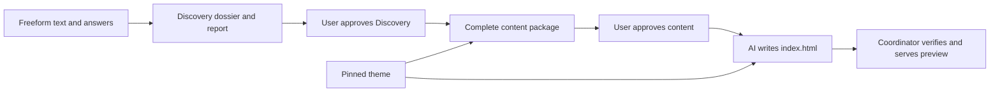
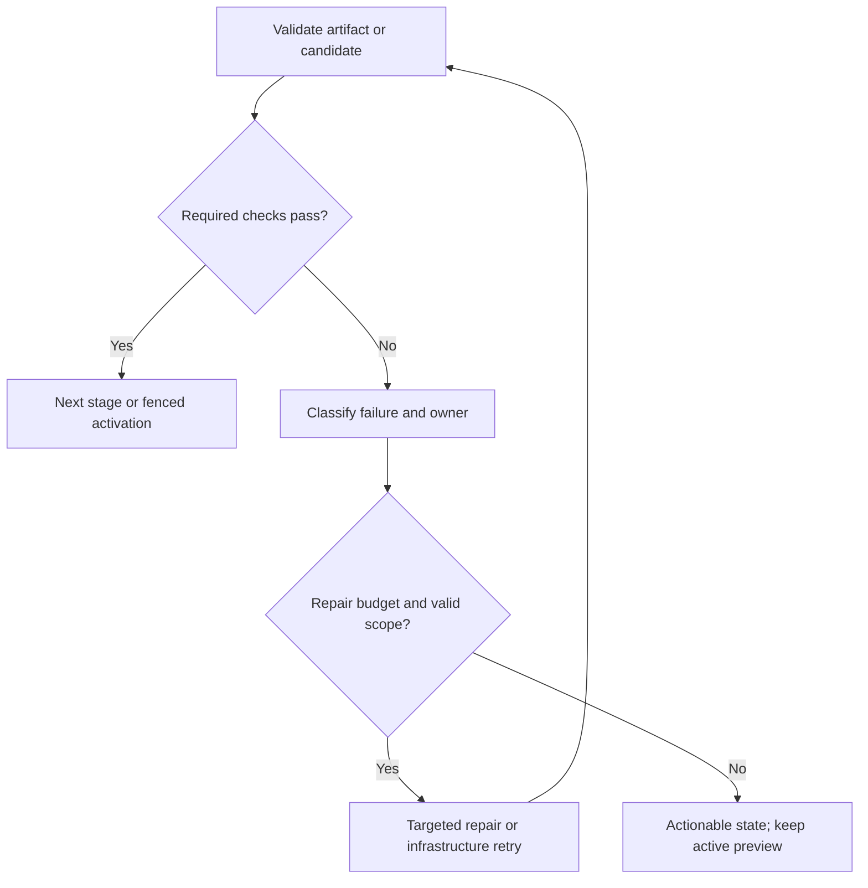

# Proposed agent operation playbook

> **Status:** research and review only, 2026-09-29. These are proposed responsibilities and contracts, not implemented code. Review this design before starting implementation. [Architecture index](README.md) · [Artifact schemas](11-agent-and-artifact-contracts.md) · [Runtime and repair](12-generation-preview-revisions-and-operations.md).

## 1. The three agents and the software around them

| Owner | The question it answers | Authoritative output | What completes the stage |
| --- | --- | --- | --- |
| Intake service | What exactly did the user type or paste? | Immutable text, source spans and intent/answer events | Every submitted detail remains accounted for |
| Discovery | What do we know about this person, what do they want, and what remains uncertain? | Complete `DiscoveryDossier` and readable report | Coverage passes and the user explicitly approves the report |
| Content Architect | What should this portfolio say, in what order, for this audience? | Complete `PortfolioContent` | Finished public copy and coverage pass; the user explicitly approves it |
| AI Code Generator | How does that exact approved copy become one styled HTML page? | Complete `GeneratedHtml` with `index.html` | All approved fields bind to permitted theme markup and assets |
| Coordinator and verifier | May these exact HTML and CSS bytes become the current preview? | Bundle, receipt and fenced activation | Required checks pass and the revision/worker/authorization still match |

“Agent” describes ownership of reasoning and structured output. It does not mean an autonomous process that can call other agents, write database transactions, browse arbitrary links, install packages, or publish content. Host application code supplies the inputs and validates the results.



Text equivalent: text evidence → factual dossier and approval → finished public content and approval → AI-generated HTML → coordinator verification/preview. Content Architect receives semantic theme capabilities; Code Generator receives the approved content plus the theme markup/class contract; the coordinator attaches the pinned CSS/assets.

### Common operation envelope

The host assembles an immutable packet containing:

- Session/portfolio ID, pipeline version, desired revision, operation ID, and authorized attempt.
- Parent artifact IDs and hashes, schema/prompt/configuration versions, and theme capability version where relevant.
- The operation's direct factual/content inputs, including exact relevant source spans.
- User intent, privacy restrictions, accepted correction events, and the allowed change scope.
- Required output contract, remaining budgets, and structured issues when repairing.

The output is one tagged result: completed artifact, questions/clarification, `needs_input`, or a classified failure. Internal validated batches are explicitly partial. They cannot be consumed as a completed stage. The host owns timestamps, IDs/hashes, storage, validation receipts, job scheduling, and compact UI projections.

## 2. Intake: establish trustworthy boundaries

### Work sequence

1. Authorize the existing portfolio session and record the request/idempotency key.
2. Store the exact typed or pasted text immutably, regardless of where in the box the goal or resume appears.
3. Assign source and character-span IDs and retain the unchanged text alongside normalized working text.
4. Identify obvious empty/greeting-only input and request one professional starting point rather than manufacturing a generic resume.
5. Commit source references and schedule Discovery for the admitted text.

The first slice has no file attachment or extraction step. A future plus-button can accept PDF and DOCX, preserve originals, report extraction quality, and produce the same source/span contract. OCR is later still. PDF extraction has known reading-order and image-text limits ([pypdf documentation](https://pypdf.readthedocs.io/en/stable/user/extract-text.html)).

### Source roles and trust

| Role | May support personal claims? | Use |
| --- | --- | --- |
| Professional details/resume | Yes, as `source_asserted` | Facts about work, education, projects, links |
| Direct answer/correction | Yes, as `user_confirmed` when unambiguous | Clarify or supersede an earlier value |
| Job description | No | Audience/positioning goals and relevant emphasis |
| Writing/visual reference | No | Tone or presentation preferences |
| Explicit restriction | Controls publication | Omit/generalize selected facts, contacts, organizations, or projects |
| Embedded instruction inside a resume | No operational authority | Preserve as source text; never override agent/system contracts |

Do not fetch a supplied project URL just to make generation work. A link can be syntactically valid without being externally verified. If URL import becomes a feature, it produces a separate source artifact before Discovery.

## 3. Discovery: complete factual understanding

### 3.1 Inventory before interview

Discovery first accounts for the entire freeform text. Extract identities, roles, organizations, dates, responsibilities, projects, technologies, outcomes, education, publications, awards, volunteering, intent, preferences, and unusual professional evidence. There is no maximum project count in the canonical inventory. The [operating specification](14-discovery-and-content-authoring-spec.md) details the inventory and report.

Separate a sentence containing several claims into atomic facts when that helps verification. For “Built the queue consumer for a rollout that reduced processing time by 25%,” contribution, rollout membership, measured result, units, and ownership are distinct concerns. Preserve original wording and qualifiers. Do not turn a year into a full date, a team result into individual credit, a skill mention into mastery, or “helped” into “led.”

Attach a disposition to every substantive extracted span: fact(s), intent, restriction, reference context, duplicate, or excluded with reason. Duplicate sources retain their references. A coverage ledger with no missing IDs detects one class of omission; it does not prove that every fact was interpreted correctly. Representative human-reviewed cases remain necessary.

### 3.2 Decide which questions materially help

Question selection follows impact, not a fixed form. Prioritize contradictions affecting identity/dates, personal ownership, portfolio purpose, featured evidence, and visitor action. Show **one, two, or three** concise related questions together when those gaps exist; ask none when evidence is sufficient. There is no fixed two-round limit: each distinct gap is asked at most once unless new user information changes it, and the user may skip or continue at any point.

| Trigger in the actual material | Example question | If skipped |
| --- | --- | --- |
| Audience changes which work leads | “Should this mainly attract employers, clients, or research collaborators?” | Use a conservative stated default and record its basis |
| Project contribution is unclear | “Which parts did you personally handle?” | Describe supported participation without invented ownership |
| Outcome may belong to a team | “Was this result for your contribution or the wider team?” | Preserve unknown attribution; omit the result if safe wording is impossible |
| Sources give different dates | “These sources show different end dates. Which should I use?” | Omit the disputed precision; keep conflict recorded |
| Strong project has no context | “What problem did this project solve, and who used it?” | Use only supplied project context; allow a compact treatment |
| Several equally strong directions | “Which of these projects should visitors notice first?” | Choose an evidence-based ordering and mark it as an editorial default |
| No useful visitor action | “What should an interested visitor do next?” | Use a real supplied destination or an existing evidence anchor |

Questions cite gap/entity/source IDs internally and include a short user-readable context and reason. Offer source-specific choices when useful, plus free text and Skip. A question-set ID binds answers to the exact draft. Persist answers and skips before continuation; stale answer submissions receive a conflict. “Continue with available details” closes optional questioning rather than generating another differently worded request for the same gap.

If a skipped gap blocks only one claim, omit that claim. If nothing meaningful can be produced, return `needs_input` with one concrete request. Do not invent a professional identity or fictional contact destination to produce a nominal success.

### 3.3 Reconcile and finalize

Use explicit corrections to supersede earlier fact versions. Conflicting resumes do not get an automatic newest-file winner. Keep unresolved conflicts as conflicts and restrictions attached to the exact facts/entities they cover. Never promote an inferred audience preference into a user-confirmed fact.

The final dossier must include all groups in the [contract](11-agent-and-artifact-contracts.md): lineage, identity, intent/basis, complete experience/projects, other evidence, atomic facts, restrictions, gaps/conflicts/skips, and source coverage. Its readable Markdown report can be extensive. The frontend can show a short direction summary first, but must allow full inspection and revision. Both views project the same validated dossier. When context is sufficient, acknowledge that briefly and open this review directly; the user then explicitly approves the dossier/report version before Content Architect starts.

### 3.4 Large dossiers and factual revisions

For long inputs, extract bounded source chunks with stable span IDs, persist validated chunk outputs, then merge facts and check conflicts globally. A chunk has an explicit range and completion marker. Finalization requires all admitted chunks accounted for; the last page is never discarded to make a request fit.

For a name/date/contribution correction, load the relevant fact revisions and evidence plus current global restrictions. Reconcile the change into a new complete dossier version. Unaffected facts retain IDs and provenance. Downstream consumers receive that exact new dossier, never a short “name changed” message as their only factual base.

## 4. Content Architect: full editorial planning and writing

### 4.1 What it receives

Content Architect receives the complete **approved** dossier and hash as its logical input, the user's goal/preferences, and the pinned theme's semantic capability contract. The contract describes hero, introduction, project, experience, capabilities, credentials, generic narrative/list, and contact blocks; required/optional fields; density options; native interactions; and limitations.

Do not routinely send raw `styles.css`. CSS is useful to theme development and HTML generation; it does not tell the content writer which fields are required or which claims are allowed. Source excerpts are attached when an ambiguous/sensitive statement needs checking. On revision, include the current content package, ordered edit events, affected targets, and all still-applicable restrictions/corrections.

“Complete input” does not require one enormous model call. The host retains the full dossier and supplies a complete section-specific subset to each writing call, with global intent/restrictions and cross-section entity references. Coverage planning must account for the entire inventory; no lossy summary substitutes for the facts used to write a section.

### 4.2 Operation A: plan story and evidence coverage

Produce a section plan with stable IDs, semantic types, purpose, order, navigation intent, supporting entities/facts, and a brief decision reason. Define the audience, professional positioning, strongest supported evidence, desired visitor action, and tone. Decision reasons should be concise editorial explanations, not hidden reasoning transcripts.

Map every relevant fact/entity to a planned use or explicit disposition:

| Disposition | Required record |
| --- | --- |
| Used | Section/field destinations and supporting fact revision |
| Condensed | Destination and how qualifications/meaning are preserved |
| Retained internally | Reason it is not necessary for this public page |
| Excluded by restriction | Exact applicable restriction/event |
| Excluded editorially | Concrete relevance/redundancy reason; entity remains recoverable |
| Unresolved | Gap/conflict ID and affected claim omitted or constrained |

A new graduate may lead with coursework/projects; an experienced operator with responsibilities and results; a researcher with publications. No fixed quota requires all profiles to invent three projects, metrics, employers, awards, or testimonials. A generic narrative/list block preserves unusual material when a specialized block would distort it.

### 4.3 Operation B: write complete sections

Each writing packet contains the section plan, exact current facts with original qualifiers, relevant evidence excerpts, link/asset records, supported block fields, global restrictions, and required output paths. The writer must not rely on an earlier strategy paragraph to remember the factual record.

For ordinary portfolios, planning/writing can be combined. For long portfolios, persist validated named-section batches. Maintain a completion map of expected versus completed section IDs. An interrupted or truncated batch remains incomplete; retry only the missing/invalid work within budget, then audit the integrated package.

#### Project narrative contract

| Public field | Writing rule |
| --- | --- |
| Title | Supplied name or conservative descriptive title; no invented product brand |
| Context/problem | Explain what the source supports about purpose/users/problem |
| Contribution | Preserve individual/team role and degree of ownership |
| Approach/decisions | Describe supplied actions/reasons; do not invent why a technology was chosen |
| Outcome | Use supported qualitative/quantitative result, exact scope/units, and attribution; optional when absent |
| Technologies | Use supplied tools in their correct relationship to the project |
| Proof links | Refer only to existing validated canonical links |
| Missing/omitted fields | Internal reason and gap/fact IDs; no “not provided” filler on the public page |

“Detailed” means complete useful supported copy with clear evidence relationships. It does not mean stretching one bullet into an invented case study. If only title, contribution, and tools exist, use a compact project treatment. If contribution is also unknown, use a supported generic evidence item instead of filling a required project field with a guess.

Experience preserves role/employer/date precision, supported scope, and achievements. Capability groups use supported skills/examples without mastery ratings. Metadata, navigation labels, captions, alt text, CTA labels, and contact copy are part of the finished package; Code Generator must never invent them later.

### 4.4 Operation C: audit the integrated content

Run mechanical checks first, then a scoped semantic support audit where needed:

1. **Completion:** every selected section and required field has finished copy; no outline-only sections or placeholder prose.
2. **Lineage:** the package references the exact current dossier/theme-capability version.
3. **References:** all claims, links, assets, sections, and navigation targets resolve.
4. **Support:** each factual public field is supported by the cited facts, including subject, ownership, modality, scope, chronology, metrics, and qualifications. A valid fact ID with an exaggerated sentence fails.
5. **Restrictions:** check body copy, metadata, accessible text, link destinations, and asset labels. User-requested omission overrides an editorial preference to feature impressive evidence.
6. **Coverage:** every relevant fact/entity has a disposition; no source project disappeared because a writing call got only the first few items.
7. **Consistency:** names, pronouns if supplied, terminology, dates, and corrections agree across sections/metadata.
8. **Compatibility:** every field can be rendered using the pinned semantic capabilities without forced truncation.

Unsupported claims return precise fields and evidence to the writer. Incorrect facts return to Discovery. A shared component gap is a capability failure, not permission to delete the section. The host integrates validated copy into one `PortfolioContent`; the reader-facing summary might show emphasis, ordered sections, and a short excerpt, while the complete copy and coverage remain inspectable. The user revises or explicitly approves the package before Code Generator starts.

### 4.5 What the next stage must be able to assume

The approved content package has finished personalized words, unambiguous section IDs/order, current canonical links/assets, complete factual bindings, coverage, and internal review findings. Code Generator gets this package as its only person-specific source. It should be able to write HTML without asking “What should this person's biography or result say?” That question belongs here and must be resolved before handoff.

## 5. Code Generator writes HTML; coordinator verifies it

### Model-owned HTML generation

Load the exact **approved** content package and a theme contract containing compatible variants, required fields, allowed classes/markup examples, and available assets. Select variants based on content shape: long names, project depth, timeline availability, number of items, and whether a visual exists. Write a complete `index.html` plus a private field-to-DOM map. The model never receives the raw source or Discovery dossier.

The HTML must cover every approved public field and section. It cannot add or rewrite person-specific words, omit sections, invent an image/link or CSS class, or add CSS/JavaScript. Editorial order remains Content Architect's responsibility. Reordering a section is a content-structure revision, not a hidden layout decision.

If HTML is invalid, provide exact field/DOM/variant/asset failures for one bounded correction against the same approved content. An incompatible theme fails explicitly. A factual edit requires newly approved content and fresh HTML; a supported layout edit can reuse the approved copy.

### Coordinator-owned validation and preview

The coordinator parses the generated HTML and compares its DOM with approved copy, section IDs/order, links, metadata, allowed classes, asset IDs, and theme structure. It attaches the exact pinned `styles.css` and local assets, checks the candidate through its real serving path in a browser, seals the bundle, and promotes it only when every required check passes. There is no user-specific package installation, framework build, generated server, or stylesheet generation.

The bundle contains only public HTML, shared CSS, and approved referenced assets. Internal facts, source resumes, prompts, summaries, review notes, and repair transcripts are not copied into HTML comments, JSON data attributes, or metadata. A field-to-DOM map used by verification is a private diagnostic artifact unless a specific public attribute is explicitly designed and safe.

Fixed CSS works only when the theme includes responsive markup contracts for sparse and dense content. Build missing project, experience, credentials, and generic blocks once, with image-free fallbacks and locally packaged fonts. A shared defect requires a new reviewed theme version. A model must not patch a private stylesheet to hide it.

## 6. Handoffs, compact UI, and repair ownership

| Handoff | Consumer receives | Gate before it proceeds | Compact UI |
| --- | --- | --- | --- |
| Intake → Discovery | Exact text, source/version refs, spans, intent/events | All input retained; no silent truncation | Received text and actionable missing-input request |
| Discovery → Content | Complete **approved** dossier, restrictions, conflicts/skips, theme capabilities | Provenance/coverage/identity/current revision and user approval | Full report review and approved direction |
| Content → Code Generator | Complete **approved** public copy plus semantic types/order and approved refs | Support, coverage, completeness, compatibility and user approval | Full copy review and approved sections |
| Code Generator → Verifier | Generated HTML, exact content/theme/assets and private field map | Parsed DOM, all approved fields, supported markup | Building and checking page |
| Verifier → Promotion | Receipt bound to exact bytes and versions | Passing required checks, current authorized attempt/revision | Ready preview or actionable failure |

UI projections use bounded excerpts and counts from validated artifacts, not a separate model-written factual story. Full-detail panels paginate/collapse by source/entity/section as needed; a frontend list limit never limits the stored dossier. Users review the complete Discovery report and content copy at their approval gates, then review the actual finished preview.



Text equivalent: check → pass to next stage, or classify → scoped repair within budget → check again. Stop on exhausted/no-progress/shared engineering defects. A changed content artifact invalidates downstream checks. A browser process retry against unchanged bytes reuses the content and bundle. Detailed budgets and failure classes live in the [runtime repair policy](12-generation-preview-revisions-and-operations.md#repair-policy).

## 7. Worked example: initial generation and corrections

This is fictional illustrative material, not information about the user.

### Initial source

The user pastes text saying “Ajay Mehta, Backend Engineer,” mentions a billing rollout with a 25% processing-time reduction and a queue consumer contribution, and includes a target job description mentioning Kubernetes.

1. Intake preserves the whole text; Discovery identifies the professional details and target job description as different source roles within it.
2. Discovery records the name/title, contribution, and rollout result with source refs. It does not add Kubernetes to the person's skills. It asks about result ownership because the wording is ambiguous.
3. The answer says, “I redesigned the queue consumer; the reduction was for the team's rollout.” This becomes an immutable answer event. Contribution is individual; result attribution is team; baseline and measurement period remain unknown.
4. The user reviews and approves the full Discovery report. Content Architect may write “I redesigned the queue consumer for the billing rollout. The team's rollout reduced processing time by 25%.” Each factual field binds to the relevant facts. It omits an invented baseline or technology-choice rationale and records the gaps internally.
5. The user reviews and approves the complete copy. Code Generator writes `index.html` with a supported compact project variant. The coordinator checks exact copy, CSS/assets, layout and navigation, seals and verifies the candidate, then activates it under the current revision.

### “My name is Akash, and make the introduction less formal”

Persist one request with factual and editorial sub-actions. Discovery creates a corrected name fact revision; the earlier name is superseded, not erased from history. The user approves the revised report. Content Architect updates every mapped personalized name field, metadata, and affected prose, then changes the introduction tone using the corrected dossier. After copy audit and user approval, Code Generator writes fresh HTML, the coordinator verifies it, and only then activates it. Shared CSS bytes remain identical.

### A second request arrives before completion

The user says “Hide the billing result.” If the expected revision matches the latest accepted intent, append the new instruction and supersede the in-flight candidate for promotion. The next candidate applies the name correction, tone change, and hiding instruction in order. If the message came from a stale tab, return a conflict and current intent summary instead of silently accepting an ambiguous base.

```mermaid
sequenceDiagram
    actor User
    participant API
    participant Ledger
    participant Worker
    User->>API: Correct name and tone, expected revision
    API->>Ledger: Append accepted event and enqueue
    User->>API: Hide result, latest expected revision
    API->>Ledger: Append event; supersede older candidate
    Worker->>Ledger: Load stable base and all unapplied events
    Worker->>Worker: Reconcile and pause for approvals, then write HTML and verify
    Worker->>Ledger: Activate only at current event watermark
```

The old working preview stays available until a valid current candidate passes. If verification fails, report the failure beside it. A later rewrite reads the corrected dossier and restrictions, so the old name/result cannot return merely because the original resume still contains them.

## 8. Acceptance scenarios for future implementation

These are proposed acceptance criteria, not tests implemented or run by this documentation change.

| Scenario | Required result |
| --- | --- |
| Important fact near the end of a long resume | Preserved in dossier and accounted for in content coverage |
| Many roles/projects | Complete internal inventory; public selection recorded explicitly |
| Missing metric/outcome | Omit unsupported outcome; no invented number or success claim |
| Team result and individual contribution | Preserve separate ownership and scope |
| Resume plus target job description | Target requirements never become personal achievements |
| Private employer/contact/result | Absent from public copy, metadata, labels, and bundle |
| Future scanned/encrypted/corrupt/partial PDF or DOCX | Later attachment adapter preserves original and offers paste/replacement or explicit readable-subset choice |
| Long international name/title and dense project copy | Full text remains readable in supported mobile/tablet/desktop layouts |
| Valid JSON with unsupported claim | Content support audit routes exact field/evidence for repair |
| Truncated model output | Incomplete state; resume named missing work or fail within budget |
| Name correction followed by tone rewrite | Corrected identity survives every affected field and metadata |
| Two accepted edits during a build | Ordered events preserved; candidate applies both |
| Late stale worker or recovered lease | Cannot commit as current or promote |
| Crash after stage completion | A review artifact remains awaiting approval, or an already approved queued handoff resumes idempotently |
| CSS/font/image missing or wrong hash | Candidate never marked ready |
| Generated HTML drops or rewrites approved copy | Reject exact field/DOM mismatch; repair HTML from the same approved package |
| Discovery or Content changes after approval | Downstream approval/output becomes stale; require review and approval of the new version |
| Browser process crash | Bounded verification retry using the same sealed bytes |
| Repair budget exhausted | Actionable failure; accepted request and last verified version retained |
| Iframe and standalone preview | Same version, correct headers, working relative asset authorization |
| Preview grant expires | Owner refresh/reload path; no content regeneration |
| Restore older version and edit | Selected dossier/content/generated-HTML versions become the base; current restrictions still apply |
| Arbitrary styling request | Explain deferred capability; preserve shared CSS |
| User cancels while model call runs | Late response cannot activate; current working preview remains |

Future deterministic fixtures should cover these mechanics. Factual fidelity, editorial quality, and visual acceptance also need representative human-reviewed portfolios. Live model evaluations require explicit authorization. The architecture makes failures traceable and bounded; it does not establish a guarantee that all possible errors have been eliminated.

## 9. Review decisions and next step

The proposed defaults are freeform text intake, contextual groups of one to three questions only when useful, explicit Discovery and Content approvals, one shared versioned theme, complete internal artifacts with compact UI projections, AI-written single-page HTML, and preview revisions that regenerate only personalized HTML against unchanged CSS. Models and resource limits remain configuration-driven. PDF/DOCX attachment, OCR, publishing, per-user style generation, custom JavaScript, and multi-page output are future capabilities.

The next step is the user's architecture review. After a separate implementation request, follow the [implementation slices](README.md#recommended-implementation-slices), beginning with the reusable theme and canonical artifact contracts. This proposal itself creates no agents, APIs, migrations, tests, or deployment changes.
