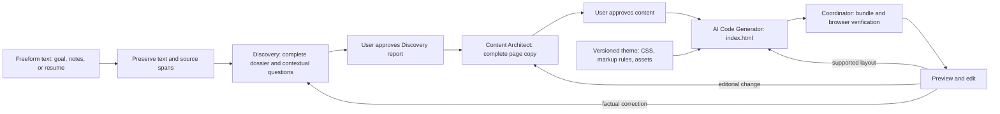

# Resume-to-portfolio architecture: research and review

> **Status:** research proposal, awaiting user review before implementation. This task updates Markdown only. Use [the active workflow](02-active-workflow.md) and the source registry for implemented behavior; the following target design does not change that behavior. D-114 is earlier proposal history; the refinements here keep provider, model, and hosting choices configuration-driven.

## The system in one view

Text equivalent: freeform text → complete Discovery dossier and user approval → finished Content Architect package and user approval → AI-written HTML → coordinator verification → preview. Changes return to the earliest stage that owns their meaning. Application code controls every handoff.

Each accepted change creates a revision and a candidate. A failed candidate never replaces the last verified page. The first planned slice takes typed or pasted text in one box; PDF/DOCX attachments follow later. The Code Generator model writes **one `index.html` per version** from the exact approved Content Architect output and a pinned theme contract. The coordinator attaches **one immutable, shared `styles.css`** plus assets and verifies the candidate. Users explicitly approve the Discovery report and finished Content Architect copy before HTML generation, then review the verified preview.

## Read in this order

| Document | What it settles |
| --- | --- |
| [Visual Architecture & Preview Flow](proposed-architecture-and-agent-generation-flow.md) | Visual Mermaid diagrams, Git branching, end-to-end agent generation, and split-screen live preview |
| [System and product journey](10-proposed-resume-portfolio-system.md) | User flow, stage ownership, target boundaries, supplied CSS audit, migration order |
| [Agent and artifact contracts](11-agent-and-artifact-contracts.md) | Exact handoffs, factual provenance, content depth, model packets and context budgets |
| [Generation and revision mechanics](12-generation-preview-revisions-and-operations.md) | HTML/CSS integration, persisted versions, preview verification, edit routing, recovery |
| [Agent operation playbook](13-agent-operation-playbook.md) | Each agent's detailed work, questions, complete writing process, worked correction example, and review criteria |
| [Discovery and Content Architect operating specification](14-discovery-and-content-authoring-spec.md) | Complete user-detail inventory, adaptive question policy, readable report, public-copy rules, approvals, and handoff examples |

Documents 10–14 are the canonical research proposal. Any separately maintained visual draft is supplementary; where it differs, use these numbered documents. Hosting migration, fixed model names, guaranteed factual accuracy, and guaranteed visual quality are not assumptions of this proposal.

The older [foundations](01-system-foundations-runtime-and-security.md), [active workflow](02-active-workflow.md), and [active UI/operations](03-product-ui-and-operations.md) describe the current repository. They are useful for reuse, but their endpoints and artifacts are not the target contract.

## Decisions an implementer must preserve

1. **The user's text is source material, not page copy.** Discovery preserves every substantive supplied detail with source spans and resolves relevant gaps; Content Architect writes every person-specific public sentence. Code Generator cannot rewrite approved copy to fit a layout.
2. **The approved content package is the editable source of the page.** The HTML is disposable derived output. Regenerate complete HTML whenever approved content, supported layout, theme, or asset binding changes; never patch old HTML as the only record of an edit.
3. **A theme is a contract, not just a CSS file.** Its selectors, allowed markup/classes, variants, fonts, images, and responsive fixtures are versioned together. AI-written HTML may only use the selected theme's supported structure. The supplied stylesheet is a visual seed and needs shared project/experience components and bundled fonts before general use.
4. **A ready preview is an exact checked bundle.** Browser verification opens the same serving path the user will open. Promotion changes the active pointer after required checks pass. Optional future export must contain those exact bytes.
5. **Revisions start at the owning artifact.** Fact change: dossier approval → content approval → new HTML. Editorial or section change: content approval → new HTML. Supported variant change: new HTML from unchanged approved content. A precise, fully mapped correction can use a deterministic content patch, but still requires review and a verified new version. Arbitrary style edits are deferred.
6. **Keep model context bounded and explicit.** Each operation receives only the records it needs. Count the assembled request, reserve output space, chunk oversized pasted text without dropping sections, and persist source IDs. The context window and prompt cache are not a substitute for a durable fact dossier.
7. **Keep model selection in configuration.** Every model operation uses the provider-neutral `ModelClient` and profiles in `config/models.toml`. Check profile capabilities at implementation time. This proposal does not require a new provider, transport, credential, or hosting service.
8. **Preservation and publication are different decisions.** Keep every substantive user detail and source occurrence internally. Record an explicit public disposition for every dossier fact/entity. Source references improve traceability; they cannot prove perfect interpretation.
9. **Repair has an owner and a budget.** Retry transient failures, correct specific invalid artifacts, and stop on shared theme defects. Never weaken checks or silently discard required content to make a candidate pass.

## Recommended implementation slices

This is a future implementation sequence for review. Execution starts after the user reviews this proposal and asks for implementation. Each slice should eventually produce an inspectable artifact and pass its gate.

| Slice | Build | Exit gate |
| --- | --- | --- |
| 1. Theme fixture | Import the supplied sample as a versioned theme seed; complete generic project, experience, credentials, and fallback markup examples; pin fonts/assets | Fixture portfolios with different content shapes render at mobile and desktop widths with no missing assets |
| 2. Contracts and text intake | Typed text source, dossier, content, generated HTML, theme, and site manifests; stable source spans | Every pasted detail can be traced to a fact or recorded disposition; unknown artifact versions fail clearly |
| 3. Agents and handoffs | Full dossier inputs; adaptive questions; complete writing, coverage, and factual checks; configured model capabilities | Sparse/rich/ambiguous inputs produce grounded, renderable content without lossy stage summaries |
| 4. Code Generator and verifier | AI-written HTML, exact approved-copy binding, immutable bundle, exact-path browser check | One approved package produces a verified preview with the pinned stylesheet |
| 5. Editor and repair loop | Versioned edits, ordered replay, cancellation, retries, restore, last-working-version behavior | Name, wording, section, and supported variant changes preserve earlier intent; stale jobs cannot promote |
| 6. Release integration | Two approval screens, UI progress/preview, persistent jobs and artifact storage, operational observability | Refresh/retry/restart preserves approvals and state; failing generation leaves the previous ready preview available |

**Scope priority:** complete the theme contract and generation/edit path using the existing durable job and storage boundaries. Deployment is separately maintained in `docs/deployment/`; this research requires no deployment migration.

## Known blockers from the current repository

- Discovery currently hands off a Markdown brief and limited profile; the target requires a source-linked dossier. Existing records cannot be relabelled as fully sourced dossiers.
- Content Architect currently plans routes and approval; the target needs one complete single-page public-copy package and different UI progression.
- The complete factual context must reach every writing/repair operation. A summary or an outline is not an adequate writing input, even when it fits a valid transport schema.
- The supplied CSS references font files that were not in the two reference files and does not yet define detailed reusable project/experience components. Simply inserting different resume words into the sample HTML cannot reliably meet the requested quality.
- The current application does not generate or serve finished portfolio previews. The AI HTML generator, exact-version preview, and revision storage are new target work.

For the handoff review, inspect [Discovery project normalization](../../src/oryxenai/agents/discovery/agent.py), [Content Architect's intake snapshot](../../src/oryxenai/agents/content_architect/service.py), and [its writing packet assembly](../../src/oryxenai/agents/content_architect/agent.py). The proposed change is to preserve the complete inventory and pass direct factual inputs to writing operations; prompt changes alone cannot fix a lossy packet.

## Research basis

The proposal draws on [pypdf extraction limits](https://pypdf.readthedocs.io/en/stable/user/extract-text.html), [OWASP upload guidance](https://cheatsheetseries.owasp.org/cheatsheets/File_Upload_Cheat_Sheet.html), [OWASP prompt injection guidance](https://cheatsheetseries.owasp.org/cheatsheets/LLM_Prompt_Injection_Prevention_Cheat_Sheet.html), [MDN iframe behavior](https://developer.mozilla.org/en-US/docs/Web/HTML/Reference/Elements/iframe), [CSP sandbox](https://developer.mozilla.org/en-US/docs/Web/HTTP/Reference/Headers/Content-Security-Policy/sandbox), [Playwright screenshot guidance](https://playwright.dev/docs/test-snapshots), and [accessibility testing limits](https://playwright.dev/docs/accessibility-testing). These sources describe tool behavior; the agent boundaries, contracts, and defaults are proposed project decisions.
