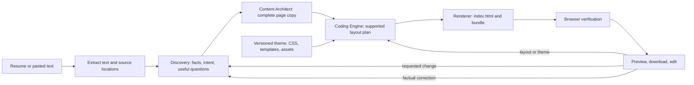

# Resume-to-portfolio architecture: implementation guide

> **Status:** proposed replacement workflow. These documents are an implementation specification, not a description of a running portfolio generator. The active application still ends after Content Architect approval; see [the current workflow](02-active-workflow.md). D-114 records the target decision, while D-113 describes the current boundary.

## The system in one view

The factual-correction arrow passes through a new Discovery dossier before Content Architect. A user may edit repeatedly; each accepted change creates a revision and a new candidate. A failed candidate never replaces the last verified page. The first release generates **one `index.html` per version** and copies **one immutable, prebuilt `styles.css`** plus its assets. The Coding Engine plans within the theme's published components; a deterministic renderer writes the HTML. Future photo, additional themes, custom CSS, and JavaScript have explicit extension points.

## Read in this order

| Document | What it settles |
| --- | --- |
| [System and product journey](10-proposed-resume-portfolio-system.md) | User flow, stage ownership, target boundaries, supplied CSS audit, migration order |
| [Agent and artifact contracts](11-agent-and-artifact-contracts.md) | Exact handoffs, factual provenance, content depth, model packets and context budgets |
| [Generation and revision mechanics](12-generation-preview-revisions-and-operations.md) | HTML/CSS integration, persisted versions, preview verification, edit routing, recovery |

The older [foundations](01-system-foundations-runtime-and-security.md), [active workflow](02-active-workflow.md), and [active UI/operations](03-product-ui-and-operations.md) describe the current repository. They are useful for reuse, but their endpoints and artifacts are not the target contract.

## Decisions an implementer must preserve

1. **A resume is source material, not page copy.** Extraction yields cited text; Discovery resolves facts and relevant gaps; Content Architect writes every person-specific public sentence. The Coding Engine cannot rewrite a fact to fit a layout.
2. **The content package is the editable source of the page.** The HTML is disposable derived output. Rebuild the complete HTML whenever accepted content, render plan, theme, or asset binding changes; never patch old HTML as the only record of an edit.
3. **A theme is a contract, not just a CSS file.** Its selectors, HTML templates, allowed variants, fonts, images, and responsive fixtures are versioned together. HTML may only use the selected theme's supported structure. The supplied stylesheet is a visual seed and needs shared project/experience components and bundled fonts before general use.
4. **A ready preview is an exact checked bundle.** Browser verification opens the same versioned URL the user will open. The downloadable ZIP contains the same HTML/CSS/asset bytes. Promotion changes one database pointer after all required checks pass.
5. **Revisions start at the owning artifact.** Fact change: dossier → content → render. Editorial change: content → render. Layout/theme change: render. A precise, fully mapped field correction can use a deterministic patch, but it still produces and verifies a new version.
6. **Keep model context bounded and explicit.** Each operation receives only the records it needs. Count the assembled request, reserve output space, chunk oversized resumes without dropping sections, and persist source IDs. The context window and prompt cache are not a substitute for a durable fact dossier.
7. **Use one configured model for model-backed work.** The operator chose OpenAI `gpt-6-luna`. Agent code resolves a profile from `config/models.toml`; deterministic extraction, rendering, and verification do not call a model. The current runtime rejects `openai_responses` in `src/oryxenai/agents/shared/model_runtime.py`, so a compatible transport and typed-output path is a prerequisite, not a configuration-only change.

## Recommended implementation slices

Each slice should end with a working, inspectable artifact and the stated gate. This order keeps the first end-to-end page small and makes failures attributable.

| Slice | Build | Exit gate |
| --- | --- | --- |
| 1. Theme fixture | Import the supplied sample as a versioned theme seed; complete generic project, experience, credentials, and fallback visual templates; pin fonts/assets | Fixture portfolios with different content shapes render at mobile and desktop widths with no missing assets |
| 2. Contracts and extraction | Typed source, dossier, content, plan, theme, and site manifests; source-span extraction and readable-text fallback | A PDF/DOCX/paste source can be traced to a fact; unknown artifact versions fail clearly |
| 3. Model transport and agents | Direct OpenAI Responses support and configured profile; Discovery questions/dossier; Content Architect complete one-page package | Representative sparse/rich/ambiguous inputs produce grounded, renderable content without manual HTML edits |
| 4. Renderer and verifier | Plan selection, deterministic HTML, immutable bundle, exact-URL browser check | One accepted content package produces a verified preview and an identical export |
| 5. Editor loop | Versioned edit requests, ownership routing, supersession, retry, last-good behavior | A name correction, wording change, section change, and theme change each affect only necessary stages; stale jobs cannot replace a newer version |
| 6. Release integration | UI progress/preview, persistent jobs and artifact storage, operational observability | Refresh/retry/restart preserves state; failing generation leaves the previous ready preview available |

**Scope priority:** make the theme/component contract and one complete generation/edit path work before changing hosting. Deployment choices in the system document are a later operational decision; no Azure or production change is part of this proposal.

## Known blockers from the current repository

- Discovery currently hands off a Markdown brief and limited profile; the target requires a source-linked dossier. Existing records cannot be relabelled as fully sourced dossiers.
- Content Architect currently plans routes and approval; the target needs one complete single-page public-copy package and different UI progression.
- `openai_responses` is explicitly rejected by the current model runtime. The requested model must be exercised through a real supported transport with strict output handling before the agent workflow is called complete.
- The supplied CSS references font files that were not in the two reference files and does not yet define detailed reusable project/experience components. Simply inserting different resume words into the sample HTML cannot reliably meet the requested quality.
- The current application does not generate or serve finished portfolio previews. The site renderer, exact-version preview, and revision storage are new target work.

## Research basis

The token policy follows [OpenAI's input token counting guide](https://developers.openai.com/api/docs/guides/token-counting) and [Structured Outputs guide](https://developers.openai.com/api/docs/guides/structured-outputs). Preview checks use [Playwright's auto-retrying assertions](https://playwright.dev/docs/test-assertions) and its caution about [environment-sensitive screenshots](https://playwright.dev/docs/test-snapshots). The separate preview document and iframe behavior follow the [MDN iframe reference](https://developer.mozilla.org/en-US/docs/Web/HTML/Reference/Elements/iframe). These sources establish tool behavior; the stage boundaries and release gates above are project design decisions.
