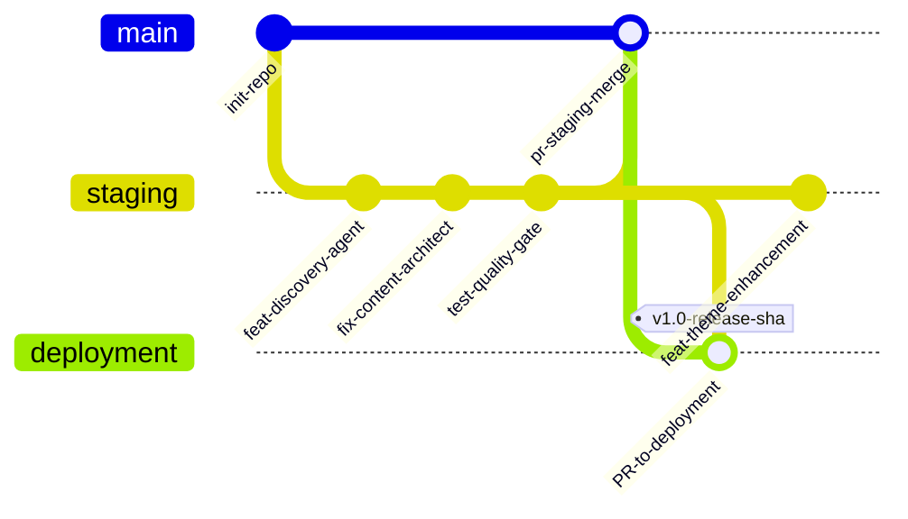
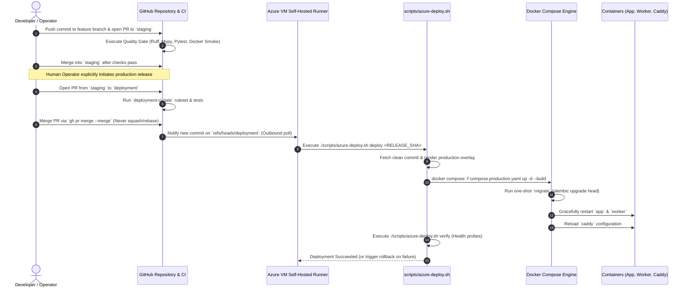
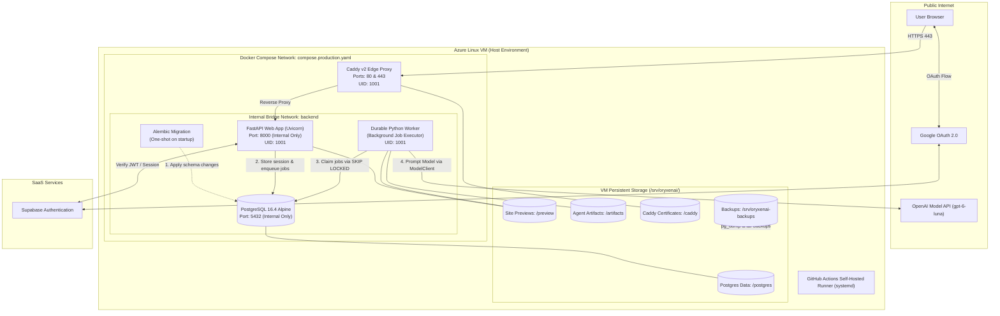
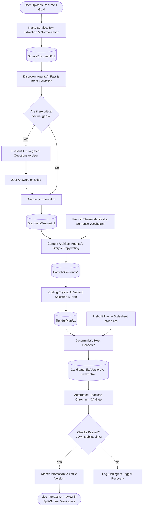
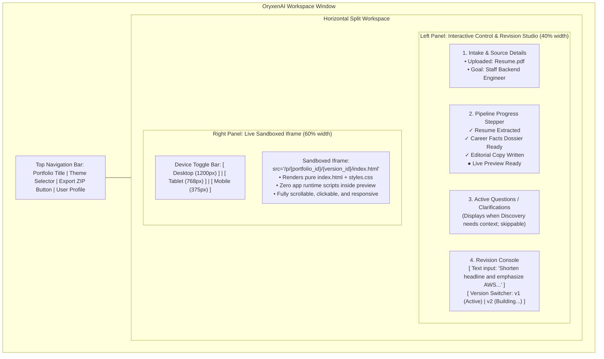
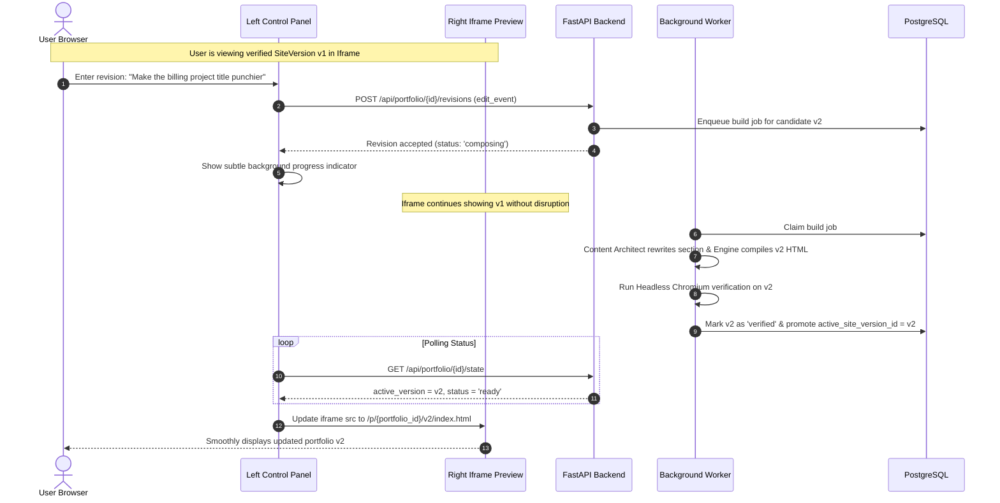
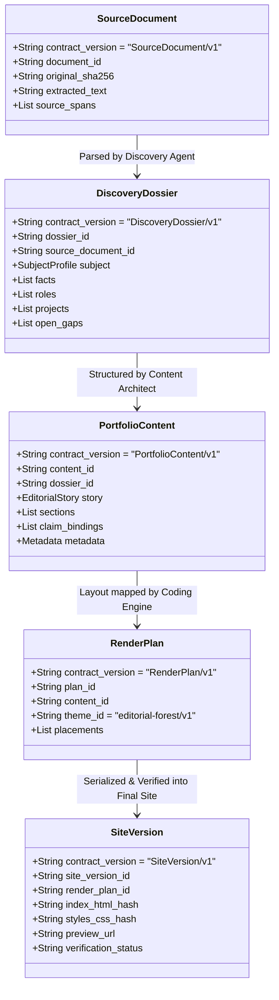

# OryxenAI: Proposed Architecture, Git Workflow, Agent Generation Pipeline, and Live Preview

> **Document Type:** Visual Architecture, Workflow Specification & Mermaid Reference Guide  
> **Target Audience:** Developers, System Architects, and Operators  
> **Status:** Architecture Reference & Visual Blueprint for Resume-to-Portfolio Generation  
> **Companion Documents:** [Architecture Overview](10-proposed-resume-portfolio-system.md) · [Agent & Artifact Contracts](11-agent-and-artifact-contracts.md) · [Generation & Operations Design](12-generation-preview-revisions-and-operations.md)

---

## 1. Executive Summary & Architecture Map

OryxenAI transforms an uploaded resume into a verified, publication-grade portfolio website through an orchestrated sequence of **specialized AI agents** and **deterministic software services**.

The system is strictly divided into clear boundaries:
1. **Git Branch & CI/CD Layer:** A two-tier branch model (`staging` for development, protected `deployment` for production) with an Azure VM self-hosted runner and automated quality checks.
2. **Infrastructure Layer:** A lightweight, single-VM Docker Compose stack featuring Caddy (edge reverse proxy and automatic HTTPS), FastAPI (API & product shell), a durable background worker, PostgreSQL 16, and VM-local persistent storage.
3. **Agent Generation Pipeline:**
   - **Intake Service (Deterministic):** Extracts text, preserves layout hierarchy, and creates source spans.
   - **Discovery Agent (AI):** Parses career facts, identifies ambiguities, and conducts a 1–3 question interview only when necessary.
   - **Content Architect Agent (AI):** Shapes the editorial narrative, selects sections, and writes every sentence of public copy (linked to verified facts).
   - **Coding Engine (Hybrid AI + Deterministic):** Selects component variants from a prebuilt theme catalogue (`RenderPlan/v1`) and compiles pristine semantic `index.html` referencing pre-verified `styles.css`.
4. **Verification & Live Preview Layer:** Automated headless Chromium checks validate DOM and mobile responsiveness before atomically serving the portfolio in a split-screen, sandboxed iframe.

---

## 2. Git Branching, Release Gate & CI/CD Architecture

The release workflow guarantees that code deployed to the Azure VM is clean, reviewed, and fully verified. Direct pushes to the production branch are prohibited by GitHub repository rulesets.

### 2.1 Branch Topology & Promotion Flow



### 2.2 End-to-End CI/CD Pipeline to the Azure VM

The Azure VM runs a GitHub Actions self-hosted runner as a `systemd` daemon. It polls GitHub via **outbound HTTPS**, which eliminates the need to expose inbound SSH ports to the public internet or GitHub IP ranges.



---

## 3. High-Level System Infrastructure & Container Topology

All application components run inside a single Azure Ubuntu VM orchestrated via Docker Compose. No external managed database, Redis, or Kubernetes is required.



---

## 4. End-to-End Agent Generation Pipeline

When a user submits their resume, the orchestrator advances through a sequential pipeline of deterministic extractors and AI agents.



---

## 5. Agent Responsibilities, Contracts & Execution Details

| Stage | Type | Primary Responsibility | Input Contract | Output Contract | Model / Engine |
| :--- | :--- | :--- | :--- | :--- | :--- |
| **1. Intake** | Deterministic | Extracts plain text from PDF/DOCX/TXT; preserves headings, bullets, and line numbers; indexes source spans. | Binary file or pasted text + user goal | `SourceDocument/v1` | Python `pypdf` / `docx` |
| **2. Discovery** | AI Agent | Extracts verified career facts, roles, projects, metrics, and individual vs. team ownership. Asks 1–3 focused, skippable questions if key context is ambiguous. | `SourceDocument/v1` + user intent | `DiscoveryDossier/v1` | OpenAI `gpt-6-luna` via `ModelClient` |
| **3. Content Architect** | AI Agent | Directs editorial positioning; decides section sequence; writes 100% of visible public copy (no placeholders or "TODOs"); binds each statement to dossier fact IDs. | `DiscoveryDossier/v1` + Theme vocabulary | `PortfolioContent/v1` | OpenAI `gpt-6-luna` via `ModelClient` |
| **4. Coding Engine** | Hybrid (AI + Host) | **AI:** Selects supported theme component variants and asset slots (`RenderPlan/v1`).<br/>**Host:** Compiles semantic `index.html` referencing prebuilt `styles.css`. | `PortfolioContent/v1` + `ThemeManifest/v1` | `RenderPlan/v1` & `SiteVersion/v1` | AI Plan + Deterministic HTML Serializer |
| **5. Verification Gate** | Deterministic | Headless Chromium renders page at 320px, 768px, and 1200px viewports; checks for console errors, text overflow, and dead links. | `SiteVersion/v1` files | `VerificationReceipt/v1` | Headless Chromium (Playwright/Puppeteer) |

---

## 6. How the Live Preview is Displayed (UI & Workspace Architecture)

The frontend features a **split-screen desktop layout** separating interactive controls from the live preview frame.

### 6.1 Frontend Screen Structure



### 6.2 Atomic Version Promotion & Zero-Flicker Revisions

When the user requests an edit in the left console:
1. The currently approved portfolio (`v1`) **remains visible and interactive** in the iframe.
2. The server spins up a background worker job to build `v2` (routing the edit to Discovery, Content Architect, or Coding Engine as required).
3. The new candidate `v2` undergoes automated headless browser verification in isolation.
4. Only upon passing all checks does the server update `active_site_version_id` in PostgreSQL.
5. The frontend receives the revision event via polling and updates the iframe source to `v2` without screen flash or broken intermediary states.



---

## 7. Artifact Contract Chain & Data Traceability

Every piece of text displayed on the final portfolio traces directly back through immutable artifacts to the original uploaded resume.



### Claim Binding Guarantee:
In `PortfolioContent/v1`, every factual claim carries a direct reference to a verified fact ID:
```json
{
  "field_path": "sections[billing-work].copy.outcome",
  "text": "The team achieved a 25% reduction in billing queue latency.",
  "fact_ids": ["fact-17"]
}
```
This guarantees that the AI cannot invent metrics, hallucinate credentials, or misattribute team achievements to an individual.

---

## 8. Summary of Architectural Decisions

1. **AI Where Judgment is Required:** Discovery and Content Architect are full AI agents utilizing `gpt-6-luna` for reading comprehension, factual deduction, and editorial writing.
2. **Determinism Where Safety is Required:** Code generation does **not** rely on raw LLM CSS creation. Instead, the AI selects component placements from a prebuilt, responsive theme catalogue (`editorial-forest/v1`), and a deterministic host compiler writes the HTML.
3. **No Downtime / Zero-Flicker Preview:** The preview is sandboxed in an iframe. Generating or revising a portfolio never destroys or blanks the current active version until the new revision passes headless browser checks.
4. **Single-VM Production Simplicity:** The system avoids unnecessary infrastructure bloat (no Kubernetes, Redis, or managed database clusters), operating reliably on a single Azure Linux VM managed via Docker Compose and an automated self-hosted GitHub Actions runner.
