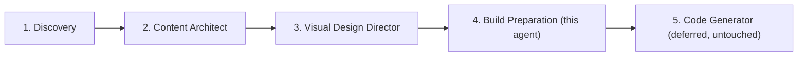
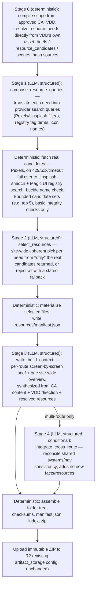
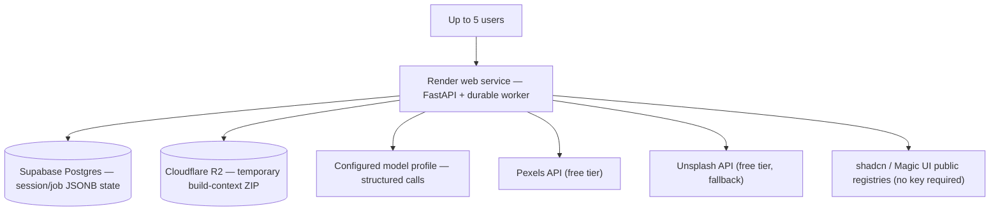

# Build Preparation Agent — Proposal

> Status: implemented. Supersedes
> `docs/portfolio-production-compiler-proposal.md` and the retired
> `src/oryxenai/build_preparation/` module — its source has already been
> deleted from the working tree; see §16 "Step 0" for the dangling
> references that deletion left behind, which must be cleaned up before
> anything else here can be built or verified. See `DECISIONS.md` for the
> formal record.
>
> **Later boundary update:** D-015 now defines Code Generator as a progressive,
> text-only stage with controlled supplemental resource acquisition. References
> below to Code Generator being deferred, untouched, or not receiving registry
> fetching describe this proposal's original Build Preparation scope, not the
> later Code Generator contract. Build Preparation still performs its own
> planned acquisition; Code Generator's supplemental path does not move or
> remove that implemented responsibility.

## 1. Decision in one paragraph

Build Preparation becomes agent #4 in the pipeline — a real agent living at
`src/oryxenai/agents/build_preparation/`, built from zero and mirroring the
same schema/state/service/job/API pattern Content Architect and Visual
Design Director already use (`DECISIONS.md` D-008). It consumes only
approved Content Architect and Visual Design Director state — never raw
Discovery documents, never upstream reasoning. Its job is to hand the future
Code Generator two things: every resource it will plausibly need, already
fetched and verified (images, icons, component source), and a comprehensive,
non-restrictive, screen-by-screen build context explaining what to build and
why. The result is packaged into one immutable, hash-verified ZIP in
Cloudflare R2 — the storage contract is unchanged — but the internal shape
is far leaner, and the pipeline is built as a proper agent instead of a
free-standing compiler module.

## 2. Position in the pipeline



Each arrow is an explicit, caller-initiated transition, same as today — no
auto-chaining. Code Generator's own design is out of scope here; this
proposal only fixes the contract it will eventually read.

## 3. Why the previous design needed simplifying

The retired design (`docs/portfolio-production-compiler-proposal.md`,
`DECISIONS.md` D-010) was implemented as
`src/oryxenai/build_preparation/`: 5,228 lines of implementation plus 1,457
lines of tests — about 2.2x the size of Visual Design Director, for a stage
with no creative/subjective content to reason about. It is real, working
code (genuine Pexels and shadcn HTTP calls, genuine R2 upload/verify), not a
stub. The reported symptom — "not fetching images, output is completely
empty" — traced to design choices rather than a broken call: the fixture
test harness defaults to skipping every live provider call unless a caller
explicitly opts in, and the one checked-in sample Visual Design output has a
single asset brief classified as a custom diagram rather than a photo, so a
default test run never had a live photo request to make in the first place.
Nothing was actually broken; the design just made the working path very easy
to miss.

| Concern | Retired design | This proposal |
| --- | --- | --- |
| Bundle sections | 9 (blueprint, manifest, context, creative-character, visual-specifications, route packets, site-data, provenance x2) | 5 (manifest, overview, routes/, resources/, provenance) |
| Images | Per-asset 3-width Pillow rendition matrix | One verified rendition per asset; responsive sizing left to CSS (`object-fit`, `aspect-ratio`), already supported by the fixed target |
| Components | Full static import/export admission parsing at prep time | Hash + size + extension allowlist + dependency-vs-lockfile check only; Code Generator already runs its own build/typecheck downstream, so re-parsing imports here duplicated work |
| Photo providers | Pexels only | Pexels primary, **Unsplash fallback** (new — a free key is already available), explicit failover and backoff (§8) |
| Where architecture lives | Free-standing module outside `agents/`, no `AgentKey` entry | Full agent under `agents/`, `AgentKey.BUILD_PREPARATION` added |
| Model calls | 2 always-on + 1 conditional, largely re-deriving/re-confirming needs Visual Design Director had already produced as structured fields | 3 always-on + 1 conditional, redirected toward translating those needs into provider queries and — new — synthesizing the human/LLM-readable screen-by-screen build brief itself |

The call count doesn't drop much, because the previous design was not
over-using the model — it was under-using it for the one thing that
actually needed language synthesis (the build brief) while over-building
deterministic machinery around images and components that a downstream
typecheck/build step already re-verifies anyway. This proposal moves the
model budget to where it earns its keep and cuts the deterministic
machinery around it.

## 4. Agent skeleton

Mirrors the confirmed shared pattern from Content Architect and Visual
Design Director:

| File | Role |
| --- | --- |
| `__init__.py` | Re-export |
| `schemas.py` | Envelope + persisted-state Pydantic models, `extra="forbid"` |
| `state.py` | Status machine (§5) |
| `agent.py` | Orchestration; staged calls via a shared `_call_stage` helper, same shape as Visual Design Director's `agent.py` |
| `prompt_builder.py` | Loads `prompts/*.md` + JSON schema, assembles system/task prompt |
| `service.py` | `start`/`regenerate`; staleness hash pair (a narrow hash of Visual Design Director's own approval hash, plus a broad projection hash of every field this agent actually consumes — mirroring Visual Design Director's own two-hash check against Content Architect) |
| `validators.py` | Per-stage output validation; hard-rejects any resource ID not present in the candidate set Stage 1 actually fetched — same principle as Visual Design Director's catalogue-shortlist enforcement |
| `providers.py` | Pexels / Unsplash / shadcn / Magic UI / Lucide clients — plain importable async functions (§7) |
| `prompts/system.md` + one file per operation | Trusted instructions per stage |
| `samples/*.json` | Golden test fixtures |
| `README.md` | Agent-specific docs, route table |

No `resource_catalogue.py`/`resources/catalogue.json` equivalent — unlike
Visual Design Director, this agent's candidates are always live-fetched;
there's no local curated catalogue to look up first.

Wiring, matching the existing convention exactly:

- Job handler: `jobs/handlers/build_preparation.py`, job kind
  `build_preparation.prepare` (name reused — it's already anchored in
  `config/app.toml` and `config/models.toml`), registered in
  `jobs/registry.py`.
- API routes: `api/routes/build_preparation.py`, route table in §5.
- Persistence: JSONB on `portfolio_sessions.current_state["build_preparation"]`
  — no dedicated table, same as the other three agents.
- `agents/shared/contracts.py`: add `AgentKey.BUILD_PREPARATION = "build_preparation"`.

Resource and asset IDs used as directory names or object-storage keys
(`<asset-id>`, `<component-id>` throughout §9) are stable, sanitized, opaque
identifiers derived deterministically from upstream IDs and content hashes —
never a raw model-generated display slug or filename. Nothing user- or
model-authored is trusted directly as a filesystem or object-storage path.

## 5. State machine and API

```
NOT_STARTED → RUNNING → READY (terminal)
                  ↑           |
                  └── NEEDS_ATTENTION (failure sink)
```

Deliberately smaller than the other three agents' 5-status pattern: there is
no approval-gated review state and no `/revise`. This stage compiles
already-approved facts — there is no new subjective content for a human to
sign off on, the same reasoning the retired design already established
("visible status and review, not a new mandatory approval gate").

| Method | Path | Purpose |
| --- | --- | --- |
| GET | `/sessions/{id}/build-preparation` | Current state |
| POST | `/sessions/{id}/build-preparation/start` | Requires Content Architect **and** Visual Design Director both `approved` |
| POST | `/sessions/{id}/build-preparation/regenerate` | Re-run from current approved upstream — replaces "revise"; there's no natural-language back-and-forth at this stage, just retry-on-stale-or-unsatisfactory |

## 6. Internal pipeline



Every LLM stage stays **structured** — JSON-schema-validated output, the
same `generate_structured` plus `validators.py` hard-rejection pattern the
other three agents already use. The model is used liberally wherever it
adds real synthesis value (translating semantic intent into provider
queries, choosing coherently among real candidates, writing the build
brief), but it can never invent a resource ID outside what the
deterministic fetch step actually returned, and it never performs
mechanical validation (dangling references, hash checks) that plain code
already handles better.

### Why Stage 0 doesn't need the model

Visual Design Director's own output already carries structured
`asset_briefs` (purpose, source_status, source_policy, importance,
orientation, focal point) and `resource_candidates` (category, why it
matches) per page and scene — see
`agents/visual_design_director/schemas.py`. This agent's job is not to
re-decide what's needed; it's to act on what's already been decided
upstream. Re-deriving needs via a fresh model call, as the retired design
did, was redundant work against data that already existed.

### Implemented execution order differs from the diagram above

The diagram places deterministic materialization ("write
resources/manifest.json") between Stage 2 and Stage 3. The actual
implementation (`agents/build_preparation/agent.py`) runs Stage 3 and the
conditional Stage 4 immediately after Stage 2's validation, and only
materializes and packages once, after Stage 4. This is intentional, not a
bug: each route's `brief.md` is sourced from Stage 3/4's own output, so
materialization has to follow context-writing rather than precede it —
Stage 3/4 only ever need Stage 2's selection *metadata* (which resource ID
was picked per need), never pixel bytes or a written file tree. The
diagram is kept above as the conceptual stage sequence (what depends on
what); treat this paragraph, not the diagram's left-to-right ordering, as
authoritative for *when* the deterministic materialize/package step
actually runs.

## 7. Provider module — reusable, not a microservice

`providers.py` exposes plain async functions —
`search_photos()`, `fetch_component()`, `resolve_icon()` — with no HTTP
server of its own, following the same "explicit Python, no framework"
precedent as `DECISIONS.md` D-001. This keeps the door open for a future
Code Generator to import the same functions directly for on-demand fetching
without redesigning provider access from scratch, without reintroducing the
separate resource microservice that D-010 explicitly rejected. Nothing
about this proposal requires that reuse today — Code Generator's own design
remains untouched and deferred — but the module boundary is drawn so that
option stays open at zero extra cost now.

## 8. Photo providers: fallback, licensing, and free-tier limits

Pexels is primary. On an HTTP 429, a 5xx response, or a timeout, the client
fails over to Unsplash. If both fail, the asset simply gets no photo —
Stage 2 selection falls back to the typography/custom-visual option Visual
Design Director's own `AssetBrief` already carries for exactly this case.
Rate-limit handling is reactive only: read the provider's actual response
headers/status (429, `X-Ratelimit-*` where present) at call time, back off,
fail over. No hardcoded quota numbers in code or docs and no proactive
quota bookkeeping — free-tier limits are policy the provider controls, not
a fact to freeze here, and bookkeeping ahead of time is unnecessary
complexity at a scale of up to five users.

Pexels and Unsplash carry different license obligations and are **not**
handled identically:

- **Pexels** — its license permits downloading, rehosting, and modifying
  images with no attribution requirement. The pipeline downloads the
  bytes, verifies them, and packages a local rendition as described
  elsewhere in this document.
- **Unsplash** — its API guidelines require hotlinking (not rehosting),
  visible attribution with UTM-tagged links to the photographer and
  Unsplash, and a mandatory "trigger download" tracking request fired at
  the moment a photo is actually selected for use. Unsplash bytes are
  therefore **never downloaded or cached** by this pipeline: the
  `ResourceCard` for an Unsplash pick stores the approved hotlink URL,
  photographer/attribution metadata, and the download-tracking URL only,
  and the tracking request fires once, at selection time.

Environment variables:

- `PEXELS_API_KEY` — existing, already set.
- `UNSPLASH_ACCESS_KEY` — new; wire into `config/app.toml`
  `[resource_providers]` and document in `.env.example`. A key already
  exists in `.env` but is currently unused by any code path.

## 9. Folder and bundle strategy

```text
build-context/
  manifest.json                 # pack version, source hashes, file list+hashes, expiry
  overview.md                   # site-wide: what/why/who, narrative thesis,
                                 # visual language summary, fixed facts vs.
                                 # freedoms (§10), runtime API requirements
  target/
    package.json
    package-lock.json
    target-contract.json        # fixed dependency allowlist, forbidden capabilities
  routes/
    home/
      brief.md                  # screen-by-screen: purpose, sections, content
                                 # refs, interactions, motion, responsive
                                 # behavior, resources available + suggested
                                 # use, APIs needed, acceptance criteria,
                                 # explicit "free to change" notes
      data.json                 # scoped copy of approved public content
      resources.json             # resource IDs relevant to this route
    project-<slug>/              # only when Content Architect approved one
      ...same shape...
  resources/
    manifest.json                 # one ResourceCard per selected resource:
                                   # id, kind, provider, local path, why
                                   # selected, license/attribution, fallback,
                                   # dependencies
    images/<asset-id>.<ext>
    images/<asset-id>.json        # alt text, focal point, attribution, source,
                                   # inspection_level (see below)
    icons/icons.json              # Lucide import names + any brand-icon subset
    components/<provider>/<component-id>/*.tsx,*.css
  provenance/
    checksums.json
    licenses.json
```

Still one atomic ZIP uploaded to R2 — the same rationale as `DECISIONS.md`
D-009 (single upload/hash/expiry/retry, no partial-directory issue, easy
local extraction). Only the internal shape changes.

Every image's metadata records an `inspection_level`: `pixel_inspected`
when the pipeline actually downloaded and verified the bytes (Pexels), or
`metadata_only` when only provider-supplied metadata was available
(Unsplash hotlinks, never downloaded — see §8). The pack never claims a
stronger inspection guarantee than what actually happened.

## 10. The boundary: fixed facts vs. Code Generator's freedom

**Must preserve:** approved facts and copy; privacy and
must-not-fabricate rules; approved routes, links, and required content;
accessibility requirements; the fixed target/dependency environment;
local-only prepared assets — no leaked provider secrets.

**Free to decide:** DOM and component structure; exact layout and
Tailwind classes; whether a prefetched resource is used as-is, adapted,
combined, or ignored entirely; the implementation technique for custom
visuals (CSS, SVG, Canvas, Motion); animation and micro-interaction
detail; precise design-token values within the approved visual character;
folder/module organization within the target contract.

This is the direct answer to "do not restrict or limit the code
generator": everything in `resources/` and `routes/*/brief.md` is offered
as verified, traceable ingredients and intent — never a template Code
Generator is required to follow.

## 11. Deployment / environment



No new services versus the current deployment — same Render + Supabase +
R2 shape already in place, with one new outbound dependency (Unsplash,
already keyed in `.env`). The model profile, provider, and base URL remain
resolved from `config/models.toml`, never hardcoded in agent code.

## 12. Edge cases

| Situation | Behavior |
| --- | --- |
| No suitable photo from either provider | Fall back to the asset's typography/custom-visual option; never fabricate |
| Registry (shadcn/Magic UI) unavailable | Skip that candidate source; proceed with what's available |
| Component dependency unsupported by target | Reject during selection; give Code Generator the implementation intent instead |
| No component or photo candidate at all | Detailed intent/fallback only — never a fake ID or file path |
| Icon name not resolvable in Lucide | Skip and flag a warning; never invent an icon name |
| Thin, single-route content | Produce a strong single route; do not fabricate extra pages |
| Rich, multi-route approved content | Add proper routes; run the conditional cross-route integration stage |
| Private or pending content | Excluded from every prepared file |
| Pack expired | Regenerate from current approved upstream state |
| Content Architect or Visual Design Director changed after pack was built | Mark stale via the staleness hash pair; reject reuse |
| Render process restarts mid-job | Durable Postgres job is reclaimed and retried |
| R2 hash mismatch on verify | Reject and regenerate |

Each case follows the same principle already established and kept from the
retired design: never fabricate, degrade to an explicit fallback or
warning, never block the whole run over one missing piece.

## 13. Migration and retirement notes

`src/oryxenai/build_preparation/` — the module itself — has already been
deleted from the working tree, ahead of this agent existing. What's left
to retire is everything that still points at the now-gone module: its API
routes, job handler registration, dependency wiring, orphaned frontend
files, and its test suite. See §16 "Step 0" for the exact list — that
cleanup is a required prerequisite for Phase 1, not an optional
end-of-project step. No backwards-compatibility shim, consistent with this
repo's stated aversion to compatibility hacks; this is a pre-launch
project with no external consumers of the old routes.

## 14. What this proposal deliberately does not change

- Code Generator remains a deferred, untouched stub.
- The deployment target (Render + Supabase + R2) is unchanged.
- The fixed React/Vite/TypeScript/Tailwind target contract's dependency
  allowlist is unchanged.
- No AI-generated image fallback is introduced — photography stays limited
  to verified stock sources (Pexels, Unsplash) or an honest
  typography/custom-visual fallback.

## 15. Local development debug mirror (temporary)

After the immutable ZIP is built, uploaded to R2, and hash-verified, also
extract that same verified bundle — unzipped — into a timestamped folder
under `output/` (already `.gitignore`d). Purpose: catch "we sent an empty
pack to R2" immediately by looking at a folder, instead of downloading and
unzipping from R2 to check. This is a fresh implementation for this agent —
`src/oryxenai/build_preparation/` (the retired module this idea was
originally noticed in) has been deleted outright rather than kept around as
a reference, so nothing here should import from or be adapted out of it.

- Dev-only: gated by a config toggle scoped to this agent (on locally, off
  in `config/app.docker.toml`). Render's disk is small and ephemeral; a
  real deployment has no reason to write a debug tree per session.
- No new API endpoint, no frontend surface, no change to the R2/ZIP
  storage contract — a side effect that only runs after the real upload
  already succeeded and verified.
- Explicitly temporary: this section and the code path behind it should be
  removed once the pipeline is confirmed reliable in normal operation.

This also settles the storage-shape question raised in review: the
individual-object "portal" rewrite proposed in
`prebuild-output/build-preparation-agent-review.md` is **not** adopted.
The actual need behind it — being able to see what a run produced without
a download/unzip round-trip — is fully met by this local mirror. The ZIP
stays the single R2 artifact; `DECISIONS.md` D-009 stands.

## 16. Implementation phasing for the next planning pass

This document is the design. A separate implementer turns it into an
implementation plan and code — this proposal's author does not implement
it. Follow this process:

0. **Required first step, before any Phase 1 planning starts.** The
   working tree is currently broken: `src/oryxenai/build_preparation/` has
   already been deleted, but these files still import or register against
   it, and nothing in this repo can be verified until they're cleaned up:
   - `src/oryxenai/api/routes/build_preparation.py` — delete (imports the
     gone module directly).
   - `src/oryxenai/api/routes/__init__.py` — remove the `build_preparation`
     import and its two `router.include_router(...)` calls.
   - `src/oryxenai/api/dependencies.py` — remove
     `get_build_preparation_service` and its import of
     `BuildPreparationService`.
   - `src/oryxenai/jobs/handlers/build_preparation.py` — delete.
   - `src/oryxenai/jobs/registry.py` — remove
     `_register_build_preparation_handlers()` and its call site.
   - `src/oryxenai/web/routes.py` — remove the `/build-preparation-fixture`
     HTML route (its backend is gone).
   - `src/oryxenai/web/templates/build_preparation_fixture.html` and
     `src/oryxenai/web/static/build-preparation-fixture.{js,css}` — delete
     (orphaned frontend; §17 replaces this with a fresh harness later).
   - `tests/unit/build_preparation/` — delete (tests the deleted module).
   - Confirmed directly: `uv run pytest --collect-only` currently fails
     with 16 collection errors, including unrelated Discovery/Content
     Architect/Visual Design Director/worker tests, because they
     transitively import `oryxenai.jobs.worker` → `jobs.registry` → the
     dead handler. Fixing the items above should restore clean collection
     across the whole suite, not just for this agent — confirm with
     `uv run pytest --collect-only` before moving on to Phase 1.
   - Leave alone: `config/app.toml`'s `[build_preparation]` block,
     `config/models.toml`'s `[profiles.build_preparation]` block, and
     `BuildPreparationConfig` in `core/settings.py`. These are plain
     config/settings, not imports of the deleted package, so they don't
     break anything — and this agent deliberately reuses the same config
     keys and job kind name (§4), so keep and extend them rather than
     recreating from scratch.
1. Split the remaining work into exactly the three phases below. Do not
   reorder or merge them — each phase depends on the previous phase's
   output existing and working.
2. Per phase: write a short plan for that phase only, implement it, then
   verify it (see each phase's "Verify" list) before writing the next
   phase's plan. Do not front-load detailed plans for phases 2 and 3.
3. Before starting, read `DECISIONS.md` (D-008 through D-011) and
   `AGENTS.md`'s config-driven policy and multi-agent collaboration
   protocol, and follow them, including logging finished phases to
   `CHANGES.md` and any real decisions to `DECISIONS.md`.
4. Do **not** implement anything from
   `prebuild-output/build-preparation-agent-review.md` that this document
   overrides: no ZIP-to-individual-R2-objects rewrite, no pushing
   component-registry fetching onto Code Generator, no new user-media
   upload subsystem, no necessity/enforcement 3x3 matrix, no
   multi-input staleness fingerprint list beyond the two-hash pattern in
   §4. These were evaluated against this repo's decisions and the
   project owner's own brief and explicitly rejected — see §3 and this
   section's context.
5. Every LLM stage (§6 Stages 1–4) must be exercised with at least one
   real, live model call before its phase counts as verified — automated
   `MockModelClient` golden-fixture tests alone are not enough.
   `config/models.toml` already has a working `[profiles.build_preparation]`
   entry (`provider = "openai"`, `api_key_env = "OPENAI_API_KEY"`), and
   `OPENAI_API_KEY` is already set in `.env` — no new credentials or setup
   required. This repo's normal test convention (fixtures by default, live
   calls opt-in) still governs the automated suite; this is a manual/
   functional check per phase, confirming the agent genuinely works
   against the real API — the original reported failure ("not fetching
   images, output completely empty," §3) was missed for a long time
   precisely because nobody had to look at a real run to call the old
   module "done."

### Phase 1 — Skeleton, state machine, deterministic Stage 0

**Build:** `src/oryxenai/agents/build_preparation/` package
(`__init__.py`, `schemas.py`, `state.py`, `validators.py`, `README.md`);
`AgentKey.BUILD_PREPARATION` in `agents/shared/contracts.py`; state
machine (§5); `service.py` (`start` requiring CA+VDD both `approved`,
staleness hash pair, `regenerate`); API routes (§5); job handler
(`jobs/handlers/build_preparation.py`, kind `build_preparation.prepare`)
registered in `jobs/registry.py`; JSONB persistence under
`portfolio_sessions.current_state["build_preparation"]`; Stage 0 fully
implemented (deterministic scope compile, resource needs resolved
directly from VDD's structured fields — no model call, see §6 "Why Stage
0 doesn't need the model"). No provider or model calls yet anywhere else
in the pipeline. Also scaffold the §17 standalone test harness (routes +
one HTML page): it can only exercise Stage 0 at this point, but that's
enough for a real end-to-end check — paste a sample VDD output in and see
the resolved resource-needs list come back, proving the parsing/scope
step works before Phase 2 adds anything live.

**Verify:** unit tests for schema/state/validators; API contract tests
for all three routes; integration test confirming `start` rejects
non-approved CA/VDD and enqueues a durable job on success; Stage 0
correctly resolves needs against a sample VDD fixture, both via automated
test and by running it through the §17 harness by hand. Run
`uv run pytest`, `uv run ruff check .`, `uv run mypy src`.

### Phase 2 — Providers, LLM stages, resource materialization

**Build:** `providers.py` (Pexels, Unsplash fallback, shadcn/Magic UI
registry search, Lucide resolution — plain async functions per §7);
`prompt_builder.py` + `prompts/*.md`; Stages 1–4 (§6) as structured LLM
calls; `validators.py` closed-set enforcement (a selected resource ID
must be one Stage 1's fetch actually returned); opaque/sanitized resource
IDs (§4); `inspection_level` on image metadata (§9); reactive
rate-limit/failover handling and the Pexels-vs-Unsplash licensing
handling in §8 (Unsplash bytes never downloaded/cached); deterministic
materialize step writing the `build-context/` tree (§9).

**Verify:** unit tests for providers (mocked HTTP), prompt builder,
validators (reject out-of-set resource IDs); golden-fixture tests per LLM
stage via `MockModelClient`; confirm Pexels→Unsplash failover on
429/5xx/timeout; confirm no Unsplash bytes are ever written to disk. Then,
per instruction 5 above, run at least one real pass through the §17
harness with **live model calls and live provider calls both enabled**,
using a real VDD sample: confirm Stage 1's queries, Stage 2's selections,
and Stage 3's build brief are genuinely produced by the configured OpenAI
profile, and confirm real images/components actually come back non-empty.
Mocked-only tests passing is not sufficient to call this phase done. Run
`uv run pytest`, `uv run ruff check .`, `uv run mypy src`.

### Phase 3 — Packaging, R2 upload, local debug mirror, edge cases, retirement

**Build:** deterministic package/checksum/manifest/zip assembly; R2
upload via the existing `artifact_storage` config (reuse the existing
store abstraction — no new backend); the local debug mirror (§15); all
12 edge cases (§12) wired to `NEEDS_ATTENTION`/warning/fallback behavior.
The old module's routes, job handler, and tests were already removed in
Step 0 — once this agent is verified working end-to-end, do a final sweep
confirming no reference to `oryxenai.build_preparation` remains anywhere
in `src/` or `tests/` (§13), and update `DECISIONS.md` to mark D-011
implemented.

**Verify:** full `uv run pytest`, `uv run ruff check .`, `uv run mypy src`
green; a manual run against a real approved CA+VDD session confirming a
non-empty pack in R2 and a matching local debug folder; only remove the
old module after that manual confirmation passes.

## 17. Standalone test harness (temporary, detached from the main pipeline)

While this agent is under development, it is **not** wired into the live
pipeline: nothing calls `POST /sessions/{id}/build-preparation/start`
automatically, and for now nothing should call it manually either. Instead,
a Visual Design Director output is fed in by hand through a small,
detached test harness, independent of any real session or approval state.

A conceptually similar harness existed for the retired module, but that
module — including its API routes, job handler, and its
`web/templates/build_preparation_fixture.html` +
`static/build-preparation-fixture.{js,css}` frontend — has been deleted
outright, not kept as a reference. Nothing in this section reuses or
adapts that code; the new harness is a fresh, independent build against
this proposal's own schemas and pipeline, described below on its own
terms:

Keep it deliberately minimal — plain HTML, one page, no build step, no
component library, not a polished "player" UI. Its only job is to let a
human confirm two things at a glance: **did fetching actually return real
resources** (not empty or broken), and **can the produced output be seen
and restored** after the run, not just trusted blindly. That is exactly
the failure mode that started this whole redesign (§3) — the harness
exists to catch it early and cheaply, every phase, not just at the end.

- New routes under their own prefix (e.g. `/agents/build-preparation/fixture`),
  gated by a two-flag dev-only check (`settings.is_dev_ui_enabled` and a
  fixture-enabled flag scoped to this agent). `POST .../run` accepts a
  pasted or uploaded VDD JSON output and runs the pipeline against it with
  no session, no Content Architect, and no approval state touched.
- One new template + static JS/CSS, intentionally bare-bones: a text box
  or file picker for the VDD input, one "Run" button, and a result panel
  that lists every resource actually fetched (filename/thumbnail, not
  just an internal ID, so an empty or broken fetch is obvious immediately),
  the generated route briefs, and a simple request/event log. No styling
  beyond basic readability, no animation, no multi-step wizard.
- A run through this harness is the same flow that produces the §15 local
  debug folder — this harness *is* the primary way to trigger that folder
  and verify a phase's output while nothing is wired into the real pipeline.

The real, session-gated route from §5 stays part of the design for when
this agent is eventually integrated — it is simply unused until that
integration is explicitly decided. Scaffold the harness routes in Phase 1
so every later phase has something to manually run against; it becomes
fully useful once Phase 2's pipeline and Phase 3's packaging/local-mirror
exist.
