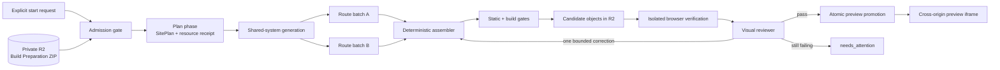
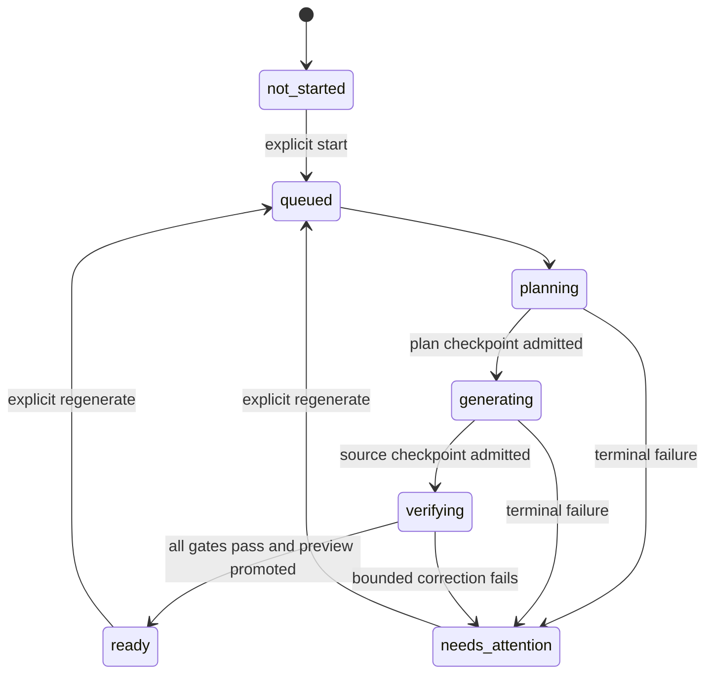
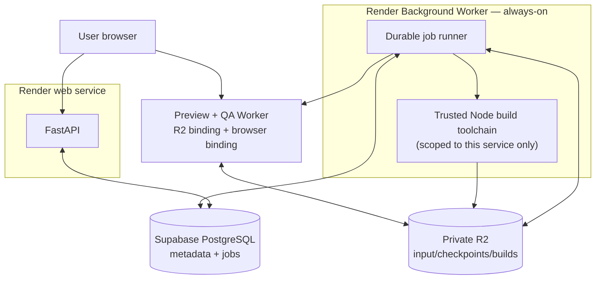
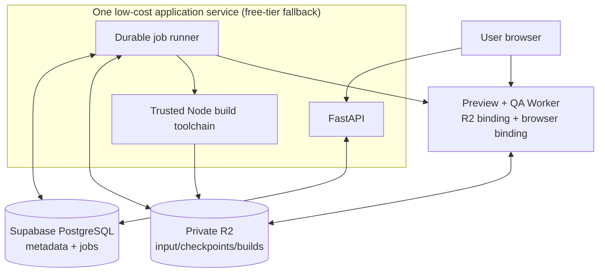

# Code Generator / Portfolio Design Engine

## Architecture proposal

**Status:** research and system-design proposal only. No implementation is
authorized by this document.

This document proposes the first real implementation of OryxenAI's Code
Generator. Its job is to turn one admitted Build Preparation archive into a
working, visually intentional, previewable static portfolio. In this proposal,
"Code Generator" and "Portfolio Design Engine" mean the same stage.

This proposal is organized around three product pillars, stated by the
project owner in exactly this priority order:

1. **No errors while generating.** The generation process itself must be
   robust: transient failures retry, structural failures fail closed, and a
   failed attempt never corrupts or silently replaces a session's prior good
   state.
2. **The generated portfolio looks advanced.** A deliberate, distinctive,
   content-specific design with a normal, domain-appropriate number of
   pages/sections/screens, real imagery, and purposeful motion — not a
   generic template assembled from interchangeable blocks.
3. **No errors in the generated portfolio itself.** No broken routes, no
   runtime exceptions, no dead links or fake interactions, on every declared
   route and viewport.

"Error-free generation" cannot be guaranteed by an LLM by itself — a
probabilistic model will sometimes produce a defective candidate. What this
architecture *can* guarantee is the product invariant that makes pillars 1 and
3 true regardless of what any single model call produces: a generation is
visible to the user only after deterministic and browser-level gates pass. A
failed candidate remains an internal diagnostic artifact and the session
enters `needs_attention`; it never becomes the active preview. Pillar 2 is a
different kind of problem — gates can stop a broken portfolio from shipping,
but only the planning/generation protocol below (the `SitePlan`'s creative
thesis and anti-generic rules, the visual-quality prompting, and the visual
review gate) can make a *working* portfolio a *distinctive* one.

A fourth, subordinate engineering principle governs *how* the above three are
achieved, and it is two distinct ideas that should not be conflated: **easy,
reliable deployment** and **minimal model/token cost** are not the same
constraint. The project owner has been explicit that cost is not a current
constraint — build correctness and quality first, optimize spend later — so
this document does not economize model calls, reasoning effort, or profile
count for cost's own sake. What remains a real, standing goal is operational
simplicity: an implementation small enough to debug, a deployment topology
that matches how this project already runs
([`compose.yaml`](../../compose.yaml)'s real service split), and a system
that works correctly the first time it is deployed, not one trimmed to fit a
minimal budget. Where this document recommends against something (a queue
product, a resident browser process, an orchestration framework), the reason
is operational complexity, not spend.

## Decision anchors

This proposal follows the repository's existing decisions rather than reopening
them implicitly:

- [D-012](../../DECISIONS.md) makes a fresh, admitted Build Preparation pack the
  authoritative Code Generator input. Generic layout, weak responsiveness,
  inappropriate motion, and failure to follow valid prepared instructions are
  Code Generator defects—not reasons to expand Build Preparation.
- [D-009](../../DECISIONS.md) makes the hash-verified archive in private
  S3-compatible storage authoritative; local staging is disposable.
- [D-001](../../DECISIONS.md) favors plain Python protocols and explicit
  orchestration over an agent framework.
- The actual generated `target/target-contract.json`, not older proposal prose,
  is the authority for framework, dependency, runtime, and fetch policy.
- Model/provider selection remains entirely in
  [`config/models.toml`](../../config/models.toml). This proposal names model
  **roles**, never model products or versions.

Any accepted change to those constraints needs its own decision entry before
implementation. This proposal deliberately does not edit `DECISIONS.md`.

## Executive recommendation

Build one durable Code Generator stage with three checkpointed phases:

1. **Plan:** admit and verify the archive, resolve permitted resources, and
   produce a strict `SitePlan` plus an interaction contract.
2. **Generate:** create the shared visual system, then route modules in bounded
   batches, inside a deterministic repository scaffold.
3. **Verify and preview:** statically inspect, type-check, build, deploy a
   private candidate, exercise it in a real browser, run visual review, and
   promote it only if every blocking gate succeeds.

The stage is one orchestrated agent, not a conversational swarm. Internally it
can make several structured model calls and parallelize independent route
batches after the shared contracts are frozen. Deterministic code owns the
scaffold, dependencies, file permissions, builds, tests, storage, and preview
promotion.

**Is there an orchestrator?** Yes, exactly one, and it is not itself a model.
The orchestrator is ordinary deterministic Python — `agent.py`/`service.py` in
the repository structure below — the same shape Content Architect and Visual
Design Director already use for their own bounded, 1–3-call internal
workflows (see `AGENTS.md`). It decides which structured call runs next, what
context that call receives, whether its output is admissible, and when to
stop. No separate "manager" or "planner" LLM supervises other LLMs, and no
model holds tool-calling or shell access that could drive this sequence
itself. This repository has deliberately never added a cross-agent supervisor
(`docs/architecture.md` §7) — Discovery, Content Architect, Visual Design
Director, Build Preparation, and Code Generator remain explicitly, separately
started by a caller, with no auto-chaining between them. Code Generator's
internal orchestrator is scoped entirely *inside* this one stage; it does not
reopen that boundary.



The route branches above are optional. A small one-route portfolio should use a
single generation call. Parallel work exists only where it lowers latency
without weakening consistency.

## System boundaries

| Component | Owns | Must not own |
| --- | --- | --- |
| Code Generator service | session validation, phase transitions, durable jobs, staleness, artifact metadata | model-specific business logic, generated source |
| Admission reader | fresh R2 download, archive safety, hashes, handoff eligibility, target/resource policy | design interpretation |
| Generation orchestrator | prompt construction, context slices, structured-call sequence, checkpoints | shell access, arbitrary network access |
| Deterministic scaffold | configs, boot code, router, error boundary, preview bridge, generated types | portfolio-specific art direction |
| Resource resolver | allowlisted registry/provider fetch, one-time pre-freeze completeness top-up, source/schema/license/dependency checks, fallback replacement | open-ended web browsing, runtime fetches, model-invoked tool calls |
| Source assembler | path ownership, atomic file application, import/dependency closure | free-form model decisions |
| Build verifier | static policy, type-check, production build, artifact inspection | visual taste |
| Browser verifier | route loading, runtime errors, interactions, accessibility and viewport checks | source generation |
| Visual reviewer | screenshot-based adherence and quality rubric | direct filesystem mutation |
| Preview gateway | immutable R2 object serving, SPA fallback, security headers, promotion mapping | generation or repair |

All components are ordinary Python protocols/services or isolated infrastructure
adapters. The agent itself receives data, not a database session or HTTP request,
matching the rest of OryxenAI.

**Why not give the model direct — including MCP — tool access during
generation?** Model Context Protocol is a fine *transport*; nothing here
objects to a deterministic adapter internally being an MCP client against a
component registry or icon server, the same way it might internally be a
plain HTTPS client. What this architecture rejects is letting a *generation
call itself* decide, mid-response, to invoke a tool — MCP or otherwise. That
would turn prompt injection hidden in portfolio content into live network and
tool access, make two runs of the "same" input non-reproducible, break the
single consistency ledger the `SitePlan` is supposed to be, and reintroduce
the unbounded cost/latency risk the rest of this design works to bound. Every
fetch in this proposal — resource resolution, completeness top-ups, anything
else — is decided and executed by orchestrator code before or between model
calls, never by a model holding a tool it can call itself. If a registry
naturally speaks MCP, the resource resolver may use it as an implementation
detail behind the same schema/license/path checks every other provider goes
through.

## End-to-end flow

### 1. Admit one immutable input

Code Generator starts only after an explicit API call. It reads Build
Preparation state, fetches the archive from configured object storage, verifies
the stored object metadata and archive hash, and validates:

- `handoff-report.json` exists and `handoff_eligible` is true;
- both approved upstream hashes match the current approved projections;
- the archive manifest and per-file checksums agree;
- paths, sizes, file types, and extraction limits are safe;
- the target contract and resource plan use supported schema versions; and
- the object has not expired or changed since the start receipt was recorded.

The worker downloads the object anew on a retry. It never relies on the local
debug mirror or a path produced by a previous process. It extracts into a
run-scoped temporary directory and treats every Markdown/JSON field in the pack
as untrusted data, never as a system instruction.

The phase writes an immutable `InputReceipt` containing the archive hash,
upstream hashes, target-contract hash, resource-plan hash, generator version,
and target-profile version. Every later output echoes this receipt.

### 2. Close every resource gap before creative generation — the Resource Completeness Gate

Build Preparation has already resolved almost everything: it runs its own
provider search (Pexels-first photo resolution with Unsplash fallback,
shadcn-compatible component/icon registries) and records a decision for every
need it detected. Code Generator's job here is deliberately narrow: **use what
was prepared, and close only the remaining gaps, once, deterministically,
before the plan is frozen.**

This one gate — detailed in [Generation pipeline](generation-pipeline.md) —
replaces two things a naive design would otherwise build as separate
mechanisms: "top up whatever Build Preparation under-provided" and "fetch
something a route discovers it needs mid-generation." Both are the same
problem — a gap between the frozen plan's needs and what is already on disk —
and collapsing them into one pre-freeze step keeps every fetch deterministic,
loggable, and impossible to trigger from inside a model call:

- a gap in a **`required_for_handoff`** need is never Code Generator's to
  solve — it fails the run closed to `needs_attention` with an
  upstream-contract diagnostic, per [D-012](../../DECISIONS.md);
- a gap in an **optional** need with `later_fetch.allowed` true is closed by a
  deterministic provider adapter that *replaces*, never duplicates, the
  recorded fallback;
- everything else uses the recorded local fallback; and
- every top-up is logged as a completeness diagnostic — recurring gaps are the
  evidence that justifies revisiting Build Preparation, not a standing license
  for Code Generator to improvise.

The model cannot invoke a package manager, CLI, arbitrary URL, image search, or
registry. It may request a resource only by `need_id`; deterministic code
decides whether the request is admissible, and registry/provider responses are
schema-, path-, dependency-, license-, and target-checked before their source
is ever exposed to a generation call. A resource is never fetched from the
generated portfolio at runtime, under any circumstance.

The current Build Preparation contract computes `later_fetch` only for
component/icon needs, never image needs — a missing image always falls back to
the recorded CSS/SVG/typographic treatment today. Granting a narrow, same-shape
exception for *optional, non-required* imagery (so a missing decorative photo
can become a real photo instead of always degrading to a fallback) is a
legitimate, explicitly requested product need, but it is a versioned Build
Preparation contract change, not a Code Generator-side shortcut — it is its
own item in the decision checklist below, not silently assumed here.

### 3. Freeze one site-wide plan

The planning call receives the verified invariant context and emits a strict
`SitePlan`. It is the consistency ledger for all later calls. It fixes:

- route graph and route-to-content mapping;
- one visual thesis and explicit anti-generic rules;
- color, typography, spacing, radius, surface, and motion tokens;
- layout grammar, breakpoint behavior, and global shell/navigation;
- shared component signatures and route file ownership;
- image/resource placement and each fallback decision;
- interaction outcomes for every link, button, filter, dialog, download, and
  form-like control;
- responsive, keyboard, reduced-motion, and accessibility requirements; and
- traceability from prepared acceptance criteria to files and browser checks.

Planning is the last moment at which global composition may change freely.
Route generation may interpret a route, but it may not invent a new palette,
font stack, navigation system, motion language, or incompatible component API.

The number of routes, pages, and sections is not Code Generator's decision.
Content Architect already decided what structure this person's story needs — a
compact case-study set implies a different page count than a dense
multi-project portfolio — and Visual Design Director already decided how that
structure reads per breakpoint. The admitted pack's route graph is
authoritative on *count and identity*. Planning may change how many *model
calls* implement that graph (batching, per the adaptive call shape in
[Generation pipeline](generation-pipeline.md)), never the graph itself:
merging two admitted routes into one generation call is an internal efficiency
decision; merging them into one user-facing page is not Code Generator's to
make.

### 4. Generate inside a trusted scaffold

The orchestrator instantiates a versioned deterministic scaffold for the exact
target profile. It then requests file changes—not a repository or shell
transcript—from model calls. Shared visual primitives are generated once.
Independent route batches may run in parallel only after the plan and shared
exports are frozen, and each batch has exclusive path ownership.

The assembler applies a strict `FileChangeSet` schema, rejects unexpected paths
or imports, formats the accepted source, and creates deterministic generated
manifests. The model never writes build configuration, package metadata,
lockfiles, environment files, CI files, or deployment code.

### 5. Verify before promotion

Verification is layered so cheap, high-signal failures stop expensive work:

1. archive, schema, ownership, and path checks;
2. source policy, dependency/import closure, fact and interaction coverage;
3. type-check and production build in a secret-free isolated process;
4. direct-load and navigation tests for every route in a real browser;
5. console, page, asset, interaction, keyboard, reduced-motion, overflow, and
   responsive checks;
6. screenshot-based visual-quality review against the `SitePlan`; and
7. output hashing, upload, read-back verification, and atomic preview promotion.

One targeted correction pass is allowed. It receives only the failed gate,
diagnostics, relevant screenshots, plan slice, and implicated source snippets.
It cannot rewrite unrelated files. After correction, all affected deterministic
and browser gates run again. A second unresolved failure becomes
`needs_attention`; an unbounded repair loop is explicitly excluded.

### 6. Serve an isolated preview

The build output is uploaded under a new immutable generation prefix. A
Cloudflare Worker-style preview gateway bound to the private R2 bucket is the
recommended low-traffic deployment: it maps opaque preview paths to objects,
performs SPA fallback for direct route loads, applies restrictive headers, and
keeps candidate and promoted generations separate.

The OryxenAI UI embeds the promoted portfolio from a **different origin** in a
sandboxed iframe. The preview origin has no application cookies, API keys, or
database credentials. Generated code cannot access the OryxenAI origin and its
Content Security Policy blocks runtime network calls.

An opaque URL is merely unlisted while the product has no authentication; it is
not strong access control. A later authenticated product should replace it with
short-lived signed preview grants without changing the generation pipeline.

## Proposed durable workflow

One explicit `/start` call creates the stage run and first durable job. The jobs
chain **inside this stage**; this does not introduce automatic sequencing across
Discovery, Content Architect, Visual Design Director, or Build Preparation.



Recommended job boundaries:

| Durable handler | Checkpoint | Why separate |
| --- | --- | --- |
| `code_generator.plan` | input receipt, resource receipt, `SitePlan` | avoids repeating resource/model cost after a restart |
| `code_generator.generate` | assembled source ZIP, source manifest, call receipts | isolates route retries and preserves diagnostics |
| `code_generator.verify_and_preview` | build ZIP, reports, screenshots, promoted preview receipt | isolates resource-heavy build/browser work |

Each handler is idempotent by session, input archive hash, target-profile
version, generator version, phase, and attempt. Checkpoints are immutable R2
objects; PostgreSQL/session JSONB stores compact state, hashes, object keys,
progress, and safe error summaries—not source trees, binaries, screenshots, or
model transcripts.

For the expected low concurrency, one active generation globally is a sensible
default regardless of which deployment topology below is in use — an
always-on worker still runs real `npm`/`tsc`/`vite`/Playwright subprocesses
with real CPU/memory cost, and unbounded parallel generations would make
failures harder to reproduce even where memory isn't the binding limit.
Route-call parallelism should be a small config-driven limit. A second
generation should queue rather than compete for the same build resources; see
the [decision checklist](#pre-implementation-decision-checklist) on whether
Code Generator warrants a dedicated worker pool as load grows.

## Proposed API surface

This follows the established explicit-stage pattern:

| Method | Proposed path | Purpose |
| --- | --- | --- |
| `GET` | `/api/v1/sessions/{id}/code-generator` | state, phase progress, staleness, safe diagnostics, ready preview/artifact receipts |
| `POST` | `/api/v1/sessions/{id}/code-generator/start` | start from the current eligible Build Preparation archive |
| `POST` | `/api/v1/sessions/{id}/code-generator/regenerate` | create a new generation from current eligible input; never overwrite an old generation |

The preview URL is absent until state is `ready`. Publishing is a separate,
future explicit operation. Natural-language redesign should normally return to
the responsible upstream stage; Code Generator's own correction loop is for
implementation defects, not silent content or art-direction changes.

## Proposed result contract

The successful stage result is a compact set of receipts, not an inline list of
source files:

```text
CodeGenerationResult
  schema_version
  status: ready
  input_receipt
  site_plan_receipt
  source_artifact
    object_key
    sha256
    size_bytes
    manifest_sha256
  build_artifact
    object_key
    sha256
    size_bytes
    manifest_sha256
  verification_receipt
    static_report_sha256
    browser_report_sha256
    visual_report_sha256
  preview_receipt
    opaque_preview_id
    promoted_build_sha256
    url_or_url_path
  provenance_receipt
  generator_version
  target_profile_version
```

Object keys and URLs are exposed only where policy permits; credentials and
presigned secrets are never persisted in session JSONB. The source ZIP is the
debug/export artifact, the build ZIP is the portable static deployment
artifact, and the preview is one isolated serving of that exact build. A future
publishing stage can consume the verified build receipt without asking a model
to regenerate the site.

## Proposed repository structure

```text
src/oryxenai/agents/code_generator/
  agent.py                    bounded model workflow only
  schemas.py                  receipts, plans, change sets, reports
  validators.py               envelope and semantic cross-checks
  prompt_builder.py           trusted instructions + untrusted context slices
  service.py                  session-facing stage orchestration
  state.py                    transitions, CAS, staleness projection
  admission.py                archive download and validation
  resources.py                completeness gate + permitted later-fetch resolution
  scaffold.py                 versioned trusted frontend scaffold
  assembler.py                file ownership and atomic change application
  dependencies.py             approved package subset and lockfile resolution
  verifier.py                 static/type/build gates
  browser_verifier.py         local/cloud browser protocol
  preview.py                  candidate upload and atomic promotion
  prompts/
    system.md
    plan_site.md
    generate_shared_system.md
    generate_routes.md
    review_render.md
    correct_defects.md
  references/                 compact reference cards; no user data
  samples/                    privacy-safe checked-in fixtures

src/oryxenai/portfolio_runtime/
  profiles/                   trusted target/scaffold versions
  scaffold/                   frontend-owned files and templates

tests/
  unit/code_generator/
  integration/code_generator/
  worker/code_generator/
  api/code_generator/
  evaluation/code_generator/  corpus scenarios and visual/functional evals
```

The exact placement of the reusable frontend runtime may be adjusted during
implementation. The important boundary is that trusted scaffold files are not
mixed with model-owned route files.

## Generated portfolio structure

```text
portfolio/
  package.json                deterministic dependency resolver
  package-lock.json           deterministic dependency resolver
  index.html                  trusted scaffold
  vite.config.ts              trusted scaffold
  tsconfig*.json              trusted scaffold
  src/
    main.tsx                  trusted scaffold
    runtime/
      AppRouter.tsx           trusted, dependency-free route handling
      ErrorBoundary.tsx       trusted failure surface
      PreviewBridge.ts        trusted observability only
    site/
      site-plan.json          deterministic public subset
      tokens.css              shared-generation owner
      SiteShell.tsx           shared-generation owner
      components/             shared-generation owner
    routes/
      <safe-route-id>/        exactly one route-batch owner
        index.tsx
        sections/
    generated/
      route-registry.ts       deterministic assembler
      asset-manifest.json     deterministic assembler
      interaction-map.json   deterministic assembler
  public/
    assets/                   admitted, hash-addressed local resources
```

The trusted router is recommended because the admitted dependency ceiling does
not currently include a router package, while historical prose mentions one.
This mismatch must be resolved explicitly before implementation: either accept
the dependency-free scaffold router or version the target contract. The
generator must not silently install an undeclared package.

## Deployment recommendation

The project's actual local/CI topology already exists and already works:
`compose.yaml` at the repository root runs `postgres`, a one-shot `migrate`,
`app` (`uvicorn`), and `worker` (`python -m oryxenai.jobs.worker`) as four
separate services built from the same `Dockerfile` with different `command:`
entries — the exact one-process-per-container split
[`docs/architecture.md` §6-7](../architecture.md) already gives the rationale
for. The primary recommendation below is that same split, carried into
production, not a new shape invented for Code Generator.

### Primary: split web service and worker



This is now the primary recommendation, not the free-tier fallback further
below, for three concrete reasons:

1. It matches `compose.yaml`'s real, already-working `app`/`worker` split
   instead of introducing a Code Generator-specific combined shape that
   diverges from it.
2. Code Generator's jobs are long-running and resource-heavier than any
   existing agent's (`npm ci`, `tsc`, `vite build`, multi-route/multi-viewport
   Playwright, plus a visual-review model call, potentially with a higher
   `reasoning_effort` than existing agents use — see
   [Generation pipeline](generation-pipeline.md#model-roles-and-call-graph)).
   Sharing one small combined service with the API risks starving both the
   build and ordinary API responsiveness under the same process.
3. The project owner has stated cost is not the current constraint — the
   combined-service shape below exists specifically to survive a free-tier
   budget, which is no longer the binding condition. An **always-on
   Background Worker** is the straightforward recommendation now, reserving
   the free-tier shape as an explicit fallback if that framing ever reverses,
   not as the default to design around today.

The Node/npm build toolchain belongs on the worker service only — never on
the `app`/`migrate` processes, which never run a build. Playwright itself
needs no Node at all: it ships a pure-Python package
(`playwright`, installable via `uv`, `playwright install chromium`), so the
Cloudflare browser binding described below (or a local Playwright adapter for
development/CI) covers verification without touching Node. Node exists in
this design for exactly one reason — building generated portfolios
(`npm ci`/`tsc`/`vite build`) — which is worth stating plainly so the
addition stays legible rather than looking like unexplained toolchain sprawl.
See [Generation pipeline](generation-pipeline.md#package-and-toolchain-policy)
for the concrete Dockerfile approach.

Use a Cloudflare browser binding for Playwright-compatible verification
instead of attempting to keep Chromium resident in a memory-constrained web
service — this holds for both the primary topology above and the fallback
below.

### Fallback: combined service for a strict free-tier budget



Render's free web services can spin down and have ephemeral filesystems, and
free background workers are not generally available; exact plan limits change
and must be checked at deployment time. If a strict free-tier budget ever
becomes binding again, this combined shape remains valid — one build at a
time, no queue product, no orchestration framework, no dedicated build farm —
exactly as it was originally proposed. It is kept here deliberately rather
than deleted, so reverting to it is a documented option, not a rediscovery.

Supabase PostgreSQL should hold only compact state and durable job rows in
either topology. Use the connection mode appropriate to the deployed
persistent service and keep the application pool intentionally small. Free
projects may pause when inactive, so startup/retry behavior must tolerate a
cold database rather than treating it as data loss.

## Where does a finished portfolio actually get deployed?

Two different deployment questions exist here and must not be conflated:

1. **Where OryxenAI itself runs** — the FastAPI app, the durable worker, the
   trusted Node build toolchain, PostgreSQL, and the preview/QA gateway. This
   is the Render + Supabase + Cloudflare (R2 + Worker) shape described above,
   already the live stack for Build Preparation ([D-009](../../DECISIONS.md),
   [D-011](../../DECISIONS.md)). Code Generator adds no new infrastructure
   product to this list — only new object prefixes and one more Worker route.
2. **Where a *generated portfolio* eventually gets published** for its owner
   to use as a real, independently hosted site — a separate, explicitly
   future stage this proposal does not implement. It can safely stay future
   without blocking anything here because the verified `build_artifact` (the
   static `dist.zip` behind Gate 2 in
   [Preview, quality, and evaluation](preview-quality-and-evaluation.md)) is,
   by construction, a plain static site: no server runtime, no
   OryxenAI-specific asset host, nothing that only works behind this
   project's own preview gateway. Any static host can serve it. Vercel — the
   platform the project owner named alongside Render and Supabase — is one
   such target, alongside Render's own static-site product, Cloudflare Pages,
   and Netlify. Publishing then becomes a small per-target *upload* adapter,
   not a regeneration. See
   [Live preview and deployment](live-preview-and-deployment.md) for the
   compatibility contract this depends on; like the rest of this document, it
   is a research/system-design proposal, not authorized for implementation
   now.

Supabase's role does not change for any of this: PostgreSQL metadata and
durable job rows, never portfolio hosting or portfolio object storage, unless
a future decision explicitly says otherwise.

## Explicitly rejected shapes

| Shape | Reason |
| --- | --- |
| One prompt that returns an entire repository | weak consistency, output truncation risk, difficult repair, no file ownership |
| One model call per section/component | excessive latency/cost and cross-call design drift |
| A free-running multi-agent swarm | unnecessary coordination state, nondeterministic ownership, harder replay/debugging |
| Model shell/tool access, including a live MCP tool-calling loop during generation | turns prompt injection into dependency, filesystem, and network risk; breaks reproducibility and the single-consistency-ledger guarantee |
| Browser-side package installation/WebContainer as the primary builder | licensing/compatibility complexity and divergence from the production verifier |
| A giant durable job | a restart repeats expensive planning, generation, build, and browser work |
| Unbounded generate-test-repair loops | unpredictable cost and can hide architecture defects |
| Serving directly from local disk | incompatible with ephemeral deployment and worker restarts |
| Runtime CDN fonts/images/components | violates the static target and makes previews nondeterministic |
| Full golden-app source in every prompt | encourages cloning, consumes context, and repeats the few-shot-library failure mode |

## Pre-implementation decision checklist

These points need owner acceptance or a new ADR before code begins:

1. Accept a dependency-free trusted router, or version the target contract to
   include a router dependency.
2. Accept extending `later_fetch` to optional, non-`required_for_handoff`
   image needs (a versioned Build Preparation resource-plan contract change,
   admitted through the same Resource Completeness Gate as component/icon
   top-ups — see "Close every resource gap before creative generation"
   above), or keep v1 image fetching prohibited entirely.
3. Confirm the preview/QA Worker and browser-binding products are available in
   the deployment account and within its plan's usage limits.
4. Confirm the production deployment overlay for whichever topology is
   actually provisioned — the split web-service/Background-Worker primary
   recommendation (consistent with the existing local `compose.yaml` split)
   or the combined-service free-tier fallback — since the two need different
   overlay configuration and only one should be live at a time.
5. Choose and pin a target-profile/toolchain image and an exact lockfile
   derivation policy; the starter dependency ranges alone are not a reproducible
   build contract.
6. Accept that unauthenticated opaque preview links are unlisted, not private,
   until authentication exists.
7. Resolve the static React target's no-JavaScript behavior: the recommended v1
   baseline is a deterministic public-content `<noscript>` fallback, with full
   prerendering deferred unless product requirements demand it.
8. Accept a versioned font-provenance pipeline (self-hosted font files admitted
   like images, with license/hash checks) alongside images/components — see
   "Fonts" in [Generation pipeline](generation-pipeline.md) — or keep v1
   restricted to a fixed system-font stack.
9. Decide whether a v1 "Build Theater" live-progress view ships alongside the
   gated preview, and whether a future live dev-container preview is ever
   pursued — see [Live preview and deployment](live-preview-and-deployment.md).
10. Choose the first publish-target adapter, if any, once a publishing stage is
    actually scheduled — Vercel, Render static sites, Cloudflare Pages, and
    Netlify are all compatible with the verified build artifact and none is
    presently chosen.
11. Set a per-session regenerate quota/cooldown (config-driven) so the explicit
    `/regenerate` endpoint cannot let one session monopolize the shared
    generation-concurrency slot(s) other sessions are waiting on — a fairness
    and capacity control, not a cost control, now that cost is not the
    binding constraint.
12. Confirm or override the worker's per-job-type `handler_timeout`,
    `lease_duration`, and `concurrency` before Code Generator jobs share the
    existing global worker pool. `config/app.toml` currently sets these
    generically (`handler_timeout = 300.0`, `lease_duration = 120.0`,
    `concurrency = 2`) for lightweight agents; a cold
    `code_generator.verify_and_preview` job — uncached `npm ci`, `tsc`,
    `vite build`, multi-route/multi-viewport Playwright, plus a
    visual-review model call — can plausibly exceed these, especially if
    checklist item 13 below raises reasoning effort and therefore latency.
13. Decide whether Code Generator gets a dedicated worker service/pool rather
    than sharing the generic pool with lightweight agents. Today's worker
    `concurrency` setting is job-weight-blind — a heavy build job costs the
    same pool slot as a Discovery call — so co-locating them risks the
    heavier job starving the lighter ones, independent of the timeout
    question above.
14. Confirm the configured model's actual `max_output_tokens` ceiling
    empirically before finalizing `code_generator_builder`'s profile and
    route-batch-size defaults. Existing profiles cap this at 16000-32000, but
    that reflects what those agents happened to need, not a confirmed hard
    limit — and `FileChangeSet` responses carrying full file contents are a
    materially larger output shape than any existing agent produces.
15. Accept the concrete Dockerfile approach for adding Node to the worker
    image (pinned `node:20-bookworm-slim`, full binary + library tree copy,
    build-time smoke check — see
    [Generation pipeline](generation-pipeline.md#package-and-toolchain-policy)),
    and commit to writing a `render.yaml` (or equivalent IaC) once Code
    Generator deployment work actually begins, so the split-service topology
    above is declarative rather than manually configured — neither exists
    today.

## Document map

- [Generation pipeline](generation-pipeline.md): model call structure, context
  protocol, file ownership, package/resource handling, concurrency, and repair.
- [Preview, quality, and evaluation](preview-quality-and-evaluation.md): browser
  verification, preview security, quality gates, visual rubric, and the proposed
  reference corpus — the correctness contract behind the *promoted* preview.
- [Live preview and deployment](live-preview-and-deployment.md): the
  in-progress "Build Theater" viewing experience, local-vs-deployed preview
  serving symmetry, and future publish-target compatibility (Vercel, Render
  static, Cloudflare Pages, Netlify).

## Primary research references

The design uses primary documentation rather than copying another generator's
implementation:

- OpenAI: [model-selection guidance](https://developers.openai.com/api/docs/guides/latest-model),
  [Structured Outputs](https://developers.openai.com/api/docs/guides/structured-outputs),
  [Responses migration guidance](https://developers.openai.com/api/docs/guides/migrate-to-responses),
  and [frontend prompting guidance](https://developers.openai.com/api/docs/guides/frontend-prompt)
- npm: [`npm ci`](https://docs.npmjs.com/cli/commands/npm-ci/)
- Vite: [static deployment](https://vite.dev/guide/static-deploy.html)
- Playwright: [web-server testing](https://playwright.dev/docs/test-webserver)
  and [visual comparisons](https://playwright.dev/docs/test-snapshots)
- Cloudflare: [R2 presigned URLs](https://developers.cloudflare.com/r2/api/s3/presigned-urls/),
  [R2 Worker bindings](https://developers.cloudflare.com/r2/api/workers/workers-api-reference/),
  [SPA fallback](https://developers.cloudflare.com/workers/static-assets/routing/single-page-application/),
  [Browser Run with Playwright](https://developers.cloudflare.com/browser-run/playwright/),
  and [object lifecycle rules](https://developers.cloudflare.com/r2/buckets/object-lifecycles/)
- Render: [free-service behavior](https://render.com/docs/free),
  [background workers](https://render.com/docs/background-workers), and
  [Docker deployment](https://render.com/docs/docker)
- Supabase: [database connection choices](https://supabase.com/docs/guides/database/connecting-to-postgres),
  [connection management](https://supabase.com/docs/guides/database/connection-management),
  [free-project pausing](https://supabase.com/docs/guides/platform/free-project-pausing),
  and the [breaking-change changelog](https://supabase.com/changelog?types=breaking-change)
- shadcn/ui: [registry API](https://ui.shadcn.com/docs/registry/api-reference)
  and [registry item schema](https://ui.shadcn.com/docs/registry/registry-item-json)
- Motion: [reduced-motion hook](https://motion.dev/docs/react-use-reduced-motion)
- MDN: [`iframe` sandbox behavior](https://developer.mozilla.org/en-US/docs/Web/HTML/Reference/Elements/iframe)
  and [Content Security Policy](https://developer.mozilla.org/en-US/docs/Web/HTTP/Guides/CSP)
- StackBlitz: [Bolt.diy repository](https://github.com/stackblitz-labs/bolt.diy)
  and [documentation](https://stackblitz-labs.github.io/bolt.diy/) as a useful
  reference for separating AI actions from an isolated preview environment
