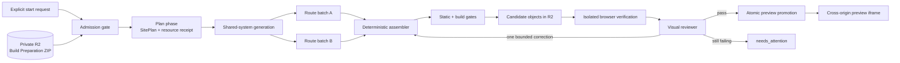
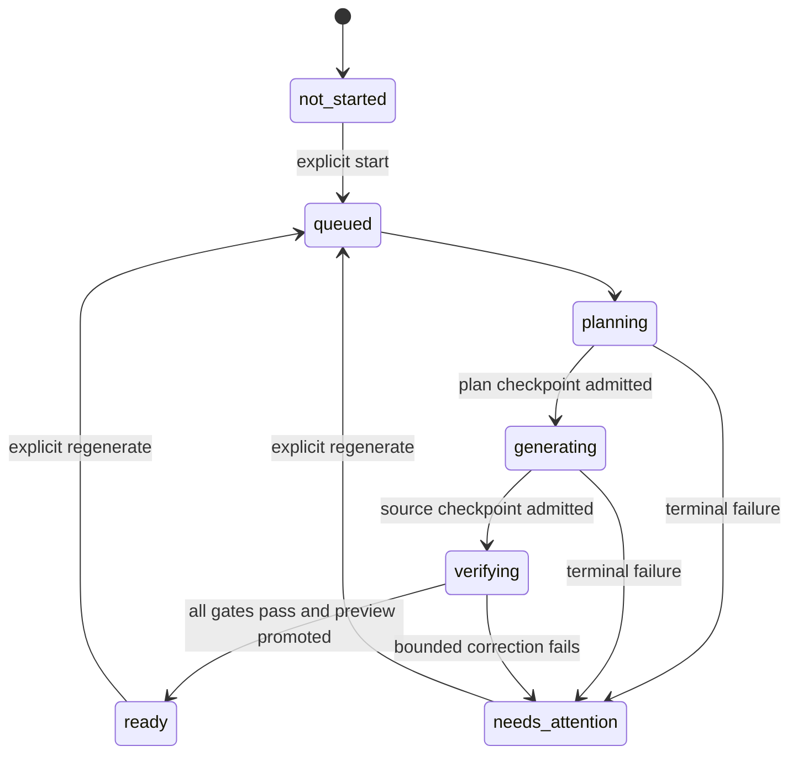
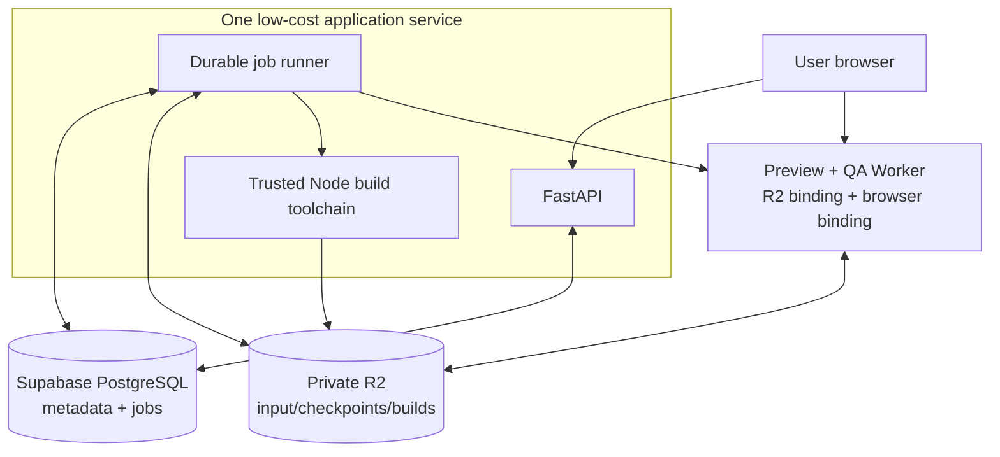

# Code Generator / Portfolio Design Engine

## Architecture proposal

**Status:** research and system-design proposal only. No implementation is
authorized by this document.

This document proposes the first real implementation of OryxenAI's Code
Generator. Its job is to turn one admitted Build Preparation archive into a
working, visually intentional, previewable static portfolio. In this proposal,
"Code Generator" and "Portfolio Design Engine" mean the same stage.

The proposal optimizes for three outcomes, in this order:

1. never show a broken preview;
2. produce a coherent, distinctive, high-quality portfolio rather than a
   generic collection of generated sections; and
3. keep the implementation small enough to debug and operate for a low-traffic
   deployment.

"Error-free generation" cannot be guaranteed by an LLM. It can be made a
product invariant: a generation is visible to the user only after deterministic
and browser-level gates pass. A failed candidate remains an internal diagnostic
artifact and the session enters `needs_attention`; it never becomes the active
preview.

## Decision anchors

This proposal follows the repository's existing decisions rather than reopening
them implicitly:

- [D-012](../../DECISIONS.md) makes a fresh, admitted Build Preparation pack the
  authoritative Code Generator input. Generic layout, weak responsiveness,
  inappropriate motion, and failure to follow valid prepared instructions are
  Code Generator defects—not reasons to expand Build Preparation.
- [D-009](../../DECISIONS.md) makes the hash-verified archive in private
  S3-compatible storage authoritative; local staging is disposable.
- [D-001](../../DECISIONS.md) favors plain Python protocols and explicit
  orchestration over an agent framework.
- The actual generated `target/target-contract.json`, not older proposal prose,
  is the authority for framework, dependency, runtime, and fetch policy.
- Model/provider selection remains entirely in
  [`config/models.toml`](../../config/models.toml). This proposal names model
  **roles**, never model products or versions.

Any accepted change to those constraints needs its own decision entry before
implementation. This proposal deliberately does not edit `DECISIONS.md`.

## Executive recommendation

Build one durable Code Generator stage with three checkpointed phases:

1. **Plan:** admit and verify the archive, resolve permitted resources, and
   produce a strict `SitePlan` plus an interaction contract.
2. **Generate:** create the shared visual system, then route modules in bounded
   batches, inside a deterministic repository scaffold.
3. **Verify and preview:** statically inspect, type-check, build, deploy a
   private candidate, exercise it in a real browser, run visual review, and
   promote it only if every blocking gate succeeds.

The stage is one orchestrated agent, not a conversational swarm. Internally it
can make several structured model calls and parallelize independent route
batches after the shared contracts are frozen. Deterministic code owns the
scaffold, dependencies, file permissions, builds, tests, storage, and preview
promotion.



The route branches above are optional. A small one-route portfolio should use a
single generation call. Parallel work exists only where it lowers latency
without weakening consistency.

## System boundaries

| Component | Owns | Must not own |
| --- | --- | --- |
| Code Generator service | session validation, phase transitions, durable jobs, staleness, artifact metadata | model-specific business logic, generated source |
| Admission reader | fresh R2 download, archive safety, hashes, handoff eligibility, target/resource policy | design interpretation |
| Generation orchestrator | prompt construction, context slices, structured-call sequence, checkpoints | shell access, arbitrary network access |
| Deterministic scaffold | configs, boot code, router, error boundary, preview bridge, generated types | portfolio-specific art direction |
| Resource resolver | allowlisted registry fetch, source/schema/license/dependency checks, fallback replacement | open-ended web browsing, runtime fetches |
| Source assembler | path ownership, atomic file application, import/dependency closure | free-form model decisions |
| Build verifier | static policy, type-check, production build, artifact inspection | visual taste |
| Browser verifier | route loading, runtime errors, interactions, accessibility and viewport checks | source generation |
| Visual reviewer | screenshot-based adherence and quality rubric | direct filesystem mutation |
| Preview gateway | immutable R2 object serving, SPA fallback, security headers, promotion mapping | generation or repair |

All components are ordinary Python protocols/services or isolated infrastructure
adapters. The agent itself receives data, not a database session or HTTP request,
matching the rest of OryxenAI.

## End-to-end flow

### 1. Admit one immutable input

Code Generator starts only after an explicit API call. It reads Build
Preparation state, fetches the archive from configured object storage, verifies
the stored object metadata and archive hash, and validates:

- `handoff-report.json` exists and `handoff_eligible` is true;
- both approved upstream hashes match the current approved projections;
- the archive manifest and per-file checksums agree;
- paths, sizes, file types, and extraction limits are safe;
- the target contract and resource plan use supported schema versions; and
- the object has not expired or changed since the start receipt was recorded.

The worker downloads the object anew on a retry. It never relies on the local
debug mirror or a path produced by a previous process. It extracts into a
run-scoped temporary directory and treats every Markdown/JSON field in the pack
as untrusted data, never as a system instruction.

The phase writes an immutable `InputReceipt` containing the archive hash,
upstream hashes, target-contract hash, resource-plan hash, generator version,
and target-profile version. Every later output echoes this receipt.

### 2. Resolve resources before creative generation

The resource resolver follows `resources/plan.json`, in this order:

1. use the prepared local resource;
2. if and only if `later_fetch.allowed` is true, fetch one equivalent from a
   listed provider through a deterministic adapter and replace the fallback;
3. otherwise implement the recorded local fallback; and
4. never fetch a resource from the generated portfolio at runtime.

The model cannot invoke a package manager, CLI, arbitrary URL, image search, or
registry. It may request a resource by `need_id`; deterministic code decides
whether the request is admissible. Registry responses are schema-, path-,
dependency-, license-, and target-checked before their source is exposed to a
generation call.

The current Build Preparation contract grants later-fetch permission to certain
component/icon needs, not to arbitrary image needs. Code Generator must use a
materialized image or the prepared CSS/SVG/typographic fallback. Adding image
search here would be a versioned upstream-contract change, not an implementation
shortcut.

### 3. Freeze one site-wide plan

The planning call receives the verified invariant context and emits a strict
`SitePlan`. It is the consistency ledger for all later calls. It fixes:

- route graph and route-to-content mapping;
- one visual thesis and explicit anti-generic rules;
- color, typography, spacing, radius, surface, and motion tokens;
- layout grammar, breakpoint behavior, and global shell/navigation;
- shared component signatures and route file ownership;
- image/resource placement and each fallback decision;
- interaction outcomes for every link, button, filter, dialog, download, and
  form-like control;
- responsive, keyboard, reduced-motion, and accessibility requirements; and
- traceability from prepared acceptance criteria to files and browser checks.

Planning is the last moment at which global composition may change freely.
Route generation may interpret a route, but it may not invent a new palette,
font stack, navigation system, motion language, or incompatible component API.

### 4. Generate inside a trusted scaffold

The orchestrator instantiates a versioned deterministic scaffold for the exact
target profile. It then requests file changes—not a repository or shell
transcript—from model calls. Shared visual primitives are generated once.
Independent route batches may run in parallel only after the plan and shared
exports are frozen, and each batch has exclusive path ownership.

The assembler applies a strict `FileChangeSet` schema, rejects unexpected paths
or imports, formats the accepted source, and creates deterministic generated
manifests. The model never writes build configuration, package metadata,
lockfiles, environment files, CI files, or deployment code.

### 5. Verify before promotion

Verification is layered so cheap, high-signal failures stop expensive work:

1. archive, schema, ownership, and path checks;
2. source policy, dependency/import closure, fact and interaction coverage;
3. type-check and production build in a secret-free isolated process;
4. direct-load and navigation tests for every route in a real browser;
5. console, page, asset, interaction, keyboard, reduced-motion, overflow, and
   responsive checks;
6. screenshot-based visual-quality review against the `SitePlan`; and
7. output hashing, upload, read-back verification, and atomic preview promotion.

One targeted correction pass is allowed. It receives only the failed gate,
diagnostics, relevant screenshots, plan slice, and implicated source snippets.
It cannot rewrite unrelated files. After correction, all affected deterministic
and browser gates run again. A second unresolved failure becomes
`needs_attention`; an unbounded repair loop is explicitly excluded.

### 6. Serve an isolated preview

The build output is uploaded under a new immutable generation prefix. A
Cloudflare Worker-style preview gateway bound to the private R2 bucket is the
recommended low-traffic deployment: it maps opaque preview paths to objects,
performs SPA fallback for direct route loads, applies restrictive headers, and
keeps candidate and promoted generations separate.

The OryxenAI UI embeds the promoted portfolio from a **different origin** in a
sandboxed iframe. The preview origin has no application cookies, API keys, or
database credentials. Generated code cannot access the OryxenAI origin and its
Content Security Policy blocks runtime network calls.

An opaque URL is merely unlisted while the product has no authentication; it is
not strong access control. A later authenticated product should replace it with
short-lived signed preview grants without changing the generation pipeline.

## Proposed durable workflow

One explicit `/start` call creates the stage run and first durable job. The jobs
chain **inside this stage**; this does not introduce automatic sequencing across
Discovery, Content Architect, Visual Design Director, or Build Preparation.



Recommended job boundaries:

| Durable handler | Checkpoint | Why separate |
| --- | --- | --- |
| `code_generator.plan` | input receipt, resource receipt, `SitePlan` | avoids repeating resource/model cost after a restart |
| `code_generator.generate` | assembled source ZIP, source manifest, call receipts | isolates route retries and preserves diagnostics |
| `code_generator.verify_and_preview` | build ZIP, reports, screenshots, promoted preview receipt | isolates resource-heavy build/browser work |

Each handler is idempotent by session, input archive hash, target-profile
version, generator version, phase, and attempt. Checkpoints are immutable R2
objects; PostgreSQL/session JSONB stores compact state, hashes, object keys,
progress, and safe error summaries—not source trees, binaries, screenshots, or
model transcripts.

For the expected low concurrency, one active generation globally is a sensible
default. Route-call parallelism should be a small config-driven limit. A second
generation can queue rather than compete for memory on a free-tier service.

## Proposed API surface

This follows the established explicit-stage pattern:

| Method | Proposed path | Purpose |
| --- | --- | --- |
| `GET` | `/api/v1/sessions/{id}/code-generator` | state, phase progress, staleness, safe diagnostics, ready preview/artifact receipts |
| `POST` | `/api/v1/sessions/{id}/code-generator/start` | start from the current eligible Build Preparation archive |
| `POST` | `/api/v1/sessions/{id}/code-generator/regenerate` | create a new generation from current eligible input; never overwrite an old generation |

The preview URL is absent until state is `ready`. Publishing is a separate,
future explicit operation. Natural-language redesign should normally return to
the responsible upstream stage; Code Generator's own correction loop is for
implementation defects, not silent content or art-direction changes.

## Proposed result contract

The successful stage result is a compact set of receipts, not an inline list of
source files:

```text
CodeGenerationResult
  schema_version
  status: ready
  input_receipt
  site_plan_receipt
  source_artifact
    object_key
    sha256
    size_bytes
    manifest_sha256
  build_artifact
    object_key
    sha256
    size_bytes
    manifest_sha256
  verification_receipt
    static_report_sha256
    browser_report_sha256
    visual_report_sha256
  preview_receipt
    opaque_preview_id
    promoted_build_sha256
    url_or_url_path
  provenance_receipt
  generator_version
  target_profile_version
```

Object keys and URLs are exposed only where policy permits; credentials and
presigned secrets are never persisted in session JSONB. The source ZIP is the
debug/export artifact, the build ZIP is the portable static deployment
artifact, and the preview is one isolated serving of that exact build. A future
publishing stage can consume the verified build receipt without asking a model
to regenerate the site.

## Proposed repository structure

```text
src/oryxenai/agents/code_generator/
  agent.py                    bounded model workflow only
  schemas.py                  receipts, plans, change sets, reports
  validators.py               envelope and semantic cross-checks
  prompt_builder.py           trusted instructions + untrusted context slices
  service.py                  session-facing stage orchestration
  state.py                    transitions, CAS, staleness projection
  admission.py                archive download and validation
  resources.py                permitted later-fetch resolution
  scaffold.py                 versioned trusted frontend scaffold
  assembler.py                file ownership and atomic change application
  dependencies.py             approved package subset and lockfile resolution
  verifier.py                 static/type/build gates
  browser_verifier.py         local/cloud browser protocol
  preview.py                  candidate upload and atomic promotion
  prompts/
    system.md
    plan_site.md
    generate_shared_system.md
    generate_routes.md
    review_render.md
    correct_defects.md
  references/                 compact reference cards; no user data
  samples/                    privacy-safe checked-in fixtures

src/oryxenai/portfolio_runtime/
  profiles/                   trusted target/scaffold versions
  scaffold/                   frontend-owned files and templates

tests/
  unit/code_generator/
  integration/code_generator/
  worker/code_generator/
  api/code_generator/
  evaluation/code_generator/  corpus scenarios and visual/functional evals
```

The exact placement of the reusable frontend runtime may be adjusted during
implementation. The important boundary is that trusted scaffold files are not
mixed with model-owned route files.

## Generated portfolio structure

```text
portfolio/
  package.json                deterministic dependency resolver
  package-lock.json           deterministic dependency resolver
  index.html                  trusted scaffold
  vite.config.ts              trusted scaffold
  tsconfig*.json              trusted scaffold
  src/
    main.tsx                  trusted scaffold
    runtime/
      AppRouter.tsx           trusted, dependency-free route handling
      ErrorBoundary.tsx       trusted failure surface
      PreviewBridge.ts        trusted observability only
    site/
      site-plan.json          deterministic public subset
      tokens.css              shared-generation owner
      SiteShell.tsx           shared-generation owner
      components/             shared-generation owner
    routes/
      <safe-route-id>/        exactly one route-batch owner
        index.tsx
        sections/
    generated/
      route-registry.ts       deterministic assembler
      asset-manifest.json     deterministic assembler
      interaction-map.json   deterministic assembler
  public/
    assets/                   admitted, hash-addressed local resources
```

The trusted router is recommended because the admitted dependency ceiling does
not currently include a router package, while historical prose mentions one.
This mismatch must be resolved explicitly before implementation: either accept
the dependency-free scaffold router or version the target contract. The
generator must not silently install an undeclared package.

## Deployment recommendation for low traffic



For a handful of users, do not add a queue product, orchestration framework,
dedicated build farm, or always-on browser container. Retain PostgreSQL durable
jobs and R2. Run the trusted Node toolchain in the application image, one build
at a time. Use a Cloudflare browser binding for Playwright-compatible verification
instead of attempting to keep Chromium resident in a memory-constrained free
web service. Keep a local Playwright adapter for development and CI.

Render's free web services can spin down and have ephemeral filesystems, and
free background workers are not generally available; the exact plan limits can
change and must be checked at deployment time. The existing combined
web-service/job-runner proposal is therefore the practical low-traffic shape,
while the normal split worker remains valid locally or on a paid service.

Supabase PostgreSQL should hold only compact state and durable job rows. Use the
connection mode appropriate to the deployed persistent service and keep the
application pool intentionally small. Free projects may pause when inactive, so
startup/retry behavior must tolerate a cold database rather than treating it as
data loss.

## Explicitly rejected shapes

| Shape | Reason |
| --- | --- |
| One prompt that returns an entire repository | weak consistency, output truncation risk, difficult repair, no file ownership |
| One model call per section/component | excessive latency/cost and cross-call design drift |
| A free-running multi-agent swarm | unnecessary coordination state, nondeterministic ownership, harder replay/debugging |
| Model shell/tool access | turns prompt injection into dependency, filesystem, and network risk |
| Browser-side package installation/WebContainer as the primary builder | licensing/compatibility complexity and divergence from the production verifier |
| A giant durable job | a restart repeats expensive planning, generation, build, and browser work |
| Unbounded generate-test-repair loops | unpredictable cost and can hide architecture defects |
| Serving directly from local disk | incompatible with ephemeral deployment and worker restarts |
| Runtime CDN fonts/images/components | violates the static target and makes previews nondeterministic |
| Full golden-app source in every prompt | encourages cloning, consumes context, and repeats the few-shot-library failure mode |

## Pre-implementation decision checklist

These points need owner acceptance or a new ADR before code begins:

1. Accept a dependency-free trusted router, or version the target contract to
   include a router dependency.
2. Keep v1 later image fetching prohibited, or version Build Preparation's
   resource-plan contract to permit it.
3. Confirm the preview/QA Worker and browser-binding products are available in
   the deployment account and within the live low-traffic budget.
4. Confirm the production deployment overlay that runs the durable job runner
   with the web service while preserving the existing split local topology.
5. Choose and pin a target-profile/toolchain image and an exact lockfile
   derivation policy; the starter dependency ranges alone are not a reproducible
   build contract.
6. Accept that unauthenticated opaque preview links are unlisted, not private,
   until authentication exists.
7. Resolve the static React target's no-JavaScript behavior: the recommended v1
   baseline is a deterministic public-content `<noscript>` fallback, with full
   prerendering deferred unless product requirements demand it.

## Document map

- [Generation pipeline](generation-pipeline.md): model call structure, context
  protocol, file ownership, package/resource handling, concurrency, and repair.
- [Preview, quality, and evaluation](preview-quality-and-evaluation.md): browser
  verification, preview security, quality gates, visual rubric, and the proposed
  reference corpus.

## Primary research references

The design uses primary documentation rather than copying another generator's
implementation:

- OpenAI: [model-selection guidance](https://developers.openai.com/api/docs/guides/latest-model),
  [Structured Outputs](https://developers.openai.com/api/docs/guides/structured-outputs),
  [Responses migration guidance](https://developers.openai.com/api/docs/guides/migrate-to-responses),
  and [frontend prompting guidance](https://developers.openai.com/api/docs/guides/frontend-prompt)
- npm: [`npm ci`](https://docs.npmjs.com/cli/commands/npm-ci/)
- Vite: [static deployment](https://vite.dev/guide/static-deploy.html)
- Playwright: [web-server testing](https://playwright.dev/docs/test-webserver)
  and [visual comparisons](https://playwright.dev/docs/test-snapshots)
- Cloudflare: [R2 presigned URLs](https://developers.cloudflare.com/r2/api/s3/presigned-urls/),
  [R2 Worker bindings](https://developers.cloudflare.com/r2/api/workers/workers-api-reference/),
  [SPA fallback](https://developers.cloudflare.com/workers/static-assets/routing/single-page-application/),
  [Browser Run with Playwright](https://developers.cloudflare.com/browser-run/playwright/),
  and [object lifecycle rules](https://developers.cloudflare.com/r2/buckets/object-lifecycles/)
- Render: [free-service behavior](https://render.com/docs/free),
  [background workers](https://render.com/docs/background-workers), and
  [Docker deployment](https://render.com/docs/docker)
- Supabase: [database connection choices](https://supabase.com/docs/guides/database/connecting-to-postgres),
  [connection management](https://supabase.com/docs/guides/database/connection-management),
  [free-project pausing](https://supabase.com/docs/guides/platform/free-project-pausing),
  and the [breaking-change changelog](https://supabase.com/changelog?types=breaking-change)
- shadcn/ui: [registry API](https://ui.shadcn.com/docs/registry/api-reference)
  and [registry item schema](https://ui.shadcn.com/docs/registry/registry-item-json)
- Motion: [reduced-motion hook](https://motion.dev/docs/react-use-reduced-motion)
- MDN: [`iframe` sandbox behavior](https://developer.mozilla.org/en-US/docs/Web/HTML/Reference/Elements/iframe)
  and [Content Security Policy](https://developer.mozilla.org/en-US/docs/Web/HTTP/Guides/CSP)
- StackBlitz: [Bolt.diy repository](https://github.com/stackblitz-labs/bolt.diy)
  and [documentation](https://stackblitz-labs.github.io/bolt.diy/) as a useful
  reference for separating AI actions from an isolated preview environment
