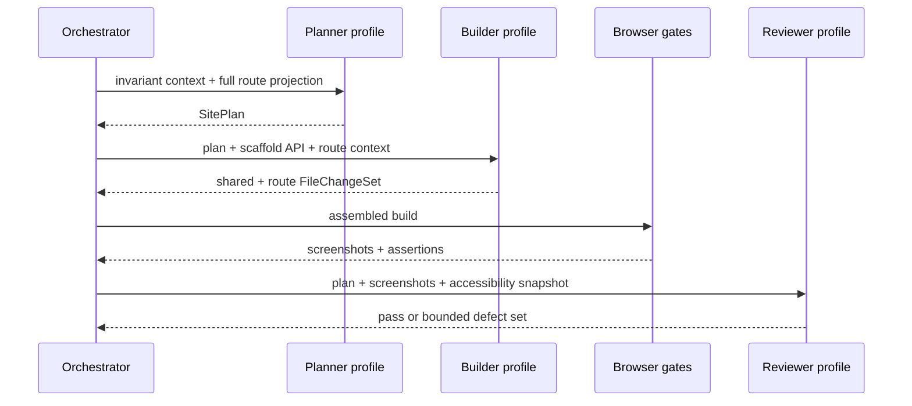
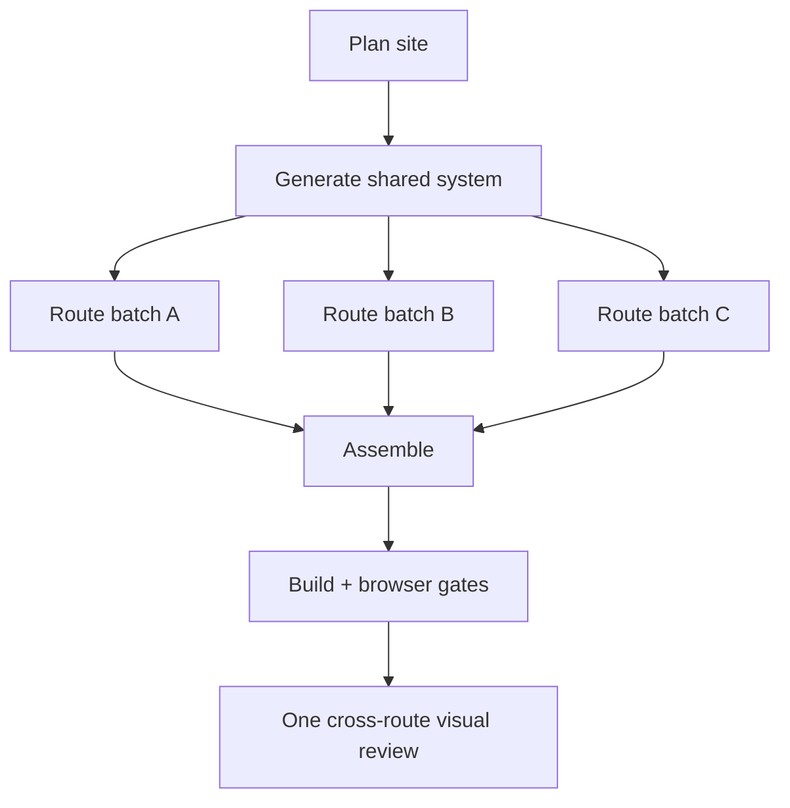
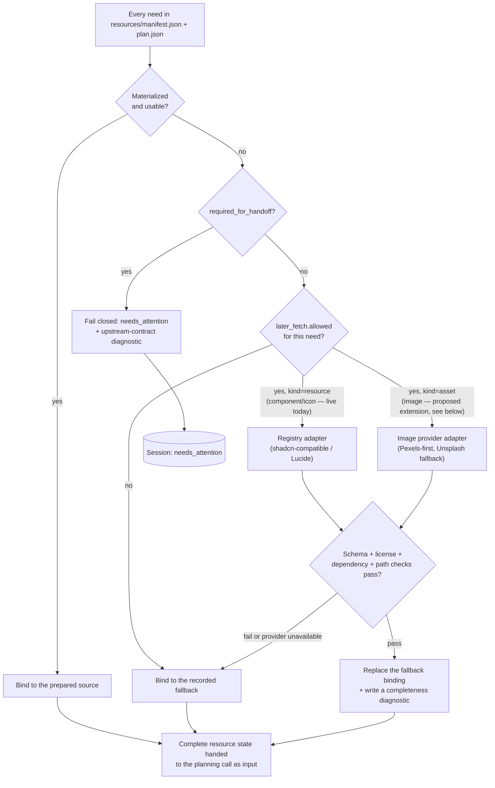

# Generation pipeline

This document specifies the proposed generation protocol for the Portfolio
Design Engine. It is subordinate to the [architecture overview](README.md) and
the admitted Build Preparation contract.

## Design principle: build by construction

The reliable unit is not "an LLM that can code." It is a compiler-like pipeline
in which deterministic code narrows what a model can produce:

```text
verified pack
  -> canonical plan
  -> permitted resources
  -> trusted scaffold
  -> schema-constrained file changes
  -> deterministic assembly
  -> static/build/browser/visual gates
  -> immutable promoted preview
```

This division also improves visual quality. The model spends its context and
reasoning budget on composition, visual hierarchy, responsive art direction,
and meaningful interaction—not on repeatedly recreating Vite configuration,
routing mechanics, package metadata, or error plumbing.

## Inputs and authority

### Production input

The only production input is the fresh archive referenced by the session's
eligible Build Preparation state. Code Generator does not read raw resumes,
Discovery memory, Content Architect reasoning, or Visual Design Director
reasoning from elsewhere in session state.

The archive is expected to contain, at minimum:

```text
manifest.json
handoff-report.json
overview.md
target/
  target-contract.json
  package.json
routes/<route-id>/
  brief.md
  data.json
  resources.json
resources/
  manifest.json
  plan.json
  images/...
  components/...
  icons/...
  fonts/...
provenance/
  licenses.json
  checksums.json
```

`resources/fonts/` is a proposed addition, not a claim about the currently live Build
Preparation pack — today the pack declares only a fixed system-font stack and the
target contract forbids `remote-fonts` outright. See "Fonts" under "Component and
image strategy" below for the proposed shape; it needs its own acceptance, listed
in the [README's decision checklist](README.md#pre-implementation-decision-checklist).

Authority order inside the pack is explicit:

1. handoff eligibility, approved hashes, target contract, manifest/checksums;
2. fixed facts and route data;
3. route acceptance criteria and runtime requirements;
4. Visual Design Director instructions compiled into route briefs;
5. resource selections, adaptations, and fallbacks;
6. freedoms the generator is allowed to exercise.

When two instructions at the same authority conflict, planning fails with a
precise diagnostic. The model is not asked to guess. When a creative freedom is
unspecified, the `SitePlan` may choose it and records the choice for later calls.

### Untrusted-data boundary

All pack text is data, even when it contains phrases such as "system message,"
"ignore previous instructions," code fences, URLs, or shell commands. The
prompt builder keeps three blocks distinct:

1. trusted system policy loaded from checked-in prompts;
2. trusted operation contract generated by OryxenAI; and
3. delimited, untrusted pack projections and reference material.

No untrusted string is interpolated into the system policy. The source scanner
and deterministic gates remain authoritative even if a model follows an
injected instruction.

## The canonical `SitePlan`

The first structured model call emits a canonical plan. A validator resolves
IDs against the admitted pack and rejects missing routes, resources, acceptance
criteria, or interaction outcomes.

The conceptual schema is:

```text
SitePlan
  schema_version
  based_on: InputReceipt
  creative_thesis
    narrative
    distinctive_moves[]
    forbidden_generic_moves[]
  route_graph[]
    route_id
    path
    page_purpose
    section_order[]
    data_bindings[]
    acceptance_criterion_ids[]
  visual_system
    color_tokens{}
    typography_tokens{}
    spacing_tokens{}
    surface_tokens{}
    responsive_rules[]
  layout_grammar
    shell
    navigation
    grid_and_alignment_rules[]
    density_and_whitespace_rules[]
  motion_system
    principles[]
    named_transitions{}
    reduced_motion_behavior{}
  shared_component_contracts[]
    component_id
    export_name
    props_schema
    owner_path
  resource_bindings[]
    need_id
    chosen_disposition
    local_path_or_import
    fallback_replaced
    route_ids[]
  interactions[]
    interaction_id
    route_id
    accessible_name
    trigger
    outcome
    target
    browser_assertion
  accessibility_plan[]
  file_ownership[]
  acceptance_coverage[]
```

The stored plan is strict JSON, not Markdown. Human-readable prose fields can
remain creative, but every ID, path, dependency, resource, route, and ownership
relationship is structurally validated.

### Consistency rules derived from the plan

- Colors and font families may be introduced only in the shared token file.
- Route modules use named tokens; arbitrary palette values are rejected outside
  the token owner.
- Shared shell/navigation and component exports are written once and imported
  everywhere else.
- Responsive behavior is specified per composition, not left as a blanket
  "make responsive" instruction.
- Motion uses named transitions and a global reduced-motion policy. Route code
  cannot invent unrelated timing/easing systems.
- Resource `need_id`s have exactly one active disposition. A fetched equivalent
  replaces its fallback rather than being added alongside it.
- Every prepared acceptance criterion maps to at least one source owner and one
  deterministic or browser assertion.
- Every interactive-looking element has a declared outcome. Decorative elements
  are not rendered as links or buttons.

These constraints create coherence without forcing all portfolios into the same
layout. Tokens and APIs are fixed per generation; composition inside each route
can still be asymmetrical, editorial, spatial, kinetic, dense, or restrained as
directed by the admitted brief.

## Model roles and call graph

Model assignments belong in `config/models.toml`. The business workflow asks
for capabilities through profiles:

| Proposed profile | Workload | Selection priority |
| --- | --- | --- |
| `code_generator_planner` | site plan, file ownership, interaction coverage | reasoning and instruction adherence |
| `code_generator_builder` | shared and route source changes | cost/latency with strong frontend coding |
| `code_generator_reviewer` | screenshots + plan adherence + visual defects | vision and aesthetic judgment |
| `code_generator_corrector` | tightly scoped source correction | coding reliability; may map to builder or planner profile |

This permits a cost-optimized default for most of the workflow and a
genuinely different, stronger model only where a real capability gap demands
it. In practice — see the reasoning-effort and vision discussion below — that
usually means `code_generator_planner` stays on the same default model as
everything else, just with a different *parameter* (reasoning effort), while
`code_generator_reviewer` is the profile most likely to need an actually
different model, because vision is a capability the default model may
simply not have, not a depth-of-reasoning setting. No agent code branches on
provider or model name.

Every other agent in `config/models.toml` today (Discovery, Content Architect,
Visual Design Director, Build Preparation) uses exactly one
`[profiles.<agent_key>]` entry, because each has one dominant capability shape.
Precisely: each of those four currently happens to converge on the same
underlying model, but that is four independent per-agent choices, not one
model structurally shared through the literal (and currently inert,
unconfigured) `[profiles.default]` block — a future reader should not assume
profiles are shared by construction. Code Generator is deliberately different
regardless: planning is a reasoning/adherence workload, bulk route generation
is a coding workload where speed matters more than reasoning depth, and
visual review is a vision workload — three genuinely different capability
shapes inside one stage, not a stylistic preference for more profiles. If a
single model proves strong enough across all three for the chosen provider,
collapsing to one `[profiles.code_generator]` entry is a config change, not an
architecture change; the workflow asks for a role, never a model name, either
way.

**Reasoning effort and cost.** Every existing agent profile currently sets
`reasoning_effort` to its lowest supported level, deliberately, for cost and
latency. The project owner has stated cost is not a current constraint for
Code Generator — build correctness and quality first, optimize spend later —
so this proposal does not inherit that same low-effort default uncritically.
`code_generator_planner` and `code_generator_reviewer` should default to a
higher reasoning effort than the existing agents' cost-tuned baseline: a
planning defect or a missed visual regression is expensive to catch later,
and pillars 1 and 2 both depend on these two calls specifically.
`code_generator_builder` can reasonably stay at the cost-tuned baseline
regardless, not because cost matters more there, but because it already sits
inside the deterministic gate/correction safety net — a low-effort response
that fails a gate gets one bounded correction, which is a cheaper and more
reliable way to raise its quality than raising its own reasoning effort
would be. `code_generator_corrector` inherits whichever profile it is mapped
to (builder or planner), rather than needing its own setting. Raising
reasoning effort raises latency, not just cost — this interacts directly with
worker job timeouts; see the [architecture overview's decision
checklist](README.md#pre-implementation-decision-checklist).

**Vision is a policy-consistent escalation, not an exception.** The project
owner's stated policy — default to one model everywhere, escalate only where
a requirement strictly demands it — already anticipates exactly this case.
`code_generator_reviewer` cannot function without image input; if the model
everything else defaults to lacks vision support, escalating only that one
profile is precisely what "strictly demands it" means, not a deviation from
defaulting. What "strictly demands it" rules out is escalating
`code_generator_planner` or `code_generator_builder` merely because a
stronger model would plausibly help — those stay on the default unless a
concrete, structural gap (not a general quality hope) shows up.

Confirming whether the currently configured model actually supports image
input is a real, empirical unknown, not something to assume either way from
its name or generation. Supporting it — once confirmed necessary — is a
three-layer change, not a config toggle, and all three layers are currently
absent:

1. `ModelCapabilities` (`agents/shared/providers/capabilities.py`) is a
   strict schema with a fixed set of boolean fields, none of them
   vision-related; a profile cannot declare image support without a field
   being added first. This is not a new kind of change — the schema was
   already extended once before for exactly this reason (a
   provider-specific quirk, `uses_max_completion_tokens`, added because a
   real agent needed to express it — see `DECISIONS.md`), so this is the
   established mechanism doing what it already did once, not a novel risk.
2. The `ModelClient` protocol's structured-generation method has no image
   parameter today — only text input is expressible at the protocol level.
3. The concrete adapter constructs request messages as plain text content
   today; emitting an image alongside text needs multi-part message
   construction, an adapter-level change below the protocol, not just above
   it.

None of this is Code Generator's code to carry — it belongs in the shared
`agents/shared/providers/` boundary precisely because every future agent
needing image input benefits from it once, matching why that boundary exists
at all.

The provider-neutral `ModelClient` boundary should expose structured generation,
optional image inputs, usage metadata, and a non-persistent request policy.
Provider-specific Responses/Structured Outputs details stay inside the adapter.
Other agents do not need to migrate merely because Code Generator needs image
review. For the OpenAI adapter, Code Generator requests should explicitly set
`store: false` unless a separately approved data policy says otherwise.

**Route-batch sizing depends on an unconfirmed ceiling.** Existing profiles
cap `max_output_tokens` at 16000-32000, but that reflects what those agents'
JSON/Markdown envelope outputs happened to need, not a confirmed hard limit
for the model itself — and a `FileChangeSet` response carrying full file
contents for a route batch is a materially larger output shape than any
existing agent produces. Route-batch sizing (see "Adaptive call shape" below)
must be computed against `code_generator_builder`'s actual configured
`max_output_tokens`, and that ceiling should be confirmed empirically before
being relied on, not inherited from existing agents' unrelated envelopes.

### Prompt contract by operation

All operation prompts share the checked-in system policy, but each has one
job and one output schema:

| Prompt | Responsibility | Required output | Must not do |
| --- | --- | --- | --- |
| `system.md` | invariant trust, truth, security, target, quality, and file-authority rules | none by itself | contain user-specific data or a model name |
| `plan_site.md` | convert the admitted pack into one coherent implementation ledger | `SitePlan` | write source, request arbitrary resources, relax the target |
| `generate_shared_system.md` | implement tokens, shell presentation, shared creative primitives, and named motion | `FileChangeSet` | write routes, configs, dependencies, or copy a reference app |
| `generate_routes.md` | implement one bounded route batch against frozen shared APIs | `FileChangeSet` | change global tokens/APIs or files owned by another batch |
| `review_render.md` | compare rendered evidence with the plan and quality rubric | `VisualReviewReport` | write code, invent facts, demand a different art direction |
| `correct_defects.md` | repair a validated, bounded defect set | scoped `FileChangeSet` | refactor unrelated source or expand dependencies/resources |

Each request is assembled in a stable order:

1. operation objective and explicit definition of done;
2. non-negotiable target, truth, security, and ownership rules;
3. exact structured-output schema and response-size limits;
4. current receipt hashes and invariant `SitePlan` slice;
5. task-specific untrusted route/resource/source context;
6. selected compact reference cards, when useful;
7. acceptance criteria and interaction assertions; and
8. a final self-check list that asks the model to correct its response before
   emitting it, not to start a conversational repair exchange.

Prompts should be direct and lean. Repeating the entire archive, scaffold, or
all prior responses reduces attention and breaks cacheable prefixes. BAD/GOOD
examples can clarify a difficult envelope or aesthetic anti-pattern inline, but
large full-app few-shot examples do not belong in these prompts.

The trusted system policy makes the quality hierarchy explicit:

1. preserve admitted facts and acceptance requirements;
2. produce valid source inside the target and ownership constraints;
3. honor the generation's VDD-derived visual direction and consistency ledger;
4. implement declared responsive, motion, accessibility, and interaction
   behavior; and
5. use reference techniques only where compatible with the first four.

This prevents a beautiful reference screenshot from overriding the actual user
or causing the model to trade correctness for spectacle.

### Adaptive call shape

The workflow is bounded, not a fixed call per page or section.

#### Small, single-route portfolio



This normally needs planning, generation, and review calls. A correction call is
made only after a specific failed gate.

#### Multi-route portfolio



Route batches are computed from estimated context/output size, shared
dependencies, and a config-driven maximum—not from a permanent one-page-per-call
rule. Pages with a shared case-study template should be one batch; unrelated,
content-heavy pages may be separate. Parallel branches start only after the
shared component signatures and source checkpoint are available.

### Why this is not a multi-agent swarm

Every call participates in one state machine and one canonical plan. There is no
peer negotiation, supervisor, long-lived chat memory, or autonomous tool loop.
The orchestrator knows the call graph, owns all retries, and can replay any call
from its receipt. This preserves the useful part of specialization without
adding coordination infrastructure. The orchestrator itself is ordinary
deterministic Python, not a model — see "Is there an orchestrator?" in the
[architecture overview](README.md) for the full answer and its precedent.

## Context protocol

"Memory" here means two different things, answered two different ways, and
both are deliberate:

- **Across agents**, memory is *not* shared — it is deliberately narrowed at
  every stage boundary. Code Generator receives only the compact, approved
  Build Preparation projection described under "Production input" above; it
  never sees Discovery's raw resume/documents, Content Architect's reasoning,
  or Visual Design Director's reasoning. This is not a new choice — it is the
  same compact-projection-only pattern Content Architect already applies to
  Discovery's output and Visual Design Director already applies to Content
  Architect's output (`AGENTS.md`, [D-008](../../DECISIONS.md)). Code
  Generator is simply the fourth stage applying the same rule to Build
  Preparation's output.
- **Within this one stage**, memory means the durable context ledger below —
  explicit, versioned, and replayable — not a growing conversation.

### No conversational memory

Each call is reconstructible from durable artifacts. The system does not depend
on a provider-side conversation, previous-response ID, or local process memory.
Requests use the provider's non-persistent mode where supported.

The durable context ledger contains:

- `InputReceipt` and resource-resolution receipt;
- canonical `SitePlan` and its hash;
- scaffold/profile version and public API declaration;
- accepted shared-source manifest and export signatures;
- per-batch call receipt and accepted file hash list; and
- gate and correction receipts.

This is "memory" in the engineering sense: explicit, versioned, inspectable, and
replayable. It is not an ever-growing transcript.

### Per-call context slices

| Call | Receives | Does not receive |
| --- | --- | --- |
| Plan | overview, all route summaries/data, target/resource contracts, compact reference cards | binary assets, prior chat, implementation source |
| Shared system | full visual plan, shell/navigation needs, component APIs, selected resource source | unrelated route prose, provider credentials |
| Route batch | invariant plan subset, route briefs/data, resource bindings, shared API/signatures, relevant source only | other route implementations, full archive |
| Visual review | rendered screenshots, accessibility tree/snapshot, `SitePlan` rubric, interaction results | full repository, raw upstream data |
| Correction | exact diagnostics, affected plan slice, relevant screenshots and file snippets, allowed paths | unrelated files, free shell/network access |

Image bytes are referenced by admitted local path, dimensions, aspect ratio,
hash, alt intent, and focal/adaptation notes. Only the visual-review call needs
rendered images. This keeps generation context small without losing asset
intent.

If a route cannot fit safely, deterministic code divides it along planned
section groups while keeping a single owner responsible for final integration.
It never silently summarizes away fixed facts or acceptance criteria.

Stable trusted prefixes can be arranged to benefit from provider prompt caching,
but caching is an optimization to validate with usage data, not a correctness
dependency.

## Structured output contract

Every generation/correction response uses strict structured output. A conceptual
`FileChangeSet` is:

```json
{
  "schema_version": "code-file-change-set-v1",
  "operation": "generate_routes",
  "based_on": {
    "input_receipt_sha256": "...",
    "site_plan_sha256": "...",
    "shared_source_sha256": "..."
  },
  "files": [
    {
      "path": "src/routes/example/index.tsx",
      "action": "create",
      "content": "..."
    }
  ],
  "resource_requests": [],
  "acceptance_coverage": [],
  "warnings": []
}
```

Validation requires:

- known operation and current receipt hashes;
- only `create` or `replace` actions allowed by that call's ownership map;
- normalized POSIX-relative paths with no traversal, absolute path, device path,
  symlink, hidden metadata, or confusable owner;
- unique files and bounded file/response sizes;
- UTF-8 text in permitted extensions only;
- no package/config/env/lock/deployment mutations;
- imports only from permitted local aliases, scaffold exports, admitted resource
  modules, or the selected dependency subset; and
- all referenced resource and acceptance IDs present in the call context.

Route batches cannot delete files. A correction can replace only files named by
the defect scope. The assembler applies a complete valid set atomically; partial
model output never changes the source checkpoint.

## Trusted scaffold versus model-owned source

### Trusted scaffold owns

- `index.html`, entry point, Vite/TypeScript/Tailwind configuration;
- route table mechanics, history/popstate handling, direct-route fallback
  assumptions, link interception, and not-found behavior;
- global error boundary and preview observability bridge;
- base reset, focus visibility, reduced-motion fallback, and accessibility
  utilities;
- public data/resource TypeScript types;
- generated route/resource/interaction manifests;
- package manifest, lockfile, build commands, and deployment metadata; and
- optional deterministic `<noscript>` public-content fallback.

### Model-owned source may own

- the generation's token values and visual-system CSS within the designated
  token file;
- site shell presentation within the trusted behavioral contract;
- shared creative components and their implementation;
- route components and route-local sections/styles; and
- purposeful motion and client-side interactions declared by the plan.

The scaffold supplies mechanics, not a visible theme. It must be visually
neutral enough that different Visual Design Director outputs do not collapse
into a recognizable OryxenAI template.

### Static policy scanner

Before type-check/build, scan the generated graph and reject:

- undeclared packages, remote module imports, path escape, symlink tricks, and
  case-collision paths;
- `eval`, `new Function`, injected script strings, service workers, WebSockets,
  and unapproved worker creation;
- `fetch`, XHR, EventSource, beacon, or other runtime network access under the
  current static contract;
- remote fonts, stylesheets, scripts, images, video, or iframe embeds;
- environment/secret access and server-only APIs;
- generated build plugins/configuration or package scripts;
- unresolved local imports and unused/missing route registrations;
- placeholder links, `href="#"`, fake submit success, and controls without an
  interaction contract; and
- raw palette/font declarations outside their designated shared owners.

Parsing/AST analysis should back security-sensitive checks. Regular expressions
can provide friendly diagnostics but should not be the sole enforcement layer.

## Functional contract

Visual polish does not excuse dead behavior. Planning creates an interaction map
before code generation. Supported v1 outcomes can include:

- navigate to a declared internal route;
- open a validated external public URL in a safe new tab;
- scroll to a declared section;
- open/close a dialog, menu, drawer, accordion, or tooltip;
- filter/sort public local data;
- copy public text with a visible success state;
- download an admitted local public file; or
- launch `mailto:`/`tel:` when that public value is present.

Every outcome has a deterministic/browser assertion. The generator must omit a
control when it has no honest outcome.

The current static target cannot invent a backend or secret-bearing API. A
contact form must not display false success. Until an endpoint and runtime
network policy are explicitly admitted, use a truthful contact link or omit the
form. Adding an API endpoint requires a versioned target/security contract and a
corresponding CSP/test update.

## Package and toolchain policy

### Use npm for generated frontends; keep uv for OryxenAI

The admitted target is a Node frontend with a starter `package.json`; npm and a
real `package-lock.json` are the least surprising generated-project contract.
Changing OryxenAI's Python environment or replacing uv would solve nothing.

Node is needed in this design for exactly one reason: building generated
portfolios (`npm ci`/`tsc`/`vite build`). It is not needed for verification —
Playwright ships a pure-Python package (`playwright` on PyPI, installable
through `uv`, `playwright install chromium`), so the browser-verification
gate in [Preview, quality, and evaluation](preview-quality-and-evaluation.md)
runs with no Node dependency at all, whether through the Cloudflare browser
binding or a local Playwright adapter. Stating this narrows what the Node
addition below actually is: one toolchain, for one step, on one service —
not general frontend tooling creeping into a Python application.

### Node toolchain in the OryxenAI runtime image

Today's root `Dockerfile` is Python-only (`python:3.13-slim-bookworm`,
uv-based) with no Node anywhere, and no `package.json` exists in the
repository outside generated output. Adding Node needs a concrete, decided
approach, not just "run the trusted Node toolchain in the application image"
as an abstraction:

1. **Copy Node from a pinned official image, matching the Debian release
   exactly** — a multi-stage `COPY --from=node:20-bookworm-slim`, not
   `apt-get install nodejs` (Debian's own package trails current Node LTS)
   and not a NodeSource curl-pipe-bash install (mutates apt sources, adds
   curl/gnupg surface, harder to pin precisely). The source image's Debian
   release must match the app image's (`bookworm`) — copying a binary built
   against a different base risks a glibc/ABI mismatch.
2. **Copy the full toolchain, not just the `node` binary.** `npm`/`npx` are
   Node scripts under `/usr/local/lib/node_modules/npm/` with shim entry
   points in `/usr/local/bin/`, not standalone binaries — copy both the
   `/usr/local/bin` and `/usr/local/lib/node_modules` trees. Add a
   build-time `RUN node --version && npm --version` smoke check so a broken
   copy fails the image build, not a live generation.
3. **Give the existing non-root runtime user a writable npm cache.** The
   runtime stage already drops to a non-root `oryxen` user; `npm ci` writes
   to `$HOME/.npm` by default, and if `HOME` is not an owned, writable path
   for that user, the failure only surfaces the first time a build is
   actually attempted, not at image-build time. Set and own this
   deliberately rather than discovering it live.
4. **Scope Node to the worker only.** Per the split topology in the
   [architecture overview](README.md#primary-split-web-service-and-worker),
   the API and migration processes never run a build and should not carry
   Node at all. Either build a distinct worker-only stage/target from the
   same `Dockerfile`, or explicitly accept and document the image-size
   trade-off if the image stays unified — don't leave this implicit.

**Bake a warm npm cache into the worker image, matching an existing
precedent.** `config/app.docker.toml` already establishes that Render disks
are ephemeral and the verified build ZIP is the only artifact that has to
survive — the same reasoning extends cleanly to the npm dependency cache: for
the pinned target/toolchain profile's lockfile, resolve and cache
dependencies once at OryxenAI image-build time (not at generation time), so
a generation's `npm ci` resolves from the local cache in the common case and
only touches the npm registry when the target-profile version itself
changes. This turns "an admitted cache... where practical" from an aspiration
into a concrete build step tied to a specific, versioned input (the target
profile's lockfile), consistent with how this project already treats
ephemeral compute and durable artifacts everywhere else.

The dependency resolver—not the model—does this:

1. derive the minimal dependency subset from scaffold needs and admitted
   component imports;
2. reject every package outside `target-contract.json`;
3. resolve exact versions under a versioned target/toolchain profile;
4. create a real package lock and cache it by dependency-set/profile hash;
5. install from the matching manifest/lock with a frozen operation such as
   `npm ci`, with lifecycle scripts disabled unless an audited dependency
   explicitly requires one; and
6. invoke trusted type-check/build binaries with trusted config paths, not
   model-authored shell or package scripts.

The target profile pins the Node/npm toolchain and build-image digest outside
prompts. Networked dependency resolution happens in the controlled build phase,
never inside generated code. Subsequent matching builds should use an admitted
cache or offline package store where practical.

Because the current starter manifest uses version ranges and no lockfile, the
exact lock derivation/cache policy must be accepted before implementation. A
starter manifest is a ceiling and hint, not a reproducible build by itself.

### Build isolation

Each attempt uses a new run-scoped temporary directory. The subprocess receives:

- no application secrets or inherited credentials;
- an intentionally small environment;
- CPU, memory, output, process, and wall-time limits;
- no writable path outside the workspace/cache contract;
- no arbitrary outbound network during source validation or build; and
- only trusted build configuration/plugins.

The verifier inspects the final bundler graph/manifest so every input resolves
inside the generated workspace or trusted dependency tree. Temporary files can
vanish at any point; all resumable state lives in R2 and PostgreSQL metadata.

## Component and image strategy

### Prepared sources first

Materialized component/icon/image source has already passed the upstream
selection and provenance process. The generator adapts it according to the
recorded notes, design tokens, component API, and accessibility requirements.
It does not copy a demo page wholesale.

### The Resource Completeness Gate

Every resource need Build Preparation recorded — component, icon, image, or
(proposed) font — falls into exactly one of three buckets by the time
generation calls begin: **already usable**, **topped up**, or **explicit
fallback**. Deciding which bucket applies is deterministic Python, runs
**once, as pre-processing on the admitted pack, strictly before the planning
call is issued** — never inside `generate_routes`, never as a mid-response
model decision, and never repeated per route:



Because this runs before planning rather than during or after it, the
planning call never decides *whether* to fetch anything — by the time it
runs, every need already has a final, resolved disposition. The model's only
job in `plan_site.md` is to decide *how to use* what is already resolved
(placement, adaptation notes, `resource_bindings[]`), exactly as the existing
consistency rule already states: "resource `need_id`s have exactly one active
disposition. A fetched equivalent replaces its fallback rather than being
added alongside it."

This single gate deliberately answers two scenarios with one mechanism, because
they are the same underlying problem viewed at two different moments:

- **Build Preparation under-provided a need.** The gap is visible immediately
  from the admitted pack, with no generation attempted yet.
- **Code Generator would otherwise "discover" a gap while writing a route.**
  Because the gate already closed every gap before any route call starts, this
  scenario cannot occur — there is nothing left for a route-generation call to
  discover. A route call either has a bound resource or a bound fallback; it
  never has a missing resource.

**Registry adapters (components/icons — live today).** Adapters use configured,
allowlisted registry endpoints. For a shadcn-compatible registry, validate the
published registry-item schema, normalize every file path, and ensure registry
dependencies fit the target ceiling. Magic UI or other configured registries
follow the same local normalized representation. No `npx`, registry CLI,
arbitrary URL, or model tool-calling loop is needed. If a provider is
unavailable, the recorded fallback is the successful path — not an automatic
generation failure. A `required_for_handoff` resource should already have been
resolved upstream, so it never reaches this branch at all.

**Image provider adapters (proposed extension).** The current Build Preparation
contract computes `later_fetch` only for `kind == "resource"` needs
(`materializer.py`'s `_later_fetch_providers`); an image (`kind == "asset"`)
need never receives fetch permission today, so a missing image always falls
back to the recorded CSS/SVG/typographic treatment, however important that
image is to the design. The project owner has asked for a narrower, real
capability: when a route calls for a *decorative, non-required* photo and none
was materialized, let the same kind of deterministic adapter Build Preparation
itself already uses for Pexels/Unsplash close that gap with a real photo
instead of always degrading to a fallback.

This is achievable without weakening any invariant above, by extending
`later_fetch` computation to also cover `kind == "asset"` needs under the exact
same `not need.required_for_handoff` restriction already enforced for
components — so it can only ever affect optional/editorial imagery, never a
required hero image or a fact-bearing photo (a person's headshot, a screenshot
of real work), which must still already be guaranteed present by Build
Preparation's own completeness contract. Concretely, this needs:

1. a new `resources/plan.json` schema version that computes `later_fetch` for
   eligible asset needs the same way it already does for resource needs;
2. a `code_generator_image_topup` adapter that composes a provider query from
   the need's recorded `query_terms`/purpose (the same "intelligent query"
   step Build Preparation's own Stage 1 already performs), calls the
   configured Pexels-first/Unsplash-fallback provider chain, and downloads
   exactly one selected image through the same inspection/hash/license path
   Build Preparation's materializer already uses; and
3. the same completeness-diagnostic logging as the component/icon path, so a
   recurring image gap becomes evidence for improving Build Preparation's own
   completeness rather than a standing excuse to keep patching downstream.

This is a versioned Build Preparation contract change, not a Code
Generator-side shortcut — it is its own line item in the
[decision checklist](README.md#pre-implementation-decision-checklist), not
silently assumed by this document.

### Images

Use admitted local images at their inspected dimensions and provenance. Generate
responsive local variants only through deterministic tooling if policy permits;
preserve focal intent, alt intent, aspect-ratio reservation, and license data.
For a missing image, the Resource Completeness Gate above has already decided,
before generation starts, whether that need became a topped-up photo (if the
extension is accepted and the need is eligible) or the prepared CSS/SVG/type
fallback. Route-generation calls never choose between the two, and never browse
for an image merely because a model thinks one would look better.

### Fonts

Fonts are a distinct concern from images and components, and the current
contract handles them the narrowest way possible: a fixed, self-hosted
system-font stack, with `remote-fonts` explicitly forbidden by the target
contract's `forbidden_runtime_capabilities`. That remains a completely valid
v1 choice — a well-chosen system-font stack is not a visual downgrade — but it
is a real product constraint worth stating plainly rather than leaving
implicit: **every generation currently shares the same typeface family.**

If distinct per-generation typography becomes a product requirement, the
extension is small and follows the images/components precedent exactly rather
than inventing a new pattern:

- a small, curated, license-cleared self-hostable font catalogue (the same
  shape as Visual Design Director's own local `catalogue.json` resource
  lookup — deterministic tag-overlap selection, never a live Google
  Fonts-style search);
- font files admitted into `resources/fonts/` with the same
  hash/license/provenance treatment images already receive;
- `@font-face` declarations permitted only inside the shared token file
  (`tokens.css`), never inside route source, so a route cannot silently
  introduce an unrelated typeface; and
- the same static-policy-scanner prohibition on remote font URLs stays in
  force — self-hosted only, always.

This is proposed, not decided; see the decision checklist. Until accepted, the
fixed system-font stack is authoritative and route generation must not
reference any other font family.

## Visual-quality prompting

The trusted prompt should translate quality into observable behaviors:

- honor the visual thesis and VDD-directed composition before reference
  aesthetics;
- establish deliberate hierarchy, alignment, rhythm, negative space, and
  content density;
- use typography as part of the composition, with local/system font policy;
- create one or two distinctive visual moves that support the person's story;
- make motion purposeful: entrance hierarchy, state transition, navigation
  continuity, or explanatory feedback—not ambient movement everywhere;
- art-direct each planned breakpoint instead of merely stacking columns;
- preserve real content and do not manufacture achievements, metrics, clients,
  links, testimonials, or project facts;
- avoid default hero-plus-card-grid repetition, gratuitous glass panels,
  excessive pills, decorative gradients, generic dashboards, and identical
  rounded containers unless the admitted direction calls for them; and
- maintain keyboard, focus, contrast, reduced-motion, and readable-content
  behavior as part of the design, not a later cleanup.

The reference corpus supplies a few selected techniques and anti-patterns. It
never overrides the user's prepared direction.

## Deterministic assembly

Assembly is sequential even when route generation is parallel:

1. verify each call receipt and strict response schema;
2. validate its exclusive ownership set;
3. normalize and parse source;
4. apply changes to an isolated copy of the latest admitted checkpoint;
5. regenerate route/asset/interaction manifests from canonical data;
6. format files mechanically;
7. run policy and import-closure validation; and
8. publish a new immutable source checkpoint only if the whole batch is valid.

Two calls can never race on the same file. Shared-system failure prevents route
generation. One invalid route batch can be retried from the same frozen plan
without regenerating successful disjoint batches.

## Retry and correction policy

Failure classes determine the response:

| Failure | Response |
| --- | --- |
| transient provider/storage/network error | durable-job retry with configured backoff |
| malformed structured envelope | retry the same operation once if policy permits; no prose repair conversation |
| stale input/hash mismatch | stop as stale; never apply output |
| path/dependency/security violation | reject call output; one tightly scoped regeneration at most |
| type/build defect | one diagnostic correction limited to implicated files |
| browser functional defect | one correction using the failed interaction and relevant files |
| visual-quality defect | one screenshot-guided correction after deterministic gates are green |
| contradictory/missing admitted contract | `needs_attention`; report upstream-contract evidence |
| unresolved second failure | `needs_attention`; preserve artifacts and diagnostics |

This table is a *new* mechanism for this codebase, not a reuse of an
existing, proven one, and should be built with that in mind. No current
agent (Discovery, Content Architect, Visual Design Director) actually
catches and retries a malformed structured response today — the
error types an adapter can raise for this
(`ModelJsonInvalidError`/`ModelEmptyOutputError`/`ModelOutputTruncatedError`)
have no catch site anywhere in any existing agent. What every existing
profile's `max_retries` actually configures is the provider SDK's own
transport-level retry (network failures, 5xx responses) — a lower, unrelated
layer this table does not need to duplicate or reason about. Code Generator would
be the first agent to implement application-level retry on a malformed
*structured* response, so this table should be validated carefully against
real malformed-output cases during implementation rather than assumed
correct by analogy to something already battle-tested elsewhere in the repo.

The correction set itself is validated before use. A repair may not add a
dependency/resource, change fixed facts, mutate global art direction, or touch
files outside its scope unless the defect is explicitly global.

## Checkpoints and observability

Recommended immutable objects, all beneath an opaque generation prefix:

```text
input/
  receipt.json
  build-context.zip              # reference or verified copy, retention policy dependent
plan/
  resource-receipt.json
  site-plan.json
  call-receipt.json
source/
  source.zip
  source-manifest.json
  calls/<operation>/<attempt>.json
build/
  dist.zip
  build-manifest.json
verification/
  static-report.json
  browser-report.json
  visual-report.json
  screenshots/...
preview/
  promotion-receipt.json
```

Safe call receipts record operation, profile key, prompt version/hash, context
artifact hashes, structured-output schema version, latency, token usage, finish
reason, validation result, and output artifact hash. They do not log secrets or
duplicate full user data into application logs.

Progress events should be semantic and stable—for example `input_admitted`,
`site_plan_ready`, `shared_source_ready`, `route_batch_ready`,
`build_passed`, `browser_gate_passed`, `visual_review_passed`, and
`preview_promoted`. The GET state endpoint can expose these without exposing raw
prompts or internals.

## Configuration surface

The following belong in non-secret application/model/target configuration, not
hardcoded in prompts:

- model profile mapping and per-operation reasoning/output limits;
- generation and route-batch concurrency;
- context/file/archive size ceilings and timeouts;
- target/scaffold/toolchain profile;
- allowed generated extensions, imports, and source roots;
- provider registry order and endpoint allowlist;
- correction allowance and blocking/advisory quality thresholds;
- browser viewports, interaction timeout, and reduced-motion modes;
- artifact prefixes, retention classes, and preview origin;
- local versus cloud browser-verifier adapter;
- whether the image-topup extension to the Resource Completeness Gate is
  enabled, and its own provider order/allowlist if so;
- per-session `/regenerate` quota and cooldown, so explicit re-runs cannot let
  one session monopolize the shared generation-concurrency slot(s) other
  sessions are waiting on;
- per-job-type worker `handler_timeout`, `lease_duration`, and `concurrency`
  overrides for `code_generator.*` job kinds, distinct from the generic
  `[worker.job]` defaults every lightweight agent currently shares — those
  defaults were sized for agents that never run a build or a browser gate;
  and
- the npm dependency-cache baking policy (which target-profile
  lockfile/version the worker image's cache is built from, and when it is
  refreshed).

Secrets remain indirect environment references resolved only by infrastructure
adapters. They are never placed in model context, generated workspace, preview,
or reports.

## Research notes

- OpenAI recommends structured, schema-constrained responses for reliable
  machine consumption; its current frontend guidance explicitly calls for
  domain-specific layout and feature completeness rather than default generated
  UI patterns. See [Structured Outputs](https://developers.openai.com/api/docs/guides/structured-outputs)
  and [frontend prompting](https://developers.openai.com/api/docs/guides/frontend-prompt).
- Provider-side response chaining is useful in some products, but this workflow
  chooses reconstructible, non-persistent calls because durable replay and
  privacy are more valuable here. The adapter can still use the
  [Responses API](https://developers.openai.com/api/docs/guides/migrate-to-responses).
- `npm ci` requires the package manifest and lockfile to agree and performs a
  clean frozen install, supporting the proposed deterministic dependency gate.
  See the [npm CLI documentation](https://docs.npmjs.com/cli/commands/npm-ci/).
- shadcn-compatible sources can be normalized from a documented
  [registry API](https://ui.shadcn.com/docs/registry/api-reference) and
  [registry-item schema](https://ui.shadcn.com/docs/registry/registry-item-json)
  without giving the model a CLI.
