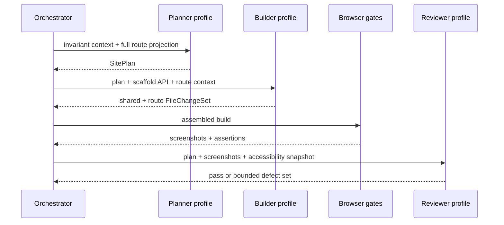
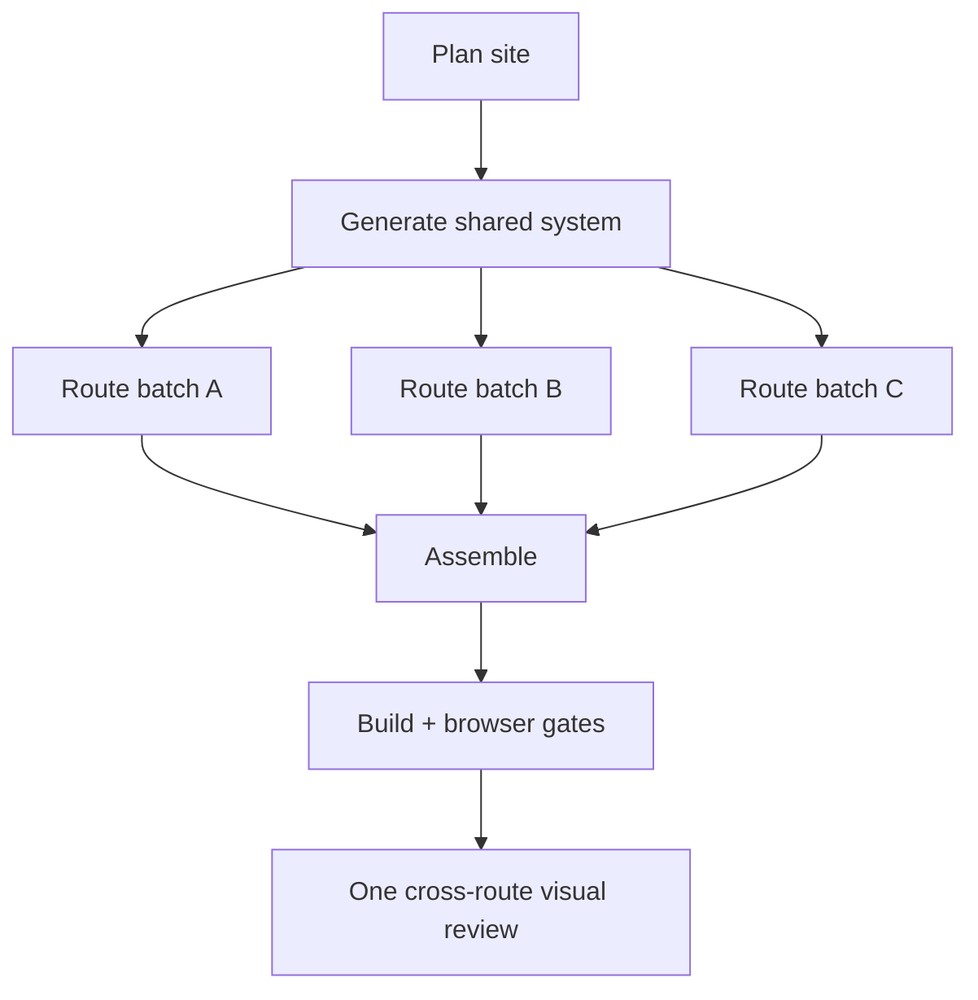
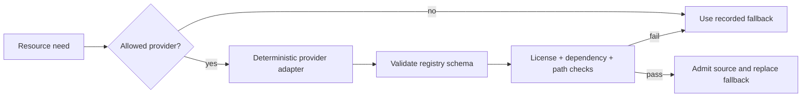

# Generation pipeline

This document specifies the proposed generation protocol for the Portfolio
Design Engine. It is subordinate to the [architecture overview](README.md) and
the admitted Build Preparation contract.

## Design principle: build by construction

The reliable unit is not "an LLM that can code." It is a compiler-like pipeline
in which deterministic code narrows what a model can produce:

```text
verified pack
  -> canonical plan
  -> permitted resources
  -> trusted scaffold
  -> schema-constrained file changes
  -> deterministic assembly
  -> static/build/browser/visual gates
  -> immutable promoted preview
```

This division also improves visual quality. The model spends its context and
reasoning budget on composition, visual hierarchy, responsive art direction,
and meaningful interaction—not on repeatedly recreating Vite configuration,
routing mechanics, package metadata, or error plumbing.

## Inputs and authority

### Production input

The only production input is the fresh archive referenced by the session's
eligible Build Preparation state. Code Generator does not read raw resumes,
Discovery memory, Content Architect reasoning, or Visual Design Director
reasoning from elsewhere in session state.

The archive is expected to contain, at minimum:

```text
manifest.json
handoff-report.json
overview.md
target/
  target-contract.json
  package.json
routes/<route-id>/
  brief.md
  data.json
  resources.json
resources/
  manifest.json
  plan.json
  images/...
  components/...
  icons/...
provenance/
  licenses.json
  checksums.json
```

Authority order inside the pack is explicit:

1. handoff eligibility, approved hashes, target contract, manifest/checksums;
2. fixed facts and route data;
3. route acceptance criteria and runtime requirements;
4. Visual Design Director instructions compiled into route briefs;
5. resource selections, adaptations, and fallbacks;
6. freedoms the generator is allowed to exercise.

When two instructions at the same authority conflict, planning fails with a
precise diagnostic. The model is not asked to guess. When a creative freedom is
unspecified, the `SitePlan` may choose it and records the choice for later calls.

### Untrusted-data boundary

All pack text is data, even when it contains phrases such as "system message,"
"ignore previous instructions," code fences, URLs, or shell commands. The
prompt builder keeps three blocks distinct:

1. trusted system policy loaded from checked-in prompts;
2. trusted operation contract generated by OryxenAI; and
3. delimited, untrusted pack projections and reference material.

No untrusted string is interpolated into the system policy. The source scanner
and deterministic gates remain authoritative even if a model follows an
injected instruction.

## The canonical `SitePlan`

The first structured model call emits a canonical plan. A validator resolves
IDs against the admitted pack and rejects missing routes, resources, acceptance
criteria, or interaction outcomes.

The conceptual schema is:

```text
SitePlan
  schema_version
  based_on: InputReceipt
  creative_thesis
    narrative
    distinctive_moves[]
    forbidden_generic_moves[]
  route_graph[]
    route_id
    path
    page_purpose
    section_order[]
    data_bindings[]
    acceptance_criterion_ids[]
  visual_system
    color_tokens{}
    typography_tokens{}
    spacing_tokens{}
    surface_tokens{}
    responsive_rules[]
  layout_grammar
    shell
    navigation
    grid_and_alignment_rules[]
    density_and_whitespace_rules[]
  motion_system
    principles[]
    named_transitions{}
    reduced_motion_behavior{}
  shared_component_contracts[]
    component_id
    export_name
    props_schema
    owner_path
  resource_bindings[]
    need_id
    chosen_disposition
    local_path_or_import
    fallback_replaced
    route_ids[]
  interactions[]
    interaction_id
    route_id
    accessible_name
    trigger
    outcome
    target
    browser_assertion
  accessibility_plan[]
  file_ownership[]
  acceptance_coverage[]
```

The stored plan is strict JSON, not Markdown. Human-readable prose fields can
remain creative, but every ID, path, dependency, resource, route, and ownership
relationship is structurally validated.

### Consistency rules derived from the plan

- Colors and font families may be introduced only in the shared token file.
- Route modules use named tokens; arbitrary palette values are rejected outside
  the token owner.
- Shared shell/navigation and component exports are written once and imported
  everywhere else.
- Responsive behavior is specified per composition, not left as a blanket
  "make responsive" instruction.
- Motion uses named transitions and a global reduced-motion policy. Route code
  cannot invent unrelated timing/easing systems.
- Resource `need_id`s have exactly one active disposition. A fetched equivalent
  replaces its fallback rather than being added alongside it.
- Every prepared acceptance criterion maps to at least one source owner and one
  deterministic or browser assertion.
- Every interactive-looking element has a declared outcome. Decorative elements
  are not rendered as links or buttons.

These constraints create coherence without forcing all portfolios into the same
layout. Tokens and APIs are fixed per generation; composition inside each route
can still be asymmetrical, editorial, spatial, kinetic, dense, or restrained as
directed by the admitted brief.

## Model roles and call graph

Model assignments belong in `config/models.toml`. The business workflow asks
for capabilities through profiles:

| Proposed profile | Workload | Selection priority |
| --- | --- | --- |
| `code_generator_planner` | site plan, file ownership, interaction coverage | reasoning and instruction adherence |
| `code_generator_builder` | shared and route source changes | cost/latency with strong frontend coding |
| `code_generator_reviewer` | screenshots + plan adherence + visual defects | vision and aesthetic judgment |
| `code_generator_corrector` | tightly scoped source correction | coding reliability; may map to builder or planner profile |

This permits a cost-optimized model for most source generation and a stronger
profile only where global planning or visual judgment pays for itself. No agent
code branches on provider or model name.

The provider-neutral `ModelClient` boundary should expose structured generation,
optional image inputs, usage metadata, and a non-persistent request policy.
Provider-specific Responses/Structured Outputs details stay inside the adapter.
Other agents do not need to migrate merely because Code Generator needs image
review. For the OpenAI adapter, Code Generator requests should explicitly set
`store: false` unless a separately approved data policy says otherwise.

### Prompt contract by operation

All operation prompts share the checked-in system policy, but each has one
job and one output schema:

| Prompt | Responsibility | Required output | Must not do |
| --- | --- | --- | --- |
| `system.md` | invariant trust, truth, security, target, quality, and file-authority rules | none by itself | contain user-specific data or a model name |
| `plan_site.md` | convert the admitted pack into one coherent implementation ledger | `SitePlan` | write source, request arbitrary resources, relax the target |
| `generate_shared_system.md` | implement tokens, shell presentation, shared creative primitives, and named motion | `FileChangeSet` | write routes, configs, dependencies, or copy a reference app |
| `generate_routes.md` | implement one bounded route batch against frozen shared APIs | `FileChangeSet` | change global tokens/APIs or files owned by another batch |
| `review_render.md` | compare rendered evidence with the plan and quality rubric | `VisualReviewReport` | write code, invent facts, demand a different art direction |
| `correct_defects.md` | repair a validated, bounded defect set | scoped `FileChangeSet` | refactor unrelated source or expand dependencies/resources |

Each request is assembled in a stable order:

1. operation objective and explicit definition of done;
2. non-negotiable target, truth, security, and ownership rules;
3. exact structured-output schema and response-size limits;
4. current receipt hashes and invariant `SitePlan` slice;
5. task-specific untrusted route/resource/source context;
6. selected compact reference cards, when useful;
7. acceptance criteria and interaction assertions; and
8. a final self-check list that asks the model to correct its response before
   emitting it, not to start a conversational repair exchange.

Prompts should be direct and lean. Repeating the entire archive, scaffold, or
all prior responses reduces attention and breaks cacheable prefixes. BAD/GOOD
examples can clarify a difficult envelope or aesthetic anti-pattern inline, but
large full-app few-shot examples do not belong in these prompts.

The trusted system policy makes the quality hierarchy explicit:

1. preserve admitted facts and acceptance requirements;
2. produce valid source inside the target and ownership constraints;
3. honor the generation's VDD-derived visual direction and consistency ledger;
4. implement declared responsive, motion, accessibility, and interaction
   behavior; and
5. use reference techniques only where compatible with the first four.

This prevents a beautiful reference screenshot from overriding the actual user
or causing the model to trade correctness for spectacle.

### Adaptive call shape

The workflow is bounded, not a fixed call per page or section.

#### Small, single-route portfolio



This normally needs planning, generation, and review calls. A correction call is
made only after a specific failed gate.

#### Multi-route portfolio



Route batches are computed from estimated context/output size, shared
dependencies, and a config-driven maximum—not from a permanent one-page-per-call
rule. Pages with a shared case-study template should be one batch; unrelated,
content-heavy pages may be separate. Parallel branches start only after the
shared component signatures and source checkpoint are available.

### Why this is not a multi-agent swarm

Every call participates in one state machine and one canonical plan. There is no
peer negotiation, supervisor, long-lived chat memory, or autonomous tool loop.
The orchestrator knows the call graph, owns all retries, and can replay any call
from its receipt. This preserves the useful part of specialization without
adding coordination infrastructure.

## Context protocol

### No conversational memory

Each call is reconstructible from durable artifacts. The system does not depend
on a provider-side conversation, previous-response ID, or local process memory.
Requests use the provider's non-persistent mode where supported.

The durable context ledger contains:

- `InputReceipt` and resource-resolution receipt;
- canonical `SitePlan` and its hash;
- scaffold/profile version and public API declaration;
- accepted shared-source manifest and export signatures;
- per-batch call receipt and accepted file hash list; and
- gate and correction receipts.

This is "memory" in the engineering sense: explicit, versioned, inspectable, and
replayable. It is not an ever-growing transcript.

### Per-call context slices

| Call | Receives | Does not receive |
| --- | --- | --- |
| Plan | overview, all route summaries/data, target/resource contracts, compact reference cards | binary assets, prior chat, implementation source |
| Shared system | full visual plan, shell/navigation needs, component APIs, selected resource source | unrelated route prose, provider credentials |
| Route batch | invariant plan subset, route briefs/data, resource bindings, shared API/signatures, relevant source only | other route implementations, full archive |
| Visual review | rendered screenshots, accessibility tree/snapshot, `SitePlan` rubric, interaction results | full repository, raw upstream data |
| Correction | exact diagnostics, affected plan slice, relevant screenshots and file snippets, allowed paths | unrelated files, free shell/network access |

Image bytes are referenced by admitted local path, dimensions, aspect ratio,
hash, alt intent, and focal/adaptation notes. Only the visual-review call needs
rendered images. This keeps generation context small without losing asset
intent.

If a route cannot fit safely, deterministic code divides it along planned
section groups while keeping a single owner responsible for final integration.
It never silently summarizes away fixed facts or acceptance criteria.

Stable trusted prefixes can be arranged to benefit from provider prompt caching,
but caching is an optimization to validate with usage data, not a correctness
dependency.

## Structured output contract

Every generation/correction response uses strict structured output. A conceptual
`FileChangeSet` is:

```json
{
  "schema_version": "code-file-change-set-v1",
  "operation": "generate_routes",
  "based_on": {
    "input_receipt_sha256": "...",
    "site_plan_sha256": "...",
    "shared_source_sha256": "..."
  },
  "files": [
    {
      "path": "src/routes/example/index.tsx",
      "action": "create",
      "content": "..."
    }
  ],
  "resource_requests": [],
  "acceptance_coverage": [],
  "warnings": []
}
```

Validation requires:

- known operation and current receipt hashes;
- only `create` or `replace` actions allowed by that call's ownership map;
- normalized POSIX-relative paths with no traversal, absolute path, device path,
  symlink, hidden metadata, or confusable owner;
- unique files and bounded file/response sizes;
- UTF-8 text in permitted extensions only;
- no package/config/env/lock/deployment mutations;
- imports only from permitted local aliases, scaffold exports, admitted resource
  modules, or the selected dependency subset; and
- all referenced resource and acceptance IDs present in the call context.

Route batches cannot delete files. A correction can replace only files named by
the defect scope. The assembler applies a complete valid set atomically; partial
model output never changes the source checkpoint.

## Trusted scaffold versus model-owned source

### Trusted scaffold owns

- `index.html`, entry point, Vite/TypeScript/Tailwind configuration;
- route table mechanics, history/popstate handling, direct-route fallback
  assumptions, link interception, and not-found behavior;
- global error boundary and preview observability bridge;
- base reset, focus visibility, reduced-motion fallback, and accessibility
  utilities;
- public data/resource TypeScript types;
- generated route/resource/interaction manifests;
- package manifest, lockfile, build commands, and deployment metadata; and
- optional deterministic `<noscript>` public-content fallback.

### Model-owned source may own

- the generation's token values and visual-system CSS within the designated
  token file;
- site shell presentation within the trusted behavioral contract;
- shared creative components and their implementation;
- route components and route-local sections/styles; and
- purposeful motion and client-side interactions declared by the plan.

The scaffold supplies mechanics, not a visible theme. It must be visually
neutral enough that different Visual Design Director outputs do not collapse
into a recognizable OryxenAI template.

### Static policy scanner

Before type-check/build, scan the generated graph and reject:

- undeclared packages, remote module imports, path escape, symlink tricks, and
  case-collision paths;
- `eval`, `new Function`, injected script strings, service workers, WebSockets,
  and unapproved worker creation;
- `fetch`, XHR, EventSource, beacon, or other runtime network access under the
  current static contract;
- remote fonts, stylesheets, scripts, images, video, or iframe embeds;
- environment/secret access and server-only APIs;
- generated build plugins/configuration or package scripts;
- unresolved local imports and unused/missing route registrations;
- placeholder links, `href="#"`, fake submit success, and controls without an
  interaction contract; and
- raw palette/font declarations outside their designated shared owners.

Parsing/AST analysis should back security-sensitive checks. Regular expressions
can provide friendly diagnostics but should not be the sole enforcement layer.

## Functional contract

Visual polish does not excuse dead behavior. Planning creates an interaction map
before code generation. Supported v1 outcomes can include:

- navigate to a declared internal route;
- open a validated external public URL in a safe new tab;
- scroll to a declared section;
- open/close a dialog, menu, drawer, accordion, or tooltip;
- filter/sort public local data;
- copy public text with a visible success state;
- download an admitted local public file; or
- launch `mailto:`/`tel:` when that public value is present.

Every outcome has a deterministic/browser assertion. The generator must omit a
control when it has no honest outcome.

The current static target cannot invent a backend or secret-bearing API. A
contact form must not display false success. Until an endpoint and runtime
network policy are explicitly admitted, use a truthful contact link or omit the
form. Adding an API endpoint requires a versioned target/security contract and a
corresponding CSP/test update.

## Package and toolchain policy

### Use npm for generated frontends; keep uv for OryxenAI

The admitted target is a Node frontend with a starter `package.json`; npm and a
real `package-lock.json` are the least surprising generated-project contract.
Changing OryxenAI's Python environment or replacing uv would solve nothing.

The dependency resolver—not the model—does this:

1. derive the minimal dependency subset from scaffold needs and admitted
   component imports;
2. reject every package outside `target-contract.json`;
3. resolve exact versions under a versioned target/toolchain profile;
4. create a real package lock and cache it by dependency-set/profile hash;
5. install from the matching manifest/lock with a frozen operation such as
   `npm ci`, with lifecycle scripts disabled unless an audited dependency
   explicitly requires one; and
6. invoke trusted type-check/build binaries with trusted config paths, not
   model-authored shell or package scripts.

The target profile pins the Node/npm toolchain and build-image digest outside
prompts. Networked dependency resolution happens in the controlled build phase,
never inside generated code. Subsequent matching builds should use an admitted
cache or offline package store where practical.

Because the current starter manifest uses version ranges and no lockfile, the
exact lock derivation/cache policy must be accepted before implementation. A
starter manifest is a ceiling and hint, not a reproducible build by itself.

### Build isolation

Each attempt uses a new run-scoped temporary directory. The subprocess receives:

- no application secrets or inherited credentials;
- an intentionally small environment;
- CPU, memory, output, process, and wall-time limits;
- no writable path outside the workspace/cache contract;
- no arbitrary outbound network during source validation or build; and
- only trusted build configuration/plugins.

The verifier inspects the final bundler graph/manifest so every input resolves
inside the generated workspace or trusted dependency tree. Temporary files can
vanish at any point; all resumable state lives in R2 and PostgreSQL metadata.

## Component and image strategy

### Prepared sources first

Materialized component/icon/image source has already passed the upstream
selection and provenance process. The generator adapts it according to the
recorded notes, design tokens, component API, and accessibility requirements.
It does not copy a demo page wholesale.

### Permitted later component fetch

When `resources/plan.json` grants `later_fetch`:



Adapters use configured, allowlisted registry endpoints. For a shadcn-compatible
registry, validate the published registry-item schema, normalize every file
path, and ensure registry dependencies fit the target ceiling. Magic UI or
other configured registries follow the same local normalized representation.
No `npx`, registry CLI, arbitrary URL, or model tool-calling loop is needed.

If a provider is unavailable, the recorded fallback is the successful path—not
an automatic generation failure. A required-for-handoff resource should already
have been resolved upstream.

### Images

Use admitted local images at their inspected dimensions and provenance. Generate
responsive local variants only through deterministic tooling if policy permits;
preserve focal intent, alt intent, aspect-ratio reservation, and license data.
For missing images under the current contract, use the prepared CSS/SVG/type
fallback. Do not browse for an image merely because a model thinks one would
look better.

## Visual-quality prompting

The trusted prompt should translate quality into observable behaviors:

- honor the visual thesis and VDD-directed composition before reference
  aesthetics;
- establish deliberate hierarchy, alignment, rhythm, negative space, and
  content density;
- use typography as part of the composition, with local/system font policy;
- create one or two distinctive visual moves that support the person's story;
- make motion purposeful: entrance hierarchy, state transition, navigation
  continuity, or explanatory feedback—not ambient movement everywhere;
- art-direct each planned breakpoint instead of merely stacking columns;
- preserve real content and do not manufacture achievements, metrics, clients,
  links, testimonials, or project facts;
- avoid default hero-plus-card-grid repetition, gratuitous glass panels,
  excessive pills, decorative gradients, generic dashboards, and identical
  rounded containers unless the admitted direction calls for them; and
- maintain keyboard, focus, contrast, reduced-motion, and readable-content
  behavior as part of the design, not a later cleanup.

The reference corpus supplies a few selected techniques and anti-patterns. It
never overrides the user's prepared direction.

## Deterministic assembly

Assembly is sequential even when route generation is parallel:

1. verify each call receipt and strict response schema;
2. validate its exclusive ownership set;
3. normalize and parse source;
4. apply changes to an isolated copy of the latest admitted checkpoint;
5. regenerate route/asset/interaction manifests from canonical data;
6. format files mechanically;
7. run policy and import-closure validation; and
8. publish a new immutable source checkpoint only if the whole batch is valid.

Two calls can never race on the same file. Shared-system failure prevents route
generation. One invalid route batch can be retried from the same frozen plan
without regenerating successful disjoint batches.

## Retry and correction policy

Failure classes determine the response:

| Failure | Response |
| --- | --- |
| transient provider/storage/network error | durable-job retry with configured backoff |
| malformed structured envelope | retry the same operation once if policy permits; no prose repair conversation |
| stale input/hash mismatch | stop as stale; never apply output |
| path/dependency/security violation | reject call output; one tightly scoped regeneration at most |
| type/build defect | one diagnostic correction limited to implicated files |
| browser functional defect | one correction using the failed interaction and relevant files |
| visual-quality defect | one screenshot-guided correction after deterministic gates are green |
| contradictory/missing admitted contract | `needs_attention`; report upstream-contract evidence |
| unresolved second failure | `needs_attention`; preserve artifacts and diagnostics |

The correction set itself is validated before use. A repair may not add a
dependency/resource, change fixed facts, mutate global art direction, or touch
files outside its scope unless the defect is explicitly global.

## Checkpoints and observability

Recommended immutable objects, all beneath an opaque generation prefix:

```text
input/
  receipt.json
  build-context.zip              # reference or verified copy, retention policy dependent
plan/
  resource-receipt.json
  site-plan.json
  call-receipt.json
source/
  source.zip
  source-manifest.json
  calls/<operation>/<attempt>.json
build/
  dist.zip
  build-manifest.json
verification/
  static-report.json
  browser-report.json
  visual-report.json
  screenshots/...
preview/
  promotion-receipt.json
```

Safe call receipts record operation, profile key, prompt version/hash, context
artifact hashes, structured-output schema version, latency, token usage, finish
reason, validation result, and output artifact hash. They do not log secrets or
duplicate full user data into application logs.

Progress events should be semantic and stable—for example `input_admitted`,
`site_plan_ready`, `shared_source_ready`, `route_batch_ready`,
`build_passed`, `browser_gate_passed`, `visual_review_passed`, and
`preview_promoted`. The GET state endpoint can expose these without exposing raw
prompts or internals.

## Configuration surface

The following belong in non-secret application/model/target configuration, not
hardcoded in prompts:

- model profile mapping and per-operation reasoning/output limits;
- generation and route-batch concurrency;
- context/file/archive size ceilings and timeouts;
- target/scaffold/toolchain profile;
- allowed generated extensions, imports, and source roots;
- provider registry order and endpoint allowlist;
- correction allowance and blocking/advisory quality thresholds;
- browser viewports, interaction timeout, and reduced-motion modes;
- artifact prefixes, retention classes, and preview origin; and
- local versus cloud browser-verifier adapter.

Secrets remain indirect environment references resolved only by infrastructure
adapters. They are never placed in model context, generated workspace, preview,
or reports.

## Research notes

- OpenAI recommends structured, schema-constrained responses for reliable
  machine consumption; its current frontend guidance explicitly calls for
  domain-specific layout and feature completeness rather than default generated
  UI patterns. See [Structured Outputs](https://developers.openai.com/api/docs/guides/structured-outputs)
  and [frontend prompting](https://developers.openai.com/api/docs/guides/frontend-prompt).
- Provider-side response chaining is useful in some products, but this workflow
  chooses reconstructible, non-persistent calls because durable replay and
  privacy are more valuable here. The adapter can still use the
  [Responses API](https://developers.openai.com/api/docs/guides/migrate-to-responses).
- `npm ci` requires the package manifest and lockfile to agree and performs a
  clean frozen install, supporting the proposed deterministic dependency gate.
  See the [npm CLI documentation](https://docs.npmjs.com/cli/commands/npm-ci/).
- shadcn-compatible sources can be normalized from a documented
  [registry API](https://ui.shadcn.com/docs/registry/api-reference) and
  [registry-item schema](https://ui.shadcn.com/docs/registry/registry-item-json)
  without giving the model a CLI.
