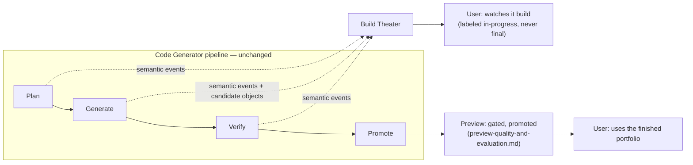
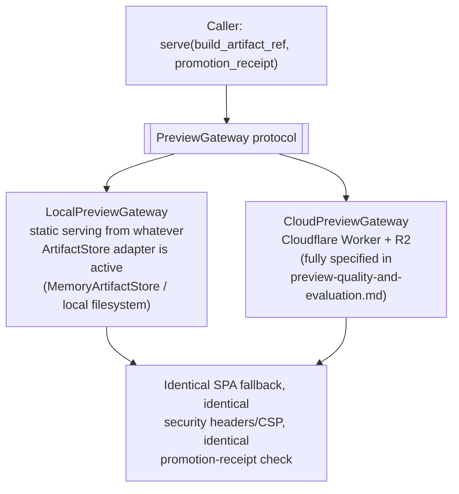

# Live preview and deployment

**Status:** research and system-design proposal only. No implementation is
authorized by this document.

This document specifies how a generation-in-progress is shown to the user, how
preview serving stays identical between local development and a deployed
environment, and how a verified build eventually becomes a real,
independently hosted site. It is subordinate to the
[architecture overview](README.md) and sits alongside
[Preview, quality, and evaluation](preview-quality-and-evaluation.md), which
owns the *promoted* preview's correctness contract — see that document's scope
note for exactly where the boundary sits. Nothing here weakens or bypasses any
gate defined there.

## Why this document exists

The rest of this proposal is a batch pipeline: plan, generate, verify,
promote. That shape is what makes "no errors while generating" and "no errors
in the generated portfolio" (the first and third product pillars in the
[architecture overview](README.md)) enforceable at all — a user only ever sees
a build that already passed every gate. But it also means a first-time
generation is, by construction, a wait: nothing is shown until the whole
pipeline finishes.

The project owner's explicit reference point is products like Replit, Lovable,
and emergent.sh, where the user watches the app come together — files
appearing, a preview updating — while generation is still running. That
expectation is legitimate and worth designing for directly, rather than
assuming a spinner is good enough. This document treats "what does the user
watch while it builds" as a first-class design question, distinct from "is the
finished result correct," and proposes an answer that adds essentially no new
infrastructure risk to the pillars the rest of this document set protects.

## How comparable products actually do this

Publicly observable product behavior and vendor documentation describe three
different architectural shapes for "live" AI-generated app preview. This is
informed analysis of what is publicly visible, not a claim about any vendor's
private implementation, and any product's approach can change — verify current
behavior before relying on specifics.

| Category | Example(s) | How the live preview actually works | Fit for OryxenAI |
| --- | --- | --- | --- |
| Client-side virtual runtime | bolt.new, built on StackBlitz's WebContainers | A Node.js runtime compiled to WebAssembly runs **inside the user's own browser tab**; `npm install` and the dev server execute client-side, with no per-session server container at all | Already explicitly rejected in [the architecture overview's "Explicitly rejected shapes"](README.md#explicitly-rejected-shapes) — a proprietary runtime that diverges from the real production build/verify path and moves trust into the browser instead of the deterministic pipeline. That rejection still holds; nothing below reopens it. |
| Server-side ephemeral dev container | Replit Agent; Lovable; and, to the best of publicly available knowledge, other cloud coding-agent products in the same category | A real, isolated, per-session container or VM runs an actual dev server (framework-native hot module reloading); the agent writes files directly onto that container's filesystem; the product proxies the running server's port to a preview URL or embedded webview. Liveness comes from the framework's own dev server, not anything preview-specific. | Closest to the experience the project owner described. Also the most infrastructure: new container-orchestration capacity, a live file-sync channel from generation calls to a running filesystem, and a new "arbitrary live code execution" security boundary distinct from today's build-time-only isolation. See "Explicitly deferred" below. |
| Batch generate → build → deploy the result | v0.dev | Generates, builds, and serves/deploys the *result* of a generation; there is no persistent, live-editable runtime session the user watches update line-by-line | This is architecturally the closest published product to what this document set already proposes. It matters mainly as evidence: "generate, then verify, then serve an immutable result" is a legitimate, production-grade shape used by a serious vendor — not an inferior substitute for a live container. |

OryxenAI's existing design (verified static build → gated promotion → iframe
on a separate origin) is closest to the third category, not the second. That
is worth saying plainly rather than leaving implicit, because the project
owner's own reference products are mostly the second category — the gap
between "what the user pictures" and "what this pipeline currently produces"
is real, and the rest of this document is about closing as much of that gap as
is honest to close without abandoning pillars 1 and 3.

## Recommendation: two UI surfaces, not one

Rather than rebuilding the pipeline around a live container, add a second,
explicitly best-effort surface that rides on infrastructure this proposal
already has, and keep the existing gated surface exactly as specified:



### Build Theater (proposed, new)

A live-updating view of the *current* generation attempt, built entirely from
data the pipeline already produces:

- **Phase and route progress**, from the semantic progress events
  [generation-pipeline.md](generation-pipeline.md#checkpoints-and-observability)
  already defines: `input_admitted`, `site_plan_ready`, `shared_source_ready`,
  `route_batch_ready`, `build_passed`, `browser_gate_passed`,
  `visual_review_passed`, `preview_promoted`. These are already state, not new
  data to invent — Build Theater is a rendering of the existing GET-state
  progress stream, pushed instead of polled where the transport allows it
  (SSE over the existing FastAPI app is sufficient; no new infrastructure
  product is required for this part).
- **Optionally, a rendered look at each route as its batch completes**, before
  the whole generation is promoted. This can reuse the pipeline's own
  candidate build objects — produced at Gate 2 in
  [Preview, quality, and evaluation](preview-quality-and-evaluation.md), before
  promotion — rather than inventing a new artifact. This *is* a proposed
  widening of policy, not something that already falls out of the existing
  design for free: today the protected QA path that serves candidate objects
  is scoped to the automated verifier only (that document's
  ["Recommended cloud adapter"](preview-quality-and-evaluation.md#recommended-cloud-adapter)
  and ["R2 object and promotion model"](preview-quality-and-evaluation.md#r2-object-and-promotion-model)
  sections). Letting the owning session's own authenticated user view an
  unpromoted candidate —
  always through the same protected path, always clearly labeled unverified,
  never through the public promoted path or origin — is a small, explicit
  access-rule change that should be called out as such, not assumed.
- **What it is not, under any circumstance**: it is never labeled or styled as
  "your portfolio," never embedded through the promoted preview's origin or
  iframe, and never shown as if it were the finished product. A user can watch
  a route render mid-build and watch that same route fail its next gate a
  moment later — that is honest, not a regression, because Build Theater never
  claimed to be verified in the first place. This is what lets Build Theater
  exist at all without weakening pillars 1 and 3: it is explicitly exempt from
  the "never show a broken preview" invariant because it was never presented
  as the preview.
- **Failure handling** reuses
  [the existing failure experience](preview-quality-and-evaluation.md#failure-experience)
  directly — Build Theater shows which phase failed and a safe explanation; it
  does not need its own separate failure taxonomy.

This is cheap relative to the alternative: no container orchestration, no live
file-sync channel, no new execution-security boundary. It uses durable job
state and object storage this proposal already requires for other reasons.
Whether it ships in v1 is a real decision, not assumed by this document — see
the [decision checklist](README.md#pre-implementation-decision-checklist).

### Preview (existing, unchanged)

The gated, promoted, atomically-swapped preview specified in full in
[Preview, quality, and evaluation](preview-quality-and-evaluation.md). Nothing
in this document changes any gate, threshold, origin, CSP, or promotion rule
defined there. Build Theater and Preview are different UI surfaces built from
overlapping data, not two implementations of the same guarantee.

## Explicitly deferred: a real live dev-container preview

The server-side ephemeral container category above is a legitimate future
upgrade, not a rejected idea — it is the only way to get the actual
Lovable/Replit-style experience (edit-and-watch-it-update-in-place with
framework-native hot reload). It is deferred, not adopted, because it is a
materially different commitment than anything else in this document set:

- **New infrastructure product.** A live container needs somewhere to run: a
  Cloudflare Containers-style binding (consistent with the Cloudflare boundary
  this project already uses for R2 and the preview/QA Worker), or a
  third-party sandbox platform such as E2B or Daytona (a new vendor
  relationship). Names here are examples of the category, not a
  recommendation of one vendor; cloud container products, their free-tier
  availability, and their pricing change, and must be verified at
  implementation time the same way this document set already treats every
  other cloud product.
- **A live file-sync channel.** Generation calls would need to stream file
  changes to a running container's filesystem as they are produced, instead
  of the current model of assembling a complete, validated `FileChangeSet`
  and applying it atomically. That atomic-application property is part of how
  [Deterministic assembly](generation-pipeline.md#deterministic-assembly)
  currently guarantees two route batches can never race on the same file;
  live streaming would need its own answer to that same race, not a smaller
  version of today's.
- **A new execution-security boundary.** Today, generated code only ever
  executes inside the tightly bounded, secret-free, network-restricted build
  subprocess described in
  [Build isolation](generation-pipeline.md#build-isolation), and only during
  verification — never continuously, never with a live listening dev server
  reachable during active editing. A live container inverts this: arbitrary
  generated code (including whatever a prompt-injected instruction in
  portfolio content managed to get written) would run continuously, with a
  live dev server, for the session's duration. This is solvable — it is what
  the compared products solve — but it is a real threat-model expansion that
  needs its own security review, not a paragraph in this document.
- **It would still not replace the gated pipeline.** Even with a live
  container, pillars 1 and 3 still require that the thing the product calls
  "done" passed every gate. A live editing session answers "what do I watch
  while it's building"; it does not answer "is this correct," which is why
  even Lovable- and Replit-style products still have a separate, more final
  publish/deploy step distinct from their live editor.

**Recommendation:** do not build this now. Revisit it only if real usage shows
Build Theater's perceived liveness is an actual, measured product problem —
not on the assumption that it must be, since Build Theater already reuses
existing pipeline events and candidate objects to close a meaningful part of
the gap at negligible marginal cost.

## `PreviewGateway`: local development and deployment are the same abstraction

The project owner's question "how does preview work locally versus when
deployed" already has an answer in this design — it is one protocol with two
adapters, the same pattern
[Preview, quality, and evaluation](preview-quality-and-evaluation.md) already
uses for browser verification (`BrowserVerifier`, with
`LocalPlaywrightBrowserVerifier` and `CloudBrowserVerifier` adapters). Preview
serving deserves the identical treatment, made explicit as its own protocol
rather than left as only the cloud shape:

```text
serve(build_artifact_ref, promotion_receipt) -> preview_url
```



`CloudPreviewGateway` is not a new component — it is the same "Preview gateway"
already named in the [architecture overview's system boundaries](README.md#system-boundaries)
table, given a formal protocol so it has a documented local counterpart instead
of being the only way preview serving is described.

The requirement that makes this actually useful, not just symmetric on paper:
**the local adapter must reproduce the same security posture as the cloud
adapter, never a relaxed "dev mode" version.** The same SPA-fallback rule,
the same restrictive Content Security Policy, the same iframe sandbox
attributes, and the same promotion-receipt check apply locally. This matters
because the failure mode of an asymmetric local adapter is specific and
common: a generated portfolio that "works" in local development because
nothing enforced CSP there, then breaks the moment it is served by the real
cloud gateway. `PreviewGateway`'s whole purpose is to make that class of bug
impossible by construction — a developer running fully offline, with no
Cloudflare account configured, still exercises the exact serving rules that
apply in production, just against a different `ArtifactStore` backend.

Generated code itself never branches on which adapter is serving it, for the
same reason `BrowserVerifier`'s generated source never branches on which
verifier adapter ran it — the portfolio has no way to know, and no reason to
care.

## Future publish-target compatibility

This section exists so a future publishing stage has a documented, low-regret
set of options rather than a from-scratch investigation when that stage is
actually scheduled. It is not implemented, not scheduled, and not authorized
by this document — it is compatibility groundwork, per the project owner's
own framing ("connected, but not right now").

The premise, established in the
[architecture overview](README.md#where-does-a-finished-portfolio-actually-get-deployed):
the verified `build_artifact` is a plain static site by construction — no
server runtime, no OryxenAI-specific asset host, nothing that depends on this
project's own preview gateway. Publishing is therefore a small, per-target
*upload* adapter, conceptually:

```text
publish(build_artifact_ref) -> published_url
```

| Candidate target | Why it fits | Notes |
| --- | --- | --- |
| **Vercel** | The platform the project owner named explicitly, alongside Render and Supabase. Standard static/Vite-output project type; deploys the verified `dist.zip` contents directly. | Needs its own adapter and a Vercel API token resolved through the same indirect `api_key_env` secret pattern every other credential in this project already uses — never a literal key in code or config. |
| **Render static sites** | Same account family already used for OryxenAI itself (D-009, D-011). Simplest operationally if the team stays in one provider ecosystem. | Distinct from the Render *web service* that runs the FastAPI app — a static site is a different Render product. |
| **Cloudflare Pages** | Same account family as the R2 object storage and preview/QA Worker already proposed for Code Generator — potentially the least new surface area, since credentials and tooling already exist. This direction was already floated in Build Preparation's own original architecture proposal as a later publication target, so it is continuity, not a new idea. | Would sit naturally alongside the existing Cloudflare Worker-based preview gateway. |
| **Netlify** | A third common, standard static host, included so it is on record as an equally valid option rather than overlooked. | No existing account relationship today. |

None of these is chosen. Choosing one — and deciding whether "publish" means a
platform-managed subdomain, a custom domain, or both — is a product decision
for whenever a publishing stage is actually scheduled, tracked as its own item
in the [decision checklist](README.md#pre-implementation-decision-checklist).
Nothing in Code Generator's design should make any one of these harder to add
later than any other; that portability is the entire point of keeping the
build artifact a plain static bundle.

## Configuration surface

Specific to this document, belonging in non-secret configuration:

- whether Build Theater is enabled at all, and its event-transport mode (SSE
  versus a short-poll fallback);
- whether Build Theater may show in-progress candidate renders, per the
  proposed QA-path access widening above, independent of whether Build
  Theater's progress-only view is enabled;
- retention window for unpromoted candidate objects Build Theater references,
  distinct from the promoted preview's own retention policy;
- the `PreviewGateway` adapter selection (local versus cloud), mirroring how
  `BrowserVerifier`'s adapter selection is already configured; and
- the publish-target adapter registry — empty by default; each target from
  the table above is added only when explicitly chosen.

Configuration for any future publish-target adapter should follow
`config/app.toml`'s existing `[artifact_storage]` block as its precedent, not
just the model-profile `api_key_env` pattern — it is the closer analog, since
it already configures another external, per-account, object-storage-shaped
service: non-secret per-target coordinates (which project, which bucket or
site ID — the equivalent of `[artifact_storage]`'s `endpoint_url`/`bucket`/
`region`) live in plain TOML, while credentials (the equivalent of
`access_key_env`/`secret_key_env`) stay indirect environment references,
resolved only by infrastructure code, never placed in model context, prompts,
or generated output.

## Primary research references

- StackBlitz: [WebContainers](https://webcontainers.io/) and the
  [Bolt.diy repository](https://github.com/stackblitz-labs/bolt.diy), the same
  reference already cited in the architecture overview, as the concrete
  example of the client-side virtual-runtime category this document continues
  to treat as out of scope.
- Cloudflare: [R2 Worker bindings](https://developers.cloudflare.com/r2/api/workers/workers-api-reference/)
  and [SPA fallback](https://developers.cloudflare.com/workers/static-assets/routing/single-page-application/),
  already relied on by [Preview, quality, and evaluation](preview-quality-and-evaluation.md)
  and extended here only in scope (who may read a candidate), not mechanism.
- Cloudflare Pages: [platform documentation](https://developers.cloudflare.com/pages/)
  as one candidate publish target.
- Vercel: [platform documentation](https://vercel.com/docs) as the publish
  target the project owner named directly.
- Render: [static sites](https://render.com/docs/static-sites), distinct from
  the web-service product already used for OryxenAI itself.
- Netlify: [documentation](https://docs.netlify.com/) as a fourth candidate
  publish target.
- Vite: [static deployment](https://vite.dev/guide/static-deploy.html), the
  same baseline every candidate publish target must serve correctly.

As with every cloud product referenced elsewhere in this document set,
availability, free-tier limits, and exact current behavior change and must be
verified at implementation time rather than trusted from this prose.
