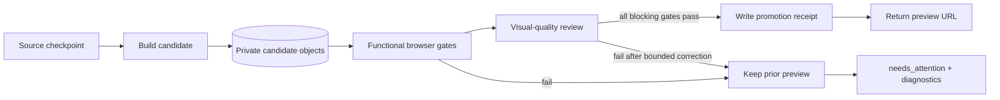

# Preview, quality, and evaluation

This document defines how a generated portfolio becomes a user-visible preview
and how OryxenAI evaluates "working" and "visually advanced" without relying on
an unlimited self-repair loop.

## Product invariant

The user sees the newest **promoted** generation, never the newest attempted
generation.



Promotion is atomic. A session with a previously ready preview keeps that
preview while regeneration runs. A first generation has no preview URL until it
passes. This is how the product can promise "no broken preview" without making
an impossible promise that a probabilistic model never emits a defect.

## Preview topology

### Recommended cloud adapter

Use one small preview/QA Worker at the existing Cloudflare boundary:

- an R2 binding reads immutable candidate and promoted objects without making
  the bucket public;
- an HTTP route serves promoted previews with SPA fallback and security headers;
- a protected QA route serves an unpromoted candidate only to the verifier;
- a browser binding runs Playwright-compatible checks and captures screenshots;
  and
- the FastAPI worker receives a structured verification report and promotes by
  writing a small receipt only after it passes.

This avoids a resident Chromium process in the memory-constrained application
service and avoids relying on its ephemeral filesystem. Cloud products and free
allocations change, so account availability and current limits must be verified
before implementation rather than encoded in architecture prose.

### Local and CI adapter

Define a `BrowserVerifier` protocol with the same request/report schema:

```text
verify(candidate_url, site_plan, interaction_map, verification_profile)
  -> BrowserVerificationReport
```

- `LocalPlaywrightBrowserVerifier` runs against a temporary local static server
  during development and CI.
- `CloudBrowserVerifier` calls the protected preview/QA Worker in deployment.

The verification profile owns viewports, locale, timezone, color scheme,
reduced-motion mode, timeouts, and browser revision. Generated source never
branches on which adapter ran.

## R2 object and promotion model

Use opaque generation identifiers and immutable content objects:

```text
code-generator/
  generations/<opaque-generation-id>/
    input/...
    plan/...
    source/...
    candidate/<build-sha256>/
      index.html
      assets/...
      build-manifest.json
    verification/<attempt-id>/...
    promotion.json
```

Candidate objects are readable only through the protected QA path. The public
preview path is enabled only when `promotion.json` references the exact build
hash and verification-report hashes. The database state echoes the same receipt.
The gateway fails closed if the object, content type, size, hash, or promotion
receipt disagrees.

A regeneration creates a new opaque generation and URL; it does not overwrite
the previous build. R2 lifecycle policy may expire unpromoted failures sooner
than active previews and source downloads. Retention durations belong in config
and operational policy, not source code.

Presigned URLs remain useful for bounded source/build downloads, but a preview
gateway is preferable for route fallback, headers, and promotion checks.

## Route serving

For `/p/<opaque-preview-token>/<path>` the gateway:

1. validates token syntax and finds a valid promotion receipt;
2. maps fingerprinted asset requests to exact objects and never falls back an
   asset miss to HTML;
3. serves `index.html` for known client-route direct loads;
4. sets explicit content types and cache policy—long immutable caching for
   fingerprinted assets, short/no cache for HTML and promotion metadata;
5. rejects traversal, encoded-separator, dot-segment, control-character, range,
   and oversized-request abuse; and
6. applies security and indexing headers.

The deterministic application router renders a designed not-found page for an
unknown path. Browser gates test both known direct loads and an unknown route.

## Preview isolation

### Separate origin

Preview content must never share the OryxenAI application origin. The preview
origin has:

- no OryxenAI cookies, local storage, credentials, or service-worker scope;
- no secrets in HTML, JavaScript, environment substitutions, or request headers;
- no access to application APIs under the current static contract; and
- no trust based solely on the obscurity of an R2 key.

The application embeds it with a capability-minimal iframe sandbox. A practical
default for a cross-origin Vite module build is:

```html
<iframe
  sandbox="allow-scripts allow-same-origin allow-popups allow-popups-to-escape-sandbox"
  referrerpolicy="no-referrer"
  title="Portfolio preview"
></iframe>
```

`allow-same-origin` is acceptable only because the preview is isolated on a
different origin from the application; it preserves reliable module/asset
behavior. Never combine it with scripts on the application origin. Add
`allow-downloads` only for a generation whose admitted interaction contract
contains a local download. Do not grant forms, top navigation, modals, pointer
lock, camera, microphone, geolocation, or clipboard-write by default.

External links use a safe new tab with `noopener`/`noreferrer`. The parent accepts
`postMessage` events only from the exact preview origin and only through a small
versioned schema; it never executes data received from the preview.

### Content Security Policy

The gateway should derive a restrictive policy from the target contract. Under
the current no-runtime-network target, the starting point is conceptually:

```text
default-src 'self';
script-src 'self';
style-src 'self' 'unsafe-inline';
img-src 'self' data: blob:;
font-src 'self';
connect-src 'none';
worker-src 'none';
object-src 'none';
base-uri 'none';
form-action 'none';
frame-ancestors <oryxenai-app-origin>;
```

The implementation must test the exact production build under this CSP. Inline
script is not permitted. Inline styles may be necessary for controlled React
animation values; generated HTML/style injection is still rejected. Also set
appropriate `X-Content-Type-Options`, referrer, permissions, cross-origin, and
`X-Robots-Tag: noindex` policies.

Changing the generated runtime to call an API or remote asset requires a target
contract, CSP, verifier, and threat-model change. It is not a prompt edit.

## Verification pipeline

Gates are ordered from cheapest to most expensive. A gate emits a versioned
machine-readable report whose hash becomes part of the promotion receipt.

### Gate 0 — input and reproducibility

Blocking checks:

- eligible handoff and current approved hashes;
- archive/object/checksum integrity and safe extraction;
- supported target/resource schema versions;
- exact generator, scaffold, toolchain, and input receipts; and
- no expired or changed source object.

### Gate 1 — output and source policy

Blocking checks:

- strict model-response schema and current `based_on` hashes;
- file ownership, path, extension, encoding, and size limits;
- dependency ceiling and complete local import graph;
- no forbidden network, environment, dynamic-code, service-worker, remote
  asset/font, config, or package mutation;
- route, asset, resource, data, and interaction manifests agree with source;
- no placeholders/TODO behavior or unsupported controls; and
- all fixed facts originate in admitted public data.

### Gate 2 — compile and artifact integrity

Blocking checks:

- formatting/parser pass;
- TypeScript type-check with the trusted configuration;
- production Vite build with trusted configuration;
- bundler input graph contains only expected workspace/dependency files;
- output has an entry HTML file and all referenced chunks/assets;
- no source maps or debug data are exposed unless policy explicitly permits;
- output size and individual asset size fit configured ceilings; and
- deterministic build manifest and per-file hashes are produced.

The verifier does not use `vite preview` as a production server; Vite documents
it as a local preview aid. Cloud serving is tested against the actual candidate
gateway.

### Gate 3 — real-browser correctness

For every declared route, Playwright should:

1. open the route directly, not only through home-page navigation;
2. wait for the trusted ready signal plus settled fonts/images;
3. fail on uncaught page errors, error-boundary activation, severe console
   errors, failed local resources, or blocked policy violations;
4. validate document title, landmark structure, one primary heading, and public
   content presence;
5. follow internal links and exercise browser back/forward state;
6. run the route's interaction-map assertions;
7. exercise keyboard-only navigation and visible focus;
8. check overflow, clipping, obscured controls, viewport fit, and horizontal
   scroll at configured small/medium/large viewports;
9. repeat motion-sensitive interactions with reduced motion enabled; and
10. capture stable screenshots and an accessibility snapshot/tree.

The browser blocks unexpected requests and reports their initiator. Local route
assets are allowed; external runtime network is not. A page that renders but
logs an uncaught error does not pass.

### Interaction assertions

Assertions are generated deterministically from the `SitePlan`, not invented by
the test model:

| Outcome | Browser assertion |
| --- | --- |
| internal navigation | expected route and primary content after click; direct load also passes |
| external link | valid admitted URL, safe target/rel, popup/navigation intent observed |
| menu/dialog/accordion | keyboard and pointer open/close, focus behavior, ARIA state |
| filter/sort | visible local result set changes predictably and can be reset |
| copy | admitted text copied when permission is granted; honest fallback otherwise |
| local download | response/object exists, content type/hash matches admitted asset |
| section scroll | target exists and focus/URL behavior matches the contract |
| mail/telephone | admitted URI is exact and not fabricated |

There is no generic "click every element and hope" test. The interaction map
makes intended behavior explicit and debuggable.

### Gate 4 — accessibility and motion

Blocking baseline checks include:

- keyboard reachability and absence of focus traps;
- accessible names and state for controls;
- heading/landmark semantics and meaningful image alternatives;
- minimum configured contrast checks for ordinary and interactive states;
- content remains usable at zoom/narrow viewport;
- no required information conveyed only by motion or color;
- no uncontrolled autoplaying media; and
- reduced-motion mode removes or substitutes nonessential motion without
  removing content or interaction feedback.

Automated accessibility checks cannot prove accessibility. They are a blocking
baseline plus structured evidence for evaluation; keyboard scenarios and
periodic human review remain necessary.

### Gate 5 — visual-quality review

Only after deterministic/browser gates are green, a vision-capable reviewer
receives:

- standard and narrow screenshots for every route;
- key interaction-state screenshots where relevant;
- the accessibility snapshot/tree;
- the visual `SitePlan`, VDD acceptance criteria, and selected reference cards;
- deterministic layout/overflow/asset/interaction results; and
- no full source repository or raw resume.

It returns a strict report:

```text
VisualReviewReport
  based_on hashes
  verdict: pass | correct
  criterion_results[]
    criterion_id
    severity
    evidence: route + viewport + region
    explanation
  defects[]
    defect_id
    allowed_paths[]
    expected_visual_change
    regression_risk
  strengths[]
```

The reviewer never writes source. If correction is allowed, deterministic code
turns its validated defect set into one scoped correction request and then reruns
all affected gates.

### Gate 6 — promotion integrity

Blocking checks:

- candidate files uploaded with expected types and hashes;
- configured object-store read-back verifies the archive/manifest;
- browser/visual reports refer to the same build hash;
- no newer input or generation superseded the candidate;
- promotion receipt is written and read back successfully; and
- session state is CAS-updated to the exact promoted receipt.

Any ambiguity fails closed.

## Blocking versus advisory signals

Blocking signals protect correctness, security, content integrity,
accessibility baseline, and blatant visual failure. Advisory signals guide later
optimization without causing flaky user-facing failures.

| Blocking examples | Advisory/evaluation examples |
| --- | --- |
| type/build error | small bundle-size opportunity |
| uncaught runtime error | performance score variation |
| route/asset 404 | minor screenshot difference |
| broken declared interaction | noncritical visual density concern |
| horizontal overflow or obscured CTA | possible semantic refinement |
| missing fixed fact or fabricated claim | cross-run style-diversity signal |
| severe accessibility violation | animation polish opportunity |
| major plan/VDD mismatch | external site availability |
| generic fallback dominates despite valid direction | long-term aesthetic trend |

Lighthouse-style scores are useful in offline evaluation and reports but are too
environment-sensitive to be the only promotion gate. Direct assertions and
configured resource budgets are more stable.

## What "visually advanced" means

It does not mean maximum animation, gradients, glass, or three-dimensional
effects. A portfolio is advanced when the implementation makes deliberate,
content-specific choices and executes them cleanly.

The review rubric covers:

1. **Direction fidelity:** the prepared visual thesis, tone, and route intent are
   recognizable in the render.
2. **Composition:** hierarchy, alignment, whitespace, density, and focal sequence
   feel authored rather than assembled from interchangeable blocks.
3. **Typography:** scale, line length, weight, rhythm, and responsive behavior
   support the content.
4. **System coherence:** tokens, navigation, components, imagery, and motion form
   one system across routes.
5. **Distinctiveness:** content-specific motifs and layout moves replace default
   generated hero/card-grid patterns.
6. **Asset integration:** images, icons, illustrations, and fallbacks are
   art-directed and positioned intentionally, without distortion or decorative
   irrelevance.
7. **Motion and interaction:** effects explain hierarchy/state or add meaningful
   character, remain smooth, and have a complete reduced-motion behavior.
8. **Responsive art direction:** small screens are recomposed, not merely stacked
   or clipped.
9. **Craft:** spacing, edges, layering, focus/hover/active states, empty states,
   and route transitions are finished.
10. **Truth and usability:** polish never obscures content, invents facts, or
    breaks navigation/accessibility.

Exact severity thresholds are versioned evaluation configuration. Human-labeled
examples must calibrate the reviewer before its verdict becomes blocking.

## Deterministic anti-generic checks

Taste cannot be fully linted, but several failure modes can be surfaced before
visual review:

- repeated identical section silhouettes across a route;
- every content group rendered as the same card primitive;
- a plan declaring a distinctive move that has no implementation owner;
- long text placed in fixed-height/overflow-hidden containers;
- all responsive layouts reduced to one unconsidered vertical stack;
- excessive use of raw shadows/radii/colors outside tokens;
- motion declarations without a semantic trigger or reduced-motion mapping;
- image resources rendered as undifferentiated backgrounds despite focal notes;
- placeholder marketing copy, fake metrics, or ungrounded testimonials; and
- interactive styling on elements absent from the interaction map.

These are evidence, not universal layout quotas. A valid editorial card system
should not fail merely because cards exist. The visual direction remains the
source of truth.

## Reference corpus (the "golden apps" proposal)

### Recommendation

Create a small, versioned, privacy-safe **reference and evaluation corpus**, not
a template picker. Three initial archetype families give useful coverage:

- editorial/case-study storytelling;
- spatial/expressive creative work; and
- systems/product/technical work.

These are evaluation categories, not fixed visual themes. Each corpus item uses
synthetic public-safe content and should be good enough to demonstrate finished
responsive routes, motion, interactions, accessibility, and error handling.

### Corpus item structure

```text
references/<reference-id>/
  reference-card.json
  screenshots/
    wide/...
    narrow/...
    interaction-states/...
  source/                       executable evaluation source; not prompt payload
  scenario/
    build-context.zip
    expected-contract.json
    human-rubric.json
  README.md
```

`reference-card.json` contains compact, non-copyable guidance:

- tags and appropriate content conditions;
- visual thesis and layout techniques;
- typography and density behavior;
- motion purpose and reduced-motion substitution;
- responsive transformations;
- interaction patterns;
- accessibility/craft observations;
- anti-patterns it avoids; and
- elements that must not be copied literally.

### Selection and prompt use

A deterministic tag-overlap selector chooses one primary reference and,
optionally, one contrasting reference from route/content/VDD tags. The planning
call receives compact cards and selected screenshots—not full source. It is told
to transfer principles, not palette, copy, exact geometry, or component code.

Full reference source is used for:

- exercising the scaffold, verifier, and preview infrastructure;
- regression tests for route/motion/interaction contracts;
- human calibration of the visual reviewer; and
- extracting general-purpose trusted runtime primitives after explicit human
  review.

This differs from a large few-shot library: the corpus is primarily an eval set,
only a tiny deterministic slice enters a prompt, and no full example app is
copied into the generation context.

### Anti-copy safeguards

Offline evaluation should flag:

- suspicious exact/near-exact source overlap with reference apps;
- repeated copy or data strings;
- identical route trees/component names not required by the scaffold;
- high layout-fingerprint similarity unsupported by the user's direction; and
- repeated palettes/motion signatures across otherwise different scenarios.

Pixel matching is the wrong goal. The corpus defines a quality floor and a
variety of techniques, not a visual target to clone.

### Scenario coverage

The corpus should grow from failures, not from arbitrary style collecting. It
needs representative combinations such as:

- single and multiple routes;
- sparse and dense public content;
- with strong images, with weak/missing images, and CSS/SVG fallback only;
- light, dark, and mixed surface direction;
- long project text and unusually long names/titles;
- external links and local download interactions;
- small and large route-specific resource sets;
- reduced motion and keyboard-only use; and
- malformed, stale, or ineligible input for negative admission cases.

The number and current coverage live in the corpus/evaluation directory and test
runner, not in prose documentation.

## Evaluation layers

### Per-change automated suite

- pure unit tests for schema, path, ownership, resource, state, CSP, and routing
  behavior;
- fixture-driven generation tests using model-free structured outputs;
- integration tests for R2 verification, checkpoints, durable retries, CAS, and
  preview promotion;
- trusted frontend scaffold type/build tests;
- local Playwright functional/accessibility/viewport tests; and
- negative security tests with malicious archives and generated source.

### Opt-in model evaluation

Run privacy-safe corpus packs through configured live profiles and record:

- admission and structured-output success;
- call/correction count and usage;
- source/build/browser pass rate;
- acceptance and interaction coverage;
- reviewer result and defect categories;
- human rubric result on sampled renders; and
- diversity/copying signals across scenarios.

Do not promote a profile change from one attractive screenshot. Compare a
representative workload and investigate regressions by phase receipt.

### Periodic human review

Humans should review a small stratified sample on real desktop/mobile devices,
including keyboard and reduced-motion use. Human labels calibrate the visual
reviewer and define which defects are actually blocking. The corpus should add a
new regression scenario whenever a meaningful production failure escapes.

## Failure experience

When verification fails, the user-facing state should be honest and calm:

- keep the last known-good preview if one exists;
- show the failed phase and a safe explanation, not model/provider internals;
- offer explicit regenerate after transient or implementation failure;
- mark stale output when upstream approval or Build Preparation object changes;
- retain report/source hashes for developer diagnostics; and
- never expose the candidate QA URL or an erroring iframe.

Developer diagnostics may show gate IDs, route/viewport, safe stack summary,
source file locations, model operation/profile key, and artifact receipts. Raw
secrets, full prompts, and unredacted provider errors stay out of responses and
logs.

## Threat model summary

| Threat | Primary controls |
| --- | --- |
| prompt injection in portfolio content | trusted/untrusted prompt separation; no tool loop; deterministic validators |
| ZIP traversal/decompression abuse | fresh download, path normalization, count/size/type ceilings, no symlink extraction |
| dependency supply-chain execution | fixed ceiling/profile, trusted resolver, real lock, disabled scripts, isolated build |
| generated build-time code execution | trusted configs/plugins, restricted imports, AST scan, secret-free process |
| malicious preview JavaScript | separate origin, iframe sandbox, CSP, no credentials/network, permissions policy |
| preview URL disclosure | opaque token now; signed authenticated grant when auth exists; noindex/no referrer |
| stale result overwrites current work | input receipts, immutable prefixes, CAS, pre-promotion staleness check |
| R2 object mutation/corruption | hashes, verified reads, immutable generations, promotion receipt |
| runaway cost/repair | low concurrency, bounded calls/correction, durable checkpoints, configured budgets |
| visual reference cloning | compact technique cards, no source in prompt, offline similarity checks, human review |

## Acceptance criteria for the architecture phase

Before implementation begins, the team should be able to answer "yes" to these
questions:

- Is the admitted Build Preparation pack the only source of content/design truth?
- Can every model call be reconstructed without a conversation transcript?
- Are scaffold, package, build, resource, and deployment authority deterministic?
- Can two parallel route calls touch only disjoint paths?
- Does every control have an interaction outcome and browser assertion?
- Can the system prove which build and verification reports back a preview URL?
- Can a process restart resume from R2 checkpoints without a local directory?
- Can a broken candidate fail without replacing a known-good preview?
- Does the preview run without application secrets, cookies, runtime CDN assets,
  or uncontrolled network access?
- Is visual quality evaluated against the user's direction and calibrated
  references rather than one house template?
- Are model roles and all operational ceilings config-driven?
- Are all contract expansions called out for explicit decision rather than
  hidden in implementation?

## Primary research references

- Cloudflare R2: [Workers binding API](https://developers.cloudflare.com/r2/api/workers/workers-api-reference/),
  [presigned URLs](https://developers.cloudflare.com/r2/api/s3/presigned-urls/),
  [cache integration](https://developers.cloudflare.com/r2/examples/cache-api/),
  and [object lifecycle rules](https://developers.cloudflare.com/r2/buckets/object-lifecycles/)
- Cloudflare Workers: [SPA asset fallback](https://developers.cloudflare.com/workers/static-assets/routing/single-page-application/),
  [static-asset headers](https://developers.cloudflare.com/workers/static-assets/headers/),
  and [platform limits](https://developers.cloudflare.com/workers/platform/limits/)
- Cloudflare Browser: [Playwright support](https://developers.cloudflare.com/browser-run/playwright/)
  and [screenshot endpoint](https://developers.cloudflare.com/browser-run/quick-actions/screenshot-endpoint/)
- Playwright: [web-server testing](https://playwright.dev/docs/test-webserver),
  [screenshots](https://playwright.dev/docs/screenshots), and
  [visual comparisons](https://playwright.dev/docs/test-snapshots). Playwright
  notes that screenshot rendering varies by host environment, which is why
  visual baselines must use a pinned verifier profile.
- Vite: [static deployment](https://vite.dev/guide/static-deploy.html)
- MDN: [`iframe` sandbox behavior](https://developer.mozilla.org/en-US/docs/Web/HTML/Reference/Elements/iframe)
  and [Content Security Policy](https://developer.mozilla.org/en-US/docs/Web/HTTP/Guides/CSP)
- W3C WAI: [CSS reduced-motion technique](https://www.w3.org/WAI/WCAG22/Techniques/css/C39)
- Motion: [`useReducedMotion`](https://motion.dev/docs/react-use-reduced-motion)
  and [global reduced-motion configuration](https://www.motion.dev/docs/react-motion-config)
- Render: [free-service lifecycle/filesystem](https://render.com/docs/free) and
  [background-worker service](https://render.com/docs/background-workers)

