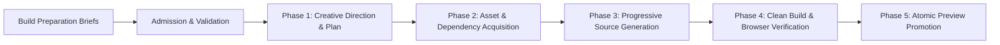
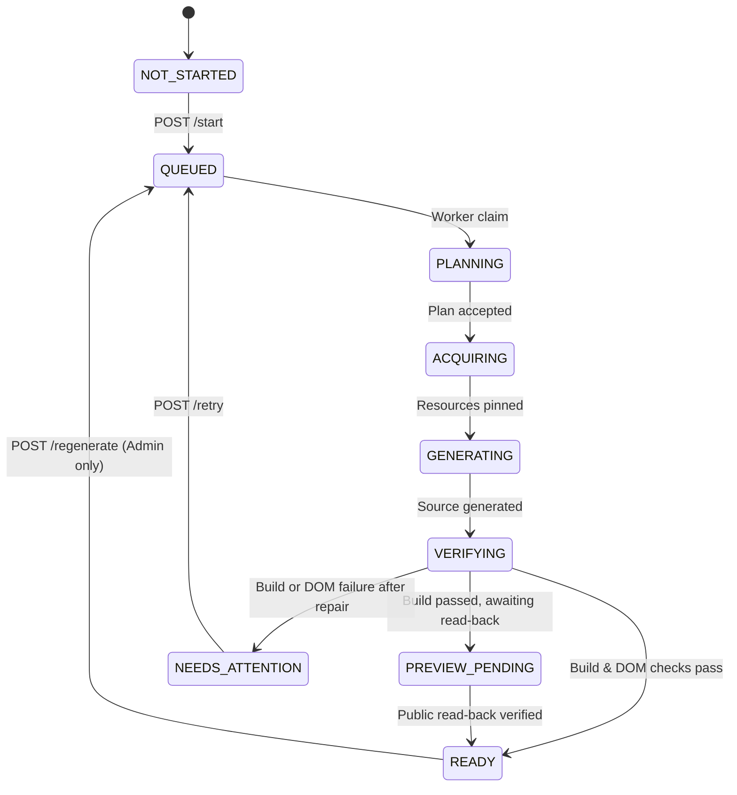
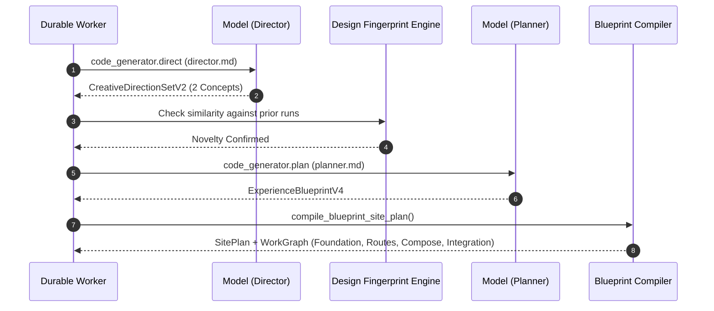
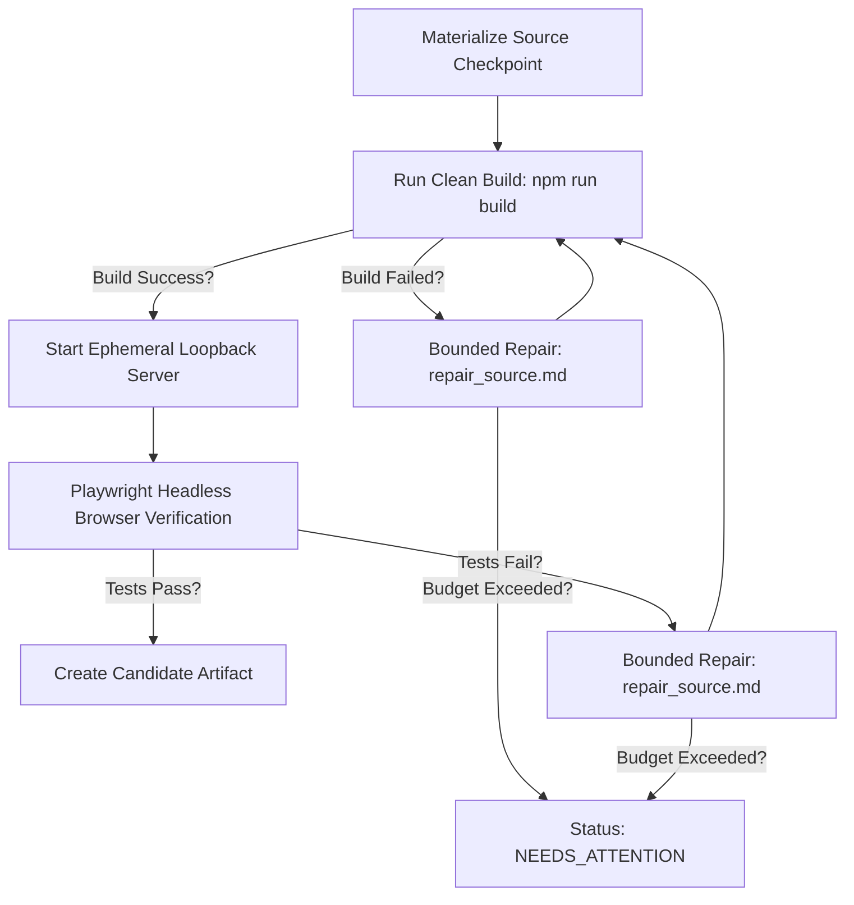

# Code Generator Agent — Complete Architecture & Technical Reference

This document is the authoritative, deep-dive reference for the **Code Generator Agent** within OryxenAI. It explains what the agent does, what inputs it takes, how its state machine and background jobs work, its progressive multi-stage generation pipeline, prompt and model strategies, verification and repair systems, and every core file in its implementation.

---

## Table of Contents

1. [Executive Summary & Agent Purpose](#1-executive-summary--agent-purpose)
2. [Position in the OryxenAI Pipeline](#2-position-in-the-oryxenai-pipeline)
3. [Inputs & Contract Admission](#3-inputs--contract-admission)
4. [Session State Machine & API Surface](#4-session-state-machine--api-surface)
5. [Durable Worker Architecture & Job Flow](#5-durable-worker-architecture--job-flow)
6. [Phase-by-Phase Generation Workflow](#6-phase-by-phase-generation-workflow)
   - [Phase 1: Creative Direction & Blueprint Planning](#phase-1-creative-direction--blueprint-planning)
   - [Phase 2: Resource & Dependency Acquisition](#phase-2-resource--dependency-acquisition)
   - [Phase 3: Progressive Source Generation & Integration Review](#phase-3-progressive-source-generation--integration-review)
   - [Phase 4: Clean Build, AST Audit, DOM Verification & Repair](#phase-4-clean-build-ast-audit-dom-verification--repair)
   - [Phase 5: Atomic Preview Promotion & Export Packaging](#phase-5-atomic-preview-promotion--export-packaging)
7. [Comprehensive Core File Reference (64 Files)](#7-comprehensive-core-file-reference-64-files)
8. [Prompts Reference](#8-prompts-reference)
9. [Scaffolds & Base Architecture](#9-scaffolds--base-architecture)
10. [Error Handling, Invariants & Bounded Policies](#10-error-handling-invariants--bounded-policies)

---

## 1. Executive Summary & Agent Purpose

The **Code Generator Agent** transforms approved creative, narrative, and visual briefs into a fully realized, production-grade, interactive portfolio website built on **React 18, Vite, TypeScript, and Vanilla CSS/Tailwind**.

Unlike naive single-prompt code generation tools that produce monolithic HTML files with placeholder images and broken navigation, OryxenAI's Code Generator operates as an **autonomous, deterministic compiler and multi-stage workflow**:

- **No Hallucinated Packages**: Strict dependency management locks package installations to an approved whitelist and a committed lockfile.
- **No Missing Assets**: Every image, font, and icon is pinned, verified, and mapped to concrete local files or fallbacks before source generation starts.
- **Bounded Repair**: Deterministic verification gates (clean TypeScript build, AST validation, and headless browser DOM testing) run on every candidate; errors trigger targeted, bounded repairs rather than infinite retries.
- **Atomic Promotion**: The generated website is never exposed to the user or preview frame until it has passed all verification gates and is atomically promoted in preview storage.



---

## 2. Position in the OryxenAI Pipeline

OryxenAI operates on a strict sequential pipeline of specialized agents:

1. **Discovery Agent**: Interacts with the user, collects background, goals, and projects, resulting in an approved **Discovery Brief**.
2. **Content Architect Agent**: Transforms the discovery brief into a structured content blueprint, page inventory, and narrative strategy.
3. **Visual Design Director Agent**: Establishes visual language, typography, color palettes, motion systems, and design tokens.
4. **Build Preparation Agent**: Gathers public scope, resolves resource references, and produces two immutable Markdown briefs:
   - `content-and-narrative-brief.md`
   - `visual-and-build-brief.md`
5. **Code Generator Agent**: Consumes the two Build Preparation briefs and compiles them into a runnable, verified portfolio web application.

### Key Architectural Invariants

- **Explicit Invocation**: The Code Generator **never auto-chains** from Build Preparation. It is started explicitly via `POST /api/v1/sessions/{session_id}/code-generator/start`.
- **Zero Direct Intake Access**: The Code Generator never reads raw user resumes, uploaded PDFs, or chat histories. It only reads the approved Markdown brief pair and their fenced JSON indices.
- **Provider-Neutral Model Client**: All model calls run through the `ModelClient` interface. Prompts are trusted system templates loaded from disk, while brief contents are injected as untrusted structured user data.

---

## 3. Inputs & Contract Admission

The Code Generator accepts an immutable pair of Markdown briefs produced by the Build Preparation agent.

### The Brief Pair Contract

```
┌─────────────────────────────────────────────────────────┐
│              Build Preparation Output                   │
├────────────────────────────┬────────────────────────────┤
│ content-and-narrative-     │ visual-and-build-brief.md  │
│ brief.md                   │                            │
│ ┌────────────────────────┐ │ ┌────────────────────────┐ │
│ │ Prose narrative        │ │ │ Visual direction       │ │
│ ├────────────────────────┤ │ ├────────────────────────┤ │
│ │ Fenced JSON Index:     │ │ │ Fenced JSON Index:     │ │
│ │ - run_id               │ │ │ - visual_input_mode    │ │
│ │ - content_hash         │ │ │ - routes               │ │
│ │ - navigation_contract  │ │ │ - resources (media)    │ │
│ │ - routes & sections    │ │ │ - components           │ │
│ └────────────────────────┘ │ └────────────────────────┘ │
└────────────────────────────┴────────────────────────────┘
```

#### 1. `content-and-narrative-brief.md`
Contains the complete portfolio copy, route hierarchy, section breakdown, and navigation contract. The fenced JSON block at the bottom includes:
- `run_id`: Unique Build Preparation execution ID.
- `content_architect_content_hash`: Hash stamping the approved upstream content.
- `navigation_contract`: `{ "closed": true, "allowed_destinations": [...] }` ensuring internal links cannot point to undefined routes.
- `routes`: Array of route definitions (`route_id`, `path`, `title`, `sections`).

#### 2. `visual-and-build-brief.md`
Contains art direction, color harmony, typography hierarchies, layout density, and component selections. The fenced JSON block contains:
- `resources`: Pinned media needs (photos, illustrations, logos) with candidate URLs, dimensions, and licenses.
- `components`: Candidate UI primitives (e.g., Lucide icon names, interactive badges).
- `recommended_dependencies`: Suggested npm packages vetted for security and compatibility.

### Admission & Hash Binding (`brief_ingestion.py`, `development_input.py`)

When `POST /start` is called:
1. Both markdown files are loaded from the Build Preparation state.
2. SHA256 hashes are computed for both brief bodies.
3. The fenced JSON blocks are extracted, schema-validated, and checked to ensure internal consistency.
4. An immutable **`AdmittedInputReference`** is minted containing:
   - `content_brief_sha256`
   - `visual_brief_sha256`
   - `brief_contract_hash` (combined hash of the contract envelope)
   - `source_sha256` (canonical identity of the input materials)
5. If the briefs have been modified or hashes do not match, admission fails immediately with `CODE_GENERATOR_BRIEF_INVALID`.

---

## 4. Session State Machine & API Surface

### State Machine (`CodeGeneratorSessionStatus`)

The production session state tracks the agent's progress through discrete statuses:



| Status | Description |
|---|---|
| `not_started` | No Code Generator run has been initiated for this portfolio session. |
| `queued` | Initial run or retry has been committed to the database and enqueued as a durable job. |
| `planning` | Worker is executing creative direction and blueprint planning. |
| `acquiring` | Worker is downloading media assets, validating fonts, and checking dependencies. |
| `generating` | Progressive generation of React components, styles, and route modules is underway. |
| `verifying` | Clean build, TypeScript type checking, and headless browser DOM verification are running. |
| `preview_pending`| Build passed verification; candidate is stored and undergoing public URL read-back. |
| `ready` | Preview pointer atomically promoted; portfolio is live and ready for user inspection. |
| `needs_attention`| A gate failed or model declined; repair budget exhausted. Retriable. |

### REST API Endpoints (`src/oryxenai/api/routes/code_generator.py`)

All production session routes require authentication and are scoped by session ID:

#### 1. `GET /api/v1/sessions/{session_id}/code-generator`
Returns the current session projection, run status, durable jobs, active preview URL, candidate preview, and any non-blocking advisories or warnings.

#### 2. `POST /api/v1/sessions/{session_id}/code-generator/start`
Starts a new Code Generator run.
- **Headers**: `Idempotency-Key: <UUID>` (Required)
- **Body**: `{}` (Empty JSON object; model selection is governed by server configuration).
- **Preconditions**:
  - Session must exist and be owned by caller (or caller is admin).
  - Build Preparation status must be `ready`.
  - Normal users: Must have available generation entitlement.
  - No active run currently in progress.

#### 3. `POST /api/v1/sessions/{session_id}/code-generator/retry`
Retries the first incomplete stage of a failed run (`needs_attention`) without altering the design concept.
- **Headers**: `Idempotency-Key: <UUID>` (Required)
- **Behavior**: Preserves admitted design variant, accepted plan, and existing checkpoints. Re-queues the failed stage job.

#### 4. `POST /api/v1/sessions/{session_id}/code-generator/regenerate`
Requests an entirely new design variant for the portfolio.
- **Headers**: `Idempotency-Key: <UUID>` (Required)
- **Restriction**: Restricted by normal user entitlements. Re-invokes creative director to produce a contrasting visual concept while keeping the previous preview intact until the new run succeeds.

---

## 5. Durable Worker Architecture & Job Flow

Code generation does not execute in the HTTP request thread. The FastAPI server records immutable run records and enqueues durable rows in PostgreSQL table `background_jobs`.

### Job Queue & Worker Concurrency

- **Claim Mechanism**: Background workers claim pending jobs using `SELECT ... FOR UPDATE SKIP LOCKED`.
- **Process Isolation**: The background worker runs in a separate process/container from the API server.
- **Heartbeat & Leases**: Running jobs maintain heartbeat timestamps. If a worker process crashes, expired leases are detected and recovered.
- **Execution Lanes**: Model calls are gated through a global model execution lane to adhere to provider rate limits.

### Four-Stage Job Sequence

The generation pipeline is split into four distinct durable jobs:

```
[ POST /start ]
       │
       ▼
 1. code_generator.plan (Stage: plan)
       │  (Saves SitePlan & WorkGraph to DB)
       ▼
 2. code_generator.acquire (Stage: acquire)
       │  (Downloads media, pins dependencies, saves ResourceLedger)
       ▼
 3. code_generator.generate (Stage: generate)
       │  (Synthesizes React/TSX source files, saves SourceCheckpoint)
       ▼
 4. code_generator.verify_and_preview (Stage: verify)
       │  (Clean build, Playwright DOM verification, bounded repair)
       ▼
[ Preview Promoted: READY ]
```

Each stage transition is protected by **Optimistic Concurrency Control (OCC)**:
- The worker executes with an `expected_run_revision`.
- Results are saved via `compare_and_swap`. If a concurrent retry or cancellation changed the revision, the worker aborts cleanly without corrupting state.

---

## 6. Phase-by-Phase Generation Workflow

### Phase 1: Creative Direction & Blueprint Planning

Planning is split into two specialized operations to prevent "design drift":



1. **Structured Creative Direction (`creative_operation.py`)**:
   - The model is prompted with `prompts/director.md`.
   - Produces exactly two distinct, grounded creative concepts (`CreativeDirectionSetV2`).
   - Each concept specifies art direction, mood, color logic, typography pairing, and navigation personality.
2. **Design Fingerprinting (`design_fingerprint.py`)**:
   - Extracts design tokens (chroma, luminance contrast, font category, layout rhythm).
   - Verifies against `prior_fingerprints` from earlier runs for the session, rejecting repetitive designs.
3. **Structured Blueprint Planning (`planner_operation.py`)**:
   - Calls the model with `prompts/planner.md` to produce an `ExperienceBlueprintV4`.
   - The blueprint specifies route structures, section copy assignments, responsive rules, interaction contracts, and accessibility targets.
4. **Deterministic Blueprint Compilation (`blueprint_compiler.py`)**:
   - Compiles the blueprint into a typed `SitePlan` and an execution DAG called the `WorkGraph`.
   - Generates deterministic work units:
     - `unit_foundation`: Design tokens, global CSS, layout components.
     - `unit_route_*`: Individual route and section components.
     - `unit_compose`: Navigation router and link wiring.
     - `unit_integration`: Global cohesion and terminal review.

### Phase 2: Resource & Dependency Acquisition

Before a single line of React code is written, all required assets and dependencies are acquired and vetted:

1. **Media Scouting & Acquisition (`resource_adapters.py`, `resource_scout.py`)**:
   - Collects media needs specified in the brief's fenced index.
   - Evaluates candidate images against `image_policy.py` (aspect ratios, minimum resolutions, acceptable licenses).
   - Fetches assets locally into the generation workspace, computing SHA256 digests.
   - If an external asset is unavailable, applies a declared SVG or CSS fallback.
2. **Dependency Management (`dependency_manager.py`)**:
   - Inspects required UI packages (e.g., `lucide-react`, `clsx`, `tailwind-merge`).
   - Verifies each package against an allowed whitelist.
   - Locks versions to the checked-in scaffold `package-lock.json`.
   - Generates an immutable `DependencyLedger`.
3. **Component Admission (`component_admission.py`)**:
   - Validates that third-party component references (such as Lucide icon identifiers) exist in the local component registry.

### Phase 3: Progressive Source Generation & Integration Review

Source generation executes in bounded waves according to the `WorkGraph`:

```
Wave 0: Foundation
   └── src/styles/tokens.css, src/components/Layout.tsx, src/app/ResourceUrl.ts
Wave 1: Route Batches (Parallel or Sequential)
   ├── src/pages/Home.tsx + section components
   ├── src/pages/About.tsx + section components
   └── src/pages/Projects.tsx + section components
Wave 2: Composition
   └── src/app/AppRouter.tsx, src/generated/route-registry.ts
Wave 3: Integration Review
   └── Whole-portfolio cohesion review & polish
```

1. **Token Compilation (`token_compiler.py`, `content_compiler.py`)**:
   - Design tokens from the blueprint are compiled into CSS variables in `tokens.css`.
   - Brief content strings are compiled into type-safe modules (`content-registry.ts`).
2. **Progressive Work Units (`generation_orchestrator.py`)**:
   - Each work unit receives a dedicated prompt (`route_batch.md`, `route_compose.md`).
   - The model emits a structured JSON envelope containing file paths and complete file contents.
   - **Full Output Enforcement**: No placeholder ellipses (`// ... rest of code`) are permitted.
3. **AST Audit & Source Validation (`typescript_ast_audit.py`, `source_validation.py`)**:
   - Every generated file is parsed into a TypeScript AST.
   - Checks for: undeclared variables, broken relative imports, unclosed JSX tags, missing exports, forbidden browser APIs (`window.fetch` to external URLs), and navigation contract violations.
4. **Checkpointing (`checkpoint_store.py`)**:
   - After each wave succeeds, the workspace state is committed as an immutable `SourceCheckpoint` with file manifests and SHA256 hashes.
5. **Integration Review (`integration_review_operation.py`)**:
   - Once all routes are synthesized, the model runs an integration review (`integration_review.md`).
   - If minor visual or copy inconsistencies exist, a single bounded polish pass is permitted.

### Phase 4: Clean Build, AST Audit, DOM Verification & Repair

Once the source code is complete, it enters verification in `code_generator_verification.py`:



1. **Clean Workspace Isolation (`workspace.py`)**:
   - Replicates the checked-in React/Vite scaffold into a pristine directory.
   - Copies generated source files and verified assets.
2. **Production Build (`build_runner.py`)**:
   - Executes `npm run build` using the host's Node.js toolchain.
   - Verifies that Vite compiles static assets into `dist/` without warnings or bundle failures.
3. **Headless Runtime Verification (`runtime_verifier.py`)**:
   - Launches an ephemeral ASGI server (`start_ephemeral_server`) serving `dist/` on loopback.
   - Spawns a headless Chromium instance via Playwright.
   - Verifies:
     - **Route Navigation**: Navigates to every declared route, ensuring SPA transitions work without 404s.
     - **Console & Exceptions**: Zero unhandled JavaScript exceptions or console errors.
     - **Security & Network Isolation**: Strict CSP validation; confirms **zero outbound HTTP requests** (`connect-src 'none'`).
     - **Responsive Geometry**: Tests desktop (1440x900) and laptop (1280x800) viewports, checking element bounding boxes, no horizontal scroll overflow, and computed CSS transform matrices.
     - **Reduced Motion**: Confirms animations are disabled or simplified when `prefers-reduced-motion` is active.
4. **Bounded Final Repair (`final_repair.py`)**:
   - If build or DOM checks fail, a targeted repair prompt (`repair_source.md`) is constructed containing the exact TypeScript errors or Playwright diagnostics.
   - Enforces a strict **Repair Budget**: Maximum 2 repair rounds. If repairs fail, the run transitions safely to `NEEDS_ATTENTION` rather than looping indefinitely.

### Phase 5: Atomic Preview Promotion & Export Packaging

1. **Candidate Storage (`PreviewPromoter.store_candidate`)**:
   - The verified `dist/` directory is written to immutable preview storage under:
     `preview/candidates/{candidate_id}/{build_hash}/dist/`
   - Generates an immutable candidate manifest.
2. **Conditional CAS Promotion (`PreviewPromoter.promote`)**:
   - Reads the existing pointer at `preview/hosts/{host}/active.json`.
   - Writes a promotion receipt to `preview/receipts/{promotion_id}.json`.
   - Atomically updates the active pointer using conditional HTTP/S3 headers (`IfMatch: expected_etag`).
3. **Public Read-Back Verification**:
   - Makes an HTTP request to the live preview URL (`/preview/{host}/index.html`).
   - Verifies the root document and compares SHA256 hashes of all linked static assets (.js, .css).
   - If readback fails, the pointer is automatically rolled back to the previous stable state.
4. **Disk Export Packaging (`portfolio_export.py`)**:
   - Writes a self-contained archive to `output/code-gen-output/<session-folder>/`:
     - `dist/`: Built production website.
     - `source/`: Clean React/TypeScript source code.
     - `generation-report.md`: Markdown summary detailing routes, tokens, assets, and verification proofs.

---

## 7. Comprehensive Core File Reference (64 Files)

All files reside in `src/oryxenai/agents/code_generator/core/`.

| File Name | Primary Responsibility |
|---|---|
| `__init__.py` | Package declarations and exports for the core generation subsystem. |
| `acquisition_validators.py` | Validates resource queries, filters candidate media against licensing rules, and validates plan deltas. |
| `artifact_manifest.py` | Computes SHA256 manifests, file size tables, and candidate artifact identity envelopes. |
| `blueprint_compiler.py` | Compiles `ExperienceBlueprintV4` into typed `SitePlan` and `WorkGraph`; canonicalizes routes and section dependencies. |
| `brief_ingestion.py` | Ingests Build Preparation Markdown briefs, verifies SHA256 hashes, parses fenced JSON blocks, and builds admission receipts. |
| `build_runner.py` | Subprocess wrapper executing clean `npm run build` in Vite workspace with timeout and stdout/stderr capture. |
| `candidate_identity.py` | Derives deterministic candidate IDs and candidate identity hashes from input contracts and configuration. |
| `check_runner.py` | Prepares node toolchain and runs static code verification: TypeScript (`tsc --noEmit`), AST audits, and file limits. |
| `checkpoint_store.py` | Persists and restores immutable source snapshots during multi-wave generation; calculates checkpoint hashes. |
| `component_admission.py` | Validates external component candidates (Lucide icons, UI primitives) against supported toolchain capabilities. |
| `content_compiler.py` | Compiles brief narrative text into typed TypeScript content registry modules (`content-registry.ts`). |
| `coordinator.py` | Implements workflow transition guards and advances run states across stages (`plan`, `acquire`, `generate`, `verify`). |
| `creative_operation.py` | Executes the structured creative director model call (`code_generator.direct`) using `director.md`. |
| `dependency_manager.py` | Enforces npm package whitelist, checks import specifiers against allowed packages, and builds `DependencyLedger`. |
| `design_fingerprint.py` | Extracts geometric, typographic, and palette metrics to compute design fingerprints and ensure variety across regenerations. |
| `design_realization.py` | Compiles design realization contracts, CSS variables, and layout rules from the visual blueprint. |
| `design_variant.py` | Creates variant receipts tracking regeneration ordinals and previous design fingerprints. |
| `development_input.py` | Normalizes Build Preparation briefs, test fixtures, and uploaded debug envelopes into `AdmittedInputReference`. |
| `development_planner.py` | Assembles the canonical JSON planner payload, computes input context hashes, and validates `SitePlan` schemas. |
| `development_schemas.py` | Comprehensive Pydantic models (135KB+) defining blueprints, plans, work graphs, checkpoints, receipts, and diagnostics. |
| `development_service.py` | Coordinates the standalone developer harness, run inspect APIs, pack scanning, and browser readiness checks. |
| `diagnostics.py` | Normalizes errors, warnings, and compiler diagnostics into structured `Diagnostic` models. |
| `error_policy.py` | Defines error classifications, recoverable vs terminal error policies, and exit codes. |
| `final_repair.py` | Executes bounded LLM repair passes (`repair_source.md`) to fix build errors and DOM verification failures. |
| `final_source_validation.py` | Pre-build source code checks: ensures all route components exist, import paths resolve, and no banned tokens exist. |
| `finding_policy.py` | Classifies diagnostic findings into blocking vs advisory based on severity rules. |
| `fs_safe.py` | Filesystem safety utilities preventing directory traversal, path escapes, symlink attacks, and Windows file locks. |
| `generation_contract.py` | Defines input tokens, schema boundaries, and route contracts for each progressive work unit. |
| `generation_orchestrator.py` | Master orchestrator for progressive generation: foundation setup, route batches, composition, and integration review. |
| `generation_prompt_builder.py` | Constructs trusted system prompts and user payloads with strict JSON key ordering for deterministic caching. |
| `image_policy.py` | Enforces image constraints: aspect ratios (16:9, 4:3, 1:1), minimum resolutions, licensing, and SVG fallback rules. |
| `integration_review_operation.py` | Invokes the integration review model call (`integration_review.md`) to evaluate global site cohesion. |
| `layout_recipe_catalogue.py` | Catalogue of modern layout recipes (bento grid, asymmetrical showcase, split hero, card matrix). |
| `motion_pattern_catalogue.py` | Motion specifications and micro-interaction curves (staggered entrance, magnetic hover, smooth scroll). |
| `ownership.py` | Tracks file ownership per work unit to prevent parallel generation waves from overwriting shared files. |
| `parallel_scheduler.py` | Schedules independent generation work units into parallel execution waves using isolated workspaces. |
| `path_policy.py` | Sanitizes route paths, normalizes slugs, and validates internal anchor references. |
| `pipeline_contract.py` | Manages pipeline versions (`code-generator-v4`, `code-generator-v5`), feature flags, and namespace fences. |
| `planner_operation.py` | Executes the structured planner model call (`code_generator.plan`) using `planner.md`. |
| `portfolio_export.py` | Exports finished portfolios to disk with `dist/`, `source/`, and detailed `generation-report.md`. |
| `process_runner.py` | Asynchronous process execution helper with timeouts, termination handling, and buffer limits. |
| `provider_preflight.py` | Validates model schemas against provider wire formats and performs lightweight ping before queuing jobs. |
| `quality_review.py` | Verifies generated source against initial content and visual requirements. |
| `repair_policy.py` | Enforces strict repair attempt budgets (max 2 repair rounds per unit, max 2 final repairs). |
| `resource_adapters.py` | Adapters for fetching, validating, and caching external resources (media, fonts, SVGs). |
| `resource_policy.py` | Resource classification, license verification, and fallback substitution rules. |
| `resource_query.py` | Query builder for matching resource needs to candidate catalogues. |
| `resource_scout.py` | Automated scout selecting optimal candidate media based on role, tags, and dimensions. |
| `runtime_verifier.py` | Playwright-driven headless browser testing: DOM structure, geometry, CSP enforcement, and zero outbound network calls. |
| `semantic_decline.py` | Detects and safely handles cases where the model refuses or fails to generate a valid unit. |
| `source_generation_adapter.py` | Translates raw model JSON responses into typed file structures, validating schemas. |
| `source_lexing.py` | Lightweight TypeScript/TSX lexer verifying balanced brackets, JSX tags, and string literals. |
| `source_manifest.py` | Compiles and verifies file manifests with path names, file sizes, and SHA256 checksums. |
| `source_validation.py` | In-depth static analysis of generated React components, hooks, imports, and styling rules. |
| `stage_attempt.py` | Manages stage attempt tokens, idempotency keys, and revision tokens for OCC. |
| `state.py` | In-memory and persisted state representations for Code Generator runs. |
| `telemetry.py` | Tracks stage durations, latency metrics, and model token usage. |
| `terminal_failure.py` | Constructs safe, non-leaking terminal failure reports when runs fail unrecoverably. |
| `token_compiler.py` | Compiles design tokens into CSS variables (`tokens.css`) and Tailwind theme configurations. |
| `toolchain_preflight.py` | Verifies local execution environment: Node.js, npm, package manager, and Playwright Chromium binary. |
| `typescript_ast_audit.py` | High-precision AST auditor detecting undeclared variables, bad imports, and syntax issues. |
| `verification_plan.py` | Derives verification journeys and test profiles from the site plan for the runtime verifier. |
| `work_graph_compiler.py` | Compiles work units and dependencies into an execution DAG with topological wave sorting. |
| `workspace.py` | Manages temporary workspace directories, scaffold copying, and cleanup on exit. |

---

## 8. Prompts Reference

All prompts reside in `src/oryxenai/agents/code_generator/prompts/`:

1. **`system.md`**: Trusted system prompt establishing the Code Generator identity as an elite frontend engineer. Banned patterns: placeholder comments, unclosed tags, arbitrary external scripts.
2. **`director.md`**: Directs the creative concept phase; requires exactly two distinct, highly realized artistic visions.
3. **`planner.md`**: Generates `ExperienceBlueprintV4`, defining routes, section contracts, design rules, and work units.
4. **`route_batch.md`**: Instructs the model to generate React components for a batch of route sections, integrating content copy and design tokens.
5. **`route_compose.md`**: Instructs the model to wire together the routes into `AppRouter.tsx` and the route registry.
6. **`integrate.md`**: Terminal integration pass ensuring shared layout, headers, footers, and page transitions harmonize.
7. **`integration_review.md`**: Critical evaluator prompt identifying any visual or functional gaps across the assembled site.
8. **`repair_source.md`**: Targeted repair prompt presenting exact TypeScript compiler errors or Playwright DOM failures for precise code patching.
9. **`resource_scout.md` & `resource_scout_task.md`**: Prompts guiding media search and candidate matching.
10. **`foundation_compat.md`, `planner_legacy.md`, `task.md`**: Compatibility templates for legacy run formats.

---

## 9. Scaffolds & Base Architecture

The baseline project template lives in `src/oryxenai/agents/code_generator/scaffolds/react-vite-v1/`.

### Scaffold Contents
- **`package.json`**: Fixed dependencies (`react`, `react-dom`, `clsx`, `tailwind-merge`, `lucide-react`, `vite`, `typescript`).
- **`package-lock.json`**: Checked-in, deterministic dependency lockfile. (The generator never runs `npm install <package>` dynamically).
- **`vite.config.ts`**: Vite configuration configured for relative asset emissions and clean bundling.
- **`src/app/PreviewBridge.ts`**: Embedded postMessage bridge communicating with parent application iframes.
- **`src/app/ResourceUrl.ts`**: Dynamic asset and route URL resolver reading the `<meta name="oryxenai-preview-base">` tag.
- **`src/app/AppRouter.tsx`**: Lightweight client-side router supporting preview mount prefixes and notifying the parent frame of route changes.
- **`src/styles/`**: Base CSS resets, typography rules, and CSS custom property slots.

---

## 10. Error Handling, Invariants & Bounded Policies

### Strict Guardrails & Invariants

1. **Deterministic Idempotency**:
   Every stage attempt uses an idempotency key derived from the run ID, stage name, and input material fingerprint (`stage_idempotency_key()`). Re-invoking an in-flight stage returns the existing job without spawning duplicate work.
2. **Optimistic Concurrency Control (OCC)**:
   All database state transitions check `expected_revision`. If a user initiates a retry or admin cancels a run, stale worker processes cannot overwrite newer data.
3. **Bounded Repair Limits**:
   - Work unit repair rounds: Maximum 2.
   - Final verification repairs: Maximum 2.
   - If limits are reached, the system fails closed with `DevelopmentRunStatus.NEEDS_ATTENTION`.
4. **Network Sandboxing**:
   The generated site is strictly prohibited from making outbound network calls. Playwright tests monitor all network traffic; any request to an external origin fails the verification gate immediately.
5. **No Synthetic Lockfiles**:
   The generator never synthesizes `package.json` locks or creates `node_modules` manually. All packages must be present in the checked-in scaffold lockfile.
