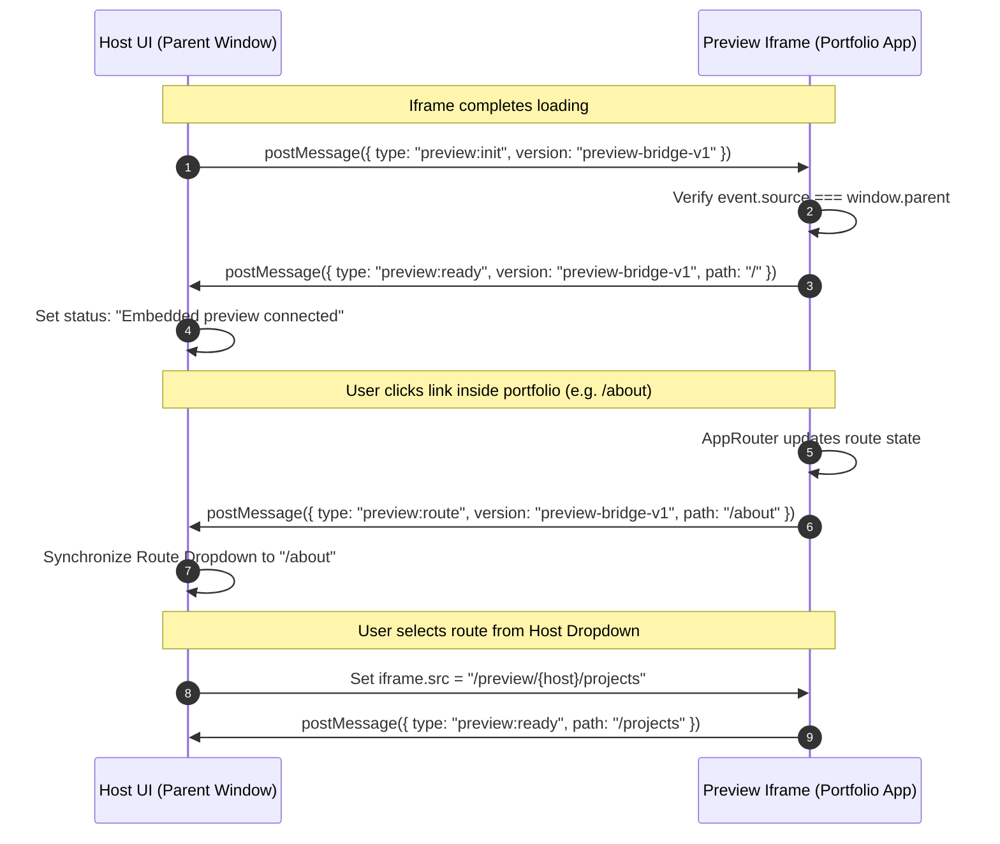

# Portfolio Preview System — Complete Architecture & Deep Dive

This document provides a comprehensive technical deep dive into the **Portfolio Preview System** in OryxenAI. It explains how generated portfolios are stored, isolated, served, embedded, and interacted with by users in the frontend.

---

## Table of Contents

1. [Overview & Design Philosophy](#1-overview--design-philosophy)
2. [End-to-End Preview Architecture](#2-end-to-end-preview-architecture)
3. [Dual-Gateway Architecture](#3-dual-gateway-architecture)
   - [The Production PreviewGateway](#the-production-previewgateway)
   - [The Ephemeral CandidateGateway](#the-ephemeral-candidategateway)
   - [The Developer Candidate Server](#the-developer-candidate-server)
   - [Ephemeral Loopback Server](#ephemeral-loopback-server)
4. [Storage Abstraction & Atomic Promotion Lifecycle](#4-storage-abstraction--atomic-promotion-lifecycle)
   - [PreviewStorage Protocol & Providers](#previewstorage-protocol--providers)
   - [Candidate Staging](#candidate-staging)
   - [Atomic Promotion via Conditional CAS](#atomic-promotion-via-conditional-cas)
   - [Public Read-Back Verification & Safe Rollback](#public-read-back-verification--safe-rollback)
5. [Security, Sandboxing & Content Security Policy (CSP)](#5-security-sandboxing--content-security-policy-csp)
   - [Zero Outbound Network Requests (`connect-src 'none'`)](#zero-outbound-network-requests-connect-src-none)
   - [Clickjacking Defense (`frame-ancestors`)](#clickjacking-defense-frame-ancestors)
   - [Iframe Sandboxing](#iframe-sandboxing)
6. [Runtime Mounts & Asset Resolution Architecture](#6-runtime-mounts--asset-resolution-architecture)
   - [The SPA Nested Mount Problem](#the-spa-nested-mount-problem)
   - [Gateway HTML URL Rewriting](#gateway-html-url-rewriting)
   - [Gateway Base Injection](#gateway-base-injection)
   - [Client-Side URL Resolution (`ResourceUrl.ts`, `AppRouter.tsx`)](#client-side-url-resolution-resourceurlts-approutertsx)
7. [Frontend Interactivity & The Iframe Bridge](#7-frontend-interactivity--the-iframe-bridge)
   - [The `preview-bridge-v1` Protocol](#the-preview-bridge-v1-protocol)
   - [Host Controller & State Synchronization](#host-controller--state-synchronization)
   - [Responsive Viewport Simulation](#responsive-viewport-simulation)
   - [Route Switching & Navigation Controls](#route-switching--navigation-controls)
   - [Unverified Candidate Fallback](#unverified-candidate-fallback)
8. [Standalone CLI Export Previewer (`preview-codegen-export.py`)](#8-standalone-cli-export-previewer-preview-codegen-exportpy)
9. [Production Cloud & Storage Handoff](#9-production-cloud--storage-handoff)

---

## 1. Overview & Design Philosophy

When the Code Generator completes a portfolio website, the user is presented with a **Live Preview** directly in the application interface. The user can navigate between pages, test responsive viewports (Mobile, Tablet, Desktop), trigger interactive animations, and verify layout quality.

Serving an AI-generated web application safely inside a web product presents fundamental engineering challenges:

1. **Security Isolation**: The generated site contains arbitrary JavaScript produced by an LLM. It must never have access to parent session cookies, local storage, API credentials, or the ability to make arbitrary outbound network requests (e.g., data exfiltration or phishing).
2. **SPA Routing on Subpaths**: A modern Single Page Application (SPA) built with Vite normally expects to be hosted at the domain root (`/`). In OryxenAI, previews are mounted under dynamic subpaths like `/preview/{host}/` or `/preview/candidate/{token}/{id}/{hash}/`. Without intelligent rewriting, internal navigation and asset fetches break.
3. **Atomic Zero-Downtime Promotion**: When a portfolio is regenerated or retried, the user must continue seeing the previous stable preview until the new candidate is built, verified, and atomically promoted. The preview must never be left in a half-written or broken state.
4. **Bi-Directional Communication**: The parent application needs to know which page the user is viewing inside the iframe, and the user must be able to switch routes using the parent toolbar dropdown.

The OryxenAI Preview System solves all four challenges through a specialized **Dual-Gateway architecture**, **immutable content-addressed storage**, **dynamic URL rewriting**, and an **isolated postMessage bridge protocol**.

---

## 2. End-to-End Preview Architecture

The diagram below illustrates how a generated portfolio moves from raw Vite build output to an active, interactive preview inside the frontend:

```mermaid
flowchart TD
    subgraph Verification ["Phase 4: Verification"]
        A[Clean Build: npm run build] --> B[dist/ folder generated]
        B --> C[CandidateGateway + EphemeralServer]
        C --> D[Playwright Headless Browser Verification]
    end

    subgraph Storage ["Preview Storage (Local FS / S3 / R2)"]
        D -- Verification Passed --> E[Store Immutable Candidate Artifacts]
        E --> F[preview/candidates/{candidate_id}/{build_hash}/dist/]
        F --> G[Prepare PendingPromotion]
        G --> H[Conditional CAS Pointer Update]
        H --> I[preview/hosts/{host}/active.json]
    end

    subgraph Gateway ["Preview Gateway (Port 4174)"]
        I --> J[PreviewGateway.serve()]
        J --> K[Inject <meta name='oryxenai-preview-base'>]
        J --> L[Rewrite Asset & Script URLs]
        J --> M[Apply Strict Security CSP]
    end

    subgraph Frontend ["Host Application (Browser)"]
        M --> N[Embed in <iframe> with sandbox]
        N --> O[Handshake via PreviewBridge: postMessage]
        O --> P[Interactive Preview: Viewports, Routes, Live Click]
    end
```

---

## 3. Dual-Gateway Architecture

OryxenAI separates candidate verification serving from active production serving using two dedicated Starlette-based gateways defined in `src/oryxenai/preview/gateway.py`:

```
                               ┌──────────────────────────────────────────────┐
                               │              Preview System                  │
                               └──────────────────────┬───────────────────────┘
                                                      │
                       ┌──────────────────────────────┴──────────────────────────────┐
                       ▼                                                             ▼
        ┌─────────────────────────────┐                               ┌─────────────────────────────┐
        │       PreviewGateway        │                               │      CandidateGateway       │
        ├─────────────────────────────┤                               ├─────────────────────────────┤
        │ • Persistent preview server │                               │ • Ephemeral loopback server │
        │ • Serves active.json pointer│                               │ • Spun up only for testing  │
        │ • Resolves host from session│                               │ • Requires verify token     │
        │ • Public read-back support  │                               │ • Validates dist/ in-flight │
        └─────────────────────────────┘                               └─────────────────────────────┘
```

### The Production PreviewGateway

`PreviewGateway` is the long-running, isolated service (default port `4174`, path prefix `/preview`) responsible for serving active portfolio previews to users and external evaluators.

#### Host Resolution
Every portfolio session is mapped to a deterministic preview host identifier:
```python
def _session_preview_host(session_id: UUID) -> str:
    encoded = base64.b32encode(hashlib.sha256(str(session_id).encode()).digest()).decode().lower()
    return f"session-{encoded[:24].rstrip('=')}"
```
Example host: `session-d3f4a8b7c9e123456789abcd`

#### Route Structure
The gateway mounts two primary route families:
1. **Active Host Route**: `GET /preview/{host}/{path:path}`
   - Resolves `preview/hosts/{host}/active.json` from `PreviewStorage`.
   - Verifies the receipt hash and candidate identity.
   - Serves files from `preview/candidates/{candidate_id}/{build_hash}/dist/{path}`.
   - For SPA routes (e.g., `/preview/{host}/about`), falls back to `index.html`.
2. **Capability Token Route**: `GET /preview/candidate/{token}/{candidate_id}/{build_hash}/{path:path}`
   - Serves an unpromoted or pre-release candidate build via an unguessable capability token.
   - Validates that `hashlib.sha256(token)` matches the manifest record and checks expiration.

### The Ephemeral CandidateGateway

`CandidateGateway` is an in-memory, local gateway created dynamically during Phase 4 verification:
- Points directly to the temporary build workspace (`dist_dir`).
- Requires a secret shared header: `x-preview-verify-token: <secret_token>`.
- Prevents external traffic or unauthorized processes from accessing the unverified candidate during testing.

### The Developer Candidate Server

Implemented in `src/oryxenai/web/routes.py`:
- Route: `/dev/code-generator-development/candidate-preview/{folder}/{path:path}`
- If a run fails verification and enters `needs_attention`, its built `dist/` directory still exists on disk.
- To allow developers to diagnose the failure visually, this endpoint serves the unpromoted files with an explicit header and UI badge: `Unverified candidate · not promoted`.

### Ephemeral Loopback Server (`src/oryxenai/preview/server.py`)

During automated testing, `start_ephemeral_server()` binds the gateway to a dynamically allocated loopback port:

```python
async def start_ephemeral_server(app: Any, *, timeout_seconds: float = 10.0) -> EphemeralServer:
    port = _free_port()  # Binds socket to port 0 to get OS-assigned free port
    config = uvicorn.Config(app, host="127.0.0.1", port=port, log_level="error")
    server = uvicorn.Server(config)
    task = asyncio.create_task(server.serve())
    # Polls http://127.0.0.1:{port} until responsive or timeout
    ...
```
This guarantees that concurrent test runs and worker jobs never collide on ports.

---

## 4. Storage Abstraction & Atomic Promotion Lifecycle

All preview files and pointer records are managed through the provider-neutral `PreviewStorage` interface defined in `src/oryxenai/storage/preview.py`.

### PreviewStorage Protocol & Providers

```python
class PreviewStorage(Protocol):
    async def put_immutable(self, *, key: str, data: bytes, content_type: str) -> PreviewObject: ...
    async def get(self, key: str) -> tuple[PreviewObject, bytes] | None: ...
    async def head(self, key: str) -> PreviewObject | None: ...
    async def put_conditional(
        self, *, key: str, data: bytes, content_type: str, expected_etag: str | None
    ) -> PreviewObject: ...
    async def delete(self, key: str) -> None: ...
    async def list_prefix(
        self, prefix: str, *, limit: int = 100, continuation: str | None = None
    ) -> tuple[list[str], str | None]: ...
```

Three implementations exist:
1. **`LocalPreviewStorage`**: Used for local development and CI. Stores files under `.workspace/code-generator-preview/` with atomic partial-renames and sidecar metadata in `.metadata/`.
2. **`S3PreviewStorage`**: Used for production. Compatible with **Cloudflare R2** and **AWS S3**. Uses S3 native conditional writes (`IfMatch`, `IfNoneMatch: *`) and metadata hashing.
3. **`MemoryPreviewStorage`**: Pure in-memory dictionary storage with `asyncio.Lock`, used in fast unit tests.

### Candidate Staging

When a build passes local tests, `PreviewPromoter.store_candidate()` writes all verified files to immutable keys:
- Static assets: `preview/candidates/{candidate_id}/{build_hash}/dist/{entry.path}`
- Verification report: `preview/verification/{candidate_id}/{report_hash}.json`
- Capability manifest: `preview/candidates/{candidate_id}/{build_hash}/manifest.json`

Every written file is read back immediately to verify its SHA256 checksum against the build manifest. If any byte mismatch occurs, candidate storage fails immediately.

### Atomic Promotion via Conditional CAS

Promotion updates the active pointer file `preview/hosts/{host}/active.json`. To prevent race conditions between parallel runs or workers, promotion uses **Compare-And-Swap (CAS)**:

```python
pointer_object = await self.storage.put_conditional(
    key=f"preview/hosts/{host}/active.json",
    data=pointer_data,
    content_type="application/json",
    expected_etag=pending.previous_pointer_etag or None,
)
```

- If another worker promoted a run concurrently, the ETag check fails with `PREVIEW_CONDITION_FAILED`.
- The update is atomic: the pointer file instantaneously begins pointing to the new candidate prefix and build manifest.

### Public Read-Back Verification & Safe Rollback

Even after storage promotion succeeds, the system does not mark the run as `READY` until **Public Read-Back Verification** confirms that the preview gateway is actually serving the site:

1. The promoter issues real HTTP `GET` requests to:
   - Root: `{preview_base_url}/{host}/`
   - Every public route: `{preview_base_url}/{host}/about`, `{preview_base_url}/{host}/projects`, etc.
   - Every static asset: `{preview_base_url}/{host}/assets/app.js`, CSS, fonts, and images.
2. For static assets, the HTTP response body SHA256 checksum is compared against the build manifest.
3. **Automatic Rollback**: If public read-back fails (e.g., gateway configuration error or network partition), the promoter automatically restores the previous pointer:
   ```python
   await self._restore_previous_pointer(
       pointer_key=pointer_key,
       pointer_object=pointer_object,
       pending=pending,
   )
   ```
   The run transitions to `PREVIEW_PENDING` or `NEEDS_ATTENTION`, ensuring a broken site is never served.

---

## 5. Security, Sandboxing & Content Security Policy (CSP)

Previewed portfolios execute untrusted, LLM-generated JavaScript. OryxenAI implements defense-in-depth security headers in `src/oryxenai/preview/gateway.py`:

```http
Content-Security-Policy: default-src 'self'; script-src 'self'; style-src 'self'; img-src 'self'; font-src 'self'; connect-src 'none'; object-src 'none'; base-uri 'none'; form-action 'none'; worker-src 'none'; manifest-src 'none'; frame-ancestors http://127.0.0.1:8000
X-Content-Type-Options: nosniff
Referrer-Policy: no-referrer
Permissions-Policy: camera=(), microphone=(), geolocation=(), payment=()
Cross-Origin-Resource-Policy: cross-origin
X-Robots-Tag: noindex, nofollow, noarchive
Cache-Control: public, max-age=31536000, immutable (for static assets) / no-store (for index.html)
```

### Zero Outbound Network Requests (`connect-src 'none'`)
- **`connect-src 'none'`** ensures that the generated site cannot make `fetch()`, `XMLHttpRequest`, `WebSocket`, or `EventSource` calls to any server — not even its own gateway.
- This provides an ironclad guarantee: the generated portfolio cannot exfiltrate user data, send analytics, load third-party scripts dynamically, or connect to command-and-control servers.

### Clickjacking Defense (`frame-ancestors`)
- `frame-ancestors` is strictly configured to allow only the parent application origin (e.g., `http://127.0.0.1:8000` or production domain).
- Wildcards (`*`) are explicitly rejected by `_normalize_embed_origins()`.
- Third-party websites cannot embed OryxenAI portfolio previews in malicious iframes.

### Iframe Sandboxing
In the frontend template (`code_generator_development.html`), the preview iframe is sandboxed:
```html
<iframe
  data-preview-frame
  title="Promoted generated portfolio"
  sandbox="allow-scripts allow-same-origin"
  hidden>
</iframe>
```
- Restricts top-level navigation (`allow-top-navigation` is omitted).
- Disables popups and new windows (`allow-popups` is omitted).
- Prevents form submissions (`allow-forms` is omitted).

---

## 6. Runtime Mounts & Asset Resolution Architecture

### The SPA Nested Mount Problem

Vite bundles applications expecting either root paths (`/assets/app.js`) or relative paths (`./assets/app.js`).
When a preview is mounted at `/preview/session-abc12345/`:
- If the user navigates to `/preview/session-abc12345/projects`, a relative reference `./assets/app.js` would incorrectly resolve in the browser to `/preview/session-abc12345/projects/assets/app.js` (a 404).
- If Vite used absolute `/assets/app.js`, it would collide with the parent application's own assets.

### Gateway HTML URL Rewriting

To solve this without modifying immutable build artifacts, `PreviewGateway` dynamically intercepts `index.html` responses and rewrites local asset references:

```python
def _rewrite_preview_html_urls(data: bytes, mount_path: str) -> bytes:
    # Uses regex to rewrite script src, link href, img src, and srcset
    # Transforms "./assets/index.js" -> "/preview/session-abc12345/assets/index.js"
```

External URLs (`https://...`), data URIs (`data:...`), and blob URIs are left untouched.

### Gateway Base Injection

The gateway injects a special runtime metadata tag into the `<head>` of the delivered HTML:

```html
<meta name="oryxenai-preview-base" content="/preview/session-abc12345/">
```

This tells the client-side router and asset resolver exactly where the portfolio is mounted.

### Client-Side URL Resolution (`ResourceUrl.ts`, `AppRouter.tsx`)

Inside the React scaffold (`react-vite-v1`):

#### 1. `ResourceUrl.ts`
Resolves images, media, and route links relative to the injected mount prefix:
```typescript
function runtimeBaseUrl(): URL {
  const configured = document.querySelector('meta[name="oryxenai-preview-base"]')?.getAttribute("content")?.trim();
  if (configured) {
    const path = `/${configured.replace(/^\/+|\/+$/g, "")}/`;
    return new URL(path, window.location.origin);
  }
  ...
}

export function publicResourceUrl(path: string): string {
  return new URL(path.replace(/^public\//, "").replace(/^\/+/, ""), runtimeBaseUrl()).toString();
}
```

#### 2. `AppRouter.tsx`
Handles SPA client-side routing while respecting the preview prefix:
```typescript
function currentPath(): string {
  const pathname = window.location.pathname || "/";
  const base = previewBasePath();
  if (base !== "/" && pathname.startsWith(base)) {
    return pathname.slice(base.length - 1) || "/";
  }
  return pathname || "/";
}
```
When an internal link (`<a href="/projects">`) is clicked, `AppRouter` intercepts the event, prefixes the path with the mount base (`/preview/session-abc12345/projects`), pushes the state to `window.history`, and updates the React view without triggering a full page reload.

---

## 7. Frontend Interactivity & The Iframe Bridge

To enable rich interaction between the parent application and the sandboxed preview iframe, OryxenAI implements the **`preview-bridge-v1`** postMessage protocol.



### The `preview-bridge-v1` Protocol

Defined in `src/oryxenai/agents/code_generator/scaffolds/react-vite-v1/src/app/PreviewBridge.ts`:

1. **Initialization (`preview:init`)**:
   - The host application listens for the iframe `load` event and dispatches `{ type: "preview:init", version: "preview-bridge-v1" }` targeting the iframe origin.
2. **Ready Acknowledgement (`preview:ready`)**:
   - The portfolio validates that the sender is `window.parent`, saves `trustedParentOrigin = event.origin`, and replies with `{ type: "preview:ready", version: "preview-bridge-v1", path: currentPath() }`.
3. **Route Notification (`preview:route`)**:
   - Whenever `AppRouter` navigates, it calls `notifyPreviewRoute(path)`. The portfolio posts `{ type: "preview:route", version: "preview-bridge-v1", path }` to the parent window.

### Host Controller & State Synchronization

In `src/oryxenai/web/static/code-generator-development.js`:
- The host maintains `previewBridgeReady`.
- If the bridge does not respond within 5000ms (e.g., due to an unhandled script error in the candidate), the host updates the status bar:
  `"Embedded preview did not respond. Use Open preview to inspect the verified output."`
- When `preview:ready` is received, the host clears the timeout and displays `"Embedded preview connected."`.

### Responsive Viewport Simulation

The preview toolbar offers four responsive viewport modes:

| Mode | Width | Height | Purpose |
|---|---|---|---|
| **Mobile** | `390px` | `844px` | Simulates modern iPhone/Android portrait viewports. |
| **Tablet** | `768px` | `1024px` | Simulates iPad portrait orientation. |
| **Desktop** | `1440px` | `900px` | Simulates standard laptop/desktop widescreen. |
| **Fit** | `100%` | `42rem` | Expands to fit the host container with fluid width. |

Clicking a viewport button dynamically adjusts the iframe's CSS `width` and `height`, triggering CSS media queries and container queries inside the portfolio.

### Route Switching & Navigation Controls

- **Route Dropdown (`data-preview-route`)**: Populated dynamically from the accepted `SitePlan`. Selecting a route updates the iframe source.
- **Refresh Button (`data-preview-refresh`)**: Invokes `iframe.contentWindow.location.reload()` to re-test initial loading states and animations.
- **Open in New Tab (`data-preview-open`)**: Provides a direct link (`target="_blank"`) to open the preview in a dedicated browser tab.

### Unverified Candidate Fallback

If a generation run encounters a problem during headless testing and enters `needs_attention`, its built site is still preserved in the export folder.
The frontend controller detects this condition:
```javascript
if (!currentPreview?.url && run.status === 'needs_attention' && run.export_receipt?.dist_path) {
  currentPreview = { url: `${location.origin}/dev/code-generator-development/candidate-preview/${encodeURIComponent(run.export_receipt.folder)}/` };
  previewIsUnverifiedCandidate = true;
}
```
The preview card renders the candidate but displays a prominent warning badge:
`Unverified candidate · not promoted (DIAGNOSTIC_CODE)`
This allows human reviewers or developers to inspect what failed visually without mistaking it for a verified release.

---

## 8. Standalone CLI Export Previewer (`preview-codegen-export.py`)

For local debugging, offline evaluations, and inspection without running the FastAPI server or Vite, OryxenAI provides a dedicated CLI preview tool in `scripts/preview-codegen-export.py`:

```powershell
uv run python scripts/preview-codegen-export.py output/code-gen-output/<export-folder>/dist --port 8080
```

### Key Technical Features

1. **Loopback Only (`127.0.0.1`)**: Never binds to public interfaces (`0.0.0.0`), preventing unintended network exposure.
2. **True SPA Fallback**:
   - Requests for `/`, `/about`, `/projects` serve `dist/index.html`.
   - Missing static assets (`.js`, `.css`, `.png`, `.woff2`) return a real **HTTP 404** rather than falling back to `index.html`. This immediately surfaces broken asset links that would otherwise fail silently.
3. **No-Cache Enforcement**:
   - Emits `Cache-Control: no-store, max-age=0` and `Pragma: no-cache`.
   - Prevents browsers from caching stale bundles during iterative development.
4. **HTML Asset URL Rewriting**:
   - Rewrites Vite asset paths so nested route URLs resolve properly to the export root.

---

## 9. Production Cloud & Storage Handoff

In production deployments (e.g., Azure VM, AWS, or Cloudflare R2):

### Recommended Configuration (`config/app.toml` or Docker overlay)

```toml
[code_generator_verification]
preview_storage_provider = "s3"          # or "r2_s3"
preview_storage_prefix = "portfolio-previews"
preview_base_url = "https://preview.oryxen.ai/preview"
preview_parent_origin = "https://app.oryxen.ai"
preview_embed_origins = ["https://app.oryxen.ai"]
preview_public_readback_required = true
```

### Health Check Endpoints
The preview gateway exposes two standard observability endpoints:
- **`GET /health/live`**: Returns `{"status": "ok", "service": "preview-gateway"}`. Used by Kubernetes/Docker liveness probes.
- **`GET /health/ready`**: Executes a lightweight `HEAD` request against preview storage (`preview/health/readiness`). Returns HTTP 200 if storage is reachable, or HTTP 503 if credentials or storage are unavailable.

---

## Summary of Preview Subsystem Files

| File Path | Role |
|---|---|
| `src/oryxenai/preview/gateway.py` | Implementation of `PreviewGateway`, `CandidateGateway`, CSP headers, asset URL rewriting, and HTML base tag injection. |
| `src/oryxenai/preview/server.py` | Ephemeral loopback ASGI server for test runners and Playwright verification. |
| `src/oryxenai/preview/promotion.py` | Candidate staging, conditional CAS promotion, and public read-back verification logic. |
| `src/oryxenai/preview/reconciler.py` | Idempotent recovery for pending promotions interrupted by crashes or timeouts. |
| `src/oryxenai/storage/preview.py` | Storage implementations (`LocalPreviewStorage`, `S3PreviewStorage`, `MemoryPreviewStorage`). |
| `src/oryxenai/web/routes.py` | Development candidate preview endpoint for unpromoted runs (`/candidate-preview/...`). |
| `src/oryxenai/web/templates/code_generator_development.html` | Frontend preview UI template: iframe sandbox, viewport buttons, route select, refresh. |
| `src/oryxenai/web/static/code-generator-development.js` | Frontend controller: postMessage bridge event listener, viewport sizing, error state handling. |
| `src/oryxenai/agents/code_generator/scaffolds/react-vite-v1/src/app/PreviewBridge.ts` | Embedded client postMessage listener and route notification bridge. |
| `src/oryxenai/agents/code_generator/scaffolds/react-vite-v1/src/app/ResourceUrl.ts` | Dynamic client-side asset and route URL resolver using injected preview base metadata. |
| `src/oryxenai/agents/code_generator/scaffolds/react-vite-v1/src/app/AppRouter.tsx` | Client-side SPA router with mount prefix support and route notification dispatch. |
| `scripts/preview-codegen-export.py` | Standalone Python HTTP server for local export viewing without dependencies. |
