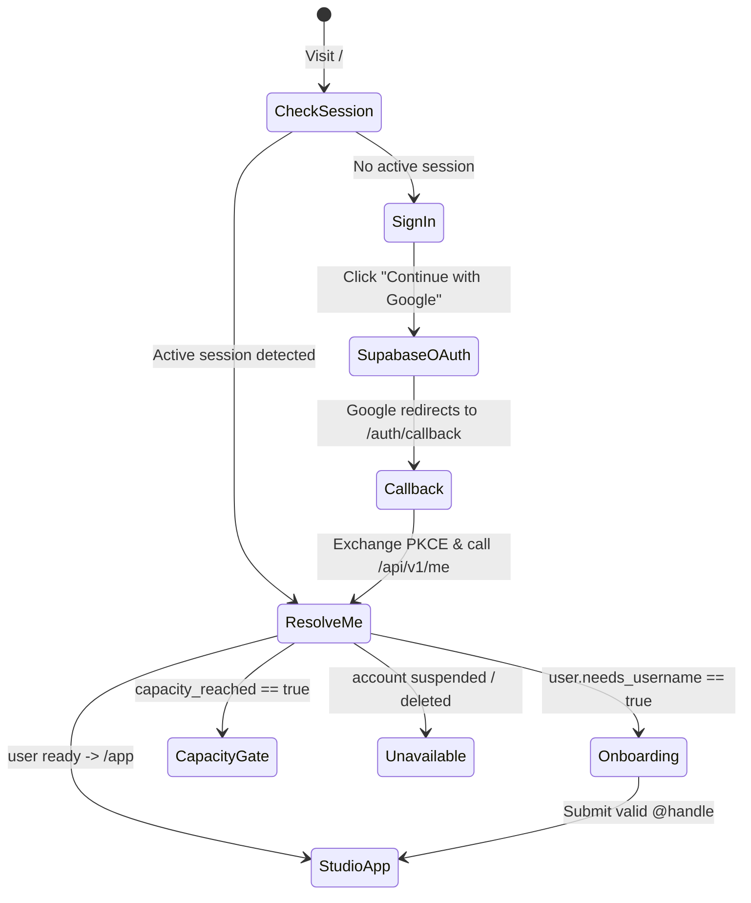

# OryxenAI — Frontend UI/UX Blueprint, Screen Guide & Behavioral Spec

> **Target Audience:** Design Agents, AI Image Generators, and Frontend Architects.  
> **Purpose:** Provide an exhaustive, authoritative blueprint of OryxenAI’s product concept, agent lifecycles, event flows, what is shown vs. hidden, simulated streaming/progressive reveal behavior, authentication states, page routing, complete screen inventory, component interactions, and visual design tokens.

---

## 1. Executive Summary & Core Philosophy

### What OryxenAI Is
**OryxenAI** is an agentic portfolio-generation studio. It transforms raw human experience, unstructured career history, resumes, and project notes into a bespoke, verified, and deployable personal portfolio website.

Instead of a generic site builder or a chatbot wrapped around an LLM, OryxenAI functions as a **structured creative studio pipeline**. Specialized AI agents collaborate with the user through six distinct transformation stages:
1. **Discovery Agent (`discovery`):** Clarifies goals, narrative positioning, and achievements through a focused conversational interview.
2. **Content Architect Agent (`content_architect`):** Designs the site architecture, page routes (`/`, `/work`, `/about`, `/contact`), sections, and full copy.
3. **Visual Design Director Agent (`visual_design_director`):** Establishes the creative thesis and prose color/typography/motion **intent** (never literal colors, hex codes, or font names) and produces a per-page scene storyboard plus asset briefs, referencing curated component patterns.
4. **Build Preparation Agent (`build_preparation`):** Compiles build briefs, researches licensed assets (fonts, imagery), and packages verified generation briefs.
5. **Code Generator Agent (`code_generator`):** Progressively authors source code, runs multi-viewport DOM geometry checks, and self-repairs runtime issues.
6. **Live Preview Gateway (`preview`):** Serves the verified, promoted build inside an isolated, secure interactive sandbox.

---

### Key Product Tenets

1. **One Canonical Portfolio (No Multi-Project Confusion):**
   * Normal users own **one living portfolio**, not a dashboard with 20 draft projects.
   * The studio always answers: *"Where is my portfolio right now and what is the next step?"*

2. **Adaptive Posture Across Stages:**
   * **Discovery:** Conversational interview — strictly 1 focused question at a time.
   * **Content & Design:** Document-centric artifact review with an inline revision composer.
   * **Build & Generation:** Calm, honest milestone progress (no fake % numbers or raw terminal dumps).
   * **Preview:** Interactive device theater (Mobile, Tablet, Desktop) in a secure sandbox.

3. **Explicit Human-in-the-Loop Handoffs:**
   * **No surprise auto-chaining:** Stages never start the next destructive or token-costly stage automatically.
   * Each stage requires explicit user review and an **"Approve & Continue"** action.

4. **"Editorial Swiss — The Living Draft" Aesthetic:**
   * **Warm, deliberate editorial feel:** Warm paper canvas (`#F3F0E8` / `#FCFBF7`), deep carbon ink (`#171A19`), crisp hairline rules (`#D3CFC4`), and a single electric cobalt blue (`#3157E7`) accent.
   * **Strict Anti-AI Clichés:** No purple gradients, no floating glassmorphism blobs, no sparkles or robot emojis, and no fake circular percentage dials.
   * **The Living Draft Line:** A thin cobalt hairline stroke that sweeps forward between milestones when the server confirms a durable state transition.

---

## 2. Agent Purpose, Event Lifecycles & Visibility Boundaries

A core architectural principle in OryxenAI is **curated visibility**: the user sees meaningful, decision-grade results, while internal model reasoning, raw telemetry, tool calls, and worker plumbing remain hidden.

```mermaid
flowchart TD
    subgraph S1[Stage 1: Discovery]
        D_In[Raw Intake / Resume] --> D_Q[understand_and_question]
        D_Q --> D_Ans[User Answers Questions]
        D_Ans --> D_B[build_or_revise_brief]
        D_B --> D_Rev[User Reviews Brief & Approves]
    end

    subgraph S2[Stage 2: Content Architect]
        D_Rev --> C_Plan[plan_content]
        C_Plan --> C_Write[write_pages]
        C_Write --> C_Int[integrate_content]
        C_Int --> C_Rev[User Reviews Routes & Approves]
    end

    subgraph S3[Stage 3: Visual Design Director]
        C_Rev --> V_Lang[establish_visual_language]
        V_Lang --> V_Page[direct_page_experience]
        V_Page --> V_Int[integrate_site_experience]
        V_Int --> V_Rev[User Reviews Visual System & Approves]
    end

    subgraph S4[Stage 4: Build Preparation]
        V_Rev --> B_Prep[build_preparation.prepare]
        B_Prep --> B_Pack[Assemble Markdown Briefs & JSON Index]
    end

    subgraph S5[Stage 5: Code Generator]
        B_Pack --> G_Plan[Planning & Work Graph]
        G_Plan --> G_Acq[Asset Acquisition]
        G_Acq --> G_Gen[Progressive Code Generation]
        G_Gen --> G_Ver[Multi-Viewport DOM Verification & Repair]
    end

    subgraph S6[Stage 6: Live Preview]
        G_Ver --> P_Prom[Promote to Live Preview]
        P_Prom --> P_Frame[Interactive Sandbox Theater]
    end
```



---

### Stage 1: Discovery Agent (`discovery`)

* **Primary Purpose:** Elicit the user’s career story, positioning, target audience, and key achievements to produce a crisp **Creative Brief**.
* **Lifecycle Events & Flow:**
  1. **Intake Event:** User pastes resume text, LinkedIn profile, or notes and clicks *"Start Discovery"*.
  2. **Job Enqueued:** Backend enqueues `discovery.understand_and_question`.
  3. **Question Formulation:** Model analyzes raw intake, identifies narrative gaps, and formulates 1–4 targeted questions.
  4. **Question Delivery:** Frontend receives questions and renders **Question 1 only**.
  5. **Answer Event:** User selects an option pill, enters free-text, or clicks *"Skip"*.
  6. **Next Question / Brief Trigger:** If more questions exist, Question 2 renders. When all are answered, state transitions to `brief_running`.
  7. **Brief Generation:** Backend runs `discovery.build_or_revise_brief` producing a Markdown brief with structured positioning.
  8. **Review Event:** State changes to `brief_review`. Frontend renders the brief document and action bar.
  9. **Optional Revision Event:** User types natural-language feedback (e.g. *"Make it more startup-focused"*); brief rebuilds.
  10. **Approval Event:** User clicks *"Approve Brief"*. Server freezes brief snapshot, stamps hash, locks Discovery as `approved`, and unlocks Content Architect.

* **What the User Sees vs. What is Hidden:**
  * **Visible to User:** The conversational transcript, the active question with clean option buttons, a free-text box, the skippable action, the curated brief summary (`brief.user_summary`, ~150–350 words), and the full rendered Markdown brief.
  * **Deliberately Hidden:** Raw resume intake dumps, internal persona scoring JSON, system prompts, provider names/tokens, model temperature, worker job IDs, and intermediate scratchpads.

---

### Stage 2: Content Architect Agent (`content_architect`)

* **Primary Purpose:** Structure the complete portfolio into navigable pages, define routes, layout sections, and write full publication-ready copy.
* **Lifecycle Events & Flow:**
  1. **Start Event:** User clicks *"Start Content Architecture"*. Backend verifies approved Discovery hash and enqueues `content_architect.build`.
  2. **Three-Pass Workflow:**
     * Pass 1: `plan_content` (site narrative, route blueprint, story strategy).
     * Pass 2: `write_pages` (page sections, headlines, case studies, body prose).
     * Pass 3: `integrate_content` (cross-page consistency, navigation hierarchy, calls to action).
  3. **Content Delivery Event:** Backend status becomes `AWAITING_APPROVAL`.
  4. **Route-by-Route Review:** User browses routes (`/`, `/work`, `/about`, `/contact`) and reads exact prose.
  5. **Revision Event:** User enters feedback in the docked Revision Composer; background job updates the content pack.
  6. **Approval Event:** User clicks *"Approve Content"*. Content snapshot is cryptographically frozen; status becomes `APPROVED`.

* **What the User Sees vs. What is Hidden:**
  * **Visible to User:** Executive site summary (`user_summary`), route list, page-by-page section breakdown, headlines, verbatim body copy, metrics, and any non-empty warnings or unresolved issues flagged by the model.
  * **Deliberately Hidden:** Internal editorial notes (`PageContentPack.internal_notes`), model receipts, multi-pass reasoning tokens, raw JSON schema bindings, and database session IDs.

---

### Stage 3: Visual Design Director Agent (`visual_design_director`)

* **Primary Purpose:** Direct the aesthetic *intent* — a creative thesis plus prose color/typography/motion intent — and produce the structured, ID-bearing scene storyboard and asset briefs for each page, referencing curated component candidates. It never emits literal colors, hex codes, font names, or CSS values; those are resolved downstream.
* **Lifecycle Events & Flow:**
  1. **Start Event:** User clicks *"Start Visual Design"*. Backend enqueues `visual_design_director.build`.
  2. **Catalogue Lookup:** Plain Python tag-overlap lookup over `resources/catalogue.json` matches component candidates.
  3. **Three-Pass Workflow:**
     * Pass 1: `establish_visual_language` (creative thesis, prose color/typography/motion intent — no literal tokens).
     * Pass 2: `direct_page_experience` (per-page scene storyboard, layout intent, asset briefs).
     * Pass 3: `integrate_site_experience` (global navigation intent, shared visual systems, motion character).
  4. **Review Event:** Status becomes `design_review`. User reviews the creative thesis, the prose color/typography/motion intent, and the per-page scene storyboard with its asset-brief treatment cards.
  5. **Revision Event:** User submits natural-language styling adjustments; direction rebuilds.
  6. **Approval Event:** User clicks *"Approve Visual Direction"*. Visual state snapshot frozen; stage permanently locked.

* **What the User Sees vs. What is Hidden:**
  * **Visible to User:** Creative thesis one-liner and design keywords, prose color/typography/motion **intent** (never swatches, hex values, or font specimens — the backend produces none), the per-page scene storyboard (each scene's narrative goal, viewport role, layout intent, motion intent, responsive behavior) with paired asset-brief treatment cards (desktop/mobile treatment, decorative-vs-informative), and adapted layout candidates.
  * **Deliberately Hidden:** Raw catalogue candidate scores, internal tagging mechanics, model prompt traces, and downstream compilation flags.

---

### Stage 4: Build Preparation Agent (`build_preparation`)

* **Primary Purpose:** Pre-code compiler that resolves licensed fonts, curated imagery, and packages the approved creative handoff into deterministic briefs.
* **Lifecycle Events & Flow:**
  1. **Start Event:** User clicks *"Prepare Build"*. Backend enqueues `build_preparation.prepare`.
  2. **Validation:** Hash-checks the approved Discovery, Content, and Design states.
  3. **Asset Research:** Queries licensed font repositories and curated Unsplash imagery metadata (search-only, zero blind byte downloads).
  4. **Handoff Packaging:** Deterministically compiles two Markdown briefs:
     * `content-and-narrative-brief.md`
     * `visual-and-build-brief.md` (each with a fenced JSON index).
  5. **Readiness Event:** Status transitions to `READY`. Primary CTA changes to *"Start Code Generation"*.

* **What the User Sees vs. What is Hidden:**
  * **Visible to User:** 4-step progress checklist (Validating, Researching Assets, Assembling Briefs, Verifying Pack), completed asset counts (e.g. *"8 assets verified"*), and the ready state indicator.
  * **Deliberately Hidden:** R2 storage keys, bucket names, raw HTTP requests to search APIs, internal JSON index schemas, and temporary staging paths.

---

### Stage 5: Code Generator Agent (`code_generator`)

* **Primary Purpose:** Autonomous software engineer that compiles the briefs, acquires media, progressively authors code, runs multi-viewport DOM verification, and self-repairs errors.
* **Lifecycle Events & Flow:**
  1. **Start Event:** User clicks *"Generate Portfolio"*.
  2. **Planning & Work Graph:** Decomposes briefs into code generation tasks.
  3. **Asset Acquisition:** Pinned fonts and images are acquired locally.
  4. **Progressive Generation:** Authors clean HTML, CSS, JavaScript, or component modules page by page.
  5. **Multi-Viewport Verification:** Headless browser runs geometry checks across Desktop (1280px), Tablet (768px), and Mobile (375px) to detect layout shift or overflow.
  6. **Automated Repair (if needed):** If layout issues occur, the self-repair loop consumes a finite budget to fix CSS/DOM issues.
  7. **Promotion Event:** Status changes to `preview_pending` then `promoted`.

* **What the User Sees vs. What is Hidden:**
  * **Visible to User:** Semantic milestone checklist (Planning → Acquiring → Progressive Building → Viewport Testing → Promotion), active route badge (e.g. *"Generating /work"*), and calm status copy.
  * **Deliberately Hidden:** Raw token streaming, AST compiler errors, terminal stderr/stdout, internal repair iteration counts, file system diffs, and low-level test failure traces.

---

### Stage 6: Live Preview Gateway (`preview`)

* **Primary Purpose:** Provide an isolated, secure interactive sandbox for inspecting the live generated portfolio.
* **Lifecycle Events & Flow:**
  1. **Mount Event:** Promoted build loads inside an isolated cross-origin `<iframe>`.
  2. **Device Toggling:** User clicks Desktop, Tablet, Mobile, or Fit; frame animates smoothly to target dimensions.
  3. **Route Navigation:** User selects routes from dropdown; iframe updates cleanly.
  4. **External Launch:** User clicks *"Open in New Window"*; site launches in a new tab (`noopener, noreferrer`).
  5. **Post-Success Entitlement:** User portfolio enters stable `read_only` mode.

---

## 3. Behavioral UX Mechanics: Polling, "Fake Streaming" & Progressive Reveals

Because OryxenAI uses reliable, durable PostgreSQL background jobs rather than fragile token web sockets, communication between browser and server happens via **polling** (`GET` endpoints every ~1.2–1.5 seconds).

To ensure the interface feels lively, human, and responsive rather than flashing abrupt blocks of text, the frontend employs **Progressive Reveal & Simulated Streaming**:

```text
[Backend Poll Completes] ──> [New Question / Summary Arrives in State]
                                     │
                                     ▼
                      [Staged Progressive Reveal]
                      ├── Token / Chunk Simulation (30-45ms per word)
                      ├── Inline Blinking Cursor
                      └── Smooth Height Expansion Transition
```

### 1. Simulated Progressive Typewriter ("Fake Streaming")
* **When Applied:**
  * Newly generated Discovery questions arriving after intake.
  * Brief summary (`brief.user_summary`) when transitioning to `brief_review`.
  * Content Architect executive summary when entering `AWAITING_APPROVAL`.
* **How It Behaves:**
  * Instead of instantly dumping 300 words onto the canvas, the text streams into the DOM at a controlled rate (approx. 25–40 words per second).
  * A discreet cobalt hairline cursor (`|`) blinks at the insertion point.
  * Once the stream completes, the cursor softly fades out over 300ms, and the interactive controls (option pills, input boxes, approval buttons) smoothly fade in.
  * **Skip Affordance:** If the user clicks anywhere or presses `Escape`, the stream instantly finishes and displays the full text.

### 2. Calm Milestone Progress Animation
* **When Applied:** While background jobs are running (`questions_running`, `brief_running`, `build_running`, `generating`).
* **How It Behaves:**
  * The active milestone displays a subtle horizontal cobalt pulse on its indicator dot.
  * The status copy transitions with a gentle 200ms cross-fade (e.g., *"Drafting site narrative"* → *"Writing /work case studies"*).
  * The interface never flashes random numbers or fake percentages.

### 3. The Living Draft Line Transition
* **When Applied:** Immediately upon server confirmation of an approval or stage start.
* **How It Behaves:**
  * The hairline connector between the completed milestone and the next milestone lights up in electric cobalt blue (`#3157E7`).
  * A 2px light stroke travels smoothly across the connector (duration: 400ms, easing: `cubic-bezier(0.16, 1, 0.3, 1)`).
  * The completed milestone receives a checkmark, while the new milestone expands its label.

---

## 4. Authentication Lifecycle & Route Architecture

OryxenAI enforces a strict, server-authoritative authentication flow with zero client-side secrets:



### Full Route Inventory

| Route | View Name | Purpose | Authorized Roles |
|---|---|---|---|
| `/` | Gateway Router | Instant transparent redirect based on session status | Public |
| `/sign-in` | Sign-In / Landing | Minimalist editorial value prop + single Google CTA | Public |
| `/auth/callback` | OAuth Callback | PKCE exchange screen with animated Living Draft Line | Public |
| `/onboarding` | Handle Claiming | One-time username selection form (`@username`) | Authenticated (Needs Handle) |
| `/access-not-approved` | Beta Capacity Gate | Respectful notice when beta quota (e.g. 15 users) is full | Authenticated (Non-admitted) |
| `/account-unavailable` | Safe Error Screen | Explains suspended or deleted accounts with sign-out | Authenticated (Suspended) |
| `/app` | Studio Workspace | Core portfolio workspace (query-driven posture) | Admitted User / Admin |
| `/admin` | Admin Console | High-density user, queue, and audit log manager | Admin only |

### Studio Query-Parameter Routing

The studio at `/app` uses browser `history.pushState` to deep-link into specific views without requiring a bulky client router:

* `/app` — Default view (opens active stage or completed preview).
* `/app?stage=discovery` — Discovery interview or approved brief.
* `/app?stage=content` — Content Architect page reviewer.
* `/app?stage=design` — Visual Design Director creative thesis & scene storyboard.
* `/app?stage=prepare` — Build Preparation checklist.
* `/app?stage=generate` — Code Generator progress.
* `/app?view=preview` — Live Preview theater (`&route=/work&viewport=mobile`).

*Navigation Safety Rule:* Back/forward browser buttons change the visible view but **never mutate backend portfolio state**.

---

## 5. Interactive Click, Event & State Transition Matrix

This table maps every user click to its exact frontend behavior, API request, and resulting state change:

| Component / Button | User Click Event | Frontend Action | API Request | Resulting State & View |
|---|---|---|---|---|
| **Sign-In CTA** | Click *"Continue with Google"* | Redirects browser to Supabase Google OAuth URL | N/A | Redirects to Google consent screen |
| **Onboarding Submit** | Click *"Claim Username"* | Disables button, validates regex `^[a-z0-9_]{3,20}$` | `POST /api/v1/me/onboard` `{ username }` | Navigates to `/app` on success |
| **Start Discovery CTA** | Click *"Start Discovery Interview"* | Validates textarea not empty; shows loading spinner | `POST /api/v1/discovery/start` `{ intake_text }` | Transitions to `questions_queued` → `questions_running` |
| **Option Pill (1 of 3)** | Click suggested answer pill | Selects pill, immediately submits answer | `PUT /api/v1/discovery/answers` `{ question_id, answer }` | Advances to next question or begins brief drafting |
| **Free-Text Answer** | Type custom text + click *"Submit ↵"* | Submits text, disables input, appends to transcript | `PUT /api/v1/discovery/answers` `{ question_id, answer }` | Advances to next question or begins brief drafting |
| **Skip Question** | Click *"Skip this question"* | Submits `value: null, mode: "skipped"` | `PUT /api/v1/discovery/answers` `{ question_id, null }` | Advances to next question without penalizing context |
| **Request Revision** | Type revision prompt + click *"Revise"* | Shows inline "Revising..." banner, disables composer | `POST /api/v1/{agent}/revise` `{ feedback }` | Background job triggers; updated artifact returns |
| **Approve Brief** | Click *"Approve Brief & Continue"* | Shows modal confirming freeze; disables button | `POST /api/v1/discovery/approve` | Discovery permanently `approved`; reveals Content CTA |
| **Start Content** | Click *"Start Content Architecture"* | Starts stage 2; animates Living Draft Line forward | `POST /api/v1/content-architect/start` | Content Architect status `IN_PROGRESS` |
| **Route Sidebar Tab** | Click route (e.g. `/work`) | Switches active route view in reading surface | Client-side state | Renders selected page copy immediately |
| **Approve Content** | Click *"Approve All Content"* | Validates at least 1 publishable route; freezes copy | `POST /api/v1/content-architect/approve` | Content permanently `APPROVED`; reveals Design CTA |
| **Start Design** | Click *"Start Visual Design"* | Starts stage 3; animates Living Draft Line forward | `POST /api/v1/visual-design-director/start` | Visual Director status `IN_PROGRESS` |
| **Approve Design** | Click *"Approve Visual Direction"* | Freezes design tokens and page layout directives | `POST /api/v1/visual-design-director/approve` | Design permanently `APPROVED`; reveals Prepare CTA |
| **Prepare Build** | Click *"Prepare Build Package"* | Starts stage 4; displays 4-step checklist | `POST /api/v1/build-preparation/start` | Build Prep status `PREPARING` |
| **Generate Portfolio** | Click *"Start Code Generation"* | Starts stage 5 compiler and multi-viewport engine | `POST /api/v1/code-generator/start` | Generator status `queued` → `generating` |
| **Viewport Toggle** | Click *Mobile / Tablet / Desktop / Fit* | Updates iframe container width with 250ms CSS transition | Client-side state (`history.replaceState`) | Resizes preview frame cleanly |
| **Route Dropdown** | Select route in preview toolbar | Messages iframe via postMessage to navigate route | Client-side postMessage | Iframe navigates to target route |
| **Open in New Window** | Click *"↗ Open in New Window"* | Opens active preview URL in a fresh browser tab | Browser window open (`noopener, noreferrer`) | Independent full-screen preview |
| **Attention Repair CTA**| Click *"Run Automated Repair"* | Triggers bounded repair job on current failed stage | `POST /api/v1/{agent}/retry` | Retries stage execution with simplification hint |
| **Sign Out** | Click *"Sign Out"* in account menu | Clears local storage tokens, resets state store | Supabase Auth sign-out | Redirects to `/sign-in` |

---

## 6. Complete Screen Inventory & Wireframes

Below are the 14 key screens cataloged for design mockups and AI image generation.

---

### Screen 1: Sign-In / Welcome Surface
* **Route:** `/sign-in` | **Posture:** Minimalist, editorial, high trust.

```text
+-----------------------------------------------------------------------------------+
| ORYXENAI                                                                          |
|                                                                                   |
|                      Turn your experience into a portfolio                        |
|                      you can review before it goes anywhere.                      |
|                                                                                   |
|           An agentic studio that interviews you, structures your work,            |
|           directs your aesthetic, and compiles verified production code.          |
|                                                                                   |
|                        +---------------------------------+                        |
|                        |  [G]  Continue with Google      |                        |
|                        +---------------------------------+                        |
|                                                                                   |
|                  Zero public publishing without explicit approval.                |
|                             No credit card required.                              |
|                                                                                   |
+-----------------------------------------------------------------------------------+
```

---

### Screen 2: OAuth Processing & Verification
* **Route:** `/auth/callback` | **Posture:** Transient, reassuring.
* **Elements:** Centered brandmark, display headline *"Verifying your account..."*, and the animated cobalt Living Draft Line gliding horizontally.

---

### Screen 3: Username Onboarding
* **Route:** `/onboarding` | **Posture:** Direct, permanent, deliberate.
* **Elements:** Single paper card, headline *"Choose your portfolio handle"*, high-contrast input `[ @ | yashsrivastava ]`, inline green check *"Available"*, and CTA button *"Claim Username & Enter Studio →"*.

---

### Screen 4: Capacity Gate / Beta Access Notice
* **Route:** `/access-not-approved` | **Posture:** Polite, exclusive, non-punitive.
* **Elements:** Tag `EARLY ACCESS CAPACITY`, headline *"Our early preview is currently at capacity"*, explanation of dedicated GPU lanes, and secondary buttons *"Sign in with another account"* and *"Sign Out"*.

---

### Screen 5: Empty Studio / Start Surface
* **Route:** `/app` (Initial State) | **Posture:** Structured starting canvas.
* **Layout:** Top bar with brand and user menu; inactive 5-step journey rail; large warm paper intake box with placeholder *"Paste resume, bio, career achievements, or raw notes here..."*; CTA button *"Start Discovery Interview →"*.

---

### Screen 6: Discovery — Adaptive Interview Mode
* **Route:** `/app?stage=discovery` | **Posture:** Conversational, 1 question at a time.

```text
+-----------------------------------------------------------------------------------+
| ORYXENAI                     Portfolio: In Progress                @yash [Menu]   |
+-----------------------------------------------------------------------------------+
| [● 01 Discover] ===== 02 Content ----- 03 Design ----- 04 Prepare ----- 05 Gen    |
+-----------------------------------------------------------------------------------+
|                                                                                   |
|   PAST ANSWERS (Compact & Muted):                                                 |
|   ✓ Background: Led AI engine migration at Oryxen (45% latency reduction).        |
|                                                                                   |
|   -----------------------------------------------------------------------------   |
|                                                                                   |
|   QUESTION 2 OF 3:                                                                |
|   "Who is the primary audience for this portfolio website?"                       |
|                                                                                   |
|   [ 1. Tech Startup Founders & VCs ]   [ 2. Enterprise Engineering Leaders ]      |
|   [ 3. High-Growth Tech Recruiters ]                                              |
|                                                                                   |
|   +---------------------------------------------------------------------------+   |
|   | Or type something else... (e.g. Design agency creative directors)         |   |
|   +---------------------------------------------------------------------------+   |
|                                                                                   |
|   [ Submit Answer ↵ ]                                 [ Skip this question ]      |
|                                                                                   |
+-----------------------------------------------------------------------------------+
```

---

### Screen 7: Discovery — Brief Review & Approval Mode
* **Route:** `/app?stage=discovery` | **Posture:** Document-centric reading and freeze.
* **Layout:** Top bar showing `01 Discover: Review Brief`; centered 820px paper sheet with formatted Markdown (Executive Summary, Target Audience, 3 Core Pillars, Tone & Register); bottom bar with direct text edit button, natural-language revision input, and prominent cobalt button *"Approve Brief & Continue to Content →"*.

---

### Screen 8: Content Architect — Route & Copy Review
* **Route:** `/app?stage=content` | **Posture:** Multi-page architectural reader.

```text
+-----------------------------------------------------------------------------------+
| ORYXENAI                     Portfolio: In Progress                @yash [Menu]   |
+-----------------------------------------------------------------------------------+
| [✓ 01 Discover] ===== [● 02 Content] ----- 03 Design ----- 04 Prepare ----- 05 Gen|
+-----------------------------------------------------------------------------------+
| ROUTES               | PAGE CONTENT: /work/oryxen-engine                          |
|                      |                                                            |
| > / (Home)           | Section: Case Study Hero                                   |
|   - Hero Intro       | Headline: "Rebuilding the Autonomous Generation Engine"    |
|   - Featured Work    | Summary: "A retrospective on sub-second DOM compilation."  |
|                      |                                                            |
| * /work/oryxen-engine| Section: Architecture Retrospective                        |
|   - Deep Dive        | "In Q3, our multi-agent pipeline faced a 14-second bottleneck...
|   - Impact Metrics   | By moving to deterministic scope compilation..."          |
|                      |                                                            |
| > /about             | ---------------------------------------------------------- |
| > /contact           | [ ✎ Request Revision: "Add metric on mobile geometry" ]   |
+-----------------------------------------------------------------------------------+
| [✓ Approve All Content (4 Pages) & Continue to Design Direction →]                |
+-----------------------------------------------------------------------------------+
```

---

### Screen 9: Visual Design Director — Creative Thesis & Scene Storyboard Review
* **Route:** `/app?stage=design` | **Posture:** Art director's storyboard, in a two-zone workspace canvas.
* **Layout:**
  * Left rail: journey position, the live activity line (from `formatActivityStatus("visual_design_director", status)`), the creative-thesis one-liner, and at-a-glance counts (styled routes, scenes, asset briefs).
  * Right artifact zone:
    * Creative thesis + design keywords, and prose **color / typography / motion intent** cards. These are free-text intent, never swatches, hex values, contrast ratings, or font specimens — the backend produces no literal color or type values, so none are rendered.
    * **Primary artifact — the per-page scene storyboard:** an ordered sequence of numbered scene cards representing what a visitor experiences while scrolling each page. Each card shows the scene's narrative goal, viewport role, layout intent, motion intent, responsive behavior, and accessibility/reduced-motion intent, with the asset briefs that scene references shown as compact treatment cards (desktop treatment, mobile treatment, decorative-vs-informative tag).
    * Supporting detail (collapsible): per-route page-direction cards (storyboard prose, primary/secondary emphasis, desktop/mobile treatment) and adapted layout candidates.
    * When a run is `VISUAL_LANGUAGE_ONLY` (`pages_included: false`), only the thesis and prose intent are shown, with an explicit note that scene direction is produced in the next pass — never an empty or broken storyboard.
  * Bottom bar: Revision input and CTA *"Approve Design Direction & Prepare Build →"*.

---

### Screen 10: Build Preparation — Compiler Packaging
* **Route:** `/app?stage=prepare` | **Posture:** Calm, transparent technical checklist.
* **Layout:** Centered card with 4-step checklist:
  * `[✓]` Step 1: Validate approved Content & Design state hashes
  * `[✓]` Step 2: Research licensed typography & image references
  * `[✓]` Step 3: Assemble `content-and-narrative-brief.md`
  * `[●]` Step 4: Assemble `visual-and-build-brief.md` with JSON index
* Primary button once verified: *"Start Code Generation →"*.

---

### Screen 11: Code Generator — Progressive Build & Verification
* **Route:** `/app?stage=generate` | **Posture:** Honest engineering checkpoints.
* **Layout:** Active milestone stepper: Planning → Acquiring Assets → Progressive Route Authoring → Multi-Viewport DOM Geometry Verification → Promotion.
* Reassurance copy: *"Running headless browser layout tests across Desktop, Tablet, and Mobile."* (Zero fake % bars).

---

### Screen 12: Live Portfolio Preview — Multi-Device Interactive Theater
* **Route:** `/app?view=preview` | **Posture:** Interactive device showcase.

```text
+-----------------------------------------------------------------------------------+
| ORYXENAI                    ● Live Preview Ready (Verified)        @yash [Menu]   |
+-----------------------------------------------------------------------------------+
| [✓ 01 Discover] = [✓ 02 Content] = [✓ 03 Design] = [✓ 04 Prepare] = [✓ 05 Generate]|
+-----------------------------------------------------------------------------------+
| PREVIEW CONTROLS:                                                                 |
| Route: [ /work/oryxen-engine   ▼ ]      Device: [ Mobile ][ Tablet ][● Desktop ][ Fit ]|
|                                         Actions: [ ↻ Reload ]   [ ↗ Open in New Tab ]  |
+-----------------------------------------------------------------------------------+
|                                                                                   |
|   +---------------------------------------------------------------------------+   |
|   | [ 1280 × 800 px — Desktop Frame Container ]                               |   |
|   |                                                                           |   |
|   |   +-------------------------------------------------------------------+   |   |
|   |   | YASH SRIVASTAVA                     Work     About     Contact    |   |   |
|   |   +-------------------------------------------------------------------+   |   |
|   |   |                                                                   |   |   |
|   |   |   Rebuilding the Autonomous Engine for Sub-Second DOM             |   |   |
|   |   |   A case study in verified autonomous web development.            |   |   |
|   |   |                                                                   |   |   |
|   |   |   [ Interactive live website rendering inside isolated iframe ]  |   |   |
|   |   +-------------------------------------------------------------------+   |   |
|   +---------------------------------------------------------------------------+   |
|                                                                                   |
+-----------------------------------------------------------------------------------+
| Verified 2 minutes ago · Clean build passed across 3 viewports · Ready to deploy  |
+-----------------------------------------------------------------------------------+
```

---

### Screen 13: Needs Attention & Error Recovery
* **Route:** Any stage where status becomes `needs_attention` | **Posture:** Non-punitive, clear repair path.
* **Layout:** Centered amber-bordered card:
  1. *What happened:* *"Mobile menu overflowed on 375px screens."*
  2. *What remains safe:* *"All approved copy and desktop designs are fully preserved."*
  3. *Next action:* Primary button **"Run Automated Repair Pass"** or secondary button **"Return to Design Direction"**.

---

### Screen 14: Administrator Console
* **Route:** `/admin` | **Posture:** Dense, operational management.
* **Layout:** Quota meter (`Active Users: 12 / 15`), user table with stage indicators, entitlement reset actions, and real-time audit log stream.

---

## 7. Component Hierarchy & Architecture

```text
frontend/src/
├── main.tsx                    # Mounts Preact into #product-root with { boot, stop, restart }
├── app/
│   ├── AppShell.tsx            # Global layout: TopBar + JourneyRail + Surface + Toast
│   └── store.ts                # Centralized state, polling loop & BroadcastChannel sync
├── components/
│   ├── TopBar.tsx              # Logo, status badge ("Saved"), user handle, sign out
│   ├── JourneyRail.tsx         # 5 numbered stages + Preview with Living Draft line
│   ├── LivingDraftMark.tsx     # Hairline cobalt animation marking stage transitions
│   ├── StartSurface.tsx        # Empty state intake textarea & resume card
│   ├── ConversationSurface.tsx # Discovery interview: transcript + single question focus
│   ├── ArtifactSurface.tsx     # Split-pane route sidebar + formatted document viewer
│   ├── RevisionComposer.tsx    # Natural language feedback input dock with quick suggestions
│   ├── ProgressSurface.tsx     # 4-to-5 step calm semantic progress checklist
│   ├── PreviewTheater.tsx      # Device frame switcher, route picker, isolated iframe
│   ├── AttentionPanel.tsx      # Honest error explanation & recovery action card
│   └── SafeMarkdown.tsx        # Sanitized, styled typography renderer
└── styles/
    └── shell.css               # Vanilla CSS design tokens, typography, and responsive layout
```

---

## 8. Design System: "Editorial Swiss — The Living Draft"

### Color Tokens

```css
:root {
  /* Canvas & Reading Surfaces */
  --canvas:        #F3F0E8; /* Warm paper-like canvas background */
  --paper:         #FCFBF7; /* Elevated card and reading surface */
  
  /* Typography & Structure */
  --ink:           #171A19; /* High-contrast body text and dark buttons */
  --graphite:      #626660; /* Secondary metadata and labels */
  --rule:          #D3CFC4; /* Hairline borders and inactive dividers */
  
  /* Signature Brand Accent */
  --signal:        #3157E7; /* Electric Cobalt Blue: active step, focus, Living Draft */
  
  /* Semantic States */
  --positive:      #287356; /* Forest Green: approved, verified, completed */
  --attention:     #A9601E; /* Warm Amber: review needed, recoverable warning */
  --critical:      #B33F3A; /* Crimson: unrecoverable failure, delete action */
  --preview-frame: #202422; /* Neutral charcoal frame for site preview */
}
```

### Typography Scale

```css
/* Fonts */
--font-display: "Newsreader", Georgia, serif;
--font-sans:    system-ui, -apple-system, BlinkMacSystemFont, "Segoe UI", Inter, sans-serif;
--font-mono:    ui-monospace, SFMono-Regular, Consolas, monospace;

/* Type Scale */
--type-display: clamp(2.4rem, 5vw, 4.5rem) / 0.95;  /* Hero headlines */
--type-h1:      clamp(1.8rem, 3.5vw, 2.8rem) / 1.05; /* Stage and document titles */
--type-h2:      1.4rem / 1.2;                       /* Section headings */
--type-body-lg: 1.125rem / 1.55;                    /* Active interview questions */
--type-body:    1.0rem / 1.55;                      /* Main document text */
--type-small:   0.875rem / 1.4;                     /* Metadata and labels */
--type-label:   0.75rem / 1.2;                      /* Uppercase step markers */
```

### Geometry & Spacing
* **Base Rhythm:** 4px grid (4, 8, 12, 16, 24, 32, 48, 64px).
* **Radii:** Controls `8px`, Sheets `12px`, Main Document `16px`, Pills `9999px`.
* **Dividers:** `1px solid var(--rule)`.
* **Elevation:** Avoid blurred, colorful multi-layer drop shadows. Use a single crisp shadow: `box-shadow: 0 4px 20px -4px rgba(23, 26, 25, 0.06)`.

---

## 9. AI Image Generation Prompt Guide

Use these prompt recipes to generate high-fidelity UI mockup images for presentations, design alignment, and documentation:

### Prompt 1: Discovery Conversational Interview Screen
> *Modern clean web application UI screenshot of an AI portfolio design studio named OryxenAI. Single-column focused layout on warm ivory paper background (#F3F0E8). At top, a thin horizontal stepper showing '01 Discover (Active) — 02 Content — 03 Design — 04 Prepare — 05 Generate'. In the center, a large elegant serif question: 'What was your single most impactful engineering achievement in 2025?'. Below, a clean white input box with an electric cobalt blue submit button. Above the question, muted compact transcript text of previous answers. Minimalist Swiss design, Newsreader serif typography, hairline rules, luxury editorial tech aesthetic, zero purple gradients, zero glassmorphism, hyper-detailed UI interface.*

### Prompt 2: Content Architect Route & Copy Review Screen
> *Web application UI interface mockup of a professional portfolio copywriting studio. Split-pane layout: on the left, a slender navigation sidebar showing site routes ('/ (Home)', '/work', '/about', '/contact'). On the right, a wide white paper document reader with crisp black typography showing structured portfolio headlines, case study prose, and impact metrics. At the bottom, a docked revision composer bar with a text box 'Request revision' and a prominent cobalt blue button 'Approve Content & Continue'. Swiss modernist grid, warm eggshell backdrop, sharp hairline borders, subtle typography, highly refined editorial UI.*

### Prompt 3: Live Portfolio Preview Device Theater Screen
> *Sleek web application desktop screen showcasing an interactive website preview tool. In the center, a large, dark charcoal device frame container displaying a live rendered personal portfolio website for an engineering leader. Above the frame, a thin toolbar with device switch icons ('Mobile', 'Tablet', 'Desktop', 'Fit to Screen') and a route dropdown menu. At the top of the browser window, a breadcrumb stepper showing all 5 milestones completed with green checkmarks. Clean, elegant, premium SaaS UI design, high contrast, warm paper borders, ultra-crisp UI typography, Figma mockup quality.*
