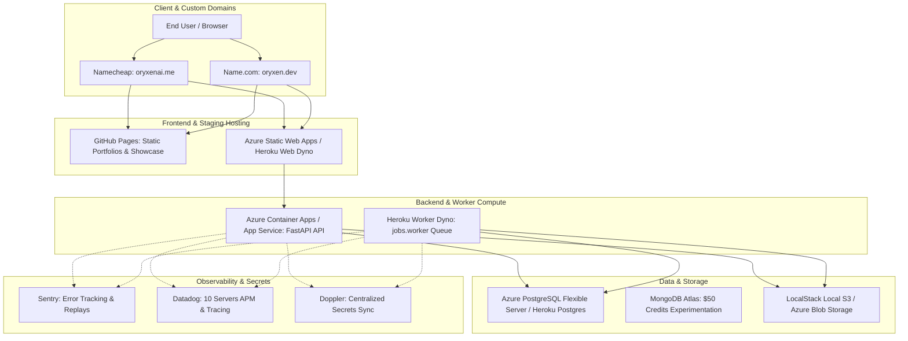
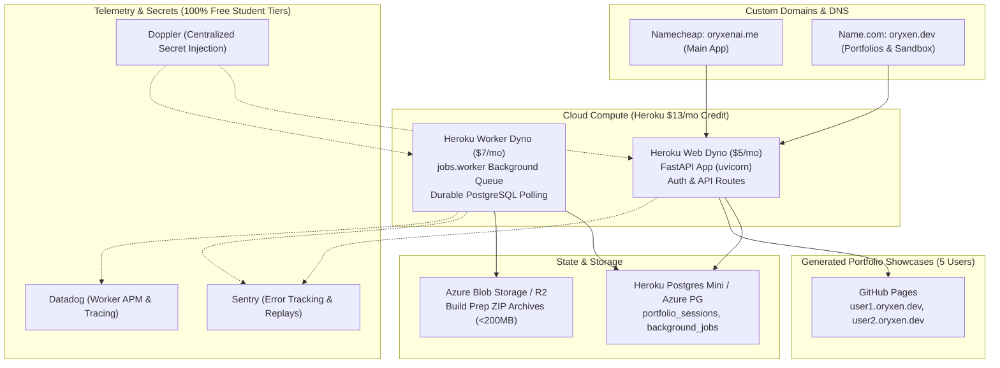

# GitHub Student Developer Pack: Complete Benefits Guide & OryxenAI Strategic Roadmap
> **Live Source**: Official GitHub Education Pack (`https://education.github.com/pack/offers`)
> **Total Active Partner Offers**: 83 Partners Across 14 Categories
> **Aggregate Market Value**: Over $10,000+ USD in Cloud Credits, Developer Tools, Domains, and Subscriptions
> **Purpose**: Comprehensive assessment of all 83 benefits for deployment, custom domains, database hosting, testing, observability, and AI development for **OryxenAI**.

---

## Table of Contents
1. [Executive Summary: OryxenAI Zero-Cost Production Stack](#1-executive-summary-oryxenai-zero-cost-production-stack)
2. [The 5-User Footprint & Zero-Cost Sizing Strategy](#2-the-5-user-footprint--zero-cost-sizing-strategy)
   - [A. 5-User Architectural Reality Check](#a-5-user-architectural-reality-check)
   - [B. Zero-Cost Resource Consumption & Runway Math](#b-zero-cost-resource-consumption--runway-math)
   - [C. Recommended 5-User Zero-Cost Deployment Blueprint](#c-the-recommended-5-user-zero-cost-deployment-blueprint)
3. [OryxenAI Core Architecture Pillar Analysis](#3-oryxenai-core-architecture-pillar-analysis)
   - [Pillar 1: Cloud Hosting & Compute (Deployment)](#pillar-1-cloud-hosting--compute-deployment)
   - [Pillar 2: Custom Domains, SSL & DNS Management](#pillar-2-custom-domains-ssl--dns-management)
   - [Pillar 3: Database & State Storage](#pillar-3-database--state-storage)
   - [Pillar 4: Testing, Multi-Viewport Verification & CI/CD](#pillar-4-testing-multi-viewport-verification--cicd)
   - [Pillar 5: Observability, Error Tracking & Monitoring](#pillar-5-observability-error-tracking--monitoring)
   - [Pillar 6: Secret Management, Auth & Security](#pillar-6-secret-management-auth--security)
   - [Pillar 7: Developer IDEs, AI & Productivity](#pillar-7-developer-ides-ai--productivity)
   - [Pillar 8: Visual Assets & Template Design System](#pillar-8-visual-assets--template-design-system)
   - [Pillar 9: Monetization, Communication & Operations](#pillar-9-monetization-communication--operations)
4. [Complete Master Catalog: All 83 Partner Offers](#4-complete-master-catalog-all-83-partner-offers)
   - [Summary Comparison Matrix](#summary-comparison-matrix)
   - [Tier 1: High Impact for OryxenAI (23 Partners)](#tier-1-high-impact-for-oryxenai)
   - [Tier 2: Medium Utility / Architecture Support (31 Partners)](#tier-2-medium-utility--architecture-support)
   - [Tier 3: Learning, Career & Non-Core Perks (29 Partners)](#tier-3-learning-career--non-core-perks)
5. [Actionable Activation Checklist & Timing Strategy](#5-actionable-activation-checklist--timing-strategy)

---

## 1. Executive Summary: OryxenAI Zero-Cost Production Stack

OryxenAI is an autonomous multi-agent portfolio-generation platform consisting of a **FastAPI backend**, a **PostgreSQL durable worker queue** (`background_jobs`), an **object-storage layer** for compiled ZIP artifacts, and a **modern React/TypeScript frontend**.

By systematically combining benefits from the **GitHub Student Developer Pack**, the entire OryxenAI application and its development lifecycle can be run on professional, production-grade cloud infrastructure at **$0 out-of-pocket cost**:



| Layer | Tool / Partner | Pack Benefit | OryxenAI Role |
| :--- | :--- | :--- | :--- |
| **Backend Compute** | **Microsoft Azure** | $100 credits + 25+ free services | Host FastAPI application in Azure Container Apps |
| **Worker Queue** | **Heroku** | $13/mo for 24 months ($312 total) | Run background `jobs.worker` process & Heroku Postgres |
| **Custom Domains** | **Namecheap** | 1-yr free `.me` domain + SSL | Primary production staging domain (`oryxenai.me`) |
| **Alternative Domain** | **Name.com** | 1-yr free `.dev` / `.app` + SSL | Developer brand identity (`oryxen.dev`) |
| **Database (Relational)**| **Azure PostgreSQL / Heroku** | Included in credits | Application state, `background_jobs`, `portfolio_sessions` |
| **Database (Document)**  | **MongoDB Atlas** | $50 credits + Compass GUI | Optional document storage for flexible agent outputs |
| **Database GUI** | **JetBrains DataGrip** | Included in JetBrains Pack | Visual database inspection & migrations tuning |
| **Storage Emulation** | **LocalStack Pro** | Free Pro license | Offline S3 emulation for Build Preparation artifact ZIPs |
| **Static Showcase** | **GitHub Pages** | Free unlimited hosting + SSL | Deploy AI-generated client portfolio showcases |
| **Error Tracking** | **Sentry** | 50k errors/mo, 100k txns/mo | Instant stack traces for unhandled FastAPI & worker errors |
| **APM & Tracing** | **Datadog** | Pro Account (10 hosts, 2 years) | Distributed tracing across FastAPI, worker queue & LLM calls |
| **Heartbeat & Uptime** | **Honeybadger** | Free 1 year Small account | Worker heartbeat check-in & uptime alerting |
| **Secrets Management** | **Doppler** | Free Team plan | Eliminates plaintext `.env` files across team/servers |
| **Multi-Viewport QA** | **Polypane** | 1-yr free browser license | Visual QA of Code Generator output across all viewports |
| **Device Cloud QA** | **BrowserStack** | 1-yr Automate Mobile plan | Real iOS Safari and Android Chrome layout validation |
| **Cross-Browser QA** | **LambdaTest** | 1-yr Live Plan | Interactive manual testing on 2000+ browsers/OS |
| **AI Pair Programming**| **GitHub Copilot** | Free student plan | Faster development across Python, React, and prompts |
| **Core IDEs** | **JetBrains (PyCharm Pro)**| Free annual All Products Pack | Best-in-class Python/FastAPI and React/TypeScript dev |
| **API Mocking** | **Requestly** | 1-yr Pro plan ($270 value) | Mock API responses to test frontend pipeline states |

---

## 2. The 5-User Footprint & Zero-Cost Sizing Strategy

### A. 5-User Architectural Reality Check

OryxenAI's native authentication architecture (Phase 1-4) was deliberately designed with a bounded single-tenant capacity gate: `MAX_STANDARD_USERS = 15` (defined in `oryxenai.auth.service`), plus bootstrap administrators. For an operational scale of **maximum 5 users**, the platform operates at **33% of its built-in single-tier gate**, meaning it will never trigger concurrency deadlocks, worker starvation, or connection pool exhaustion.

Here is the exact operational footprint for 5 concurrent users:
- **Active User Sessions**: 5 distinct users, each with 1 active portfolio session (as strictly enforced by Phase 3 single-portfolio entitlement rules).
- **Concurrency Load**: In real-world usage, 5 users generate portfolios intermittently. Peak concurrent agent runs will be **1 to 2 jobs simultaneously** at most.
- **Database Storage Footprint**:
  - `app_users`: 5 rows (~2 KB).
  - `portfolio_sessions`: 5 rows, each containing Discovery, Content Architect, and Visual Design Director state (~50 KB JSONB per session = ~250 KB total).
  - `background_jobs`: Transient job rows that complete and archive (~10-50 rows per generation cycle = < 1 MB).
  - `agent_runs`: Audit snapshots of model inputs and outputs (~5-10 MB total across all 5 users).
  - **Total DB Footprint**: **< 20 MB total storage**, which is under 2% of even the smallest free managed database tier.
- **Object Storage Footprint (Build Preparation ZIP Packs)**:
  - Each compiled portfolio ZIP pack is between 5 MB and 15 MB.
  - 5 users generating 2-3 revisions each = 10-15 ZIP archives (~150 MB total).
  - Disposable staging storage footprint is negligible (< 0.2 GB).
- **Network & Request Volume**:
  - The browser chat UI uses lightweight SSE or polling during active generation (~1 request per 1-2 seconds per active user).
  - For 5 users, maximum peak traffic is < 10 requests/sec, easily handled by a single asynchronous FastAPI worker.

---

### B. Zero-Cost Resource Consumption & Runway Math

By mapping this 5-user footprint to the GitHub Student Developer Pack benefits, the system achieves an incredible **24-month zero-dollar runway**:

| Resource Component | 5-User Daily/Monthly Load | Student Pack Partner & Benefit | Monthly Cost & Quota Utilization | Zero-Cost Runway |
| :--- | :--- | :--- | :--- | :--- |
| **API Web Server** (`main.py`) | < 10 req/s peak, ~50MB RAM base | **Heroku** ($13/mo for 24 mo) OR **Azure** Container Apps ($100 credit) | Heroku Eco/Basic Dyno ($5/mo) | **24 Months** (100% covered) |
| **Background Worker** (`jobs.worker`) | 1-2 concurrent claims, ~100MB RAM | **Heroku** Worker Dyno OR **Azure** Container Apps | Heroku Basic Worker Dyno ($7/mo) | **24 Months** ($12/mo total dynos < $13/mo credit) |
| **Relational Database** | PostgreSQL 16+, ~20MB storage, 5 conns | **Heroku Postgres Mini** OR **Azure Database for PostgreSQL** Flexible Server | Heroku Mini ($5/mo, credit-covered) OR Azure Free Tier (Burstable B1ms) | **12–24 Months** |
| **Document Storage** | Optional transcript & schema experimentation | **MongoDB Atlas** ($50 credits + Free Shared M0 Cluster) | Free M0 cluster (512MB free forever) + $50 credit for dedicated bursts | **Indefinite / Permanent** |
| **Artifact ZIP Storage** | 100–200 MB temporary packs | **Azure Blob Storage** OR **Cloudflare R2** | 5 GB free Azure Blob / 10 GB free R2 | **Permanent Free Tier** |
| **Offline S3 Testing** | Local dev S3 emulation for tests | **LocalStack Pro** (Free student license) | Unlimited local offline runs | **Active Student Duration** |
| **Primary Domain & SSL** | 1 production domain + wildcard subdomains | **Namecheap** (.me) + **Name.com** (.dev/.app) | 100% Free 1-year registration + SSL certificates | **12 Months** (renewable with 2nd domain) |
| **User Portfolio Hosting** | 5 custom portfolio preview sites | **GitHub Pages** (Free static hosting) | Unlimited public/private project sites + custom domains | **Permanent Free Tier** |
| **Error Tracking** | ~100–500 errors/mo during dev | **Sentry** (50,000 errors/mo, 100k transactions) | Utilizing < 1% of Sentry quota | **12 Months (Renewable)** |
| **APM & Infrastructure Metrics**| 1 web + 1 worker instance | **Datadog** (10 hosts free for 2 years) | Utilizing only 2 out of 10 host licenses (20% quota) | **24 Months** |
| **Worker Heartbeat / Uptime** | 1 worker lease check every 30s | **Honeybadger** (Small account free for 1 yr) | Monitors `jobs.worker` heartbeat loop | **12 Months** |
| **Multi-Viewport Layout QA** | 5 users' custom responsive sites | **Polypane** (Free 1-year individual plan) | Unlimited local side-by-side viewport testing | **12 Months** |
| **Real Device Testing** | Mobile Safari / Android layout audits | **BrowserStack** (1-yr Automate Mobile) | 1 parallel test runner (sufficient for 5-user pipeline) | **12 Months** |
| **Secret Management** | Managing LLM keys & DB configs | **Doppler** (Team plan free while student) | Unlimited projects, covers all team seats | **Active Student Duration** |

---

### C. The Recommended 5-User Zero-Cost Deployment Blueprint

For a team or single founder serving up to 5 users, this is the most friction-free, robust architecture to set up:



#### Step 1: Compute (FastAPI & Worker on Heroku)
- Create a `Procfile` in the project root:
  ```text
  web: uv run uvicorn oryxenai.main:app --host 0.0.0.0 --port $PORT
  worker: uv run python -m oryxenai.jobs.worker
  ```
- Deploy to Heroku using the Git integration or Heroku CLI.
- Apply the GitHub Student Pack Heroku credit ($13/month for 24 months).
- Provision one **Basic Web Dyno** ($5/mo) and one **Basic Worker Dyno** ($7/mo). Total: $12/month (fully absorbed by the $13 monthly credit with $1/mo buffer).

#### Step 2: Database (PostgreSQL)
- Attach **Heroku Postgres Mini** ($5/mo) or connect to an **Azure Database for PostgreSQL Flexible Server** (utilizing the $100 Azure credit).
- Run migrations:
  ```powershell
  uv run alembic upgrade head
  ```
- The database easily accommodates the 5 users' sessions, job queue locks, and run histories with sub-10ms query latency.

#### Step 3: Domains & SSL
- Claim your free domain from **Namecheap** (`oryxenai.me`) or **Name.com** (`oryxen.dev`).
- Point DNS `CNAME` or `A` records to your Heroku app URL (`your-app.herokuapp.com`).
- Enable Heroku's Automated Certificate Management (ACM) for free, automated SSL.
- Set up wildcard or subdomain routing (e.g., `user1.oryxen.dev`, `user2.oryxen.dev`) or configure **GitHub Pages** to host static exports of client portfolios.

#### Step 4: Storage & Offline Emulation
- For production: Configure **Azure Blob Storage** (using the Azure student account) or Cloudflare R2 for storing temporary Build Preparation ZIP packs.
- For local testing: Use **LocalStack Pro** (free student license) in `compose.yaml` to emulate AWS S3 on your laptop, executing test suites completely offline without incurring network egress or spending credits.

#### Step 5: Observability & Heartbeat
- Install `sentry-sdk` in OryxenAI:
  ```python
  import sentry_sdk
  sentry_sdk.init(dsn=settings.sentry_dsn, traces_sample_rate=1.0)
  ```
- Install the Datadog agent on your Dynos or configure Honeybadger to monitor the worker heartbeat in `src/oryxenai/jobs/worker.py`. If a worker stops claiming jobs, Honeybadger alerts you via email/Slack immediately.

#### Step 6: Multi-Viewport Quality Verification
- When the Code Generator agent generates a portfolio, open the preview URL in **Polypane**.
- Polypane instantly renders the site in 4 viewports side by side (375px mobile, 768px tablet, 1280px desktop, and 1920px widescreen) and verifies WCAG contrast compliance, broken CSS tags, and mobile layout overflows before finalizing the build.
- For physical device verification, trigger **BrowserStack Automate Mobile** to render the portfolio on a real iPhone 15 and Samsung Galaxy device.

#### Step 7: Secrets Management
- Import all secrets (`OPENAI_API_KEY`, `ANTHROPIC_API_KEY`, `GEMINI_API_KEY`, `DATABASE_URL`, `SUPABASE_JWT_SECRET`) into **Doppler** under a project named `oryxenai`.
- Inject secrets safely without local `.env` files:
  ```powershell
  doppler run -- uv run uvicorn oryxenai.main:app
  ```

---

## 3. OryxenAI Core Architecture Pillar Analysis

### Pillar 1: Cloud Hosting & Compute (Deployment)
OryxenAI requires two distinct runtime compute components: the synchronous HTTP FastAPI server (`main.py`) and the asynchronous polling background worker process (`jobs.worker`).

- **Microsoft Azure ($100 credits + 25+ free services)**:
  - **Deployment Model**: Deploy containerized FastAPI using Azure Container Apps (serverless containers with automatic scaling) or Azure App Service.
  - **Object Storage**: Use Azure Blob Storage as the temporary or permanent artifact store for the Build Preparation agent's ZIP packages.
  - **PostgreSQL**: Provision an Azure Database for PostgreSQL Flexible Server within the same private virtual network.
- **Heroku ($13/month for 24 months = $312 value)**:
  - **Deployment Model**: Deploy via `Procfile`:
    ```text
    web: uv run uvicorn oryxenai.main:app --host 0.0.0.0 --port $PORT
    worker: uv run python -m oryxenai.jobs.worker
    ```
  - **Value**: Gives 2 full years of dedicated compute without credit card billing shocks. Easily handles both web and background worker dynos.
- **GitHub Pages (Free forever)**:
  - Hosts static builds of generated portfolios, marketing landing pages, and documentation.
- **LocalStack (Free Pro license)**:
  - Enables developers to run AWS S3 emulations locally in Docker (`compose.yaml`) so Build Preparation tests run completely offline without spending cloud credits or configuring remote S3/R2 buckets.

### Pillar 2: Custom Domains, SSL & DNS Management
OryxenAI needs both a primary product domain and the ability to test custom domain routing for generated user portfolios.

- **Namecheap (1 year free `.me` domain + 1 year free SSL)**:
  - Ideal for establishing `oryxenai.me` or your personal founder showcase.
  - Includes free WhoisGuard privacy protection and standard SSL certificate.
- **Name.com (1 year free domain from 25+ TLDs + Advanced Security)**:
  - Choose high-credibility developer extensions such as `.dev`, `.app`, `.software`, `.live`, or `.studio`.
  - Perfect for `oryxen.dev` or `oryxenai.app` as the primary API or product domain.
- **.TECH (1 year free standard `.tech` domain)**:
  - Register `oryxen.tech` to serve as a dedicated testing sandbox or documentation domain.

### Pillar 3: Database & State Storage
OryxenAI uses PostgreSQL as its primary transactional store (`portfolio_sessions`, `background_jobs`, `app_users`, and JSONB agent states).

- **Managed PostgreSQL Options**:
  - Azure Database for PostgreSQL Flexible Server (funded by $100 Azure credit).
  - Heroku Postgres (funded by Heroku's $13/mo monthly credit).
- **MongoDB Atlas ($50 credits + MongoDB Compass GUI)**:
  - Valuable for hybrid architecture testing: storing unstructured agent prompt evaluations, interview transcripts, and large raw JSON payloads outside relational constraints.
- **SQLGate & PopSQL (Free subscriptions)**:
  - Dedicated database administration GUIs for querying running PostgreSQL databases, inspecting job claim states (`SELECT * FROM background_jobs WHERE locked_by IS NOT NULL`), and sharing queries across the team.
- **JetBrains DataGrip (Included in JetBrains Pack)**:
  - The ultimate database IDE. Provides code completion for SQL, visual ERD diagrams of OryxenAI models, and migration execution inspection.

### Pillar 4: Testing, Multi-Viewport Verification & CI/CD
The OryxenAI Code Generator agent is architected around strict multi-viewport geometry verification (ensuring generated sites look stunning on mobile, tablet, and desktop without horizontal scrollbars or clipping).

- **Polypane (1 year free license)**:
  - **The most critical design-testing tool in the pack for OryxenAI.**
  - Allows rendering the generated HTML/CSS in mobile (375px), tablet (768px), desktop (1280px), and wide (1920px) side-by-side simultaneously.
  - Automatically checks WCAG contrast compliance, layout shift, CSS grid bugs, and media queries.
- **BrowserStack (1 year free Automate Mobile plan)**:
  - Real-device cloud testing. Test generated portfolio preview URLs on physical iPhones and Android devices to verify touch events, font rendering, and Safari WebKit rendering quirks.
- **LambdaTest (1 year free Live Plan)**:
  - Interactive live cross-browser testing on 2000+ browser combinations.
- **GitHub Actions (GitHub Pro with 3,000 minutes/month)**:
  - Run the complete OryxenAI automated test suite (`uv run pytest`), type-checks (`uv run mypy src`), and lint checks (`uv run ruff check .`) on every push and PR.
- **Codecov (Free for private repos)**:
  - Visualizes code coverage diffs in PRs, ensuring new agent handlers and validator functions are covered by unit tests.
- **DeepScan & CodeScene (Free student tiers)**:
  - Static analysis for the React frontend (DeepScan) and architecture technical debt tracking (CodeScene).

### Pillar 5: Observability, Error Tracking & Monitoring
In a distributed agent architecture with long-running LLM tasks and background workers, observability is paramount.

- **Sentry (50k errors, 100k transactions/month, 500 session replays)**:
  - Add `sentry-sdk[fastapi]` to OryxenAI. Sentry tracks runtime exceptions in FastAPI route handlers, worker crashes in `jobs.worker`, and frontend JavaScript exceptions.
  - Session Replays reveal exactly what the user did right before an error occurred in the chat UI.
- **Datadog Pro (10 servers free for 2 years)**:
  - Enterprise-grade APM and distributed tracing. Trace incoming API requests to the database, track background job queue latency, and monitor memory consumption when generating code bundles.
- **Honeybadger (Free Small account for 1 year)**:
  - Uptime and cron check-in monitoring. Set up a heartbeat ping inside the worker loop so that if `jobs.worker` dies or gets blocked, an alert is triggered immediately.
- **SimpleAnalytics (Free Starter plan for 1 year, 100k views/mo)**:
  - Privacy-friendly web analytics with no tracking cookies. Can be injected into generated client portfolios or the OryxenAI landing page without requiring annoying GDPR cookie consent banners.

### Pillar 6: Secret Management, Auth & Security
- **Doppler (Free Team subscription)**:
  - **Essential developer tool**: OryxenAI relies on multiple API keys (OpenAI, Anthropic, Gemini, Groq, OpenRouter), database URLs, and Supabase credentials. Doppler allows managing these centrally in an encrypted dashboard and running `doppler run -- uv run uvicorn ...` to inject secrets into environment variables without risking checking a `.env` file into Git.
- **Clerk (Free Pro plan)**:
  - Modern drop-in authentication and user management with social sign-in, MFA, and user metadata. An alternative if expanding beyond current Supabase authentication.
- **1Password & Dashlane (Free student subscriptions)**:
  - Password and credentials management. 1Password's developer tools also securely manage SSH keys and commit signing.
- **Astra Security (6 months free WAF & scanner)**:
  - Protects production API endpoints from SQL injection, DDoS, and malicious bot attacks.

### Pillar 7: Developer IDEs, AI & Productivity
- **JetBrains All Products Pack (Free annual subscription)**:
  - **PyCharm Professional**: Invaluable for OryxenAI's async FastAPI codebase, SQLAlchemy models, and background worker debugging.
  - **WebStorm**: Premier IDE for React, TypeScript, and CSS development.
  - **DataGrip**: Querying, migrating, and profiling PostgreSQL tables.
- **GitHub Copilot (Free student plan)**:
  - AI-assisted coding inside VS Code and JetBrains IDEs.
- **Termius (Free Pro and Team plan)**:
  - Best-in-class SSH client for connecting to remote VPS instances and managing Docker containers on cloud servers.
- **Requestly (Free Pro plan, $270 value)**:
  - Intercept, modify, and mock HTTP requests in the browser. Perfect for testing frontend edge cases (e.g. simulating model timeouts, malformed JSON responses, or rate limits) without triggering real LLM runs.
- **GitKraken & GitLens (Free student plans)**:
  - Advanced Git visualizations, interactive rebase, and conflict resolution.

### Pillar 8: Visual Assets & Template Design System
- **Icons8 (Free 3-month subscription)** & **IconScout (60 premium icons/mo for 1 year)**:
  - Access to millions of curated SVG icons, 3D illustrations, and photos.
  - These can be pre-indexed into the Visual Design Director's deterministic resource catalogue (`catalogue.json`) to provide rich, royalty-free assets for portfolio templates.
- **Bootstrap Studio (Free desktop app license)**:
  - Visual drag-and-drop tool for quickly mocking up responsive layouts and components before coding them.
- **Imgbot (Free GitHub app)**:
  - Automated lossless compression of images in your repository, keeping clone sizes small and asset load speeds fast.

### Pillar 9: Monetization, Communication & Operations
- **Stripe (First $1,000 in revenue fee-free)**:
  - Connect Stripe to OryxenAI when ready to launch paid generation tiers, custom domain add-ons, or pro subscriber features.
- **Testmail (Free Essential plan)**:
  - Automated email testing with dedicated API mailboxes for validating welcome emails, auth verification links, and system alerts.
- **POEditor (Free Plus plan for 1 year)**:
  - Localization management platform for supporting multi-lingual portfolios in future releases.
- **Notion & Notion Template Collection (Free Notion Plus with AI)**:
  - Centralize architecture roadmaps, technical decisions (`DECISIONS.md`), and sprint tasks.

---

## 4. Complete Master Catalog: All 83 Partner Offers

Every single partner benefit included in the GitHub Student Developer Pack is cataloged below, complete with official descriptions, specific terms, category tags, and our tailored analysis for **OryxenAI**.

### Summary Comparison Matrix

| Partner | Category / Tags | Student Pack Benefit | OryxenAI Priority |
| :--- | :--- | :--- | :--- |
| **Namecheap** | Virtual Events | 1 year domain name registration on the .me TLD. | 🔥 **Tier 1: High** |
| **Microsoft Azure** | Cloud, Virtual Events | Free access to 25+ Microsoft Azure cloud services plus $100 in Az... | 🔥 **Tier 1: High** |
| **Name.com** | Virtual Events, Domains | Build your project on a select free domain with over 25 domain ex... | 🔥 **Tier 1: High** |
| **.TECH** | Domains | One standard .TECH domain free for 1 year. | 🔥 **Tier 1: High** |
| **GitHub** | Developer tools | Free GitHub Pro while you are a student. | 🔥 **Tier 1: High** |
| **GitHub Copilot** | Machine Learning & AI | GitHub Copilot Student is available to verified students. The pla... | 🔥 **Tier 1: High** |
| **Heroku** | Cloud, Developer tools | Enjoy a credit of $13 USD per month for 24 months. | 🔥 **Tier 1: High** |
| **JetBrains** | Developer tools | A free subscription for students, to be renewed annually. | 🔥 **Tier 1: High** |
| **MongoDB** | Infrastructure & APIs | $50 in MongoDB Atlas Credits, plus access to MongoDB Compass and ... | 🔥 **Tier 1: High** |
| **Termius** | Developer tools, Mobile | Free access to all Termius Pro and Termius Team features, while y... | 🔥 **Tier 1: High** |
| **Datadog** | Security & analytics | Pro Account, including 10 servers. Free for 2 years. | 🔥 **Tier 1: High** |
| **GitHub Pages** | Developer tools | Get one site per GitHub account and organization, and unlimited p... | 🔥 **Tier 1: High** |
| **Sentry** | Infrastructure & APIs, Developer tools | Students enjoy: 50K errors, 100K transactions, 1GB attachments, 5... | 🔥 **Tier 1: High** |
| **LocalStack** | Cloud, Developer tools, Infrastructure & APIs | Free license to LocalStack’s most powerful AWS emulator in a read... | 🔥 **Tier 1: High** |
| **Icons8** | Design | Free 3-month subscription that includes: icons, photos, illustrat... | 🔥 **Tier 1: High** |
| **BrowserStack** | Developer tools | Free Automate Mobile Plan for 1 parallel and 1 user for 1 year. | 🔥 **Tier 1: High** |
| **IconScout** | Design | Free access to 60 premium icons from selected contributors every ... | 🔥 **Tier 1: High** |
| **Polypane** | Design, Developer tools | You'll get free use of Polypane's individual plan for 1 year. | 🔥 **Tier 1: High** |
| **LambdaTest** | Developer tools | Free LambdaTest Live Plan for one year. | 🔥 **Tier 1: High** |
| **Doppler** | Infrastructure & APIs, Security & analytics, Developer tools | Free Doppler Team subscription while the user is an active studen... | 🔥 **Tier 1: High** |
| **Codecov** | Developer tools | Free access to Codecov on public and private repositories. | 🔥 **Tier 1: High** |
| **Requestly** | Infrastructure & APIs, Developer tools, Cloud | Requestly Professional plan (worth $270) free for one year. | 🔥 **Tier 1: High** |
| **SimpleAnalytics** | Infrastructure & APIs, Marketing | Starter plan free for one year, including 100k page views per mon... | 🔥 **Tier 1: High** |
| **Microsoft 365** | Learn, Productivity | Students can now get free or discounted access to our powerful pr... | ⚡ **Tier 2: Medium** |
| **Notion** | Productivity | Everything in the Notion Education plan with additional AI respon... | ⚡ **Tier 2: Medium** |
| **Testmail** | Developer tools | Free Essential plan while you're a student. | ⚡ **Tier 2: Medium** |
| **Camber** | Developer tools, Machine Learning & AI, Cloud | Free Camber Student plan while you're enrolled, including 40 CPU ... | ⚡ **Tier 2: Medium** |
| **Clerk** | Infrastructure & APIs, Developer tools | Free Pro plan while you're a student. | ⚡ **Tier 2: Medium** |
| **Appwrite** | Cloud, Developer tools | Free access to Appwrite's Education plan (2 projects with equival... | ⚡ **Tier 2: Medium** |
| **Stripe** | Infrastructure & APIs | Waived transaction fees on first $1000 in revenue processed. | ⚡ **Tier 2: Medium** |
| **1Password** | Developer tools, Security & analytics | Get 1Password free for a year including 1Password Developer Tools | ⚡ **Tier 2: Medium** |
| **Bootstrap Studio** | Design, Developer tools | A free license for Bootstrap Studio while you are a student. | ⚡ **Tier 2: Medium** |
| **Zyte** | Developer tools | 1 Free Forever Scrapy Cloud Unit - unlimited team members, projec... | ⚡ **Tier 2: Medium** |
| **New Relic** | Developer tools, Cloud, Security & analytics | Free New Relic while you are a student. ($300/month value) | ⚡ **Tier 2: Medium** |
| **Deepnote** | Developer tools, Machine Learning & AI | Our offer includes free use of the Deepnote Team plan while you a... | ⚡ **Tier 2: Medium** |
| **GitLens** | Developer tools | The GitKraken Student plan: free for 6 months and then up to 80% ... | ⚡ **Tier 2: Medium** |
| **Blackfire** | Security & analytics | Free Developer subscription for students. | ⚡ **Tier 2: Medium** |
| **CodeScene** | Security & analytics, Developer tools | A free Student account to analyze private GitHub repositories. | ⚡ **Tier 2: Medium** |
| **Pageclip** | Infrastructure & APIs | Free basic plan while you are a student. | ⚡ **Tier 2: Medium** |
| **GitKraken** | Developer tools | The GitKraken Student Plan: Free for 6 months and then up to 80% ... | ⚡ **Tier 2: Medium** |
| **ToDiagram** | Productivity, Developer tools, Infrastructure & APIs | ToDiagram Pro Plan including full editor access, no data limits, ... | ⚡ **Tier 2: Medium** |
| **WorkingCopy** | Developer tools, Mobile | All Pro features for free while you are a student. | ⚡ **Tier 2: Medium** |
| **Imgbot** | Infrastructure & APIs | Free image optimization for all your public and private projects ... | ⚡ **Tier 2: Medium** |
| **Travis CI** | Developer tools, Infrastructure & APIs | Private builds for free while you're a student. | ⚡ **Tier 2: Medium** |
| **Tower** | Developer tools | Free license for Tower Pro while you are a student. | ⚡ **Tier 2: Medium** |
| **PopSQL** | Developer tools | Free Premium subscription for PopSQL while you're a student. | ⚡ **Tier 2: Medium** |
| **AstraSecurity** | Security & analytics | 6 month access to website firewall & malware scanner | ⚡ **Tier 2: Medium** |
| **DeepScan** | Developer tools | Free 6-month trial while you are a student. | ⚡ **Tier 2: Medium** |
| **DevCycle** | Developer tools, Security & analytics | 1 Free Year on our Starter Plan to Verified Students. Includes un... | ⚡ **Tier 2: Medium** |
| **SQLGate** | Developer tools | Access to most Standard Subscription features for 1 year. | ⚡ **Tier 2: Medium** |
| **POEditor** | Developer tools, Infrastructure & APIs | Plus Plan for free for one year. | ⚡ **Tier 2: Medium** |
| **Honeybadger** | Security & analytics | Free Small account for 1 year. | ⚡ **Tier 2: Medium** |
| **Dashlane** | Productivity | Dashlane Premium free for 6 months. | ⚡ **Tier 2: Medium** |
| **ConfigCat** | Developer tools, Infrastructure & APIs | 1000 feature flags, ∞ users for free. | ⚡ **Tier 2: Medium** |
| **DataCamp** | Learn | DataCamp has partnered with GitHub Education to offer three month... | 📚 **Tier 3: Learning** |
| **Boot.dev** | Learn | Master Python, Golang, TypeScript and more in our immersive progr... | 📚 **Tier 3: Learning** |
| **Codedex** | Learn, Developer tools, Virtual Events | Verified students receive 6 months of Codédex Club, a premium mem... | 📚 **Tier 3: Learning** |
| **Educative** | Learn | Dive into 6 months of free access to over 70 practical courses, c... | 📚 **Tier 3: Learning** |
| **GitHub Codespaces** | Learn | Free Pro level access to Codespaces to use anywhere in your accou... | 📚 **Tier 3: Learning** |
| **Microsoft Azure (for ages 13-17)** | Developer tools, Cloud | For students age 13-17. Free access to Azure App Services, Azure ... | 📚 **Tier 3: Learning** |
| **Visual Studio Code** | Developer tools | These coding packs help you download everything you need to start... | 📚 **Tier 3: Learning** |
| **FrontendMasters** | Learn | Free 6-months access to all courses and workshops. | 📚 **Tier 3: Learning** |
| **Microsoft Visual Studio Dev Essentials** | Cloud, Developer tools, Learn | Visual Studio Community, Visual Studio Community for Mac, access ... | 📚 **Tier 3: Learning** |
| **Github Campus Experts** | Learn | Apply to become part of the program while you’re a student. | 📚 **Tier 3: Learning** |
| **PomoDone** | Productivity | PomoDone Lite plan free for 2-years. | 📚 **Tier 3: Learning** |
| **Notion Template Collection** | Productivity, Personal Portfolio, Virtual Events | From setting up your CS course dashboard to running your hackatho... | 📚 **Tier 3: Learning** |
| **Scrimba** | Learn, Developer tools | Level up your coding skills with interactive courses, projects, a... | 📚 **Tier 3: Learning** |
| **Arduino** | Internet of Things, Infrastructure & APIs | Free Arduino Cloud for 6 months and discounts on selected hardwar... | 📚 **Tier 3: Learning** |
| **Visme** | Productivity, Design | Get 3 free months free access to Visme's Starter plan. | 📚 **Tier 3: Learning** |
| *...and 14 more learning & career offers* | Learning / Hardware | See detailed cards below | 📚 **Tier 3: Learning** |

---

### Tier 1: High Impact for OryxenAI

> These 23 tools provide direct, immediate technical leverage for OryxenAI's architecture, hosting, verification, and engineering workflow.

#### 1. Namecheap
- **Verdict**: **Production & Founder Portfolio Domain**
- **About**: Affordable registration, hosting, and domain management
- **Official Student Offers**:
  - 1 year domain name registration on the .me TLD. *(Tags: Virtual Events)*
  - 1 SSL certificate free for 1 year. *(Tags: Domains, Virtual Events)*
- **OryxenAI Technical Application**: Provides 1 free year of a `.me` domain plus 1 free year of an SSL certificate. Perfect for deploying `oryxenai.me` or securing the founder/team portfolio showcase.

#### 2. Microsoft Azure
- **Verdict**: **Essential Cloud Infrastructure**
- **About**: Access to Microsoft Azure cloud services and learning resources – no credit card required
- **Official Student Offers**:
  - Free access to 25+ Microsoft Azure cloud services plus $100 in Azure credit. For students aged 18+. *(Tags: Cloud, Virtual Events)*
- **OryxenAI Technical Application**: Host the FastAPI backend, run background worker processes in Azure Container Apps, or provision an Azure Database for PostgreSQL Flexible Server. Azure Blob Storage can also store Build Preparation zip artifacts. The $100 credit + 25+ free services eliminates hosting costs during development and initial deployment.

#### 3. Name.com
- **Verdict**: **Brand & Developer Domain Names**
- **About**: Domains, Google Workspace, Titan, Wix, WordPress Hosting, and more.
- **Official Student Offers**:
  - Build your project on a select free domain with over 25 domain extensions like .live, .studio, .software, .app, and .dev. Be sure your Name.com account includes a unique address, otherwise the system may assume your request is a duplicate. *(Tags: Virtual Events, Domains)*
- **OryxenAI Technical Application**: Offers 1 free year registration for domains on TLDs like `.dev`, `.app`, `.software`, `.live`, and `.studio` with free privacy protection and SSL. You can register `oryxen.dev` or `oryxenai.app` as your primary technical brand domain.

#### 4. .TECH
- **Verdict**: **Alternative Tech Domain**
- **About**: A powerful domain extension to convey that you belong to the technology industry.
- **Official Student Offers**:
  - One standard .TECH domain free for 1 year. *(Tags: Domains)*
- **OryxenAI Technical Application**: Provides 1 free standard `.tech` domain for 1 year (e.g., `oryxen.tech`). Can be used as an alternative routing endpoint, staging domain, or documentation portal.

#### 5. GitHub
- **Verdict**: **Core CI/CD & Repository Backbone**
- **About**: Powerful collaboration, code review, and code management
- **Official Student Offers**:
  - Free GitHub Pro while you are a student. *(Tags: Developer tools)*
- **OryxenAI Technical Application**: GitHub Pro includes 3,000 GitHub Actions CI/CD runner minutes/month, branch protection rules, code owners, and unlimited private repository collaborators. Essential for running automated `pytest`, linting, and Docker container builds on every PR.

#### 6. GitHub Copilot
- **Verdict**: **Day-to-Day AI Pair Programmer**
- **About**: Use GitHub Copilot Student to get autocomplete-style suggestions from an AI pair programmer as you code.
- **Official Student Offers**:
  - GitHub Copilot Student is available to verified students. The plan includes unlimited code completions and an allowance of GitHub AI Credits, plus limited chat and agent usage with models available through auto model selection only. *(Tags: Machine Learning & AI)*
- **OryxenAI Technical Application**: Free access to GitHub Copilot and Copilot Chat. Dramatically speeds up writing prompt engineering tests, schema transformations, and frontend React/CSS components across the team.

#### 7. Heroku
- **Verdict**: **Zero-Friction Staging & Worker Deployment**
- **About**: A flexible, easy-to-use platform to deploy, run, and manage your apps.
- **Official Student Offers**:
  - Enjoy a credit of $13 USD per month for 24 months. *(Tags: Cloud, Developer tools)*
- **OryxenAI Technical Application**: With $13/month in credits for 24 months ($312 total value), you can run an Eco/Basic Web dyno for the FastAPI API and a Worker dyno for `jobs.worker` alongside Heroku Postgres. This provides an instant public staging environment without configuring cloud VMs.

#### 8. JetBrains
- **Verdict**: **Industry-Standard Professional IDEs**
- **About**: Professional desktop IDEs: IntelliJ IDEA, PyCharm, and more.
- **Official Student Offers**:
  - A free subscription for students, to be renewed annually. *(Tags: Developer tools)*
- **OryxenAI Technical Application**: Free annual subscription to the entire JetBrains All Products Pack. **PyCharm Professional** provides native FastAPI profiling, Asyncio debugging, and SQLAlchemy ORM diagramming; **WebStorm** gives top-tier TypeScript/React tooling; and **DataGrip** is the best GUI available for querying and inspecting OryxenAI PostgreSQL tables (`background_jobs`, `portfolio_sessions`, `app_users`).

#### 9. MongoDB
- **Verdict**: **Flexible Document Store & Atlas Credits**
- **About**: A general purpose, document-based, distributed database built for modern application developers and for the cloud era.
- **Official Student Offers**:
  - $50 in MongoDB Atlas Credits, plus access to MongoDB Compass and MongoDB University including free certification valued at $150. *(Tags: Infrastructure & APIs)*
- **OryxenAI Technical Application**: $50 in MongoDB Atlas credits, access to MongoDB Compass, and a free certification voucher. Ideal if you choose to experiment with or store unstructured discovery interview transcripts, visual design moods, or JSON-heavy pipeline outputs without rigid relational schemas.

#### 10. Termius
- **Verdict**: **Remote Server Management & SSH Terminal**
- **About**: SSH client that works on desktop and mobile. Termius securely syncs data across all your devices.
- **Official Student Offers**:
  - Free access to all Termius Pro and Termius Team features, while you're a student. *(Tags: Developer tools, Mobile)*
- **OryxenAI Technical Application**: Free Termius Pro and Team subscription. Synchronizes SSH keys, host configurations, port tunnels, and terminal environments across desktop and mobile when managing production cloud VPS instances.

#### 11. Datadog
- **Verdict**: **Full-Stack Observability & Worker APM**
- **About**: Cloud-based infrastructure monitoring.
- **Official Student Offers**:
  - Pro Account, including 10 servers. Free for 2 years. *(Tags: Security & analytics)*
- **OryxenAI Technical Application**: Free Datadog Pro account covering up to 10 servers for 2 full years. Set up APM distributed tracing on the FastAPI request-to-worker lifecycle, track queue latency on PostgreSQL `background_jobs`, and monitor CPU/RAM utilization during heavy Code Generator model tasks.

#### 12. GitHub Pages
- **Verdict**: **Zero-Cost Static Portfolio Hosting**
- **About**: Websites for you and your projects. Hosted directly from your GitHub repository. Just edit, push, and your changes are live.
- **Official Student Offers**:
  - Get one site per GitHub account and organization, and unlimited project sites. *(Tags: Developer tools)*
- **OryxenAI Technical Application**: Free static site hosting with custom domain support and automated SSL. Perfect for deploying showcase galleries of AI-generated sample portfolios, project documentation, or client preview sites.

#### 13. Sentry
- **Verdict**: **Mission-Critical Error Tracking & Telemetry**
- **About**: Track errors in every language, framework, and library.
- **Official Student Offers**:
  - Students enjoy: 50K errors, 100K transactions, 1GB attachments, 500 replays, Team features, 1 yr limit (can renew), Disabled On-demand *(Tags: Infrastructure & APIs, Developer tools)*
- **OryxenAI Technical Application**: Generous student plan: 50K errors, 100K transactions/month, 1GB attachments, and 500 session replays. Integrate `sentry-sdk` into `src/oryxenai/main.py` and `jobs.worker` to immediately catch unhandled model exceptions, failed job claims, or frontend React crashes with full stack traces.

#### 14. LocalStack
- **Verdict**: **Offline AWS S3 Emulation for Build Preparation**
- **About**: LocalStack emulates AWS services right on your laptop, so you can build and test cloud applications without connecting to the AWS cloud.
- **Official Student Offers**:
  - Free license to LocalStack’s most powerful AWS emulator in a ready-to-use cloud environment *(Tags: Cloud, Developer tools, Infrastructure & APIs)*
- **OryxenAI Technical Application**: Free license for LocalStack Pro AWS emulator. Emulates S3 object storage locally, allowing thorough offline testing of the Build Preparation agent's temporary ZIP generation, hash checking, and object retrieval without requiring real AWS or Cloudflare R2 credentials in unit/integration tests.

#### 15. Icons8
- **Verdict**: **Design & Visual Asset Bank**
- **About**: Icons8 provides design resources: icons, UI illustrations, photos and software to class up your projects.
- **Official Student Offers**:
  - Free 3-month subscription that includes: icons, photos, illustrations, and music. *(Tags: Design)*
- **OryxenAI Technical Application**: Free 3-month subscription with icons, photos, illustrations, and music. Provides curated, professional graphics for the Visual Design Director agent and enhances portfolio template diversity.

#### 16. BrowserStack
- **Verdict**: **Real Device & Browser Testing Cloud**
- **About**: Test your web apps with BrowserStack's Real Device Cloud, which gives you instant access to 2000+ browsers and real iOS and Android devices.
- **Official Student Offers**:
  - Free Automate Mobile Plan for 1 parallel and 1 user for 1 year. *(Tags: Developer tools)*
- **OryxenAI Technical Application**: Free 1-year Automate Mobile plan on real device clouds. Use it to run automated visual regression and geometry checks on generated portfolio artifacts across real iOS Safari, Android Chrome, and Windows/Mac desktop browsers.

#### 17. IconScout
- **Verdict**: **Premium Vector & 3D Assets**
- **About**: IconScout is a design resources marketplace with over 4.9 million icons, illustrations, 3D assets, and Lottie animations.
- **Official Student Offers**:
  - Free access to 60 premium icons from selected contributors every month for 1 year. *(Tags: Design)*
- **OryxenAI Technical Application**: Free access to 60 premium icons/month for 1 year. Feed these SVG icons directly into the Code Generator's asset catalogue for embedding in client portfolios.

#### 18. Polypane
- **Verdict**: **Multi-Viewport Visual QA for Code Generator**
- **About**: A powerful browser and developer tool that lets developers and designers make better websites and web apps in less time.
- **Official Student Offers**:
  - You'll get free use of Polypane's individual plan for 1 year. *(Tags: Design, Developer tools)*
- **OryxenAI Technical Application**: Free 1-year individual license. Polypane renders websites across multiple device viewports simultaneously (mobile, tablet, desktop, ultra-wide) while synchronizing scroll and interactions. Directly verifies the Code Generator agent's generated HTML/CSS layouts, ensuring zero horizontal overflows and proper responsive behavior.

#### 19. LambdaTest
- **Verdict**: **Live Interactive Cross-Browser Testing**
- **About**: Perform automated and live interactive cross browser testing on 2000+ real browsers and operating systems online.
- **Official Student Offers**:
  - Free LambdaTest Live Plan for one year. *(Tags: Developer tools)*
- **OryxenAI Technical Application**: Free 1-year Live Plan on 2000+ real browsers and OS combinations. Complements BrowserStack for manual exploratory QA of the OryxenAI frontend app and generated client websites.

#### 20. Doppler
- **Verdict**: **Universal Secret & API Key Management**
- **About**: A different way to manage secrets. From local development to production, we work on every stack, scaling with you as your team and products grow.
- **Official Student Offers**:
  - Free Doppler Team subscription while the user is an active student. *(Tags: Infrastructure & APIs, Security & analytics, Developer tools)*
- **OryxenAI Technical Application**: Free Doppler Team subscription. Replaces fragile, uncommitted `.env` files with encrypted secret syncing. Easily manage and inject model API keys (OpenAI, Anthropic, Gemini, Groq), database connection strings, and Supabase JWT secrets across local dev, staging, and production workers without security leaks.

#### 21. Codecov
- **Verdict**: **Test Coverage Tracking & PR Gates**
- **About**: Codecov makes it easy to implement code coverage to develop healthier code
- **Official Student Offers**:
  - Free access to Codecov on public and private repositories. *(Tags: Developer tools)*
- **OryxenAI Technical Application**: Free Codecov access for private repositories. Integrates with GitHub Actions to track test coverage across `tests/unit/`, `tests/api/`, and `tests/worker/`, preventing regressions when updating agent schemas or worker logic.

#### 22. Requestly
- **Verdict**: **API Mocking & Network Interception**
- **About**: Requestly is an open-source tool for developers to intercept, modify, and mock HTTP requests and responses to build, test, and manage APIs
- **Official Student Offers**:
  - Requestly Professional plan (worth $270) free for one year. *(Tags: Infrastructure & APIs, Developer tools, Cloud)*
- **OryxenAI Technical Application**: Free 1-year Professional plan ($270 value). Intercepts and mocks HTTP network calls in the browser, allowing frontend developers to test agent pipeline progress, error states, and long-running generation responses without spending real LLM tokens.

#### 23. SimpleAnalytics
- **Verdict**: **Privacy-First Analytics for Generated Sites**
- **About**: Privacy-friendly analytics with a simple interface and API.
- **Official Student Offers**:
  - Starter plan free for one year, including 100k page views per month. *(Tags: Infrastructure & APIs, Marketing)*
- **OryxenAI Technical Application**: Free Starter plan for 1 year (100k page views/month). Embed clean, cookie-less, GDPR-compliant analytics scripts into generated user portfolios or the main OryxenAI landing page without cookie banners.

---

### Tier 2: Medium Utility / Architecture Support

> These 31 tools support specialized components, secret security, feature flagging, collaborative development, or alternative backend infrastructure.

#### 1. Microsoft 365
- **Verdict**: Cloud Storage & Productivity
- **About**: Microsoft 365 brings Copilot, your AI assistant, into familiar apps, like Word, Excel, and PowerPoint, to help you learn faster, study smarter, and turn ideas into polished work—from class notes and group projects to resumes and job applications.
- **Official Student Offers**:
  - Students can now get free or discounted access to our powerful productivity apps with AI built in, 1TB of cloud Storage, and and advanced security for your data and devices.  Sign up today to unlock all your benefits. *(Tags: Learn, Productivity)*
- **OryxenAI Technical Application**: Free or discounted access with 1TB OneDrive cloud storage and Office apps. Great for backing up offline model datasets, benchmarks, and project collateral.

#### 2. Notion
- **Verdict**: Internal Engineering Docs & Roadmap
- **About**: Notion is a single space where you can think, write, and plan. Capture thoughts, manage projects, or even run an entire company — and do it exactly the way you want.
- **Official Student Offers**:
  - Everything in the Notion Education plan with additional AI responses. Notion Education plan offers everything in our Plus plan + increased sharing & collaboration capabilities and longer page history. *(Tags: Productivity)*
- **OryxenAI Technical Application**: Free Notion Plus plan with Notion AI. Centralize architecture RFCs, prompt evolution notes, sprint goals, and API documentation in one collaborative workspace.

#### 3. Testmail
- **Verdict**: Automated Email Testing API
- **About**: Get unlimited email addresses and mailboxes for automating email tests with our powerful APIs.
- **Official Student Offers**:
  - Free Essential plan while you're a student. *(Tags: Developer tools)*
- **OryxenAI Technical Application**: Free Essential plan. Generates infinite dynamic email mailboxes with API access to verify password reset flows, invitation emails, and notification delivery in end-to-end tests.

#### 4. Camber
- **Verdict**: Agentic AI Playground
- **About**: Agentic AI for data science — build AI agents from your own data and code, then run them on cloud CPU and GPU.
- **Official Student Offers**:
  - Free Camber Student plan while you're enrolled, including 40 CPU hours, 5 GPU hours, 50 GB of storage, and 50 agent messages per month. Connect open data sources like Postgres, Trino, and S3, build agents that know your data and your code, and run them from Cursor or Claude Code through the Camber MCP server — long jobs keep running after you close your laptop. *(Tags: Developer tools, Machine Learning & AI, Cloud)*
- **OryxenAI Technical Application**: Free Camber Student plan (including 40 compute hours). Experiment with autonomous agent pipelines and data transformations.

#### 5. Clerk
- **Verdict**: Drop-in Authentication & User Management
- **About**: Clerk provides authentication, user management, billing, and much more. Flexible APIs and prebuilt components allow you to launch SaaS billing apps and B2B auth quickly and securely.
- **Official Student Offers**:
  - Free Pro plan while you're a student. *(Tags: Infrastructure & APIs, Developer tools)*
- **OryxenAI Technical Application**: Free Pro plan while enrolled as a student. Provides turnkey social login (Google, GitHub), multi-factor auth, and session handling. A viable commercial alternative if transitioning beyond self-hosted Supabase Auth.

#### 6. Appwrite
- **Verdict**: Alternative Backend-as-a-Service
- **About**: Appwrite is an open-source, developer infrastructure platform for building web, mobile, and AI apps. It includes both a backend server and a fully integrated hosting solution for deploying static and server-side rendered frontends.
- **Official Student Offers**:
  - Free access to Appwrite's Education plan (2 projects with equivalent resource limits as Appwrite Pro, worth $40/month) throughout the course of your student career (i.e., as long as you remain a member of the GitHub Student Developer Pack) *(Tags: Cloud, Developer tools)*
- **OryxenAI Technical Application**: Free Education plan (2 projects with Cloud Pro features). Provides managed databases, auth, and S3-compatible file storage out of the box.

#### 7. Stripe
- **Verdict**: Zero-Fee Payment Processing
- **About**: Web and mobile payments, built for developers
- **Official Student Offers**:
  - Waived transaction fees on first $1000 in revenue processed. *(Tags: Infrastructure & APIs)*
- **OryxenAI Technical Application**: Waives transaction processing fees on your first $1,000 in revenue. Perfect for monetizing OryxenAI portfolio generation subscriptions or charging for custom domains.

#### 8. 1Password
- **Verdict**: Developer Credentials Vault
- **About**: Whether you’re coding, cramming for an exam, or collaborating with classmates, 1Password keeps all of your important information safe and at your fingertips. Get started with the password manager that is designed to simplify and secure the software development process.
- **Official Student Offers**:
  - Get 1Password free for a year including 1Password Developer Tools *(Tags: Developer tools, Security & analytics)*
- **OryxenAI Technical Application**: Free for 1 year, including 1Password Developer Tools (SSH key management, CLI biometric unlocking, and secure API key sharing).

#### 9. Bootstrap Studio
- **Verdict**: Visual Responsive Design Prototyping
- **About**: Bootstrap Studio is a powerful desktop app for creating responsive websites using the Bootstrap framework.
- **Official Student Offers**:
  - A free license for Bootstrap Studio while you are a student. *(Tags: Design, Developer tools)*
- **OryxenAI Technical Application**: Free desktop license. Quickly assemble and export responsive layout ideas, CSS grid systems, and component structures to inspire the Visual Design Director agent.

#### 10. Zyte
- **Verdict**: Cloud Web Scraping & Data Extraction
- **About**: Zyte's Scrapy Cloud is a battle-tested cloud platform for running web crawlers. Manage and automate your web spiders at scale.
- **Official Student Offers**:
  - 1 Free Forever Scrapy Cloud Unit - unlimited team members, projects or requests. Unlimited crawl time and 120 day data retention. *(Tags: Developer tools)*
- **OryxenAI Technical Application**: 1 free forever Scrapy Cloud Unit. Useful if building intake scrapers that extract a user's existing web portfolio or LinkedIn profile into Discovery input.

#### 11. New Relic
- **Verdict**: Enterprise Observability Alternative
- **About**: New Relic is an observability platform that helps fully understand how to improve your software.
- **Official Student Offers**:
  - Free New Relic while you are a student. ($300/month value) *(Tags: Developer tools, Cloud, Security & analytics)*
- **OryxenAI Technical Application**: Free New Relic student plan ($300/month value) with 100 GB/month data ingestion. An alternative or backup to Datadog for full-stack APM, server metrics, and synthetic monitors.

#### 12. Deepnote
- **Verdict**: Collaborative Data & Prompt Analysis
- **About**: Deepnote is a new kind of data notebook built for collaboration - Jupyter compatible, works magically in the cloud, and sharing is as easy as sending a link.
- **Official Student Offers**:
  - Our offer includes free use of the Deepnote Team plan while you are a student. The Deepnote Team Plan includes: Unlimited team members & projects, 30-day version history, unlimited basic machines with up to 5GB RAM and 2vCPU, premium integrations (Snowflake, SQL Server, BigQuery, Redshift, and more), and 30-day revision history. *(Tags: Developer tools, Machine Learning & AI)*
- **OryxenAI Technical Application**: Free Deepnote Team plan. Jupyter-compatible collaborative notebooks useful for testing prompt variations, token cost statistics, and output validation benchmarks across multiple models.

#### 13. GitLens
- **Verdict**: Advanced Git Visualization in VS Code
- **About**: GitLens is the #1 Git extension for VS Code; enriching your IDE with Git visualizations such as inline blame annotations, the Commit Graph, and the innovative Launchpad. GitLens provides auto-linking and rich hover information for GitHub pull requests and issues.
- **Official Student Offers**:
  - The GitKraken Student plan: free for 6 months and then up to 80% off the Pro price as long as you’re a student. *(Tags: Developer tools)*
- **OryxenAI Technical Application**: Free GitKraken Student plan (6 months free). In-editor Git blame, revision history, and deep repo insights.

#### 14. Blackfire
- **Verdict**: Application Performance Profiler
- **About**: Code performance measurement tool. Find & fix bottlenecks.
- **Official Student Offers**:
  - Free Developer subscription for students. *(Tags: Security & analytics)*
- **OryxenAI Technical Application**: Free Developer subscription for profiling code execution time, memory leaks, and I/O bottlenecks.

#### 15. CodeScene
- **Verdict**: Code Health & Technical Debt Analysis
- **About**: Learn how to write healthier code, pinpoint and manage tech debt and other code quality issues. CodeScene gives you instant feedback on your code and recommendations based on the best coding practices and latest standards. Integrate CodeScene into your pull requests to get automated code reviews, set quality gates and only merge quality code. 25+ programming languages are supported.
- **Official Student Offers**:
  - A free Student account to analyze private GitHub repositories. *(Tags: Security & analytics, Developer tools)*
- **OryxenAI Technical Application**: Free student account to analyze private GitHub repos for architectural bottlenecks and code quality hot spots.

#### 16. Pageclip
- **Verdict**: Form Backend for Static Portfolios
- **About**: A server for your static websites and HTML forms.
- **Official Student Offers**:
  - Free basic plan while you are a student. *(Tags: Infrastructure & APIs)*
- **OryxenAI Technical Application**: Free basic plan. Provides plug-and-play contact form endpoints for static sites generated by OryxenAI without backend logic.

#### 17. GitKraken
- **Verdict**: Visual Git Client & Merge Tool
- **About**: GitKraken Desktop is the most popular Git client for Windows, Mac & Linux, offering both a GUI and terminal interface. Deep integration with GitHub repos and issues enable interactive pull request management and issue management directly in the client.
- **Official Student Offers**:
  - The GitKraken Student Plan: Free for 6 months and then up to 80% off the Pro price as long as you’re a student. *(Tags: Developer tools)*
- **OryxenAI Technical Application**: Free for 6 months, then 80% discount. Visual commit graphs, interactive rebasing, and visual merge conflict resolution across branches.

#### 18. ToDiagram
- **Verdict**: JSON/YAML Schema to Visual Diagram Tool
- **About**: ToDiagram is a browser-based interactive data editor that turns any JSON, YAML, CSV and XML into editable diagrams with fully customizable formats, allowing you to define nodes and edges for any diagram.
- **Official Student Offers**:
  - ToDiagram Pro Plan including full editor access, no data limits, and up to 10 documents stored in the cloud. This offer does not include AI-assistant functionality. *(Tags: Productivity, Developer tools, Infrastructure & APIs)*
- **OryxenAI Technical Application**: Free Pro plan. Renders interactive architecture diagrams directly from OpenAPI / JSON schema files.

#### 19. WorkingCopy
- **Verdict**: Mobile Git Client for iOS
- **About**: Powerful Git client for iPhone & iPad.
- **Official Student Offers**:
  - All Pro features for free while you are a student. *(Tags: Developer tools, Mobile)*
- **OryxenAI Technical Application**: All Pro features free for students. Inspect repos, review diffs, and commit quick fixes from an iPad or iPhone.

#### 20. Imgbot
- **Verdict**: Automated Asset Optimization
- **About**: Imgbot is a GitHub App that automatically optimizes your images.
- **Official Student Offers**:
  - Free image optimization for all your public and private projects while you are a student. *(Tags: Infrastructure & APIs)*
- **OryxenAI Technical Application**: Free GitHub App that automatically compresses images in repositories via background pull requests, minimizing frontend asset sizes.

#### 21. Travis CI
- **Verdict**: Alternative Continuous Integration
- **About**: Continuous integration platform for open source and private projects
- **Official Student Offers**:
  - Private builds for free while you're a student. *(Tags: Developer tools, Infrastructure & APIs)*
- **OryxenAI Technical Application**: Free private repository builds for testing backend Python code and Docker images alongside or independent of GitHub Actions.

#### 22. Tower
- **Verdict**: Native Desktop Git Client (Mac/Windows)
- **About**: The Git client that brings all of Git and GitHub's power to the desktop, for Mac and Windows.
- **Official Student Offers**:
  - Free license for Tower Pro while you are a student. *(Tags: Developer tools)*
- **OryxenAI Technical Application**: Free Tower Pro license while a student. Native GUI for managing complex Git workflows.

#### 23. PopSQL
- **Verdict**: Collaborative SQL Editor
- **About**: Modern, collaborative SQL editor for your team — write queries, visualize data, and share your results.
- **Official Student Offers**:
  - Free Premium subscription for PopSQL while you're a student. *(Tags: Developer tools)*
- **OryxenAI Technical Application**: Free Premium subscription. Write, share, and visualize SQL queries across the development team.

#### 24. AstraSecurity
- **Verdict**: Web Application Firewall & Scanner
- **About**: Security suite for your website - firewall, malware scanner & managed bug bounty platform.
- **Official Student Offers**:
  - 6 month access to website firewall & malware scanner *(Tags: Security & analytics)*
- **OryxenAI Technical Application**: 6 months free access to website firewall and malware scanning for production web endpoints.

#### 25. DeepScan
- **Verdict**: JavaScript/TypeScript Static Code Analysis
- **About**: DeepScan is a platform for building better and more reliable JavaScript apps.
- **Official Student Offers**:
  - Free 6-month trial while you are a student. *(Tags: Developer tools)*
- **OryxenAI Technical Application**: Free 6-month trial for detecting subtle runtime bugs and null-pointer hazards in the React frontend.

#### 26. DevCycle
- **Verdict**: Feature Flag Management
- **About**: DevCycle is a Feature Flag Management platform built for developers.
- **Official Student Offers**:
  - 1 Free Year on our Starter Plan to Verified Students. Includes unlimited seats, unlimited feature flags, and unlimited usage. *(Tags: Developer tools, Security & analytics)*
- **OryxenAI Technical Application**: 1 free year on the Starter plan. Use feature flags to safely roll out experimental agent stages, new model profiles, or updated frontend UI components to a subset of users.

#### 27. SQLGate
- **Verdict**: Multi-Database Management IDE
- **About**: Simple but powerful IDE for multiple SQL databases.
- **Official Student Offers**:
  - Access to most Standard Subscription features for 1 year. *(Tags: Developer tools)*
- **OryxenAI Technical Application**: Free 1-year Standard Subscription. GUI for managing PostgreSQL schemas, querying job statuses, and visualizing table foreign keys.

#### 28. POEditor
- **Verdict**: Localization & Multi-Language Management
- **About**: POEditor is a highly scalable localization management platform for teams.
- **Official Student Offers**:
  - Plus Plan for free for one year. *(Tags: Developer tools, Infrastructure & APIs)*
- **OryxenAI Technical Application**: Free Plus Plan for 1 year. Manage translation keys if adding multi-language support to generated portfolios or the OryxenAI UI.

#### 29. Honeybadger
- **Verdict**: Uptime & Worker Cron Check-in Monitoring
- **About**: The web developer's secret weapon: exception, uptime, and cron monitoring that's so awesome, you'll wish your site had more errors.
- **Official Student Offers**:
  - Free Small account for 1 year. *(Tags: Security & analytics)*
- **OryxenAI Technical Application**: Free Small account for 1 year. Provides dead-simple HTTP heartbeat monitoring for your `jobs.worker` process, immediately alerting you if the background job loop hangs or terminates.

#### 30. Dashlane
- **Verdict**: Alternative Password Manager
- **About**: Cloud-based password manager.
- **Official Student Offers**:
  - Dashlane Premium free for 6 months. *(Tags: Productivity)*
- **OryxenAI Technical Application**: Dashlane Premium free for 6 months for secure team password storage.

#### 31. ConfigCat
- **Verdict**: Feature Flags & Remote Config
- **About**: Learn feature flags with the industry leading feature flag service.
- **Official Student Offers**:
  - 1000 feature flags, ∞ users for free. *(Tags: Developer tools, Infrastructure & APIs)*
- **OryxenAI Technical Application**: Free plan with 10 feature flags and unlimited users. Toggle agent features on or off remotely without redeploying the backend.

---

### Tier 3: Learning, Career & Non-Core Perks

> These 29 offers are included in your GitHub Student Developer Pack. While not directly integrated into the OryxenAI backend or deployment, they provide excellent personal upskilling in data science, frontend development, coding interviews, and hardware.

#### 1. DataCamp
- **About**: DataCamp helps companies and individuals make better use of data. Our users build data fluency while learning from the world’s top data scientists.
- **Official Student Offers**:
  - DataCamp has partnered with GitHub Education to offer three months of free access when you sign up for a DataCamp subscription with your GitHub student account. *(Tags: Learn)*
- **OryxenAI Relevance**: Educational/career resource for developer learning and interview prep; not required for OryxenAI platform operations.

#### 2. Boot.dev
- **About**: The game-like learning platform for backend developers and devops engineers
- **Official Student Offers**:
  - Master Python, Golang, TypeScript and more in our immersive programming curriculum. Learn Backend Development, DevOps, and Data Analysis with 3 months of free access to Boot.dev’s complete interactive membership.
- **OryxenAI Relevance**: Educational/career resource for developer learning and interview prep; not required for OryxenAI platform operations.

#### 3. Codedex
- **About**: Codédex is a brand new learn-to-code platform for Gen Z with courses in Python, HTML, CSS, JavaScript, React, Git & GitHub, Command Line, and more. Start your coding adventure today.
- **Official Student Offers**:
  - Verified students receive 6 months of Codédex Club, a premium membership for free. *(Tags: Learn, Developer tools, Virtual Events)*
- **OryxenAI Relevance**: Educational/career resource for developer learning and interview prep; not required for OryxenAI platform operations.

#### 4. Educative
- **About**: Discover the best learning environment to learn and retain concepts effortlessly. Experience instant coding with browser-based Playgrounds, engage with interactive hands-on labs, and follow guided tutorials for seamless mastery.
- **Official Student Offers**:
  - Dive into 6 months of free access to over 70 practical courses, covering hot topics like Web Development, Python, Java, and Machine Learning. Plus, students enjoy an awesome 30% discount on any subscription they pick! *(Tags: Learn)*
- **OryxenAI Relevance**: Educational/career resource for developer learning and interview prep; not required for OryxenAI platform operations.

#### 5. GitHub Codespaces
- **About**: Create a codespace to start developing in a secure, configurable, and dedicated development environment that works how and where you want it to.
- **Official Student Offers**:
  - Free Pro level access to Codespaces to use anywhere in your account.
- **OryxenAI Relevance**: Educational/career resource for developer learning and interview prep; not required for OryxenAI platform operations.

#### 6. Microsoft Azure (for ages 13-17)
- **About**: Access to Microsoft Azure cloud services and learning resources for students aged 13-17 – no credit card required
- **Official Student Offers**:
  - For students age 13-17. Free access to Azure App Services, Azure Functions, Notification Hubs, MySQL database from MySQL in-app, Application Insights, Azure DevOps. *(Tags: Developer tools, Cloud)*
- **OryxenAI Relevance**: Educational/career resource for developer learning and interview prep; not required for OryxenAI platform operations.

#### 7. Visual Studio Code
- **About**: Microsoft's goal is to empower all students with the best resources and tools as they learn to code.
- **Official Student Offers**:
  - These coding packs help you download everything you need to start coding in Java, Python, or .NET. *(Tags: Developer tools)*
- **OryxenAI Relevance**: Educational/career resource for developer learning and interview prep; not required for OryxenAI platform operations.

#### 8. FrontendMasters
- **About**: Advance your skills with in-depth JavaScript, Node.js & front-end engineering courses.
- **Official Student Offers**:
  - Free 6-months access to all courses and workshops. *(Tags: Learn)*
- **OryxenAI Relevance**: Educational/career resource for developer learning and interview prep; not required for OryxenAI platform operations.

#### 9. Microsoft Visual Studio Dev Essentials
- **About**: Free developer tools, cloud services and training from Microsoft.
- **Official Student Offers**:
  - Visual Studio Community, Visual Studio Community for Mac, access to Pluralsight training, 1 free year of Azure services with $200 credit for the 1st month and more. *(Tags: Cloud, Developer tools, Learn)*
- **OryxenAI Relevance**: Educational/career resource for developer learning and interview prep; not required for OryxenAI platform operations.

#### 10. Github Campus Experts
- **About**: GitHub Campus Experts are students who build technical communities on campus, with training and support from GitHub.
- **Official Student Offers**:
  - Apply to become part of the program while you’re a student. *(Tags: Learn)*
- **OryxenAI Relevance**: Educational/career resource for developer learning and interview prep; not required for OryxenAI platform operations.

#### 11. PomoDone
- **About**: With PomoDone, hack and track your time and boost your productivity by applying Pomodoro technique to your workflow -- eliminate distraction, sharpen focus and prevent burnout.
- **Official Student Offers**:
  - PomoDone Lite plan free for 2-years. *(Tags: Productivity)*
- **OryxenAI Relevance**: Educational/career resource for developer learning and interview prep; not required for OryxenAI platform operations.

#### 12. Notion Template Collection
- **About**: Notion and Github for Education are partnering together to bring the next generation of software to students around the world.
- **Official Student Offers**:
  - From setting up your CS course dashboard to running your hackathons to building your portfolios — this collection of templates has got you covered, in the classroom and beyond. *(Tags: Productivity, Personal Portfolio, Virtual Events)*
- **OryxenAI Relevance**: Educational/career resource for developer learning and interview prep; not required for OryxenAI platform operations.

#### 13. Scrimba
- **About**: Scrimba is an interactive learning platform for frontend developers.
- **Official Student Offers**:
  - Level up your coding skills with interactive courses, projects, and challenges. Learn JavaScript, CSS, React, Python, and more. Enjoy 1 month of free access to Full access to Scrimba’s Pro courses, projects, and coding challenges, which includes 40+ courses. *(Tags: Learn, Developer tools)*
- **OryxenAI Relevance**: Educational/career resource for developer learning and interview prep; not required for OryxenAI platform operations.

#### 14. Arduino
- **About**: Empower scientists and artists of the future with creative STEM programs.
- **Official Student Offers**:
  - Free Arduino Cloud for 6 months and discounts on selected hardware. *(Tags: Internet of Things, Infrastructure & APIs)*
- **OryxenAI Relevance**: IoT/hardware development platform; not applicable to OryxenAI web software.

#### 15. Visme
- **About**: The all-in-one platform for creating engaging and interactive presentations, visual documents, data visualizations, short videos and other branded content you can be proud of.
- **Official Student Offers**:
  - Get 3 free months free access to Visme's Starter plan. *(Tags: Productivity, Design)*
- **OryxenAI Relevance**: Educational/career resource for developer learning and interview prep; not required for OryxenAI platform operations.

#### 16. HazeOver
- **About**: Get focused while working on your projects or studying with HazeOver for Mac.
- **Official Student Offers**:
  - Free app license, including minor updates. *(Tags: Productivity)*
- **OryxenAI Relevance**: Educational/career resource for developer learning and interview prep; not required for OryxenAI platform operations.

#### 17. AlgoExpert
- **About**: The ultimate resource to prepare for coding interviews. Everything you need, in one streamlined platform.
- **Official Student Offers**:
  - Free access to 20 coding interview questions on AlgoExpert as well as a 10% discount on all AlgoExpert products. *(Tags: Learn, Personal Portfolio)*
- **OryxenAI Relevance**: Educational/career resource for developer learning and interview prep; not required for OryxenAI platform operations.

#### 18. InterviewCake
- **About**: Interview Cake makes coding interviews a piece of cake with practice questions, data structures and algorithms reference pages, cheat sheets, and more.
- **Official Student Offers**:
  - Access to the full coding interview prep course for 1 week. *(Tags: Learn)*
- **OryxenAI Relevance**: Educational/career resource for developer learning and interview prep; not required for OryxenAI platform operations.

#### 19. Adafruit
- **About**: Adafruit is an open-source hardware and open-source educational electronics company based in NYC, USA.
- **Official Student Offers**:
  - One year of Adafruit IO+ and discounts on selected hardware. *(Tags: Internet of Things, Infrastructure & APIs)*
- **OryxenAI Relevance**: IoT/hardware development platform; not applicable to OryxenAI web software.

#### 20. CARTO
- **About**: An open and powerful platform for spatial data analysis, visualization, and application creation.
- **Official Student Offers**:
  - Free account upgrades with increased database storage, real time data, Location Data Services Credits, and premium features for 2 years. *(Tags: Infrastructure & APIs)*
- **OryxenAI Relevance**: Location/GIS spatial data platform; not required for portfolio generation.

#### 21. Octicons
- **About**: Octicons is an open source library created specifically for GitHub's UI.
- **Official Student Offers**:
  - Using Figma designs to build the Octicons icon library
- **OryxenAI Relevance**: Educational/career resource for developer learning and interview prep; not required for OryxenAI platform operations.

#### 22. GoRails
- **About**: Tutorials for web developers learning Ruby, Rails, Javascript, Turbolinks, Stimulus.js, Vue.js, and more.
- **Official Student Offers**:
  - Free access to all videos and lessons for 12 months. *(Tags: Learn)*
- **OryxenAI Relevance**: Educational/career resource for developer learning and interview prep; not required for OryxenAI platform operations.

#### 23. GitHub Desktop
- **About**: Reduces frustration and makes Git and GitHub workflows more approachable.
- **Official Student Offers**:
  - Open Source by GitHub, free for everyone. *(Tags: Developer tools)*
- **OryxenAI Relevance**: Educational/career resource for developer learning and interview prep; not required for OryxenAI platform operations.

#### 24. Xojo
- **About**: A cross-platform development tool for making native apps for Desktop, Mobile, Web and Raspberry Pi.
- **Official Student Offers**:
  - Xojo Pro license free while you are a student. *(Tags: Design, Developer tools)*
- **OryxenAI Relevance**: Alternative desktop/Java framework; OryxenAI uses Python (FastAPI) and TypeScript/React.

#### 25. Blockchair
- **About**: Connect to the world of blockchains through Blockchair’s professional APIs — supports most major cryptocurrencies.
- **Official Student Offers**:
  - 100,000 free requests. *(Tags: Infrastructure & APIs)*
- **OryxenAI Relevance**: Blockchain explorer API; not needed unless adding Web3 cryptocurrency payment methods.

#### 26. Themeisle
- **About**: Neve’s mobile-first approach, compatibility with AMP and popular page-builders makes website building accessible for everyone.
- **Official Student Offers**:
  - Free year of Neve Agency WordPress theme exclusively for students. *(Tags: Design, Infrastructure & APIs)*
- **OryxenAI Relevance**: WordPress theme; OryxenAI generates bespoke React/Vite web applications rather than WordPress sites.

#### 27. Appfigures
- **About**: App Store analytics, optimization, and intelligence.
- **Official Student Offers**:
  - "Free access to universal analytics and performance reports for one year. *(Tags: Marketing)*
- **OryxenAI Relevance**: Mobile App Store intelligence; OryxenAI is currently focused on web portfolios.

#### 28. SymfonyCasts
- **About**: Master Symfony and PHP with video tutorials and code challenges.
- **Official Student Offers**:
  - Free 3-month subscription for students. *(Tags: Learn)*
- **OryxenAI Relevance**: Educational/career resource for developer learning and interview prep; not required for OryxenAI platform operations.

#### 29. Vaadin
- **About**: Best open source Java framework for building Progressive Web Applications.
- **Official Student Offers**:
  - Free Pro subscription license to access the commercial components and tools. *(Tags: Infrastructure & APIs)*
- **OryxenAI Relevance**: Alternative desktop/Java framework; OryxenAI uses Python (FastAPI) and TypeScript/React.

---

## 5. Actionable Activation Checklist & Timing Strategy

### A. Claim Immediately (Zero Expiration Risk)
These offers remain active for your entire tenure as a verified student and do not burn down a countdown clock upon activation:
1. **GitHub Pro**: Automatic upgrade on verification. Unlocks 3,000 Action minutes/month and private repo benefits.
2. **GitHub Copilot**: Activate right away in GitHub settings. Essential daily coding assistant.
3. **JetBrains All Products Pack**: Renewable annually as long as you have active student status. Download PyCharm Pro, WebStorm, and DataGrip.
4. **Doppler**: Team plan active while enrolled. Migrate your `.env` secrets immediately.
5. **Termius**: Pro and Team features free while enrolled.
6. **GitHub Pages**: Free permanent static hosting.

### B. Claim When Deploying / Testing (Has a 12-to-24 Month Expiration Clock)
> [!WARNING]
> Do NOT activate these until you are ready to use them, as their 1-year or 2-year countdown clock starts immediately upon redemption:

1. **Namecheap & Name.com**: Only redeem when you are ready to register your actual domains (`oryxenai.me`, `oryxen.dev`). Domains expire after 365 days.
2. **Microsoft Azure ($100 credits)**: Credits must generally be consumed within 12 months from activation.
3. **Heroku ($13/mo for 24 months)**: 24-month clock begins once the coupon code is applied to your Heroku billing dashboard.
4. **Polypane**: 1-year free timer starts upon account creation. Activate when starting intensive UI/layout verification on the Code Generator.
5. **BrowserStack & LambdaTest**: 1-year timers. Activate when building automated multi-device CI test suites.
6. **Datadog & Sentry**: Activate when deploying your first public staging or production server to capture real telemetry.
7. **Stripe**: Keep transaction fee waiver until you are ready to launch paid generation tiers.

### C. How to Access Your Pack
1. Navigate to [GitHub Education Benefits](https://education.github.com/pack/offers).
2. Ensure your GitHub account has approved academic status.
3. Click on any offer card to retrieve your unique promo code, redemption link, or GitHub OAuth sign-in flow.

---
*Document generated automatically from live GitHub Student Developer Pack repository and verified against OryxenAI system architecture.*