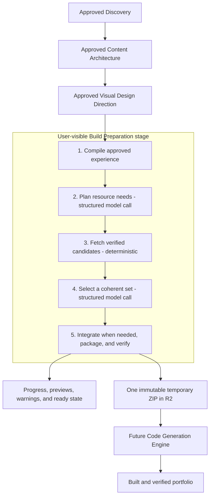
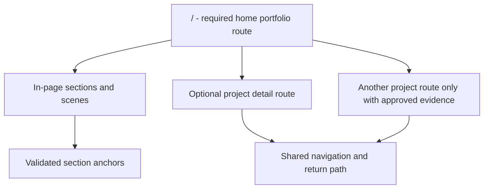
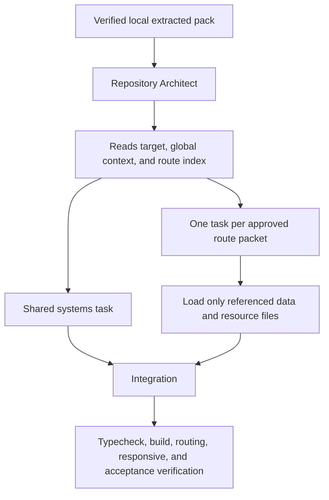
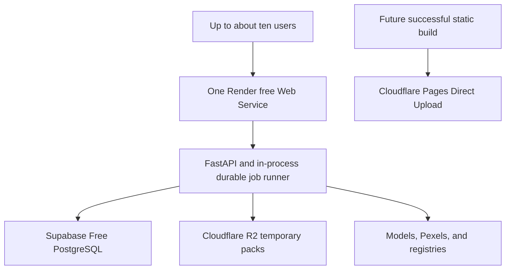

# Portfolio Production Compiler — Final Simplified Proposal

> Status: superseded by
> [`docs/build-preparation-agent-proposal.md`](build-preparation-agent-proposal.md).
> Kept for historical record; do not extend `src/oryxenai/build_preparation/`
> against this document.

> Status: architecture approved and implemented in the Build Preparation stage;
> the real Code Generation Engine remains deferred.

## 1. Decision in one paragraph

Keep one durable, **user-visible Build Preparation stage** after the approved
Visual Design Director and before Code Generation. Internally, a small
**Portfolio Production Compiler** performs five operations: compile approved
intent, plan useful resources, fetch real verified candidates, select a
coherent minimal set, and integrate/package scoped context plus files. The
compiler prepares facts, content data, route/scene context, responsive image
renditions, fonts, icons, component source, and semantic visual specifications.
It does not design the final DOM, layout, Tailwind classes, animation code, or
component composition. Code Generation remains the creative implementer and may
adapt, combine, ignore, or replace every suggested resource.

## 2. Final architecture



There are no internal business agents, supervisor, repair loop, visual-quality
score, vector database, resource microservice, or separately deployed MCP
server.

### 2.1 User-visible product behavior

The product calls the stage **Build Preparation**. `Portfolio Production
Compiler` remains its internal technical name. The future product frontend
shows these coarse progress steps:

1. Understanding the approved build.
2. Finding suitable visual resources.
3. Preparing selected files and responsive variants.
4. Finalizing code-generation context.
5. Ready for generation, or needs attention.

When ready, the frontend shows route and scene coverage, selected image/font/
icon/component counts, safe thumbnails or previews, fallbacks and actionable
warnings, bundle expiry, and retry/regenerate actions. It never exposes raw
prompts, private upstream data, provider credentials, third-party source code,
or internal run payloads.

This is visible status and review, not a new mandatory approval gate. A valid
ready result can flow to Code Generation; the user may regenerate if the result
is stale, expired, failed, or visibly unsuitable.

## 3. What is removed from the previous proposal

The following are removed because they add machinery or could make generated
sites repetitive:

- a dedicated Visual Fabricator subsystem;
- deterministic diagram families that force portfolios into predefined visual
  forms;
- an always-on third Context Critic call and open-ended repair loop;
- numeric visual-quality or route-count scores;
- a large curated component ontology;
- a requirement to materialize an asset/component for every scene;
- mandatory use of selected registry components;
- exact design tokens that Code Generation cannot adjust;
- a separate service or MCP deployment for registry discovery;
- Unsplash and multiple-image-provider failover in V1;
- a separate background worker service for the free hobby deployment.

What remains is either required for truth/security or directly useful to Code
Generation.

## 4. The boundary: what is fixed and what is free

### Code Generation must preserve

- approved public facts and copy;
- privacy, publication, and must-not-fabricate rules;
- approved route paths, links, required content, and visitor actions;
- accessibility, keyboard, touch, reduced-motion, and static fallback behavior;
- local-only prepared assets/fonts and no leaked provider secrets;
- the fixed dependency environment and a working production build.

### Code Generation is free to decide

- DOM and component hierarchy;
- exact layout, grid, spacing, breakpoints, and Tailwind classes;
- whether a selected resource is used directly, adapted, combined, or ignored;
- whether to build a better original component;
- the implementation technique for visual specifications: React, CSS, SVG,
  Canvas, native WebGL, or Motion;
- micro-interactions, transitions, visual pacing, and composition details;
- precise design-token values within the approved visual character;
- mobile simplification and performance trade-offs;
- folder/module details after satisfying the target contract.

The resource manifest explicitly says `must_use: false` for external component
and visual candidates. A resource is an available ingredient, not a template
slot.

## 5. One route shape: hybrid-capable portfolio

Use one **hybrid-capable route model** for V1:



This is one implementation shape, not three competing templates:

- `/` always exists and can be a complete portfolio by itself.
- Detailed project routes exist only when Content Architect approved enough
  public material for a real case study.
- A thin profile naturally compiles to the home route only.
- A richer profile uses the same target and adds case-study routes.
- Sections/scenes are not turned into routes merely to increase page count.

For the current Vanshmani fixture, the correct result remains one route because
the approved Content/VDD artifacts explicitly choose a single page and do not
contain enough cleared project detail for independent case studies.

There is no hard-coded “normal portfolio must have N pages” validation. Empty
routes, duplicate paths, dangling links, and routes built from private/blocked
content are errors; page count and visual scene count are creative planning
judgments.

## 6. The five operations

### 6.1 Compile approved experience — deterministic

Compile a compact, versioned contract from current approved Content and Visual
Design state:

- identity, goal, audience, visitor action, and narrative thesis;
- route graph, navigation, section order, scene order, and links;
- final public content and stable data references;
- visual thesis, hierarchy, background/surface and typography intent;
- scene layout relationships and relative emphasis;
- desktop, tablet, mobile, touch, and reduced-motion intent;
- interactions, motion, accessibility, performance, and fallbacks;
- publication/privacy boundaries and acceptance criteria;
- full source hashes so stale context cannot reach Code Generation.

Only real structural contradictions fail here. Free-form visual judgment remains
free-form context.

### 6.2 Plan resource needs — structured model call 1

One site-wide structured-output call converts the compact experience into
semantic needs. Its response is validated against a small schema and cannot
choose concrete provider IDs.

Examples:

- “accessible compact mobile navigation”;
- “low-motion relationship visualization for the featured project”;
- “editorial landscape photo with generous text-safe negative space”;
- “display/body type pairing with local Latin character coverage”;
- “technology icons supported by approved public content”;
- “conceptual three-stage topology; not a real system architecture.”

The planner decides whether each need should use:

- a remote photo candidate;
- a registry component/effect candidate;
- a local font/icon/resource;
- a semantic visual specification for Code Generation;
- no resource at all.

No component/image quota exists. A typography-led page with custom SVG/CSS can
be the best result.

### 6.3 Fetch verified candidates — deterministic

Fetch only what the plan requests:

- Pexels for approved non-evidentiary photography;
- public shadcn-compatible registries for structural components;
- Magic UI free registry for suitable motion/effects;
- the curated local font catalogue;
- Lucide and an approved local brand-icon subset;
- existing trusted local/cache resources.

The fetcher verifies existence, source files, hashes, dimensions/MIME,
dependencies, paths, provenance, and license metadata. It never executes remote
component source and never installs a package.

Concrete IDs become available only in this operation. If no candidate exists,
the result remains a semantic need—never a fabricated resource.

### 6.4 Select resources — structured model call 2

The structured selection call receives only:

- compact global/route/scene context;
- concrete candidates actually returned by providers;
- candidate dependencies, mobile/motion/accessibility concerns, source summary,
  and provenance;
- numbered Pexels thumbnails when image input is supported;
- other selections being considered for the site.

It chooses the smallest coherent set or rejects all candidates. Selection is
site-wide so isolated “beautiful” components do not conflict with each other.

The model cannot invent an ID because its output is checked against the supplied
candidate set. A rejected need becomes a detailed semantic implementation brief
for Code Generation—not a generic `custom_implementation_required` sentence.

### 6.5 Integrate context when needed, then package and verify

For a normal single-route portfolio, deterministic compilation directly
combines the approved intent and selected resources. A third structured model
call, `integrate_build_context`, is allowed only when multi-route/shared-system
coordination or conflicting cross-route resource choices need a site-wide
judgment. It reconciles coherence and adaptation intent; it cannot add facts,
routes, dependencies, provider IDs, or files. It is never called once per scene
and does not start a critic/repair loop.

Packaging and final verification remain deterministic.

Package only selected files and useful context. Fail only for concrete defects:

- required public content is empty or unresolved;
- route/section/scene/data/resource references are dangling;
- a selected file/path/hash does not exist or is unsafe;
- a selected dependency is absent from the fixed target;
- a secret/private field appears in the pack;
- source artifacts became stale;
- the archive is incomplete or corrupt.

Do not fail because there are few routes, no photos, no selected external
components, or restrained motion. Those can be correct design decisions.

The normal model budget is therefore two calls. The maximum is three for a
genuinely complex build. All calls use provider-neutral configured profiles,
structured response schemas, bounded inputs, and actual candidate identities
only after deterministic provider lookup.

## 7. How prefetched components are delivered to Code Generation

Selected registry source is copied into the pack. Code Generation does not
search, install, or download it.

```text
resources/components/
  magicui/<verified-item-id>/
    component.tsx
    supporting-file.tsx
    styles.css
  shadcn/<verified-item-id>/
    component.tsx
```

Every selected resource has one `ResourceCard` in
`resources/resource-manifest.json`:

```json
{
  "resource_ref": "component.magicui.example.<content-hash>",
  "kind": "motion_component",
  "provider": "magicui",
  "provider_item_id": "verified-provider-id",
  "source_version": "provider-reference-or-hash",
  "content_hash": "sha256...",
  "local_entry_file": "resources/components/registry-magicui-example/component.tsx",
  "local_file_tree": [
    "resources/components/registry-magicui-example/component.tsx",
    "resources/components/registry-magicui-example/styles.css"
  ],
  "suggested_target_path": "src/components/available/example.tsx",
  "exported_symbols": ["ExampleComponent"],
  "import_hint": "After adapting/copying, import from the chosen local target path",
  "dependencies": ["motion", "react"],
  "dependencies_available": true,
  "required_css": ["resources/components/registry-magicui-example/styles.css"],
  "required_css_variables": [],
  "suggested_usage": ["route:home/scene:featured-project"],
  "why_selected": "Supports the approved relationship motion without continuous decoration",
  "adaptation_notes": "Reduce visual density and bind labels to canonical site data",
  "responsive_notes": "Replace the horizontal relationship with a vertical sequence on narrow screens",
  "reduced_motion_notes": "Render the complete static relationship immediately",
  "validation_status": "admitted",
  "validation_errors": [],
  "validation_warnings": [],
  "known_risks": [],
  "must_use": false,
  "fallback": "Implement an original static SVG/CSS relationship",
  "license_provenance": {}
}
```

The real schema uses actual verified values. The example above illustrates the
contract and is not a concrete registry item.

Before admission, each remote component is treated as untrusted source. The
compiler downloads the declared registry files, normalizes safe relative paths,
checks their hashes, parses imports/exports, validates every dependency against
the real target lockfile, and performs static source/import checks. V1 does not
install packages or run a TypeScript compiler during preparation; Code
Generation receives the target lockfile and runs its own build/typecheck in its
disposable workspace. The compiler never executes component code, lifecycle
scripts, package-manager commands, or provider-supplied configuration. A
candidate that fails admission is rejected in favor of the next candidate or a
detailed custom-implementation opportunity.

Code Generation therefore knows:

- what exists;
- why it was selected;
- where its source files are;
- which entry/export to inspect;
- which supporting files/CSS must move with it and a suggested target location;
- which dependencies already exist;
- whether validation found any error, warning, or known risk;
- where it might fit;
- how it must behave on mobile/reduced motion;
- what risks/fallback exist;
- that it may replace the resource.

## 8. How content, images, topology, and context are delivered

### Canonical public data

`data/site-data.json` is the canonical approved public-content source. Route
packets carry stable section pointers/IDs (and a compact scoped copy for
agent-local work) so Code Generation can resolve shared data without seeing the
raw resume or private Discovery history.

### Images

Every image requirement carries its semantic purpose, evidence boundary,
desktop/mobile role, preferred orientation and aspect range, minimum dimensions,
crop tolerance, focal point, text-safe area, color/mood intent, and negative
concepts. The compiler translates those fields into supported Pexels filters,
fetches a small bounded candidate set, and ranks only returned candidates. When
the configured model supports image input, the structured selection call sees a
numbered contact sheet; otherwise deterministic metadata and thumbnails are
used. It may select an actual provider ID or select none—never an invented ID.

After selection, the compiler downloads the source, verifies MIME type,
dimensions, orientation, and hash, then creates configuration-driven responsive
renditions for the fixed frontend target. The manifest records an original or
highest-useful rendition plus the exact `srcset` candidates, widths, heights,
aspect ratios, crop boxes, focal intent, alt text, recommended display role,
provider asset ID, source page, photographer, attribution URL, local paths, and
hashes. The generated site never calls Pexels.

If desktop asks for a landscape composition while mobile needs portrait, the
compiler first tests whether one source can produce both crops without losing
the focal subject or text-safe region. If yes, it stores separate verified
desktop and mobile renditions. If not, it selects another candidate or uses the
approved non-photo fallback. It never stretches an image, silently violates an
asset brief, or uses a weak stock image merely to fill space.

Photography is still conditional. A conceptual process diagram, real project
screenshot, user portrait, or private/employer evidence is not replaced by
stock photography. Those needs remain verified local media when available or a
truthful semantic visual specification/fallback when they are not.

### Fonts and icons

Only selected locally licensed font files, when they actually exist, and icon
references are included. V1 ships a checked-in system-font catalogue and uses
the target system stack when no local WOFF2 has been supplied; it never
pretends that a missing font file exists. The manifest provides
font-family/weight/style/fallback mapping and verified icon names/paths. No
remote CDN is required.

### Creative character

The pack preserves a dedicated `creative-character.json`, compiled from the
approved Visual Design Direction. It carries the creative thesis, visual
personality, signature motif, typography mood, color/surface behavior,
grid/alignment/spacing character, motion language, signature moments,
interaction character, responsive philosophy, anti-patterns, consistency
rules, `must_preserve`, and `may_adapt`. Route packets reference this shared
character and add only route/scene-specific deviations. This prevents a
self-sufficient pack from becoming mechanically complete but creatively empty.

### Conceptual topology and custom visuals

Do not force a deterministic SVG template. Prepare the meaning, not the final
drawing:

```json
{
  "visual_spec_id": "visual:defxv-flow",
  "scene_id": "home-featured-project",
  "purpose": "Explain the approved multimodal relationship",
  "nodes": ["multimodal input", "inference and orchestration", "sign or voice output"],
  "relationships": ["input to orchestration", "orchestration to output"],
  "truth_boundary": "Illustrative; not a real internal architecture",
  "visual_intent": "Calm, precise, lightweight, one restrained accent",
  "desktop_behavior": "Readable horizontal relationship",
  "mobile_behavior": "Short vertical sequence",
  "motion_intent": "Resolve once in reading order",
  "reduced_motion": "Complete static relationship",
  "fallback": "Ordered text explanation",
  "implementation_freedom": ["CSS", "SVG", "Canvas", "Motion", "native WebGL"]
}
```

This gives Code Generation resolved labels, semantics, truth boundaries,
responsive behavior, and motion intent while leaving the visual technique and
composition free.

### Runtime APIs

A normal portfolio is static. The context explicitly states
`runtime_api_requirements: []` unless an approved feature genuinely needs a
backend. Do not invent APIs or mock server data to make the portfolio appear
advanced.

## 9. Final bundle structure

```text
portfolio-production-pack/
  bundle-index.json
  target-contract.json
  global-context.json
  creative-character.json

  data/
    site-data.json

  routes/
    route-home.json
    route-project-<slug>.json        # only when approved

  resources/
    resource-manifest.json
    visual-specifications.json
    files/
      images/
        <asset-ref>/
          original-or-largest-rendition
          responsive-renditions
      fonts/
      icons/
      components/

  provenance/
    checksums.json
    licenses.json
```

No raw upstream history, giant prompt, complete registry, unused candidates, or
provider secrets are included.

`bundle-index.json` lists every required member with its content hash and size.
A pack is accepted only after the uploaded object is downloaded or streamed
back, its ZIP structure is checked, every indexed path/hash is verified, and at
least the target, global context, creative character, canonical public data,
route packet set, and resource manifest are present. Any selected component,
font, icon, or image must have real bytes at its indexed local path. An
unmaterialized suggestion is represented as a semantic opportunity, never as a
fake file path.

## 10. Scoped context for the future Code Generator



### Global context answers

- Who/what is this portfolio for?
- What is its narrative and visual character?
- Which routes and navigation exist?
- What facts and privacy boundaries are immovable?
- What shared data/resources are available?
- What fixed runtime and dependencies exist?
- What may Code Generation freely reinterpret?

### Route packet answers

- What must this route accomplish?
- Which public data IDs belong here?
- What sections/scenes and links exist?
- How should hierarchy and responsive transformation feel?
- Which local resources and visual specifications are available?
- Why were they offered and where are their files?
- What motion/interaction/static/reduced-motion behavior matters?
- What may be changed or replaced?
- What acceptance conditions must the finished route satisfy?

The packet provides intent and ingredients, not JSX instructions.

## 11. Fixed target without creative restriction

Use one real lockfile-backed target:

```text
React + Vite + TypeScript
Tailwind CSS
React Router
Motion
Lucide React
small approved shadcn/Radix utility set
```

The fixed target prevents broken dependency installation; it does not define a
visual template. Code Generation may create original CSS, SVG, Canvas, browser
WebGL, and Motion code using the platform and installed dependencies.

Do not include Three.js, a charting framework, a page builder, or another large
library in V1 without a demonstrated portfolio need. Advanced visual quality
comes from hierarchy, typography, composition, custom graphics, motion
judgment, and implementation quality—not dependency count.

## 12. Provider policy

| Need | V1 source | Result |
| --- | --- | --- |
| Appropriate editorial photography | Pexels | Selected local rendition plus attribution |
| Standard accessible primitives | shadcn-compatible public registry | Local adaptable source |
| Distinctive suitable effect/motion | Magic UI free registry | Local adaptable source |
| Optional additional free components | Aceternity free registry, disabled by default | Same adaptable-source contract |
| Fonts | Curated local catalogue | Local file when supplied, otherwise verified system-stack mapping |
| Interface icons | Fixed Lucide target | Verified import name |
| Supported brand/technology icons | Curated local subset | Local icon/provenance |
| Custom diagram/visual | Semantic visual specification | Codegen chooses technique |
| No good candidate | No resource | Detailed intent/fallback only |

Pexels remains the only photo provider in V1. Unsplash is deferred. Public
shadcn, Magic UI, and compatible free Aceternity registry access requires no
OryxenAI API key. All component sources use the same provider-neutral registry
adapter and configured source policy; Aceternity does not create another
pipeline. MCP may help a developer explore resources manually, but production
uses registry JSON over server-side HTTP and does not deploy MCP infrastructure.

Selected images are decoded, EXIF-normalized, resized/cropped, and encoded in a
bounded preparation workspace with a small server-side image library. V1 uses
Pillow with configured pixel/dimension/quality limits; image processing never
occurs in the browser or generated portfolio.

## 13. ZIP, storage, and retention

Keep one ZIP as an atomic container, not because storage is scarce:

- one upload, object key, hash, expiry, download, and retry;
- no partially uploaded directory;
- fewer object-store operations;
- easy local inspection and Code Generation extraction.

Text/source can be compressed; already-compressed images/fonts should be stored
without recompression.

Retention:

- Production Compiler pack: configurable, approximately three days;
- unpublished Code Generation preview: approximately seven days later;
- current published portfolio: retained until replaced/deleted;
- one previous published version: retained initially for rollback.

Temporary and published artifacts use separate prefixes/policies.

## 14. Small deployment



For the free hobby deployment, run one durable job at a time inside the Render
web process. PostgreSQL owns job state, so interrupted work can be recovered
after a cold start. Keep the existing split worker deployment available for
local Docker and a later paid deployment, but do not add another queue or worker
framework.

Supabase stores only sessions, runs, jobs, and object metadata. R2 stores binary
packs. Cloudflare Pages publishing remains a later phase with separate
credentials and retention.

## 15. Important edge cases

| Situation | Behavior |
| --- | --- |
| No images are appropriate | Use typography, custom CSS/SVG, and visual specifications |
| Pexels returns weak images | Select none; never fill a slot with a poor image |
| Registry unavailable | Use local resources or give Codegen the semantic need |
| Component looks unsuitable during coding | Codegen ignores/replaces it using the manifest fallback |
| Component dependency unsupported | Reject during preparation; do not install it |
| No component exists | Give a detailed implementation brief, never a fake ID |
| Font unavailable | Use an intentional local/system fallback |
| Thin content | Produce a strong home route; do not fabricate extra pages |
| Rich approved project content | Add a proper project route through the hybrid route model |
| Private/pending content | Exclude it from all code-generation data |
| Pack expired | Regenerate from current approved upstream artifacts |
| Upstream or target changed | Mark pack stale; never use it |
| Render restarts | Durable PostgreSQL job is reclaimed/retried |
| R2 hash mismatch | Reject and regenerate |

## 16. Minimal implementation plan

1. Add the real lockfile-backed React target and route contract.
2. Replace current preparation schemas with the compact bundle, creative
   character, route packet,
   resource card, and visual specification contracts.
3. Add two normal structured Build Preparation model operations and the
   adaptive cross-route integration operation.
4. Rework Pexels, responsive image processing, and registry acquisition around
   semantic requirements.
5. Compile canonical public data and scoped route packets.
6. Materialize selected files and exact resource cards.
7. Apply structural/security verification and upload the atomic ZIP to R2.
8. Update the temporary fixture UI, then define the future product-frontend
   contract for visible progress, route/resource coverage, previews, local
   paths, imports, fallbacks, expiry, and bundle contents.
9. Add deterministic fake-provider tests and opt-in live provider tests.
10. Retire the current empty/fallback-only compiler paths after replacement
    verification passes.

No upstream agent change is required initially. If real runs later show that
Content Architect repeatedly produces thin/contradictory route plans or VDD
omits critical scene intent, make the smallest proven handoff correction there
instead of redesigning those agents pre-emptively.

## 17. What the developer must provide

Required from the developer now: keep the existing `R2_ACCESS_KEY_ID`,
`R2_SECRET_ACCESS_KEY`, `PEXELS_API_KEY`, and configured model-provider key in
server-side environment variables; the R2 account endpoint, private bucket,
three-day `temporary/` lifecycle, and non-secret provider policy remain in
configuration. Nothing else is needed to implement and locally test this
stage—public shadcn/Magic UI/optional Aceternity registries, Lucide, and local
fonts/icons do not require API keys, and no MCP server or credential is needed.
Before deploying the application, provide the Supabase PostgreSQL connection
credentials and copy the same server-side secrets into Render. A narrowly
scoped Cloudflare Pages token is needed only when portfolio publishing is later
implemented. Unsplash and Google Fonts keys are intentionally not needed in
V1.

## 18. Final output contract

The stage succeeds when Code Generation can answer, without provider/network
search:

- what am I building and why;
- which routes/scenes/data must exist;
- what responsive, interaction, motion, and accessibility behavior matters;
- which verified files/resources exist and where;
- how each resource can be imported or inspected;
- why it was offered and what its risks/fallback are;
- which parts are mandatory truths and which are creative suggestions;
- what to do when a prepared resource does not fit.

That is the complete boundary. The Production Compiler prepares truth, context,
and ingredients; Code Generation creates the advanced portfolio.

## 19. Official references

- shadcn registry contract: <https://ui.shadcn.com/docs/registry/registry-item-json>
- Magic UI registry workflow: <https://magicui.design/docs/installation>
- Pexels API: <https://www.pexels.com/api/documentation/>
- Cloudflare R2 pricing: <https://developers.cloudflare.com/r2/pricing/>
- Cloudflare R2 lifecycle: <https://developers.cloudflare.com/r2/buckets/object-lifecycles/>
- Render free services: <https://render.com/docs/free>
- Supabase free project behavior: <https://supabase.com/docs/guides/platform/free-project-pausing>
- React Router routing: <https://reactrouter.com/start/data/routing>
- Motion reduced motion: <https://motion.dev/docs/react-use-reduced-motion>
- Cloudflare Pages Direct Upload: <https://developers.cloudflare.com/pages/get-started/direct-upload/>

## 20. Decisions locked for implementation

The architecture fixes these choices; Build Preparation implementation is now
in place and the real Code Generation Engine remains deferred:

1. one user-visible Build Preparation stage backed by a five-operation
   Portfolio Production Compiler, with no extra mandatory approval gate;
2. two normal structured model calls, one adaptive structured cross-route call,
   and no repair/critic loop;
3. hybrid-capable routing with `/` plus evidence-supported project routes;
4. all external resources optional/adaptable for Code Generation;
5. semantic visual specifications instead of mandatory template SVG generation;
6. one lockfile-backed React/Vite/TypeScript/Tailwind/Router/Motion target;
7. verified Pexels images with accurate responsive renditions, and statically
   admitted source from provider-neutral public component registries;
8. one self-sufficient atomic temporary ZIP in R2 containing the full creative
   character, exact context, manifest, provenance, and all selected bytes;
9. Render + Supabase + R2 for the hobby platform and Cloudflare Pages later for
   published static portfolios.
