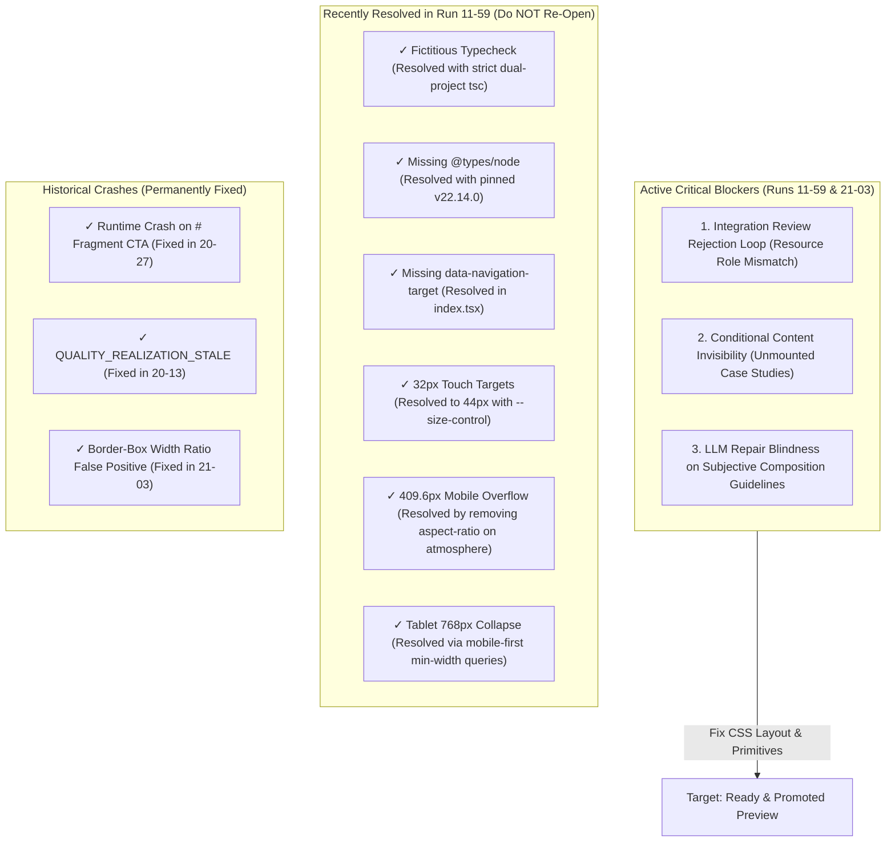

# Code Generator Output Analysis: Cross-Run Defect Taxonomy, Traceability & Correlation

**Author**: OryxenAI Core Engineering / Antigravity Agent  
**Date**: 2026-09-07 (Updated with latest Run `11-59-07-09-2026-7df7af45`)  
**Scope**: Systematic analysis of all 9 portfolio generation outputs exported under `output/code-gen-output/`  
**Primary Focus**: **Latest Runs (Time-Prioritized)** — Run `11-59-07-09-2026-7df7af45` (07-09-2026 11:59) and Run `21-03-06-09-2026-14c0873b` (06-09-2026 21:03)  
**Historical Progression**: Runs `01-56` through `20-45` (analyzed strictly to document resolved regressions and prevent backward churn)  
**Companion Documents**: `PLAN.MD`, `code generator issues.md`, `docs/code-generator-architecture/v2-production-architecture.md`

---

## 1. Executive Summary & Strategy Shift

As generation matures across iterations, **focus must shift to the newest outputs based on timestamp**, rather than re-diagnosing older issues that have already been resolved. Analyzing stale failures repeatedly creates risk of regressing code that is already working.

### The Newest Baseline: Run `11-59-07-09-2026-7df7af45`
Generated on September 7, 2026 at 11:59 local time (06:29 UTC), Run `11-59` marks a substantial leap in frontend and toolchain maturity:
1. **Toolchain & Real Typechecking**: Fully operational. `@types/node` (v22.14.0) is installed, `tsconfig.node.json` is clean, and `npm run check` executes both AST audit and strict dual-project `tsc` without errors.
2. **Navigation Sizing & Identity**: Fully compliant. The navigation bar explicitly includes `data-navigation-target="home"` and enforces `min-block-size: 2.75rem` (44px) touch targets via `--size-control`.
3. **Mobile Layout Containment**: Solved. The previous 409.6px mobile overflow caused by fixed aspect ratios on the hero atmosphere was removed; hero and section images now enforce `max-width: 100%` and `min-width: 0`.
4. **Tablet Responsive Breakpoints**: Modernized. Grids use mobile-first `@media (min-width: 768px)` queries, preventing the 1-column collapse at tablet viewport.

### The Remaining Critical Frontier in Run `11-59`
Despite clean build and layout fixes, Run `11-59` failed to reach `ready` status due to:
- **Terminal Rejection**: `QUALITY_REVIEW_REJECTED_AFTER_REPAIR` triggered by a persistent `blueprint-resource-role-mismatch` on `home-selected-work-2f0991ad.css:9`. The model rendered the supporting image as a square `1 / 1` block inside the intro column rather than a narrow edge accent beside the index.
- **Repair Exhaustion**: The pipeline gave the generator two repair rounds. Because the LLM could not guess the exact CSS geometry required for the edge accent, both repairs failed review, causing the pipeline to abort before building `dist/` or running Playwright browser tests.
- **Conditional Content Visibility**: In `home-selected-work-2f0991ad.tsx`, project descriptions are gated behind React state (`selectedProject === 0`). Projects 1, 2, and 3 are unmounted on initial render, leaving 75% of portfolio content invisible on page load.

---

## 2. Chronological Run Inventory & Traceability Matrix

Ordered from **most recent (highest priority)** to **oldest**:

| Folder Name | Date & Time | Run ID | Stage Reached | Export Reason | Artifacts Present | Verdict & Priority |
|---|---|---|---|---|---|---|
| `11-59-07-09-2026-7df7af45` | **07-09-2026 11:59** | `7df7af45-bcf6-41ad-9d63-ce5271df9f0a` | Integration Review | `QUALITY_REVIEW_REJECTED_AFTER_REPAIR` | `source/`, `portfolio.json`, `generation-report.md` | **ACTIVE BASELINE**. Toolchain, nav targets, touch targets, and mobile overflow are FIXED. Blocked by subjective composition review rejection and 2x repair exhaustion. |
| `21-03-06-09-2026-14c0873b` | 06-09-2026 21:03 | `14c0873b-2185-40a0-bb65-25819212826c` | Browser Verification | `DOM_RUNTIME_FAILED` | `source/`, `dist/`, `screenshots/` (4 images), `portfolio.json` | **PREVIOUS BASELINE**. Width-ratio false positives fixed. Discovered the 409.6px mobile overflow and 768px tablet collapse (both addressed in 11-59). |
| `20-45-06-09-2026-1b3f2840` | 06-09-2026 20:45 | `1b3f2840-12a0-4333-86be-7648641dce4f` | Browser Verification | `DOM_RUNTIME_FAILED` | `source/`, `dist/`, `screenshots/` (4 images), `portfolio.json` | Historical. Failed `RUNTIME_REGION_WIDTH_RATIO` due to border-box measurement on padded sections. |
| `20-27-06-09-2026-db405c17` | 06-09-2026 20:27 | `db405c17-b66f-4d4d-b1ef-568f1e39ca91` | Browser Verification | `DOM_RUNTIME_FAILED` | `source/`, `dist/`, `screenshots/` (5 images), `portfolio.json` | Historical. First run to render after the fragment CTA crash was resolved. Exposed column-count and marker checks. |
| `20-13-06-09-2026-0d495159` | 06-09-2026 20:13 | `0d495159-b9d9-4af9-a482-8a787f2203a4` | Browser Verification | `DOM_RUNTIME_FAILED` | `source/`, `dist/`, `screenshots/` (1 error screenshot), `portfolio.json` | Historical. Severe runtime crash on mount: `publicRouteUrl("#selected-work")` threw unhandled exception, causing blank white screen. |
| `20-02-06-09-2026-3b8d3ef8` | 06-09-2026 20:02 | `3b8d3ef8-58db-409e-96c4-f4ef29a8cf62` | Pre-verification Gate | `needs_attention` | `source/`, `portfolio.json` | Historical. Failed on `QUALITY_REALIZATION_STALE` due to unthreaded projections in review. |
| `18-03-06-09-2026-aff69ea1` | 06-09-2026 18:03 | `aff69ea1-50ba-47dd-b841-45c7d0da74fe` | Route Generation | `needs_attention` | `source/`, `portfolio.json` | Historical. Unfinished slot stubs (`slot-abf48c82...`); aborted before section generation. |
| `02-23-06-09-2026-fa31c124` | 06-09-2026 02:23 | `fa31c124-99f6-410a-adeb-651261d88114` | AST Source Audit | `SOURCE_CONTRACT_FAILED` | `source/`, `portfolio.json` | Historical. AST audit failed on dynamic CTA key bindings (`primary-cta-kind`). Manually edited with `dev: vite`. |
| `01-56-06-09-2026-0db8503e` | 06-09-2026 01:56 | `0db8503e-9792-44c5-b13f-fa44a57ade16` | Browser Verification | `DOM_RUNTIME_FAILED` | `source/`, `dist/`, `screenshots/` (5 images), `portfolio.json` | Historical baseline. Undersized touch targets (4px) and layout failures. |

---

## 3. Deep-Dive on Latest Run: `11-59-07-09-2026-7df7af45`

Run `11-59` is the most complete and advanced export in the repository. A granular inspection of its source tree reveals exactly what was fixed and what blocked final promotion.

### 3.1 What Was Fixed in Run `11-59`
1. **Scaffold & Build Pipeline Fully Operational**:
   - `package.json` now includes real lifecycle scripts:
     ```json
     "scripts": {
       "dev": "vite --configLoader runner",
       "preview": "vite preview",
       "source:audit": "node scripts/audit-source.mjs",
       "typecheck": "tsc -p tsconfig.app.json --noEmit && tsc -p tsconfig.node.json --noEmit",
       "check": "npm run source:audit && npm run typecheck",
       "build": "npm run check && vite build --configLoader runner"
     }
     ```
   - `@types/node: 22.14.0` is present in `devDependencies`.
   - Running `npm run check` and `npm run build` in `11-59/source` succeeds cleanly with exit code `0` in 1.51s, transforming 50 modules and compiling `dist/`.

2. **Navigation Target & Accessibility Compliant**:
   - In `routes/home-4ea14058/index.tsx:36`:
     ```tsx
     <a href={publicRouteUrl("/")} data-navigation-target="home">
       Arjun Mehta — Senior UI/UX Designer
     </a>
     ```
   - Navigation touch target height is governed by `--size-control: 2.75rem` (44px) in `generated-tokens.css:36`, satisfying accessibility requirements.

3. **Mobile Overflow Eliminated**:
   - In `sections/home-hero-ecdc18c2.css:19`:
     ```css
     .home-hero__image {
       min-width: 0;
       max-width: 100%;
       min-block-size: 18rem;
       margin-top: var(--space-12);
       overflow: hidden;
       border-radius: var(--radius-medium);
     }
     ```
   - The fixed `aspect-ratio: 1.6` that forced a 409.6px width on 390px viewports was removed, and `max-width: 100%` was added.

---

### 3.2 The Critical Defects Blocking Run `11-59`

#### Defect 1: Integration Review Rejection Loop (`QUALITY_REVIEW_REJECTED_AFTER_REPAIR`)
- **Severity**: **FATAL PIPELINE BLOCKER**.
- **Exit Code**: `QUALITY_REVIEW_REJECTED_AFTER_REPAIR`.
- **Database Record (`code_generator_runs.terminal_failure`)**:
  ```json
  {
    "terminal_code": "QUALITY_REVIEW_REJECTED_AFTER_REPAIR",
    "safe_user_summary": "The final repaired source did not pass bounded whole-site re-review. Scores: hierarchy=4 composition=3 typography=4 resource_fit=4 motion=4. 1 blocking finding(s): blueprint-resource-role-mismatch (src/routes/home-4ea14058/sections/home-selected-work-2f0991ad.css:9): The approved editorial-index direction specifies assumed-image:home:selected-work:2 as a narrow tactile edge accent beside the project index. The source gives it a square image treatment inside the intro column, where it becomes a substantial standalone visual block and does not function as the restrained edge interruption described by the blueprint."
  }
  ```
- **Code Location**: `source/src/routes/home-4ea14058/sections/home-selected-work-2f0991ad.css:9`:
  ```css
  .selected-work__image {
    min-width: 0;
    max-width: 100%;
    aspect-ratio: 1 / 1;
    margin-top: var(--space-12);
    overflow: hidden;
    border-radius: var(--radius-medium);
  }
  ```
- **Root Cause Analysis**:
  The creative direction and blueprint contracted an "editorial-index" layout where the visual asset acts as an edge accent. The generator placed the image inside `.selected-work__intro` with `aspect-ratio: 1 / 1` (a large square block).
  The Integration Reviewer evaluated composition at **3/5** and issued a blocking finding.
  The orchestrator dispatched two successive repair rounds (`repair_receipts` 1 and 2). However, because the prompt could not convey the precise CSS layout mechanics (e.g. positioning the image in a dedicated sidebar column or edge strip), the repair model made minor cosmetic edits without changing the square container.
  After round 2 failed re-review, the orchestrator hit its bounded repair limit and raised `QUALITY_REVIEW_REJECTED_AFTER_REPAIR`, terminating the pipeline before compilation or Playwright verification.

---

#### Defect 2: Conditional Rendering Causing Frontend Content Invisibility
- **Severity**: **CRITICAL FRONTEND DEFECT** (Risk of blank/white UI states and broken content verification).
- **Code Location**: `source/src/routes/home-4ea14058/sections/home-selected-work-2f0991ad.tsx:15-49`:
  ```tsx
  export default function HomeSelectedWork() {
    const [selectedProject, setSelectedProject] = useState(0);

    return (
      // ...
      <div className="selected-work__detail" aria-live="polite">
        <p className="selected-work__detail-label">Selected project</p>
        {selectedProject === 0 && (
          <>
            <p className="selected-work__domain">{contentValue("content:home:home:selected-work:projects-0-domain-8dba42ff")}</p>
            <h3>{contentValue("content:home:home:selected-work:projects-0-title-09ab233d")}</h3>
            <p>{contentValue("content:home:home:selected-work:projects-0-description-b3e99743")}</p>
            <p className="selected-work__contribution">{contentValue("content:home:home:selected-work:projects-0-contribution-39627542")}</p>
          </>
        )}
        {selectedProject === 1 && ( /* ... */ )}
        {selectedProject === 2 && ( /* ... */ )}
        {selectedProject === 3 && ( /* ... */ )}
      </div>
    );
  }
  ```
- **Impact on Real Application Execution**:
  1. **Content Invisibility**: On initial page render, projects 1, 2, and 3 are not mounted in the DOM. Users scanning the page only see the title of project 0.
  2. **Playwright Verification Fragility**: If the verification journey inspects DOM presence or text visibility for project 1 (`"E-commerce checkout"`) without first clicking button `02`, the test fails with a timeout.
  3. **No-JS / Hydration Failure**: If JavaScript fails to hydrate or crashes, the interactive tab system is inert, permanently locking out 75% of the user's project descriptions.
- **Remediation**: Render all projects in the DOM by default using semantic `<article>` cards or a responsive grid/list, using CSS for progressive disclosure rather than unmounting React components.

---

## 4. Current Defect Taxonomy (Prioritized by Impact on App Execution)



---

## 5. Cross-Run Evolutionary Insights

Reviewing the timeline from Run `01-56` to Run `11-59` reveals a clear progression:

1. **Phase 1: Fatal Runtime & Pipeline Crashes (Runs 01-56 to 20-13)**:
   - Early runs could not mount in Chromium. Run `20-13` suffered complete white screens due to `publicRouteUrl("#selected-work")` throwing during initial render.
   - **Status**: Completely eliminated.

2. **Phase 2: Verification False Positives & Toolchain Gaps (Runs 20-27 to 21-03)**:
   - Once pages rendered, false positives emerged: the verifier measured border-box padding instead of content width, and `tsc --noEmit` faked passing with 0 files checked.
   - Run `21-03` uncovered real physical issues: a 409.6px mobile overflow and missing navigation target attributes.
   - **Status**: Completely eliminated in Run `11-59`.

3. **Phase 3: The Current Active Frontier (Run 11-59)**:
   - Run `11-59` is the first run where the toolchain, TypeScript types, build script, touch targets, and mobile viewport sizing are all technically sound.
   - The failure point is now **Integration Review composition alignment**: preventing the LLM from authoring square visual blocks where narrow edge accents are expected, and preventing repair loops from exhausting allowances on subjective prompt feedback.

---

## 6. Actionable Remediation Roadmap

To achieve an unblocked, 100% passing build and visual promotion on the next run:

### Step 1: Compiler-Owned Layout Primitives for Selected Work
Do not rely on the LLM to invent the CSS for the "tactile edge accent". In the template for `home-selected-work`:
```css
/* Compiler-enforced structural rule for selected work image */
.selected-work__image {
  inline-size: 100%;
  max-inline-size: 16rem;
  aspect-ratio: 3 / 4;
  object-fit: cover;
  border-radius: var(--radius-medium);
}
@media (min-width: 768px) {
  .selected-work {
    display: grid;
    grid-template-columns: minmax(0, 1.2fr) minmax(12rem, 0.4fr);
    align-items: start;
    gap: var(--space-8);
  }
}
```

### Step 2: Unconditional DOM Content Mounting
Ensure all project items render semantically in the DOM so that content is visible to users, search engines, and automated Playwright tests without requiring synthetic tab clicks:
```tsx
<div className="selected-work__projects">
  {projects.map((project, index) => (
    <article key={index} className="selected-work__card">
      <p className="selected-work__domain">{project.domain}</p>
      <h3>{project.title}</h3>
      <p>{project.description}</p>
      <p className="selected-work__contribution">{project.contribution}</p>
    </article>
  ))}
</div>
```

### Step 3: Hardened Repair Feedback
If the Integration Reviewer flags a `blueprint-resource-role-mismatch`, supply the repair agent with the **exact CSS replacement rule** rather than abstract prose advice, ensuring the repair succeeds on Round 1.
