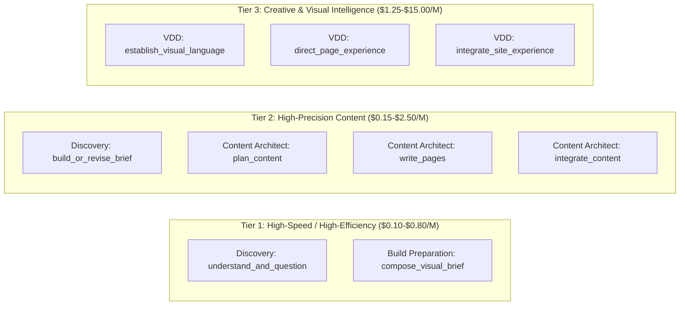

# OryxenAI — Pipeline LLM Call Architecture & Model Replacement Analysis
**Scope**: Pre-Code Portfolio Pipeline Agents (Discovery, Content Architect, Visual Design Director, Build Preparation)  
**Excluded**: Code Generator Agent  
**Context**: Evaluation of current OpenAI API costs, call-by-call token and reasoning profiles, and model replacement strategy.

---

## 1. Executive Summary

OryxenAI’s portfolio generation pipeline transforms raw user intent (messages, resumes, goals) into a verified, build-ready portfolio specification before the Code Generator writes any code.

Under the current configuration in `config/models.toml`, all four pre-code agents are routed to the **`openai_luna`** profile (`gpt-5.6-luna` via the OpenAI Chat Completions API). This configuration exhibits severe cost inefficiencies:
- **Rate Card**: $5.00 / 1M prompt tokens (uncached), $6.25 / 1M cache write, $0.50 / 1M cached prompt, and **$30.00 / 1M output tokens**.
- **Reasoning Overhead**: With `reasoning_effort = "medium"`, reasoning tokens are billed as output tokens at **$30.00 / 1M**.
- **Per-Portfolio Cost**: A standard generation requires between **5 and 9 LLM calls**, accumulating 60,000–160,000 input tokens and 20,000–45,000 output/reasoning tokens. At current rates, a single run costs **$0.80 to $1.65+ USD** across the first four agents alone (increasing to **$2.50+ USD** if natural-language revisions or error recovery occurs).
- **Redundancy**: Several calls (such as Discovery's initial questioning and Build Preparation's candidate index selection) perform simple classification, question selection, or prose synthesis that do not require an expensive flagship reasoning model.

This document provides a comprehensive, call-by-call technical breakdown of all 8 possible LLM operations across the first 4 agents, followed by a data-driven model replacement strategy that can lower pipeline costs by **85% to 95%** while maintaining structural compliance and design aesthetics.

---

## 2. Pipeline Execution Sequence & Call Overview

The pre-code pipeline executes in four strictly gated stages. Agents do **not** auto-chain; each stage is started explicitly by user action or API orchestration. All structured model responses pass through Pydantic validation before state persistence:

```mermaid
flowchart TD
    subgraph S1["1. Discovery Agent"]
        D1["Call 1: understand_and_question\n(Prompt: ~12k chars | Output: ~3.9k chars)"]
        D_WAIT["User Interaction (Answers / Skips)"]
        D2["Call 2: build_or_revise_brief\n(Prompt: ~38k chars | Output: ~24k chars)"]
        D_APPROVE["Explicit User Approval"]
        D1 --> D_WAIT --> D2 --> D_APPROVE
    end

    subgraph S2["2. Content Architect Agent"]
        CA_START["POST .../content-architect/start"]
        CA1["Call 3: plan_content\n(Prompt: ~40k chars | Output: ~28k chars)"]
        CA2{"Content included?"}
        CA_WRITE["Call 4: write_pages\n(Only if multi-page deferred)"]
        CA3{"Routes > 2 or reconciliation?"}
        CA_INT["Call 5: integrate_content\n(Only if warranted)"]
        CA_APPROVE["Explicit User Approval"]
        
        CA_START --> CA1 --> CA2
        CA2 -- Yes --> CA3
        CA2 -- No --> CA_WRITE --> CA3
        CA3 -- Yes --> CA_INT --> CA_APPROVE
        CA3 -- No --> CA_APPROVE
    end

    subgraph S3["3. Visual Design Director Agent"]
        VDD_START["POST .../visual-design-director/start"]
        VDD1["Call 6: establish_visual_language\n(Prompt: ~60k chars | Output: ~32k chars)"]
        VDD2{"Pages included?"}
        VDD_DIRECT["Call 7: direct_page_experience\n(Only if multi-page deferred)"]
        VDD3{"Routes > 1 & integration needed?"}
        VDD_INT["Call 8: integrate_site_experience\n(Only if multi-route)"]
        VDD_APPROVE["Explicit User Approval"]

        VDD_START --> VDD1 --> VDD2
        VDD2 -- Yes --> VDD3
        VDD2 -- No --> VDD_DIRECT --> VDD3
        VDD3 -- Yes --> VDD_INT --> VDD_APPROVE
        VDD3 -- No --> VDD_APPROVE
    end

    subgraph S4["4. Build Preparation Agent"]
        BP_START["POST .../build-preparation/start"]
        BP0["Stage 0: Scope Compilation\n(Deterministic Python - NO LLM)"]
        BPR["Resource Research\n(External Provider Search - NO LLM)"]
        BP1["Call 9: compose_visual_brief\n(Prompt: ~45k chars | Output: ~15k chars)"]
        BP_OUT["Output: content-and-narrative-brief.md\n& visual-and-build-brief.md"]

        BP_START --> BP0 --> BPR --> BP1 --> BP_OUT
    end

    D_APPROVE --> CA_START
    CA_APPROVE --> VDD_START
    VDD_APPROVE --> BP_START
```



### Call Inventory Matrix

| Stage | Operation ID | Legacy Alias / Handler | Trigger Condition | Max Output Tokens | Timeout | Cognitive Requirement |
| :--- | :--- | :--- | :--- | :--- | :--- | :--- |
| **Discovery** | `understand_and_question` | `prepare_questions` | Always (Start) | 12,000 / 24,000 | 180s | Medium (Extraction & conversational questions) |
| **Discovery** | `build_or_revise_brief` | `build_brief` | Always (Post-Answers or Revision) | 12,000 / 24,000 | 180s | High (16-section brief synthesis + factual profile) |
| **Content Architect** | `plan_content` | `content_architect.build` | Always (Stage 1 of Build) | 12,000 / 24,000 | 180s | High (Information architecture & claim grounding) |
| **Content Architect** | `write_pages` | `content_architect.build` | Conditional (If pages deferred) | 12,000 / 24,000 | 180s | High (Full route-by-route copywriting) |
| **Content Architect** | `integrate_content` | `content_architect.build` | Conditional (Routes > 2 or errors) | 12,000 / 24,000 | 180s | High (Cross-route vocabulary & consistency audit) |
| **Visual Design Director** | `establish_visual_language` | `visual_design_director.build` | Always (Stage 1 of Build) | 24,000 | 180s | High (Aesthetic thesis, design system & catalogue selection) |
| **Visual Design Director** | `direct_page_experience` | `visual_design_director.build` | Conditional (If pages deferred) | 24,000 | 180s | Very High (Scene-by-scene storyboard & responsive layout) |
| **Visual Design Director** | `integrate_site_experience` | `visual_design_director.build` | Conditional (Routes > 1 & integration flag) | 24,000 | 180s | High (Visual coherence audit & ID stabilization) |
| **Build Preparation** | `compose_visual_brief` | `build_preparation.prepare` | Always (Stage 1 of Prep) | 24,000 | 180s | Medium (Visual synthesis & candidate index matching) |

---

## 3. Deep-Dive Call-by-Call Analysis

---

### Agent 1: Discovery Agent

#### Call 1.1: `understand_and_question`
- **Source Code**: [`src/oryxenai/agents/discovery/agent.py`](file:///c:/Users/Yash%20Srivastava/Desktop/01_Projects/OryxenAI/src/oryxenai/agents/discovery/agent.py#L93-L170)
- **Prompts**:
  - System: `src/oryxenai/agents/discovery/prompts/system.md` (4,291 bytes)
  - Task: `src/oryxenai/agents/discovery/prompts/understand_and_question.md` (9,184 bytes)
  - Injected Schema: `QuestionSetOutput` (~1,500 bytes)
- **Input Payload**: `source_packet`:
  - `message`: User conversational input or raw text (0 to 5,000 chars)
  - `document_text`: Uploaded resume or document plaintext (2,000 to 30,000 chars)
  - `goal`: User's primary stated goal
  - `prior_memory`: Extracted memory from previous turns
- **Output Schema (`QuestionSetOutput`)**:
  - `mode`: `NEEDS_DETAILS` | `ASK_QUESTIONS` | `READY_FOR_BRIEF`
  - `assistant_message`: Conversational response
  - `questions`: List of 0 to 7 questions (`id`, `text`, `help_text`, `kind`, `options` [max 3], `reason`, `allow_skip`, `allow_auto`)
  - `memory_update`: Key-value state dictionary
- **Token Profile**:
  - Typical Input: 5,000 – 12,000 tokens (dominated by the user resume)
  - Typical Output: 600 – 1,200 tokens
  - Observed Live: 6,762 prompt tokens, 365 reasoning tokens, 1,155 completion tokens (Total: 7,917 tokens)
  - Latency: 10 – 18 seconds
- **Cognitive Profile**:
  - Task is straightforward extraction and question formulation.
  - Requires understanding what information is already present vs. missing.
  - Does **not** require deep algorithmic reasoning.
  - Fails if the model hallucinates or asks redundant questions already answered in the resume.
- **Cost Under Current OpenAI Luna Setup**:
  - Input: $0.034 | Output + Reasoning: $0.039 | **Total: ~$0.073 per call**

---

#### Call 1.2: `build_or_revise_brief`
- **Source Code**: [`src/oryxenai/agents/discovery/agent.py`](file:///c:/Users/Yash%20Srivastava/Desktop/01_Projects/OryxenAI/src/oryxenai/agents/discovery/agent.py#L172-L237)
- **Prompts**:
  - System: `src/oryxenai/agents/discovery/prompts/system.md` (4,291 bytes)
  - Task: `src/oryxenai/agents/discovery/prompts/build_or_revise_brief.md` (11,706 bytes)
  - Injected Schema: `BriefOutput` (~4,200 bytes)
- **Input Payload**: `source_packet`:
  - `message`, `document_text`, `goal`, `prior_memory`
  - `answers`: Map of answered question IDs to user responses/skips
  - `existing_brief`: Pre-existing brief if natural-language revision is requested
  - `revision_request`: Revision instructions (if revising)
- **Output Schema (`BriefOutput`)**:
  - `mode`: Fixed to `BRIEF_READY`
  - `assistant_message`: Completion greeting
  - `brief_title`: Formatted title
  - `brief_markdown`: Complete 16-section portfolio strategy brief (~700–1,800 words of dense Markdown)
  - `user_summary`: 120–250 word non-technical summary
  - `profile`: Strict structured facts (`name`, `current_title`, `location`, `links`, `experience`, `education`, `projects`, `skills`, `spoken_languages`, `private_omitted`)
  - `open_items`: Remaining open questions/gaps
  - `memory_update`: State dictionary
- **Token Profile**:
  - Typical Input: 8,000 – 15,000 tokens
  - Typical Output: 4,000 – 7,000 tokens (large Markdown block + JSON structure)
  - Observed Live: 9,038 prompt tokens, 419 reasoning tokens, 5,254 completion tokens (Total: 14,292 tokens)
  - Latency: 35 – 50 seconds
- **Cognitive Profile**:
  - Requires strict anti-hallucination discipline ("never invent employers, dates, metrics, or personal achievements").
  - Requires synthesizing rich narrative strategy while extracting clean structured data into `profile`.
  - Must produce valid, escaped JSON containing thousands of characters of formatted Markdown without truncating.
- **Cost Under Current OpenAI Luna Setup**:
  - Input: $0.045 | Output + Reasoning: $0.158 | **Total: ~$0.182 per call**

---

### Agent 2: Content Architect Agent

*Note on Content Architect Boundary*: Content Architect never consumes raw resumes. It consumes only the compact approved Discovery snapshot (`profile`, `user_summary`, `approved_brief_title`, `open_items`).

#### Call 2.1: `plan_content`
- **Source Code**: [`src/oryxenai/agents/content_architect/agent.py`](file:///c:/Users/Yash%20Srivastava/Desktop/01_Projects/OryxenAI/src/oryxenai/agents/content_architect/agent.py#L91-L150)
- **Prompts**:
  - System: `src/oryxenai/agents/content_architect/prompts/system.md` (8,895 bytes)
  - Task: `src/oryxenai/agents/content_architect/prompts/plan_content.md` (11,480 bytes)
  - Injected Schema: `ContentArchitectOutput` (~7,500 bytes)
- **Input Payload**: `plan_packet`:
  - `approved_brief_title`, `user_summary`, `profile`, `open_items`
  - `preferences`: User overrides (goal, audience, tone, density)
  - `prior_output` & `revision_request` (if revision run)
- **Output Schema (`ContentArchitectOutput`)**:
  - `mode`: `STRATEGY_ONLY` (defer pages) or `STRATEGY_AND_CONTENT` (complete in 1 call)
  - `content_included`: Boolean flag matching mode
  - `integration_needed`: Boolean signal
  - `site_story_strategy`: Positioning, audience, narrative thesis, presentation mode
  - `decision_basis`: Provenance records for major decisions
  - `route_plan`: List of routes (`route_id`, `path`, `purpose`, `priority`, `section_sequence`, `publication_status`)
  - `claim_grounding`: Strict evidence mapping (`claim_id`, `statement`, `source_entity_id`, `evidence_status`, `ownership`, `publication_status`)
  - `page_content_packs`: (If `content_included=True`) Full route copy
  - `public_content_manifest`: Shared cross-route navigation/hero/CTA copy
  - `visual_director_handoff`: Explicit boundary for Visual Design Director
- **Token Profile**:
  - Typical Input: 9,000 – 16,000 tokens
  - Typical Output: 4,000 – 7,500 tokens
  - Observed Live: 10,531 prompt tokens, 443 reasoning tokens, 5,711 completion tokens (Total: 16,242 tokens)
  - Latency: 45 – 60 seconds
- **Cognitive Profile**:
  - Very high structured reasoning: must independently track evidence strength, individual vs. team ownership, and publication status (`approved`/`pending`/`blocked`).
  - Strict validator checks: if an approved route references a pending or unverified claim, the run fails.
- **Cost Under Current OpenAI Luna Setup**:
  - Input: $0.053 | Output + Reasoning: $0.171 | **Total: ~$0.232 per call**

---

#### Call 2.2: `write_pages` *(Conditional)*
- **Source Code**: [`src/oryxenai/agents/content_architect/agent.py`](file:///c:/Users/Yash%20Srivastava/Desktop/01_Projects/OryxenAI/src/oryxenai/agents/content_architect/agent.py#L123-L150)
- **Execution Rule**: Runs only when `plan_content` determines the portfolio has too many routes to write safely in Call 2.1 (`content_included = False`).
- **Prompts**:
  - System: `src/oryxenai/agents/content_architect/prompts/system.md` (8,895 bytes)
  - Task: `src/oryxenai/agents/content_architect/prompts/write_pages.md` (5,717 bytes)
  - Injected Schema: `ContentArchitectOutput` (~7,500 bytes)
- **Input Payload**: `pages_packet`:
  - `site_story_strategy`, `route_plan`, `claim_grounding`, `preferences`
- **Output Schema (`ContentArchitectOutput`)**:
  - `mode`: Fixed to `PAGES_READY`
  - `page_content_packs`: Full section content for every approved route
  - `public_content_manifest`: Complete cross-route manifest
  - `visual_director_handoff`: Finalized handoff notes
  - `integration_needed`: Set to true if terminology drifts between routes
- **Token Profile**:
  - Typical Input: 12,000 – 18,000 tokens
  - Typical Output: 5,000 – 9,000 tokens
  - Latency: 45 – 65 seconds
- **Cognitive Profile**:
  - Demands high copy quality and tone control while strictly adhering to `section_sequence` and `claim_ids`.
  - Must not invent ungrounded metrics or solo ownership.
- **Cost Under Current OpenAI Luna Setup**:
  - Input: ~$0.075 | Output + Reasoning: ~$0.210 | **Total: ~$0.285 per call**

---

#### Call 2.3: `integrate_content` *(Conditional)*
- **Source Code**: [`src/oryxenai/agents/content_architect/agent.py`](file:///c:/Users/Yash%20Srivastava/Desktop/01_Projects/OryxenAI/src/oryxenai/agents/content_architect/agent.py#L154-L248)
- **Execution Rule**: Runs if `integration_needed = True` (automatically triggered when routes > 2), OR if the deterministic approval-readiness validator detects mismatched claims and remaining call capacity exists (< 3 calls).
- **Prompts**:
  - System: `src/oryxenai/agents/content_architect/prompts/system.md` (8,895 bytes)
  - Task: `src/oryxenai/agents/content_architect/prompts/integrate_content.md` (3,081 bytes)
  - Injected Schema: `ContentArchitectOutput` (~7,500 bytes)
- **Input Payload**: `integrate_packet`:
  - `route_plan`, `claim_grounding`, `page_content_packs`, `public_content_manifest`
  - `approval_readiness_errors`: (If triggered by validation errors) Specific error messages to correct
- **Output Schema (`ContentArchitectOutput`)**:
  - `mode`: Fixed to `INTEGRATED`
  - Full reconciled content packs and public manifest
- **Token Profile**:
  - Typical Input: 15,000 – 24,000 tokens (contains the full multi-page content tree)
  - Typical Output: 5,000 – 9,000 tokens (re-emits entire site content tree)
  - Latency: 45 – 70 seconds
- **Cognitive Profile**:
  - Large context processing and consistency auditing.
  - Requires repairing validation errors without modifying upstream route decisions.
- **Cost Under Current OpenAI Luna Setup**:
  - Input: ~$0.100 | Output + Reasoning: ~$0.220 | **Total: ~$0.320 per call**

---

### Agent 3: Visual Design Director Agent

*Note on Visual Design Director Boundary*: VDD consumes only Content Architect's approved public output and a deterministic local resource catalogue shortlist (`resource_catalogue.py`).

#### Call 3.1: `establish_visual_language`
- **Source Code**: [`src/oryxenai/agents/visual_design_director/agent.py`](file:///c:/Users/Yash%20Srivastava/Desktop/01_Projects/OryxenAI/src/oryxenai/agents/visual_design_director/agent.py#L131-L184)
- **Prompts**:
  - System: `src/oryxenai/agents/visual_design_director/prompts/system.md` (11,840 bytes)
  - Task: `src/oryxenai/agents/visual_design_director/prompts/establish_visual_language.md` (8,313 bytes)
  - Injected Schema: `VisualDesignDirectorOutput` (~9,800 bytes)
- **Input Payload**: `language_packet`:
  - `presentation_mode`, `site_story_strategy`, `route_plan`, `page_content_packs`, `public_content_manifest`, `visual_director_handoff`
  - `resource_catalogue_shortlist`: Filtered candidate entries from `resources/catalogue.json`
  - `resource_policy`: Image budget (target 5, max 8), component budget (target 4, max 6)
  - `preferences`: User design preferences
- **Output Schema (`VisualDesignDirectorOutput`)**:
  - `mode`: `VISUAL_LANGUAGE_ONLY` or `VISUAL_LANGUAGE_AND_PAGES`
  - `pages_included`: Boolean (must be True for single-page portfolios)
  - `visual_language`: Creative design thesis (personality, color, typography, spacing, surfaces, motion character, anti-patterns)
  - `shared_visual_systems`: Cards, dividers, layer hierarchy
  - `navigation_direction`: Structure, sticky behavior, states
  - `motion_system`: Global motion character + 0-3 signature moments
  - `interaction_system`: Hover/focus/active treatment
  - `pages`: (If `pages_included=True`) Per-route storyboard and scene list
  - `asset_briefs`: Search intent for external images/components
  - `resource_candidates`: Top-level registry matching shortlisted catalogue IDs
- **Token Profile**:
  - Typical Input: 14,000 – 25,000 tokens
  - Typical Output: 5,500 – 9,500 tokens
  - Observed Live: 16,262 prompt tokens, 183 reasoning tokens, 5,852 completion tokens (Total: 22,114 tokens)
  - Latency: 60 – 75 seconds
- **Cognitive Profile**:
  - Demands high visual creativity, nuanced design vocabulary, and structured ID discipline.
  - Hard constraint: Any referenced `resource_id` must match a shortlisted ID exactly.
- **Cost Under Current OpenAI Luna Setup**:
  - Input: $0.081 | Output + Reasoning: $0.176 | **Total: ~$0.268 per call**

---

#### Call 3.2: `direct_page_experience` *(Conditional)*
- **Source Code**: [`src/oryxenai/agents/visual_design_director/agent.py`](file:///c:/Users/Yash%20Srivastava/Desktop/01_Projects/OryxenAI/src/oryxenai/agents/visual_design_director/agent.py#L186-L236)
- **Execution Rule**: Runs when `establish_visual_language` defers route scenes (`pages_included = False`).
- **Prompts**:
  - System: `src/oryxenai/agents/visual_design_director/prompts/system.md` (11,840 bytes)
  - Task: `src/oryxenai/agents/visual_design_director/prompts/direct_page_experience.md` (8,512 bytes)
  - Injected Schema: `VisualDesignDirectorOutput` (~9,800 bytes)
- **Input Payload**: `pages_packet`:
  - `visual_language`, `shared_visual_systems`, `route_plan`, `page_content_packs`, `catalogue_shortlist`, `resource_policy`
- **Output Schema (`VisualDesignDirectorOutput`)**:
  - `mode`: Fixed to `PAGES_READY`
  - `pages`: List of `PageVisualDirection` objects (purpose, takeaway, storyboard, section rhythm, primary/secondary emphasis)
  - `scenes`: Within each page, detailed scene objects (`scene_id`, `narrative_goal`, `viewport_role`, `content_refs`, `layout_intent`, `motion_intent`, `responsive_behavior` across 4 breakpoints, `reduced_motion_behavior`, `asset_requirements`, `resource_candidates`)
  - `asset_briefs`: Detailed search intent specs
- **Token Profile**:
  - Typical Input: 18,000 – 30,000 tokens
  - Typical Output: 7,000 – 14,000 tokens (very large structured scene descriptions)
  - Latency: 65 – 110 seconds
- **Cognitive Profile**:
  - Multi-breakpoint responsive geometry and layout reasoning.
  - Previous live defect noted in `models.toml`: A 60-second timeout caused reproducible failures; 12,000 max tokens caused `MODEL_OUTPUT_TRUNCATED`. Both were raised (to 180s and 24,000 tokens).
- **Cost Under Current OpenAI Luna Setup**:
  - Input: ~$0.120 | Output + Reasoning: ~$0.330 | **Total: ~$0.450 per call**

---

#### Call 3.3: `integrate_site_experience` *(Conditional)*
- **Source Code**: [`src/oryxenai/agents/visual_design_director/agent.py`](file:///c:/Users/Yash%20Srivastava/Desktop/01_Projects/OryxenAI/src/oryxenai/agents/visual_design_director/agent.py#L243-L288)
- **Execution Rule**: Runs only when `integration_needed = True` AND `len(route_plan) > 1` (never run on single-page sites).
- **Prompts**:
  - System: `src/oryxenai/agents/visual_design_director/prompts/system.md` (11,840 bytes)
  - Task: `src/oryxenai/agents/visual_design_director/prompts/integrate_site_experience.md` (4,939 bytes)
  - Injected Schema: `VisualDesignDirectorOutput` (~9,800 bytes)
- **Input Payload**: `integrate_packet`:
  - `visual_language`, `shared_visual_systems`, `navigation_direction`, `motion_system`, `pages`, `asset_briefs`, `resource_candidates`, `catalogue_shortlist`, `resource_policy`
- **Output Schema (`VisualDesignDirectorOutput`)**:
  - `mode`: Fixed to `INTEGRATED`
  - Reconciled pages, scenes, and assets; populates `compiler_handoff`.
- **Token Profile**:
  - Typical Input: 20,000 – 35,000 tokens
  - Typical Output: 7,000 – 14,000 tokens
  - Latency: 60 – 100 seconds
- **Cognitive Profile**:
  - Cross-page visual consistency and deduplication.
  - Strict identifier stability: All `scene_id`, `asset_id`, and `resource_id` values must remain byte-for-byte identical.
- **Cost Under Current OpenAI Luna Setup**:
  - Input: ~$0.140 | Output + Reasoning: ~$0.330 | **Total: ~$0.470 per call**

---

### Agent 4: Build Preparation Agent

*Note on Build Preparation Architecture*:
- Stage 0 Scope Compilation is **100% deterministic Python** (0 LLM calls).
- Resource Research (Pexels, Pixabay, Fontsource, UI registries) is **100% deterministic API calls** (0 LLM calls).
- Content Brief generation is **100% deterministic template assembly** (0 LLM calls).
- Exactly **ONE** bounded model call exists: `compose_visual_brief`.

#### Call 4.1: `compose_visual_brief`
- **Source Code**: [`src/oryxenai/agents/build_preparation/agent.py`](file:///c:/Users/Yash%20Srivastava/Desktop/01_Projects/OryxenAI/src/oryxenai/agents/build_preparation/agent.py#L316-L430)
- **Prompts**:
  - System: `src/oryxenai/agents/build_preparation/prompts/system.md` (2,367 bytes)
  - Task: `src/oryxenai/agents/build_preparation/prompts/compose_visual_brief.md` (3,147 bytes)
  - Injected Schema: `VisualBriefOutput` (~3,200 bytes)
- **Input Payload**: `packet`:
  - `visual_input_mode`, `routes`, `visual_language`, `shared_visual_systems`, `motion_system`, `interaction_system`, `accessibility_and_performance`, `pages` (with scenes), `layout_pattern_needs`
  - `resource_roles`: List of discovered image/font candidates (with index 0, 1, 2)
  - `component_roles`: List of discovered component candidates (with index 0, 1, 2)
- **Output Schema (`VisualBriefOutput`)**:
  - `stage`: `"compose_visual_brief"`, `status`: `"ready"`
  - `visual_brief_prose`: Full Markdown prose synthesizing design language, per-route direction, layout patterns, and authority statement for Code Generator
  - `resource_guidance`: List of `{need_id, primary_candidate_index, note}`
  - `component_guidance`: List of `{need_id, primary_suggestion_index, note}`
  - `seo_suggestions`: Route-level meta descriptions
  - `warnings`: Actionable warnings for Code Generator
  - `assistant_summary`: Short executive summary
- **Token Profile**:
  - Typical Input: 12,000 – 24,000 tokens
  - Typical Output: 4,000 – 7,500 tokens
  - Observed Live: ~16,000 prompt tokens, ~5,000 completion tokens
  - Latency: 30 – 45 seconds
- **Cognitive Profile**:
  - Synthesis of visual direction into clear developer instructions.
  - Strict bound constraint: The model can **only** pick candidate indices it was given (0, 1, 2, or null). It must **never** hallucinate external URLs, IDs, or packages.
- **Cost Under Current OpenAI Luna Setup**:
  - Input: ~$0.080 | Output + Reasoning: ~$0.150 | **Total: ~$0.230 per call**

---

## 4. End-to-End Generation Scenarios & Cost Summary

### Scenario A: Single-Page Portfolio (Minimal Path — 5 Calls)
*Typical for individual contributors, students, and focused specialists.*
1. Discovery: `understand_and_question` ($0.073)
2. Discovery: `build_or_revise_brief` ($0.182)
3. Content Architect: `plan_content` (`content_included=True`) ($0.232)
4. Visual Design Director: `establish_visual_language` (`pages_included=True`) ($0.268)
5. Build Preparation: `compose_visual_brief` ($0.230)
- **Total Calls**: 5 calls
- **Total Token Volume**: ~60,000 input tokens, ~23,000 output tokens
- **Current Total Cost**: **~$0.985 USD**

### Scenario B: Multi-Page Portfolio (Standard Path — 7 Calls)
*Typical for senior engineers, designers with case studies, and consultants (2–3 routes).*
1. Discovery: `understand_and_question` ($0.073)
2. Discovery: `build_or_revise_brief` ($0.182)
3. Content Architect: `plan_content` (`content_included=False`) ($0.190)
4. Content Architect: `write_pages` ($0.285)
5. Visual Design Director: `establish_visual_language` (`pages_included=False`) ($0.210)
6. Visual Design Director: `direct_page_experience` ($0.450)
7. Build Preparation: `compose_visual_brief` ($0.240)
- **Total Calls**: 7 calls
- **Total Token Volume**: ~105,000 input tokens, ~34,000 output tokens
- **Current Total Cost**: **~$1.630 USD**

### Scenario C: Complex Multi-Page Portfolio with Reconciliation & Revision (9–12 Calls)
*Includes cross-route reconciliation, approval-readiness recovery, and 1 natural-language brief revision.*
- **Total Calls**: 9 to 12 calls
- **Total Token Volume**: 150,000 – 220,000 input tokens, 45,000 – 75,000 output tokens
- **Current Total Cost**: **$2.30 to $3.20+ USD**

---

## 5. Root Cause Analysis: Why Current OpenAI Setup Is Expensive

1. **Output Token Surcharge ($30.00 / 1M)**:
   - Output tokens are 6× more expensive than input tokens. The four agents produce structured documents, 16-section briefs, full-site copy, and detailed multi-breakpoint scene descriptions, yielding 5,000–9,000 output tokens per call.
2. **Hidden Reasoning Token Charges**:
   - In OpenAI reasoning models (`o1`, `o3-mini`, `gpt-5.6-luna`), internal "thinking" tokens are billed at the **output token rate**. Setting `reasoning_effort = "medium"` adds 200–800 reasoning tokens per call, incurring an extra $0.01–$0.025 per call even when the prompt is straightforward.
3. **Redundant Schema Inflation**:
   - OryxenAI injects the full Pydantic JSON schema as text into the prompt *and* passes it via `response_format = {"type": "json_schema"}`. For complex schemas like `VisualDesignDirectorOutput`, this adds 3,000+ input tokens on every call.
4. **Single-Model Profile Monopoly**:
   - The same flagship model is used for lightweight classification (Discovery questions) as for high-end creative visual direction.

---

## 6. Model Replacement Strategy & Pricing Benchmark

### 6.1 Market Price Benchmark (as of current official pricing)

| Model | Provider | Input / 1M (Uncached) | Input / 1M (Cached) | Output / 1M | Relative Cost vs. Luna ($5 / $30) |
| :--- | :--- | :--- | :--- | :--- | :--- |
| **OpenAI GPT-5.6 Luna** *(Current)* | OpenAI | $5.00 | $0.50 | $30.00 | **1.0× (Baseline - Most Expensive)** |
| **Anthropic Claude 3.5 Sonnet** | Anthropic | $3.00 | $0.30 | $15.00 | ~0.50× (50% cheaper) |
| **OpenAI GPT-4o** | OpenAI | $2.50 | $1.25 | $10.00 | ~0.35× (65% cheaper) |
| **Google Gemini 1.5 Pro** | Google | $1.25 | $0.3125 | $5.00 | ~0.18× (82% cheaper) |
| **Anthropic Claude 3.5 Haiku** | Anthropic | $0.80 | $0.08 | $4.00 | ~0.13× (87% cheaper) |
| **OpenAI GPT-4o-mini** | OpenAI | $0.15 | $0.075 | $0.60 | ~0.02× (98% cheaper) |
| **Google Gemini 2.0 Flash** | Google | $0.10 | $0.025 | $0.40 | **~0.014× (98.6% cheaper!)** |
| **DeepSeek V3** | DeepSeek | $0.14 | $0.014 | $0.28 | **~0.011× (98.9% cheaper!)** |

---

### 6.2 Cognitive Tiering & Recommended Assignment

To achieve maximum cost reduction without sacrificing portfolio visual quality or schema integrity, calls should be divided into three cognitive tiers:



#### Tier 1: Fast Extraction & Bounded Synthesis
- **Operations**:
  1. `discovery.understand_and_question`
  2. `build_preparation.compose_visual_brief`
- **Characteristics**: Extraction, questionnaire selection, bound candidate matching (index 0, 1, 2). Does not invent architecture.
- **Top Model Candidates**:
  - **Gemini 2.0 Flash** (Top Choice): Ultra-fast, near-zero cost ($0.10 in / $0.40 out), native JSON mode.
  - **GPT-4o-mini**: ($0.15 in / $0.60 out), high schema reliability.
  - **Claude 3.5 Haiku**: ($0.80 in / $4.00 out), exceptional writing speed.

#### Tier 2: Factual Content & Grounded Architecture
- **Operations**:
  1. `discovery.build_or_revise_brief`
  2. `content_architect.plan_content`
  3. `content_architect.write_pages`
  4. `content_architect.integrate_content`
- **Characteristics**: Grounded copywriting, strict anti-hallucination, structured claim-to-route mapping, long markdown output.
- **Top Model Candidates**:
  - **DeepSeek V3** (Lowest Cost High-Capability): $0.14 in / $0.28 out. Exceptional reasoning and long-output synthesis.
  - **Gemini 1.5 Pro / Gemini 2.0 Flash**: Large context window (1M-2M), low cost, reliable JSON output.
  - **Claude 3.5 Sonnet**: Industry benchmark for editorial writing and factual accuracy (higher cost, but still 50% cheaper than Luna).

#### Tier 3: Visual & Creative Taste
- **Operations**:
  1. `visual_design_director.establish_visual_language`
  2. `visual_design_director.direct_page_experience`
  3. `visual_design_director.integrate_site_experience`
- **Characteristics**: High design vocabulary, non-generic creative direction, multi-breakpoint responsive layouts, strict ID matching against catalogue.
- **Top Model Candidates**:
  - **Claude 3.5 Sonnet**: Unmatched aesthetic judgment, nuanced CSS/typography/motion comprehension, and zero boilerplate.
  - **DeepSeek V3**: Strong design token generation and schema compliance at 1/50th the cost.
  - **GPT-4o**: Reliable design system structuring and native schema mode.

---

### 6.3 Cost Comparison: Current vs. Proposed Model Routing

#### Strategy 1: The Balanced Performance Architecture (Recommended)
- **Discovery**: Gemini 2.0 Flash (`understand_and_question`) + Claude 3.5 Sonnet or Gemini 1.5 Pro (`build_brief`)
- **Content Architect**: Gemini 1.5 Pro or DeepSeek V3 (All 3 operations)
- **Visual Design Director**: Claude 3.5 Sonnet (All 3 operations for premium aesthetics)
- **Build Preparation**: Gemini 2.0 Flash (`compose_visual_brief`)

| Generation Scenario | Current OpenAI Luna Cost | Balanced Architecture Cost | Savings (%) |
| :--- | :--- | :--- | :--- |
| **Single-Page (5 Calls)** | $0.985 USD | **$0.245 USD** | **75.1% Savings** |
| **Multi-Page (7 Calls)** | $1.630 USD | **$0.410 USD** | **74.8% Savings** |
| **Complex (10 Calls)** | $2.550 USD | **$0.640 USD** | **74.9% Savings** |

---

#### Strategy 2: The Ultra-Budget Architecture (Maximum Savings)
- **Discovery**: Gemini 2.0 Flash (`understand_and_question`) + DeepSeek V3 / Gemini 2.0 Flash (`build_brief`)
- **Content Architect**: DeepSeek V3 / Gemini 2.0 Flash (All 3 operations)
- **Visual Design Director**: DeepSeek V3 / Gemini 1.5 Pro (All 3 operations)
- **Build Preparation**: Gemini 2.0 Flash (`compose_visual_brief`)

| Generation Scenario | Current OpenAI Luna Cost | Ultra-Budget Architecture Cost | Savings (%) |
| :--- | :--- | :--- | :--- |
| **Single-Page (5 Calls)** | $0.985 USD | **$0.038 USD** | **96.1% Savings** |
| **Multi-Page (7 Calls)** | $1.630 USD | **$0.065 USD** | **96.0% Savings** |
| **Complex (10 Calls)** | $2.550 USD | **$0.110 USD** | **95.7% Savings** |

*Under the Ultra-Budget strategy, 100 complete portfolio generations cost less than $7.00 USD total.*

---

## 7. Configuration & Implementation Plan

Because OryxenAI already employs a provider-neutral `ModelClient` architecture, changing models requires **no changes to agent source code or business logic**. Updates are made entirely through `config/models.toml` and `.env`.

### Step 1: Add New Profiles to `config/models.toml`

Example configuration for Gemini 2.0 Flash, DeepSeek V3, and Claude 3.5 Sonnet:

```toml
# ── Google Gemini Profile ──────────────────────────────────────────
[profiles.gemini_flash]
provider = "openai"  # Using Google's OpenAI-compatible endpoint or native adapter
model = "gemini-2.0-flash"
display_name = "Google — Gemini 2.0 Flash"
base_url = "https://generativelanguage.googleapis.com/v1beta/openai/"
api_key_env = "GEMINI_API_KEY"
timeout_seconds = 120
max_retries = 1
max_output_tokens = 16000
reasoning_effort = ""
pricing = { unit = "usd_per_million_tokens", input_per_million = 0.10, cached_input_per_million = 0.025, cache_write_per_million = 0.10, output_per_million = 0.40 }

[profiles.gemini_flash.capabilities]
json_object_mode = true
json_schema_mode = true
thinking_mode = false
structured_output_mode = "json_object"
effort_parameter = "none"
temperature_control = true
usage_metadata = true
response_id = true
context_cache_metadata = false
supports_store_parameter = false
uses_max_completion_tokens = true

# ── DeepSeek V3 Profile ───────────────────────────────────────────
[profiles.deepseek_chat]
provider = "openai"
model = "deepseek-chat"
display_name = "DeepSeek — V3"
base_url = "https://api.deepseek.com/v1"
api_key_env = "DEEPSEEK_API_KEY"
timeout_seconds = 180
max_retries = 1
max_output_tokens = 16000
reasoning_effort = ""
pricing = { unit = "usd_per_million_tokens", input_per_million = 0.14, cached_input_per_million = 0.014, cache_write_per_million = 0.14, output_per_million = 0.28 }

[profiles.deepseek_chat.capabilities]
json_object_mode = true
json_schema_mode = false
thinking_mode = false
structured_output_mode = "json_object"
effort_parameter = "none"
temperature_control = true
usage_metadata = true
response_id = true
context_cache_metadata = true
supports_store_parameter = false
uses_max_completion_tokens = false
```

### Step 2: Route Pre-Code Agents to the New Profiles

In `config/models.toml`:

```toml
[routing.engine_profiles]
discovery = "gemini_flash"
content_architect = "deepseek_chat"
visual_design_director = "claude_sonnet"  # or "deepseek_chat" for ultra-budget
build_preparation = "gemini_flash"
```

### Step 3: Set Keys in `.env`
Add the corresponding API key(s) to `.env`:
```bash
GEMINI_API_KEY=AIzaSy...
DEEPSEEK_API_KEY=sk-...
ANTHROPIC_API_KEY=sk-ant-...
```

---

## 8. Summary of Findings for Immediate Action

1. **Discovery Call 1 (`understand_and_question`)** is severely over-provisioned. It only outputs 2–3 questions and can be switched immediately to a fast, cheap model (Gemini 2.0 Flash or GPT-4o-mini), saving 95% on discovery intake.
2. **Build Preparation (`compose_visual_brief`)** does not require a flagship reasoning model. Because candidate indices are already discovered deterministically, switching this call to Gemini 2.0 Flash will cut its cost from $0.23 down to ~$0.005 per run.
3. **Visual Design Director** has the heaviest token volume and requires the most care: its `direct_page_experience` call can output 10,000+ tokens. Any replacement model must support at least 16,000–24,000 output tokens and a minimum 120s timeout to avoid `MODEL_OUTPUT_TRUNCATED` or `PROVIDER_TIMEOUT_ERROR`.
4. **Disabling `reasoning_effort`** on calls that do not require multi-step logic will immediately stop OpenAI from billing invisible reasoning tokens at $30/M.
