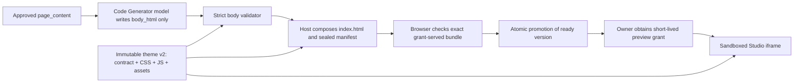

# Studio interactive themes: architecture research and implementation plan

**Research snapshot:** 2026-10-03

**Status:** Proposal for review. No application code, theme asset, schema, deployment, or runtime policy was changed by this research.
**Scope:** Owner-only, generated one-page Studio preview. Public publishing remains outside the product boundary.

## Recommendation

Ship a **new immutable theme version** containing a pre-built `styles.css` and a small, audited `theme.js`. Continue to let the Code Generator produce **only the visible body markup** in `index.html`; the host builds the technical document head and inserts the one fixed script reference. The agent must never write JavaScript, CSS, event handlers, or arbitrary motion settings. The paired assets and the markup contract travel together as one versioned theme package.

This is a sound extension of the existing architecture, with an important qualification: JavaScript does not create design quality by itself. The current theme already includes entrance animations, an ambient hero, a moving marquee, scroll-driven CSS effects, responsive layouts, and reduced-motion CSS. A script should fill interaction gaps (for example, navigation state, a usable motion pause control, and fallbacks where CSS scroll timelines are unavailable). New visual layouts require designed CSS variants and a contract that permits their markup. If the desired portfolios need project cards, experience timelines, or different narrative structures, the `page_content` contract and Content Architect stage also need a separate versioned change.

For the first interactive release, keep the current three-stage flow, PostgreSQL queue, one model call for a build, immutable versions, signed preview grant, and owner-only preview. **Do not edit `editorial-forest/v1`**. Add `editorial-forest/v2` and retain v1 so stored pages remain renderable. This is consistent with [D-122](../../DECISIONS.md) and works with either hosting path in [D-126 and D-127](../../DECISIONS.md); any change to the preview trust boundary or hosting topology should be recorded as a later decision.

### What “pre-built” means here

The user's “preloaded JavaScript” is interpreted as **pre-authored and packaged with the theme**, like `styles.css`. It does not require an HTML `<link rel="preload">` hint. Start with a single small classic script using `defer`; profile before adding preload hints, bundlers, libraries, or multiple chunks. The script is downloaded at preview time but is not generated per person or stored per portfolio version.

## Ground truth in this repository

| Current fact | Evidence | Design consequence |
| --- | --- | --- |
| The model returns `lang` and `body_html`; the host renders the head, with `./styles.css`. | `src/oryxenai/agents/code_generator/{agent.py,bundle.py,prompt_builder.py}`; `src/oryxenai/themes/editorial_forest/v1/contract.py` | Add a host-owned script tag to a v2 head renderer. Keep the model envelope unchanged. |
| The theme manifest hashes CSS, fonts, and art, but advertises `javascript: false`. The package loader verifies listed file bytes. | `src/oryxenai/themes/{__init__.py,editorial_forest/v1/manifest.json}` | Add the script to a *new* theme manifest and activate capability only for that theme. The media type table already includes `.js`. |
| The validator forbids `<script>`, inline `style`, `on*` handlers, unapproved tags/attributes, and unapproved URLs. The v1 contract binds approved copy to exact locations. | `src/oryxenai/agents/code_generator/validate.py`; `src/oryxenai/themes/editorial_forest/v1/contract.py` | Do not weaken the general prohibition. Allow only narrowly defined, inert v2 hooks through the v2 contract. |
| Preview is `/preview/g/{grant}/{path}` on the app origin. Both response CSP and Studio iframe sandbox omit `allow-scripts` and `allow-same-origin`. | `src/oryxenai/agents/code_generator/{serving.py,grants.py}`; `frontend/src/components/studio/PreviewPane.tsx` | A scripted theme needs **both** policies updated based on a trusted theme capability. Never add `allow-same-origin`. |
| A ready version stores `index.html`, its SHA-256, theme id, CSS hash, manifest, receipt, and content snapshot in PostgreSQL. Serve and restore currently compare only the CSS hash. | `src/oryxenai/db/models/site_version.py`; `src/oryxenai/agents/code_generator/{serving.py,service.py}` | Compare all installed theme file hashes to the version manifest before serve/restore; preserve the meaning of the legacy CSS hash field. |
| Browser verification exercises the production preview router in process, blocks network hosts, and checks page load, assets, console/CSP errors, fonts, images, and overflow. | `src/oryxenai/agents/code_generator/verify_browser.py` | Reuse this seam, then assert script initialization and interaction, including reduced motion. A load event alone cannot prove an effect works. |
| Native config defaults to browser `best_effort`; production and Docker overlays set browser `off`; Chromium is optional in the image. | `config/app*.toml`; `Dockerfile` | A scripted theme must have a stated verification policy per environment; budget CPU/RAM if verification is required in the worker. |
| Content Architect produces a fixed `page_content` tree: hero, four pillars, capability groups, context, and connect. The Studio chat edits only approved content paths and refuses style/script requests. | `src/oryxenai/agents/content_architect/schemas.py`; `src/oryxenai/agents/code_generator/changes.py`; `prompts/system_interpreter.md` | Basic interactivity can arrive without changing stages 1–2. User-customizable presentation or new content sections cannot. |
| The Studio holds the previous iframe while the next version loads, then swaps frames; previews also open in a standalone tab. | `frontend/src/components/studio/PreviewPane.tsx`; `frontend/src/styles/shell.css` | Test both embed and standalone. Avoid continuous work in a hidden/pending iframe and refresh expired grants. |

The repository also contains an older `src/oryxenai/preview/` gateway and legacy preview tests. That is not the active Stage 3 grant route. This proposal targets the Code Generator's `serving.py` path and must not accidentally revive the older public-preview design.

## Desired boundary and flow



1. **Theme selection:** Configuration chooses a known theme id for a new build. The job snapshots that id at enqueue time. Existing versions keep their original theme id; a code deploy cannot silently convert them.
2. **Content handoff:** `page_content` remains the sole person-specific input. Derived values stay host-calculated. A motion or layout variant, if introduced later, is a bounded theme option with a documented source and default, not a free-text instruction hidden in biography.
3. **Generation:** The model sees a v2 exemplar and markup contract, never the CSS or JavaScript source. It still returns `{lang, body_html}`. The v2 contract exposes only legal HTML structure and fixed effect hooks.
4. **Validation:** The host checks content placement, tag/attribute vocabulary, exact hook placement, allowed variant enum, links, id integrity, and any animation-control chrome. A model-written script or arbitrary `data-*` attribute fails validation.
5. **Composition:** The host appends `<script src="./theme.js" defer></script>` to the technical head for a scripted theme. Relative paths resolve under the same signed grant prefix as the CSS and assets. No CDN or runtime build step is needed.
6. **Seal and verify:** `index.html` and every theme file's digest enter `SiteBundle/v2`. Verify exactly the bytes and response headers the owner preview will receive. Promote only after the configured gate succeeds; failure leaves the previous live page intact.
7. **Preview:** Mint a short-lived grant for one ready version. The existing FastAPI route serves HTML, CSS, JS, fonts, and art only while the session is active, the selected version is ready and unrestricted, and the installed theme matches the stored manifest. A historical ready version can be previewed without being the currently active version.

This adds one small theme resource request per preview load. It does not add a model call, a queue, a storage service, Node at runtime, or a separate JavaScript server.

## Theme package contract

Proposed files under `src/oryxenai/themes/editorial_forest/v2/`:

```text
manifest.json         immutable id, capabilities, hashes, bytes, MIME types
styles.css            full visual design and no-script baseline
theme.js              reviewed, pre-built runtime for allowed behaviors
contract.py           derived values, host head, DOM and hook validation
contract_rules.md     compact model-facing markup rules
exemplar.html         valid body example, not executable source
assets/...            pinned local visual/font files
```

Suggested manifest concepts (illustrative, not a committed schema):

```json
{
  "theme_id": "editorial-forest/v2",
  "contract_version": "ThemeContract/v2",
  "stylesheet": "styles.css",
  "script": "theme.js",
  "capabilities": {"javascript": true, "generated_css": false},
  "files": [{"path": "theme.js", "sha256": "...", "bytes": 0,
             "media_type": "text/javascript; charset=utf-8"}]
}
```

The sample file row above is deliberately incomplete; the real manifest lists and hashes **every** CSS, JS, font, and art byte. The package loader should reject missing files, duplicate paths, undeclared files used by the contract, bad MIME types, or a manifest/capability mismatch. Released package files, prompts, and executable contract must be treated as one versioned unit. Because a saved page depends on the contract as well as assets, a theme package digest should include a stable digest of the manifest plus contract/prompt revision, not just CSS. Keep a compatible read path for `SiteBundle/v1`; never reinterpret existing `theme_sha256` as a package digest.

`SiteBundle/v2` can live in the current JSONB `manifest` and `receipt`, so an initial implementation need not add a database column. `DbBundleProvider` would load the stored manifest, and `serving.py` and restore would compare its complete, sorted file path/hash/byte/type set with the installed package. Reject a mismatch with an explicit “theme version unavailable” diagnostic. Verify `index_sha256` before serving as an additional storage-integrity check. A schema migration becomes necessary only if the team chooses a separately indexed package-digest column or theme-selection state.

### HTML and hooks

Keep the script out of `body_html`. It should query the document by **theme-owned, validated selectors**; the model should only place approved hooks exactly where the contract says. Prefer existing semantic ids/classes where possible. If a hook attribute is needed, declare a finite vocabulary such as `data-effect="reveal"` on specific elements; never allow arbitrary data values, JavaScript expressions, CSS values, selector strings, URLs, JSON blobs, or user-authored behavior. Validation should reject a hook on a wrong tag or region even if the class name exists in CSS.

Preserve semantic HTML. The current `<details>/<summary>` capability groups already work without JavaScript. Native anchors should keep working when the script fails. Add a real `<button type="button">` for any motion pause control, with a host/theme-owned label and a validated `aria-pressed` state; this requires a v2 contract extension for that **one** button pattern. Make the marquee **static by default** and start it only after the script attaches the button's keyboard/click handler and marks motion ready. If JS fails, no auto-moving content needs a broken pause button. When JS works, the button must be keyboard operable. Do not use a clickable `<div>`, fake links, generated `onclick`, or a script that rewrites approved person-specific text.

The model prompt should say: the theme owns motion and interactive behavior; output only visible markup from approved copy and contract chrome; include exactly the declared hooks/control; do not output scripts/styles, event handlers, hidden instructions, or remote resources. The validator, not the prompt, is the enforcement boundary. Update the `generate_page` prompt version and prompt manifest when the contract changes. Keep `interpret_change` rejecting arbitrary code and style requests in the first release.

## Motion and design system

**First release:** retain the v1 content topology and develop a v2 visual system with a controlled set of effects. This can improve polish across all users without changing Content Architect. Recommended behavior set:

| Behavior | Owner | Fallback and acceptance rule |
| --- | --- | --- |
| Hero entrance, visual depth, hover/focus response | CSS | Respect `prefers-reduced-motion`; show all content with animations off. |
| Reading progress and section reveal | CSS scroll timelines where supported; one `IntersectionObserver`/small JS fallback where needed | Never require JS for text visibility. Avoid two engines animating the same element. |
| Active navigation section | Small JS using `IntersectionObserver` | Plain anchors remain correct if JS fails; `aria-current` reflects the active section only. |
| Marquee motion control | Static CSS baseline; JS enables CSS motion only after wiring the control | Pause on hover/focus, reduced motion, and a keyboard-operable pause button. No content may depend on the moving copy. |
| Disclosure groups | Native `<details>` | Do not replace native behavior with a custom accordion just for animation. |
| Pointer flourishes | Optional CSS or tiny JS, fine-pointer/hover devices only | No cursor replacement, scroll hijack, forced parallax, or motion on touch/reduced-motion devices. |

The current v1 marquee runs longer than five seconds and has hover/focus pauses but no dedicated keyboard-operated stop control. v2 should explicitly address this: WCAG 2.2.2 calls for a way to pause, stop, or hide automatically moving content that lasts over five seconds; WCAG 2.3.3 addresses nonessential motion triggered by interaction. A decorative marquee can also be static. [W3C 2.2.2](https://www.w3.org/WAI/WCAG22/Understanding/pause-stop-hide.html), [W3C 2.3.3](https://www.w3.org/WAI/WCAG21/Understanding/animation-from-interactions.html), and [W3C reduced-motion JavaScript technique](https://www.w3.org/WAI/WCAG22/Techniques/client-side-script/SCR40) support this design.

Use transforms and opacity for visual motion where practical; measure other properties before choosing them. Do not sprinkle `will-change` everywhere. Use an observer instead of per-element synchronous scroll-position reads. [web.dev animation performance](https://web.dev/articles/animations-guide) and [MDN Intersection Observer](https://developer.mozilla.org/en-US/docs/Web/API/Intersection_Observer_API) explain these trade-offs. CSS scroll-driven animation is an existing progressive layer, with browser support that must be tested; its specification and feature documentation are [CSSWG](https://drafts.csswg.org/scroll-animations/) and [MDN](https://developer.mozilla.org/en-US/docs/Web/CSS/Guides/Scroll-driven_animations).

**Visual variety has a separate cost.** One fixed CSS/JS pair cannot produce fundamentally different portfolio families if the v2 validator still demands one DOM tree. Within one theme, define only a few deliberate, named modifiers (for example, density or hero emphasis), each with tested CSS and exact legal markup. Avoid a huge matrix of color/layout/effect toggles that multiplies browser tests and weakens the contract. For genuinely different designs, add a new immutable theme package and select it **before Content Architect writes** if it needs different content fields. The current Content Architect schema is tied to four pillars and specific sections; supporting project galleries or career timelines requires a new content contract, grounding paths, approval view, chat path whitelist, theme validator, and compatibility behavior for saved sessions. JavaScript alone cannot solve that content limitation.

## Preview security: the critical change

Today both the preview response CSP and iframe sandbox block all scripts. To run the trusted v2 script, both must grant `allow-scripts` **only for versions whose installed, verified theme declares JavaScript**. Keep `allow-same-origin` absent on both. Without it the sandboxed document has an opaque origin and cannot access the app's local storage or cookies; retaining both `allow-scripts` and `allow-same-origin` on a same-origin iframe is specifically discouraged by [MDN iframe guidance](https://developer.mozilla.org/en-US/docs/Web/HTML/Reference/Elements/iframe#sandbox). The HTTP [CSP sandbox directive](https://developer.mozilla.org/en-US/docs/Web/HTTP/Reference/Headers/Content-Security-Policy/sandbox) also protects a page opened outside the Studio iframe.

Illustrative **v2 HTML** policy, subject to actual cross-browser tests:

```http
Content-Security-Policy: default-src 'none'; script-src 'self'; script-src-attr 'none'; style-src 'self'; img-src 'self' data:; font-src 'self'; connect-src 'none'; object-src 'none'; frame-src 'none'; worker-src 'none'; base-uri 'none'; form-action 'none'; frame-ancestors 'self'; sandbox allow-scripts allow-popups allow-popups-to-escape-sandbox
Referrer-Policy: no-referrer
X-Content-Type-Options: nosniff
Cache-Control: no-store
```

The v1 page retains its **no-scripts** CSP and iframe flags. The script is theme-owned, not user-owned, but a same-origin script allowlist is broader than an exact-file check. Prefer adding a host-generated integrity attribute and CSP hash for the exact packaged script after validating browser behavior, plus `crossorigin="anonymous"` and the needed CORS header for an opaque-origin fetch. Do **not** add `unsafe-inline`, `unsafe-eval`, `blob:` scripts, dynamic imports, remote CDNs, or a generated script URL. [MDN script-src](https://developer.mozilla.org/en-US/docs/Web/HTTP/Reference/Headers/Content-Security-Policy/script-src) and [Subresource Integrity](https://developer.mozilla.org/en-US/docs/Web/Security/Defenses/Subresource_Integrity) describe the mechanisms. The precise hash/CORS combination is a browser-test deliverable, not an assumed property of the sketch above.

The `theme.js` request uses the existing signed grant path and `text/javascript` with `nosniff`. Set `Access-Control-Allow-Origin: *` only for immutable non-HTML theme resources that require it (current fonts already use this), never on authenticated API or preview HTML. Keep `connect-src 'none'` so theme code cannot use fetch/XHR/WebSocket/sendBeacon; no analytics endpoint or API access is needed. Ensure relative URLs cannot escape the grant route. Strictly validate generated links, no forms, no popups created by the theme script, no postMessage bridge, and no user-supplied URL in a script sink. Retain redaction of grant tokens in app, proxy, browser-verifier, and error logs; relative asset requests also contain the grant. A restricted/deleted version must stop serving its JS/CSS as well as HTML.

The current same-origin preview plus opaque sandbox is a defensible first implementation **only while the executed JavaScript is fixed, byte-pinned, audited, and the generated markup is strictly validated**. A separate preview **hostname** on the same FastAPI service is the next defense-in-depth step if later themes admit arbitrary scripts, broader user HTML, or postMessage integration. That would require host-only auth cookies, route/host validation, shell `frame-src`, preview `frame-ancestors`, DNS/TLS, and cross-origin browser tests. It does not intrinsically require another worker or preview service, but it is a real change to D-122/D-126/D-127 and should not be smuggled into this first release. The [MDN iframe documentation](https://developer.mozilla.org/en-US/docs/Web/HTML/Reference/Elements/iframe#sandbox) cautions that standalone openings weaken iframe-only isolation; the response-level CSP sandbox is therefore mandatory.

## Verification and failure semantics

Extend the existing `build_page` path; do not add an autonomous supervisor, retry loop, or second model call. Make the scripted theme's checks explicit:

1. **Static theme gate in CI/build:** manifest bytes and package digest, JavaScript syntax/lint, absence of remote imports/network/unsafe DOM sinks, contract/exemplar/validator agreement, and tests of the fixed runtime on representative long/short/non-Latin content. A reviewed script change creates v3, not an edit to v2.
2. **Per-page validation:** approved copy stays exact and in place, all runtime hooks exist only where allowed, the script tag appears exactly once in the host head and never in model output, HTML size stays bounded, all listed resources resolve by grant.
3. **Browser verification:** run the *same preview router* as production. Check JS response status/type/hash, no external requests, no console/page/CSP error, successful runtime initialization marker, active navigation after scrolling, pause behavior, keyboard operation, reduced-motion behavior, fallback when JS is disabled, and mobile overflow. Wait for a meaningful readiness marker and relevant events; `load` alone is insufficient. Test both standalone and Studio iframe sandbox policies because they differ.
4. **Promotion:** `required` browser verification is the strongest release gate for a new scripted theme. If a low-memory host cannot launch Chromium, use the existing explicit `best_effort` policy only with mandatory CI browser coverage and mark the per-version receipt `unavailable`; do not label that per-page interaction “browser verified.” A product policy that insists on per-page verification must instead use a host with enough memory or keep v1 as the default.
5. **Failures:** map script missing/hash mismatch, blocked CSP, runtime init error, and failed interaction to precise `FailureEnvelope` stages and actions. A failed v2 build never replaces a ready v1/v2 page. An old v1 version remains restorable and script-free.

Local exploratory check for this research: headless Chromium 151 loaded a host-owned external classic script under `CSP: sandbox allow-scripts; script-src 'self'` while `localStorage` raised `SecurityError`. This was a minimal synthetic route, **not** a test of the production router, SRI, Firefox, Safari, iframe flags, or the full policy. The implementation must verify those cases. Browser behavior is grounded in [MDN CSP sandbox](https://developer.mozilla.org/en-US/docs/Web/HTTP/Reference/Headers/Content-Security-Policy/sandbox) and [MDN script-src](https://developer.mozilla.org/en-US/docs/Web/HTTP/Reference/Headers/Content-Security-Policy/script-src).

### Test matrix worth paying for

| Axis | Cases that catch real failures |
| --- | --- |
| Content | Sparse/long names, long words, duplicate items, zero optional lists, HTML-looking approved text, non-Latin/RTL copy, approved external/mailto links. |
| Motion/device | Reduced motion on/off, touch/fine pointer, small mobile/tablet/desktop, CSS timeline support on/off, JS disabled or JS request failed, background tab, rapid scroll, keyboard-only focus. |
| Studio lifecycle | First build, chat regeneration, failed change preserving live page, restore from v1/v2, iframe swap and reload, standalone opening, grant expiry during asset load, owner reset/privacy restriction. |
| Security | Injected `<script>`/`on*`/arbitrary data hook, forged grant, theme file/hash mismatch, CSP policy regression, external fetch attempts, missing CORS on scripted asset, script MIME error, multi-user isolation. |
| Operations | API/worker run different image revisions during rollout, installed theme absent after deploy, Chromium unavailable, worker lease loss, host restart, repeated asset fetches and DB reads. |

## Hosting and cost implications

Theme JS executes in the **visitor's browser**, so its per-user compute does not add a new server-side service. The FastAPI app serves one more static, immutable file per preview; PostgreSQL continues to hold the HTML and version metadata, not per-user JS. Keep the script and image assets small; set a measured transfer budget (an initial target such as **under 20 KB compressed JS** is a design target, not a current measurement), cache theme assets privately with ETags while grants are valid, and keep HTML `no-store`. The path includes a grant, so do not use a public shared CDN cache or publish the bundle.

The existing **whole product** still needs a durable PostgreSQL database and an available queue worker while jobs run. JavaScript does not make this topology fit a serverless function. At this research date, [Render Free](https://render.com/docs/free) offers a sleeping free web service and a 30-day free PostgreSQL database; its [compute table](https://render.com/docs/compute-plans) does not list a free background worker. [Railway Free](https://docs.railway.com/pricing/plans) provides a small monthly credit and low free-service RAM, while [Railway's idle guide](https://docs.railway.com/guides/cut-idle-costs-serverless) says a polling worker does not effectively sleep. [Vercel Functions](https://vercel.com/docs/functions/limitations) have invocation, memory, and duration limits rather than an always-on process. Recheck live plan pages before deployment.

The repository now has **two explicit deployment paths**. [D-127's Render Free pilot](../deployment/version-2/free-tier-migration-guide.md) co-hosts API and worker in one sleeping, low-memory web container and uses existing Supabase PostgreSQL; it is a limited experiment for very low traffic, with browser verification off. [D-126's Railway Hobby path](../deployment/version-2/deployment-strategy.md) keeps separate always-on app and worker services and PostgreSQL, at a paid monthly minimum plus usage. The JS asset can run on either because it executes in the owner's browser. If per-build Chromium verification is a release requirement for scripted themes, the Render Free pilot is unlikely to support it without a measured successful run; keep v1 as its default or accept and clearly disclose the `unavailable` receipt under `best_effort`. Do not claim that the pilot verifies the interactive page in a browser before promotion.

The current production/Docker/Render-Free overlays disable the per-build browser verifier, and the Docker image includes Chromium only when built with `INSTALL_CHROMIUM=true`. Chromium plus existing OCR assets materially affect worker image size, cold start, RAM, and CPU. Benchmark that combination on the actual host before making `browser=required`. The browser-side animation runtime itself should use no third-party network assets and should not increase server memory materially.

For design quality, establish a lab baseline and compare v1 against v2 on representative pages. Track visual stability, interaction latency, and loading alongside accessibility. [Core Web Vitals](https://web.dev/articles/vitals) gives useful targets (LCP 2.5 s, INP 200 ms, CLS 0.1 at p75), but this owner-only preview does not have public field traffic; CI/lab observations should be labelled as such, not claimed as field percentiles.

## Ordered implementation map for a later task

No item below was implemented by this research. The sequence minimizes contract and preview risk.

| Order | Exact location | Required later change |
| --- | --- | --- |
| 1 | `src/oryxenai/themes/editorial_forest/v2/` | Design CSS, small classic `theme.js`, exemplar, executable v2 contract, manifest with every file hash. Keep v1 bytes unchanged. |
| 2 | `src/oryxenai/themes/__init__.py` and `contract.py` | Register v2, validate script capability/path and full package integrity; extend contract only with host-controlled script metadata and exact hook rules. |
| 3 | `src/oryxenai/agents/code_generator/{prompt_builder.py,prompts/system.md,prompts/generate_page.md}` | Version the generation prompt; describe v2 markup/hooks. Keep `{lang, body_html}` and the separate untrusted input packet. |
| 4 | `src/oryxenai/agents/code_generator/{validate.py,bundle.py,pipeline.py}` | Enforce v2 hooks, add host-owned script tag, seal complete `SiteBundle/v2`, retain single-call/error semantics. |
| 5 | `src/oryxenai/agents/code_generator/{serving.py,service.py}` and `src/oryxenai/db/repositories/site_versions.py` | Read the stored manifest for serve/restore, compare all files, verify index hash, emit capability-based CSP, serve JS with correct MIME/CORS and grant checks. Keep v1 serving behavior compatible. |
| 6 | `frontend/src/components/studio/PreviewPane.tsx`, `frontend/src/data/api-client.ts`, Studio projections | Carry **trusted server-reported** script capability to the iframe; add only `allow-scripts` for v2. Exercise frame swap, standalone opening, and grant renewal. Do not infer capability from generated HTML. |
| 7 | `src/oryxenai/agents/code_generator/verify_browser.py`, `config/app*.toml`, `Dockerfile` | Add runtime/interaction assertions and choose policy per host; benchmark optional Chromium before changing production overlay. |
| 8 | `tests/unit/themes/`, `tests/unit/agents/code_generator/`, `tests/api/test_code_generator_api.py`, `tests/browser/` | Add focused contract, routing/CSP, grant, verification, accessibility, security, and lifecycle coverage from the matrix above. |
| 9 | `config/app.toml` and deployment overlay chosen for rollout | Switch default theme id to v2 only after the theme and serving tests pass; retain v1 package and restore support. No remote promotion without explicit operator instruction. |
| 10 | `src/oryxenai/agents/content_architect/` and `frontend/src/` **only in a later design-diversity milestone** | Introduce versioned content/layout contracts if new section types or person-selectable layout families are desired. Keep old approved sessions readable. |

Suggested release stages: (A) create and test v2 static pair and markup contract without selecting it by default; (B) wire signed preview and strict runtime verification; (C) enable v2 for new sessions behind configuration and examine real sample outputs; (D) consider bounded variants or a second content schema after observing visual repetition. Each stage ends with the canonical repository gates, browser checks for the affected behavior, an append-only `CHANGES.md` entry, and a local scoped commit. No deployment branch action follows automatically.

## Acceptance criteria and unresolved decisions

The first implementation is complete only when: (1) the agent never generates JS/CSS and approved person-specific text remains exact; (2) v1 and v2 versions can both preview and restore after a deploy; (3) v2 script runs in standalone and Studio without app storage access or network exfiltration; (4) failed script/resource/verification checks do not replace the active page; (5) reduced motion and keyboard pause work; (6) all content remains readable with JS off; and (7) the intended production hosting policy reports whether the *individual build* was browser verified.

Architecture decisions to make during implementation, using measured evidence rather than guesswork:

- **Verification policy:** require Chromium per scripted build on the chosen worker, or retain best-effort with mandatory CI browser tests and explicit per-version “unavailable” status. The Render Free pilot currently chooses `off`, so enabling v2 there requires an explicit product decision about what “verified” means. This is a hosting capacity/product promise decision.
- **Exact script allowlist:** validate a CSP hash + SRI under the real grant route and target browsers before choosing it over `script-src 'self'`.
- **Design diversity:** keep v2 one fixed narrative, add a tiny modifier enum, or first version a broader `page_content` schema. Do not present one pair as unlimited per-user design freedom.
- **Preview origin:** keep the existing same-origin, opaque sandbox for fixed reviewed JS or move to a dedicated hostname if the trust boundary later broadens. That decision changes D-122/D-126 and needs a documented rollout.

The proposal's core judgement is therefore **yes to paired pre-built CSS and JavaScript, with generated HTML only**, provided the pair is an immutable theme version and the preview, integrity checks, agent contract, and browser verification advance together. Design variations and richer portfolio content should be planned as their own contract evolution rather than hidden inside animation code.
